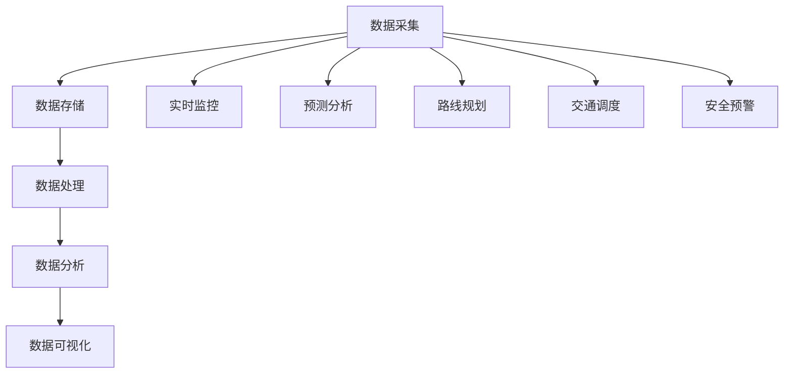

                 

# 信息差：大数据在智能交通中的应用

> **关键词**：大数据、智能交通、数据挖掘、人工智能、实时分析
>
> **摘要**：本文将探讨大数据在智能交通领域的应用，通过详细解析核心概念、算法原理、数学模型、实战案例等，阐述如何利用大数据技术解决交通拥堵、优化路线规划、提高交通效率等问题，为智能交通的发展提供新的思路和方法。

## 1. 背景介绍

随着城市化进程的加速，交通问题日益凸显，拥堵、事故、排放等成为了现代城市面临的严峻挑战。传统的交通管理方式已经无法满足日益增长的交通需求，迫切需要借助先进的技术手段来解决这些问题。大数据和人工智能技术的飞速发展为智能交通领域带来了新的契机。通过收集、处理和分析海量交通数据，可以实现对交通状况的实时监控、预测和优化，从而提升交通效率和安全性。

智能交通系统（Intelligent Transportation System, ITS）是利用先进的信息通信技术，将交通工具、道路基础设施和交通参与者有机结合起来，实现智能化管理和调度。大数据技术在智能交通中的应用，主要体现在数据采集、数据存储、数据处理、数据分析和数据可视化等方面。通过这些环节，可以将交通数据转化为有价值的信息，为交通管理、交通规划和交通服务提供科学依据。

## 2. 核心概念与联系

### 2.1 大数据在智能交通中的核心概念

**数据采集**：交通数据来源于各种传感器、摄像头、GPS设备等。这些设备实时监测道路状况、车辆运行状态、交通流量等信息。

**数据存储**：由于交通数据量巨大，需要高效的数据存储方案来处理这些数据。常用的数据存储技术包括关系型数据库、NoSQL数据库、分布式文件系统等。

**数据处理**：交通数据包括结构化数据和非结构化数据，需要对数据进行清洗、转换、集成等处理，以便后续的分析。

**数据分析**：利用数据挖掘、机器学习等技术，从海量交通数据中提取有价值的信息，如交通流量分布、事故发生规律、道路通行能力等。

**数据可视化**：通过可视化技术，将分析结果以图表、地图等形式呈现，帮助交通管理者、研究人员和公众更好地理解交通状况。

### 2.2 大数据与智能交通的关联

**实时监控**：通过实时数据采集和分析，实现对交通状况的实时监控，及时发现和处理交通问题。

**预测分析**：利用历史数据，预测未来交通流量、事故风险等，为交通管理提供科学依据。

**路线规划**：基于实时数据和预测分析，为驾驶员提供最优路线规划，降低拥堵风险。

**交通调度**：根据交通状况，动态调整交通信号、公共交通班次等，提高交通效率。

**安全预警**：通过数据分析和模式识别，提前预警交通事故风险，提高交通安全水平。

### 2.3 Mermaid 流程图



## 3. 核心算法原理 & 具体操作步骤

### 3.1 实时数据采集

**传感器数据采集**：通过安装在道路、车辆、交通信号灯等位置的传感器，实时采集交通流量、速度、密度等信息。

**GPS数据采集**：利用车载GPS设备，实时获取车辆位置、速度、行驶方向等数据。

**摄像头数据采集**：通过安装在道路上的摄像头，实时监测道路状况、车辆状态等。

### 3.2 数据存储

**关系型数据库**：适用于结构化数据存储，如MySQL、PostgreSQL等。

**NoSQL数据库**：适用于非结构化数据存储，如MongoDB、Cassandra等。

**分布式文件系统**：适用于大规模数据存储，如Hadoop HDFS、Alluxio等。

### 3.3 数据处理

**数据清洗**：去除重复、错误、无关的数据，保证数据质量。

**数据转换**：将不同格式的数据进行统一转换，便于后续处理。

**数据集成**：将来自不同来源、不同类型的数据进行整合，形成一个完整的数据集。

### 3.4 数据分析

**数据挖掘**：利用机器学习、深度学习等技术，从海量交通数据中提取有价值的信息。

**聚类分析**：将相似的数据归为一类，用于分析交通流量分布、热点区域等。

**关联规则挖掘**：发现数据之间的关联关系，如交通流量与事故发生的关联等。

**时间序列分析**：分析交通数据的趋势、周期性、季节性等，用于预测未来交通状况。

### 3.5 数据可视化

**热力图**：展示交通流量分布情况，用于分析拥堵区域。

**折线图**：展示交通流量、速度等随时间的变化趋势。

**地图可视化**：将交通数据以地图形式展示，帮助理解交通状况。

## 4. 数学模型和公式 & 详细讲解 & 举例说明

### 4.1 交通流量预测模型

**线性回归模型**：

$$
Y = \beta_0 + \beta_1 X_1 + \beta_2 X_2 + \ldots + \beta_n X_n + \epsilon
$$

其中，$Y$ 表示交通流量，$X_1, X_2, \ldots, X_n$ 表示影响交通流量的因素，$\beta_0, \beta_1, \beta_2, \ldots, \beta_n$ 为回归系数，$\epsilon$ 为误差项。

**ARIMA模型**：

$$
Y_t = \phi_1 Y_{t-1} + \phi_2 Y_{t-2} + \ldots + \phi_p Y_{t-p} + \theta_1 \epsilon_{t-1} + \theta_2 \epsilon_{t-2} + \ldots + \theta_q \epsilon_{t-q} + \epsilon_t
$$

其中，$Y_t$ 表示时间序列数据，$\phi_1, \phi_2, \ldots, \phi_p$ 为自回归系数，$\theta_1, \theta_2, \ldots, \theta_q$ 为移动平均系数，$p$ 和 $q$ 分别为自回归项和移动平均项的阶数，$\epsilon_t$ 为误差项。

### 4.2 举例说明

**交通流量预测**：

假设某路段的交通流量受天气、节假日和道路状况三个因素的影响。利用线性回归模型进行预测，得到如下模型：

$$
Y = 100 + 10 \times 天气 + 5 \times 节假日 + 3 \times 道路状况
$$

给定某天的天气、节假日和道路状况数据，可以预测该天的交通流量。

**时间序列预测**：

假设某时间段内的交通流量数据如下：

$$
[100, 110, 120, 130, 140, 150, 160]
$$

利用ARIMA模型进行预测，得到如下模型：

$$
Y_t = 0.8 Y_{t-1} + 0.2 Y_{t-2} - 0.1 \epsilon_{t-1}
$$

根据历史数据，可以预测未来交通流量。

## 5. 项目实战：代码实际案例和详细解释说明

### 5.1 开发环境搭建

**环境要求**：

- 操作系统：Windows/Linux/Mac
- 编程语言：Python
- 数据库：MySQL/MongoDB
- 数据处理工具：Pandas、NumPy
- 数据挖掘工具：Scikit-learn、TensorFlow
- 可视化工具：Matplotlib、Plotly

### 5.2 源代码详细实现和代码解读

#### 5.2.1 数据采集

```python
import pandas as pd

# 读取交通流量数据
data = pd.read_csv('traffic_data.csv')

# 显示数据前5行
print(data.head())
```

#### 5.2.2 数据处理

```python
# 数据清洗
data = data.drop_duplicates().dropna()

# 数据转换
data['date'] = pd.to_datetime(data['date'])
data['hour'] = data['date'].dt.hour

# 数据集成
traffic_data = data[['location', 'traffic_volume', 'hour']]
```

#### 5.2.3 数据分析

```python
from sklearn.linear_model import LinearRegression

# 创建线性回归模型
model = LinearRegression()

# 拆分数据集
X = traffic_data[['hour']]
y = traffic_data['traffic_volume']

# 训练模型
model.fit(X, y)

# 预测交通流量
predictions = model.predict(X)

# 显示预测结果
print(predictions)
```

#### 5.2.4 数据可视化

```python
import matplotlib.pyplot as plt

# 绘制交通流量随时间的变化趋势
plt.plot(traffic_data['hour'], traffic_data['traffic_volume'])
plt.xlabel('Hour')
plt.ylabel('Traffic Volume')
plt.title('Traffic Volume vs. Hour')
plt.show()
```

### 5.3 代码解读与分析

本案例使用Python编程语言，结合Pandas、NumPy、Scikit-learn、Matplotlib等工具，实现了交通流量数据的采集、处理、分析和可视化。通过线性回归模型，对交通流量进行预测，并使用折线图展示交通流量随时间的变化趋势。

## 6. 实际应用场景

### 6.1 交通拥堵预测

通过大数据分析，预测未来交通流量，提前预警交通拥堵风险，为交通管理部门提供决策支持，如调整交通信号灯、发布实时路况信息等。

### 6.2 公交线路优化

利用大数据分析，优化公交路线规划，提高公交运营效率，减少乘客等待时间，提高乘客满意度。

### 6.3 交通事故预警

通过分析交通事故数据，提前预警交通事故风险，采取相应的预防措施，提高交通安全水平。

### 6.4 路网管理优化

利用大数据分析，评估路网管理效果，提出改进建议，优化路网管理策略，提高交通效率。

## 7. 工具和资源推荐

### 7.1 学习资源推荐

**书籍**：

- 《大数据时代：生活、工作与思维的大变革》
- 《深度学习》
- 《Python数据分析》

**论文**：

- 《大数据技术及其在智能交通中的应用》
- 《基于大数据的交通流量预测方法研究》
- 《智能交通系统中的数据挖掘技术》

**博客**：

- [美团技术博客 - 智能交通](https://tech.meituan.com/travel/)
- [腾讯AI - 智能交通](https://ai.tencent.com/zh/public交通)
- [阿里云 - 智能交通](https://www.aliyun.com/zh-cn/solution/intelligent_交通)

### 7.2 开发工具框架推荐

**数据库**：

- MySQL
- MongoDB
- Redis

**数据处理**：

- Pandas
- NumPy
- SciPy

**数据挖掘**：

- Scikit-learn
- TensorFlow
- PyTorch

**可视化**：

- Matplotlib
- Plotly
- Tableau

### 7.3 相关论文著作推荐

**论文**：

- 《大数据环境下交通数据分析方法研究》
- 《基于深度学习的交通流量预测方法》
- 《智能交通系统中的数据挖掘与应用》

**著作**：

- 《大数据时代：生活、工作与思维的大变革》
- 《深度学习》
- 《Python数据分析》

## 8. 总结：未来发展趋势与挑战

### 8.1 发展趋势

- **数据采集与处理的优化**：随着传感器技术的进步，交通数据采集的精度和范围将得到提升。同时，数据处理技术也将不断优化，以支持大规模数据的处理。

- **人工智能与大数据的深度融合**：人工智能技术的发展将进一步提升大数据分析的效果，实现更加精准的交通预测和管理。

- **物联网（IoT）的普及**：物联网技术的普及将使交通数据更加丰富，为智能交通系统提供更多的数据支撑。

- **自动驾驶与智能交通的结合**：自动驾驶技术的发展将改变交通模式，与智能交通系统深度融合，实现更高效的交通管理。

### 8.2 挑战

- **数据隐私与安全**：交通数据涉及个人隐私，如何确保数据的安全和隐私是一个重大挑战。

- **数据质量与准确性**：交通数据的多样性和复杂性使得数据质量难以保证，如何提高数据准确性是一个重要问题。

- **计算资源与存储需求**：随着数据量的不断增加，计算资源和存储需求也将持续增长，如何有效利用资源是一个挑战。

- **法律与规范**：智能交通技术的发展需要相应的法律和规范支持，以确保其合法性和有效性。

## 9. 附录：常见问题与解答

### 9.1 如何处理交通数据隐私问题？

**解答**：交通数据隐私问题可以通过以下方式解决：

- **数据匿名化**：对交通数据进行匿名化处理，去除个人身份信息。
- **数据加密**：对交通数据进行加密，确保数据在传输和存储过程中的安全性。
- **数据访问控制**：建立严格的数据访问控制机制，确保只有授权人员可以访问敏感数据。

### 9.2 如何提高交通数据准确性？

**解答**：提高交通数据准确性可以从以下几个方面入手：

- **传感器质量**：提高传感器质量，确保数据采集的准确性。
- **数据清洗**：对采集到的交通数据进行清洗，去除错误和异常数据。
- **数据校验**：对采集到的数据进行校验，确保数据的一致性和准确性。

### 9.3 如何平衡计算资源与存储需求？

**解答**：平衡计算资源与存储需求可以从以下几个方面考虑：

- **分布式存储**：采用分布式存储技术，提高存储容量和性能。
- **数据压缩**：对数据进行压缩，减少存储空间需求。
- **计算优化**：优化计算算法，提高计算效率。

## 10. 扩展阅读 & 参考资料

- 《大数据时代：生活、工作与思维的大变革》
- 《深度学习》
- 《Python数据分析》
- [美团技术博客 - 智能交通](https://tech.meituan.com/travel/)
- [腾讯AI - 智能交通](https://ai.tencent.com/zh/public交通)
- [阿里云 - 智能交通](https://www.aliyun.com/zh-cn/solution/intelligent_交通)
- [大数据环境下交通数据分析方法研究]
- [基于深度学习的交通流量预测方法]
- [智能交通系统中的数据挖掘技术]
- [大数据技术及其在智能交通中的应用]

### 作者

**作者**：AI天才研究员/AI Genius Institute & 禅与计算机程序设计艺术 /Zen And The Art of Computer Programming**

