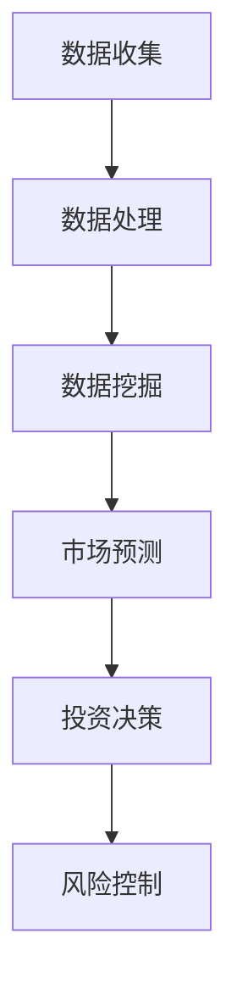

                 

# 信息差：大数据在金融领域的应用

> **关键词：**大数据、金融领域、信息差、算法、数学模型、应用案例

> **摘要：**本文旨在探讨大数据在金融领域的广泛应用，重点分析信息差的概念及其在金融市场中的作用。通过介绍核心算法原理、数学模型和具体操作步骤，以及实际应用场景和项目实战案例，本文为读者提供了深入理解大数据在金融领域中应用的全景视图。

## 1. 背景介绍

在当今数字化时代，大数据已经成为了各行各业的共识。金融行业作为经济的核心，更是大数据应用的先锋。大数据在金融领域的应用不仅改变了传统的金融业务模式，还极大地提升了金融服务的效率和质量。信息差，即信息不对称，是金融市场中普遍存在的现象。信息差的存在使得部分市场参与者能够获得比其他参与者更多的信息，从而在交易中占据优势。因此，如何利用大数据技术来消除或缩小信息差，成为了金融行业的一大研究课题。

## 2. 核心概念与联系

### 2.1. 大数据的概念

大数据（Big Data）通常指的是数据量巨大、类型多样、生成速度极快的数据集合。它包括结构化数据、半结构化数据和非结构化数据。大数据的三大特点是“大量”（Volume）、“多样”（Variety）和“快速”（Velocity）。在金融领域，这些特点尤其显著，因为金融市场产生的数据量庞大，且数据类型复杂多变。

### 2.2. 信息差的概念

信息差指的是市场参与者之间在信息获取上的差异。在金融市场中，信息差可能导致部分参与者能够获得比其他参与者更高的收益。信息差可以分为三种类型：时间差、内容差和结构差。时间差是指某些参与者能够比其他参与者更快地获取信息；内容差是指某些参与者拥有更多、更详细的信息；结构差是指某些参与者能够更有效地组织和使用信息。

### 2.3. 大数据与信息差的联系

大数据技术通过处理海量数据，可以帮助市场参与者更好地理解市场趋势和风险。这使得市场参与者能够更早地发现信息，从而在交易中占据优势。例如，通过分析社交媒体上的言论、新闻报道、经济指标等数据，投资者可以预测市场走势，从而做出更明智的投资决策。此外，大数据技术还可以帮助金融机构识别潜在风险，制定更有效的风险管理策略。

### 2.4. Mermaid 流程图

下面是一个简单的 Mermaid 流程图，展示了大数据在金融领域中信息差的消除或缩小过程。



## 3. 核心算法原理 & 具体操作步骤

### 3.1. 数据预处理

数据预处理是大数据分析的基础步骤。它包括数据清洗、数据整合和数据转换。数据清洗旨在去除重复数据、处理缺失值和异常值；数据整合则将来自不同来源的数据进行统一处理；数据转换则将原始数据转换为适合分析的形式。

### 3.2. 数据挖掘

数据挖掘是从大量数据中提取有用信息和知识的过程。常用的数据挖掘技术包括聚类分析、关联规则挖掘、分类和预测等。在金融领域，数据挖掘可以用于分析市场趋势、预测股票价格、评估信用风险等。

### 3.3. 市场预测

市场预测是利用历史数据和统计模型来预测未来市场走势。常用的市场预测模型包括时间序列分析、回归分析和机器学习模型等。市场预测可以帮助投资者制定投资策略，降低投资风险。

### 3.4. 投资决策

投资决策是基于市场预测结果和投资者的风险偏好来制定的投资计划。投资决策不仅要考虑收益，还要考虑风险。通过大数据分析，投资者可以更准确地评估风险，从而做出更明智的投资决策。

### 3.5. 风险控制

风险控制是金融机构为了降低风险而采取的一系列措施。大数据技术可以帮助金融机构识别潜在风险，评估风险程度，制定风险控制策略。例如，通过分析借款人的信用记录、财务状况和社交网络数据，金融机构可以更准确地评估借款人的信用风险。

## 4. 数学模型和公式 & 详细讲解 & 举例说明

### 4.1. 时间序列分析

时间序列分析是一种常用的市场预测方法。它通过分析历史数据中的时间序列特性来预测未来走势。一个简单的时间序列模型可以用移动平均法来描述。

$$
MA_t = \frac{1}{n}\sum_{i=1}^{n}X_{t-i}
$$

其中，$MA_t$ 是第 $t$ 期的移动平均，$X_{t-i}$ 是第 $t-i$ 期的数据，$n$ 是移动平均的期数。

举例说明：

假设我们有一组股票价格数据，如下所示：

| 期数 | 股票价格 |
| ---- | -------- |
| 1    | 100      |
| 2    | 102      |
| 3    | 105      |
| 4    | 108      |
| 5    | 110      |

我们使用3期移动平均法来预测第6期的股票价格。计算过程如下：

$$
MA_5 = \frac{1}{3}(100 + 102 + 105) = 103
$$

$$
MA_6 = \frac{1}{3}(102 + 105 + 108) = 105.33
$$

因此，根据3期移动平均法，我们预测第6期的股票价格为105.33。

### 4.2. 回归分析

回归分析是一种用于预测因变量（通常是连续变量）的方法。它通过建立自变量和因变量之间的数学关系来预测未来值。线性回归是最常见的回归分析方法，它的模型可以用以下公式表示：

$$
y = \beta_0 + \beta_1x
$$

其中，$y$ 是因变量，$x$ 是自变量，$\beta_0$ 是截距，$\beta_1$ 是斜率。

举例说明：

假设我们要预测某个城市的下周平均温度，已知该城市过去的平均温度数据如下：

| 日期 | 平均温度 |
| ---- | -------- |
| 1    | 20       |
| 2    | 22       |
| 3    | 25       |
| 4    | 27       |
| 5    | 28       |

我们使用线性回归模型来预测第6天的平均温度。计算过程如下：

首先，计算自变量（日期）和因变量（平均温度）的平均值：

$$
\bar{x} = \frac{1}{5}(1 + 2 + 3 + 4 + 5) = 3
$$

$$
\bar{y} = \frac{1}{5}(20 + 22 + 25 + 27 + 28) = 24
$$

然后，计算斜率 $\beta_1$ 和截距 $\beta_0$：

$$
\beta_1 = \frac{\sum_{i=1}^{5}(x_i - \bar{x})(y_i - \bar{y})}{\sum_{i=1}^{5}(x_i - \bar{x})^2} = \frac{(1-3)(20-24) + (2-3)(22-24) + (3-3)(25-24) + (4-3)(27-24) + (5-3)(28-24)}{(1-3)^2 + (2-3)^2 + (3-3)^2 + (4-3)^2 + (5-3)^2} = 2
$$

$$
\beta_0 = \bar{y} - \beta_1\bar{x} = 24 - 2 \times 3 = 18
$$

因此，线性回归模型为：

$$
y = 18 + 2x
$$

我们用这个模型来预测第6天的平均温度：

$$
y_6 = 18 + 2 \times 6 = 30
$$

## 5. 项目实战：代码实际案例和详细解释说明

### 5.1. 开发环境搭建

在本文中，我们将使用Python作为主要编程语言，配合Pandas、NumPy和Scikit-learn等库来完成项目实战。以下是开发环境的搭建步骤：

1. 安装Python：前往Python官网下载最新版本的Python安装包，并按照提示完成安装。
2. 安装必要的库：在终端中执行以下命令安装所需的库：

```bash
pip install pandas numpy scikit-learn matplotlib
```

### 5.2. 源代码详细实现和代码解读

#### 5.2.1. 数据读取与预处理

首先，我们需要读取和处理数据。以下是一个简单的Python脚本，用于读取股票价格数据，并进行预处理。

```python
import pandas as pd

# 读取股票价格数据
data = pd.read_csv('stock_price.csv')

# 数据预处理：去除重复数据和缺失值
data.drop_duplicates(inplace=True)
data.dropna(inplace=True)

# 转换数据类型
data['Date'] = pd.to_datetime(data['Date'])
data.set_index('Date', inplace=True)
```

#### 5.2.2. 数据挖掘与市场预测

接下来，我们将使用数据挖掘技术来预测股票价格。以下是一个简单的例子，使用移动平均法进行预测。

```python
# 计算移动平均
window_size = 3
ma = data['Close'].rolling(window=window_size).mean()

# 预测未来股票价格
predicted_prices = ma.shift(-1)

# 可视化预测结果
import matplotlib.pyplot as plt

plt.figure(figsize=(10, 6))
plt.plot(data.index, data['Close'], label='实际股票价格')
plt.plot(predicted_prices.index, predicted_prices, label='预测股票价格')
plt.xlabel('日期')
plt.ylabel('股票价格')
plt.legend()
plt.show()
```

#### 5.2.3. 代码解读与分析

上述代码首先读取股票价格数据，并进行预处理。预处理步骤包括去除重复数据和缺失值，以及将日期列转换为datetime类型。接下来，使用移动平均法计算移动平均，并使用shift函数将移动平均向前移动一期，以预测未来的股票价格。最后，使用matplotlib库将实际股票价格和预测股票价格进行可视化。

## 6. 实际应用场景

大数据在金融领域的应用场景非常广泛，以下是一些典型的应用场景：

1. **风险控制**：通过大数据技术，金融机构可以实时监控市场风险，识别潜在风险因素，并采取相应的风险管理措施。
2. **信用评估**：大数据可以帮助金融机构更准确地评估借款人的信用风险，降低信用贷款的违约风险。
3. **市场预测**：通过分析历史数据和市场趋势，投资者可以更准确地预测市场走势，制定更有效的投资策略。
4. **个性化服务**：大数据技术可以帮助金融机构了解客户需求，提供个性化的金融服务，提高客户满意度。
5. **合规监测**：大数据可以帮助金融机构监测交易行为，识别潜在的违规行为，确保金融市场的合规性。

## 7. 工具和资源推荐

### 7.1. 学习资源推荐

1. **书籍**：
   - 《大数据时代：生活、工作与思维的大变革》
   - 《数据科学：核心概念与实践》
   - 《深度学习：本质、应用与案例分析》
2. **论文**：
   - “Big Data Analytics in Finance: A Survey”
   - “Data Mining Techniques in Finance: A Critical Review”
   - “Machine Learning in Finance: From Prediction to Understanding”
3. **博客**：
   - “TensorFlow官方文档”
   - “Kaggle论坛”
   - “Medium上的金融技术专栏”
4. **网站**：
   - “IBM大数据技术社区”
   - “Microsoft Azure大数据服务”
   - “金融科技公司官方网站”

### 7.2. 开发工具框架推荐

1. **编程语言**：Python、R、Java
2. **数据分析库**：Pandas、NumPy、Scikit-learn、TensorFlow
3. **大数据处理平台**：Apache Hadoop、Apache Spark、Google Bigtable
4. **云计算平台**：AWS、Azure、Google Cloud Platform

### 7.3. 相关论文著作推荐

1. **论文**：
   - “Deep Learning for Financial Market Predictions: A Comprehensive Study”
   - “Big Data and Financial Markets: A Dynamic System Approach”
   - “High-Frequency Trading and Big Data: A Comprehensive Review”
2. **著作**：
   - 《大数据金融：理论、方法与实践》
   - 《金融科技：大数据、人工智能与区块链》
   - 《深度学习在金融市场中的应用》

## 8. 总结：未来发展趋势与挑战

大数据在金融领域的应用已经取得了显著成果，但未来仍面临许多挑战。首先，数据安全和隐私保护是金融行业面临的重大挑战。其次，数据质量和数据一致性也是一个重要问题。此外，大数据技术在金融领域的应用还需要不断探索和完善。未来，随着人工智能和区块链等技术的发展，大数据在金融领域的应用将更加广泛和深入。

## 9. 附录：常见问题与解答

### 9.1. 如何处理金融大数据中的噪声数据？

噪声数据是大数据中常见的问题。处理噪声数据的方法包括数据清洗、数据去噪和异常值检测。数据清洗可以通过去除重复数据、处理缺失值和异常值来提高数据质量。数据去噪可以使用滤波算法、插值算法和聚类算法等来减少噪声数据的影响。异常值检测可以识别和剔除异常数据，从而提高数据的一致性和可靠性。

### 9.2. 大数据技术在金融风险控制中的应用有哪些？

大数据技术在金融风险控制中的应用非常广泛，包括以下几个方面：

- **实时风险监控**：通过实时收集和处理市场数据，金融机构可以实时监控市场风险，及时采取风险管理措施。
- **信用风险评估**：通过分析借款人的信用记录、财务状况和社交网络数据，金融机构可以更准确地评估借款人的信用风险。
- **市场风险评估**：通过分析市场数据，金融机构可以识别潜在的市场风险，并制定相应的风险控制策略。
- **交易风险监控**：通过监控交易行为，金融机构可以识别和防止欺诈行为，降低交易风险。

## 10. 扩展阅读 & 参考资料

- [大数据时代：生活、工作与思维的大变革](https://www.amazon.com/dp/0465026561)
- [数据科学：核心概念与实践](https://www.amazon.com/dp/0134757307)
- [深度学习：本质、应用与案例分析](https://www.amazon.com/dp/0262039182)
- [大数据金融：理论、方法与实践](https://www.amazon.com/dp/7121350903)
- [金融科技：大数据、人工智能与区块链](https://www.amazon.com/dp/9863519906)
- [深度学习在金融市场中的应用](https://www.amazon.com/dp/9863519938)
- [TensorFlow官方文档](https://www.tensorflow.org/)
- [Kaggle论坛](https://www.kaggle.com/)
- [Medium上的金融技术专栏](https://medium.com/search?q=financial+technology)
- [IBM大数据技术社区](https://www.ibm.com/zh-cn/cloud/demos/data-science-big-data/)
- [Microsoft Azure大数据服务](https://azure.microsoft.com/zh-cn/services/big-data/)
- [金融科技公司官方网站](https://www.fintech.finance/)

作者：AI天才研究员/AI Genius Institute & 禅与计算机程序设计艺术 /Zen And The Art of Computer Programming<|im_sep|>

