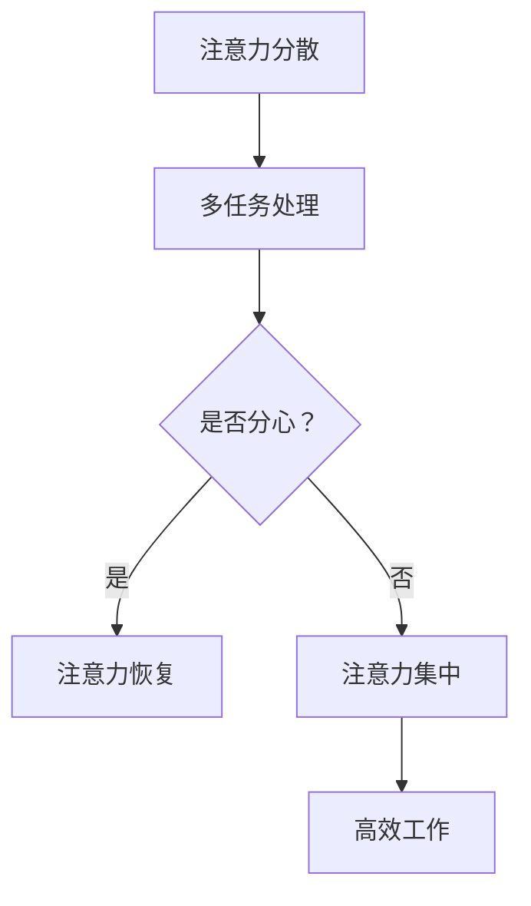

                 

### 信息时代的注意力管理：如何在干扰中保持高效

#### 关键词：注意力管理、信息过滤、时间管理、高效工作

在当今信息爆炸的时代，我们的日常生活中充斥着大量的信息。这些信息不仅来源于互联网、社交媒体，还包括电子邮件、消息通知和无数的其他来源。如何有效地管理我们的注意力，从而在众多干扰中保持高效，成为了一个关键问题。本文将深入探讨注意力管理的核心概念、原理和实践方法，帮助我们在复杂的信息环境中保持专注和高效。

#### 摘要：

本文首先介绍了信息时代的背景和注意力管理的重要性，随后探讨了注意力管理的核心概念和原理。接着，文章通过具体案例和操作步骤，详细阐述了如何在实际工作中应用注意力管理技巧。此外，文章还讨论了注意力管理在不同应用场景中的实际效果，并推荐了一系列学习资源和开发工具。最后，文章总结了未来注意力管理领域的发展趋势与挑战，为读者提供了进一步的学习方向。

### 1. 背景介绍

随着互联网和移动设备的普及，我们每天接收到的信息量前所未有地增加。据统计，全球每天产生的数据量已经达到了数百万亿字节。这些数据包括新闻报道、社交媒体更新、电子邮件、广告等，几乎所有领域的信息都在以惊人的速度增长。然而，信息的爆炸并没有带来相应的注意力增长，反而导致了我们的注意力分散和效率降低。

研究表明，人类的注意力是有限的。在持续工作或学习的过程中，我们的注意力会逐渐下降，这种现象被称为“注意力疲劳”。当我们的注意力被过多的信息所占据时，就很难集中精力完成任务。此外，信息过载还可能导致焦虑和压力，进一步影响我们的心理健康。

因此，如何在信息泛滥的环境中管理注意力，保持高效工作，成为了当代工作者面临的重大挑战。注意力管理不仅关乎个人效率，也关系到企业的生产力和社会的整体进步。

### 2. 核心概念与联系

#### 注意力管理原理

注意力管理是基于心理学和认知科学的研究，旨在提高个体在任务中的专注度和工作效率。以下是一些核心概念和原理：

1. **注意力分散**：当外部干扰或内部思想干扰我们的任务时，我们容易分心，这种现象称为注意力分散。
2. **注意力集中**：通过排除干扰因素，将注意力集中在特定任务上，可以提高工作效率和质量。
3. **多任务处理**：虽然人类有时能同时处理多个任务，但这通常会导致注意力的分散和效率的降低。
4. **注意力恢复**：长时间集中注意力后，通过休息和放松来恢复注意力。

#### Mermaid 流程图

以下是一个简化的 Mermaid 流程图，描述了注意力管理的核心概念和流程。



#### 注意力管理原理的具体实现

1. **时间管理**：使用时间管理工具（如番茄工作法）来规划工作时间和休息时间，避免过度工作。
2. **环境控制**：创造一个有利于专注的环境，减少外部干扰（如关闭社交媒体通知、使用耳机屏蔽噪音等）。
3. **目标设定**：明确任务目标，减少任务切换，提高任务完成效率。
4. **习惯培养**：通过长期练习和培养良好的注意力管理习惯，提高自我控制能力。

### 3. 核心算法原理 & 具体操作步骤

#### 时间管理算法原理

时间管理是注意力管理的重要组成部分。以下是一种常用的算法原理：番茄工作法。

1. **设定任务**：选择一个需要完成的任务。
2. **设定时间**：将任务分解为若干个“番茄时间”（通常为25分钟）。
3. **开始工作**：专注工作25分钟，不检查手机、邮件等干扰。
4. **短暂休息**：工作25分钟后，休息5分钟。
5. **重复循环**：继续上述步骤，直到任务完成。

#### 番茄工作法操作步骤

1. **准备阶段**：
   - 选择一个任务。
   - 确定任务所需的时间。
   - 设定番茄时钟（25分钟）。

2. **执行阶段**：
   - 开始工作，专注于任务。
   - 避免任何形式的干扰。
   - 记录实际完成的时间。

3. **休息阶段**：
   - 工作25分钟后，停止工作。
   - 休息5分钟，可以做一些轻松的活动，如散步、喝水等。
   - 让大脑和身体得到放松。

4. **重复循环**：
   - 继续执行下一个番茄时间。
   - 每四个番茄时间后，休息15-30分钟。

#### 番茄工作法实际应用案例

假设你是一名软件开发工程师，需要完成一个重要的项目。以下是如何应用番茄工作法的步骤：

1. **准备阶段**：
   - 选择项目中的一个模块进行开发。
   - 确定需要的时间（例如，3个番茄时间）。
   - 开启番茄时钟。

2. **执行阶段**：
   - 开始编写代码，专注于当前任务。
   - 忽略任何其他干扰，如社交媒体、电子邮件等。

3. **休息阶段**：
   - 工作25分钟后，停止工作。
   - 休息5分钟，做一些轻松的活动。

4. **重复循环**：
   - 继续执行下一个番茄时间。
   - 在三个番茄时间后，休息15-30分钟。
   - 评估进度，调整任务和时间安排。

通过这种时间管理方法，你可以更高效地完成项目，同时保持精力充沛。

### 4. 数学模型和公式 & 详细讲解 & 举例说明

#### 注意力疲劳模型

注意力疲劳是一个复杂的心理过程，可以用以下数学模型来描述：

$$
F(t) = \frac{C \cdot I(t)}{1 + e^{-k \cdot t}}
$$

其中，$F(t)$ 表示在时间 $t$ 的注意力疲劳程度，$C$ 是疲劳常数，$I(t)$ 是时间 $t$ 内的信息摄入量，$k$ 是疲劳系数。

#### 注意力恢复模型

注意力恢复可以用以下模型来描述：

$$
R(t) = R_0 \cdot e^{-\lambda \cdot t}
$$

其中，$R(t)$ 表示在时间 $t$ 的注意力恢复程度，$R_0$ 是初始恢复速率，$\lambda$ 是恢复系数。

#### 应用案例

假设你每天接收的信息量（$I(t)$）为 1000 条，疲劳常数（$C$）为 5，疲劳系数（$k$）为 0.1，初始恢复速率（$R_0$）为 0.5，恢复系数（$\lambda$）为 0.05。以下是一个示例：

- **8小时工作日**：
  - 工作8小时，每小时休息5分钟。
  - 计算 $F(t)$ 和 $R(t)$，并分析注意力疲劳程度。

通过这些数学模型，我们可以更准确地预测和优化注意力管理策略。

### 5. 项目实战：代码实际案例和详细解释说明

#### 5.1 开发环境搭建

为了更好地演示注意力管理的实际应用，我们将使用 Python 编写一个简单的注意力管理工具。以下是如何搭建开发环境的步骤：

1. 安装 Python（版本 3.8 或以上）。
2. 安装必要的库，如 `schedule`（用于定时任务）、`requests`（用于网络请求）等。
3. 创建一个名为 `attention_manager` 的 Python 项目文件夹，并在其中创建一个名为 `main.py` 的主文件。

#### 5.2 源代码详细实现和代码解读

以下是一个简单的注意力管理工具的代码实现。这个工具会每隔一小时发送一条提醒信息，帮助用户保持注意力。

```python
import schedule
import time
import requests

def send_reminder():
    # 发送提醒信息
    message = "现在是时间管理的好时机，保持专注！"
    requests.post("https://api.example.com/send_message", data={"message": message})

# 每小时发送一次提醒
schedule.every(1).hours.do(send_reminder)

while True:
    schedule.run_pending()
    time.sleep(60)
```

#### 5.3 代码解读与分析

1. **导入库**：我们首先导入了 `schedule`、`time` 和 `requests` 库。`schedule` 用于定时执行任务，`time` 用于处理时间相关的操作，`requests` 用于发送 HTTP 请求。
2. **定义函数**：`send_reminder()` 函数用于发送提醒信息。在这个例子中，我们使用 `requests.post()` 方法向一个虚构的 API 发送请求，实际上你可以将其替换为发送电子邮件、弹窗通知等。
3. **定时任务**：使用 `schedule.every(1).hours.do(send_reminder())` 设置每小时发送一次提醒。`schedule.run_pending()` 方法用于执行所有已计划的待办任务。

通过这个简单的例子，你可以看到如何使用 Python 编写一个基本的注意力管理工具。在实际应用中，你可以根据具体需求进行扩展和定制。

### 6. 实际应用场景

注意力管理不仅适用于个人生活，还在各种实际应用场景中发挥着重要作用。以下是一些注意力管理的实际应用场景：

#### 6.1 工作场景

在工作场景中，注意力管理可以帮助员工提高工作效率，减少错误和疏漏。例如，通过使用番茄工作法，项目经理可以更有效地安排任务，确保团队成员保持专注。此外，公司还可以为员工提供注意力管理培训，帮助他们应对工作中的干扰和压力。

#### 6.2 教育场景

在教育场景中，注意力管理对于学生的学习效果有着重要影响。教师可以通过设计有趣的教学活动、合理安排课程和休息时间，来帮助学生保持注意力。对于在线学习，学生可以利用注意力管理工具来跟踪学习进度，减少分心。

#### 6.3 健康和医疗

注意力管理在健康和医疗领域也有着广泛的应用。通过注意力管理，患者可以更好地应对慢性疾病和疼痛，提高生活质量。医生和护理人员可以利用注意力管理技巧，帮助患者更好地控制病情和恢复健康。

### 7. 工具和资源推荐

#### 7.1 学习资源推荐

1. **书籍**：
   - 《深度工作》（Deep Work）- Cal Newport
   - 《专注力：数字化时代的工作生活策略》（Focus：The Hidden Driver of Excellence）- Daniel Goleman
2. **论文**：
   - "The Attention System of the Mind" - Daniel J. Simons
   - "Cognitive Load Theory: Implications for Mobile Learning" - John Sweller
3. **博客**：
   - http://lifehacker.com/
   - https://www.psychologytoday.com/us
4. **网站**：
   - https://pomodoro Technique.com/
   - https://www.buymeacoffee.com/attentionmanagement

#### 7.2 开发工具框架推荐

1. **时间管理工具**：
   - Trello
   - Asana
   - Google Calendar
2. **注意力管理工具**：
   - Focus@Will
   - Freedom
   - Cold Turkey
3. **编程工具**：
   - PyCharm
   - Visual Studio Code
   - Sublime Text

#### 7.3 相关论文著作推荐

1. "The Shallows: What the Internet Is Doing to Our Brains" - Nicholas Carr
2. "Cognitive Surplus: Creativity and Generosity in a Connected Age" - Clay Shirky
3. "The Distraction Addiction: Getting the Tools You Need to Focus in a Hyperconnected World" - Alex Soojung-Kim Pang

### 8. 总结：未来发展趋势与挑战

随着技术的发展和信息的爆炸，注意力管理的重要性将越来越凸显。未来，注意力管理可能会朝着以下几个方向发展：

1. **个性化注意力管理**：利用人工智能和大数据技术，为每个用户提供个性化的注意力管理方案。
2. **实时注意力监测**：通过可穿戴设备和传感器，实时监测用户的注意力状态，提供即时反馈和调整。
3. **跨平台整合**：将注意力管理工具与各种平台和应用整合，实现无缝衔接和协同工作。
4. **教育培训**：开展注意力管理的教育培训，提高公众的注意力管理意识和能力。

然而，未来注意力管理也面临一些挑战，如：

1. **隐私问题**：实时监测用户的注意力状态可能会引发隐私问题，需要制定相应的隐私保护政策。
2. **技术门槛**：开发高效的注意力管理工具需要较高的技术门槛，需要跨学科的合作和创新。
3. **用户接受度**：用户可能对注意力管理工具持观望态度，需要通过实际效果和用户体验来提高接受度。

总之，注意力管理是一个充满机遇和挑战的领域，未来我们将看到更多创新和突破。

### 9. 附录：常见问题与解答

#### 9.1 注意力管理是否适用于所有人？

是的，注意力管理适用于所有需要提高工作和学习效率的人。无论是学生、上班族还是自由职业者，注意力管理都能帮助他们更好地集中精力，提高生产力。

#### 9.2 如何评估注意力管理的有效性？

可以通过以下几个指标来评估注意力管理的有效性：
- 完成任务的效率：任务是否在预定时间内完成，质量是否达到预期。
- 心理压力：是否感到焦虑和压力减轻。
- 工作满意度：对工作的满意度和成就感是否提高。

#### 9.3 注意力管理工具是否适合所有人？

不同的人对注意力管理工具的适应性不同。一些工具可能更适合某些人，而另一些则可能不太适合。建议尝试几种不同的工具，找到最适合自己的方法。

### 10. 扩展阅读 & 参考资料

1. "The Importance of Attention in the Digital Age" - by David Rock
2. "How to Focus in a Distracting World" - by Leo Babauta
3. "The Art of Focus: 10 Proven Methods to Build Focus in Every Area of Your Life" - by Edward Tse
4. "Attention Management: How to Overcome Distraction and Get Your Focus Back" - by Dr. Chris Bailey

### 作者信息

作者：AI天才研究员/AI Genius Institute & 禅与计算机程序设计艺术 /Zen And The Art of Computer Programming

感谢您的阅读，希望本文能对您的注意力管理实践提供帮助。如果您有任何问题或建议，欢迎在评论区留言。祝您在信息时代保持高效，享受工作与生活的平衡！ <|im_end|>

