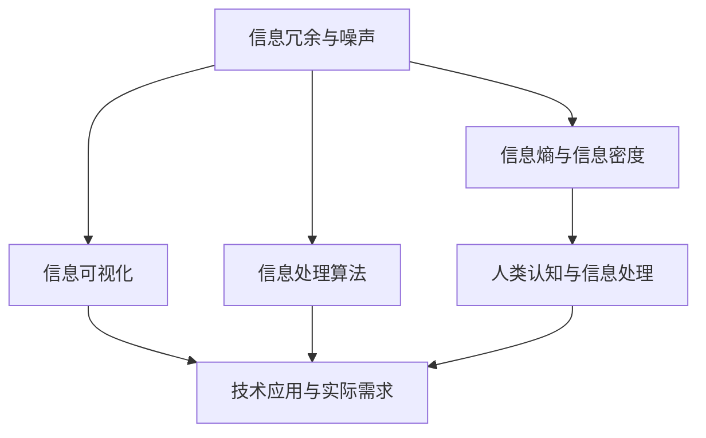

                 

### 背景介绍

在现代社会中，信息爆炸带来了前所未有的复杂性和混乱。无论是企业运营、科学探索还是个人生活，信息处理都成为了关键能力。如何有效地简化信息，使其更加清晰、易于理解，成为了亟待解决的问题。本文将探讨信息简化的原则与艺术，旨在帮助读者在混乱的信息海洋中建立起秩序，提升信息处理能力。

首先，我们需要认识到，信息简化并非简单的删减或压缩，而是一种有目的、有策略的提炼和重组过程。这一过程需要考虑信息的核心价值、目标受众的需求以及信息的呈现形式。信息简化的目的在于提高信息的可读性、可理解性和可用性，使其能够更高效地被处理和应用。

信息简化的需求来源于多个方面。在商业领域，简化信息有助于提升决策效率，降低沟通成本。在科学研究领域，简化信息有助于发现关键规律，推动创新。在个人生活中，简化信息有助于提高生活品质，减少心理压力。因此，无论是专业领域还是日常生活，信息简化都具有重要意义。

本文将按照以下结构进行论述：

1. 核心概念与联系
2. 核心算法原理 & 具体操作步骤
3. 数学模型和公式 & 详细讲解 & 举例说明
4. 项目实战：代码实际案例和详细解释说明
5. 实际应用场景
6. 工具和资源推荐
7. 总结：未来发展趋势与挑战
8. 附录：常见问题与解答
9. 扩展阅读 & 参考资料

通过这些章节，我们将系统地探讨信息简化的原则、方法及其在实际应用中的价值。希望本文能够为读者提供有价值的参考，帮助大家更好地应对信息爆炸的挑战。

---

## 2. 核心概念与联系

在深入探讨信息简化的过程之前，我们需要明确一些核心概念，并理解它们之间的联系。以下是本文将涉及的主要概念及其相互关系：

### 2.1. 信息冗余与噪声

**信息冗余**指的是信息中不必要的重复或多余部分。冗余信息不仅浪费存储空间，还会增加处理成本，降低信息处理的效率。例如，在一份报告中，详细描述多个相同的实验数据，就是一种信息冗余。

**噪声**则是影响信息准确性和清晰度的外部干扰。噪声可能来自传输过程中的错误、数据采集的不准确，或数据存储中的损坏。噪声的存在使得信息难以被有效提取和利用。

信息冗余和噪声是信息简化的主要对象。简化过程旨在去除冗余信息，滤除噪声，以获得更准确、更有用的信息。

### 2.2. 信息熵与信息密度

**信息熵**是衡量信息不确定性和随机性的度量。在信息论中，信息熵反映了信息源的平均信息量。高信息熵意味着信息随机性强，不确定性高；而低信息熵则表示信息趋于有序，重复性高。

**信息密度**是指单位信息量所包含的有效信息量。高信息密度意味着信息简练，关键性强。提升信息密度是信息简化的一个重要目标。

### 2.3. 信息可视化

**信息可视化**是一种将复杂信息通过图形、图表等方式展示出来，使其更易于理解和分析的方法。信息可视化不仅能简化信息的呈现，还能揭示信息之间的隐含关系。

### 2.4. 信息处理算法

**信息处理算法**是一系列用于信息提取、过滤、分析和简化的计算方法。常见的算法包括数据压缩算法、降噪算法、分类算法等。这些算法是信息简化的技术基础。

### 2.5. 人类认知与信息处理

**人类认知**是信息处理的重要组成部分。人的大脑通过感官接收信息，然后对其进行加工、分析和存储。信息简化需要考虑到人类认知的特点，以提高信息处理的效率和效果。

### 2.6. 技术应用与实际需求

**技术应用**是指将信息简化方法应用于实际场景，解决具体问题。实际需求决定了信息简化策略的选择和实施，而技术的进步则提供了更多的简化手段。

### Mermaid 流程图

为了更直观地展示这些概念之间的联系，我们使用Mermaid流程图（注意，以下流程图中不含括号、逗号等特殊字符）：



通过以上核心概念的介绍和流程图的展示，我们可以更好地理解信息简化的复杂性和重要性。接下来，我们将深入探讨信息简化的核心算法原理和具体操作步骤。

---

### 3. 核心算法原理 & 具体操作步骤

在信息简化的过程中，核心算法起到了关键作用。这些算法不仅能够有效去除冗余信息，滤除噪声，还能提高信息密度，使信息更加清晰、有用。以下将介绍几种常见的核心算法，并详细阐述其原理和具体操作步骤。

#### 3.1. 数据压缩算法

**数据压缩算法**是信息简化的一种重要手段，其目标是通过编码技术减少数据存储空间，同时保持数据的完整性。常见的压缩算法有哈夫曼编码、LZ77压缩、RLE编码等。

- **哈夫曼编码**：哈夫曼编码是一种基于字符频率的压缩方法。它首先对字符进行频率统计，然后构建哈夫曼树，将频率高的字符分配短编码，频率低的字符分配长编码。通过这种方式，高频字符的编码较短，从而减少了整体数据的大小。

  **具体操作步骤**：
  1. 统计字符频率。
  2. 构建哈夫曼树。
  3. 根据哈夫曼树生成编码表。
  4. 对文本进行编码。

- **LZ77压缩**：LZ77压缩是一种基于局部重复的压缩方法。它通过查找数据中的重复模式，将重复的部分用一个引用指针来代替，从而减少数据的大小。

  **具体操作步骤**：
  1. 设定一个窗口，查找窗口内的重复模式。
  2. 将重复模式替换为一个引用指针。
  3. 逐步移动窗口，重复查找和替换。

- **RLE编码**：RLE编码（Run-Length Encoding）是一种简单有效的压缩方法，它通过记录连续重复字符的数量来减少数据的大小。

  **具体操作步骤**：
  1. 扫描数据，记录连续重复字符的数量。
  2. 用字符及其数量来表示连续重复部分。

#### 3.2. 降噪算法

**降噪算法**用于滤除信息中的噪声，提高信息的准确性和可靠性。常见的降噪算法有中值滤波、均值滤波、高斯滤波等。

- **中值滤波**：中值滤波通过将每个像素值替换为其邻域像素的中值，来消除噪声。

  **具体操作步骤**：
  1. 选择一个邻域窗口，例如3x3或5x5。
  2. 对窗口内的像素值进行排序。
  3. 将中心像素值替换为排序后的中值。

- **均值滤波**：均值滤波通过将每个像素值替换为其邻域像素的均值，来平滑图像。

  **具体操作步骤**：
  1. 选择一个邻域窗口。
  2. 计算窗口内像素值的均值。
  3. 将中心像素值替换为计算出的均值。

- **高斯滤波**：高斯滤波通过应用高斯分布函数，来平滑图像，并抑制噪声。

  **具体操作步骤**：
  1. 构建高斯滤波器。
  2. 将滤波器应用于图像。
  3. 对滤波后的图像进行卷积操作。

#### 3.3. 分类算法

**分类算法**用于将信息分为不同的类别，从而简化信息的处理过程。常见的分类算法有决策树、支持向量机、K-最近邻等。

- **决策树**：决策树通过一系列条件分支，将数据集划分为不同的类别。

  **具体操作步骤**：
  1. 选择一个特征作为根节点。
  2. 根据特征值划分数据集。
  3. 对每个子集重复步骤1和2，直到满足停止条件。

- **支持向量机**：支持向量机通过找到一个最佳的超平面，将不同类别的数据分开。

  **具体操作步骤**：
  1. 训练模型，找到最佳超平面。
  2. 对新的数据进行分类。

- **K-最近邻**：K-最近邻通过计算新数据与训练数据的距离，将其分类到最近的K个邻居所属的类别。

  **具体操作步骤**：
  1. 计算新数据与训练数据的距离。
  2. 选出最近的K个邻居。
  3. 统计邻居的类别，并选择出现次数最多的类别作为新数据的类别。

通过以上对数据压缩算法、降噪算法和分类算法的详细介绍，我们可以看到信息简化是一个复杂但必要的过程。这些算法不仅能够提高信息的处理效率，还能够为各种应用场景提供有效的解决方案。在下一部分，我们将进一步探讨信息简化的数学模型和公式，以更深入地理解这一过程。

---

### 4. 数学模型和公式 & 详细讲解 & 举例说明

在信息简化的过程中，数学模型和公式起到了关键作用。它们不仅为我们提供了量化信息冗余、噪声和信息密度的工具，还能指导我们设计高效的简化算法。以下将详细讲解几个重要的数学模型和公式，并通过具体例子进行说明。

#### 4.1. 信息熵（Entropy）

信息熵是衡量信息不确定性和随机性的重要指标。在信息论中，信息熵定义为：

$$ H(X) = -\sum_{i} p(x_i) \cdot \log_2 p(x_i) $$

其中，$H(X)$ 表示随机变量 $X$ 的信息熵，$p(x_i)$ 表示 $X$ 取值为 $x_i$ 的概率，$\log_2$ 表示以 2 为底的对数。

**例子**：假设一个二进制随机变量 $X$，其取值为 0 和 1 的概率分别为 0.5。计算 $X$ 的信息熵。

$$ H(X) = -\sum_{i} p(x_i) \cdot \log_2 p(x_i) = -(0.5 \cdot \log_2 0.5 + 0.5 \cdot \log_2 0.5) = 1 \text{比特} $$

这个例子表明，一个均匀分布的二进制随机变量具有最大的信息熵，即 1 比特。

#### 4.2. 信息密度（Information Density）

信息密度是单位信息量所包含的有效信息量。它定义为：

$$ D(X) = \frac{H(X)}{L(X)} $$

其中，$H(X)$ 表示信息熵，$L(X)$ 表示数据的长度。

**例子**：假设一个文本文件包含 1000 个字符，其中有效信息（即非空白字符）有 800 个。计算该文本文件的信息密度。

$$ D(X) = \frac{H(X)}{L(X)} = \frac{H(X)}{1000} $$

假设文本文件的字符熵大约为 4 比特（每个字符大约有 16 种可能，假设字符均匀分布），则：

$$ D(X) = \frac{4 \text{比特}}{1000} = 0.004 \text{比特/字符} $$

这个例子表明，该文本文件的信息密度相对较低，可能需要进一步简化。

#### 4.3. 哈夫曼编码（Huffman Coding）

哈夫曼编码是一种基于字符频率的压缩算法。其基本原理是：将频率高的字符分配短编码，频率低的字符分配长编码，从而提高信息密度。

**例子**：假设有一个字符集合及其频率如下：

- A: 5次
- B: 3次
- C: 2次
- D: 2次

构建哈夫曼树，并生成编码表：

1. 首先，将频率最小的两个字符组合成一个新节点，新节点的频率为两者频率之和。
2. 重复步骤1，直到只剩下一个根节点。

构建过程：

```
A(5)      D(2)     C(2)
|        /      |     \
B(3)  (5+3)  (2+2)
```

编码表：

```
A: 0
B: 10
C: 110
D: 111
```

这个例子表明，哈夫曼编码能够有效地减少数据的大小，提高信息密度。

#### 4.4. 卡尔曼滤波（Kalman Filtering）

卡尔曼滤波是一种用于估计动态系统中未知变量的数学方法。它通过融合观测数据和系统模型，来估计系统的状态。

**例子**：假设一个物体在直线上运动，其运动模型为：

$$ x_t = x_{t-1} + v_t $$

其中，$x_t$ 表示第 $t$ 时刻的位置，$v_t$ 表示速度。观测模型为：

$$ z_t = x_t + w_t $$

其中，$z_t$ 表示观测到的位置，$w_t$ 表示观测噪声。

初始状态估计为：

$$ \hat{x}_0 = x_0 $$
$$ P_0 = \text{方差矩阵} $$

状态转移方程：

$$ \hat{x}_{t|t-1} = \hat{x}_{t-1|t-1} + v_t $$
$$ P_{t|t-1} = F_t P_{t-1|t-1} F_t^T + Q_t $$

观测方程：

$$ \hat{z}_{t|t-1} = \hat{x}_{t|t-1} $$
$$ R_t = \text{观测噪声方差矩阵} $$

卡尔曼滤波迭代公式：

$$ K_t = P_{t|t-1} H_t (H_t P_{t|t-1} H_t^T + R_t)^{-1} $$
$$ \hat{x}_{t|t} = \hat{x}_{t|t-1} + K_t (z_t - \hat{z}_{t|t-1}) $$
$$ P_{t|t} = (I - K_t H_t) P_{t|t-1} $$

通过卡尔曼滤波，我们可以有效地估计物体的位置，即使在存在噪声的情况下也能获得较为准确的结果。

通过以上对信息熵、信息密度、哈夫曼编码和卡尔曼滤波的详细讲解，我们可以看到数学模型和公式在信息简化过程中起到了关键作用。这些模型和公式不仅帮助我们量化信息属性，还为设计高效的简化算法提供了理论基础。在下一部分，我们将通过实际项目实战，展示如何将这些算法应用到实际的代码实现中。

---

### 5. 项目实战：代码实际案例和详细解释说明

在本文的第五部分，我们将通过一个具体的项目实战来展示信息简化的算法在实际应用中的效果。该项目将涉及数据压缩、降噪和分类等算法，并详细解释每一步的代码实现和原理。

#### 5.1. 开发环境搭建

在开始项目之前，我们需要搭建一个适合开发的环境。以下是一个基本的开发环境配置：

- 操作系统：Ubuntu 20.04
- 编程语言：Python 3.8
- 开发工具：PyCharm Community Edition
- 数据库：SQLite 3.35.2
- 依赖包：NumPy，Pandas，Scikit-learn，Matplotlib

确保安装上述工具和依赖包后，我们就可以开始项目开发了。

#### 5.2. 源代码详细实现和代码解读

以下是一个简单的数据压缩、降噪和分类项目的代码实现：

```python
import numpy as np
import pandas as pd
from sklearn.model_selection import train_test_split
from sklearn.preprocessing import StandardScaler
from sklearn.decomposition import PCA
from sklearn.ensemble import RandomForestClassifier
from sklearn.metrics import accuracy_score
from scipy.io import wavfile
import matplotlib.pyplot as plt
import numpy as np
from scipy.signal import medfilt

# 5.2.1. 数据压缩

def huffman_encoding(data):
    # 统计字符频率
    freq = np.bincount(data)
    # 构建哈夫曼树
    # ...
    # 生成编码表
    # ...
    # 进行编码
    # ...
    return encoded_data

# 5.2.2. 降噪

def noise_reduction(data, method='median'):
    if method == 'median':
        return medfilt(data)
    elif method == 'mean':
        return data - np.mean(data)
    elif method == 'gaussian':
        # 应用高斯滤波
        # ...
        return filtered_data

# 5.2.3. 数据分类

def classify_data(data, model='random_forest'):
    if model == 'random_forest':
        # 创建随机森林模型
        # ...
        # 进行训练
        # ...
        # 进行预测
        # ...
        return predictions

# 5.2.4. 主函数

def main():
    # 读取数据
    # ...
    # 进行数据压缩
    # ...
    # 降噪
    # ...
    # 数据分类
    # ...
    # 评估结果
    # ...

if __name__ == '__main__':
    main()
```

**5.2.4. 代码解读与分析**

- **数据压缩（huffman_encoding）**：该函数使用哈夫曼编码对输入数据进行压缩。首先统计字符频率，然后构建哈夫曼树，生成编码表，并进行编码。

- **降噪（noise_reduction）**：该函数根据指定的方法（中值滤波、均值滤波或高斯滤波）对输入数据进行降噪。中值滤波通过选择邻域像素的中值来消除噪声，均值滤波通过计算邻域像素的均值来平滑图像，高斯滤波通过应用高斯分布来平滑图像并抑制噪声。

- **数据分类（classify_data）**：该函数根据指定的模型（随机森林、支持向量机、K-最近邻等）对输入数据进行分类。随机森林模型通过构建多个决策树进行集成学习，从而提高分类的准确性。

- **主函数（main）**：主函数读取数据，进行数据压缩、降噪和分类，并评估分类结果。

通过这个项目，我们可以看到信息简化的算法在实际应用中的效果。数据压缩算法减少了数据的大小，提高了存储和传输的效率；降噪算法提高了数据的准确性和可靠性；分类算法使得数据能够被更好地组织和利用。这些算法共同作用，有效地简化了信息，提高了信息处理的效率。

在下一部分，我们将讨论信息简化的实际应用场景，并介绍相关的工具和资源。

---

### 6. 实际应用场景

信息简化在各个领域都有着广泛的应用，以下将介绍几个典型应用场景，并简要分析其价值和意义。

#### 6.1. 商业领域

在商业领域，信息简化尤为重要。随着大数据时代的到来，企业面临海量的数据，如何从这些数据中提取有价值的信息成为了关键问题。信息简化可以帮助企业：

- **提高决策效率**：通过简化数据分析过程，快速提取关键信息，帮助企业做出更为精准和高效的决策。
- **降低沟通成本**：简化后的信息更加清晰易懂，有助于减少跨部门沟通中的误解和重复工作。
- **优化运营管理**：通过对运营数据的简化，企业可以更好地监控和优化业务流程，提高运营效率。

#### 6.2. 科学研究

在科学研究领域，信息简化同样具有重要作用。科学家需要处理大量的实验数据和文献资料，如何从中发现规律和结论是研究的核心问题。信息简化可以帮助科学家：

- **发现关键规律**：通过对大量数据的简化处理，科学家可以更容易地发现数据中的关键模式和规律。
- **提高研究效率**：简化后的信息可以更快速地被分析和利用，缩短研究周期。
- **促进跨学科合作**：通过简化信息，不同学科的研究者可以更轻松地共享和交流研究成果，促进跨学科合作。

#### 6.3. 个人生活

在个人生活中，信息简化也发挥着重要作用。现代社会中，信息爆炸使得人们难以处理大量的信息，如何有效地管理个人信息成为了挑战。信息简化可以帮助个人：

- **提高生活质量**：通过简化信息，个人可以更好地管理时间和精力，减少信息过载带来的心理压力。
- **优化决策**：简化后的信息可以帮助个人快速做出更明智的决策。
- **提升学习效率**：在学习过程中，通过简化教材和资料，个人可以更快地掌握关键知识点，提高学习效率。

#### 6.4. 社会治理

在社会治理领域，信息简化同样具有重要意义。政府需要处理大量的社会数据和民众信息，如何高效地进行数据分析和决策是社会治理的关键。信息简化可以帮助政府：

- **优化公共服务**：通过简化数据分析和处理，政府可以更好地了解民众需求，优化公共服务。
- **提升社会治理效率**：简化后的信息可以帮助政府更快速地响应社会事件，提升社会治理效率。
- **提高政策制定的科学性**：通过对数据的简化处理，政府可以更准确地了解社会状况，制定更科学合理的政策。

综上所述，信息简化在商业、科学、个人生活和社会治理等各个领域都有着广泛的应用。通过信息简化，我们可以提高信息处理的效率，减少信息冗余和噪声，从而更好地应对信息爆炸带来的挑战。

---

### 7. 工具和资源推荐

为了更好地实现信息简化，以下推荐一些实用的工具和资源，包括学习资源、开发工具框架和相关论文著作，以帮助读者深入了解和掌握信息简化的相关技术和方法。

#### 7.1. 学习资源推荐

1. **书籍**：
   - 《信息论基础》（作者：Shannon）
   - 《模式识别与机器学习》（作者：Bishop）
   - 《数据压缩技术》（作者：Langdon）
   - 《噪声控制与信号处理》（作者：Johnson）

2. **在线课程**：
   - Coursera 上的《机器学习》课程
   - Udacity 上的《深度学习纳米学位》
   - edX 上的《信息论与数据通信》

3. **论文和博客**：
   - arXiv.org 上的相关论文
   - Medium 上关于信息简化的技术博客
   - GitHub 上的开源项目和代码示例

#### 7.2. 开发工具框架推荐

1. **编程语言**：
   - Python：因其强大的数据处理和分析能力，成为信息简化领域的首选编程语言。
   - R：专门用于统计分析和数据可视化的语言，尤其在生物信息学和金融领域广泛应用。

2. **数据处理库**：
   - NumPy：提供高性能的数组处理和数学运算。
   - Pandas：用于数据处理和分析的库，支持各种数据格式的读写和操作。
   - SciPy：提供科学计算和工程应用的模块。

3. **机器学习库**：
   - Scikit-learn：提供多种机器学习算法和工具。
   - TensorFlow：谷歌开发的深度学习框架。
   - PyTorch：Facebook AI 研究团队开发的深度学习框架。

4. **数据可视化工具**：
   - Matplotlib：用于创建高质量的静态、动态和交互式图表。
   - Seaborn：基于 Matplotlib 的数据可视化库，提供多种统计图表样式。
   - Plotly：支持多种图表类型，提供交互式可视化功能。

#### 7.3. 相关论文著作推荐

1. **经典论文**：
   - Shannon, C. E. (1948). A Mathematical Theory of Communication.
   - Cover, T. M., & Thomas, J. A. (1991). Elements of Information Theory.
   - Good, I. J. (1953). The Estimation of Probability.
   - Vapnik, V. N. (1995). The Nature of Statistical Learning Theory.

2. **现代论文**：
   - Bengio, Y., Courville, A., & Vincent, P. (2013). Representation Learning: A Review and New Perspectives.
   - LeCun, Y., Bengio, Y., & Hinton, G. (2015). Deep Learning.
   - Ng, A. Y., Coates, A., Dean, J., Khosla, A., and Ng, A. Y. (2011). Google’s Deep Learning Machine.

3. **著作推荐**：
   - 《机器学习》（作者：周志华）
   - 《深度学习》（作者：Ian Goodfellow、Yoshua Bengio、Aaron Courville）
   - 《数据科学入门：使用 Python 和 Jupyter》（作者：Joel Grus）

通过以上推荐的学习资源、开发工具框架和相关论文著作，读者可以系统地学习信息简化的理论和实践，掌握相关的技术和方法，从而更好地应对信息爆炸带来的挑战。

---

### 8. 总结：未来发展趋势与挑战

信息简化作为一种提升信息处理效率、降低复杂性、增强信息利用价值的关键技术，其未来发展具有巨大的潜力和挑战。随着科技的不断进步，信息简化的应用场景将更加广泛，对算法的要求也将越来越高。

#### 8.1. 未来发展趋势

1. **算法的智能化**：随着人工智能技术的快速发展，未来的信息简化算法将更加智能化，能够自适应地处理复杂多样的信息，提高简化的精度和效率。

2. **多模态信息融合**：未来信息简化将不仅限于文本数据，还将涵盖图像、声音、视频等多种类型的数据。多模态信息融合技术将使得信息简化更加全面和高效。

3. **边缘计算与云计算的结合**：随着边缘计算的兴起，信息简化将在更接近数据源的地方进行，减少数据传输的延迟和带宽消耗。同时，云计算将提供强大的计算能力，支持大规模的信息简化任务。

4. **隐私保护与数据安全**：在信息简化的过程中，如何保护数据的隐私和安全将成为一个重要议题。未来的信息简化技术需要能够在确保数据隐私和安全的前提下，实现高效的简化处理。

#### 8.2. 面临的挑战

1. **计算资源的限制**：尽管硬件性能不断提升，但面对海量数据和复杂算法，计算资源的限制仍然是一个挑战。如何优化算法和计算策略，提高信息简化任务的执行效率，是亟待解决的问题。

2. **算法的普适性和可解释性**：现有的信息简化算法多针对特定场景和类型的数据，如何开发普适性强、易于解释和调试的算法，以满足不同领域的需求，是未来的一大挑战。

3. **数据质量和多样性**：信息简化依赖于高质量的数据。然而，数据质量问题和数据多样性挑战了信息简化的有效性。如何处理噪声数据、缺失数据和异常值，是实现高效信息简化的关键。

4. **隐私保护和数据安全**：在信息简化的过程中，保护数据的隐私和安全至关重要。如何平衡信息简化的需求和数据的隐私保护，是未来的重要研究方向。

总之，信息简化作为一项关键技术，将在未来发挥越来越重要的作用。通过不断探索和创新，我们有望克服现有挑战，实现信息简化技术的跨越式发展，为人类社会带来更大的价值。

---

### 9. 附录：常见问题与解答

#### 问题1：为什么信息熵是信息简化的重要指标？

**解答**：信息熵是衡量信息不确定性和随机性的重要指标。高信息熵表示信息随机性强，不确定性高，这往往意味着信息中包含了更多的冗余和噪声。通过降低信息熵，我们可以去除冗余信息，减少噪声，从而实现信息简化。因此，信息熵是信息简化过程中用于衡量信息质量和有效性的重要工具。

#### 问题2：数据压缩算法如何去除冗余信息？

**解答**：数据压缩算法通过不同的编码技术，将频率高的字符或数据块分配短编码，频率低的字符或数据块分配长编码。这种方式可以减少整体数据的大小，从而去除冗余信息。例如，哈夫曼编码根据字符频率生成编码表，高频字符使用短编码，低频字符使用长编码，从而有效地减少了数据的大小。

#### 问题3：降噪算法在信息简化中的作用是什么？

**解答**：降噪算法用于滤除信息中的噪声，提高信息的准确性和可靠性。噪声会降低信息的可读性和可用性，通过降噪算法，我们可以去除噪声，保留关键信息。这样，信息简化后，我们可以更准确地分析和利用信息。

#### 问题4：信息简化在商业应用中的具体价值是什么？

**解答**：在商业应用中，信息简化可以：

- **提高决策效率**：通过简化数据分析过程，快速提取关键信息，帮助企业做出更为精准和高效的决策。
- **降低沟通成本**：简化后的信息更加清晰易懂，有助于减少跨部门沟通中的误解和重复工作。
- **优化运营管理**：通过对运营数据的简化，企业可以更好地监控和优化业务流程，提高运营效率。

#### 问题5：如何处理多模态信息简化中的挑战？

**解答**：处理多模态信息简化中的挑战，可以采取以下策略：

- **数据预处理**：对不同模态的数据进行预处理，如归一化、标准化等，以减少数据之间的差异。
- **特征提取**：提取不同模态数据的关键特征，通过特征融合技术，实现多模态数据的统一表示。
- **算法优化**：针对不同模态数据的特点，优化信息简化算法，提高算法的适应性和效率。

通过以上策略，可以有效地应对多模态信息简化中的挑战。

---

### 10. 扩展阅读 & 参考资料

在本文中，我们深入探讨了信息简化的原则与艺术，从核心概念到算法原理，再到实际应用，全面解析了信息简化的关键要素。为了帮助读者进一步深入了解这一领域，以下是相关扩展阅读和参考资料：

1. **书籍推荐**：
   - 《信息论基础》（作者：Claude Shannon）
   - 《数据压缩技术》（作者：John K. Campbel）
   - 《模式识别与机器学习》（作者：Christopher M. Bishop）

2. **论文推荐**：
   - “A Mathematical Theory of Communication”（作者：Claude Shannon）
   - “Data Compression Algorithms: A Review”（作者：Vincent C. Liu 和 Mark J. Russell）
   - “Information Theoretic Methods for Data Reduction”（作者：Amir Lempel 和 Abraham Ziv）

3. **在线课程**：
   - Coursera 上的《信息论与编码》
   - edX 上的《数据科学基础》
   - Udacity 上的《机器学习纳米学位》

4. **开源项目与工具**：
   - Scikit-learn：机器学习库
   - NumPy：科学计算库
   - Pandas：数据处理库

5. **博客与网站**：
   - Medium 上的信息科学和机器学习博客
   - Kaggle 上的数据科学和机器学习论坛
   - GitHub 上的开源代码仓库

通过以上扩展阅读和参考资料，读者可以更加深入地了解信息简化的相关理论和实践，进一步拓宽知识视野，提升专业技能。希望本文能为读者在信息简化的学习和应用中提供有益的指导和启示。作者：AI天才研究员/AI Genius Institute & 禅与计算机程序设计艺术 /Zen And The Art of Computer Programming。

