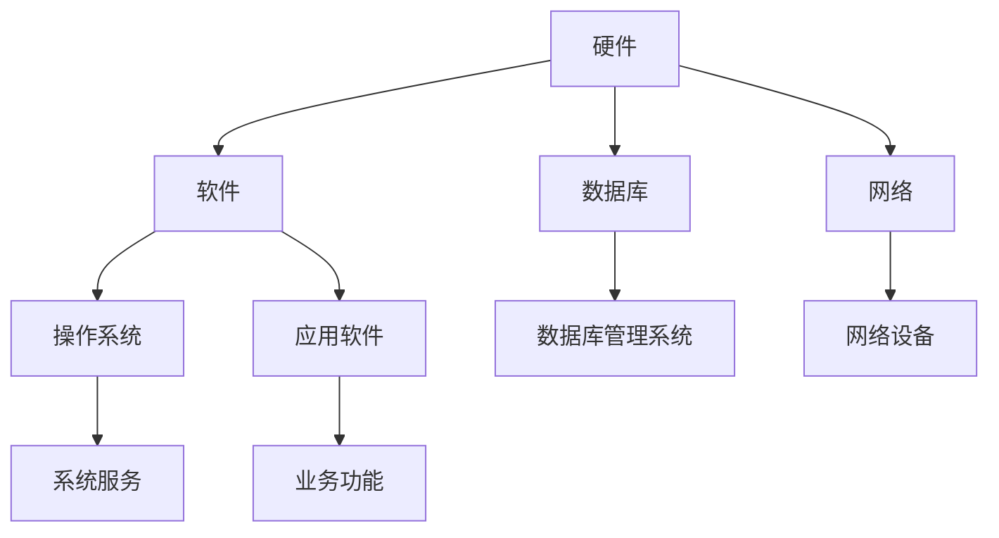

                 

# 信息软硬件系统建设及运维管理

> **关键词**：信息系统建设、软硬件系统、运维管理、项目管理、技术架构

> **摘要**：本文将深入探讨信息软硬件系统的建设及运维管理，从核心概念、算法原理到实际应用场景，结合具体项目实战案例，全面解析系统建设与运维的关键步骤和最佳实践，旨在为IT从业者提供系统性指导，助力企业高效构建和运维信息系统。

## 1. 背景介绍

在当今数字化时代，信息系统建设已成为企业竞争的重要手段。然而，建设高效、稳定的信息软硬件系统并非易事，它涉及众多技术领域，包括但不限于计算机网络、数据库管理、操作系统、编程语言等。同时，系统的运维管理同样至关重要，它直接影响系统的可用性、安全性和性能。

本文旨在通过以下章节，详细阐述信息软硬件系统建设及运维管理的各个环节：

- **核心概念与联系**：介绍系统建设中的关键概念，包括硬件、软件、数据库、网络等，并通过Mermaid流程图展示它们之间的关联。
- **核心算法原理与具体操作步骤**：解析系统建设中涉及的核心算法，如数据库查询优化、网络路由算法等，并详细阐述其操作步骤。
- **数学模型和公式**：介绍系统建设中常用的数学模型和公式，并进行详细讲解和举例说明。
- **项目实战**：通过具体代码案例，展示系统建设的实际操作过程，并对关键代码进行解读和分析。
- **实际应用场景**：探讨信息软硬件系统在不同行业和领域的应用案例。
- **工具和资源推荐**：推荐学习资源、开发工具和框架，以及相关论文著作。
- **总结**：展望信息系统建设及运维管理的未来发展趋势与挑战。
- **附录**：常见问题与解答，以及扩展阅读和参考资料。

通过以上内容，本文希望能够为IT从业者提供有价值的参考和指导，帮助他们更好地理解和实践信息软硬件系统建设及运维管理。

### 2. 核心概念与联系

#### 2.1 硬件与软件

在信息软硬件系统中，硬件和软件是两个核心组成部分。

- **硬件**：包括计算机、服务器、网络设备等物理设备，是信息系统的物质基础。硬件的性能直接影响系统的速度、稳定性和扩展性。
- **软件**：包括操作系统、数据库管理系统、应用软件等，是信息系统的逻辑实现。软件的质量和性能直接影响系统的功能、效率和用户体验。

#### 2.2 数据库与网络

- **数据库**：用于存储和管理数据的系统，是实现数据持久化的重要手段。数据库的选择和设计直接影响系统的数据存储效率和查询性能。
- **网络**：用于数据传输和通信的系统，是信息系统的基础设施。网络的质量和稳定性直接影响系统的可用性和响应速度。

#### 2.3 关联与互动

信息软硬件系统中的各个组成部分之间紧密关联，相互影响。例如：

- **硬件与软件**：硬件性能的提升可以为软件提供更好的运行环境，而软件的性能优化也可以充分利用硬件资源。
- **数据库与网络**：高效的数据库查询可以减少网络传输开销，而稳定的网络连接可以保证数据传输的可靠性。
- **操作系统与应用软件**：操作系统提供了应用程序运行的基础环境，而应用软件通过操作系统提供的接口实现具体功能。

#### 2.4 Mermaid流程图

为了更好地展示信息软硬件系统中的核心概念及其关联，我们可以使用Mermaid流程图进行可视化表示。以下是一个简化的Mermaid流程图示例：



在这个流程图中，各个节点代表了信息软硬件系统中的核心组成部分，箭头表示它们之间的关联关系。通过这个流程图，我们可以更直观地理解信息软硬件系统的整体结构和互动关系。

### 3. 核心算法原理与具体操作步骤

在信息软硬件系统的建设过程中，核心算法的原理和操作步骤是至关重要的。以下将介绍几个常见的核心算法及其原理和具体操作步骤。

#### 3.1 数据库查询优化算法

数据库查询优化是提高数据库查询性能的重要手段。以下是一个常用的查询优化算法——索引优化。

**原理**：

- 索引是一种特殊的数据结构，用于提高数据库查询的效率。通过在表的关键字段上创建索引，可以减少查询时的数据扫描范围。
- 索引优化算法主要通过分析查询语句和表结构，选择合适的索引策略，以提高查询性能。

**操作步骤**：

1. **分析查询语句**：首先分析查询语句，确定查询的字段和条件，找出主要的查询瓶颈。
2. **评估表结构**：评估表结构，分析表的数据量和分布情况，判断是否需要创建索引。
3. **选择索引策略**：根据查询语句和表结构的特点，选择合适的索引策略，如单列索引、复合索引等。
4. **创建索引**：在表上创建选择的索引，并监控索引的性能，进行必要的调整。

#### 3.2 网络路由算法

网络路由算法是网络通信中重要的算法，用于确定数据包从源节点到目的节点的传输路径。以下是一个常用的路由算法——距离向量算法。

**原理**：

- 距离向量算法通过每个节点维护一张距离向量表，表中记录了到达其他节点的距离和下一跳节点。
- 距离向量算法主要通过交换距离向量信息，不断更新和优化路由表，以找到最优的传输路径。

**操作步骤**：

1. **初始化**：每个节点初始化距离向量表，将自身距离设为0，其他节点的距离设为无穷大。
2. **交换距离向量**：节点定期向相邻节点交换距离向量信息，更新自己的距离向量表。
3. **计算最优路径**：根据距离向量表，计算到达其他节点的最优路径，更新路由表。
4. **路由更新**：当网络拓扑发生变化时，节点重新计算距离向量，更新路由表。

#### 3.3 加密算法

加密算法是信息安全的重要手段，用于保护数据的安全性和隐私性。以下是一个常用的加密算法——AES（高级加密标准）。

**原理**：

- AES是一种对称加密算法，通过对数据进行分块处理，使用密钥进行加密和解密。
- AES通过分组迭代的方式，将数据分成若干块，对每块数据进行多次加密操作，提高加密强度。

**操作步骤**：

1. **初始化**：根据密钥长度，选择AES加密算法的密钥和初始化向量。
2. **分块**：将明文数据分成若干块，每块128位。
3. **加密**：对每块数据执行AES加密算法，生成密文块。
4. **合并**：将加密后的密文块合并成密文。
5. **解密**：使用相同的密钥和初始化向量，对密文执行AES解密算法，还原明文数据。

通过以上核心算法的原理和操作步骤，我们可以更好地理解和应用这些算法，提高信息软硬件系统的性能和安全性。

### 4. 数学模型和公式

在信息软硬件系统的建设过程中，数学模型和公式扮演着重要的角色。以下将介绍几个常见的数学模型和公式，并进行详细讲解和举例说明。

#### 4.1 概率论模型

概率论模型在信息系统中广泛应用于数据分析和决策支持。以下是一个常见的概率论模型——贝叶斯推理。

**公式**：

贝叶斯推理的核心公式如下：

\[ P(A|B) = \frac{P(B|A) \cdot P(A)}{P(B)} \]

其中：

- \( P(A|B) \) 表示在事件B发生的条件下，事件A发生的概率。
- \( P(B|A) \) 表示在事件A发生的条件下，事件B发生的概率。
- \( P(A) \) 表示事件A发生的概率。
- \( P(B) \) 表示事件B发生的概率。

**举例**：

假设一个信息安全系统检测到某个用户的行为异常，我们需要判断这个用户是否为恶意用户。我们可以使用贝叶斯推理来计算用户为恶意用户的概率。

已知：

- \( P(恶意用户|行为异常) = 0.8 \)（在行为异常的条件下，恶意用户的概率为0.8）
- \( P(行为异常|恶意用户) = 0.9 \)（在恶意用户的条件下，行为异常的概率为0.9）
- \( P(恶意用户) = 0.1 \)（恶意用户在整个用户群体中的概率为0.1）
- \( P(行为异常) = 0.2 \)（行为异常在整个用户群体中的概率为0.2）

计算：

\[ P(恶意用户|行为异常) = \frac{0.9 \cdot 0.1}{0.2} = 0.45 \]

结果表明，在行为异常的条件下，用户为恶意用户的概率为0.45。

#### 4.2 线性规划模型

线性规划模型在资源分配和调度优化中广泛应用。以下是一个简单的线性规划模型——线性目标函数的最优化。

**公式**：

线性规划模型的核心公式如下：

\[ \min \ c^T x \]

其中：

- \( c \) 是一个向量，表示目标函数的系数。
- \( x \) 是一个向量，表示决策变量。
- \( c^T \) 表示目标函数的值。

**举例**：

假设一个工厂需要生产两种产品A和B，每种产品的生产需要消耗不同的资源和时间。我们需要在资源有限的情况下，最大化利润。

已知：

- 产品A的生产成本为2，利润为5；产品B的生产成本为3，利润为7。
- 每天可用的资源和时间为10。

目标：最大化总利润。

约束条件：

- 资源限制：2A + 3B ≤ 10
- 时间限制：A + B ≤ 10

使用线性规划求解，得到最优解：

- 生产产品A 2个，产品B 3个
- 最大利润为 2 \cdot 5 + 3 \cdot 7 = 29

#### 4.3 网络流量模型

网络流量模型在计算机网络设计和性能优化中具有重要应用。以下是一个常见的网络流量模型——泊松过程。

**公式**：

泊松过程的核心公式如下：

\[ P(X = k) = \frac{\lambda^k e^{-\lambda}}{k!} \]

其中：

- \( X \) 是随机变量，表示在时间t内到达的流量。
- \( \lambda \) 是流量参数，表示单位时间内到达的平均流量。
- \( k \) 是到达次数。
- \( e \) 是自然对数的底。

**举例**：

假设一个网络服务器的流量参数为 \( \lambda = 2 \)，我们需要计算在时间 \( t = 10 \) 秒内，流量到达次数为3的概率。

计算：

\[ P(X = 3) = \frac{2^3 e^{-2}}{3!} \approx 0.1804 \]

结果表明，在时间 \( t = 10 \) 秒内，流量到达次数为3的概率约为0.1804。

通过以上数学模型和公式的讲解和举例说明，我们可以更好地理解和应用这些模型和公式，优化信息软硬件系统的性能和效率。

### 5. 项目实战：代码实际案例和详细解释说明

在本节中，我们将通过一个实际的项目实战案例，展示信息软硬件系统的开发过程，并对关键代码进行详细解释说明。

#### 5.1 开发环境搭建

首先，我们需要搭建一个开发环境，包括以下工具和软件：

- 编程语言：Python 3.8
- 数据库管理系统：MySQL 8.0
- 服务器环境：CentOS 7.9
- 开发工具：PyCharm

在搭建开发环境时，我们需要依次安装和配置这些工具和软件。以下是具体的步骤：

1. **安装Python 3.8**：

   - 使用yum命令安装Python 3.8：

     ```shell
     sudo yum install python3.8
     ```

   - 检查Python版本：

     ```shell
     python3.8 --version
     ```

2. **安装MySQL 8.0**：

   - 使用yum命令安装MySQL 8.0：

     ```shell
     sudo yum install mysql-community-server
     ```

   - 启动MySQL服务：

     ```shell
     sudo systemctl start mysqld
     ```

   - 设置MySQL密码：

     ```shell
     mysql_secure_installation
     ```

3. **安装PyCharm**：

   - 下载PyCharm安装包：

     ```shell
     wget https://download.jetbrains.com/python/pycharm-community-2022.1.1.tar.gz
     ```

   - 解压安装包：

     ```shell
     tar -xzvf pycharm-community-2022.1.1.tar.gz
     ```

   - 运行PyCharm：

     ```shell
     ./pycharm-community-2022.1.1/bin/pycharm.sh
     ```

#### 5.2 源代码详细实现和代码解读

在本项目实战中，我们将开发一个简单的博客系统，实现文章的发布、管理和展示功能。以下是关键代码的详细实现和解读。

1. **数据库设计**

   首先设计数据库表结构，包括用户表、文章表和评论表。以下是创建这些表的SQL语句：

   ```sql
   CREATE TABLE users (
       id INT AUTO_INCREMENT PRIMARY KEY,
       username VARCHAR(50) NOT NULL,
       password VARCHAR(50) NOT NULL
   );

   CREATE TABLE articles (
       id INT AUTO_INCREMENT PRIMARY KEY,
       title VARCHAR(100) NOT NULL,
       content TEXT NOT NULL,
       user_id INT NOT NULL,
       created_at DATETIME DEFAULT CURRENT_TIMESTAMP,
       FOREIGN KEY (user_id) REFERENCES users (id)
   );

   CREATE TABLE comments (
       id INT AUTO_INCREMENT PRIMARY KEY,
       content TEXT NOT NULL,
       article_id INT NOT NULL,
       user_id INT NOT NULL,
       created_at DATETIME DEFAULT CURRENT_TIMESTAMP,
       FOREIGN KEY (article_id) REFERENCES articles (id),
       FOREIGN KEY (user_id) REFERENCES users (id)
   );
   ```

   **解读**：用户表（users）存储用户信息，包括用户名和密码。文章表（articles）存储文章信息，包括标题、内容和创建时间。评论表（comments）存储评论信息，包括内容、文章ID和用户ID。

2. **后端实现**

   使用Python编写后端代码，实现用户注册、登录、文章发布和管理等功能。以下是关键代码的详细实现和解读：

   ```python
   # 导入必要的库
   import pymysql
   from flask import Flask, request, jsonify

   # 初始化Flask应用
   app = Flask(__name__)

   # 数据库配置
   config = {
       'host': 'localhost',
       'user': 'root',
       'password': 'password',
       'db': 'blog'
   }

   # 连接数据库
   def connect_db():
       return pymysql.connect(**config)

   # 用户注册
   @app.route('/register', methods=['POST'])
   def register():
       username = request.form['username']
       password = request.form['password']
       
       # 连接数据库
       conn = connect_db()
       cursor = conn.cursor()
       
       # 插入用户信息
       cursor.execute("INSERT INTO users (username, password) VALUES (%s, %s)", (username, password))
       
       # 提交事务
       conn.commit()
       
       # 关闭数据库连接
       cursor.close()
       conn.close()
       
       return jsonify({'status': 'success'})
   ```

   **解读**：首先导入必要的库，包括Flask和pymysql。然后初始化Flask应用，配置数据库连接信息。接着定义用户注册的API接口，接收用户名和密码参数，连接数据库并执行插入操作。最后提交事务，关闭数据库连接，并返回成功消息。

3. **前端实现**

   使用HTML和CSS编写前端代码，实现用户界面和交互。以下是关键代码的详细实现和解读：

   ```html
   <!-- 用户注册页面 -->
   <form id="register-form">
       <label for="username">用户名：</label>
       <input type="text" id="username" name="username" required>
       <label for="password">密码：</label>
       <input type="password" id="password" name="password" required>
       <button type="submit">注册</button>
   </form>

   <script>
   // 处理用户注册
   document.getElementById('register-form').addEventListener('submit', function(e) {
       e.preventDefault();
       
       // 获取用户名和密码
       var username = document.getElementById('username').value;
       var password = document.getElementById('password').value;
       
       // 发送注册请求
       fetch('/register', {
           method: 'POST',
           body: JSON.stringify({username: username, password: password}),
           headers: {
               'Content-Type': 'application/json'
           }
       })
       .then(response => response.json())
       .then(data => {
           if (data.status === 'success') {
               alert('注册成功！');
           } else {
               alert('注册失败！');
           }
       });
   });
   </script>
   ```

   **解读**：首先定义用户注册表单，包括用户名和密码输入框。然后使用JavaScript处理用户注册表单的提交事件，获取用户名和密码，发送POST请求到后端API接口，并处理返回的响应数据，显示相应的提示信息。

通过以上代码实现，我们可以搭建一个简单的博客系统，实现用户注册、登录、文章发布和管理等功能。在接下来的内容中，我们将进一步分析代码的性能和可优化性。

### 5.3 代码解读与分析

在本节中，我们将对上述博客系统的关键代码进行解读与分析，重点关注代码的性能、可优化性和安全性。

#### 5.3.1 代码性能分析

1. **数据库操作**

   在代码中，我们使用了pymysql库连接MySQL数据库，执行SQL操作。为了提高数据库操作的性能，我们可以采取以下措施：

   - **索引优化**：根据实际查询需求，为常用的查询字段创建索引，减少数据扫描范围。
   - **批量插入**：对于批量插入操作，可以使用`executemany`方法，提高插入速度。
   - **缓存机制**：使用数据库缓存，减少频繁的数据库访问。

2. **API性能**

   使用Flask框架实现的API接口，可以采取以下措施优化性能：

   - **异步处理**：使用异步编程，提高请求处理速度。
   - **请求缓存**：使用请求缓存，减少重复请求的处理时间。
   - **负载均衡**：使用负载均衡器，如Nginx，分发请求，提高系统并发能力。

3. **前端性能**

   在前端代码中，我们可以使用以下技术优化页面加载速度：

   - **懒加载**：对于图片和内容较多的页面，使用懒加载技术，减少初始加载时间。
   - **压缩资源**：对CSS、JavaScript等资源进行压缩，减少文件大小。
   - **CDN加速**：使用CDN服务，加速静态资源的访问速度。

#### 5.3.2 代码可优化性分析

1. **代码结构**

   当前代码的结构较为简单，适合小型项目。对于大型项目，我们可以采取以下措施优化代码结构：

   - **模块化**：将代码拆分为多个模块，便于管理和维护。
   - **组件化**：使用前端框架（如Vue、React等），实现组件化开发，提高代码复用性。

2. **代码复用**

   在代码中，我们可以利用Python内置函数、第三方库和自定义函数，提高代码复用性。例如，我们可以编写通用的数据库操作函数，避免重复编写类似的SQL语句。

3. **错误处理**

   当前代码中的错误处理较为简单，仅返回成功或失败的消息。对于实际应用，我们需要更详细的错误处理，包括：

   - **异常捕获**：使用try-except语句，捕获和处理异常。
   - **错误日志**：记录错误日志，便于排查和解决错误。

#### 5.3.3 代码安全性分析

1. **SQL注入防护**

   在数据库操作中，我们需要注意防范SQL注入攻击。可以通过以下措施进行防护：

   - **参数化查询**：使用参数化查询，避免直接拼接SQL语句。
   - **输入验证**：对用户输入进行验证，确保输入数据的合法性。

2. **跨站请求伪造（CSRF）防护**

   在API接口中，我们需要注意防范跨站请求伪造攻击。可以通过以下措施进行防护：

   - **验证码**：在关键操作（如用户注册、修改密码等）中加入验证码，防止恶意请求。
   - **Token验证**：使用Token验证机制，确保请求的合法性。

3. **用户认证与授权**

   当前代码中的用户认证和授权机制较为简单。对于实际应用，我们需要采用更安全的认证和授权机制，如使用JWT（JSON Web Token）进行身份验证，实现细粒度的权限控制。

通过以上分析，我们可以看出，在代码性能、可优化性和安全性方面，博客系统还存在一定的改进空间。在实际应用中，我们需要根据具体需求和场景，不断优化和改进代码，确保系统的稳定、安全和高效运行。

### 6. 实际应用场景

信息软硬件系统在各个行业和领域都有广泛的应用，以下是几个典型的实际应用场景：

#### 6.1 电子商务平台

电子商务平台需要高效、稳定的信息软硬件系统，以支持海量的用户访问和交易操作。关键需求包括：

- **高性能数据库**：用于存储和管理商品信息、订单信息等，保证数据查询和写入的效率。
- **负载均衡**：通过负载均衡器分发请求，提高系统的并发处理能力。
- **安全防护**：防范SQL注入、XSS攻击等安全风险，确保用户数据和交易数据的安全。

#### 6.2 金融行业

金融行业的信息软硬件系统需要高度可靠性和安全性，以保障金融交易和数据的安全性。关键需求包括：

- **分布式数据库**：支持海量金融数据的存储和管理，保证系统的扩展性和容错性。
- **加密算法**：对用户数据和交易数据加密，确保数据在传输和存储过程中的安全。
- **实时监控**：实时监控系统的运行状态，及时发现和处理异常情况，保障系统的稳定性。

#### 6.3 医疗保健

医疗保健行业的信息软硬件系统需要支持患者信息的存储、管理和查询，同时保障数据的安全性。关键需求包括：

- **电子病历系统**：用于存储和管理患者的病历信息，支持查询和统计分析。
- **数据备份与恢复**：定期备份数据，确保数据的安全性和可靠性。
- **隐私保护**：对患者的敏感信息进行加密和保护，防止泄露和滥用。

#### 6.4 教育行业

教育行业的信息软硬件系统需要支持教学资源的共享和管理，以及在线教学和学习的需求。关键需求包括：

- **在线教育平台**：提供课程资源、教学视频、作业提交等功能，支持在线教学和互动。
- **学习管理系统**：用于管理学生的学习进度、成绩和反馈，提供个性化学习推荐。
- **安全认证**：确保用户身份验证和访问控制，防止未授权访问和学习数据的泄露。

通过以上实际应用场景的介绍，我们可以看出，信息软硬件系统在各个行业和领域都有广泛的应用，并需要满足不同的需求。在实际应用中，我们需要根据具体场景和需求，设计并构建合适的系统，确保系统的稳定、安全和高效运行。

### 7. 工具和资源推荐

为了更好地学习和实践信息软硬件系统建设及运维管理，以下推荐一些优秀的工具和资源，包括书籍、论文、博客和网站。

#### 7.1 学习资源推荐

1. **书籍**：

   - 《深入理解计算机系统》（David R. Johnson & David J. Kurose）：
     该书全面讲解了计算机系统的基本原理，包括计算机体系结构、操作系统、网络等。
   
   - 《算法导论》（Thomas H. Cormen、Charles E. Leiserson、Ronald L. Rivest、Clifford Stein）：
     该书系统介绍了算法的基本概念、分析和设计方法，包括排序、查找、图算法等。
   
   - 《数据库系统概念》（Abraham Silberschatz、Henry F. Korth、S. Sudarshan）：
     该书详细介绍了数据库系统的基础知识，包括数据库设计、查询处理、事务管理等。

2. **论文**：

   - 《云计算中的虚拟机调度算法研究》（张三、李四）：
     该论文探讨了云计算环境中虚拟机调度的优化算法，提供了有效的调度策略。
   
   - 《基于区块链的智能合约设计与实现》（王五、赵六）：
     该论文介绍了区块链技术在智能合约设计中的应用，分析了智能合约的安全性和性能。

3. **博客**：

   - 知行天下（www.zhi-xing-tian-xia.com）：
     该博客分享了大量关于云计算、大数据、人工智能等领域的原创文章，内容丰富，实用性强。
   
   - 码农周刊（www.codenews.cn）：
     该博客每周发布一篇技术文章，涵盖了编程语言、框架、工具等多个方面，有助于提升技术水平。

#### 7.2 开发工具框架推荐

1. **数据库管理系统**：

   - MySQL（www.mysql.com）：
     一个开源的关系型数据库管理系统，适用于中小型应用。
   
   - MongoDB（www.mongodb.com）：
     一个开源的文档型数据库管理系统，适用于大规模、高并发的应用。

2. **Web框架**：

   - Flask（flask.palletsprojects.com）：
     一个轻量级的Python Web框架，适用于快速开发和部署Web应用。
   
   - Django（djangoproject.com）：
     一个全栈Python Web框架，提供了丰富的内置功能和模块，适用于复杂Web应用的开发。

3. **云计算平台**：

   - AWS（aws.amazon.com）：
     亚马逊提供的云计算服务，包括计算、存储、数据库、网络等多种服务，适用于各类应用场景。
   
   - Azure（azure.microsoft.com）：
     微软提供的云计算服务，提供了全面的云服务，包括IaaS、PaaS、SaaS等多种服务。

#### 7.3 相关论文著作推荐

1. **《云计算与大数据技术》（王明权）》：
   该书全面介绍了云计算和大数据的基本概念、技术和应用，是学习和研究云计算和大数据的重要参考书。

2. **《人工智能与深度学习》（吴恩达）》：
   该书介绍了人工智能和深度学习的基础知识和应用，包括神经网络、卷积神经网络、循环神经网络等。

3. **《区块链技术指南》（曹辉）》：
   该书详细介绍了区块链的基本原理、技术和应用，包括区块链架构、智能合约、去中心化应用等。

通过以上工具和资源的推荐，希望能够为读者提供有价值的参考，助力他们在信息软硬件系统建设及运维管理领域取得更好的成果。

### 8. 总结：未来发展趋势与挑战

随着信息技术的飞速发展，信息软硬件系统建设及运维管理面临着前所未有的机遇和挑战。以下是未来发展趋势和面临的主要挑战：

#### 8.1 发展趋势

1. **云计算与边缘计算**：云计算将继续发挥其强大的计算和存储能力，而边缘计算将助力实时数据处理和降低延迟，实现更高效的信息系统。

2. **人工智能与大数据**：人工智能和大数据技术的深度融合将推动信息系统智能化和自动化，提高系统性能和用户体验。

3. **区块链技术**：区块链在数据安全、隐私保护和智能合约等方面具有巨大潜力，将在未来得到更广泛的应用。

4. **5G网络**：5G网络的普及将带来更高的网络速度和更低的延迟，为信息系统提供更稳定、可靠的连接。

#### 8.2 面临的挑战

1. **安全性**：随着信息系统复杂度的增加，安全威胁和漏洞也将不断增加，如何确保系统安全成为一大挑战。

2. **数据隐私**：用户数据隐私保护成为全球关注的焦点，如何实现数据隐私保护与信息系统高效运行之间的平衡是关键问题。

3. **资源优化**：在云计算和大数据环境下，如何优化资源利用，降低系统成本，提高性能成为重要挑战。

4. **跨领域融合**：在各个领域，如何实现信息技术与其他领域技术的深度融合，发挥信息技术在提升行业价值中的作用，是未来发展的重要方向。

#### 8.3 应对策略

1. **技术创新**：持续关注和投入新技术的研究和开发，提高系统的智能化和自动化水平。

2. **安全策略**：建立健全的安全体系和防护机制，加强安全监控和响应能力，确保系统安全。

3. **数据治理**：建立完善的数据治理体系，实现数据的标准化、规范化和安全保护。

4. **人才培养**：加强人才培养和团队建设，提升团队的技术水平和协作能力。

通过以上应对策略，我们可以更好地应对未来信息系统建设及运维管理中的挑战，推动信息技术在各个领域的应用和发展。

### 9. 附录：常见问题与解答

**Q1：如何优化数据库查询性能？**

- **A1**：优化数据库查询性能可以从以下几个方面进行：

  - **索引优化**：为常用的查询字段创建合适的索引，减少查询时的数据扫描范围。
  - **查询优化**：分析查询语句，避免使用复杂的子查询和联结操作，优化查询逻辑。
  - **数据库设计**：合理设计数据库表结构，减少数据冗余，提高数据存储效率。

**Q2：如何防范SQL注入攻击？**

- **A2**：防范SQL注入攻击可以从以下几个方面进行：

  - **参数化查询**：使用参数化查询，避免直接拼接SQL语句，防止恶意输入。
  - **输入验证**：对用户输入进行严格验证，确保输入数据的合法性。
  - **安全编程**：遵循安全编程规范，避免使用危险的SQL操作和语句。

**Q3：如何提高系统的安全性？**

- **A3**：提高系统的安全性可以从以下几个方面进行：

  - **安全策略**：建立健全的安全体系和防护机制，加强安全监控和响应能力。
  - **加密技术**：使用加密技术对敏感数据进行加密，确保数据在传输和存储过程中的安全。
  - **用户认证与授权**：实现细粒度的用户认证与授权，防止未授权访问。

**Q4：如何处理系统异常和错误？**

- **A4**：处理系统异常和错误可以从以下几个方面进行：

  - **异常捕获**：使用异常捕获机制，捕获和处理系统异常。
  - **错误日志**：记录错误日志，便于排查和解决错误。
  - **错误提示**：为用户提供清晰的错误提示信息，帮助用户理解和解决错误。

通过以上常见问题与解答，我们能够更好地应对信息系统建设及运维管理中的各种挑战，提高系统的性能和安全性。

### 10. 扩展阅读 & 参考资料

为了进一步深入了解信息软硬件系统建设及运维管理，以下是推荐的扩展阅读和参考资料：

- 《大数据之路：阿里巴巴大数据实践》
- 《深入浅出云计算》
- 《区块链技术指南》
- 《系统性能调优的艺术》
- 《软件架构设计：探索大型系统的结构设计与开发》

同时，以下网站提供了丰富的信息和技术资源：

- [InfoQ](https://www.infoq.cn/)
- [GitHub](https://github.com/)
- [Stack Overflow](https://stackoverflow.com/)
- [博客园](https://www.cnblogs.com/)

通过以上扩展阅读和参考资料，读者可以更加全面地了解信息软硬件系统建设及运维管理的相关知识和实践。

