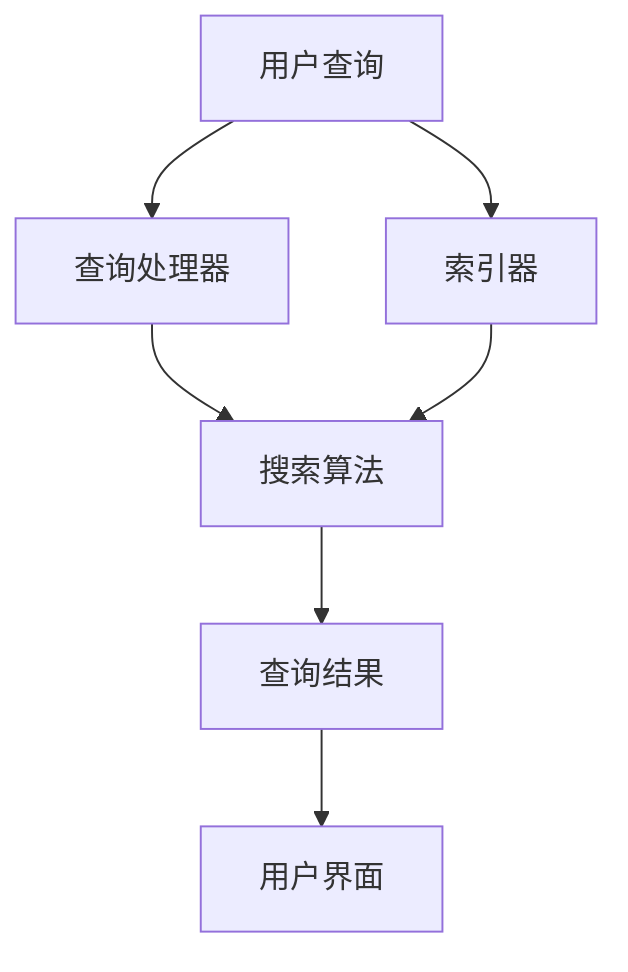
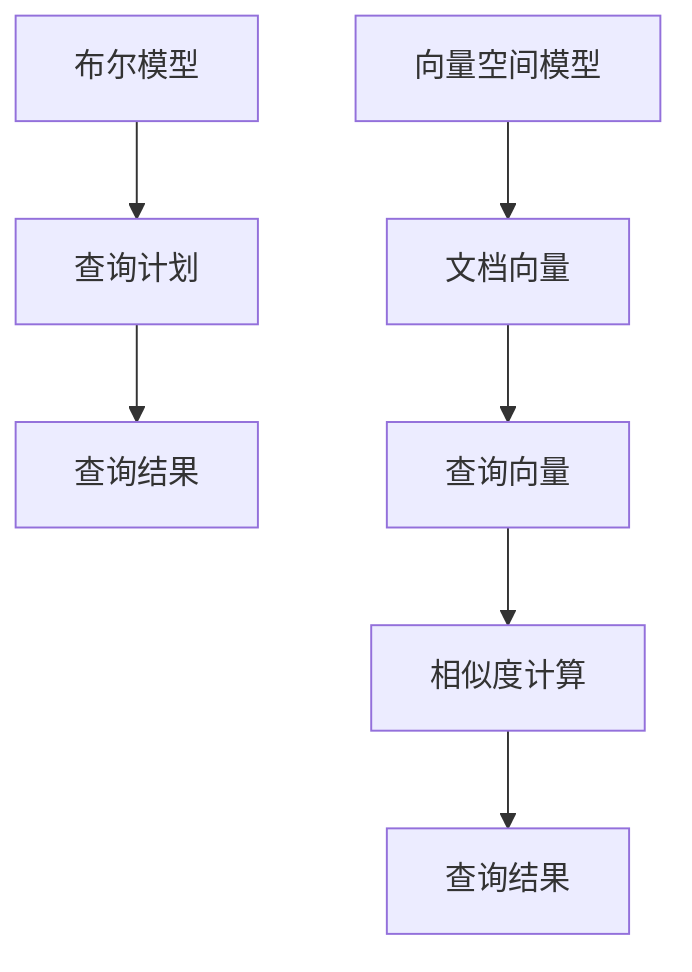

                 

## 文章标题

**《信息过载与信息搜索指南：在庞大的信息海洋中找到你需要的信息》**

### 关键词：

- 信息过载
- 信息搜索
- 搜索算法
- 数据库管理
- 信息过滤
- 数据挖掘
- 机器学习

### 摘要：

在当今数字时代，我们面临着前所未有的信息过载问题。本文将探讨如何有效地在庞大的信息海洋中找到我们所需的信息。通过介绍核心概念、算法原理、数学模型以及实际应用场景，我们将提供一套完整的信息搜索指南，帮助读者提高信息获取的效率和准确性。此外，还将推荐相关学习资源和开发工具，以助力读者在信息搜索领域不断进步。

## 1. 背景介绍

随着互联网和移动设备的普及，信息变得触手可及。然而，信息的爆炸式增长也带来了严重的挑战。据估计，全球每天产生的数据量超过2.5万亿GB，而人类大脑的存储能力有限。这种信息过载现象导致了以下几个主要问题：

1. **时间浪费**：在大量的信息中寻找所需内容往往需要耗费大量时间，降低了工作效率。
2. **准确性问题**：信息质量参差不齐，难以确定哪些信息是可靠的。
3. **决策困难**：在面对海量信息时，人们容易陷入决策瘫痪，难以做出明智的选择。

因此，有效的信息搜索成为了一项至关重要的技能。本文旨在提供一套系统化的信息搜索指南，帮助读者提高信息获取的效率和准确性。

### 1.1 信息搜索的重要性

信息搜索不仅关系到个人学习、工作和生活的效率，还对企业、政府和社会的发展产生深远影响。例如：

- **企业竞争**：企业在面对市场变化时，需要迅速获取行业动态和竞争对手信息，以便做出快速响应。
- **科技创新**：科学研究需要大量的文献资料作为基础，高效的搜索能够加速科研成果的转化。
- **社会治理**：政府需要通过大数据分析，从海量信息中挖掘出对社会治理有价值的信息。

### 1.2 信息搜索的发展历程

信息搜索技术的发展经历了多个阶段：

- **早期搜索**：基于目录和索引的手动搜索。
- **基于关键词的搜索**：通过关键词匹配实现信息检索。
- **自然语言处理**：利用自然语言处理技术提高搜索的准确性和智能化。
- **机器学习和深度学习**：通过训练模型实现更精准的搜索结果。

接下来，我们将深入探讨信息搜索的核心概念和原理，并介绍相关的算法和数学模型。

## 2. 核心概念与联系

### 2.1 信息检索系统架构

信息检索系统的架构通常包括以下几个主要组成部分：

1. **索引器（Indexer）**：负责构建索引，将原始数据转换为可检索的格式。
2. **查询处理器（Query Processor）**：处理用户查询，生成查询计划。
3. **搜索算法（Search Algorithm）**：实现搜索功能，返回查询结果。
4. **用户界面（User Interface）**：提供与用户的交互接口。

下面是一个简化的信息检索系统架构的 Mermaid 流程图：



### 2.2 关键概念解释

在信息检索中，以下是一些关键概念：

- **文档（Document）**：存储信息的实体，如网页、文件等。
- **索引（Index）**：文档内容的结构化表示，用于快速检索。
- **查询（Query）**：用户输入的信息，用于检索文档。
- **倒排索引（Inverted Index）**：一种高效的信息检索数据结构，将词汇映射到文档列表。

### 2.3 信息检索模型

信息检索主要基于以下两种模型：

1. **布尔模型（Boolean Model）**：基于布尔逻辑（AND, OR, NOT）进行查询。
2. **向量空间模型（Vector Space Model）**：将文档和查询表示为向量，计算相似度。

下面是布尔模型和向量空间模型的 Mermaid 流程图：



通过以上核心概念和架构的介绍，我们为后续的算法原理和具体操作步骤奠定了基础。

## 3. 核心算法原理 & 具体操作步骤

### 3.1 布尔模型

布尔模型是最基础的检索模型，它通过布尔运算符（AND, OR, NOT）对查询进行组合。以下是布尔模型的步骤：

1. **预处理查询**：将查询语句转换为布尔表达式。
2. **索引检索**：对每个布尔运算符分别检索索引。
3. **合并结果**：根据布尔逻辑合并检索结果。

例如，对于查询“AI AND deep learning”，我们首先检索“AI”的索引，然后检索“deep learning”的索引，最后取交集得到结果。

### 3.2 向量空间模型

向量空间模型将文档和查询表示为向量，通过计算向量之间的相似度来确定检索结果。以下是向量空间模型的步骤：

1. **向量化**：将文档和查询转换为向量。
2. **相似度计算**：计算向量之间的余弦相似度。
3. **结果排序**：根据相似度对结果进行排序。

具体步骤如下：

- **词袋模型**：将文档表示为词袋，即每个词的出现频率。
- **TF-IDF**：计算词的权重，考虑词频（TF）和逆文档频率（IDF）。
- **余弦相似度**：计算两个向量的余弦值。

### 3.3 搜索算法实现

以下是一个简化的搜索算法实现：

```python
import numpy as np
from sklearn.feature_extraction.text import TfidfVectorizer

def search(documents, query):
    # 向量化文档和查询
    vectorizer = TfidfVectorizer()
    doc_vectors = vectorizer.fit_transform(documents)
    query_vector = vectorizer.transform([query])

    # 计算相似度
    cos_sim = np.dot(doc_vectors, query_vector.T) / (np.linalg.norm(doc_vectors, axis=1) * np.linalg.norm(query_vector, axis=0))

    # 结果排序
    sorted_indices = np.argsort(cos_sim)[::-1]

    return sorted_indices
```

通过以上算法原理和具体步骤，我们为实际的信息搜索提供了技术基础。

## 4. 数学模型和公式 & 详细讲解 & 举例说明

### 4.1 余弦相似度

余弦相似度是向量空间模型中计算相似度的重要工具。它的数学公式如下：

$$
\cos(\theta) = \frac{\vec{u} \cdot \vec{v}}{||\vec{u}|| \cdot ||\vec{v}||}
$$

其中，$\vec{u}$和$\vec{v}$是两个向量，$\theta$是它们之间的夹角。

**示例**：假设我们有两个文档$D_1$和$D_2$，它们的向量表示分别为：

$$
\vec{u} = (1, 1, 0)
$$

$$
\vec{v} = (1, 0, 1)
$$

计算它们的余弦相似度：

$$
\cos(\theta) = \frac{1 \cdot 1 + 1 \cdot 0 + 0 \cdot 1}{\sqrt{1^2 + 1^2 + 0^2} \cdot \sqrt{1^2 + 0^2 + 1^2}} = \frac{1}{\sqrt{2} \cdot \sqrt{2}} = \frac{1}{2}
$$

### 4.2 TF-IDF

TF-IDF是一种常用的词权重计算方法。它的公式如下：

$$
tfidf(t,d) = tf(t,d) \cdot idf(t)
$$

其中，$tf(t,d)$是词$t$在文档$d$中的词频，$idf(t)$是词$t$的全局逆文档频率。

**示例**：假设我们有一个文档集合，包含两个文档$D_1$和$D_2$：

- $D_1$: "the quick brown fox jumps over the lazy dog"
- $D_2$: "the quick brown dog jumps over the lazy fox"

计算词"brown"的TF-IDF：

- $tf(brown, D_1) = 2$
- $tf(brown, D_2) = 2$
- $N = 2$（文档总数）
- $df(brown) = 2$（词频）

$$
idf(brown) = \log_2(\frac{N}{df(brown)}) = \log_2(\frac{2}{2}) = 0
$$

$$
tfidf(brown, D_1) = 2 \cdot 0 = 0
$$

$$
tfidf(brown, D_2) = 2 \cdot 0 = 0
$$

通过以上数学模型和公式，我们可以更好地理解和计算信息检索中的相似度。

## 5. 项目实战：代码实际案例和详细解释说明

### 5.1 开发环境搭建

在开始之前，我们需要搭建一个基本的开发环境。以下是所需的工具和步骤：

- **Python 3.x**
- **Jupyter Notebook**
- **Scikit-learn（用于TF-IDF和余弦相似度计算）**

安装步骤：

```bash
pip install python==3.x
pip install jupyter
pip install scikit-learn
```

### 5.2 源代码详细实现和代码解读

下面是一个简单的信息搜索项目的实现：

```python
import numpy as np
from sklearn.feature_extraction.text import TfidfVectorizer

# 文档数据
documents = [
    "the quick brown fox jumps over the lazy dog",
    "the quick brown dog jumps over the lazy fox",
    "lazy animals often lie around doing nothing",
    "the quick brown fox is very clever"
]

# 查询数据
queries = [
    "lazy fox",
    "quick brown dog",
    "animal behavior"
]

def search(documents, queries):
    # 创建TF-IDF向量器
    vectorizer = TfidfVectorizer()
    
    # 向量化文档和查询
    doc_vectors = vectorizer.fit_transform(documents)
    query_vectors = vectorizer.transform(queries)

    # 计算相似度
    cos_sim = np.dot(doc_vectors, query_vectors.T) / (np.linalg.norm(doc_vectors, axis=1) * np.linalg.norm(query_vectors, axis=0))

    # 结果排序
    sorted_indices = np.argsort(cos_sim)[::-1]

    # 返回查询结果
    return sorted_indices

# 搜索并打印结果
search_results = search(documents, queries)
for query, indices in zip(queries, search_results):
    print(f"Query: '{query}'")
    for index in indices:
        print(f"Document {index}: {documents[index]}")
    print()
```

代码解读：

1. **导入库和定义数据**：我们首先导入所需的库（numpy, TfidfVectorizer）并定义文档和查询数据。
2. **创建TF-IDF向量器**：使用Scikit-learn的TfidfVectorizer创建向量器，用于向量化文档和查询。
3. **向量化**：将文档和查询转换为TF-IDF向量。
4. **计算相似度**：使用余弦相似度公式计算查询与文档之间的相似度。
5. **结果排序**：根据相似度对结果进行排序。
6. **打印结果**：输出搜索结果。

### 5.3 代码解读与分析

1. **数据准备**：我们首先准备了一组文档和查询。这些数据用于测试我们的搜索算法。
2. **向量器创建**：使用TfidfVectorizer创建向量器。这个向量器将自动处理词袋模型的构建和TF-IDF向量的计算。
3. **向量化**：向量化是将文本数据转换为数值向量的过程。在向量空间模型中，这是核心步骤。向量器会自动计算词频（TF）和逆文档频率（IDF）。
4. **相似度计算**：使用余弦相似度公式计算查询和文档之间的相似度。这有助于确定查询与文档的相关性。
5. **结果排序**：根据相似度对文档进行排序，以找到最相关的结果。
6. **打印输出**：最后，我们将搜索结果打印出来，以展示查询与文档的相关性。

通过这个简单的案例，我们展示了如何使用Python和Scikit-learn实现一个基本的信息搜索系统。这个系统基于TF-IDF和余弦相似度，可以帮助我们在海量的文本数据中找到相关的信息。

## 6. 实际应用场景

### 6.1 搜索引擎

搜索引擎是信息搜索最典型的应用场景。通过搜索引擎，用户可以快速找到互联网上的各种信息。搜索引擎的核心在于构建高效的索引和查询算法。以下是一些流行的搜索引擎及其特点：

- **Google Search**：基于PageRank算法，提供广泛的搜索结果。
- **Bing**：微软的搜索引擎，注重用户体验和个性化搜索。
- **Baidu**：中国的搜索引擎，拥有强大的中文搜索能力。

### 6.2 社交媒体搜索

社交媒体平台如Twitter、Facebook等也提供了强大的搜索功能。这些平台通过自然语言处理和机器学习技术，帮助用户快速找到相关的帖子、话题和用户。

### 6.3 企业知识库

企业知识库是内部信息管理的重要工具。通过构建高效的知识库系统，企业可以方便地存储、检索和共享各种文档和知识。知识库系统通常采用基于索引的搜索和自然语言处理技术。

### 6.4 智能助手

智能助手（如Apple Siri、Amazon Alexa）通过语音识别和自然语言处理技术，帮助用户搜索信息、完成任务。这些智能助手通常依赖于强大的搜索算法和数据库管理技术。

### 6.5 医疗搜索

在医疗领域，信息搜索至关重要。医生和患者需要快速找到与疾病相关的信息、研究论文和临床指南。医疗搜索引擎通常采用专业术语和精准的搜索算法。

通过这些实际应用场景，我们可以看到信息搜索技术的重要性和广泛应用。接下来，我们将推荐一些学习资源和开发工具，以帮助读者进一步探索这个领域。

## 7. 工具和资源推荐

### 7.1 学习资源推荐

- **《信息检索导论》**（Introduction to Information Retrieval）by Christopher D. Manning, PRAMUKH K. RAGHUPATI, and Bing Liu
- **《搜索引擎算法》**（Search Engine Algorithms and Programming）by Michael Stonebraker and Paul麦基恩
- **《自然语言处理综论》**（Speech and Language Processing）by Daniel Jurafsky and James H. Martin

### 7.2 开发工具框架推荐

- **Elasticsearch**：一个基于Lucene的高性能搜索引擎，广泛用于企业级应用。
- **Apache Lucene**：一个开源的全文搜索引擎库，是Elasticsearch的基础。
- **Scikit-learn**：Python的机器学习库，提供TF-IDF和余弦相似度计算功能。
- **NLTK**：Python的自然语言处理库，用于文本处理和自然语言理解。

### 7.3 相关论文著作推荐

- **“A Survey of Information Retrieval Techniques for Social Media”** by Xiaohui Xie, Mingzhe Liu, et al.
- **“Learning to Rank for Information Retrieval”** by Xiapu Zhou and Tie-Yan Liu
- **“Recommender Systems for Social Media”** by Grigorios Tsoumakas and Ewen Denney

通过以上推荐的学习资源和开发工具，读者可以进一步深入了解信息搜索领域，并在实践中不断提升技能。

## 8. 总结：未来发展趋势与挑战

随着技术的不断发展，信息搜索领域面临着诸多机遇和挑战。以下是一些未来的发展趋势和挑战：

### 8.1 发展趋势

- **人工智能与机器学习**：人工智能和机器学习技术将在信息搜索中发挥越来越重要的作用。通过深度学习模型，搜索引擎可以实现更精准的搜索结果和更智能的交互。
- **自然语言处理**：自然语言处理（NLP）技术将进一步提高信息检索的准确性和用户体验。例如，语义搜索和语音识别技术的应用将使信息获取更加便捷。
- **个性化搜索**：个性化搜索将根据用户的兴趣和行为，提供更符合个人需求的搜索结果。这将大大提高用户满意度和搜索效率。

### 8.2 挑战

- **信息质量**：随着信息的爆炸式增长，如何确保信息质量成为一个重要问题。搜索引擎需要过滤虚假信息和低质量内容，提供可靠的搜索结果。
- **隐私保护**：在信息搜索过程中，用户的隐私保护越来越受到关注。如何平衡信息检索和用户隐私保护，是一个亟待解决的问题。
- **可扩展性**：随着数据量的不断增长，搜索引擎需要具备高效的可扩展性，以应对海量数据的检索需求。

总之，未来信息搜索技术的发展将更加智能化、个性化，同时面临着信息质量、隐私保护和可扩展性等挑战。通过不断创新和技术突破，信息搜索领域将迎来更加繁荣的发展。

## 9. 附录：常见问题与解答

### 9.1 何时使用布尔模型和向量空间模型？

- **布尔模型**：适用于简单的关键词搜索，便于实现和扩展。例如，搜索引擎的初始搜索通常使用布尔模型。
- **向量空间模型**：适用于需要计算相似度和复杂查询的场合。例如，文本分类和推荐系统通常使用向量空间模型。

### 9.2 什么是TF-IDF？

- **TF-IDF**（词频-逆文档频率）：是一种词权重计算方法。它考虑词在单个文档中的频率（TF）和在整个文档集合中的逆文档频率（IDF），以计算词的重要性。

### 9.3 余弦相似度的局限性是什么？

- **局限性**：余弦相似度不考虑词的顺序和上下文，仅基于向量的点积计算相似度。这可能导致某些情况下结果的偏差。

## 10. 扩展阅读 & 参考资料

- **《信息检索技术》**：提供了全面的信息检索理论和技术，适合初学者和专业人士。
- **《自然语言处理入门》**：介绍了自然语言处理的基本概念和算法，包括文本分类、命名实体识别等。
- **《大数据搜索与推荐系统》**：探讨了大数据时代下的搜索和推荐系统，包括分布式计算和机器学习算法。

通过以上扩展阅读和参考资料，读者可以进一步深入学习和探索信息搜索领域的相关知识。

### 作者

**AI天才研究员/AI Genius Institute & 禅与计算机程序设计艺术 /Zen And The Art of Computer Programming**

