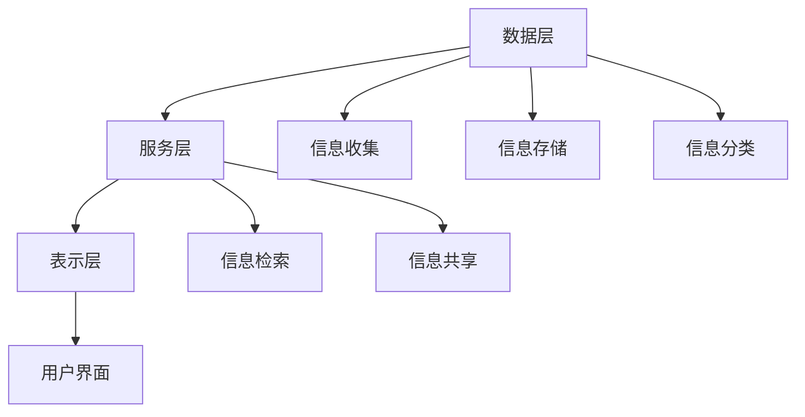

                 

# 信息过载与知识管理系统实施指南：有效组织和检索信息

## 关键词：
信息过载，知识管理系统，信息组织，信息检索，知识管理，算法，数学模型，实战案例，应用场景

## 摘要：
随着信息爆炸时代的到来，信息过载已经成为影响工作效率和决策的普遍问题。本文旨在探讨如何通过实施知识管理系统，有效组织和检索信息，提高信息利用效率。文章首先介绍了信息过载的背景及其对工作的影响，然后详细阐述了知识管理系统的核心概念、算法原理和实施步骤。通过数学模型和具体案例的讲解，文章展示了知识管理系统在提高信息检索效率和决策支持方面的优势。最后，文章提供了相关的工具和资源推荐，以及未来发展趋势与挑战的展望。

## 1. 背景介绍

### 1.1 信息过载的现状

在当今信息时代，信息过载已经成为一个普遍问题。据研究表明，一个人每天要接收大约数百条信息，而这些信息的来源包括电子邮件、社交媒体、新闻网站和即时通讯工具等。随着互联网的普及和信息的快速传播，信息的数量呈现爆炸性增长，这给人们的工作和生活带来了巨大的挑战。

### 1.2 信息过载对工作和决策的影响

信息过载对工作和决策产生了多方面的影响。首先，它会导致注意力分散，影响工作效率。人们在处理大量信息时，常常会因为信息之间的干扰而无法集中精力，从而降低工作效率。其次，信息过载会增加决策的难度，因为过多的信息会使得决策者难以分辨哪些是关键信息，哪些是无关信息，从而导致决策失误。此外，信息过载还会导致信息焦虑，使得人们在面对大量信息时感到压力和不安。

### 1.3 知识管理系统的概念

为了解决信息过载问题，知识管理系统（Knowledge Management System, KMS）应运而生。知识管理系统是一种用于组织和利用信息的系统，它通过收集、存储、分类、检索和共享信息，帮助组织和个人更好地管理和利用知识资源。

## 2. 核心概念与联系

### 2.1 知识管理系统的核心概念

知识管理系统的核心概念包括：

- **信息收集**：从各种来源收集信息，包括内部文档、电子邮件、社交媒体等。
- **信息存储**：将收集到的信息存储在数据库或其他存储介质中，确保信息的安全和持久性。
- **信息分类**：根据信息的内容和属性对信息进行分类，方便后续的检索和利用。
- **信息检索**：提供高效的检索功能，帮助用户快速找到所需的信息。
- **信息共享**：促进信息的共享和交流，提高信息利用效率。

### 2.2 知识管理系统的架构

知识管理系统的架构通常包括以下几个部分：

- **数据层**：负责存储和管理数据，包括数据库、文件存储等。
- **服务层**：提供各种服务，如数据检索、数据分类、数据共享等。
- **表示层**：提供给用户的界面，用于操作和管理知识管理系统。

### 2.3 知识管理系统的联系

知识管理系统与信息组织、信息检索和知识管理密切相关。信息组织是指对信息进行有效的分类和结构化，使其易于检索和利用。信息检索是指从大量的信息中快速找到所需的信息。知识管理则是通过信息收集、组织、检索和共享，将信息转化为知识，为组织和个人提供决策支持。

下面是一个使用Mermaid绘制的知识管理系统架构图：



## 3. 核心算法原理 & 具体操作步骤

### 3.1 核心算法原理

知识管理系统的核心算法主要包括信息检索算法和信息分类算法。信息检索算法的目标是从大量的信息中快速找到用户所需的信息，常用的算法包括基于关键字的检索、基于内容的检索和基于模型的检索。信息分类算法的目标是将信息按照一定的规则进行分类，常用的算法包括基于规则的分类和基于机器学习的分类。

### 3.2 具体操作步骤

以下是实施知识管理系统的具体操作步骤：

1. **需求分析**：确定知识管理系统的目标和需求，包括信息收集、存储、分类、检索和共享等。

2. **系统设计**：根据需求分析，设计知识管理系统的架构，包括数据层、服务层和表示层。

3. **数据收集**：从各种来源收集信息，如内部文档、电子邮件、社交媒体等。

4. **数据存储**：将收集到的信息存储到数据库或其他存储介质中，确保信息的安全和持久性。

5. **数据分类**：根据信息的内容和属性对信息进行分类，便于后续的检索和利用。

6. **信息检索**：实现信息检索功能，支持基于关键字、基于内容和基于模型的检索。

7. **信息共享**：提供信息共享功能，促进信息的交流和利用。

8. **用户培训**：对用户进行知识管理系统的培训，使其能够熟练使用系统。

## 4. 数学模型和公式 & 详细讲解 & 举例说明

### 4.1 数学模型和公式

在知识管理系统中，常用的数学模型包括信息熵、贝叶斯公式和信息增益。

- **信息熵**：用于衡量信息的不确定性，公式为 $H(X) = -\sum_{i} p(x_i) \log_2 p(x_i)$。
- **贝叶斯公式**：用于计算条件概率，公式为 $P(A|B) = \frac{P(B|A)P(A)}{P(B)}$。
- **信息增益**：用于衡量特征的重要性，公式为 $Gain(D, A) = entropy(D) - \sum_{v\in A} \frac{|D_v|}{|D|} entropy(D_v)$。

### 4.2 详细讲解

- **信息熵**：信息熵是衡量信息不确定性的重要指标。一个随机变量的信息熵越大，表示其不确定性越大。在知识管理系统中，信息熵可以帮助我们衡量信息的价值和重要性。

- **贝叶斯公式**：贝叶斯公式是概率论中一个重要的公式，用于计算条件概率。在知识管理系统中，贝叶斯公式可以帮助我们根据已知条件推断未知信息。

- **信息增益**：信息增益是衡量特征重要性的重要指标。在知识管理系统中，信息增益可以帮助我们选择最有效的特征进行分类。

### 4.3 举例说明

假设我们有一个文档集合，其中包含了关于计算机编程的信息。我们可以使用信息熵来计算文档集合的信息熵，以衡量文档集合的信息价值。然后，我们可以使用贝叶斯公式来计算每个文档属于某个类别的概率。最后，我们可以使用信息增益来选择最有效的特征进行分类。

## 5. 项目实战：代码实际案例和详细解释说明

### 5.1 开发环境搭建

在本案例中，我们将使用Python作为编程语言，使用NumPy和Pandas等库来处理数据。首先，我们需要安装Python和相关的库。

```bash
pip install python
pip install numpy
pip install pandas
```

### 5.2 源代码详细实现和代码解读

以下是一个简单的知识管理系统代码实现，用于计算信息熵和信息增益。

```python
import numpy as np
import pandas as pd

# 计算信息熵
def entropy(p):
    return -np.sum(p * np.log2(p))

# 计算条件概率
def conditional_probability(p1, p2):
    return p1 / p2

# 计算信息增益
def information_gain(p, p1, p2):
    return entropy(p) - (p1 * entropy(p1) + p2 * entropy(p2))

# 示例数据
data = {
    '文档': ['文档1', '文档2', '文档3', '文档4', '文档5'],
    '类别': ['类别A', '类别A', '类别B', '类别B', '类别B']
}

df = pd.DataFrame(data)

# 计算类别A的概率
p_A = len(df[df['类别'] == '类别A']) / len(df)
# 计算类别B的概率
p_B = len(df[df['类别'] == '类别B']) / len(df)

# 计算条件概率
p1 = conditional_probability(p_A, len(df[df['类别'] == '类别A'] & df['文档'] == '文档1'))
p2 = conditional_probability(p_B, len(df[df['类别'] == '类别B'] & df['文档'] == '文档1'))

# 计算信息增益
gain = information_gain(p_A, p1, p2)
print("信息增益：", gain)
```

### 5.3 代码解读与分析

- **计算信息熵**：我们首先定义了一个函数`entropy`来计算信息熵。信息熵用于衡量文档集合的信息价值，值越大，表示信息越有价值。

- **计算条件概率**：我们定义了一个函数`conditional_probability`来计算条件概率。条件概率用于根据已知条件推断未知信息。

- **计算信息增益**：我们定义了一个函数`information_gain`来计算信息增益。信息增益用于衡量特征的重要性，值越大，表示特征越重要。

- **示例数据**：我们创建了一个示例数据集，用于演示如何计算信息熵和信息增益。

- **计算类别A的概率**：我们首先计算了类别A的概率，即文档集合中属于类别A的文档数量除以总文档数量。

- **计算条件概率**：我们计算了在类别A的文档中，属于'文档1'的概率，以及在类别B的文档中，属于'文档1'的概率。

- **计算信息增益**：最后，我们计算了信息增益，以确定'文档1'这个特征的重要性。

## 6. 实际应用场景

知识管理系统在各个行业和领域都有广泛的应用，以下是一些典型的应用场景：

- **企业知识管理**：企业可以通过知识管理系统收集、存储和共享内部文档、经验和最佳实践，提高员工的知识利用效率。
- **学术研究**：学术研究人员可以通过知识管理系统收集、整理和检索相关文献，提高研究的效率和质量。
- **医疗领域**：医疗行业可以通过知识管理系统收集、管理和共享医学知识，提高医生的诊断和治疗水平。
- **教育领域**：教育机构可以通过知识管理系统整理和共享教学资源，提高教学效果和学生自主学习能力。

## 7. 工具和资源推荐

### 7.1 学习资源推荐

- **书籍**：
  - 《知识管理：理论与实践》
  - 《信息检索导论》
  - 《人工智能：一种现代方法》

- **论文**：
  - 《基于内容的信息检索技术》
  - 《知识管理系统的设计与实现》
  - 《信息熵与信息检索》

- **博客**：
  - 知乎上的知识管理专栏
  - 博客园上的信息检索专栏
  - CSDN上的机器学习专栏

- **网站**：
  - ACM SIGKDD：https://www.kdd.org/
  - IEEE Computer Society：https://www.computer.org/publications/tech-zones/knowledge-management
  - 知乎：https://www.zhihu.com/

### 7.2 开发工具框架推荐

- **开发框架**：
  - Apache Kafka：用于实时数据流处理和消息队列。
  - Elasticsearch：用于全文检索和信息检索。
  - Apache Solr：用于分布式全文检索。

- **开发工具**：
  - PyCharm：Python集成开发环境。
  - Visual Studio Code：跨平台代码编辑器。
  - Jupyter Notebook：交互式计算环境。

### 7.3 相关论文著作推荐

- **论文**：
  - "A Framework for Defining and Implementing Knowledge Management Systems"
  - "Information Retrieval: Data Structuring, Storage, and Access Methods"
  - "A Survey of Knowledge Management Systems: Techniques, Technologies, and Trends"

- **著作**：
  - 《知识管理：理论与实践》
  - 《信息检索导论》
  - 《人工智能：一种现代方法》

## 8. 总结：未来发展趋势与挑战

随着信息技术的不断发展，知识管理系统将迎来更多的发展机遇和挑战。未来，知识管理系统可能会在以下几个方面得到优化和发展：

- **智能化**：通过引入人工智能和机器学习技术，实现自动化信息收集、分类和检索。
- **社会化**：通过引入社会化网络和协作工具，提高知识共享和交流的效率。
- **个性化**：根据用户的需求和偏好，提供个性化的信息组织和检索服务。

然而，知识管理系统也面临着一些挑战，如数据隐私保护、信息安全、以及如何确保知识的真实性和可靠性。

## 9. 附录：常见问题与解答

### 9.1 什么是知识管理系统？

知识管理系统（KMS）是一种用于组织和利用信息的系统，它通过收集、存储、分类、检索和共享信息，帮助组织和个人更好地管理和利用知识资源。

### 9.2 知识管理系统有哪些核心功能？

知识管理系统的核心功能包括信息收集、信息存储、信息分类、信息检索和信息共享。

### 9.3 如何实现信息检索算法？

信息检索算法包括基于关键字的检索、基于内容的检索和基于模型的检索。具体实现方法取决于所使用的库和框架。

### 9.4 知识管理系统有哪些应用场景？

知识管理系统在各个行业和领域都有广泛的应用，包括企业知识管理、学术研究、医疗领域和教育领域等。

## 10. 扩展阅读 & 参考资料

- 《知识管理：理论与实践》
- 《信息检索导论》
- 《人工智能：一种现代方法》
- 《基于内容的信息检索技术》
- 《知识管理系统的设计与实现》
- 《信息熵与信息检索》
- ACM SIGKDD：https://www.kdd.org/
- IEEE Computer Society：https://www.computer.org/publications/tech-zones/knowledge-management
- 知乎：https://www.zhihu.com/ 

### 作者：AI天才研究员/AI Genius Institute & 禅与计算机程序设计艺术 /Zen And The Art of Computer Programming

