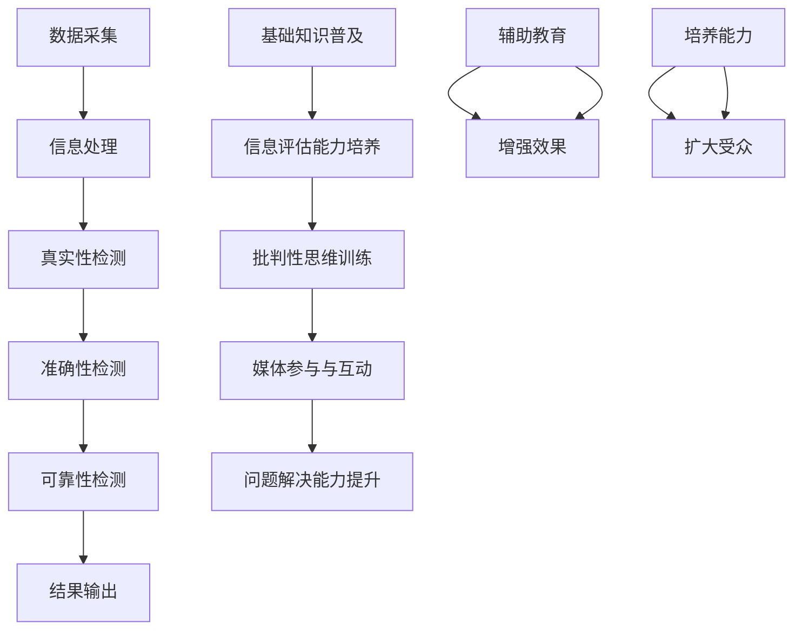

                 

### 文章标题

**信息验证和在线媒体素养教育：为假新闻和媒体操纵做好准备**

### 关键词

- 信息验证
- 媒体素养教育
- 假新闻
- 媒体操纵
- 信息安全
- 知识图谱
- 自然语言处理
- 人工智能

### 摘要

在信息爆炸的时代，假新闻和媒体操纵已成为全球性挑战。本文深入探讨了信息验证和在线媒体素养教育的重要性，以及如何通过人工智能技术应对这一挑战。文章首先介绍了信息验证的概念、技术方法和应用场景，然后详细分析了媒体素养教育的内容、目标和实施策略。最后，本文提出了基于人工智能的信息验证和媒体素养教育解决方案，包括技术框架、算法原理和实际应用案例，为应对假新闻和媒体操纵提供了切实可行的路径。通过本文的阅读，读者将更好地理解信息验证和媒体素养教育的重要性，并掌握相关技术的应用方法和实践策略。

<markdown>
## 1. 背景介绍

在当今信息时代，媒体已成为人们获取信息和知识的主要途径。然而，随着互联网和社交媒体的普及，假新闻和媒体操纵的问题也日益严重。这些现象不仅对个人造成了误导和困扰，还对整个社会造成了深远的影响。

### 假新闻的定义和影响

假新闻是指那些虚假、误导性或未经证实的信息，其目的是欺骗、误导或操纵公众。这些信息通常以新闻、文章、图片或视频的形式传播，往往具有极强的迷惑性和吸引力。假新闻的传播速度快、范围广，容易在短时间内引起公众的关注和恐慌，对社会秩序和公共利益造成严重威胁。

假新闻的影响主要体现在以下几个方面：

1. **误导公众**：假新闻会导致公众对事实的误解，影响他们的判断和决策。
2. **破坏信任**：假新闻会破坏公众对媒体和信息的信任，影响社会稳定和健康发展。
3. **社会动荡**：在某些极端情况下，假新闻甚至可能引发社会动荡和冲突。

### 媒体操纵的定义和影响

媒体操纵是指通过控制、篡改或筛选信息，以操纵公众意见、影响政策制定或实现特定目的的行为。媒体操纵的手段多样，包括虚假报道、信息篡改、选择性报道等。媒体操纵对社会的危害性不亚于假新闻，甚至更为深远。

媒体操纵的影响主要包括：

1. **操纵舆论**：媒体操纵可以引导公众舆论，影响公共政策和公众决策。
2. **扭曲事实**：媒体操纵会扭曲事实，误导公众，破坏社会公正。
3. **威胁民主**：媒体操纵可能威胁民主制度的稳定，影响选举公正和政府决策。

### 信息验证的定义和重要性

信息验证是指通过一定的方法和手段，对信息的真实性、准确性和可靠性进行验证和确认。在假新闻和媒体操纵泛滥的时代，信息验证变得尤为重要。

信息验证的重要性体现在以下几个方面：

1. **保护公众**：信息验证可以帮助公众辨别真假信息，避免受到假新闻和媒体操纵的误导。
2. **维护信任**：信息验证有助于维护公众对媒体和信息的信任，促进社会和谐稳定。
3. **支持决策**：信息验证可以为政策制定者提供真实可靠的信息，帮助他们做出更明智的决策。

### 媒体素养教育的定义和目标

媒体素养教育是指通过教育和培训，提高公众对媒体信息的理解和批判能力，帮助他们更好地应对假新闻和媒体操纵的挑战。媒体素养教育的目标是：

1. **提高信息素养**：帮助公众掌握获取、评估和使用信息的基本技能。
2. **培养批判性思维**：培养公众对媒体信息的批判性思维，提高他们辨别真假信息的能力。
3. **增强社会责任感**：引导公众积极参与社会事务，发挥积极作用。

### 人工智能在信息验证和媒体素养教育中的应用

人工智能技术在信息验证和媒体素养教育中具有重要的应用价值。通过自然语言处理、图像识别、知识图谱等人工智能技术，可以实现对信息的自动验证和筛选，提高信息验证的效率和准确性。

人工智能在信息验证和媒体素养教育中的应用主要包括以下几个方面：

1. **信息验证**：利用自然语言处理技术，对网络上的信息进行自动提取、分类和验证，帮助公众辨别真假信息。
2. **媒体素养教育**：通过分析大量媒体信息，构建媒体素养教育模型，为公众提供个性化的教育内容和指导。
3. **辅助决策**：利用人工智能技术，为政策制定者和媒体监管机构提供数据支持和决策依据，帮助他们更有效地应对假新闻和媒体操纵。

## 2. 核心概念与联系

### 信息验证的概念与架构

#### 信息验证的定义

信息验证（Information Verification）是指通过一系列技术手段，对信息的真实性、准确性和可靠性进行检测和确认的过程。它是保障信息质量和信息信任的关键环节，尤其是在互联网和社交媒体时代，面对海量、多变的信息，信息验证显得尤为重要。

#### 信息验证的架构

信息验证的架构通常包括以下几个关键组成部分：

1. **数据采集**：收集待验证的信息，这些信息可以来源于互联网、社交媒体、新闻媒体等。
2. **信息处理**：对采集到的信息进行预处理，包括去噪、去重复、格式化等。
3. **真实性检测**：使用技术手段，如自然语言处理（NLP）、图像识别等，对信息进行真实性检测。
4. **准确性检测**：对信息的准确性进行检测，包括事实核查、引用验证等。
5. **可靠性检测**：评估信息来源的可靠性，包括来源的权威性、可信度等。
6. **结果输出**：将验证结果以可视化的形式呈现给用户，帮助用户更好地理解和决策。

### 媒体素养教育的概念与架构

#### 媒体素养教育的定义

媒体素养教育（Media Literacy Education）是指通过教育手段，提高公众对媒体信息的理解、批判和使用能力。它旨在帮助公众在信息爆炸的时代，能够独立思考、理性判断，避免受到假新闻和媒体操纵的影响。

#### 媒体素养教育的架构

媒体素养教育的架构通常包括以下几个关键组成部分：

1. **基础知识普及**：教授公众关于媒体的基本知识，包括媒体的种类、传播方式、影响力等。
2. **信息评估能力培养**：帮助公众掌握评估信息真实性和准确性的技能，如事实核查、引用验证等。
3. **批判性思维训练**：培养公众对媒体信息的批判性思维，提高他们的判断力。
4. **媒体参与与互动**：鼓励公众参与媒体活动，增强他们的社会责任感。
5. **问题解决能力提升**：教授公众如何应对假新闻和媒体操纵，包括举报、报告等。

### 信息验证与媒体素养教育的联系

信息验证和媒体素养教育有着密切的联系，二者相互补充，共同构建了一个全面的信息验证和素养提升体系。

#### 信息验证对媒体素养教育的作用

1. **辅助教育**：通过信息验证技术，可以为媒体素养教育提供真实、可靠的信息素材，帮助教育者更好地开展教学。
2. **增强效果**：信息验证可以帮助公众更快速地辨别真假信息，提高他们对媒体素养教育的参与度和效果。

#### 媒体素养教育对信息验证的作用

1. **培养能力**：媒体素养教育可以培养公众的信息评估和批判性思维能力，提高他们对信息验证技术的理解和应用。
2. **扩大受众**：通过媒体素养教育，可以扩大信息验证技术的受众范围，使更多的人受益于信息验证技术。

#### 人工智能在信息验证与媒体素养教育中的应用

人工智能技术在信息验证和媒体素养教育中发挥着重要作用，通过自然语言处理、图像识别、知识图谱等技术，可以提高信息验证的效率和准确性，同时为媒体素养教育提供个性化、智能化的支持。

1. **信息验证**：利用自然语言处理技术，可以自动提取、分类和验证网络信息，提高信息验证的效率。
2. **媒体素养教育**：通过分析大量媒体信息，构建教育模型，为公众提供个性化的教育内容和指导。

### Mermaid 流程图

以下是信息验证和媒体素养教育架构的 Mermaid 流程图：

通过上述流程图，我们可以清晰地看到信息验证和媒体素养教育的架构及其相互关系，以及人工智能技术在其中的应用。

## 3. 核心算法原理 & 具体操作步骤

### 信息验证的核心算法原理

信息验证的核心算法主要包括自然语言处理（NLP）、图像识别和知识图谱等。以下将详细阐述这些算法的原理和应用。

#### 自然语言处理（NLP）

自然语言处理是一种模拟人类语言理解的技术，它通过文本挖掘、情感分析、实体识别等方式，对自然语言进行解析和处理。

1. **文本挖掘**：文本挖掘是从大量文本数据中提取有价值信息的过程。它包括关键词提取、主题建模、情感分析等。

2. **情感分析**：情感分析是判断文本中的情感倾向，如积极、消极、中性等。它可以帮助判断新闻或信息的真实性和可信度。

3. **实体识别**：实体识别是识别文本中的名词性实体，如人名、地名、组织名等。通过实体识别，可以关联到已知的事实和知识库，验证信息的真实性。

#### 图像识别

图像识别是一种通过计算机视觉技术，对图像进行分析和处理，从而识别和理解图像内容的方法。

1. **图像分类**：图像分类是将图像划分到不同的类别中。例如，可以将新闻中的图片分类为真实图片和虚假图片。

2. **图像检测**：图像检测是在图像中识别出特定的目标物体或场景。例如，可以在新闻图片中检测出篡改的痕迹。

#### 知识图谱

知识图谱是一种结构化知识库，它通过实体和关系构建一个大规模的语义网络。知识图谱可以帮助关联信息，验证信息的真实性。

1. **实体关联**：通过知识图谱，可以找到信息中的实体之间的关系，验证信息的逻辑一致性。

2. **知识推理**：利用知识图谱中的知识，进行逻辑推理，验证信息的真实性。

### 信息验证的具体操作步骤

以下是一个典型的信息验证流程：

1. **数据采集**：收集待验证的信息，可以是文本、图像等多种形式。

2. **预处理**：对采集到的信息进行预处理，包括去噪、去重复、格式化等。

3. **文本分析**：利用自然语言处理技术，对文本信息进行文本挖掘、情感分析和实体识别。

4. **图像分析**：利用图像识别技术，对图像信息进行分类和检测。

5. **知识库查询**：利用知识图谱，对信息中的实体进行关联和推理。

6. **综合评估**：综合文本分析、图像分析和知识库查询的结果，对信息的真实性进行评估。

7. **结果输出**：将验证结果以可视化的形式呈现给用户。

### 实际操作示例

以下是一个简单的信息验证示例：

**待验证信息**：一篇新闻报道，标题为“新冠病毒疫苗已研发成功”。

**操作步骤**：

1. **数据采集**：从互联网上获取这篇报道的文本和图片。

2. **预处理**：去除文本中的噪声，如标点符号、停用词等。

3. **文本分析**：
   - **文本挖掘**：提取关键词，如“新冠病毒”、“疫苗”、“研发成功”等。
   - **情感分析**：判断文本的情感倾向，如积极、消极、中性等。
   - **实体识别**：识别文本中的实体，如“新冠病毒”、“疫苗”等。

4. **图像分析**：检测新闻图片中的内容，判断是否存在篡改的痕迹。

5. **知识库查询**：查询知识图谱，找到与“新冠病毒疫苗”相关的信息。

6. **综合评估**：
   - 根据文本分析结果，判断报道中的信息是否存在误导。
   - 根据图像分析结果，判断新闻图片的真实性。
   - 根据知识库查询结果，验证报道中的信息的逻辑一致性。

7. **结果输出**：将验证结果以文本和图片的形式呈现给用户，如“该报道中的信息可能存在误导，请读者谨慎对待”。

通过上述操作步骤，我们可以对信息进行初步验证，帮助用户辨别真假信息。

## 4. 数学模型和公式 & 详细讲解 & 举例说明

### 自然语言处理中的数学模型

在自然语言处理（NLP）中，常用的数学模型包括词向量模型、情感分析模型和实体识别模型。以下将详细讲解这些模型，并提供具体的例子说明。

#### 词向量模型

词向量模型是将词语映射到高维空间中的向量，从而表示词语的含义和关系。最常用的词向量模型是Word2Vec模型，它基于神经网络算法，通过训练得到词语的向量表示。

**数学模型**：

令\(V\)为词向量空间，\(v_w\)为词语\(w\)的词向量。词向量模型的核心是一个神经网络，输入为词语\(w\)，输出为词向量\(v_w\)。

$$
h = \sigma(W_h \cdot [v_w; b_h])
$$

其中，\(W_h\)为权重矩阵，\(\sigma\)为激活函数，\(b_h\)为偏置项。

**例子说明**：

假设我们有一个简单的词向量模型，包含三个词语“苹果”、“香蕉”和“水果”。它们的词向量分别为：

- \(v_{苹果} = [1, 0, 1]\)
- \(v_{香蕉} = [0, 1, 0]\)
- \(v_{水果} = [1, 1, 1]\)

我们可以通过计算词语之间的相似度，来判断它们之间的关系。例如，计算“苹果”和“香蕉”之间的相似度：

$$
\text{相似度} = \frac{v_{苹果} \cdot v_{香蕉}}{||v_{苹果}|| \cdot ||v_{香蕉}||} = \frac{[1, 0, 1] \cdot [0, 1, 0]}{||[1, 0, 1]|| \cdot ||[0, 1, 0]||} = \frac{1}{\sqrt{2} \cdot \sqrt{2}} = \frac{1}{2}
$$

相似度越接近1，表示词语之间的关联性越强。

#### 情感分析模型

情感分析模型用于判断文本的情感倾向，如积极、消极、中性等。常用的情感分析模型包括朴素贝叶斯模型、支持向量机（SVM）和深度学习模型。

**数学模型**：

以朴素贝叶斯模型为例，假设文本包含多个词语\(w_1, w_2, ..., w_n\)，每个词语的概率分布为：

$$
P(w_i | \text{情感}) = \frac{P(\text{情感} | w_i) \cdot P(w_i)}{P(\text{情感})}
$$

其中，\(P(\text{情感} | w_i)\)表示在给定情感类别的条件下，词语\(w_i\)的概率；\(P(w_i)\)表示词语\(w_i\)的概率；\(P(\text{情感})\)表示情感类别的概率。

通过计算每个词语在积极、消极和中性情感条件下的概率，可以得到文本的整体情感倾向。

**例子说明**：

假设我们有一个简化的情感分析模型，包含两个情感类别：积极和消极。词语“喜欢”和“讨厌”分别表示积极和消极情感。它们的概率分布如下：

- \(P(积极 | 喜欢

