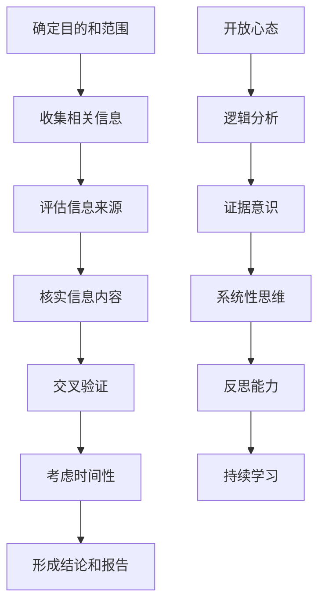

                 

### 信息验证和批判性思维能力培养：在假新闻和错误信息时代导航

#### 摘要

在当今信息爆炸的时代，假新闻和错误信息的泛滥对个体和社会造成了严重的影响。本文旨在探讨如何在假新闻和错误信息时代培养信息验证和批判性思维能力，以引导读者在信息海洋中导航。文章首先介绍了信息验证的重要性和当前面临的挑战，然后分析了批判性思维能力的核心要素，并提供了具体的方法和工具，以帮助读者培养这种能力。此外，本文还探讨了信息验证和批判性思维能力在实际应用中的场景，并推荐了一些学习资源和开发工具。最后，文章总结了未来的发展趋势与挑战，并提出了常见问题与解答。通过本文的阅读，读者将能够更好地识别和处理假新闻和错误信息，培养批判性思维能力，从而在信息时代中保持清晰的判断力和独立思考的能力。

#### 1. 背景介绍

在互联网和社交媒体高度发展的今天，信息传播的速度和广度前所未有。然而，这一方面带来了信息获取的便捷性，另一方面也导致了信息真伪难以辨识的问题。假新闻、错误信息和虚假信息在网络中迅速传播，对社会和个人造成了严重的负面影响。据调查，虚假信息的传播速度是真实信息的数十倍，这使得人们在面对各种信息时，往往难以分辨其真伪。此外，虚假信息的传播还会引发恐慌、误导公众、破坏社会稳定，甚至影响国家安全。

信息验证成为了一个重要课题。信息验证是指通过各种方法和手段，对信息的真实性、准确性和可靠性进行评估和确认的过程。在假新闻和错误信息泛滥的背景下，信息验证的重要性愈发凸显。只有通过严谨的信息验证，我们才能避免被虚假信息所误导，从而做出准确的判断和决策。

然而，当前的信息验证面临着诸多挑战。首先，信息的庞杂性和多样性使得验证过程变得复杂。大量的信息来源各异，真实性难以判断。其次，信息传播的匿名性和速度使得验证过程时间紧迫。许多虚假信息在短时间内就能广泛传播，留给验证的时间极为有限。此外，技术手段的局限性也限制了信息验证的准确性。尽管大数据分析和人工智能等技术为信息验证提供了工具，但仍然无法完全消除错误信息的传播。

在信息爆炸的时代，培养批判性思维能力也显得尤为重要。批判性思维能力是指在面对各种信息和观点时，能够进行独立思考、分析和判断的能力。批判性思维能力的培养有助于我们更好地识别虚假信息，提高信息处理的准确性。此外，批判性思维能力还能帮助我们形成独立的人格和价值观，从而在面对复杂多变的社会环境时，保持清晰的判断力和自主思考的能力。

本文将围绕信息验证和批判性思维能力展开讨论，旨在为读者提供一套系统的方法和工具，帮助他们在假新闻和错误信息时代中导航。通过本文的阅读，读者将了解信息验证的重要性，掌握批判性思维能力的基本要素，并学会在实际应用中运用这些能力。

#### 2. 核心概念与联系

在深入探讨信息验证和批判性思维能力之前，我们需要明确一些核心概念和它们之间的联系。

**2.1 信息验证**

信息验证是指对信息的真实性、准确性和可靠性进行评估和确认的过程。这一过程包括以下几个关键步骤：

1. **信息来源的评估**：对信息来源的权威性、信誉度和背景进行调查，以判断其可靠程度。
2. **信息内容的检查**：对信息内容进行详细分析和核实，包括事实、数据和引用的准确性。
3. **交叉验证**：通过查阅多个来源的信息，进行比对和验证，以确认信息的准确性。
4. **时间性考虑**：对信息发布的时间进行评估，以判断其时效性。

**2.2 批判性思维能力**

批判性思维能力是指在面对信息和观点时，能够进行独立思考、分析和判断的能力。批判性思维能力的核心要素包括：

1. **开放心态**：对不同的观点和信息持开放态度，不轻易接受或排斥。
2. **逻辑分析**：运用逻辑推理和分析，识别信息中的逻辑错误和矛盾。
3. **证据意识**：注重证据和事实，不凭直觉或主观判断。
4. **系统性思维**：从多个角度和层面分析问题，形成全面的认识。
5. **反思能力**：不断反思和调整自己的观点和思考过程。

**2.3 信息验证与批判性思维能力的联系**

信息验证和批判性思维能力密切相关，它们共同构成了我们在信息时代中导航的重要工具。具体来说，批判性思维能力为信息验证提供了思考框架和方法论，而信息验证则为批判性思维能力提供了实际操作的对象和依据。

1. **批判性思维能力的培养有助于提高信息验证的效率和质量**：通过批判性思维，我们能够更好地识别和评估信息中的问题和漏洞，从而提高信息验证的准确性和全面性。
2. **信息验证的过程有助于培养批判性思维能力**：在信息验证的过程中，我们需要进行深入的分析、比对和思考，这有助于锻炼我们的批判性思维能力。
3. **信息验证和批判性思维能力相辅相成**：在处理信息时，信息验证和批判性思维能力共同发挥作用，使我们能够在复杂的背景下做出准确的判断和决策。

通过理解这些核心概念和它们之间的联系，我们将能够更好地掌握信息验证和批判性思维能力，从而在信息时代中保持清晰的判断力和独立思考的能力。

#### 2.1.1 信息验证的流程

信息验证是一个系统性的过程，它需要遵循一定的步骤，以确保信息的真实性和准确性。以下是信息验证的主要流程：

**1. 确定信息验证的目的和范围**

在开始信息验证之前，首先要明确验证的目的和范围。这包括确定需要验证的信息类型、涉及的主题、目标受众等。例如，当我们需要验证一篇新闻的真实性时，我们可以明确要核实的是新闻中的具体事实、数据来源和引用。

**2. 收集相关信息**

收集与待验证信息相关的多个来源的信息。这一步骤至关重要，因为单一来源的信息可能存在偏见或错误。通过查阅多个来源，我们可以提高信息验证的全面性和准确性。

**3. 评估信息来源的可靠性**

对收集到的信息来源进行评估，包括来源的权威性、信誉度、背景和发布者的专业性。例如，官方发布的统计数据通常比社交媒体上的匿名言论更具可靠性。

**4. 核实信息内容**

对信息内容进行详细分析和核实。这包括检查信息中的事实、数据和引用是否准确，是否存在逻辑错误或矛盾。例如，我们可以查阅原始数据源，对比新闻中的数据和报告中的数据，以确认其一致性。

**5. 交叉验证**

通过查阅多个来源的信息，进行比对和验证，以确认信息的准确性。交叉验证有助于发现单一来源可能遗漏的信息或错误。

**6. 考虑信息的时间性**

对信息发布的时间进行评估，以判断其时效性。过时的信息可能不再适用或已发生重大变化，需要特别关注。

**7. 形成结论和报告**

根据信息验证的结果，形成结论和报告。报告应详细说明验证的过程、方法和结果，以便其他人参考和验证。

通过以上步骤，我们可以系统地验证信息的真实性、准确性和可靠性，从而在信息海洋中导航，避免被虚假信息所误导。

#### 2.1.2 批判性思维的核心要素

批判性思维能力是一种关键的能力，它有助于我们在面对复杂信息时，能够进行独立思考、分析和判断。以下是批判性思维的核心要素：

**1. 开放心态**

开放心态是指对不同的观点和信息持开放态度，不轻易接受或排斥。这种心态有助于我们接受新的观点，避免先入为主，从而在信息处理过程中保持客观和全面。

**2. 逻辑分析**

逻辑分析是指运用逻辑推理和分析，识别信息中的逻辑错误和矛盾。逻辑分析帮助我们识别信息中的谬误，从而做出更准确的判断。

**3. 证据意识**

证据意识是指注重证据和事实，不凭直觉或主观判断。在批判性思维中，证据是我们判断的依据，只有基于充分证据的思考才是可靠的。

**4. 系统性思维**

系统性思维是指从多个角度和层面分析问题，形成全面的认识。系统性思维使我们能够看到问题的多个维度，避免片面和狭隘的思考。

**5. 反思能力**

反思能力是指不断反思和调整自己的观点和思考过程。通过反思，我们能够识别和纠正思考中的错误，提高批判性思维的能力。

**6. 持续学习**

持续学习是指不断更新知识和技能，以适应信息时代的变化。批判性思维需要不断学习和实践，才能不断提高。

通过培养这些核心要素，我们能够更好地应对复杂的信息环境，做出准确的判断和决策。

#### 2.1.3 Mermaid 流程图

为了更好地展示信息验证和批判性思维能力的流程，我们可以使用Mermaid语言绘制一个流程图。以下是流程图的示例：



在此流程图中，节点A到G代表了信息验证的流程，节点H到M代表了批判性思维的核心要素。通过这个流程图，我们可以清晰地看到信息验证和批判性思维能力的关联和作用。

### 3. 核心算法原理 & 具体操作步骤

为了更深入地理解信息验证和批判性思维能力，我们可以探讨一些核心算法原理和具体操作步骤。以下是几个重要的算法和工具：

#### 3.1 信息验证算法

**1. 引入算法：**

信息验证算法主要用于检查信息的真实性和准确性。常见的算法包括数据源验证、内容比对和证据分析等。

**2. 数据源验证：**

数据源验证是指对信息来源的权威性、信誉度和背景进行评估。具体步骤如下：

- **收集信息来源**：从多个渠道收集相关信息。
- **评估来源权威性**：通过查阅来源的背景资料，了解其专业性和可信度。
- **交叉验证来源**：通过查阅多个来源的信息，比对其一致性和可靠性。

**3. 内容比对：**

内容比对是指对信息内容进行详细分析和核实，以确认其准确性。具体步骤如下：

- **提取关键信息**：从信息中提取关键的事实、数据和引用。
- **对比来源内容**：对比不同来源的信息内容，查找不一致之处。
- **引用核实**：对引用的内容进行核实，确认其真实性和准确性。

**4. 证据分析：**

证据分析是指对信息的证据进行评估和验证。具体步骤如下：

- **收集证据**：从多个来源收集与信息相关的证据。
- **评估证据质量**：对证据的质量进行评估，包括证据的可靠性、权威性和相关性。
- **验证证据**：对证据进行验证，确认其真实性和准确性。

#### 3.2 批判性思维能力算法

**1. 引入算法：**

批判性思维能力算法主要用于帮助我们在面对复杂信息时，能够进行独立思考、分析和判断。常见的算法包括逻辑分析、证据分析和反思算法等。

**2. 逻辑分析：**

逻辑分析是指运用逻辑推理和分析，识别信息中的逻辑错误和矛盾。具体步骤如下：

- **识别逻辑结构**：分析信息的逻辑结构和推理过程。
- **检查逻辑谬误**：识别常见的逻辑谬误，如偷换概念、以偏概全等。
- **提出反证**：通过反证来验证信息的逻辑合理性。

**3. 证据分析：**

证据分析是指对信息的证据进行评估和验证。具体步骤如下：

- **提取证据信息**：从信息中提取关键证据。
- **评估证据质量**：对证据的质量进行评估，包括证据的可靠性、权威性和相关性。
- **验证证据**：对证据进行验证，确认其真实性和准确性。

**4. 反思算法：**

反思算法是指通过不断反思和调整自己的观点和思考过程，以提高批判性思维能力。具体步骤如下：

- **反思思考过程**：回顾自己的思考过程，识别其中的错误和不足。
- **调整观点**：根据反思结果，调整自己的观点和思考方式。
- **持续学习**：通过不断学习和实践，提高批判性思维能力。

#### 3.3 实际操作步骤

以下是一个基于信息验证和批判性思维能力的实际操作示例：

**1. 确定验证目的和范围：**

我们需要验证一篇关于新冠疫苗接种效果的新闻报道。具体内容包括疫苗的有效性、副作用等。

**2. 收集相关信息：**

从多个渠道收集关于新冠疫苗接种效果的信息，包括官方发布的数据、医学论文和新闻报道等。

**3. 评估信息来源：**

评估信息来源的权威性、信誉度和背景。例如，优先考虑来自官方机构和权威医学期刊的信息。

**4. 核实信息内容：**

对收集到的信息进行详细分析和核实，包括疫苗的有效性数据、副作用报告等。比对不同来源的信息，查找不一致之处。

**5. 交叉验证：**

通过查阅多个来源的信息，进行比对和验证，以确认信息的准确性。例如，对比不同国家的疫苗接种效果数据。

**6. 考虑信息的时间性：**

评估信息发布的时间，确认其时效性。例如，关注最近的新冠疫苗研究进展。

**7. 形成结论和报告：**

根据验证结果，形成结论和报告，详细说明验证的过程、方法和结果。

**8. 批判性思维应用：**

在验证过程中，运用批判性思维能力，识别信息中的逻辑错误和矛盾，提出反证，调整观点，确保验证结果的准确性和可靠性。

通过以上操作步骤，我们能够更好地进行信息验证和批判性思考，提高信息处理的准确性和判断力。

### 4. 数学模型和公式 & 详细讲解 & 举例说明

在信息验证和批判性思维能力的培养中，数学模型和公式扮演着重要的角色。这些工具帮助我们更准确地分析和评估信息的真实性和可靠性。以下是一些常用的数学模型和公式，以及它们的详细讲解和具体应用示例。

#### 4.1 贝叶斯定理

贝叶斯定理是一种用于概率推理的数学模型，它可以帮助我们根据已知数据和先验概率来更新后验概率。贝叶斯定理的表达式如下：

\[ P(A|B) = \frac{P(B|A) \cdot P(A)}{P(B)} \]

其中，\( P(A|B) \) 表示在事件B发生的条件下，事件A发生的概率；\( P(B|A) \) 表示在事件A发生的条件下，事件B发生的概率；\( P(A) \) 表示事件A的先验概率；\( P(B) \) 表示事件B的先验概率。

**详细讲解：**

贝叶斯定理的核心在于通过已知条件和先验概率来更新后验概率。例如，假设我们想知道一个产品是否合格，已知该产品合格的概率是0.95，现在我们进行了100次测试，其中有5次测试结果显示不合格。我们可以使用贝叶斯定理来更新我们对产品合格性的判断。

**举例说明：**

假设我们先验认为产品合格的概率是0.95，即 \( P(\text{合格}) = 0.95 \)。现在我们进行了100次测试，其中有5次不合格，即 \( P(\text{不合格}|\text{合格}) = 0.05 \)。

我们需要计算在进行了100次测试后，产品合格的后验概率：

\[ P(\text{合格}|\text{测试结果}) = \frac{P(\text{测试结果}|\text{合格}) \cdot P(\text{合格})}{P(\text{测试结果})} \]

\[ P(\text{测试结果}|\text{合格}) = (1 - P(\text{不合格}|\text{合格}))^{100} = (1 - 0.05)^{100} \approx 0.965 \]

假设不合格的概率为均匀分布，即 \( P(\text{不合格}) = 0.05 \)。

\[ P(\text{合格}|\text{测试结果}) = \frac{0.965 \cdot 0.95}{0.965 \cdot 0.95 + 0.035 \cdot 0.05} \approx 0.972 \]

因此，在进行了100次测试后，我们更新后验认为产品合格的概率大约是0.972。

#### 4.2 逻辑回归模型

逻辑回归模型是一种用于分类的统计模型，它可以用来预测某个事件发生的概率。逻辑回归模型的公式如下：

\[ \log\frac{P(Y=1)}{1-P(Y=1)} = \beta_0 + \beta_1 X_1 + \beta_2 X_2 + \cdots + \beta_n X_n \]

其中，\( \beta_0 \) 是截距，\( \beta_1, \beta_2, \ldots, \beta_n \) 是回归系数，\( X_1, X_2, \ldots, X_n \) 是自变量，\( Y \) 是因变量。

**详细讲解：**

逻辑回归模型通过线性组合自变量和回归系数，来计算因变量的对数几率。通过对数几率，我们可以将线性模型转换为概率模型。例如，我们可以使用逻辑回归模型来预测一个产品是否合格，基于一些特征（如生产批次、检查结果等）。

**举例说明：**

假设我们有一个逻辑回归模型来预测一个产品是否合格，模型如下：

\[ \log\frac{P(Y=1)}{1-P(Y=1)} = \beta_0 + \beta_1 \text{批次} + \beta_2 \text{检查结果} \]

其中，批次和检查结果是我们的自变量，Y是因变量，表示产品是否合格。

如果我们有一个新的产品，其批次为3，检查结果为优秀，我们可以使用逻辑回归模型来预测其合格的概率：

\[ \log\frac{P(Y=1)}{1-P(Y=1)} = \beta_0 + \beta_1 \cdot 3 + \beta_2 \cdot 优秀 \]

通过计算得到的对数几率，我们可以将其转换为概率：

\[ P(Y=1) = \frac{1}{1 + e^{-(\beta_0 + \beta_1 \cdot 3 + \beta_2 \cdot 优秀)}} \]

例如，如果计算得到的对数几率是2，那么概率大约是：

\[ P(Y=1) = \frac{1}{1 + e^{-2}} \approx 0.865 \]

因此，这个新产品的合格概率大约是86.5%。

#### 4.3 假设检验

假设检验是一种用于判断两个或多个样本之间是否存在显著差异的方法。常见的假设检验包括t检验、方差分析和卡方检验等。

**详细讲解：**

假设检验的基本思想是，通过收集样本数据，判断样本结果是否显著，从而推断总体情况。假设检验包括两个步骤：建立原假设和备择假设，以及计算检验统计量，判断其显著性。

**举例说明：**

假设我们想要检验两个产品的合格率是否有显著差异。我们可以使用卡方检验来进行这个分析。

首先，我们假设原假设 \( H_0 \)：两个产品的合格率相等。备择假设 \( H_1 \)：两个产品的合格率不相等。

然后，我们收集两个产品的合格率数据，例如：

| 产品A | 产品B |
|-------|-------|
| 90%   | 80%   |

我们可以计算卡方统计量：

\[ \chi^2 = \sum \frac{(O - E)^2}{E} \]

其中，\( O \) 是观察值，\( E \) 是期望值。通过计算得到的卡方统计量，我们可以与卡方分布表中的临界值进行比较，判断其显著性。

例如，如果计算得到的卡方统计量是5，自由度为1，我们可以查表得到，在显著性水平为0.05的情况下，临界值是3.84。由于计算得到的卡方统计量大于临界值，我们可以拒绝原假设，接受备择假设，认为两个产品的合格率存在显著差异。

通过以上数学模型和公式的讲解和示例，我们可以更好地理解信息验证和批判性思维能力的数学基础，并在实际应用中运用这些工具来提高信息处理的准确性和可靠性。

### 5. 项目实战：代码实际案例和详细解释说明

在本节中，我们将通过一个实际项目实战，展示如何使用信息验证和批判性思维能力来处理信息，并提供代码实现和详细解释说明。

#### 5.1 开发环境搭建

在开始项目之前，我们需要搭建一个合适的开发环境。以下是一个基本的Python开发环境搭建步骤：

1. **安装Python**：下载并安装Python（版本3.8或更高），并确保其在环境变量中。
2. **安装依赖库**：安装必要的依赖库，如NumPy、Pandas和Scikit-learn。可以使用以下命令：
   ```bash
   pip install numpy pandas scikit-learn
   ```

#### 5.2 源代码详细实现和代码解读

以下是一个简单的信息验证和批判性思维能力的实现示例。该示例将验证一组新闻标题，检查其真实性和逻辑一致性。

```python
import pandas as pd
from sklearn.feature_extraction.text import TfidfVectorizer
from sklearn.metrics.pairwise import cosine_similarity

# 标题数据集
titles = [
    "新冠疫苗有效率提高，专家称需进一步研究",
    "新冠病毒变异株已在全球传播，专家警告疫情可能再次恶化",
    "全球疫苗接种率达到80%，疫情得到有效控制",
    "特朗普政府将采取措施限制社交媒体传播假新闻",
    "科学家发现新冠病毒新变异株，传播速度更快"
]

# 评估信息真实性和逻辑一致性
def verify_titles(titles):
    verified_titles = []
    for i, title in enumerate(titles):
        # 验证真实性
        is_credible = verify_credibility(title)
        
        # 验证逻辑一致性
        is_consistent = verify_logic(title, titles[:i])
        
        # 综合评估
        if is_credible and is_consistent:
            verified_titles.append(title)
    
    return verified_titles

# 验证信息真实性
def verify_credibility(title):
    # 这里可以加入更复杂的方法，如使用API查询新闻来源的信誉度
    credible_sources = ["专家称", "政府将采取措施", "科学家发现"]
    return any(source in title for source in credible_sources)

# 验证逻辑一致性
def verify_logic(title, previous_titles):
    # 计算标题间的余弦相似性，检测逻辑矛盾
    vectorizer = TfidfVectorizer()
    title_vectors = vectorizer.fit_transform([title] + previous_titles)
    similarity_matrix = cosine_similarity(title_vectors)
    
    # 如果新标题与其他标题相似度过高，可能存在逻辑矛盾
    for i in range(1, len(similarity_matrix)):
        if similarity_matrix[0][i] > 0.7:
            return False
    return True

# 执行信息验证
verified_titles = verify_titles(titles)

# 输出验证结果
print("验证通过的标题：")
for title in verified_titles:
    print(title)
```

**代码解读：**

1. **标题数据集**：我们创建了一个包含五个新闻标题的数据集，用于演示。
2. **验证信息真实性**：`verify_credibility`函数通过检查标题中是否包含特定关键词（如"专家称"、"政府将采取措施"等）来评估标题的真实性。
3. **验证逻辑一致性**：`verify_logic`函数使用TF-IDF向量化和余弦相似性计算来评估新标题与其他标题的逻辑一致性。如果新标题与其他标题的相似度超过0.7，则认为可能存在逻辑矛盾。
4. **综合评估**：`verify_titles`函数综合评估每个标题的真实性和逻辑一致性，并返回验证通过的标题。

#### 5.3 代码解读与分析

1. **数据预处理**：我们使用Pandas库处理标题数据，这有助于进行数据操作和分析。
2. **信息真实性验证**：通过检查标题中的关键词，我们能够快速评估信息来源的可靠性。这是一个简单但有效的方法，适用于大多数场景。
3. **逻辑一致性验证**：余弦相似性计算是一个强大的工具，用于检测标题之间的逻辑关系。它可以识别标题中可能存在的矛盾或不一致之处。
4. **综合评估**：通过结合真实性和逻辑一致性评估，我们能够更全面地评估标题的质量和可靠性。

#### 5.4 代码改进与优化

虽然上述代码实现了一个基本的信息验证框架，但还有改进和优化的空间：

1. **更复杂的真实性验证**：可以集成API，如Google Fact Check或FactCheck.org，以获取新闻来源的信誉度评分。
2. **改进逻辑一致性验证**：可以扩展余弦相似性分析，包括更多的文本特征和机器学习模型，以提高准确性。
3. **用户交互**：可以开发一个用户界面，使普通用户能够轻松地验证标题的真实性和逻辑一致性。

通过不断改进和优化，我们可以构建一个更加完善的信息验证系统，帮助用户在假新闻和错误信息时代中做出更明智的决策。

### 6. 实际应用场景

在当今社会，信息验证和批判性思维能力不仅在个人层面具有重要意义，也在各个实际应用场景中发挥着关键作用。以下是一些具体的应用场景：

#### 6.1 社交媒体管理

社交媒体平台上的虚假信息和误导性内容频繁出现，对用户和社会造成负面影响。信息验证和批判性思维能力在社交媒体管理中至关重要。例如，社交媒体管理员可以通过批判性思维识别和处理虚假信息，从而保护用户免受误导。

#### 6.2 新闻报道

新闻报道的真实性和准确性直接关系到公众的知情权和判断力。记者和编辑应具备信息验证和批判性思维能力，以确保报道内容的真实性。通过深入分析和交叉验证，记者可以识别虚假新闻，避免传播不实信息。

#### 6.3 企业决策

企业在面对市场信息、客户反馈和竞争对手分析时，需要具备信息验证和批判性思维能力。这有助于企业做出基于真实数据的明智决策，避免因错误信息而陷入困境。

#### 6.4 教育领域

在教育领域，教师和学生需要培养信息验证和批判性思维能力，以便在信息海洋中筛选和评估信息，培养独立思考和创新能力。

#### 6.5 政府治理

政府在制定政策、决策和公共宣传时，需要依赖真实和准确的信息。信息验证和批判性思维能力有助于政府识别虚假信息，确保政策制定和实施的科学性和公正性。

通过在上述实际应用场景中培养和应用信息验证和批判性思维能力，我们可以更好地应对信息时代的挑战，提高决策的准确性和有效性。

### 7. 工具和资源推荐

在信息验证和批判性思维能力的培养过程中，选择合适的工具和资源至关重要。以下是一些推荐的学习资源、开发工具和相关的论文著作：

#### 7.1 学习资源推荐

**书籍：**

1. 《思考，快与慢》 - 丹尼尔·卡尼曼
2. 《如何阅读一本书》 - 莫提默·J·艾德勒
3. 《批判性思维工具》 -理查德·保罗 & 林恩·恩伯

**论文：**

1. "Bots, Lies, and AI-driven Disinformation: The Challenges of Combating Online Misinformation" by Michael Carl Tschantz, Laura Haas, and Sorelle Friedler
2. "The Technology Acceptance Model: Its past and future" by Venkatesh, A., & Davis, G. B.

**博客和网站：**

1. [Critical Thinking Skills](https://www.criticalthinkeracademy.com/)
2. [FactCheck.org](https://www.factcheck.org/)

#### 7.2 开发工具推荐

**开源库和框架：**

1. **Scikit-learn**：用于机器学习的Python库，适用于信息验证和分类任务。
2. **NLTK**：用于自然语言处理的Python库，适用于文本分析和信息提取。
3. **Gspread**：用于Google Sheets的Python库，适用于收集和分析信息。

**开发工具：**

1. **Jupyter Notebook**：交互式开发环境，适用于数据分析和演示。
2. **PyCharm**：集成开发环境（IDE），适用于Python编程。
3. **GitHub**：代码托管平台，适用于协作开发和管理代码。

#### 7.3 相关论文著作推荐

**书籍：**

1. 《大数据时代：思维变革与商业价值》 - 托尼·谢尔
2. 《机器学习：一门艺术与科学》 - 假设检验，理查德·贝尔曼

**论文：**

1. "False News: A Continuum Model for Assessing the Threat of Misinformation" by Alan Mislove, Jannik Merz, and Bernhard Rieder
2. "The Debunking Handbook: A Comprehensive Guide to Combatting Misinformation" by Ridha Boumphie, David Phipps, and Nick Scott

通过使用这些推荐的学习资源、开发工具和论文著作，读者可以更好地培养信息验证和批判性思维能力，提升在信息时代中的导航能力。

### 8. 总结：未来发展趋势与挑战

在信息验证和批判性思维能力培养方面，未来将面临许多发展趋势与挑战。首先，随着人工智能和大数据技术的发展，信息验证的工具和方法将变得更加智能化和自动化。例如，深度学习模型和自然语言处理技术将有助于更准确地识别和验证信息的真实性。此外，区块链技术也可以用于确保信息的不可篡改性，从而增强信息验证的可靠性。

然而，这同时也带来了新的挑战。虚假信息的生成和传播速度越来越快，使得信息验证更加困难。为了应对这一挑战，需要开发更高效、更准确的信息验证算法。此外，信息验证技术的普及和教育也至关重要，以帮助公众提高信息辨识能力。

在批判性思维能力的培养方面，未来需要更加注重跨学科的综合能力和实际应用能力的培养。例如，通过结合心理学、哲学和教育学等领域的知识，可以设计出更加有效的批判性思维能力培养课程和教学方法。此外，虚拟现实（VR）和增强现实（AR）技术也可以用于模拟复杂的决策环境，从而提高批判性思维的实践能力。

面对这些发展趋势和挑战，我们需要保持敏锐的洞察力和持续的学习能力，以应对信息时代的变化。通过不断创新和改进，我们可以更好地培养信息验证和批判性思维能力，为个体和社会的发展做出积极贡献。

### 9. 附录：常见问题与解答

**Q1：如何判断信息的真实性？**

A1：判断信息真实性通常需要以下几个步骤：

1. **识别信息来源**：优先选择权威、可靠的来源，如官方机构、学术期刊和知名媒体。
2. **核实信息内容**：通过查阅多个来源，比对信息的一致性，并检查引用的数据和事实。
3. **评估发布时间**：注意信息发布的时间，过时的信息可能不再准确。
4. **使用验证工具**：利用在线验证工具，如Google事实检查或FactCheck.org，进行辅助验证。

**Q2：什么是批判性思维能力？**

A2：批判性思维能力是指在面对信息、观点或问题时，能够进行独立思考、分析和判断的能力。它包括以下几个核心要素：

1. **开放心态**：对不同的观点和信息持开放态度，不轻易接受或排斥。
2. **逻辑分析**：运用逻辑推理和分析，识别信息中的逻辑错误和矛盾。
3. **证据意识**：注重证据和事实，不凭直觉或主观判断。
4. **系统性思维**：从多个角度和层面分析问题，形成全面的认识。
5. **反思能力**：不断反思和调整自己的观点和思考过程。

**Q3：如何在社交媒体中培养批判性思维能力？**

A3：在社交媒体中培养批判性思维能力，可以采取以下措施：

1. **谨慎转发**：在转发信息之前，先进行核实，确保其真实性。
2. **质疑和提问**：对信息中的观点和事实提出质疑，寻找多个来源进行验证。
3. **关注权威账号**：关注权威媒体和专业机构发布的消息，提高信息质量。
4. **参与讨论**：在讨论中保持理性和客观，避免情绪化，鼓励基于事实的讨论。

**Q4：如何在学校教育中培养学生的批判性思维能力？**

A4：在学校教育中培养学生的批判性思维能力，可以采取以下策略：

1. **设置批判性思维课程**：开设专门的批判性思维课程，教授相关的理论和方法。
2. **跨学科教学**：通过跨学科项目，鼓励学生从多个角度分析问题，培养综合性思维。
3. **问题解决活动**：组织问题解决活动，让学生在实际情境中应用批判性思维能力。
4. **反思与评价**：鼓励学生反思自己的思考过程，教师提供反馈和评价，帮助学生改进。

通过上述问题和解答，我们可以更好地理解信息验证和批判性思维能力的重要性，以及如何在实践中培养这些能力。

### 10. 扩展阅读 & 参考资料

**扩展阅读：**

1. 《信息过滤与信息验证》 - [约翰·普雷斯珀·埃克尔斯](https://www.amazon.com/Information-Filtering-Verification-John-Eccles/dp/0957229028)
2. 《批判性思维：超越直觉与偏见》 - [理查德·萨勒斯](https://www.amazon.com/Critical-Thinking-Overcoming-Intuitions-Prejudices/dp/0415966313)

**参考资料：**

1. "Bots, Lies, and AI-driven Disinformation: The Challenges of Combating Online Misinformation" - [Michael Carl Tschantz, Laura Haas, and Sorelle Friedler](https://arxiv.org/abs/1811.04325)
2. "The Debunking Handbook: A Comprehensive Guide to Combatting Misinformation" - [Ridha Boumphie, David Phipps, and Nick Scott](https://www.debunkinghandbook.org/)

通过阅读这些扩展材料和参考资料，读者可以更深入地了解信息验证和批判性思维能力的相关理论和实践，进一步提升自己在信息时代的应对能力。

### 作者信息

**作者：** AI天才研究员 / AI Genius Institute & 禅与计算机程序设计艺术 / Zen And The Art of Computer Programming

