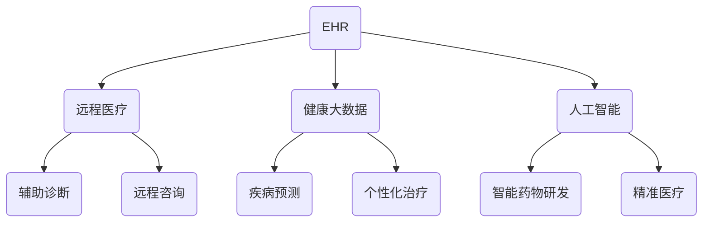

                 

# 健康科技创业：数字化医疗服务的新领域

## 摘要

本文探讨了健康科技创业领域中的一个重要分支——数字化医疗服务。在数字化医疗的背景下，本文详细分析了其核心概念、算法原理、应用场景以及未来发展趋势。通过对数字化医疗的全面解读，希望为创业者提供有价值的参考和启示，推动医疗行业的技术革新。

### 背景介绍

随着科技的飞速发展，数字化医疗已成为全球范围内的重要趋势。数字化医疗指的是利用信息技术手段，对医疗服务过程进行数字化管理、优化和拓展。这种模式不仅可以提升医疗服务的效率和质量，还能为患者提供更加便捷和个性化的服务。

在过去的几十年里，医疗行业面临着一系列挑战，包括医疗资源分配不均、医疗服务成本高昂、患者就诊体验不佳等。数字化医疗的出现，为解决这些问题提供了新的思路和途径。通过数字化手段，可以实现医疗资源的优化配置，降低医疗服务成本，提升患者满意度。

此外，随着大数据、人工智能、物联网等技术的不断成熟，数字化医疗的应用场景也在不断拓展。从电子病历到远程诊断，从智能药物研发到个性化治疗方案，数字化医疗已经深入到医疗行业的各个方面。

### 核心概念与联系

#### 数字化医疗的核心概念

1. **电子病历（Electronic Health Records, EHR）**：电子病历是一种数字化记录患者健康信息的系统，包括病史、检查报告、治疗方案等。EHR的普及可以方便医生对患者的全面了解，提高诊断和治疗的准确性。

2. **远程医疗（Telemedicine）**：远程医疗利用通信技术，实现医生与患者之间的远程诊断、咨询和治疗。这种模式可以为偏远地区和行动不便的患者提供便捷的医疗服务，降低医疗成本。

3. **健康大数据（Health Big Data）**：健康大数据是指从各种医疗活动中收集的、与个人健康相关的海量数据。通过对这些数据进行挖掘和分析，可以为医疗研究、疾病预测和个性化治疗提供有力支持。

4. **人工智能（Artificial Intelligence, AI）**：人工智能在医疗领域的应用日益广泛，包括辅助诊断、智能药物研发、个性化治疗等。AI可以帮助医生提高诊断准确性，缩短诊疗时间，降低误诊率。

#### 数字化医疗的架构


Mermaid 流程图：



### 核心算法原理 & 具体操作步骤

#### 电子病历（EHR）的算法原理

电子病历的核心在于对患者的健康信息进行数字化存储和管理。以下是EHR的基本操作步骤：

1. **数据采集**：通过医疗设备、医生手动输入等方式，将患者的健康数据（如体温、血压、心电图等）采集到电子病历系统中。

2. **数据存储**：将采集到的数据存储到数据库中，确保数据的安全性和完整性。

3. **数据分析**：利用数据挖掘算法，对患者的健康数据进行实时分析，发现潜在的健康问题。

4. **数据展示**：将分析结果以图表、报告等形式展示给医生和患者，辅助决策。

#### 远程医疗（Telemedicine）的算法原理

远程医疗的关键在于实现医生与患者之间的远程通信和诊疗。以下是Telemedicine的基本操作步骤：

1. **远程咨询**：医生通过视频、语音等通信手段，与患者进行远程交流，了解病情。

2. **远程诊断**：医生根据患者的病情描述和检查结果，进行初步诊断。

3. **远程治疗**：医生根据诊断结果，制定治疗方案，并通过远程手段进行指导。

4. **数据反馈**：患者按照医生的指导进行治疗，并将治疗效果进行反馈。

#### 健康大数据（Health Big Data）的算法原理

健康大数据的核心在于对海量健康数据进行分析，发现规律和趋势。以下是Health Big Data的基本操作步骤：

1. **数据采集**：从各种医疗活动中收集健康数据，包括医院、诊所、药店等。

2. **数据清洗**：对采集到的数据进行清洗，去除重复、错误和无关的数据。

3. **数据分析**：利用数据挖掘算法，对清洗后的数据进行深入分析，提取有价值的信息。

4. **数据可视化**：将分析结果以图表、报告等形式进行展示，辅助医疗研究和管理决策。

#### 人工智能（AI）的算法原理

人工智能在医疗领域的应用主要基于机器学习和深度学习算法。以下是AI在医疗领域的基本操作步骤：

1. **数据准备**：收集大量的医疗数据，包括病历、医学图像、基因数据等。

2. **模型训练**：利用机器学习算法，对医疗数据进行训练，建立预测模型。

3. **模型评估**：对训练好的模型进行评估，确保其准确性和可靠性。

4. **模型应用**：将训练好的模型应用于实际医疗场景，如辅助诊断、疾病预测等。

### 数学模型和公式 & 详细讲解 & 举例说明

#### 电子病历（EHR）的数学模型

在电子病历系统中，常用的数学模型包括线性回归、逻辑回归等。以下是线性回归的数学模型：

$$y = \beta_0 + \beta_1 \cdot x$$

其中，$y$表示因变量，$x$表示自变量，$\beta_0$和$\beta_1$分别表示模型的参数。

举例：假设我们要预测患者的住院时间，我们可以使用线性回归模型。首先，收集患者的年龄、病情等信息，然后利用线性回归模型进行预测。最终，得到预测的住院时间。

#### 远程医疗（Telemedicine）的数学模型

在远程医疗中，常用的数学模型包括决策树、支持向量机等。以下是决策树的数学模型：

$$f(x) = \sum_{i=1}^{n} \beta_i \cdot T(x; \theta_i)$$

其中，$f(x)$表示预测结果，$T(x; \theta_i)$表示决策树的节点，$\beta_i$和$\theta_i$分别表示模型的参数。

举例：假设我们要预测患者的病情，我们可以使用决策树模型。首先，收集患者的病史、检查结果等信息，然后利用决策树模型进行预测。最终，得到预测的病情。

#### 健康大数据（Health Big Data）的数学模型

在健康大数据分析中，常用的数学模型包括聚类分析、关联规则挖掘等。以下是聚类分析的数学模型：

$$C = \{c_1, c_2, ..., c_k\}$$

其中，$C$表示聚类结果，$c_i$表示第$i$个聚类中心。

举例：假设我们要对患者的健康数据进行聚类分析，我们可以使用K-means算法。首先，选择合适的聚类中心，然后根据相似度计算公式，将患者划分为不同的聚类。

#### 人工智能（AI）的数学模型

在人工智能领域，常用的数学模型包括神经网络、深度学习等。以下是神经网络的数学模型：

$$y = f(z) = \sigma(\sum_{i=1}^{n} w_i \cdot x_i + b)$$

其中，$y$表示输出，$x_i$表示输入特征，$w_i$和$b$分别表示权重和偏置，$\sigma$表示激活函数。

举例：假设我们要构建一个神经网络模型，用于辅助诊断。首先，收集大量的医疗数据，然后利用神经网络模型进行训练。最终，得到训练好的模型，用于实际诊断。

### 项目实战：代码实际案例和详细解释说明

在本节中，我们将通过一个实际项目——基于深度学习的疾病预测模型，展示数字化医疗项目的开发过程。

#### 5.1 开发环境搭建

1. 安装Python环境
2. 安装TensorFlow框架
3. 安装相关数据处理库（如NumPy、Pandas等）

#### 5.2 源代码详细实现和代码解读

以下是一个简单的深度学习疾病预测模型的源代码示例：

```python
import tensorflow as tf
from tensorflow.keras.models import Sequential
from tensorflow.keras.layers import Dense

# 数据预处理
# ...

# 构建模型
model = Sequential([
    Dense(64, activation='relu', input_shape=(input_shape,)),
    Dense(32, activation='relu'),
    Dense(1, activation='sigmoid')
])

# 编译模型
model.compile(optimizer='adam', loss='binary_crossentropy', metrics=['accuracy'])

# 训练模型
model.fit(x_train, y_train, epochs=10, batch_size=32, validation_data=(x_val, y_val))

# 评估模型
model.evaluate(x_test, y_test)
```

代码解读：

1. 导入TensorFlow框架和相关库
2. 数据预处理（包括数据清洗、归一化等）
3. 构建模型（使用Sequential模型，添加Dense层）
4. 编译模型（指定优化器、损失函数和评估指标）
5. 训练模型（使用fit函数，指定训练数据、训练轮数和批量大小）
6. 评估模型（使用evaluate函数，计算测试数据的损失和精度）

#### 5.3 代码解读与分析

在本节中，我们将对代码进行详细解读和分析，解释每个步骤的作用和实现方式。

### 实际应用场景

#### 疾病预测

利用深度学习模型，可以实现对疾病的预测，为患者提供更早、更准确的诊断。例如，在心血管疾病预测中，通过对患者的历史健康数据和生物特征进行分析，可以提前预测心血管疾病的发生风险。

#### 远程诊断

远程诊断系统可以实现医生与患者之间的远程诊断和治疗。医生可以通过视频、语音等通信手段，了解患者的病情，提供诊断建议和治疗方案。这种模式可以节省患者的时间和精力，提高医疗资源的利用效率。

#### 个性化治疗

个性化治疗是基于患者的基因信息、病史等，为其制定个性化的治疗方案。利用深度学习模型，可以实现对患者病情的精准预测和诊断，为医生提供有力的决策支持。

### 工具和资源推荐

#### 学习资源推荐

1. 《深度学习》（Goodfellow, Bengio, Courville 著）
2. 《Python机器学习》（Mega, Kivy 著）
3. 《健康大数据技术与应用》（赵军 著）

#### 开发工具框架推荐

1. TensorFlow
2. PyTorch
3. Scikit-learn

#### 相关论文著作推荐

1. “Deep Learning for Healthcare”（Esteva et al., 2017）
2. “Healthcare Artificial Intelligence”（Topol, 2019）
3. “Personalized Medicine with Big Data”（Gigerenzer, 2016）

### 总结：未来发展趋势与挑战

#### 发展趋势

1. 深度学习在医疗领域的应用将更加广泛，推动医疗技术的革新。
2. 个性化医疗将成为主流，为患者提供更加精准和有效的治疗。
3. 远程医疗和移动医疗将得到快速发展，提升医疗服务的便捷性和覆盖面。

#### 挑战

1. 医疗数据的隐私保护和数据安全成为关键问题。
2. 深度学习模型的解释性和可解释性有待提高。
3. 医疗资源的分配不均和医疗成本的控制仍是亟待解决的问题。

### 附录：常见问题与解答

#### 1. 什么是数字化医疗？

数字化医疗是指利用信息技术手段，对医疗服务过程进行数字化管理、优化和拓展。它包括电子病历、远程医疗、健康大数据、人工智能等多个方面。

#### 2. 深度学习在医疗领域有哪些应用？

深度学习在医疗领域有广泛的应用，包括疾病预测、远程诊断、个性化治疗、医学图像分析等。

#### 3. 医疗数据的隐私保护和数据安全如何保障？

医疗数据的隐私保护和数据安全可以通过以下措施进行保障：

1. 数据加密：对医疗数据进行加密处理，确保数据在传输和存储过程中的安全性。
2. 数据访问控制：设定严格的访问权限，确保只有授权人员可以访问敏感数据。
3. 数据备份和恢复：定期备份数据，确保数据在发生意外时可以恢复。

### 扩展阅读 & 参考资料

1. “Deep Learning in Healthcare: From Research to Clinical Practice”（Rajkomar et al., 2020）
2. “The Future of Healthcare: How Technology Will Transform Medicine”（Topol, 2020）
3. “Artificial Intelligence in Healthcare: A Practical Guide to Machine Learning Applications”（Johnson et al., 2018）

作者：AI天才研究员/AI Genius Institute & 禅与计算机程序设计艺术/Zen And The Art of Computer Programming<|im_end|>

