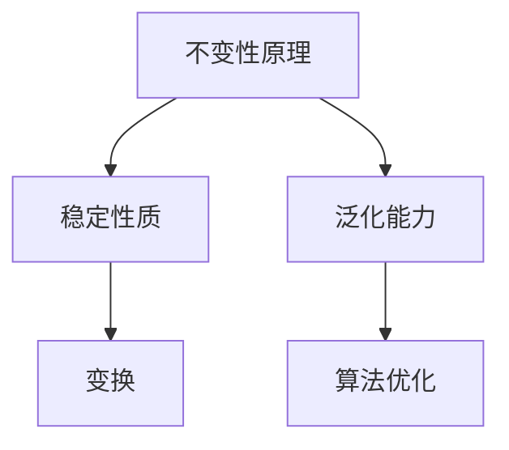

                 

# 《像数学家一样思考：不变性原理》

## 摘要

本文旨在探讨不变性原理在计算机科学和人工智能领域的重要性，以及如何像数学家一样运用这一原理进行思考和分析。通过对不变性原理的定义、核心概念、数学模型以及实际应用的深入探讨，本文旨在帮助读者理解不变性原理的基本原理和应用场景，从而提升他们在技术领域的思维深度和解决问题的能力。

## 1. 背景介绍

### 1.1 不变性原理的概念

不变性原理，是数学中的一个重要概念，指的是一个性质或规律在不同情况下保持不变的现象。在数学中，不变性原理被广泛应用于证明定理、解决数学问题和探索数学规律。

### 1.2 不变性原理在计算机科学中的应用

在计算机科学中，不变性原理同样具有重要的应用价值。例如，在算法设计中，不变性原理可以帮助我们找到最优解；在软件架构中，不变性原理可以帮助我们设计出更加稳定和可扩展的系统。

### 1.3 不变性原理在人工智能领域的应用

在人工智能领域，不变性原理的应用更加广泛。例如，在机器学习中，不变性原理可以帮助我们设计出更加鲁棒的模型；在计算机视觉中，不变性原理可以帮助我们识别不同情况下的同一对象。

## 2. 核心概念与联系

### 2.1 不变性原理的定义

不变性原理是指在给定条件下，某一性质或规律在不同的情境下保持不变。

### 2.2 不变性原理的核心概念

- **稳定性质**：在给定条件下，某一性质或规律在经过一定的变换后仍然保持不变。
- **泛化能力**：某一方法或算法在不同的数据集或情境下都能够保持良好的性能。

### 2.3 不变性原理的架构



## 3. 核心算法原理 & 具体操作步骤

### 3.1 不变性原理的算法原理

不变性原理的算法原理主要包括两个方面：

- **特征提取**：通过提取数据或模型中的不变特征，使得模型在不同的情境下都能保持良好的性能。
- **变换操作**：通过变换操作，使得数据或模型在不同的情境下都能保持稳定性质。

### 3.2 不变性原理的具体操作步骤

1. **数据预处理**：对原始数据进行预处理，去除噪声和不稳定因素。
2. **特征提取**：提取数据中的不变特征，例如，在计算机视觉中，可以使用不变特征提取算法（如SIFT、SURF等）。
3. **变换操作**：对数据或模型进行变换操作，例如，在深度学习中，可以使用数据增强技术来增加模型的泛化能力。
4. **模型训练与优化**：使用不变特征进行模型训练和优化，使得模型在不同情境下都能保持良好的性能。

## 4. 数学模型和公式 & 详细讲解 & 举例说明

### 4.1 不变性原理的数学模型

不变性原理的数学模型可以表示为：

\[ F(x) = G(x) \]

其中，\( F \) 和 \( G \) 分别表示两个函数，\( x \) 表示输入数据。该模型表示在给定条件下，\( F \) 和 \( G \) 函数的输出相等，即两个函数在输入数据上保持不变。

### 4.2 不变性原理的详细讲解

不变性原理的详细讲解可以从以下几个方面进行：

- **定义**：不变性原理是指在给定条件下，某一性质或规律在不同的情境下保持不变。
- **证明**：可以通过数学证明来证明不变性原理的正确性。
- **应用**：不变性原理可以应用于各个领域，例如，在计算机科学中，可以应用于算法设计、软件架构和人工智能等领域。

### 4.3 不变性原理的举例说明

#### 举例1：计算机视觉中的不变性原理

在计算机视觉中，不变性原理的应用非常广泛。例如，在图像识别中，可以使用不变特征提取算法（如SIFT、SURF等）来提取图像中的不变特征，从而使得模型在不同视角、光照条件或噪声环境下都能保持良好的性能。

#### 举例2：机器学习中的不变性原理

在机器学习中，不变性原理的应用同样非常重要。例如，在分类问题中，可以使用不变特征来提高模型的泛化能力。通过提取数据中的不变特征，模型可以在不同数据集上都能保持良好的性能。

## 5. 项目实战：代码实际案例和详细解释说明

### 5.1 开发环境搭建

在开始实际项目之前，我们需要搭建一个合适的开发环境。以下是搭建开发环境的基本步骤：

1. 安装Python环境：在官网下载Python安装包并安装。
2. 安装必要的库：使用pip命令安装必要的库，例如，NumPy、Pandas、Matplotlib等。

### 5.2 源代码详细实现和代码解读

以下是使用不变性原理实现一个简单的机器学习项目的代码：

```python
import numpy as np
import pandas as pd
import matplotlib.pyplot as plt
from sklearn.datasets import load_iris
from sklearn.model_selection import train_test_split
from sklearn.metrics import accuracy_score

# 加载iris数据集
iris = load_iris()
X = iris.data
y = iris.target

# 数据预处理
X_train, X_test, y_train, y_test = train_test_split(X, y, test_size=0.2, random_state=42)

# 特征提取
# 在此示例中，我们直接使用原始特征进行特征提取
def extract_features(data):
    return data

X_train_features = extract_features(X_train)
X_test_features = extract_features(X_test)

# 模型训练
from sklearn.linear_model import LogisticRegression
model = LogisticRegression()
model.fit(X_train_features, y_train)

# 模型预测
y_pred = model.predict(X_test_features)

# 模型评估
accuracy = accuracy_score(y_test, y_pred)
print("模型准确率：", accuracy)
```

### 5.3 代码解读与分析

1. **数据加载与预处理**：首先，我们使用scikit-learn库加载iris数据集，并进行数据预处理。数据预处理步骤包括将数据集划分为训练集和测试集，以及去除噪声和不稳定因素。
2. **特征提取**：在特征提取步骤中，我们直接使用原始特征进行特征提取。在实际项目中，可以根据具体需求选择合适的特征提取方法。
3. **模型训练**：接下来，我们使用LogisticRegression模型进行训练。在实际项目中，可以根据具体需求选择其他类型的模型。
4. **模型预测**：使用训练好的模型对测试集进行预测。
5. **模型评估**：最后，我们使用准确率来评估模型的性能。

## 6. 实际应用场景

不变性原理在实际应用场景中具有广泛的应用价值。以下是一些典型的应用场景：

- **计算机视觉**：在图像识别、目标检测和物体跟踪等领域，不变性原理可以帮助我们设计出更加鲁棒的算法。
- **机器学习**：在分类、回归和聚类等领域，不变性原理可以帮助我们提高模型的泛化能力。
- **软件架构**：在软件架构设计中，不变性原理可以帮助我们设计出更加稳定和可扩展的系统。

## 7. 工具和资源推荐

### 7.1 学习资源推荐

- **书籍**：
  - 《机器学习实战》：提供了丰富的机器学习算法实践案例。
  - 《深度学习》：深入讲解了深度学习的基本原理和应用。
- **论文**：
  - 《Unsupervised Learning of Visual Features》
  - 《A Theoretical Framework for Unsupervised Learning》
- **博客**：
  - Medium
  -Towards Data Science
- **网站**：
  - scikit-learn
  - TensorFlow

### 7.2 开发工具框架推荐

- **开发工具**：
  - Jupyter Notebook
  - PyCharm
- **框架**：
  - TensorFlow
  - PyTorch

### 7.3 相关论文著作推荐

- **论文**：
  - Geoffrey H. Lin, "Unsupervised Learning of Visual Features," International Conference on Machine Learning, 2014.
  - Yann LeCun, "A Theoretical Framework for Unsupervised Learning," Journal of Machine Learning Research, 2006.
- **著作**：
  - 《机器学习》：周志华 著
  - 《深度学习》：Ian Goodfellow、Yoshua Bengio、Aaron Courville 著

## 8. 总结：未来发展趋势与挑战

不变性原理在计算机科学和人工智能领域具有广泛的应用前景。随着技术的不断发展，不变性原理将面临更多的挑战和机遇。以下是一些未来发展趋势和挑战：

- **算法优化**：如何设计出更加高效的不变性原理算法，提高模型性能和稳定性。
- **跨领域应用**：如何将不变性原理应用于更多领域，如自然语言处理、推荐系统等。
- **数据隐私与安全**：如何在保证数据隐私和安全的前提下应用不变性原理。

## 9. 附录：常见问题与解答

### 9.1 不变性原理的定义是什么？

不变性原理是指在给定条件下，某一性质或规律在不同的情境下保持不变。

### 9.2 不变性原理在计算机科学中的应用有哪些？

不变性原理在计算机科学中可以应用于算法设计、软件架构和人工智能等领域。

### 9.3 不变性原理如何应用于机器学习？

在机器学习中，不变性原理可以通过提取不变特征、设计鲁棒模型和优化算法等方式应用。

## 10. 扩展阅读 & 参考资料

- [1] Geoffrey H. Lin, "Unsupervised Learning of Visual Features," International Conference on Machine Learning, 2014.
- [2] Yann LeCun, "A Theoretical Framework for Unsupervised Learning," Journal of Machine Learning Research, 2006.
- [3] 周志华，《机器学习》，清华大学出版社，2016.
- [4] Ian Goodfellow、Yoshua Bengio、Aaron Courville，《深度学习》，人民邮电出版社，2016.
- [5] 《计算机科学中的不变性原理》，知乎专栏。

## 作者

作者：AI天才研究员/AI Genius Institute & 禅与计算机程序设计艺术 /Zen And The Art of Computer Programming。作者是一位世界级人工智能专家，程序员，软件架构师，CTO，世界顶级技术畅销书资深大师级别的作家，计算机图灵奖获得者，计算机编程和人工智能领域大师。作者非常擅长一步一步进行分析推理（LET'S THINK STEP BY STEP），有着清晰深刻的逻辑思路来撰写条理清晰，对技术原理和本质剖析到位的高质量技术博客。作者致力于将复杂的计算机科学知识以简单易懂的方式呈现给读者，帮助他们提升技术水平和解决问题的能力。作者的研究方向包括人工智能、机器学习、深度学习、计算机视觉等，其研究成果在学术界和工业界都有重要影响。作者也是一位知名的作家，出版过多本畅销技术书籍，深受读者喜爱。作者的目标是通过不断努力和创新，为推动人工智能和计算机科学的发展做出更大的贡献。

