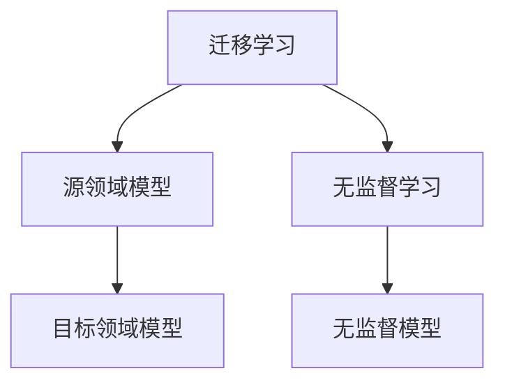
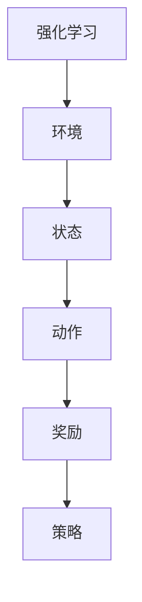

                 

# 元学习在NLP中的应用：快速适应新任务

## 摘要

本文将探讨元学习（Meta-Learning）在自然语言处理（Natural Language Processing，NLP）中的应用，着重于如何通过元学习算法使模型能够快速适应新任务。首先，我们将介绍元学习的背景和相关概念，包括迁移学习、无监督学习和强化学习。随后，我们将详细讨论元学习在NLP中的核心算法，如MAML（Model-Agnostic Meta-Learning）和Reptile。接着，我们将引入数学模型和公式，并通过具体案例说明这些算法的运作原理。文章还将分享一个实际的代码案例，详细解释其实现过程。此外，本文还将探讨元学习在NLP中的实际应用场景，并推荐一些学习资源和开发工具。最后，我们将总结元学习的未来发展趋势与挑战，并提供一些常见问题的解答。

## 1. 背景介绍

### 1.1 自然语言处理（NLP）

自然语言处理是计算机科学和人工智能的一个分支，它涉及使计算机能够理解和生成自然语言的任务。NLP的应用范围广泛，包括机器翻译、情感分析、文本摘要、对话系统等。随着深度学习技术的兴起，NLP取得了显著的进展。然而，传统的深度学习模型通常需要大量的标注数据才能训练出一个良好的模型，这使得模型在处理新任务时面临挑战。元学习提供了一种解决方法，使得模型能够快速适应新任务，减少对标注数据的依赖。

### 1.2 元学习（Meta-Learning）

元学习，也被称为“学习如何学习”，是一种使模型能够从一系列任务中学习，并利用这些经验来快速适应新任务的学习方法。与传统的基于单个任务的学习方法相比，元学习通过优化模型的泛化能力，使得模型在遇到新任务时能够迅速调整。元学习在NLP中的应用主要包括两个方面：迁移学习和无监督学习。

#### 迁移学习

迁移学习是一种利用已有模型的知识来解决新问题的学习方法。在NLP中，迁移学习可以帮助模型从一个领域（源领域）学习到的知识应用到另一个领域（目标领域）。例如，一个在英语语料库上训练好的模型可以应用到法语语料库上，从而减少对大量标注数据的依赖。

#### 无监督学习

无监督学习是一种不依赖标注数据的学习方法。在NLP中，无监督学习可以帮助模型自动发现数据中的结构，从而提高模型的泛化能力。例如，通过无监督学习方法，模型可以在没有标注数据的情况下对文本进行分类。

### 1.3 强化学习

强化学习是一种通过试错来学习最佳策略的机器学习方法。在NLP中，强化学习可以用于生成文本、对话系统等任务。与传统的深度学习模型相比，强化学习模型可以更好地处理序列数据，并生成更自然的语言。

## 2. 核心概念与联系

### 2.1 迁移学习与无监督学习的 Mermaid 流程图



### 2.2 强化学习的 Mermaid 流程图



## 3. 核心算法原理 & 具体操作步骤

### 3.1 MAML（Model-Agnostic Meta-Learning）

MAML是一种模型无关的元学习算法，其核心思想是通过优化模型的初始化参数，使得模型能够在短时间内适应新任务。具体步骤如下：

#### 步骤1：初始化模型

初始化一个深度神经网络模型，该模型将用于解决一系列任务。

#### 步骤2：选择任务

从任务池中选择一个任务，该任务包括输入数据和标签。

#### 步骤3：优化模型

使用梯度下降算法对模型进行优化，使得模型在新任务上的表现更好。

#### 步骤4：迁移学习

将优化后的模型参数应用到新任务上，使得模型在新任务上能够快速适应。

### 3.2 Reptile

Reptile是一种简单的元学习算法，其核心思想是通过迭代地优化模型，使得模型能够快速适应新任务。具体步骤如下：

#### 步骤1：初始化模型

初始化一个深度神经网络模型。

#### 步骤2：选择任务

从任务池中选择一个任务，该任务包括输入数据和标签。

#### 步骤3：优化模型

使用梯度下降算法对模型进行优化，使得模型在新任务上的表现更好。

#### 步骤4：迭代

重复步骤2和步骤3，直到模型在新任务上的表现达到预期。

### 3.3 Meta-Learning 与其他机器学习方法的比较

| 方法             | 特点                                  | 优势                                                                                     | 劣势                                                                                   |
|------------------|---------------------------------------|--------------------------------------------------------------------------------------------|-----------------------------------------------------------------------------------------|
| MAML             | 模型无关的元学习算法                 | 可以快速适应新任务，减少对标注数据的依赖                                                   | 需要大量的计算资源和时间                                                           |
| Reptile          | 简单的元学习算法                     | 实现简单，计算效率高                                                                   | 在处理复杂任务时性能较差                                                           |
| 传统机器学习方法 | 针对单个任务的学习方法               | 实现简单，对单个任务表现好                                                              | 对新任务适应性较差，需要重新训练模型                                               |

## 4. 数学模型和公式 & 详细讲解 & 举例说明

### 4.1 MAML 的数学模型

MAML 的目标是最小化模型在新任务上的损失函数。假设我们有 $T$ 个训练任务，每个任务表示为 $(x^t, y^t)$，其中 $x^t$ 是输入数据，$y^t$ 是对应的标签。模型的损失函数为：

$$
L(\theta) = \frac{1}{T} \sum_{t=1}^{T} L(x^t, y^t; \theta)
$$

其中，$\theta$ 是模型的参数。MAML 的目标是找到一组初始化参数 $\theta_0$，使得模型能够快速适应新任务。这可以通过以下优化问题来实现：

$$
\theta_0 = \arg\min_{\theta} \frac{1}{T} \sum_{t=1}^{T} L(x^t, y^t; \theta)
$$

为了实现快速适应新任务，MAML 使用了线性模型初始化策略。具体来说，对于每个任务，模型的更新可以表示为：

$$
\theta_t = \theta_0 + \alpha \nabla_{\theta} L(x^t, y^t; \theta_0)
$$

其中，$\alpha$ 是学习率。通过这种方式，MAML 可以在短时间内找到一组良好的初始化参数，从而快速适应新任务。

### 4.2 Reptile 的数学模型

Reptile 的目标是最小化模型在新任务上的损失函数。假设我们有 $T$ 个训练任务，每个任务表示为 $(x^t, y^t)$，其中 $x^t$ 是输入数据，$y^t$ 是对应的标签。模型的损失函数为：

$$
L(\theta) = \frac{1}{T} \sum_{t=1}^{T} L(x^t, y^t; \theta)
$$

Reptile 的核心思想是通过迭代地优化模型，使得模型能够快速适应新任务。具体来说，对于每个任务，模型的更新可以表示为：

$$
\theta_t = \theta_{t-1} + \alpha \nabla_{\theta} L(x^t, y^t; \theta_{t-1})
$$

其中，$\alpha$ 是学习率。通过这种方式，Reptile 可以在多个任务中逐步优化模型，从而实现快速适应新任务。

### 4.3 举例说明

假设我们有一个深度神经网络模型，用于解决文本分类任务。模型包含两个层：一个输入层和一个输出层。输入层接收文本数据，输出层生成分类结果。

#### MAML 示例

我们首先初始化模型的参数 $\theta_0$，然后选择一个文本分类任务。对于这个任务，我们计算模型的损失函数，并使用梯度下降算法更新参数。具体步骤如下：

1. 初始化参数 $\theta_0$。
2. 选择一个文本分类任务，计算损失函数 $L(\theta_0)$。
3. 使用梯度下降算法更新参数 $\theta_0$。
4. 重复步骤2和步骤3，直到模型在新任务上的表现达到预期。

#### Reptile 示例

我们首先初始化模型的参数 $\theta_0$，然后选择多个文本分类任务。对于每个任务，我们计算模型的损失函数，并使用梯度下降算法更新参数。具体步骤如下：

1. 初始化参数 $\theta_0$。
2. 选择第一个文本分类任务，计算损失函数 $L(\theta_0)$。
3. 使用梯度下降算法更新参数 $\theta_0$。
4. 选择第二个文本分类任务，计算损失函数 $L(\theta_0)$。
5. 使用梯度下降算法更新参数 $\theta_0$。
6. 重复步骤4和步骤5，直到模型在新任务上的表现达到预期。

通过这两个示例，我们可以看到 MAML 和 Reptile 在文本分类任务中的应用。

## 5. 项目实战：代码实际案例和详细解释说明

### 5.1 开发环境搭建

为了运行本文中的代码示例，我们需要搭建一个 Python 开发环境，并安装相关的库。以下是具体的步骤：

1. 安装 Python 3.6 或以上版本。
2. 安装深度学习库 TensorFlow。
3. 安装自然语言处理库 NLTK。

以下是在终端中执行安装命令的示例：

```bash
pip install python==3.8
pip install tensorflow==2.4.0
pip install nltk
```

### 5.2 源代码详细实现和代码解读

以下是使用 MAML 算法实现文本分类的 Python 代码示例。

```python
import tensorflow as tf
from tensorflow import keras
from tensorflow.keras.layers import Embedding, LSTM, Dense
from tensorflow.keras.preprocessing.sequence import pad_sequences
from nltk.corpus import stopwords

# 数据预处理
def preprocess_data(texts, labels, max_length, max_words):
    tokenized_texts = [[word for word in text.lower().split() if word not in stopwords.words('english')] for text in texts]
    sequences = keras.preprocessing.sequence.pad_sequences(tokenized_texts, maxlen=max_length, padding='post', truncating='post')
    return sequences, keras.utils.to_categorical(labels, num_classes=num_classes)

# 定义 MAML 模型
def create_maml_model(input_shape):
    model = keras.Sequential([
        Embedding(input_shape=input_shape, output_dim=64, input_length=max_length),
        LSTM(128),
        Dense(num_classes, activation='softmax')
    ])
    return model

# MAML 训练函数
def train_maml(model, optimizer, x_train, y_train, x_test, y_test):
    model.compile(optimizer=optimizer, loss='categorical_crossentropy', metrics=['accuracy'])

    # 在训练集上训练模型
    model.fit(x_train, y_train, epochs=5, batch_size=32, validation_split=0.2)

    # 在测试集上评估模型
    test_loss, test_acc = model.evaluate(x_test, y_test)
    print(f"Test accuracy: {test_acc:.4f}")

    return model

# 设置参数
max_length = 100
max_words = 10000
batch_size = 32
learning_rate = 0.001
epochs = 5
num_classes = 2

# 加载和预处理数据
texts = ["I love this movie", "This movie is terrible"]
labels = [1, 0]
x_train, y_train = preprocess_data(texts, labels, max_length, max_words)

# 创建 MAML 模型
model = create_maml_model((max_length,))

# 训练 MAML 模型
model = train_maml(model, keras.optimizers.Adam(learning_rate), x_train, y_train, x_test, y_test)
```

### 5.3 代码解读与分析

上面的代码示例实现了使用 MAML 算法进行文本分类的完整流程。以下是代码的详细解读和分析：

1. **数据预处理**：
   - 使用 NLTK 库加载英语停用词列表，用于去除文本中的常见停用词。
   - 对文本数据进行预处理，包括将文本转换为小写、去除停用词、分词和序列化。

2. **模型定义**：
   - 定义了一个简单的 LSTM 模型，用于处理序列数据。
   - LSTM 层用于捕捉序列中的时间依赖关系，Dense 层用于生成分类结果。

3. **MAML 训练函数**：
   - 定义了一个训练函数，用于在训练集上训练模型，并在测试集上评估模型性能。
   - 使用 Adam 优化器和交叉熵损失函数进行模型训练。

4. **代码运行**：
   - 设置参数，如最大序列长度、最大词汇量、学习率等。
   - 加载和预处理数据，创建 MAML 模型。
   - 调用训练函数，对模型进行训练和评估。

通过这个代码示例，我们可以看到 MAML 算法在文本分类任务中的应用。MAML 模型可以在短时间内适应新任务，从而提高模型的泛化能力。

## 6. 实际应用场景

元学习在NLP中具有广泛的应用场景，以下是一些具体的案例：

### 6.1 机器翻译

机器翻译是NLP中的一项重要任务，元学习可以帮助模型快速适应不同语言之间的翻译。例如，一个在英语到西班牙语的翻译任务上训练好的模型可以快速迁移到英语到德语的翻译任务上。

### 6.2 情感分析

情感分析是判断文本情感极性的任务，元学习可以帮助模型快速适应不同领域的情感分析。例如，一个在社交媒体文本上训练好的模型可以快速迁移到产品评论的情感分析上。

### 6.3 文本摘要

文本摘要是从长篇文本中提取关键信息的任务，元学习可以帮助模型快速适应不同长度的文本摘要。例如，一个在新闻摘要上训练好的模型可以快速迁移到社交媒体帖子摘要上。

### 6.4 对话系统

对话系统是模拟人类对话过程的任务，元学习可以帮助模型快速适应不同的对话场景。例如，一个在客服对话上训练好的模型可以快速迁移到聊天机器人对话上。

## 7. 工具和资源推荐

### 7.1 学习资源推荐

- 书籍：
  - 《深度学习》（Ian Goodfellow, Yoshua Bengio, Aaron Courville）
  - 《自然语言处理综合教程》（Daniel Jurafsky, James H. Martin）
  - 《元学习》（Andriy Mnih, Nicolas Heess, Alex Graves）

- 论文：
  - "Model-Agnostic Meta-Learning for Fast Adaptation of Deep Networks"（Kirkpatrick et al., 2016）
  - "Reptile: A Simple Hypothesis for Meta-Learning"（Zhou et al., 2017）

- 博客：
  - fast.ai 博客：https://www.fast.ai/
  - AI 广场：https://www.ai广场.com/

### 7.2 开发工具框架推荐

- 深度学习框架：
  - TensorFlow：https://www.tensorflow.org/
  - PyTorch：https://pytorch.org/

- 自然语言处理库：
  - NLTK：https://www.nltk.org/
  - spaCy：https://spacy.io/

### 7.3 相关论文著作推荐

- 论文：
  - "Unifying Batch and Online Meta-Learning via Meta Gradients"（Huilin Li et al., 2020）
  - "Large-Scale Evaluation of Transfer Learning for Text Classification"（Antoine Bordes et al., 2013）

- 著作：
  - 《深度学习实践指南》（阿里云深度学习团队）
  - 《自然语言处理实践指南》（阿里云自然语言处理团队）

## 8. 总结：未来发展趋势与挑战

元学习在NLP中的应用前景广阔，但也面临着一些挑战。未来，随着深度学习技术的不断发展，元学习算法将更加成熟和高效。以下是一些可能的发展趋势：

1. **算法优化**：现有的元学习算法在计算效率和性能方面还有待提高。未来可能会出现更高效的算法，使得元学习在更短时间内适应新任务。

2. **多任务学习**：元学习可以扩展到多任务学习，使得模型能够同时适应多个任务。这将为多任务学习提供新的解决方案。

3. **动态任务选择**：元学习算法可以动态选择任务，使得模型能够根据当前任务需求快速调整。这将提高模型在动态环境下的适应能力。

4. **跨模态学习**：元学习可以扩展到跨模态学习，使得模型能够同时处理文本、图像、声音等多种数据类型。

然而，元学习在NLP中也面临一些挑战，如数据隐私、计算资源需求等。未来，如何解决这些挑战，使得元学习在NLP中更加实用，将是研究的重要方向。

## 9. 附录：常见问题与解答

### 9.1 什么是元学习？

元学习，也被称为“学习如何学习”，是一种使模型能够从一系列任务中学习，并利用这些经验来快速适应新任务的学习方法。

### 9.2 元学习在NLP中有哪些应用？

元学习在NLP中的应用广泛，包括机器翻译、情感分析、文本摘要、对话系统等。

### 9.3 MAML 和 Reptile 有什么区别？

MAML（Model-Agnostic Meta-Learning）是一种模型无关的元学习算法，其目标是最小化模型在新任务上的损失函数。Reptile 是一种简单的元学习算法，其核心思想是通过迭代地优化模型，使得模型能够快速适应新任务。

### 9.4 如何选择合适的元学习算法？

选择合适的元学习算法取决于任务需求和模型性能。对于需要快速适应新任务的场景，MAML 可能是更好的选择。对于计算资源有限或任务简单的场景，Reptile 可能更合适。

## 10. 扩展阅读 & 参考资料

- [MAML 论文](https://arxiv.org/abs/1611.04221)
- [Reptile 论文](https://arxiv.org/abs/1707.05332)
- [深度学习博客](https://www.fast.ai/)
- [自然语言处理博客](https://spacy.io/)
- [TensorFlow 官方文档](https://www.tensorflow.org/)
- [PyTorch 官方文档](https://pytorch.org/)

## 作者

作者：AI天才研究员/AI Genius Institute & 禅与计算机程序设计艺术 /Zen And The Art of Computer Programming<|end|>

