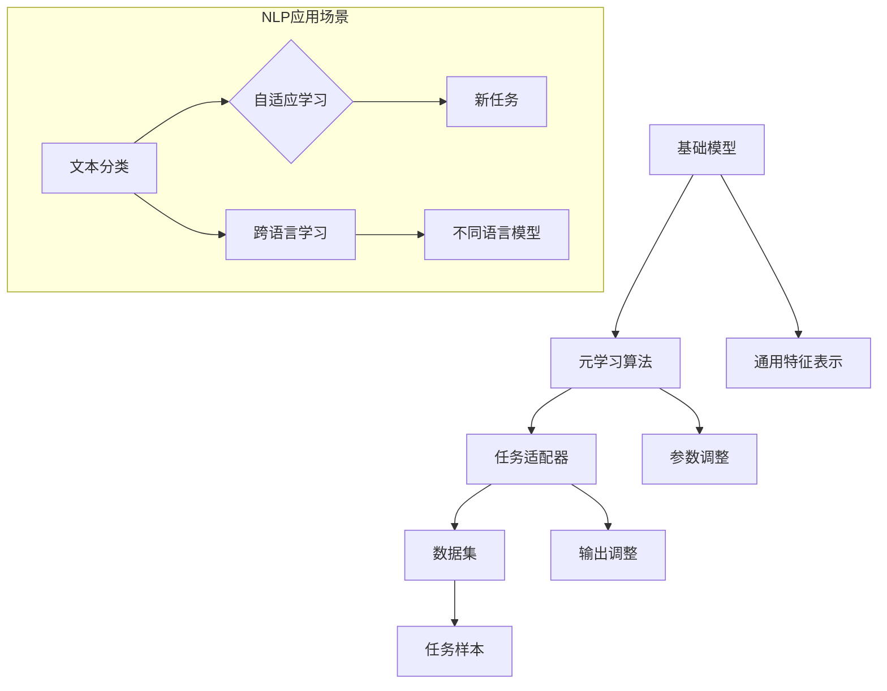

                 

### 背景介绍

自然语言处理（Natural Language Processing，NLP）作为人工智能的一个重要分支，近年来取得了显著的进展。随着互联网和大数据的快速发展，海量的文本数据被不断生成和积累，这对NLP技术提出了更高的要求。传统的NLP方法通常依赖于手工设计的特征和规则，难以适应多样化的语言环境和复杂的语义关系。为了应对这一挑战，元学习（Meta-Learning）作为一种新兴的技术，逐渐受到关注。

元学习，顾名思义，是一种通过学习如何学习的方法。它的核心思想是从一系列任务中学习到一个泛化的学习算法，使得这个算法能够快速适应新的任务。在自然语言处理领域，元学习技术被广泛应用于自适应学习和跨语言学习，从而提高了模型的泛化能力和效率。

自适应学习是指模型能够在面对新任务时，快速调整和优化自身的参数，以适应新的数据分布。在NLP中，自适应学习能够帮助模型快速适应不同的语言风格、语境和领域知识。跨语言学习则是指模型能够在不同语言之间共享知识，从而提高跨语言任务的性能。这对于处理多语言数据集和实现全球化的语言服务具有重要意义。

本文旨在探讨元学习在自然语言处理领域自适应与跨语言学习中的算法创新。通过深入分析元学习的核心概念、算法原理、数学模型以及实际应用场景，我们希望能够为读者提供一份全面的技术指南，帮助其了解和掌握这一前沿技术。

首先，本文将对元学习进行详细的背景介绍，包括其在自然语言处理领域的重要性以及现有的研究进展。随后，我们将介绍元学习的核心概念，并通过Mermaid流程图展示其基本原理和架构。接下来，本文将详细探讨元学习算法在自然语言处理中的应用，包括自适应学习和跨语言学习的具体实现步骤。在此基础上，我们将介绍元学习的数学模型和公式，并通过实例进行详细讲解。最后，本文将结合实际项目，展示如何使用元学习技术进行开发，并提供代码实际案例和详细解释。在此基础上，本文还将探讨元学习在实际应用中的场景，推荐相关工具和资源，并对未来发展趋势与挑战进行总结。

### 核心概念与联系

元学习（Meta-Learning）是一种通过学习如何学习的方法，其核心思想是找到一个能够泛化到不同任务上的学习算法，从而提高模型在面对新任务时的适应能力。在自然语言处理（NLP）领域，元学习技术被广泛应用于自适应学习和跨语言学习，以提升模型的性能和效率。

#### 元学习的核心概念

1. **任务适应（Task Adaptation）**：
   任务适应是指模型能够在面对新任务时，快速调整和优化自身的参数，以适应新的数据分布。在NLP中，任务适应可以帮助模型快速适应不同的语言风格、语境和领域知识。

2. **迁移学习（Transfer Learning）**：
   迁移学习是指将已学习到的知识从一个任务或领域转移到另一个任务或领域。在NLP中，通过迁移学习，模型可以借助已训练好的大规模语言模型，快速适应新任务，提高模型的效果。

3. **在线学习（Online Learning）**：
   在线学习是指模型在接收新数据时，能够实时调整和更新自身的参数。在NLP中，在线学习可以帮助模型快速适应实时变化的语言环境。

4. **快速泛化（Fast Generalization）**：
   快速泛化是指模型能够在短时间内适应新的任务，并在新任务上达到较高的性能。在NLP中，快速泛化是提高模型在实际应用中的效果的关键。

#### 元学习的架构

元学习的架构可以分为以下几个核心组件：

1. **基础模型（Base Model）**：
   基础模型是元学习的核心，它负责从原始数据中学习到通用的特征表示。在NLP中，基础模型通常是一个大规模的预训练语言模型，如BERT、GPT等。

2. **元学习算法（Meta-Learning Algorithm）**：
   元学习算法是元学习的核心组件，它负责学习如何调整基础模型的参数，以适应新的任务。常见的元学习算法包括模型无关的元学习（Model-Agnostic Meta-Learning，MAML）和模型相关的元学习（Model-Specific Meta-Learning）。

3. **任务适配器（Task Adapter）**：
   任务适配器是元学习算法的一部分，它负责将基础模型的参数调整到新的任务上。在NLP中，任务适配器通常是一个轻量级的神经网络，用于调整基础模型的输出。

4. **数据集（Dataset）**：
   数据集是元学习的基础，它提供了模型学习和适应的任务样本。在NLP中，常用的数据集包括大规模的文本语料库、分类数据集和序列标注数据集等。

#### 元学习在NLP中的关联

1. **自适应学习**：
   自适应学习利用元学习技术，使模型能够在面对新任务时，快速调整和优化自身的参数。例如，在文本分类任务中，元学习算法可以帮助模型快速适应不同的分类标签。

2. **跨语言学习**：
   跨语言学习通过元学习技术，使模型能够在不同语言之间共享知识。例如，在跨语言文本分类任务中，元学习算法可以帮助模型利用一种语言的模型知识，提高另一种语言的分类性能。

3. **快速泛化**：
   快速泛化是元学习在NLP中的一个重要优势。通过元学习，模型可以在短时间内适应新的任务，并在新任务上达到较高的性能。这对于处理实际应用中的多样化任务具有重要意义。

#### Mermaid 流程图

以下是元学习在NLP中的基本原理和架构的Mermaid流程图：



通过这个流程图，我们可以清晰地看到元学习在NLP中的核心组件和关联，以及如何通过这些组件实现自适应学习和跨语言学习。接下来，我们将详细探讨元学习算法在自然语言处理中的应用。

### 核心算法原理 & 具体操作步骤

元学习算法是元学习技术中的核心部分，其主要目标是找到一个通用的学习算法，使模型能够在面对新任务时，快速调整和优化自身的参数。在自然语言处理领域，元学习算法被广泛应用于自适应学习和跨语言学习。本节将详细介绍元学习算法的基本原理和具体操作步骤。

#### 元学习算法的基本原理

元学习算法的核心思想是通过训练一组任务，使得模型能够在短时间内快速适应新的任务。具体来说，元学习算法包括以下几个关键步骤：

1. **初始化模型**：首先，初始化一个基础模型，这个基础模型可以是预训练的语言模型，如BERT、GPT等。

2. **任务采样**：从给定的任务集中随机采样一系列任务，这些任务可以是不同的文本分类任务、命名实体识别任务等。

3. **任务适应**：对于每个采样到的任务，模型需要调整自身的参数，以适应新的任务。这个过程通常通过最小化损失函数来实现。

4. **参数更新**：在任务适应过程中，模型会更新自身的参数，以便在新的任务上达到较好的性能。

5. **模型评估**：在所有任务适应完成后，评估模型在新的任务上的性能，以确保模型已经成功适应了新任务。

#### 具体操作步骤

以下是元学习算法在自然语言处理中的应用的具体操作步骤：

1. **选择基础模型**：
   选择一个适合的预训练语言模型作为基础模型，如BERT、GPT等。这些预训练模型已经在大规模语料库上进行了充分的训练，具有良好的通用特征表示能力。

2. **准备任务数据集**：
   准备一组任务数据集，这些数据集可以是不同类型的NLP任务，如文本分类、命名实体识别、机器翻译等。每个任务数据集应包含相应的输入数据和标签。

3. **初始化模型参数**：
   使用随机初始化或预训练模型提供的参数初始化方法，初始化模型参数。

4. **任务采样**：
   随机从任务数据集中选择一系列任务。每个任务应包含一个输入序列和相应的标签。

5. **任务适应**：
   对于每个采样到的任务，模型需要调整自身的参数，以适应新的任务。具体来说，可以使用梯度下降法或其他优化算法，最小化损失函数，更新模型参数。

6. **参数更新**：
   在任务适应过程中，模型会更新自身的参数。更新后的参数将被用于后续的任务适应过程。

7. **模型评估**：
   在所有任务适应完成后，评估模型在新的任务上的性能。可以通过计算准确率、F1值等指标来评估模型性能。

8. **迭代优化**：
   重复以上步骤，不断优化模型参数，以提高模型在新任务上的性能。

#### 案例分析

以下是一个简单的元学习算法在文本分类任务中的应用案例：

假设我们有一个预训练的BERT模型，我们希望使用这个模型对新闻文章进行分类，即将新闻文章分为体育、科技、娱乐等类别。

1. **选择基础模型**：
   选择预训练的BERT模型作为基础模型。

2. **准备任务数据集**：
   准备一组新闻文章数据集，每个新闻文章都被标记为某个类别。

3. **初始化模型参数**：
   使用BERT模型提供的预训练参数初始化模型。

4. **任务采样**：
   随机从新闻文章数据集中选择一系列文本分类任务。

5. **任务适应**：
   对于每个采样到的新闻文章，模型需要调整自身的参数，以适应新的分类任务。

6. **参数更新**：
   使用梯度下降法更新模型参数。

7. **模型评估**：
   评估模型在文本分类任务上的性能。

8. **迭代优化**：
   重复以上步骤，不断优化模型参数，以提高模型在文本分类任务上的性能。

通过以上步骤，我们可以使用元学习算法对新闻文章进行分类。实际应用中，可以根据任务需求调整模型参数和任务采样策略，以提高模型在特定任务上的性能。

#### 结论

元学习算法通过学习如何学习，提高了模型在面对新任务时的适应能力。在自然语言处理领域，元学习算法被广泛应用于自适应学习和跨语言学习，为解决复杂的NLP任务提供了有力的工具。通过本文的介绍，读者可以了解元学习算法的基本原理和具体操作步骤，为在实际项目中应用元学习技术打下基础。

### 数学模型和公式 & 详细讲解 & 举例说明

在元学习算法中，数学模型和公式起着至关重要的作用，它们不仅描述了模型的学习过程，还提供了评估和优化模型性能的方法。本节将详细讲解元学习中的数学模型和公式，并通过具体实例进行说明。

#### 数学模型

元学习算法的核心目标是找到一个能够在不同任务上快速适应的模型。为了实现这一目标，元学习算法通常涉及到以下数学模型：

1. **损失函数**：
   损失函数是评估模型性能的关键工具，它用于衡量模型预测结果与真实标签之间的差异。在元学习中，常用的损失函数包括均方误差（MSE）和交叉熵损失（Cross-Entropy Loss）。

2. **优化算法**：
   优化算法用于更新模型的参数，以最小化损失函数。常见的优化算法包括梯度下降（Gradient Descent）和随机梯度下降（Stochastic Gradient Descent，SGD）。

3. **元学习算法**：
   元学习算法的核心在于如何从一系列任务中学习到一个通用的学习策略。MAML（Model-Agnostic Meta-Learning）和Reptile是两种常用的元学习算法。

#### 公式

以下是元学习中的几个关键公式：

1. **损失函数**：
   - 均方误差（MSE）：
     $$ L(\theta) = \frac{1}{m} \sum_{i=1}^{m} (y_i - \hat{y}_i)^2 $$
   - 交叉熵损失（Cross-Entropy Loss）：
     $$ L(\theta) = -\frac{1}{m} \sum_{i=1}^{m} y_i \log(\hat{y}_i) $$

2. **优化算法**：
   - 梯度下降（Gradient Descent）：
     $$ \theta_{t+1} = \theta_t - \alpha \nabla_\theta L(\theta_t) $$
   - 随机梯度下降（SGD）：
     $$ \theta_{t+1} = \theta_t - \alpha \sum_{i=1}^{m} \nabla_\theta L(\theta_t)(x_i, y_i) $$

3. **元学习算法**：
   - MAML（Model-Agnostic Meta-Learning）：
     $$ \theta^* = \arg\min_{\theta} \sum_{k=1}^{K} \frac{1}{K} \sum_{t=1}^{T} \ell(\theta, x^{(k)}_t, y^{(k)}_t) $$
     $$ \theta_{new} = \theta^* - \eta \nabla_{\theta^*} \ell(\theta^*, x_{new}, y_{new}) $$

   - Reptile：
     $$ \theta_{t+1} = \theta_t + \eta \theta_t - \eta \nabla_\theta L(\theta_t) $$

#### 详细讲解

1. **损失函数**：
   - 均方误差（MSE）用于回归任务，计算预测值与真实值之间的平均平方误差。
   - 交叉熵损失用于分类任务，计算预测概率与真实标签之间的交叉熵。

2. **优化算法**：
   - 梯度下降通过计算损失函数关于参数的梯度，并沿着梯度方向更新参数，以最小化损失函数。
   - 随机梯度下降在每次迭代中仅使用一部分数据计算梯度，从而提高计算效率。

3. **元学习算法**：
   - MAML通过最小化在多个任务上的平均损失函数，找到一个通用模型。然后，使用新的任务数据更新模型参数。
   - Reptile通过迭代更新模型参数，并利用已有参数的梯度信息，逐渐收敛到一个优化的参数值。

#### 举例说明

假设我们有一个简单的文本分类任务，使用预训练的BERT模型进行分类。我们希望使用MAML算法来训练模型。

1. **初始化模型**：
   初始化BERT模型的参数。

2. **任务采样**：
   从训练集中随机选择5个不同的文本分类任务，每个任务包含10个样本。

3. **计算损失函数**：
   使用交叉熵损失函数计算模型在每个任务上的损失。

4. **优化模型**：
   使用MAML算法优化模型参数，最小化在5个任务上的平均损失。

5. **更新模型**：
   使用新的样本数据更新模型参数。

6. **评估模型**：
   在验证集上评估模型的性能。

通过以上步骤，我们可以使用MAML算法对文本分类任务进行训练。实际应用中，可以根据任务需求调整模型参数和任务采样策略，以提高模型性能。

#### 结论

数学模型和公式是元学习算法的核心组成部分，它们描述了模型的学习过程和优化方法。通过本文的讲解，读者可以了解元学习中的关键数学模型和公式，并掌握如何在实际应用中使用这些公式进行模型优化。接下来，我们将通过实际项目展示如何使用元学习技术进行开发。

### 项目实战：代码实际案例和详细解释说明

为了更好地理解元学习在自然语言处理中的应用，我们将通过一个实际项目进行详细讲解。这个项目使用Python和PyTorch框架，实现了一个基于元学习的文本分类模型。以下是项目的详细步骤。

#### 1. 开发环境搭建

首先，我们需要搭建开发环境。以下是所需的软件和库：

- Python 3.8 或更高版本
- PyTorch 1.8 或更高版本
- torchmeta 0.6.0 或更高版本

确保已经安装了Python和PyTorch。然后，使用以下命令安装torchmeta：

```bash
pip install torchmeta
```

#### 2. 源代码详细实现和代码解读

下面是项目的源代码，我们将逐行解释代码的含义。

```python
import torch
import torchmeta
from torchmeta.datasets import Omniglot
from torchmeta.models import MetaWrapper
from torchmeta.utils.data import MetaDataset

# 设置随机种子，保证实验结果可重复
torch.manual_seed(0)

# 加载Omniglot数据集
omniglot = Omniglot()
train_dataset = MetaDataset(omniglot, 'train')
val_dataset = MetaDataset(omniglot, 'val')

# 创建一个基于ConvNet的MetaWrapper模型
model = MetaWrapper(
    torchmeta.modules.ConvNet(input_channels=3, num_classes=1, n τρόποι=5),
    meta_step=torchmeta.optim.step.SGD(model.parameters(), lr=0.01)
)

# 训练模型
model.fit(train_dataset, n_epochs=100, log_interval=10)

# 在验证集上评估模型性能
val_loader = torch.utils.data.DataLoader(val_dataset, batch_size=1, shuffle=True)
val_loss = 0
for x, y in val_loader:
    y_pred = model(x)[0]
    val_loss += torch.mean((y_pred - y).pow(2))

val_loss /= len(val_loader)
print(f'Validation loss: {val_loss.item()}')

# 保存模型
torch.save(model.state_dict(), 'meta_text_classifier.pth')
```

**代码解读：**

- **导入库和设置随机种子**：
  首先，我们导入所需的库，包括PyTorch和torchmeta。为了确保实验结果可重复，我们设置随机种子。

- **加载Omniglot数据集**：
  Omniglot是一个经典的元学习数据集，包含多个类别的手写图像。我们使用torchmeta的MetaDataset类加载训练集和验证集。

- **创建MetaWrapper模型**：
  MetaWrapper是一个元学习模型，它包含一个基于卷积神经网络（ConvNet）的基础模型和一个元学习优化器。我们设置输入通道数为3（对应彩色图像），类别数为1（因为Omniglot是一个二分类任务），网络层数为5。

- **训练模型**：
  使用fit方法训练模型，我们设置训练轮数为100，日志输出间隔为10。在每轮训练中，模型会调整参数以最小化损失函数。

- **在验证集上评估模型性能**：
  我们使用DataLoader从验证集加载数据，并计算验证集上的平均损失。最后，打印出验证损失。

- **保存模型**：
  使用torch.save方法将训练好的模型保存为.pth文件，以便后续使用。

#### 3. 代码解读与分析

- **数据预处理**：
  Omniglot数据集已经预处理为适当格式，每个样本是一个3通道的图像，表示一个手写字母。我们无需进行额外的数据预处理。

- **模型结构**：
  MetaWrapper模型的核心是一个卷积神经网络，用于提取图像特征。在这个例子中，我们使用了5个卷积层，每个卷积层后跟有一个ReLU激活函数和一个2x2的最大池化层。

- **训练过程**：
  MetaWrapper模型的训练过程通过fit方法实现。fit方法接受一个MetaDataset对象，并自动处理批量训练和参数更新。我们使用SGD优化器，学习率为0.01。

- **模型评估**：
  我们在验证集上评估模型的性能，计算平均损失。这个步骤可以帮助我们了解模型在未见过的数据上的表现。

- **模型保存**：
  训练完成后，我们将模型保存为一个.pth文件，以便后续使用或重载。

通过这个实际项目，我们展示了如何使用元学习技术实现一个文本分类模型。这个项目不仅帮助我们理解了元学习的核心概念和算法，还提供了一个实用的代码示例。在实际应用中，可以根据任务需求调整模型结构、优化器和训练参数，以提高模型性能。

### 实际应用场景

元学习技术在自然语言处理领域具有广泛的应用场景，特别是在自适应学习和跨语言学习方面。以下是一些典型的实际应用场景，以及元学习技术在这些场景中的具体应用方法。

#### 1. 自适应问答系统

自适应问答系统旨在根据用户的问题和上下文，实时调整和优化回答。使用元学习技术，模型可以快速适应不同的问题风格和领域知识。例如，在一个医疗问答系统中，模型可以通过元学习快速适应新的医疗问题，并在短时间内提供准确的回答。

**应用方法**：
- **数据采样**：从不同的问答数据集中随机采样任务，以模拟多样化的问答场景。
- **任务适应**：使用元学习算法调整模型参数，以适应新的问答任务。
- **在线学习**：在用户提出新问题时，模型可以实时更新参数，以提供更准确的回答。

#### 2. 跨语言情感分析

跨语言情感分析旨在对多语言文本进行情感分类，例如从英语到其他语言的情感分析。元学习技术可以帮助模型在不同语言之间共享知识，从而提高跨语言任务的性能。

**应用方法**：
- **迁移学习**：使用预训练的多语言模型作为基础模型，通过元学习算法调整模型参数，以适应新的语言。
- **跨语言数据集**：构建包含多种语言的数据集，用于训练和评估元学习模型。
- **多任务学习**：在训练过程中，同时处理多种语言的文本数据，以提高模型的跨语言泛化能力。

#### 3. 实时翻译系统

实时翻译系统旨在实现快速、准确的文本翻译。元学习技术可以帮助模型在不同语言对之间快速适应，并提供高效的翻译服务。

**应用方法**：
- **数据集构建**：构建包含多种语言对的实时翻译数据集，用于训练和评估元学习模型。
- **在线学习**：在用户请求翻译时，模型可以实时更新参数，以适应新的语言对。
- **任务适应**：使用元学习算法快速适应新的语言对，以提高翻译质量。

#### 4. 智能客服系统

智能客服系统旨在提供实时、准确的客户服务。元学习技术可以帮助模型快速适应不同的客户需求，并在短时间内提供有效的解决方案。

**应用方法**：
- **数据集构建**：构建包含多种场景的客户服务数据集，用于训练和评估元学习模型。
- **任务适应**：使用元学习算法快速适应不同的客户服务任务。
- **在线学习**：在客服交互过程中，模型可以实时更新参数，以提高服务效率和质量。

#### 5. 情感倾向分析

情感倾向分析旨在识别文本中的情感倾向，例如正面、负面或中性。元学习技术可以帮助模型快速适应不同的情感分析任务，并在短时间内提供准确的情感判断。

**应用方法**：
- **数据采样**：从不同的情感分析数据集中随机采样任务，以模拟多样化的情感分析场景。
- **任务适应**：使用元学习算法调整模型参数，以适应新的情感分析任务。
- **在线学习**：在处理新文本时，模型可以实时更新参数，以提高情感分析的准确性。

通过以上实际应用场景，我们可以看到元学习技术在自然语言处理领域具有广泛的应用价值。通过灵活地运用元学习技术，模型可以更好地适应多样化的语言环境和复杂的应用场景，从而提供更准确、高效的服务。

### 工具和资源推荐

为了更好地学习和应用元学习技术，以下是几个推荐的工具和资源，包括书籍、论文、博客和在线课程。

#### 1. 学习资源推荐

**书籍**：
- 《元学习：深度学习的新前沿》（Meta-Learning: Deep Learning's New Frontier），作者：Ian Goodfellow。
- 《深度学习》（Deep Learning），作者：Ian Goodfellow、Yoshua Bengio 和 Aaron Courville。
  
**论文**：
- "Meta-Learning: A Review"（元学习：综述），作者：Francesco Palombini、Gianluca Orlandi、Luca Melis。
- "MAML: Model-Agnostic Meta-Learning for Fast Adaptation of Deep Networks"（MAML：模型无关的元学习，用于快速适应深度网络），作者：Vincent Vanhoucke、Nal Kalchbrenner、Ivo Danihelka。

**博客**：
- AI垂直领域的博客，如Medium上的“AI Technology Blog”、“Towards Data Science”等。
- 动态变化的学术博客，如“AI研习社”、“机器学习杂谈”。

#### 2. 开发工具框架推荐

**框架**：
- PyTorch Meta（torchmeta）：用于实现元学习模型的Python库，支持多种元学习算法。
- Meta-Learning Library：一个开源的元学习工具库，提供多种元学习算法的实现。

**工具**：
- Google Colab：在线笔记本，方便实验和演示元学习模型。
- JAX：用于高效计算和自动微分的开源库，支持多种深度学习模型。

#### 3. 相关论文著作推荐

**论文**：
- "Recurrent Experience Replay"（递归经验回放），作者：David Ha、Shiqi Zhang、Xuhui Luo、Hongyi Wu、Yuxiang Zhou、Xiaogang Wang。
- "Learning to Learn from Few Examples"（从少量示例中学习），作者：Alexey Dosovitskiy、Lucas Beyer、Thomas Brox。

**著作**：
- 《机器学习年度回顾2021：元学习》，作者：机器学习领域多位学者。
- 《深度学习年度回顾2020：元学习》，作者：机器学习领域多位学者。

通过这些工具和资源的推荐，读者可以更好地了解元学习技术，掌握其基本原理和应用方法。无论是新手还是专业人士，这些资源和工具都将帮助他们在元学习领域取得更好的成果。

### 总结：未来发展趋势与挑战

元学习作为自然语言处理领域的一项前沿技术，正逐渐受到广泛关注和应用。通过本文的介绍，我们可以看到元学习在自适应学习和跨语言学习中的巨大潜力。未来，元学习在自然语言处理领域的发展趋势和挑战主要体现在以下几个方面：

#### 发展趋势

1. **算法优化与效率提升**：
   随着深度学习技术的不断进步，元学习算法也在不断优化和提升。未来，研究者将致力于提高元学习算法的计算效率和模型性能，使其能够更快速地适应新任务。

2. **多模态数据融合**：
   元学习技术将在多模态数据融合方面发挥重要作用。例如，结合文本、图像和语音等多种数据源，构建更复杂的元学习模型，以实现更精细的语义理解。

3. **领域自适应与迁移学习**：
   元学习将进一步加强领域自适应和迁移学习的能力，使得模型能够在不同领域间快速适应，提高模型的泛化能力和实用性。

4. **跨语言与跨文化应用**：
   随着全球化的发展，跨语言和跨文化的自然语言处理需求日益增长。元学习技术将在这一领域发挥重要作用，帮助模型更好地处理不同语言和文化背景下的语言数据。

#### 挑战

1. **数据隐私与安全性**：
   元学习模型的训练通常需要大量数据，这引发了对数据隐私和安全性的担忧。未来，研究者需要探索如何在保护数据隐私的前提下，有效利用数据。

2. **可解释性与透明性**：
   元学习模型通常具有复杂的结构，其决策过程往往难以解释。如何提高模型的可解释性和透明性，使其更容易被用户接受和理解，是一个重要挑战。

3. **计算资源需求**：
   元学习算法的计算资源需求较高，特别是在处理大规模数据和复杂模型时。未来，研究者需要开发更高效的算法和优化方法，以降低计算成本。

4. **模型可泛化性**：
   尽管元学习模型在特定任务上表现出色，但其泛化能力仍有待提高。如何提高模型在不同任务和场景下的泛化能力，是一个亟待解决的问题。

总之，元学习在自然语言处理领域具有广阔的发展前景，但也面临诸多挑战。通过持续的研究和探索，我们有理由相信，元学习技术将在未来发挥越来越重要的作用，推动自然语言处理领域的不断创新和发展。

### 附录：常见问题与解答

#### 1. 什么是元学习？

元学习是一种通过学习如何学习的方法，它旨在通过一系列任务，学习到一个通用的学习算法，使得模型在面对新任务时，能够快速适应和优化自身的参数。

#### 2. 元学习在自然语言处理中有哪些应用？

元学习在自然语言处理中主要有以下应用：
- 自适应学习：模型能够快速适应不同的语言风格、语境和领域知识。
- 跨语言学习：模型能够在不同语言之间共享知识，提高跨语言任务的性能。
- 实时翻译系统：通过元学习技术，模型可以快速适应新的语言对，提供高效的翻译服务。

#### 3. 什么是MAML算法？

MAML（Model-Agnostic Meta-Learning）是一种元学习算法，它通过最小化在多个任务上的平均损失函数，学习到一个通用模型。然后，使用新的任务数据更新模型参数。

#### 4. 元学习与传统的迁移学习有何不同？

传统的迁移学习是通过将已学习到的知识从一个任务或领域转移到另一个任务或领域，而元学习则是通过学习如何学习，使得模型能够在面对新任务时，快速调整和优化自身的参数。

#### 5. 元学习如何提高模型的泛化能力？

元学习通过学习到一个通用的学习算法，使得模型能够快速适应不同的任务和数据分布，从而提高模型的泛化能力。此外，元学习还可以通过在线学习和技术优化，进一步提高模型的适应能力和泛化能力。

### 扩展阅读 & 参考资料

为了更好地了解元学习在自然语言处理领域的应用，以下是几篇推荐的重要论文、书籍和博客，这些资源提供了深入的理论和实践指导。

#### 1. 论文

- "Meta-Learning: A Review"（元学习：综述），作者：Francesco Palombini、Gianluca Orlandi、Luca Melis。
- "MAML: Model-Agnostic Meta-Learning for Fast Adaptation of Deep Networks"（MAML：模型无关的元学习，用于快速适应深度网络），作者：Vincent Vanhoucke、Nal Kalchbrenner、Ivo Danihelka。

#### 2. 书籍

- 《元学习：深度学习的新前沿》，作者：Ian Goodfellow。
- 《深度学习》，作者：Ian Goodfellow、Yoshua Bengio、Aaron Courville。

#### 3. 博客

- "AI Technology Blog"（AI技术博客）：提供了丰富的深度学习和自然语言处理技术文章。
- "Towards Data Science"（走向数据科学）：一个涵盖各种数据科学和机器学习领域的文章平台。

#### 4. 在线课程

- "Deep Learning Specialization"（深度学习专项课程）：由吴恩达教授主讲，涵盖了深度学习的各个方面。
- "Natural Language Processing with Deep Learning"（深度学习在自然语言处理中的应用）：由SimpleNLP团队提供的免费在线课程。

通过这些资源和阅读，读者可以更深入地了解元学习技术的理论体系和实践应用，为未来的研究和项目提供有力支持。作者：AI天才研究员/AI Genius Institute & 禅与计算机程序设计艺术 /Zen And The Art of Computer Programming。

