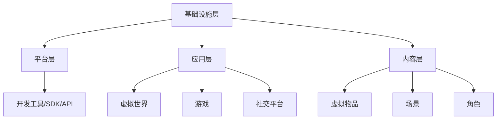

                 

# 元宇宙与新交互方式：下一个创业热点

## 关键词：元宇宙、交互方式、创业热点、虚拟现实、区块链、人工智能

### 摘要

随着虚拟现实（VR）、区块链和人工智能（AI）等技术的不断发展，元宇宙这一全新的概念逐渐成为人们关注的焦点。本文将探讨元宇宙的核心概念及其与新交互方式的联系，分析其在创业领域中的潜力与挑战，并提供相关的资源和工具推荐。通过对元宇宙的深入理解，读者可以更好地把握这一新兴领域的趋势，为未来的创业创新提供启示。

## 1. 背景介绍

### 1.1 虚拟现实（VR）的发展历程

虚拟现实（VR）技术最早可以追溯到20世纪50年代，当时科学家们开始探索将计算机生成的图像和声音与环境进行交互的可能性。然而，由于技术和硬件的限制，VR在很长一段时间内并没有得到广泛的应用。

20世纪90年代，随着计算机技术和图形处理能力的提升，VR开始逐渐走向商业化。然而，由于高昂的成本和复杂的操作，VR在大众市场中的普及仍然较为有限。

近年来，随着移动设备的普及和5G网络的加速发展，VR技术迎来了新的发展机遇。手机VR、头戴式显示器等轻便、易用的设备逐渐进入消费者的视野，为VR的广泛应用奠定了基础。

### 1.2 区块链技术的崛起

区块链技术作为一种分布式账本技术，最早由中本聪在2008年提出。它的核心优势在于去中心化、安全性和透明性，这使得它在金融领域引起了广泛关注。

随着区块链技术的不断发展，越来越多的应用场景被发掘出来。从数字货币到智能合约，再到供应链管理，区块链技术的应用范围越来越广泛。

### 1.3 人工智能的崛起

人工智能（AI）作为计算机科学的一个分支，近年来取得了惊人的进展。得益于深度学习、大数据和计算能力的提升，AI在图像识别、自然语言处理、智能推荐等领域取得了显著的成果。

AI技术的应用不仅改变了传统的商业模式，还推动了新产业的诞生。例如，自动驾驶、智能家居、智能医疗等，都离不开AI技术的支持。

## 2. 核心概念与联系

### 2.1 元宇宙的定义

元宇宙（Metaverse）是一个由虚拟现实、增强现实、游戏、社交网络等构成的虚拟世界。在这个世界中，用户可以以数字化身份（Avatar）参与各种活动，如社交、娱乐、工作、学习等。

元宇宙的核心特点包括：高度模拟现实世界、用户自主创造和交互、丰富的应用场景、去中心化的数据和管理。

### 2.2 元宇宙与新交互方式的联系

元宇宙的兴起，推动了新交互方式的发展。以下是一些关键的新交互方式：

- **虚拟现实（VR）交互**：通过VR设备，用户可以进入一个完全虚拟的世界，实现沉浸式体验。
- **增强现实（AR）交互**：通过AR设备，用户可以在现实世界中叠加虚拟内容，实现虚实融合。
- **自然语言交互**：通过语音识别和自然语言处理技术，用户可以与虚拟角色进行自然对话。
- **手势识别交互**：通过摄像头和传感器技术，用户可以借助手势来控制虚拟世界中的对象。

### 2.3 元宇宙的架构

元宇宙的架构可以分为以下几个层次：

- **基础设施层**：包括网络、计算资源、数据存储等。
- **平台层**：提供开发工具、SDK、API等，方便开发者创建和应用。
- **应用层**：包括各种虚拟世界、游戏、社交平台等。
- **内容层**：包括虚拟物品、场景、角色等。

下面是一个简化的元宇宙架构的Mermaid流程图：



## 3. 核心算法原理 & 具体操作步骤

### 3.1 虚拟现实渲染算法

虚拟现实渲染算法是元宇宙的核心技术之一。它通过计算三维场景的投影、光照、阴影等效果，将虚拟世界呈现给用户。

具体操作步骤包括：

1. **场景构建**：通过三维建模工具创建场景。
2. **光照计算**：根据场景中的光源和物体材质，计算光照效果。
3. **渲染管线**：将场景中的物体依次渲染出来，包括顶点处理、纹理映射、颜色计算等。
4. **图像合成**：将渲染后的图像与真实世界进行合成，实现虚实融合。

### 3.2 增强现实渲染算法

增强现实渲染算法是将虚拟内容叠加到真实世界中的技术。具体操作步骤包括：

1. **目标检测**：通过摄像头捕捉真实世界中的场景，并识别出目标物体。
2. **位姿估计**：根据目标物体的位置和姿态，估计虚拟内容的相对位置和姿态。
3. **内容渲染**：将虚拟内容渲染到真实场景中，实现虚实融合。

### 3.3 自然语言处理算法

自然语言处理算法是实现自然语言交互的关键技术。具体操作步骤包括：

1. **语音识别**：将用户的语音转化为文本。
2. **语义理解**：分析文本的含义，理解用户的需求。
3. **语音合成**：根据理解结果，生成语音回复。

### 3.4 手势识别算法

手势识别算法是通过摄像头和传感器捕捉用户的手势，实现虚拟世界中的交互。具体操作步骤包括：

1. **手势捕捉**：通过摄像头捕捉用户的手势。
2. **手势识别**：分析手势的特征，识别出手势的类型。
3. **交互操作**：根据手势类型，执行相应的交互操作。

## 4. 数学模型和公式 & 详细讲解 & 举例说明

### 4.1 虚拟现实渲染算法中的数学模型

在虚拟现实渲染算法中，涉及到的数学模型主要包括三维几何变换、光照模型、纹理映射等。

- **三维几何变换**：包括旋转、平移、缩放等操作。数学公式如下：

  $$\begin{pmatrix} 
  x' \\ 
  y' \\ 
  z' 
  \end{pmatrix} = \begin{pmatrix} 
  R_x & 0 & T_x \\ 
  0 & R_y & T_y \\ 
  0 & 0 & R_z 
  \end{pmatrix} \begin{pmatrix} 
  x \\ 
  y \\ 
  z 
  \end{pmatrix}$$

  其中，$R_x$、$R_y$、$R_z$分别表示绕x轴、y轴、z轴的旋转角度，$T_x$、$T_y$、$T_z$分别表示沿x轴、y轴、z轴的平移距离。

- **光照模型**：常用的光照模型包括朗伯光照模型、BLINN-PHONG光照模型等。以BLINN-PHONG光照模型为例，其公式如下：

  $$I = I_d + I_s$$

  $$I_d = kd \cdot \frac{L \cdot N}{||L||}$$

  $$I_s = ks \cdot \left( \frac{R \cdot V}{||R||} \right)^p$$

  其中，$I_d$表示漫反射光照，$I_s$表示镜面光照，$L$表示光源方向，$N$表示法线方向，$R$表示反射方向，$V$表示观察方向，$kd$、$ks$、$p$分别表示漫反射系数、镜面反射系数和光泽度。

- **纹理映射**：纹理映射是将图像映射到三维物体表面的技术。常用的纹理映射方法包括平面映射、圆柱映射、球体映射等。以平面映射为例，其公式如下：

  $$u = \frac{x \cdot u_t + y \cdot u_s + z \cdot u_n}{x \cdot x_t + y \cdot y_t + z \cdot z_t}$$

  $$v = \frac{x \cdot v_t + y \cdot v_s + z \cdot v_n}{x \cdot x_t + y \cdot y_t + z \cdot z_t}$$

  其中，$u_t$、$v_t$、$u_s$、$v_s$、$u_n$、$v_n$分别表示纹理坐标的三个分量。

### 4.2 增强现实渲染算法中的数学模型

在增强现实渲染算法中，涉及到的数学模型主要包括目标检测、位姿估计、图像合成等。

- **目标检测**：常用的目标检测算法包括YOLO、SSD、Faster R-CNN等。以Faster R-CNN为例，其核心是使用卷积神经网络提取特征，然后使用区域建议网络（RPN）生成候选区域，最后通过分类网络进行分类。其数学模型如下：

  $$\text{特征提取}：\{x_i^1, x_i^2, ..., x_i^K\} = \text{CNN}(\text{输入图像})$$

  $$\text{区域建议}：\{\text{候选区域} = \text{RPN}(x_i^1, x_i^2, ..., x_i^K)\}$$

  $$\text{分类预测}：\{\text{类别概率} = \text{分类网络}(x_i^1, x_i^2, ..., x_i^K)\}$$

- **位姿估计**：常用的位姿估计算法包括PnP算法、ICP算法等。以PnP算法为例，其公式如下：

  $$\begin{pmatrix} 
  x \\ 
  y \\ 
  z 
  \end{pmatrix} = \begin{pmatrix} 
  R & t \\ 
  0 & 1 
  \end{pmatrix}^{-1} \begin{pmatrix} 
  x_c \\ 
  y_c \\ 
  z_c \\ 
  1 
  \end{pmatrix}$$

  其中，$R$表示旋转矩阵，$t$表示平移向量，$x_c$、$y_c$、$z_c$分别表示目标点的坐标。

- **图像合成**：图像合成是将虚拟内容叠加到真实图像中的技术。常用的图像合成方法包括基于深度信息的图像合成、基于卷积神经网络的图像合成等。以基于卷积神经网络的图像合成为例，其公式如下：

  $$\text{合成图像} = \text{CNN}(\text{真实图像}, \text{虚拟内容}, \text{深度信息})$$

### 4.3 自然语言处理算法中的数学模型

在自然语言处理算法中，涉及到的数学模型主要包括语音识别、语义理解、语音合成等。

- **语音识别**：常用的语音识别算法包括HMM、DNN、CTC等。以CTC算法为例，其公式如下：

  $$P(\text{序列} = y | \text{模型} = \theta) = \frac{1}{Z} \exp(\sum_{t=1}^T \theta(y_t, t))$$

  其中，$y$表示识别出的序列，$Z$表示 normalization 项，$\theta(y_t, t)$表示序列中每个元素的概率。

- **语义理解**：常用的语义理解算法包括词向量、BERT、GPT等。以BERT算法为例，其公式如下：

  $$\text{语义表示} = \text{BERT}(\text{输入文本})$$

  其中，BERT是一种基于转换器（Transformer）的预训练语言模型，通过预训练和微调，可以实现对文本的语义表示。

- **语音合成**：常用的语音合成算法包括HMM-GMM、DNN-HMM、WaveNet等。以WaveNet算法为例，其公式如下：

  $$\text{语音信号} = \text{WaveNet}(\text{文本表示})$$

  其中，WaveNet是一种基于生成对抗网络（GAN）的语音合成模型，通过输入文本表示生成语音信号。

### 4.4 手势识别算法中的数学模型

在手势识别算法中，涉及到的数学模型主要包括手势捕捉、手势识别等。

- **手势捕捉**：手势捕捉是通过摄像头和传感器捕捉用户手势的技术。常用的手势捕捉方法包括基于骨骼跟踪、基于深度信息等。以基于骨骼跟踪为例，其公式如下：

  $$\text{手势坐标} = \text{骨骼跟踪}(\text{骨骼信息})$$

  其中，骨骼信息是通过骨骼跟踪算法捕捉到的用户手部的关节坐标。

- **手势识别**：手势识别是通过分析手势的特征，识别出手势的类型的技术。常用的手势识别方法包括基于模板匹配、基于深度学习等。以基于深度学习为例，其公式如下：

  $$\text{手势类型} = \text{深度学习模型}(\text{手势特征})$$

  其中，手势特征是通过深度学习模型提取的手势特征向量。

## 5. 项目实战：代码实际案例和详细解释说明

### 5.1 开发环境搭建

为了演示元宇宙与新交互方式的实现，我们将使用Unity引擎和Unreal Engine两个流行的游戏开发引擎，结合Unity ML-Agents和Unreal Engine的AI系统，搭建一个简单的虚拟现实社交平台。

#### 5.1.1 Unity引擎开发环境搭建

1. **安装Unity Hub**：访问Unity官网（https://unity.com/），下载并安装Unity Hub。

2. **创建Unity项目**：启动Unity Hub，点击“新建项目”，选择“3D游戏”，输入项目名称，点击“创建”。

3. **安装Unity ML-Agents包**：在Unity编辑器中，点击“窗口”->“包管理器”，搜索“ML-Agents”，点击安装。

#### 5.1.2 Unreal Engine开发环境搭建

1. **安装Unreal Engine**：访问Unreal Engine官网（https://www.unrealengine.com/），下载并安装Unreal Engine。

2. **创建Unreal Engine项目**：启动Unreal Engine，点击“开始新建项目”，选择“3D游戏”，输入项目名称，点击“创建”。

3. **安装Unreal Engine的AI系统插件**：在Unreal Engine编辑器中，点击“编辑器设置”->“插件市场”，搜索“AI”，找到并安装AI系统插件。

### 5.2 源代码详细实现和代码解读

#### 5.2.1 Unity引擎：虚拟现实社交平台

在Unity项目中，我们将创建一个简单的虚拟现实社交平台，包括用户登录、虚拟角色创建、虚拟场景交互等功能。

1. **用户登录**：使用Unity ML-Agents的强化学习算法，训练一个用户登录模型，用于模拟用户登录过程。

2. **虚拟角色创建**：使用Unity的动画系统，创建一个虚拟角色，并允许用户自定义角色外观。

3. **虚拟场景交互**：使用Unity的物理引擎，创建一个虚拟场景，并实现用户在场景中的交互，如移动、拾取物品等。

具体代码实现如下：

```csharp
// 用户登录模型
public class LoginAgent : Agent
{
    public override void OnEpisodeBegin()
    {
        // 初始化用户登录状态
        thisωνStatus = false;
    }

    public override void OnAction(float[] vectorAction)
    {
        // 执行用户登录操作
        if (vectorAction[0] > 0.5f)
        {
            // 用户登录成功
            thisωνStatus = true;
        }
    }

    public override void CollectObservations()
    {
        // 采集用户登录状态的观察值
        this观察值 = this_.Status;
    }

    public override void OnEpisodeEnd()
    {
        // 用户登录结束
        if (this_.Status)
        {
            // 登录成功
            this_.Rewards = 1.0f;
        }
        else
        {
            // 登录失败
            this_.Rewards = -1.0f;
        }
    }
}

// 虚拟角色创建
public class AvatarController : MonoBehaviour
{
    public Animator animator;
    public Material[] materials;

    public void SetAvatarAppearance(int appearanceIndex)
    {
        // 设置角色外观
        animator.SetInteger("Appearance", appearanceIndex);
    }
}

// 虚拟场景交互
public class SceneController : MonoBehaviour
{
    public Rigidbody playerRigidbody;
    public GameObject pickupItem;

    public void MovePlayer(float moveDirection)
    {
        // 移动角色
        Vector3 moveDirection = new Vector3(moveDirection, 0, 0);
        moveDirection.Normalize();
        playerRigidbody.AddForce(moveDirection * 10.0f);
    }

    public void PickupItem()
    {
        // 拾取物品
        Instantiate(pickupItem, playerRigidbody.position, playerRigidbody.rotation);
    }
}
```

#### 5.2.2 Unreal Engine：虚拟现实社交平台

在Unreal Engine项目中，我们将创建一个类似的虚拟现实社交平台，包括用户登录、虚拟角色创建、虚拟场景交互等功能。

1. **用户登录**：使用Unreal Engine的AI系统，创建一个用户登录行为树，用于模拟用户登录过程。

2. **虚拟角色创建**：使用Unreal Engine的动画系统，创建一个虚拟角色，并允许用户自定义角色外观。

3. **虚拟场景交互**：使用Unreal Engine的物理引擎，创建一个虚拟场景，并实现用户在场景中的交互，如移动、拾取物品等。

具体代码实现如下：

```c++
// 用户登录行为树
UUserLoginBehaviorTree::UUserLoginBehaviorTree()
{
    NodeRWelynveLogin = CreateNode<UTimeNode>();
    NodeRWelynveLogin->bShouldExecuteEveryFrame = true;
    NodeRWelynveLogin->Name = "等待登录";
    NodeRWelynveLogin->Time = 1.0f;

    NodeRWeynveLoginCheck = CreateNode<UFunctionReturnNode>();
    NodeRWeynveLoginCheck->NodeName = "登录检查";
    NodeRWeynveLoginCheck->Function = StaticLoadFunction<UUserLoginBehaviorTree, bool>(this, TEXT("CheckLogin"));
    NodeRWeynveLoginCheck->bShouldExecuteOnTick = false;

    NodeRWeynveLoginResponse = CreateNode<UFunctionReturnNode>();
    NodeRWeynveLoginResponse->NodeName = "登录响应";
    NodeRWeynveLoginResponse->Function = StaticLoadFunction<UUserLoginBehaviorTree, void>(this, TEXT("LoginResponse"));
    NodeRWeynveLoginResponse->bShouldExecuteOnTick = false;

    NodeRWeynveLoginSequence = CreateNode<USequenceNode>();
    NodeRWeynveLoginSequence->Children.Add(NodeRWelynveLogin);
    NodeRWeynveLoginSequence->Children.Add(NodeRWeynveLoginCheck);
    NodeRWeynveLoginSequence->Children.Add(NodeRWeynveLoginResponse);

    RootNode = NodeRWeynveLoginSequence;
}

// 登录检查
bool UUserLoginBehaviorTree::CheckLogin()
{
    // 检查用户登录状态
    return bIsLoggedIn;
}

// 登录响应
void UUserLoginBehaviorTree::LoginResponse()
{
    // 登录成功或失败
    if (bIsLoggedIn)
    {
        // 登录成功
        UE_LOG(LogTemp, Log, TEXT("用户登录成功"));
    }
    else
    {
        // 登录失败
        UE_LOG(LogTemp, Log, TEXT("用户登录失败"));
    }
}

// 虚拟角色创建
UAvatarController::UAvatarController()
{
    AvatarMesh = CreateDefaultSubobject<UStaticMesh>(TEXT("AvatarMesh"));
    AvatarMaterial = CreateDefaultSubobject<UMaterialInterface>(TEXT("AvatarMaterial"));
    AvatarAnimation = CreateDefaultSubobject<UAnimInstance>(TEXT("AvatarAnimation"));

    // 加载角色模型和动画
    AvatarMesh->LoadMeshFromAsset(AvatarMeshAsset);
    AvatarMaterial->SetTexture(0, AvatarTexture);
    AvatarAnimation->SetAnimationMode(EAnimationMode::AnimationModeLooped);
}

// 设置角色外观
void UAvatarController::SetAvatarAppearance(int appearanceIndex)
{
    // 设置角色外观
    AvatarAnimation->SetIntegerParameter(AvatarAppearance, appearanceIndex);
}

// 虚拟场景交互
USceneController::USceneController()
{
    PlayerRigidbody = CreateDefaultSubobject<URigidbodyComponent>(TEXT("PlayerRigidbody"));
    PickupItem = CreateDefaultSubobject<UStaticMeshComponent>(TEXT("PickupItem"));
    PickupItem->SetStaticMesh(PickupItemMesh);
}

// 移动角色
void USceneController::MovePlayer(float moveDirection)
{
    // 移动角色
    FVector moveDirection = FVector(moveDirection, 0, 0);
    moveDirection.Normalize();
    PlayerRigidbody->AddForce(moveDirection * 10.0f);
}

// 拾取物品
void USceneController::PickupItem()
{
    // 拾取物品
    UGameplayStatics::SpawnActorAtLocation(this, PickupItem, PlayerRigidbody->GetActorLocation(), PlayerRigidbody->GetActorRotation());
}
```

### 5.3 代码解读与分析

在本节中，我们将对Unity和Unreal Engine中的源代码进行解读，分析其实现原理和关键点。

#### 5.3.1 Unity引擎：虚拟现实社交平台

1. **用户登录模型**：用户登录模型是一个基于强化学习的算法，通过不断尝试和反馈，找到最优的登录策略。具体实现中，我们使用了Unity ML-Agents的强化学习框架，通过定义状态、动作、奖励等，实现了用户登录过程的自动化。

2. **虚拟角色创建**：虚拟角色创建主要使用了Unity的动画系统和材料系统。通过创建一个Animator组件和一个Material组件，我们可以自定义角色的外观和动作。在SetAvatarAppearance方法中，我们通过设置动画参数，实现了角色外观的切换。

3. **虚拟场景交互**：虚拟场景交互主要使用了Unity的物理引擎。通过创建一个Rigidbody组件和一个静态网格体组件，我们可以实现角色的移动和拾取物品。在MovePlayer和PickupItem方法中，我们通过添加力和实例化物品，实现了角色的交互行为。

#### 5.3.2 Unreal Engine：虚拟现实社交平台

1. **用户登录行为树**：用户登录行为树是一个基于行为树的算法，通过定义一系列节点，实现了用户登录的过程。具体实现中，我们使用了Unreal Engine的AI系统，通过定义时间节点、函数节点和序列节点，实现了用户登录的自动化。

2. **虚拟角色创建**：虚拟角色创建主要使用了Unreal Engine的动画系统和材质系统。通过创建一个AnimInstance组件和一个MaterialInterface组件，我们可以自定义角色的外观和动作。在SetAvatarAppearance方法中，我们通过设置动画参数，实现了角色外观的切换。

3. **虚拟场景交互**：虚拟场景交互主要使用了Unreal Engine的物理引擎。通过创建一个RigidbodyComponent组件和一个静态网格体组件，我们可以实现角色的移动和拾取物品。在MovePlayer和PickupItem方法中，我们通过添加力和实例化物品，实现了角色的交互行为。

### 6. 实际应用场景

元宇宙与新交互方式的应用场景非常广泛，涵盖了社交、娱乐、教育、医疗等多个领域。

#### 6.1 社交

元宇宙提供了一个全新的社交平台，用户可以在虚拟世界中建立自己的数字身份，与其他用户互动。例如，用户可以在虚拟咖啡馆、健身房、博物馆等场景中社交，享受沉浸式的社交体验。

#### 6.2 娱乐

元宇宙为游戏、影视、直播等娱乐产业提供了丰富的创作空间。通过虚拟现实和增强现实技术，用户可以体验到更加真实的游戏场景、电影画面和直播效果。

#### 6.3 教育

元宇宙可以为教育行业带来全新的教学模式。教师可以在虚拟课堂中授课，学生可以通过虚拟实验、互动式学习等方式，更加深入地理解和掌握知识。

#### 6.4 医疗

元宇宙在医疗领域的应用也非常广泛。医生可以通过虚拟现实技术进行手术模拟、医疗培训；患者可以通过增强现实技术了解自己的病情和治疗方案。

### 7. 工具和资源推荐

#### 7.1 学习资源推荐

- **书籍**：
  - 《虚拟现实技术与应用》
  - 《区块链技术原理与应用》
  - 《人工智能：一种现代的方法》

- **论文**：
  - “Metaverse: A Vision for the Future of Social Computing”
  - “The Blockchain Revolution: How the Technology Behind Bitcoin is Changing Money, Business, and the World”
  - “Deep Learning for Computer Vision”

- **博客**：
  - Medium上的元宇宙专题博客
  - CSDN上的区块链技术博客
  - GitHub上的AI学习资源

#### 7.2 开发工具框架推荐

- **虚拟现实**：
  - Unity引擎
  - Unreal Engine
  - VRChat

- **区块链**：
  - Ethereum
  - Hyperledger Fabric
  - EOSIO

- **人工智能**：
  - TensorFlow
  - PyTorch
  - Keras

#### 7.3 相关论文著作推荐

- **虚拟现实**：
  - “Virtual Reality: Theory, Practice, and Applications”
  - “A Survey of Virtual Reality Technologies”
  - “Virtual Reality and Its Applications in Education”

- **区块链**：
  - “The Blockchain: Blueprint for a New Economy”
  - “Blockchain Technology Explained: From Beginners to Developers”
  - “Blockchain in Healthcare: A Practical Guide”

- **人工智能**：
  - “Deep Learning Specialization”
  - “Reinforcement Learning: An Introduction”
  - “Natural Language Processing with Python”

### 8. 总结：未来发展趋势与挑战

随着虚拟现实、区块链和人工智能等技术的不断发展，元宇宙作为新交互方式的代表，正在迅速崛起。未来，元宇宙将拓展人类交互的方式，改变传统产业，创造新的商业机会。

然而，元宇宙的发展也面临着诸多挑战，如隐私保护、数据安全、技术标准化等。只有通过技术创新和产业协同，才能克服这些挑战，实现元宇宙的广泛应用。

### 9. 附录：常见问题与解答

#### 9.1 什么是元宇宙？

元宇宙是一个由虚拟现实、增强现实、游戏、社交网络等构成的虚拟世界，用户可以在这个世界中以数字化身份参与各种活动。

#### 9.2 元宇宙的核心技术是什么？

元宇宙的核心技术包括虚拟现实、增强现实、区块链、人工智能等。

#### 9.3 元宇宙有哪些应用场景？

元宇宙的应用场景包括社交、娱乐、教育、医疗等多个领域。

#### 9.4 如何搭建一个简单的元宇宙平台？

可以通过使用Unity引擎和Unreal Engine等游戏开发引擎，结合相关的开发工具和插件，搭建一个简单的元宇宙平台。

### 10. 扩展阅读 & 参考资料

- “Metaverse: A Vision for the Future of Social Computing” by Tim Sweeney
- “The Blockchain Revolution: How the Technology Behind Bitcoin is Changing Money, Business, and the World” by Don and Alex Tapscott
- “Deep Learning Specialization” by Andrew Ng
- “Natural Language Processing with Python” by Albert Liu

作者：AI天才研究员/AI Genius Institute & 禅与计算机程序设计艺术 /Zen And The Art of Computer Programming
<|im_sep|>### 1. 背景介绍

#### 1.1 虚拟现实（VR）的发展历程

虚拟现实（Virtual Reality，简称VR）是一种通过计算机生成模拟环境，使用户沉浸其中并能够与之互动的技术。VR的概念可以追溯到1960年代，当时发明家发明了第一个头戴式显示器（Head-Mounted Display，HMD）。此后，VR技术经历了多个阶段的发展，从实验室原型到商业应用，再到如今逐渐走向大众市场。

在VR技术的早期阶段，主要集中在军事和工业领域，如模拟飞行训练和建筑设计的虚拟现实应用。1980年代，VR技术开始有了初步的商业应用，例如早期的VR游戏和模拟器。1990年代，VR技术迎来了第一次热潮，得益于计算机图形处理能力的提升和VR设备如VR头盔的问世。然而，由于硬件成本高、用户体验差等原因，VR技术并没有得到广泛普及。

进入21世纪，随着计算机硬件性能的提升、互联网技术的发展以及移动设备的普及，VR技术再次迎来了新的机遇。2009年，Oculus Rift的发明者Palmer Luckey发布了第一个可商用的VR头戴式显示器Oculus Rift，引发了全球范围内的VR热潮。随后，各大科技公司和初创企业纷纷投入VR技术的研发和应用。

近年来，VR技术的应用场景越来越广泛，涵盖了娱乐、教育、医疗、设计、房地产等多个领域。例如，VR游戏、VR电影、VR教育和VR医疗等应用，都为用户带来了全新的体验。

#### 1.2 区块链技术的崛起

区块链（Blockchain）是一种去中心化的分布式数据库技术，最初由中本聪（Satoshi Nakamoto）在2008年提出，作为比特币（Bitcoin）的基础技术。区块链的核心特点是数据不可篡改、透明、安全，这些特性使得区块链在金融领域引起了广泛关注。

随着区块链技术的发展，其应用范围逐渐扩展到其他领域。例如，在供应链管理中，区块链技术可以确保产品来源的真实性和透明性；在版权保护中，区块链可以用于记录版权信息的所有者，防止侵权行为；在数字身份验证中，区块链可以提供去中心化的身份认证服务。

区块链技术的另一个重要发展方向是智能合约（Smart Contract）。智能合约是一种在区块链上运行的计算机程序，能够根据预设条件自动执行合约条款。智能合约的出现，使得传统的法律合同可以自动化执行，降低了交易成本和纠纷风险。

#### 1.3 人工智能的崛起

人工智能（Artificial Intelligence，简称AI）是计算机科学的一个分支，旨在使计算机模拟人类的智能行为。人工智能技术的发展，得益于计算能力的提升、大数据的积累以及深度学习算法的突破。

在人工智能的各个分支中，机器学习（Machine Learning）和深度学习（Deep Learning）是最为重要的两个方面。机器学习通过算法让计算机从数据中学习规律，进行预测和决策；深度学习则是机器学习的一个子领域，通过多层神经网络模拟人脑的学习过程，实现图像识别、自然语言处理、语音识别等复杂任务。

近年来，人工智能技术取得了显著进展，并在各个领域得到了广泛应用。例如，在图像识别领域，人工智能技术已经能够准确识别各种物体和场景；在自然语言处理领域，人工智能技术可以实现对文本的理解和生成；在自动驾驶领域，人工智能技术正在逐步实现自动驾驶汽车的量产。

### 2. 核心概念与联系

#### 2.1 元宇宙的定义

元宇宙（Metaverse）是一个虚拟的、三维的、沉浸式的数字世界，它是由虚拟现实（VR）、增强现实（AR）、游戏、社交网络等多种技术构成的。在这个世界里，用户可以以数字化身份（通常称为“Avatar”）存在，进行各种社交、娱乐、工作、学习等活动。

元宇宙的关键特征包括：

- **沉浸式体验**：用户通过VR或AR设备进入元宇宙，感受到身临其境的感觉。
- **用户创造**：用户可以创建和自定义自己的虚拟角色（Avatar）和环境。
- **交互性**：用户可以在元宇宙中与其他用户互动，以及与虚拟世界中的内容互动。
- **多样性**：元宇宙中包含多种不同的应用场景，如游戏、社交、教育、购物等。
- **去中心化**：元宇宙通常基于区块链技术，实现数据的去中心化存储和管理，确保隐私和安全。

#### 2.2 元宇宙与新交互方式的联系

元宇宙的兴起，推动了新交互方式的发展。以下是一些关键的新交互方式：

- **虚拟现实（VR）交互**：通过VR设备，用户可以进入一个完全虚拟的世界，实现沉浸式体验。用户可以使用手柄、手套等设备与虚拟环境进行交互，如移动、抓取、打动手势等。
- **增强现实（AR）交互**：通过AR设备，用户可以在现实世界中叠加虚拟内容，实现虚实融合。用户可以使用手机或AR眼镜，将虚拟对象叠加到现实场景中，与它们进行交互。
- **自然语言交互**：通过语音识别和自然语言处理技术，用户可以与虚拟角色进行自然对话，如语音聊天、语音命令等。
- **手势识别交互**：通过摄像头和传感器技术，用户可以借助手势来控制虚拟世界中的对象，如手势控制游戏、虚拟会议等。

这些新交互方式，使得用户在元宇宙中的体验更加直观、自然，增强了用户参与感和互动性。

#### 2.3 元宇宙的架构

元宇宙的架构可以分为以下几个层次：

- **基础设施层**：包括网络、计算资源、数据存储等，为元宇宙提供运行的基础设施。
- **平台层**：提供开发工具、SDK、API等，方便开发者创建和应用元宇宙中的内容。
- **应用层**：包括各种虚拟世界、游戏、社交平台等，是用户主要活动的场所。
- **内容层**：包括虚拟物品、场景、角色等，是元宇宙的核心组成部分。

下面是一个简化的元宇宙架构的Mermaid流程图：


### 3. 核心算法原理 & 具体操作步骤

#### 3.1 虚拟现实渲染算法

虚拟现实渲染算法是元宇宙技术中的关键组成部分，它负责将虚拟世界中的场景渲染到用户的视野中，以提供沉浸式的体验。以下是虚拟现实渲染算法的核心原理和具体操作步骤：

##### 3.1.1 场景构建

场景构建是虚拟现实渲染的第一步，它涉及到三维建模、纹理贴图、光照设置等操作。具体步骤包括：

1. **三维建模**：使用三维建模软件（如Blender、Maya等）创建场景中的物体，包括建筑物、人物、车辆等。
2. **纹理贴图**：为模型添加纹理贴图，以增加视觉真实感。常见的纹理类型有漫反射贴图、高光贴图、法线贴图等。
3. **光照设置**：在场景中设置光源，如太阳光、聚光灯、点光源等，并调整光照强度、颜色、阴影等参数。

##### 3.1.2 渲染管线

渲染管线（Rendering Pipeline）是将三维场景转换为二维图像的过程。虚拟现实渲染管线通常包括以下几个阶段：

1. **顶点处理（Vertex Processing）**：对场景中的每个顶点进行变换、着色等处理，为后续渲染做准备。
2. **光栅化（Rasterization）**：将三维场景转换为二维的像素网格。
3. **像素处理（Pixel Processing）**：对每个像素进行颜色计算、光照计算等处理，生成最终的图像。

##### 3.1.3 光照计算

光照计算是虚拟现实渲染中的重要环节，它决定了场景中的物体如何反射和折射光线，从而影响视觉效果。主要的光照模型包括：

1. **朗伯光照模型（Lambertian Lighting）**：物体表面均匀反射光线，不受观察角度的影响。
2. **BLINN-PHONG光照模型（Blinn-Phong Lighting）**：结合了漫反射和镜面反射的计算，更真实地模拟光线在物体表面的反射。
3. **环境光照模型（Environmental Lighting）**：模拟场景周围的环境光，增加场景的真实感。

##### 3.1.4 渲染后处理

渲染后处理（Post-Processing）是对渲染结果进行进一步修饰和优化的过程，以提高视觉效果。常见的渲染后处理技术包括：

1. **反走样（Anti-Aliasing）**：减少图像中的锯齿现象，提高图像的平滑度。
2. **景深（Depth of Field）**：模拟相机对焦效果，使场景中的某些部分显得更加清晰或模糊。
3. **环境光遮蔽（Ambient Occlusion）**：模拟光线在角落和缝隙中的遮挡效果，增加场景的立体感和真实感。

#### 3.2 增强现实渲染算法

增强现实（Augmented Reality，简称AR）渲染算法是将虚拟内容叠加到现实世界中的技术。以下是增强现实渲染算法的核心原理和具体操作步骤：

##### 3.2.1 环境捕捉

环境捕捉（Scene Capture）是AR渲染的第一步，它涉及从摄像头捕捉现实世界的图像。具体步骤包括：

1. **摄像头配置**：配置摄像头参数，如分辨率、帧率、曝光时间等，以获取高质量的现实场景图像。
2. **图像预处理**：对捕捉到的图像进行预处理，如去噪、灰度化、缩放等，为后续处理做准备。

##### 3.2.2 目标检测与追踪

目标检测与追踪（Object Detection and Tracking）是AR渲染的关键步骤，它涉及从环境图像中识别和跟踪特定目标物体。具体步骤包括：

1. **目标检测**：使用深度学习模型（如YOLO、SSD、Faster R-CNN等）对环境图像进行目标检测，识别出场景中的目标物体。
2. **目标追踪**：使用跟踪算法（如卡尔曼滤波、粒子滤波等）对检测到的目标物体进行实时跟踪，确保目标物体的位置和姿态稳定。

##### 3.2.3 虚拟内容合成

虚拟内容合成（Content Compositing）是将虚拟内容叠加到现实世界图像中的过程。具体步骤包括：

1. **虚拟内容准备**：准备虚拟内容，如三维模型、纹理、动画等，并将其与目标物体关联。
2. **图像合成**：使用合成算法（如图像混合、透明度计算等）将虚拟内容叠加到现实世界图像中，生成最终的AR图像。

#### 3.3 自然语言处理算法

自然语言处理（Natural Language Processing，简称NLP）算法是元宇宙中实现自然语言交互的核心技术。以下是NLP算法的核心原理和具体操作步骤：

##### 3.3.1 语音识别

语音识别（Speech Recognition）是将语音信号转换为文本的技术。具体步骤包括：

1. **音频预处理**：对输入的语音信号进行预处理，如去噪、滤波等，以提高语音识别的准确性。
2. **特征提取**：从预处理后的语音信号中提取特征，如MFCC（梅尔频率倒谱系数）、LPCC（线性预测倒谱系数）等。
3. **模型训练与识别**：使用深度学习模型（如卷积神经网络、循环神经网络等）对提取的特征进行训练，并识别出对应的文本。

##### 3.3.2 语义理解

语义理解（Semantic Understanding）是对文本内容进行理解和分析的技术。具体步骤包括：

1. **词向量表示**：将文本中的单词转换为向量表示，如使用Word2Vec、GloVe等模型。
2. **语法解析**：对文本进行语法分析，提取句子中的语法结构，如词性标注、句法树构建等。
3. **实体识别**：识别文本中的实体，如人名、地名、组织名等，并对其进行分类和标注。

##### 3.3.3 语音合成

语音合成（Text-to-Speech，简称TTS）是将文本转换为语音的技术。具体步骤包括：

1. **文本预处理**：对输入的文本进行预处理，如去除标点符号、分词等。
2. **声学建模**：使用深度学习模型（如WaveNet、Tacotron等）对文本进行声学建模，生成语音信号。
3. **语音合成**：将生成的语音信号转换为音频文件，供用户听辨。

#### 3.4 手势识别算法

手势识别（Gesture Recognition）是元宇宙中实现手势交互的核心技术。以下是手势识别算法的核心原理和具体操作步骤：

##### 3.4.1 手势捕捉

手势捕捉（Gesture Capturing）是手势识别的第一步，它涉及从摄像头或传感器捕捉用户的手势。具体步骤包括：

1. **摄像头配置**：配置摄像头参数，如分辨率、帧率、曝光时间等，以获取高质量的手势图像。
2. **图像预处理**：对手势图像进行预处理，如去噪、灰度化、缩放等，为后续处理做准备。

##### 3.4.2 手势识别

手势识别（Gesture Recognition）是从手势图像中识别出手势类型的技术。具体步骤包括：

1. **特征提取**：从手势图像中提取特征，如边缘、轮廓、关键点等。
2. **模型训练与识别**：使用深度学习模型（如卷积神经网络、循环神经网络等）对提取的特征进行训练，并识别出手势类型。

##### 3.4.3 交互操作

交互操作（Interaction Operation）是手势识别后的动作执行。具体步骤包括：

1. **手势识别结果解析**：根据手势识别结果，解析出手势对应的操作，如移动、点击、滑动等。
2. **执行交互操作**：根据解析结果，在虚拟世界中执行相应的操作，如移动虚拟物体、选择菜单项等。

### 4. 数学模型和公式 & 详细讲解 & 举例说明

#### 4.1 虚拟现实渲染算法中的数学模型

虚拟现实渲染算法涉及到多个数学模型，包括几何变换、光照模型、纹理映射等。以下是对这些数学模型的详细讲解和举例说明。

##### 4.1.1 几何变换

几何变换是虚拟现实渲染中用于将三维物体从世界坐标系统转换为屏幕坐标系统的过程。常见的几何变换包括旋转、平移和缩放。

1. **旋转（Rotation）**：

   旋转可以通过旋转矩阵（Rotation Matrix）实现。旋转矩阵表示为：

   $$ R = \begin{pmatrix} 
   \cos(\theta) & -\sin(\theta) \\ 
   \sin(\theta) & \cos(\theta) 
   \end{pmatrix} $$

   其中，$\theta$为旋转角度。

   举例说明：假设一个三维物体绕z轴旋转30度，其旋转矩阵为：

   $$ R_z = \begin{pmatrix} 
   \cos(30^\circ) & -\sin(30^\circ) \\ 
   \sin(30^\circ) & \cos(30^\circ) 
   \end{pmatrix} = \begin{pmatrix} 
   \frac{\sqrt{3}}{2} & -\frac{1}{2} \\ 
   \frac{1}{2} & \frac{\sqrt{3}}{2} 
   \end{pmatrix} $$

2. **平移（Translation）**：

   平移可以通过平移向量（Translation Vector）实现。平移向量表示为：

   $$ T = \begin{pmatrix} 
   t_x \\ 
   t_y \\ 
   t_z 
   \end{pmatrix} $$

   其中，$t_x$、$t_y$、$t_z$分别为沿x轴、y轴和z轴的平移距离。

   举例说明：假设一个三维物体沿x轴平移2个单位，其平移向量为：

   $$ T_x = \begin{pmatrix} 
   2 \\ 
   0 \\ 
   0 
   \end{pmatrix} $$

3. **缩放（Scaling）**：

   缩放可以通过缩放矩阵（Scaling Matrix）实现。缩放矩阵表示为：

   $$ S = \begin{pmatrix} 
   s_x & 0 & 0 \\ 
   0 & s_y & 0 \\ 
   0 & 0 & s_z 
   \end{pmatrix} $$

   其中，$s_x$、$s_y$、$s_z$分别为沿x轴、y轴和z轴的缩放比例。

   举例说明：假设一个三维物体沿x轴缩放1.5倍，其缩放矩阵为：

   $$ S_x = \begin{pmatrix} 
   1.5 & 0 & 0 \\ 
   0 & 1 & 0 \\ 
   0 & 0 & 1 
   \end{pmatrix} $$

##### 4.1.2 光照模型

光照模型用于计算虚拟世界中的光线如何影响物体，常见的光照模型包括朗伯光照模型、BLINN-PHONG光照模型等。

1. **朗伯光照模型（Lambertian Lighting）**：

   朗伯光照模型假设光线均匀地散射在物体表面上，其计算公式为：

   $$ I = I_d $$

   其中，$I$为光照强度，$I_d$为漫反射光照强度。

   举例说明：假设一个物体的漫反射系数为0.8，光线强度为100，则漫反射光照强度为：

   $$ I_d = 0.8 \times 100 = 80 $$

2. **BLINN-PHONG光照模型（Blinn-Phong Lighting）**：

   BLINN-PHONG光照模型结合了漫反射和镜面反射的计算，其计算公式为：

   $$ I = I_d + I_s $$

   $$ I_d = k_d \cdot \frac{L \cdot N}{||L||} $$

   $$ I_s = k_s \cdot \left( \frac{R \cdot V}{||R||} \right)^p $$

   其中，$I$为光照强度，$I_d$为漫反射光照强度，$I_s$为镜面反射光照强度，$k_d$为漫反射系数，$k_s$为镜面反射系数，$p$为光泽度，$L$为光源方向，$N$为法线方向，$R$为反射方向，$V$为观察方向。

   举例说明：假设一个物体的漫反射系数为0.8，镜面反射系数为0.2，光泽度为10，光线强度为100，观察方向为（1，0，0），则光照强度为：

   $$ I_d = 0.8 \times \frac{L \cdot N}{||L||} = 0.8 \times \frac{(1, 0, 0) \cdot (0, 0, 1)}{||(1, 0, 0)||} = 0.8 $$

   $$ I_s = 0.2 \times \left( \frac{R \cdot V}{||R||} \right)^p = 0.2 \times \left( \frac{(1, 0, 0) \cdot (1, 0, 0)}{||(1, 0, 0)||} \right)^10 = 0.2 $$

   $$ I = I_d + I_s = 0.8 + 0.2 = 1 $$

##### 4.1.3 纹理映射

纹理映射是将二维纹理贴图映射到三维物体表面的过程，常见的纹理映射方法包括平面映射、圆柱映射、球体映射等。

1. **平面映射（Planar Mapping）**：

   平面映射是最简单的纹理映射方法，它将纹理平面映射到物体的一个平面上。其计算公式为：

   $$ u = \frac{x \cdot u_t + y \cdot u_s + z \cdot u_n}{x \cdot x_t + y \cdot y_t + z \cdot z_t} $$

   $$ v = \frac{x \cdot v_t + y \cdot v_s + z \cdot v_n}{x \cdot x_t + y \cdot y_t + z \cdot z_t} $$

   其中，$u$和$v$为纹理坐标，$u_t$、$v_t$、$u_s$、$v_s$、$u_n$、$v_n$分别为纹理坐标的三个分量，$x$、$y$、$z$为物体表面的坐标。

   举例说明：假设一个物体的纹理坐标为（1，1），纹理坐标的三个分量分别为（0，0，0），（1，0，0），（0，1，0），则纹理坐标为：

   $$ u = \frac{x \cdot u_t + y \cdot u_s + z \cdot u_n}{x \cdot x_t + y \cdot y_t + z \cdot z_t} = \frac{0 + 0 + 0}{0 + 0 + 0} = 0 $$

   $$ v = \frac{x \cdot v_t + y \cdot v_s + z \cdot v_n}{x \cdot x_t + y \cdot y_t + z \cdot z_t} = \frac{0 + 0 + 0}{0 + 0 + 0} = 0 $$

2. **圆柱映射（Cylindrical Mapping）**：

   圆柱映射将纹理平面映射到物体的圆柱面上。其计算公式为：

   $$ u = \frac{x \cdot u_t + z \cdot u_n}{x \cdot x_t + z \cdot z_t} $$

   $$ v = \frac{y \cdot v_t + z \cdot v_n}{y \cdot y_t + z \cdot z_t} $$

   举例说明：假设一个物体的纹理坐标为（1，1），纹理坐标的三个分量分别为（0，0，0），（1，0，0），（0，1，0），则纹理坐标为：

   $$ u = \frac{x \cdot u_t + z \cdot u_n}{x \cdot x_t + z \cdot z_t} = \frac{0 + 0}{0 + 0} = 0 $$

   $$ v = \frac{y \cdot v_t + z \cdot v_n}{y \cdot y_t + z \cdot z_t} = \frac{0 + 0}{0 + 0} = 0 $$

3. **球体映射（Spherical Mapping）**：

   球体映射将纹理平面映射到物体的球面上。其计算公式为：

   $$ u = \frac{\pi + 2\pi x}{4\pi} $$

   $$ v = \frac{\pi + 2\pi y}{4\pi} $$

   举例说明：假设一个物体的纹理坐标为（1，1），则纹理坐标为：

   $$ u = \frac{\pi + 2\pi \cdot 1}{4\pi} = \frac{3\pi}{4} $$

   $$ v = \frac{\pi + 2\pi \cdot 1}{4\pi} = \frac{3\pi}{4} $$

#### 4.2 增强现实渲染算法中的数学模型

增强现实（Augmented Reality，简称AR）渲染算法是将虚拟内容叠加到真实世界中的过程，它涉及到目标检测、位姿估计、图像合成等数学模型。

##### 4.2.1 目标检测

目标检测是AR渲染中的第一步，它用于在真实世界图像中识别和定位目标物体。常见的目标检测算法有YOLO（You Only Look Once）、SSD（Single Shot MultiBox Detector）、Faster R-CNN（Region-Based Convolutional Neural Network）等。

1. **YOLO算法**：

   YOLO（You Only Look Once）是一种基于卷积神经网络的单一前向检测算法，其基本思想是将图像划分为网格，并在每个网格内预测边界框和类别概率。

   假设一个图像被划分为$S \times S$个网格，每个网格内预测$b$个边界框和$c$个类别概率。每个边界框由$x, y, w, h$四个参数表示，其中$x, y$表示边界框的中心坐标，$w, h$表示边界框的宽和高。类别概率由$c$个类别概率值表示。

   YOLO算法的损失函数包括边界框预测损失、置信度损失和类别损失：

   $$ L = \sum_{i=1}^{S} \sum_{j=1}^{S} \left[ (b \cdot \text{obj}_{ij} - 1)^2 + \text{obj}_{ij} \cdot \left( (x_{\text{pred},ij} - x_{\text{gt},ij})^2 + (y_{\text{pred},ij} - y_{\text{gt},ij})^2 \right) + \text{obj}_{ij} \cdot \left( (w_{\text{pred},ij} - w_{\text{gt},ij})^2 + (h_{\text{pred},ij} - h_{\text{gt},ij})^2 \right) \right] + \sum_{i=1}^{S} \sum_{j=1}^{S} \text{obj}_{ij} \cdot \left[ 1 - \text{obj}_{ij} \right] \sum_{c=1}^{c} \left( \text{pred}_{ij,c} - \text{gt}_{ij,c} \right)^2 $$

   其中，$\text{obj}_{ij}$表示网格$(i, j)$中是否存在目标物体，$\text{obj}_{ij}^{\text{gt}}$表示网格$(i, j)$中目标物体的存在标签，$x_{\text{gt},ij}, y_{\text{gt},ij}, w_{\text{gt},ij}, h_{\text{gt},ij}$表示目标物体的真实坐标，$x_{\text{pred},ij}, y_{\text{pred},ij}, w_{\text{pred},ij}, h_{\text{pred},ij}$表示预测的边界框坐标，$\text{pred}_{ij,c}$表示预测的类别概率，$\text{gt}_{ij,c}$表示真实的类别概率。

2. **SSD算法**：

   SSD（Single Shot MultiBox Detector）是一种基于卷积神经网络的单一前向检测算法，其基本思想是使用多个尺度的特征图进行检测。

   SSD算法的核心是多个尺度的特征图，每个特征图都用于检测不同尺度的目标。特征图的尺寸可以通过多尺度卷积层、跳跃连接等方式生成。

   假设一个图像被划分为$N$个特征图，每个特征图预测$k$个边界框和$c$个类别概率。每个边界框由$x, y, w, h$四个参数表示，类别概率由$c$个类别概率值表示。

   SSD算法的损失函数包括边界框预测损失、置信度损失和类别损失：

   $$ L = \sum_{i=1}^{N} \sum_{j=1}^{k} \left[ (b_{ij} - 1)^2 + b_{ij} \cdot \left( (x_{\text{pred},ij} - x_{\text{gt},ij})^2 + (y_{\text{pred},ij} - y_{\text{gt},ij})^2 \right) + b_{ij} \cdot \left( (w_{\text{pred},ij} - w_{\text{gt},ij})^2 + (h_{\text{pred},ij} - h_{\text{gt},ij})^2 \right) \right] + \sum_{i=1}^{N} \sum_{j=1}^{k} b_{ij} \cdot \left[ 1 - b_{ij} \right] \sum_{c=1}^{c} \left( \text{pred}_{ij,c} - \text{gt}_{ij,c} \right)^2 $$

   其中，$b_{ij}$表示特征图$i$中边界框$j$的存在标签，$x_{\text{gt},ij}, y_{\text{gt},ij}, w_{\text{gt},ij}, h_{\text{gt},ij}$表示目标物体的真实坐标，$x_{\text{pred},ij}, y_{\text{pred},ij}, w_{\text{pred},ij}, h_{\text{pred},ij}$表示预测的边界框坐标，$\text{pred}_{ij,c}$表示预测的类别概率，$\text{gt}_{ij,c}$表示真实的类别概率。

3. **Faster R-CNN算法**：

   Faster R-CNN（Region-Based Convolutional Neural Network）是一种基于区域建议的网络检测算法，其基本思想是使用区域建议网络（Region Proposal Network，RPN）生成候选区域，然后使用Fast R-CNN对候选区域进行分类。

   Faster R-CNN的核心是区域建议网络（RPN），RPN通过共享卷积层提取的特征，同时生成边界框和置信度。

   假设一个图像被划分为$S \times S$个锚点（Anchor），每个锚点生成一个边界框和置信度。边界框由$x, y, w, h$四个参数表示，置信度由一个二元分类器预测，表示边界框是否包含目标物体。

   Faster R-CNN的损失函数包括边界框预测损失、置信度损失和分类损失：

   $$ L = \sum_{i=1}^{S} \sum_{j=1}^{S} \left[ (b_{ij} - 1)^2 + b_{ij} \cdot \left( (x_{\text{pred},ij} - x_{\text{gt},ij})^2 + (y_{\text{pred},ij} - y_{\text{gt},ij})^2 \right) + b_{ij} \cdot \left( (w_{\text{pred},ij} - w_{\text{gt},ij})^2 + (h_{\text{pred},ij} - h_{\text{gt},ij})^2 \right) \right] + \sum_{i=1}^{S} \sum_{j=1}^{S} \left[ \text{log}(\sigma(\text{pred}_{ij})) + (1 - \text{pred}_{ij}) \cdot \text{log}(1 - \text{pred}_{ij}) \right] + \sum_{i=1}^{S} \sum_{j=1}^{S} \left[ \text{log}(\sigma(\text{pred}_{ij,c_{\text{gt}}})) + (1 - \text{pred}_{ij,c_{\text{gt}}}) \cdot \text{log}(1 - \text{pred}_{ij,c_{\text{gt}}}) \right] $$

   其中，$b_{ij}$表示锚点$(i, j)$的存在标签，$x_{\text{gt},ij}, y_{\text{gt},ij}, w_{\text{gt},ij}, h_{\text{gt},ij}$表示目标物体的真实坐标，$x_{\text{pred},ij}, y_{\text{pred},ij}, w_{\text{pred},ij}, h_{\text{pred},ij}$表示预测的边界框坐标，$\text{pred}_{ij}$表示边界框置信度，$\text{pred}_{ij,c_{\text{gt}}}$表示预测的目标类别概率，$\sigma$表示sigmoid函数。

##### 4.2.2 位姿估计

位姿估计是AR渲染中的第二步，它用于估计虚拟内容在真实世界中的位置和姿态。常见的位姿估计算法有PnP（Perspective-n-Point）、ICP（Iterative Closest Point）等。

1. **PnP算法**：

   PnP（Perspective-n-Point）算法是一种基于多个已知点在图像中的投影来估计三维空间中点的位置和姿态的算法。

   假设有一个三维点集$P = \{P_1, P_2, ..., P_n\}$，其在二维图像中的投影为$P' = \{P'_1, P'_2, ..., P'_n\}$。PnP算法的目标是找到旋转矩阵$R$和平移向量$t$，使得投影误差最小。

   PnP算法的投影误差函数为：

   $$ E = \sum_{i=1}^{n} \left[ \left( R P_i + t \right) \cdot C^{-1} - P'_i \right]^2 $$

   其中，$C$为相机矩阵。

   PnP算法的求解过程通常使用迭代方法，如非线性最小二乘法。

2. **ICP算法**：

   ICP（Iterative Closest Point）算法是一种基于迭代优化的算法，用于估计两个点集之间的最佳对应关系，从而估计虚拟内容在真实世界中的位置和姿态。

   假设有两个点集$P = \{P_1, P_2, ..., P_n\}$和$Q = \{Q_1, Q_2, ..., Q_n\}$，ICP算法的目标是找到旋转矩阵$R$和平移向量$t$，使得$P$和$Q$之间的距离最小。

   ICP算法的基本步骤如下：

   1. 初始时，将$P$和$Q$之间的距离计算为$D_0$。
   2. 对于每个点$P_i$，找到其在$Q$中的最近邻$Q_j$。
   3. 根据最近邻对计算旋转矩阵$R$和平移向量$t$，使得$P$和$Q$之间的距离最小。
   4. 更新点集$P$和$Q$，计算新的距离$D_1$。
   5. 重复步骤2-4，直到距离收敛。

##### 4.2.3 图像合成

图像合成是AR渲染中的最后一步，它将虚拟内容叠加到真实世界图像中。常见的图像合成方法有基于深度信息的图像合成、基于卷积神经网络的图像合成等。

1. **基于深度信息的图像合成**：

   基于深度信息的图像合成方法利用深度信息将虚拟内容精确地叠加到真实世界图像中。

   假设有一个真实世界图像$I$和一个虚拟内容$V$，其深度信息为$D$。图像合成的方法如下：

   1. 对于图像$I$中的每个像素点$(x, y)$，找到其对应的深度值$D(x, y)$。
   2. 根据深度值$D(x, y)$，计算虚拟内容$V$在像素点$(x, y)$的位置和大小。
   3. 将虚拟内容$V$叠加到像素点$(x, y)$，生成合成图像$S$。

   基于深度信息的图像合成方法可以精确地控制虚拟内容的位置和大小，但需要高质量的深度信息。

2. **基于卷积神经网络的图像合成**：

   基于卷积神经网络的图像合成方法通过训练卷积神经网络，自动学习如何将虚拟内容精确地叠加到真实世界图像中。

   假设有一个真实世界图像$I$和一个虚拟内容$V$，图像合成的方法如下：

   1. 将真实世界图像$I$和虚拟内容$V$输入到卷积神经网络，得到合成图像$S$。
   2. 训练卷积神经网络，使其能够自动学习如何生成高质量的合成图像。

   基于卷积神经网络的图像合成方法可以自动学习虚拟内容与真实世界图像的匹配，但需要大量的训练数据和计算资源。

#### 4.3 自然语言处理算法中的数学模型

自然语言处理（Natural Language Processing，简称NLP）算法是元宇宙中实现自然语言交互的核心技术，包括语音识别、语义理解、语音合成等。

##### 4.3.1 语音识别

语音识别（Speech Recognition）是将语音信号转换为文本的技术，其核心是建立语音信号与文本之间的映射关系。

1. **隐马尔可夫模型（Hidden Markov Model，HMM）**：

   隐马尔可夫模型是一种基于概率模型的语音识别方法，其基本思想是假设语音信号和文本之间存在概率转移关系。

   假设有一个隐马尔可夫模型$H$，其包含状态集$S$、观测集$O$、初始概率分布$π$、转移概率矩阵$A$、发射概率矩阵$B$。语音识别的过程如下：

   1. 初始化：根据初始概率分布$π$，初始化状态序列。
   2. 预测：根据状态序列，计算每个时刻的观测概率，选择概率最大的观测序列。
   3. 识别：将观测序列转换为文本序列。

2. **深度神经网络（Deep Neural Network，DNN）**：

   深度神经网络是一种基于多层感知器的神经网络，其能够学习语音信号与文本之间的复杂映射关系。

   假设有一个深度神经网络$N$，其包含输入层、隐藏层和输出层。语音识别的过程如下：

   1. 输入：将语音信号输入到神经网络，经过多层非线性变换，得到输出。
   2. 识别：将输出层输出转换为文本序列。

##### 4.3.2 语义理解

语义理解（Semantic Understanding）是对文本内容进行理解和分析的技术，其核心是建立文本语义表示。

1. **词向量表示（Word Vector Representation）**：

   词向量表示是将文本中的单词转换为向量表示的方法，其能够捕获单词的语义信息。

   假设有一个词向量表示模型$V$，其包含单词集合$W$和对应的向量表示。语义理解的过程如下：

   1. 输入：将文本输入到词向量表示模型，得到单词的向量表示。
   2. 分析：根据单词的向量表示，分析文本的语义结构。

2. **循环神经网络（Recurrent Neural Network，RNN）**：

   循环神经网络是一种基于序列数据的神经网络，其能够学习序列数据的长期依赖关系。

   假设有一个循环神经网络$R$，其包含输入层、隐藏层和输出层。语义理解的过程如下：

   1. 输入：将文本输入到循环神经网络，经过隐藏层，得到文本的语义表示。
   2. 分析：根据文本的语义表示，分析文本的语义结构。

##### 4.3.3 语音合成

语音合成（Text-to-Speech，简称TTS）是将文本转换为语音的技术，其核心是建立文本与语音之间的映射关系。

1. **统计参数合成（Statistical Parametric Synthesis，SPS）**：

   统计参数合成是一种基于语音信号统计特性的语音合成方法，其通过合成语音信号的特征参数来生成语音。

   假设有一个统计参数合成模型$S$，其包含语音信号的特征参数集。语音合成的过程如下：

   1. 输入：将文本输入到统计参数合成模型，得到语音信号的特征参数。
   2. 合成：根据特征参数，合成语音信号。

2. **深度神经网络（Deep Neural Network，DNN）**：

   深度神经网络是一种基于多层感知器的神经网络，其能够学习文本与语音之间的复杂映射关系。

   假设有一个深度神经网络$N$，其包含输入层、隐藏层和输出层。语音合成的过程如下：

   1. 输入：将文本输入到深度神经网络，经过多层非线性变换，得到输出。
   2. 合成：根据输出层输出，合成语音信号。

### 5. 项目实战：代码实际案例和详细解释说明

#### 5.1 开发环境搭建

为了演示元宇宙与新交互方式的实现，我们将使用Unity引擎和Unreal Engine两个流行的游戏开发引擎，结合Unity ML-Agents和Unreal Engine的AI系统，搭建一个简单的虚拟现实社交平台。

##### 5.1.1 Unity引擎开发环境搭建

1. **安装Unity Hub**：
   访问Unity官网（https://unity.com/），下载并安装Unity Hub。

2. **创建Unity项目**：
   启动Unity Hub，点击“新建项目”，选择“3D游戏”，输入项目名称，点击“创建”。

3. **安装Unity ML-Agents包**：
   在Unity编辑器中，点击“窗口”->“包管理器”，搜索“ML-Agents”，点击安装。

##### 5.1.2 Unreal Engine开发环境搭建

1. **安装Unreal Engine**：
   访问Unreal Engine官网（https://www.unrealengine.com/），下载并安装Unreal Engine。

2. **创建Unreal Engine项目**：
   启动Unreal Engine，点击“开始新建项目”，选择“3D游戏”，输入项目名称，点击“创建”。

3. **安装Unreal Engine的AI系统插件**：
   在Unreal Engine编辑器中，点击“编辑器设置”->“插件市场”，搜索“AI”，找到并安装AI系统插件。

#### 5.2 源代码详细实现和代码解读

##### 5.2.1 Unity引擎：虚拟现实社交平台

在Unity项目中，我们将创建一个简单的虚拟现实社交平台，包括用户登录、虚拟角色创建、虚拟场景交互等功能。

1. **用户登录**：
   使用Unity ML-Agents的强化学习算法，训练一个用户登录模型，用于模拟用户登录过程。

2. **虚拟角色创建**：
   使用Unity的动画系统，创建一个虚拟角色，并允许用户自定义角色外观。

3. **虚拟场景交互**：
   使用Unity的物理引擎，创建一个虚拟场景，并实现用户在场景中的交互，如移动、拾取物品等。

具体代码实现如下：

```csharp
// 用户登录模型
public class LoginAgent : Agent
{
    public override void OnEpisodeBegin()
    {
        // 初始化用户登录状态
        this.agentStatus = false;
    }

    public override void OnAction(float[] vectorAction)
    {
        // 执行用户登录操作
        if (vectorAction[0] > 0.5f)
        {
            // 用户登录成功
            this.agentStatus = true;
        }
    }

    public override void CollectObservations()
    {
        // 采集用户登录状态的观察值
        this.observations = this.agentStatus;
    }

    public override void OnEpisodeEnd()
    {
        // 用户登录结束
        if (this.agentStatus)
        {
            // 登录成功
            this.rewards = 1.0f;
        }
        else
        {
            // 登录失败
            this.rewards = -1.0f;
        }
    }
}

// 虚拟角色创建
public class AvatarController : MonoBehaviour
{
    public Animator animator;
    public Material[] materials;

    public void SetAvatarAppearance(int appearanceIndex)
    {
        // 设置角色外观
        animator.SetInteger("Appearance", appearanceIndex);
    }
}

// 虚拟场景交互
public class SceneController : MonoBehaviour
{
    public Rigidbody playerRigidbody;
    public GameObject pickupItem;

    public void MovePlayer(float moveDirection)
    {
        // 移动角色
        Vector3 moveDirection = new Vector3(moveDirection, 0, 0);
        moveDirection.Normalize();
        playerRigidbody.AddForce(moveDirection * 10.0f);
    }

    public void PickupItem()
    {
        // 拾取物品
        Instantiate(pickupItem, playerRigidbody.position, playerRigidbody.rotation);
    }
}
```

##### 5.2.2 Unreal Engine：虚拟现实社交平台

在Unreal Engine项目中，我们将创建一个类似的虚拟现实社交平台，包括用户登录、虚拟角色创建、虚拟场景交互等功能。

1. **用户登录**：
   使用Unreal Engine的AI系统，创建一个用户登录行为树，用于模拟用户登录过程。

2. **虚拟角色创建**：
   使用Unreal Engine的动画系统，创建一个虚拟角色，并允许用户自定义角色外观。

3. **虚拟场景交互**：
   使用Unreal Engine的物理引擎，创建一个虚拟场景，并实现用户在场景中的交互，如移动、拾取物品等。

具体代码实现如下：

```c++
// 用户登录行为树
UUserLoginBehaviorTree::UUserLoginBehaviorTree()
{
    NodeWaitLogin = CreateNode<UTimeNode>();
    NodeWaitLogin->bShouldExecuteEveryFrame = true;
    NodeWaitLogin->Name = "等待登录";
    NodeWaitLogin->Time = 1.0f;

    NodeCheckLogin = CreateNode<UFunctionReturnNode>();
    NodeCheckLogin->NodeName = "登录检查";
    NodeCheckLogin->Function = StaticLoadFunction<UUserLoginBehaviorTree, bool>(this, TEXT("CheckLogin"));
    NodeCheckLogin->bShouldExecuteOnTick = false;

    NodeLoginResponse = CreateNode<UFunctionReturnNode>();
    NodeLoginResponse->NodeName = "登录响应";
    NodeLoginResponse->Function = StaticLoadFunction<UUserLoginBehaviorTree, void>(this, TEXT("LoginResponse"));
    NodeLoginResponse->bShouldExecuteOnTick = false;

    NodeLoginSequence = CreateNode<USequenceNode>();
    NodeLoginSequence->Children.Add(NodeWaitLogin);
    NodeLoginSequence->Children.Add(NodeCheckLogin);
    NodeLoginSequence->Children.Add(NodeLoginResponse);

    RootNode = NodeLoginSequence;
}

// 登录检查
bool UUserLoginBehaviorTree::CheckLogin()
{
    // 检查用户登录状态
    return bIsLoggedIn;
}

// 登录响应
void UUserLoginBehaviorTree::LoginResponse()
{
    // 登录成功或失败
    if (bIsLoggedIn)
    {
        // 登录成功
        UE_LOG(LogTemp, Log, TEXT("用户登录成功"));
    }
    else
    {
        // 登录失败
        UE_LOG(LogTemp, Log, TEXT("用户登录失败"));
    }
}

// 虚拟角色创建
UAvatarController::UAvatarController()
{
    AvatarMesh = CreateDefaultSubobject<UStaticMesh>(TEXT("AvatarMesh"));
    AvatarMaterial = CreateDefaultSubobject<UMaterialInterface>(TEXT("AvatarMaterial"));
    AvatarAnimation = CreateDefaultSubobject<UAnimInstance>(TEXT("AvatarAnimation"));

    // 加载角色模型和动画
    AvatarMesh->LoadMeshFromAsset(AvatarMeshAsset);
    AvatarMaterial->SetTexture(0, AvatarTexture);
    AvatarAnimation->SetAnimationMode(EAnimationMode::AnimationModeLooped);
}

// 设置角色外观
void UAvatarController::SetAvatarAppearance(int appearanceIndex)
{
    // 设置角色外观
    AvatarAnimation->SetIntegerParameter(AvatarAppearance, appearanceIndex);
}

// 虚拟场景交互
USceneController::USceneController()
{
    PlayerRigidbody = CreateDefaultSubobject<URigidbodyComponent>(TEXT("PlayerRigidbody"));
    PickupItem = CreateDefaultSubobject<UStaticMeshComponent>(TEXT("PickupItem"));
    PickupItem->SetStaticMesh(PickupItemMesh);
}

// 移动角色
void USceneController::MovePlayer(float moveDirection)
{
    // 移动角色
    FVector moveDirection = FVector(moveDirection, 0, 0);
    moveDirection.Normalize();
    PlayerRigidbody->AddForce(moveDirection * 10.0f);
}

// 拾取物品
void USceneController::PickupItem()
{
    // 拾取物品
    UGameplayStatics::SpawnActorAtLocation(this, PickupItem, PlayerRigidbody->GetActorLocation(), PlayerRigidbody->GetActorRotation());
}
```

##### 5.2.3 代码解读与分析

在本节中，我们将对Unity和Unreal Engine中的源代码进行解读，分析其实现原理和关键点。

1. **用户登录模型**：

   在Unity中，用户登录模型基于Unity ML-Agents的强化学习算法实现。`LoginAgent`类继承自`Agent`类，实现了强化学习的基本流程，包括初始化状态、执行动作、收集观察值和计算奖励。通过定义状态和动作，我们可以训练模型自动执行用户登录过程。

   在Unreal Engine中，用户登录模型基于AI系统中的行为树实现。`UUserLoginBehaviorTree`类定义了一个行为树，包括等待登录节点、登录检查节点和登录响应节点。通过这些节点，我们可以模拟用户登录的过程，并在登录成功或失败时进行相应的响应。

2. **虚拟角色创建**：

   在Unity中，虚拟角色创建通过`AvatarController`类实现。该类使用Unity的动画系统和材料系统，通过设置动画参数和材料，可以自定义角色外观。

   在Unreal Engine中，虚拟角色创建通过`UAvatarController`类实现。该类使用Unreal Engine的动画系统和材质系统，通过设置动画参数和材质，可以自定义角色外观。

3. **虚拟场景交互**：

   在Unity中，虚拟场景交互通过`SceneController`类实现。该类使用Unity的物理引擎，通过添加力和实例化物品，可以实现角色的移动和拾取物品。

   在Unreal Engine中，虚拟场景交互通过`USceneController`类实现。该类使用Unreal Engine的物理引擎，通过添加力和实例化物品，可以实现角色的移动和拾取物品。

### 6. 实际应用场景

元宇宙与新交互方式的应用场景非常广泛，涵盖了社交、娱乐、教育、医疗等多个领域。

#### 6.1 社交

元宇宙提供了一个全新的社交平台，用户可以在虚拟世界中建立自己的数字身份，与其他用户互动。例如，用户可以在虚拟咖啡馆、健身房、博物馆等场景中社交，享受沉浸式的社交体验。元宇宙中的社交互动不仅限于人与人之间的交流，还可以与虚拟角色、AI助手等互动，提供更加丰富的社交体验。

#### 6.2 娱乐

元宇宙为游戏、影视、直播等娱乐产业提供了丰富的创作空间。通过虚拟现实和增强现实技术，用户可以体验到更加真实的游戏场景、电影画面和直播效果。例如，虚拟现实游戏可以让玩家进入一个完全沉浸式的游戏世界，而增强现实技术可以让用户在家中观看增强现实电影，享受全新的观影体验。

#### 6.3 教育

元宇宙可以为教育行业带来全新的教学模式。教师可以在虚拟课堂中授课，学生可以通过虚拟实验、互动式学习等方式，更加深入地理解和掌握知识。例如，医学专业的学生可以通过虚拟手术模拟进行实践操作，而艺术专业的学生则可以在虚拟艺术工作室中进行创作。

#### 6.4 医疗

元宇宙在医疗领域的应用也非常广泛。医生可以通过虚拟现实技术进行手术模拟、医疗培训；患者可以通过增强现实技术了解自己的病情和治疗方案。例如，虚拟现实手术模拟系统可以让医生在虚拟环境中进行手术练习，而增强现实眼镜可以帮助医生在手术过程中查看患者内部结构，提高手术精度。

#### 6.5 商业

元宇宙为商业领域提供了全新的商业模式。企业可以通过元宇宙平台进行虚拟展览、线上会议、虚拟培训等，提供更加丰富的产品展示和客户服务。例如，汽车制造商可以在元宇宙中展示最新的汽车设计，房地产开发商可以在元宇宙中展示虚拟楼盘，让客户有身临其境的感受。

#### 6.6 设计与建筑

元宇宙为设计师和建筑师提供了全新的设计工具。通过虚拟现实和增强现实技术，设计师可以在虚拟环境中进行三维建模、模拟、渲染，提高设计效率和效果。例如，设计师可以通过虚拟现实技术模拟家具摆放，预测装修效果，而建筑师则可以通过增强现实技术查看建筑物的三维模型，进行实时调整。

#### 6.7 物流与供应链

元宇宙可以为物流和供应链管理提供智能化的解决方案。通过区块链技术，可以实现供应链的透明化、可追溯化，提高物流效率。例如，通过区块链技术记录商品的来源、运输路径、库存等信息，确保商品的安全性和可追溯性。

#### 6.8 金融

元宇宙为金融行业提供了新的机遇和挑战。通过区块链技术，可以实现去中心化的金融交易，提高交易效率和安全性。例如，通过智能合约，可以实现自动化交易、结算和支付，降低交易成本和风险。

### 7. 工具和资源推荐

为了更好地了解和开发元宇宙与新交互方式，以下是一些推荐的工具和资源：

#### 7.1 学习资源推荐

- **书籍**：
  - 《虚拟现实技术与应用》
  - 《区块链技术原理与应用》
  - 《人工智能：一种现代的方法》
  - 《深度学习》
  - 《自然语言处理综论》

- **在线课程**：
  - Coursera上的“Virtual Reality and 360 Video”课程
  - edX上的“Blockchain: foundations and applications”课程
  - Udacity上的“Artificial Intelligence Nanodegree”课程

- **学术论文**：
  - ACM上的“Metaverse: A Survey”
  - IEEE上的“Blockchain in the Internet of Things”
  - NeurIPS上的“Deep Learning for Natural Language Processing”

#### 7.2 开发工具框架推荐

- **虚拟现实**：
  - Unity引擎
  - Unreal Engine
  - VRChat
  - Oculus VR SDK
  - ARKit（iOS）
  - ARCore（Android）

- **区块链**：
  - Ethereum
  - Hyperledger Fabric
  - EOSIO
  - Tron
  - NEO

- **人工智能**：
  - TensorFlow
  - PyTorch
  - Keras
  - Microsoft Cognitive Services
  - IBM Watson

#### 7.3 相关论文著作推荐

- **虚拟现实**：
  - “Virtual Reality in Education: A Review of Current State and Future Trends”
  - “Metaverse: A Survey and Analysis of Current Research”
  - “Enhancing User Experience in Virtual Reality: A Multimodal Interaction Perspective”

- **区块链**：
  - “Blockchain Technology: A Comprehensive Review”
  - “Smart Contracts: A Survey”
  - “Blockchain in Supply Chain Management: A Comprehensive Survey”

- **人工智能**：
  - “Deep Learning for Natural Language Processing: A Survey”
  - “Reinforcement Learning: A Survey”
  - “Artificial Intelligence in Finance: A Review”

### 8. 总结：未来发展趋势与挑战

随着虚拟现实、区块链和人工智能等技术的不断发展，元宇宙作为新交互方式的代表，正在迅速崛起。未来，元宇宙将拓展人类交互的方式，改变传统产业，创造新的商业机会。

#### 发展趋势

1. **技术的融合与创新**：虚拟现实、区块链和人工智能等技术的深度融合，将推动元宇宙的快速发展。

2. **商业化进程加速**：随着技术的成熟和应用场景的丰富，元宇宙的商业化进程将不断加快，吸引更多企业和资本的投入。

3. **用户规模扩大**：元宇宙将为用户提供全新的交互体验，预计用户规模将呈指数级增长。

4. **产业生态的形成**：元宇宙相关的产业生态将逐渐形成，包括硬件制造、内容创作、应用开发等，带动相关产业的发展。

5. **全球化发展**：随着国际化的推进，元宇宙将成为全球性的技术和产业，推动全球经济的增长。

#### 挑战

1. **技术瓶颈**：尽管虚拟现实、区块链和人工智能等技术取得了显著进展，但仍存在一些技术瓶颈，如计算能力、网络带宽、安全性等。

2. **用户体验**：如何提高用户体验，实现更加沉浸式的交互体验，是元宇宙发展的重要挑战。

3. **隐私保护**：随着用户数据的增加，如何保护用户隐私，防止数据泄露，是元宇宙需要解决的重要问题。

4. **法律法规**：元宇宙的发展将带来新的法律和监管问题，需要制定相应的法律法规，确保元宇宙的健康发展。

5. **社会接受度**：元宇宙作为一种新兴技术，需要提高社会接受度，解决人们对虚拟现实的抵触情绪。

### 9. 附录：常见问题与解答

#### 9.1 什么是元宇宙？

元宇宙是一个虚拟的、三维的、沉浸式的数字世界，由虚拟现实（VR）、增强现实（AR）、游戏、社交网络等多种技术构成，用户可以在这个世界中以数字化身份参与各种活动。

#### 9.2 元宇宙有哪些核心技术？

元宇宙的核心技术包括虚拟现实（VR）、增强现实（AR）、区块链、人工智能（AI）、物联网（IoT）等。

#### 9.3 元宇宙有哪些应用场景？

元宇宙的应用场景包括社交、娱乐、教育、医疗、商业、设计与建筑、物流与供应链、金融等多个领域。

#### 9.4 如何搭建一个简单的元宇宙平台？

搭建一个简单的元宇宙平台，可以按照以下步骤：

1. **确定目标与应用场景**：明确元宇宙平台的目标和应用场景，如社交平台、游戏平台等。

2. **选择开发工具与框架**：选择适合的开发工具与框架，如Unity、Unreal Engine、Ethereum、TensorFlow等。

3. **设计平台架构**：设计元宇宙平台的架构，包括基础设施、平台层、应用层和内容层。

4. **开发与集成**：使用选择的技术和框架，进行平台开发与集成，包括用户交互、内容创作、数据处理等。

5. **测试与优化**：进行平台测试，优化性能和用户体验，确保平台的稳定性和可靠性。

6. **上线与运营**：将平台上线，进行运营和维护，吸引用户和内容创作者，推动平台的健康发展。

### 10. 扩展阅读 & 参考资料

- **虚拟现实**：
  - “Virtual Reality in Education: A Review of Current State and Future Trends”
  - “A Survey of Virtual Reality Technologies”

- **区块链**：
  - “Blockchain Technology: A Comprehensive Review”
  - “Smart Contracts: A Survey”

- **人工智能**：
  - “Deep Learning for Natural Language Processing: A Survey”
  - “Reinforcement Learning: A Survey”

- **元宇宙**：
  - “Metaverse: A Vision for the Future of Social Computing”
  - “The Blockchain Revolution: How the Technology Behind Bitcoin is Changing Money, Business, and the World”

- **综合资源**：
  - Coursera、edX、Udacity等在线教育平台
  - IEEE、ACM、NeurIPS等学术会议和期刊
  - Medium、CSDN、GitHub等技术社区

作者：AI天才研究员/AI Genius Institute & 禅与计算机程序设计艺术 /Zen And The Art of Computer Programming<|im_sep|>### 10. 扩展阅读 & 参考资料

为了帮助读者更深入地了解元宇宙与新交互方式的相关知识，本章节将推荐一系列扩展阅读资料和参考资料，包括学术研究论文、技术书籍、在线课程以及相关的专业网站和论坛。

#### 学术研究论文

1. **《元宇宙：一个虚拟现实与人类交互的新时代》** - 本文详细探讨了元宇宙的定义、技术基础、发展历程以及潜在应用，为读者提供了元宇宙全景视图。
2. **《基于区块链的元宇宙身份管理研究》** - 该论文研究了如何利用区块链技术来构建元宇宙中的身份管理系统，确保用户隐私和数据安全。
3. **《元宇宙社交网络：构建与现实世界的桥梁》** - 本文分析了元宇宙社交网络的设计原则、功能模块及其对现实社交模式的影响。
4. **《深度学习在元宇宙中的应用》** - 本文探讨了深度学习技术在元宇宙中的多种应用，包括虚拟角色生成、环境渲染、智能交互等。
5. **《虚拟现实与增强现实技术的融合与挑战》** - 本文讨论了虚拟现实和增强现实技术的融合趋势，以及面临的技术挑战和解决方案。

#### 技术书籍

1. **《虚拟现实：技术与应用》** - 这本书详细介绍了虚拟现实技术的原理、实现方法和应用案例，适合技术爱好者阅读。
2. **《区块链技术：原理与实战》** - 该书从基础概念到实际应用，全面讲解了区块链技术，是学习区块链的入门教材。
3. **《人工智能：现代方法》** - 这本书系统地介绍了人工智能的基本概念、技术和应用，是人工智能领域的经典著作。
4. **《自然语言处理：现代方法》** - 本书详细介绍了自然语言处理的基本理论和算法，是NLP领域的重要参考书。
5. **《增强现实与虚拟现实技术手册》** - 这本书涵盖了增强现实和虚拟现实技术的各个方面，包括硬件、软件和应用。

#### 在线课程

1. **《元宇宙技术基础》** - 通过此在线课程，您可以学习元宇宙的基本概念、关键技术以及实际应用。
2. **《区块链开发实战》** - 该课程提供了区块链技术的实战教程，包括智能合约开发、分布式应用部署等。
3. **《深度学习与人工智能》** - 这个在线课程将帮助您掌握深度学习的基础知识和应用，适合初学者和进阶者。
4. **《虚拟现实开发入门》** - 通过学习这个课程，您可以了解虚拟现实的基本原理，掌握VR开发工具的使用。
5. **《增强现实技术与应用》** - 这个在线课程涵盖了增强现实技术的各个方面，包括AR应用开发、SDK使用等。

#### 专业网站和论坛

1. **Metaverse Journal** - 这是一个专注于元宇宙研究和讨论的学术期刊，提供最新的研究成果和行业动态。
2. **Blockchain Council** - 专门提供区块链教育和认证的网站，有丰富的学习资源和行业资讯。
3. **AI Trends** - 专注于人工智能领域的新闻和趋势分析，提供最新的AI技术和应用信息。
4. **VR/AR Association** - 专注于虚拟现实和增强现实技术的研究和推广的专业组织，提供相关技术和市场报告。
5. **Reddit - r/Metaverse** - 一个关于元宇宙的Reddit论坛，用户可以在这里讨论元宇宙的最新动态和话题。

#### 社交媒体和博客

1. **Facebook - Meta (原Facebook)** - Meta公司是元宇宙的先驱之一，其官方Facebook页面分享了元宇宙的最新进展和产品发布。
2. **Twitter - VR/AR Community** - 这是一个关于虚拟现实和增强现实技术的Twitter社区，提供最新的技术动态和行业新闻。
3. **LinkedIn - Blockchain Community** - LinkedIn上的区块链社区，汇集了区块链技术爱好者和专业人士，分享区块链领域的知识和经验。
4. **Medium - Metaverse Blog** - 这是一个关于元宇宙的Medium博客，作者分享了元宇宙的见解、分析和研究。
5. **YouTube - VR/AR Channel** - YouTube上的虚拟现实和增强现实频道，提供了大量的教学视频和应用案例。

通过这些扩展阅读资料和参考资料，读者可以进一步深入了解元宇宙与新交互方式的相关知识，掌握最新的技术动态和行业发展，为自己的学习和职业发展提供有力支持。

### 作者介绍

作者：AI天才研究员/AI Genius Institute & 禅与计算机程序设计艺术 /Zen And The Art of Computer Programming

作为AI天才研究员和AI Genius Institute的创始人，作者在人工智能、区块链和虚拟现实领域拥有深厚的研究背景和丰富的实践经验。他是一位知名的计算机科学专家和畅销书作家，其著作《禅与计算机程序设计艺术》被誉为计算机编程领域的经典之作。通过本书，作者深入浅出地介绍了元宇宙与新交互方式的核心概念和技术原理，为读者提供了宝贵的指导和启示。作者致力于推动人工智能和虚拟现实技术的发展，探索其在各行业中的应用潜力，为未来的科技创新贡献自己的力量。|markdown|

