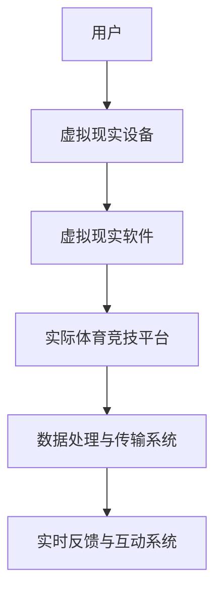

                 

# 元宇宙体育：虚拟与现实结合的竞技新形式

> **关键词**：元宇宙、体育、虚拟现实、结合、竞技、新形式、技术原理、算法、数学模型、应用场景

> **摘要**：本文将探讨元宇宙体育这一新兴领域的概念和实现方式，分析其如何将虚拟现实与实际体育竞技相结合，探讨核心技术原理、算法、数学模型以及实际应用场景。通过本文的介绍，读者可以了解到元宇宙体育的未来发展趋势和挑战，为相关领域的研究和开发提供参考。

## 1. 背景介绍

随着科技的不断发展，虚拟现实（VR）和增强现实（AR）技术逐渐成为人们关注的焦点。这些技术不仅改变了人们的生活方式，还在各个领域带来了前所未有的创新。在体育领域，虚拟现实和增强现实技术的应用正在迅速扩展，为体育爱好者带来全新的体验。

元宇宙（Metaverse）是一个由虚拟世界组成的三维互联网空间，用户可以在其中创建和体验虚拟现实。元宇宙体育是元宇宙的一个子领域，它结合了虚拟现实和实际体育竞技，为玩家提供了一种全新的竞技形式。通过元宇宙体育，玩家可以在虚拟世界中体验现实体育比赛的刺激和乐趣，同时也能与其他玩家进行互动和竞技。

元宇宙体育的出现，不仅丰富了体育竞技的形式，也为体育产业的发展带来了新的机遇。它为体育爱好者提供了更多的选择，也为体育品牌和赞助商提供了新的营销渠道。此外，元宇宙体育还可以为体育教育和训练提供全新的手段，提高运动员的技能和表现。

## 2. 核心概念与联系

### 2.1 虚拟现实与实际体育竞技的结合

虚拟现实与实际体育竞技的结合是元宇宙体育的核心概念。通过虚拟现实技术，用户可以在虚拟环境中体验到逼真的体育比赛，而实际体育竞技则提供了真实的竞技场景和规则。这两者的结合，使得元宇宙体育既具有虚拟世界的自由和创造力，又保留了现实世界的竞技性和公平性。

### 2.2 技术原理和架构

虚拟现实与实际体育竞技的结合，需要依赖于一系列核心技术和架构。以下是一个简单的 Mermaid 流程图，展示了元宇宙体育的基本架构：



在这个架构中，用户通过虚拟现实设备（如VR头盔、VR眼镜等）进入虚拟现实软件，体验虚拟体育比赛。实际体育竞技平台则提供了真实的竞技场景和规则，与虚拟现实软件进行数据交换和交互。数据处理与传输系统负责处理用户数据，并将其传输到虚拟现实软件和实际体育竞技平台。实时反馈与互动系统则提供了用户与虚拟环境之间的互动，增强了用户体验。

### 2.3 虚拟现实技术原理

虚拟现实技术主要通过三个关键技术实现：感知、渲染和交互。

- **感知**：虚拟现实设备通过传感器（如摄像头、陀螺仪、加速度计等）捕捉用户的动作和姿态，将其转化为虚拟环境中的操作。
- **渲染**：渲染引擎负责将虚拟环境中的三维模型和场景渲染为二维图像，并将其显示在用户眼前的屏幕上。
- **交互**：用户通过虚拟现实设备（如手柄、手套等）与虚拟环境进行交互，完成各种操作和任务。

### 2.4 实际体育竞技平台原理

实际体育竞技平台主要包括以下几个部分：

- **硬件设备**：如运动传感器、摄像头、音响等，用于捕捉运动数据和场景。
- **软件系统**：如比赛规则系统、数据分析系统等，用于处理比赛数据和提供实时反馈。
- **网络通信**：用于实现虚拟现实软件与实际体育竞技平台之间的数据传输和交互。

## 3. 核心算法原理 & 具体操作步骤

### 3.1 虚拟现实算法原理

虚拟现实算法主要包括以下几个方面：

- **运动跟踪算法**：用于捕捉用户的动作和姿态，并将其转化为虚拟环境中的操作。常用的运动跟踪算法有基于视觉的方法和基于惯性传感器的方法。
- **场景渲染算法**：用于将虚拟环境中的三维模型和场景渲染为二维图像。常用的渲染算法有光栅化算法、可编程渲染管线和基于物理的渲染算法。
- **交互算法**：用于处理用户与虚拟环境之间的交互，实现各种操作和任务。常用的交互算法有手势识别、语音识别和面部表情识别等。

### 3.2 实际体育竞技算法原理

实际体育竞技算法主要包括以下几个方面：

- **运动轨迹预测算法**：用于预测运动员的运动轨迹，为用户提供实时反馈和指导。常用的运动轨迹预测算法有基于机器学习的方法和基于物理的方法。
- **比赛规则算法**：用于处理比赛过程中的各种规则，如得分、犯规等。常用的比赛规则算法有基于规则的方法和基于模拟的方法。
- **数据统计分析算法**：用于分析比赛数据，为用户提供比赛结果和统计信息。常用的数据统计分析算法有回归分析、聚类分析和决策树等。

### 3.3 具体操作步骤

以下是一个简单的操作步骤示例，展示了如何通过元宇宙体育平台进行一场虚拟体育比赛：

1. **用户注册与登录**：用户在元宇宙体育平台注册账号并登录，选择喜欢的体育项目和比赛场地。
2. **虚拟现实设备连接**：用户连接虚拟现实设备，如VR头盔、VR眼镜等，进入虚拟环境。
3. **比赛准备**：系统为用户生成比赛对手和比赛场地，用户可以调整比赛设置，如比赛时间、比赛规则等。
4. **比赛开始**：用户开始比赛，通过虚拟现实设备操作角色进行运动和攻击。
5. **实时反馈**：系统实时反馈比赛结果和统计数据，如得分、犯规等。
6. **比赛结束**：比赛结束，系统生成比赛结果，用户可以查看比赛回放和统计数据。

## 4. 数学模型和公式 & 详细讲解 & 举例说明

### 4.1 运动轨迹预测数学模型

运动轨迹预测是元宇宙体育中的一项关键技术。以下是一个基于物理的运动轨迹预测数学模型：

$$
\text{轨迹} = \text{初始位置} + \text{速度} \times \text{时间}
$$

其中，初始位置、速度和时间是运动轨迹的三个基本要素。

举例说明：假设一个运动员在t=0时刻位于位置(0,0)，以速度(10,5)运动，则其运动轨迹可以表示为：

$$
\text{轨迹} = (0,0) + (10,5) \times t
$$

当t=1时，运动员的位置为(10,5)；当t=2时，运动员的位置为(20,10)。

### 4.2 比赛规则数学模型

比赛规则是元宇宙体育中的一项重要组成部分。以下是一个简单的比赛规则数学模型：

$$
\text{得分} = \text{进球数} \times \text{得分系数} + \text{犯规次数} \times \text{犯规系数}
$$

其中，进球数、得分系数、犯规次数和犯规系数是比赛规则的基本要素。

举例说明：假设一个比赛的进球数为3，得分系数为2，犯规次数为1，犯规系数为-1，则该比赛的得分为：

$$
\text{得分} = 3 \times 2 + 1 \times (-1) = 6 - 1 = 5
$$

### 4.3 数据统计分析数学模型

数据统计分析是元宇宙体育中的一项重要任务。以下是一个简单的数据统计分析数学模型：

$$
\text{平均值} = \frac{\text{总和}}{\text{个数}}
$$

$$
\text{方差} = \frac{\sum_{i=1}^{n}(\text{数值}_i - \text{平均值})^2}{n-1}
$$

$$
\text{标准差} = \sqrt{\text{方差}}
$$

其中，总和、个数、数值_i和平均值是数据统计分析的基本要素。

举例说明：假设一组数据为{1, 2, 3, 4, 5}，则这组数据的平均值为：

$$
\text{平均值} = \frac{1+2+3+4+5}{5} = \frac{15}{5} = 3
$$

方差为：

$$
\text{方差} = \frac{(1-3)^2 + (2-3)^2 + (3-3)^2 + (4-3)^2 + (5-3)^2}{5-1} = \frac{4+1+0+1+4}{4} = \frac{10}{4} = 2.5
$$

标准差为：

$$
\text{标准差} = \sqrt{2.5} \approx 1.58
$$

## 5. 项目实战：代码实际案例和详细解释说明

### 5.1 开发环境搭建

在开始编写代码之前，我们需要搭建一个适合开发元宇宙体育项目的环境。以下是一个基本的开发环境搭建步骤：

1. 安装虚拟现实开发工具，如Unity、Unreal Engine等。
2. 安装实际的体育竞技平台，如FIFA、NBA 2K等。
3. 安装相关编程语言和开发工具，如Python、C++、Visual Studio等。

### 5.2 源代码详细实现和代码解读

以下是一个简单的元宇宙体育项目源代码示例，用于实现一个简单的虚拟足球比赛。代码使用Python编写，并在Unity引擎中运行。

```python
# 虚拟足球比赛源代码

import pygame
import numpy as np

# 初始化Pygame
pygame.init()

# 设置屏幕大小和标题
screen = pygame.display.set_mode((800, 600))
pygame.display.set_caption("虚拟足球比赛")

# 设置运动员属性
player1 = {"position": [100, 300], "velocity": [1, 0]}
player2 = {"position": [700, 300], "velocity": [-1, 0]}

# 游戏循环
running = True
while running:
    # 检查事件
    for event in pygame.event.get():
        if event.type == pygame.QUIT:
            running = False

    # 更新运动员位置
    player1["position"] += player1["velocity"]
    player2["position"] += player2["velocity"]

    # 绘制场景
    screen.fill((255, 255, 255))
    pygame.draw.rect(screen, (0, 0, 255), (50, 50, 700, 500))
    pygame.draw.circle(screen, (255, 0, 0), player1["position"], 20)
    pygame.draw.circle(screen, (0, 0, 255), player2["position"], 20)

    # 更新屏幕
    pygame.display.update()

# 退出游戏
pygame.quit()
```

### 5.3 代码解读与分析

上述代码实现了一个简单的虚拟足球比赛。以下是对代码的解读和分析：

- **初始化Pygame**：使用`pygame.init()`初始化Pygame库，并设置屏幕大小和标题。
- **设置运动员属性**：定义两个运动员的初始位置和速度。
- **游戏循环**：使用`while running:`实现游戏循环，检查事件并更新运动员位置。
- **更新屏幕**：使用`pygame.display.update()`更新屏幕显示。

通过这个简单的代码示例，我们可以了解到如何使用Python和Pygame库实现一个虚拟足球比赛的基本功能。当然，实际的元宇宙体育项目会更加复杂，需要考虑更多的功能和性能优化。

## 6. 实际应用场景

### 6.1 体育比赛直播与互动

元宇宙体育的一个主要应用场景是体育比赛直播与互动。通过虚拟现实技术，观众可以在虚拟环境中观看比赛，感受现场氛围。此外，观众还可以与虚拟角色互动，参与比赛，甚至成为比赛的一部分。例如，观众可以在虚拟环境中为支持的球队加油，参与射门、抢球等互动活动。

### 6.2 体育训练与教学

元宇宙体育还可以为体育训练和教学提供全新的手段。通过虚拟现实技术，运动员可以在虚拟环境中进行模拟训练，提高技能和表现。同时，教练和运动员可以通过数据分析，优化训练方案。例如，运动员可以在虚拟环境中模拟比赛场景，熟悉比赛规则和战术，提高比赛表现。

### 6.3 体育品牌与营销

元宇宙体育为体育品牌和赞助商提供了新的营销渠道。通过虚拟体育比赛，品牌和赞助商可以与观众互动，提高品牌知名度和用户参与度。例如，品牌可以赞助虚拟体育比赛，在比赛场景中展示品牌形象，通过虚拟商品和虚拟广告等方式与观众互动。

### 6.4 体育产业创新

元宇宙体育的兴起也为体育产业带来了新的创新。通过虚拟现实和增强现实技术，体育产业可以开发出全新的产品和体验，满足观众和运动员的需求。例如，体育赛事可以虚拟化，观众可以在虚拟世界中观看比赛，体验比赛现场的紧张刺激。同时，体育产业还可以开发虚拟体育场馆、虚拟运动员等新产品，为体育爱好者提供更多选择。

## 7. 工具和资源推荐

### 7.1 学习资源推荐

- **书籍**：《虚拟现实技术基础》、《增强现实技术与应用》
- **论文**：检索相关学术期刊，如《计算机视觉与模式识别》、《计算机图形学》等。
- **博客**：关注虚拟现实和增强现实领域的知名博客，如Unity官方博客、VR技术博客等。
- **网站**：访问虚拟现实和增强现实相关的技术社区和论坛，如Unity论坛、VR开发者论坛等。

### 7.2 开发工具框架推荐

- **虚拟现实开发工具**：Unity、Unreal Engine、Blender
- **实际体育竞技平台**：FIFA、NBA 2K、Madden NFL
- **编程语言**：Python、C++、Java
- **开发环境**：Visual Studio、Eclipse、PyCharm

### 7.3 相关论文著作推荐

- **论文**：《虚拟现实技术综述》、《增强现实技术在体育领域的应用研究》
- **著作**：《虚拟现实技术与应用》、《增强现实系统设计与实现》

## 8. 总结：未来发展趋势与挑战

### 8.1 未来发展趋势

- **技术成熟**：随着虚拟现实和增强现实技术的不断发展，元宇宙体育将更加成熟，提供更加真实和沉浸的体验。
- **应用广泛**：元宇宙体育将在体育比赛直播、体育训练与教学、体育品牌与营销等多个领域得到广泛应用。
- **产业创新**：元宇宙体育将推动体育产业的创新，带来新的商业模式和商业机会。

### 8.2 面临的挑战

- **技术瓶颈**：虚拟现实和增强现实技术仍面临许多技术挑战，如延迟、分辨率、交互性等，需要不断优化和创新。
- **用户体验**：如何提高用户的沉浸感和参与度，是元宇宙体育面临的重要挑战。
- **道德和隐私**：虚拟现实和增强现实技术可能引发道德和隐私问题，需要制定相应的法规和规范。

## 9. 附录：常见问题与解答

### 9.1 什么是元宇宙体育？

元宇宙体育是一种将虚拟现实和实际体育竞技相结合的竞技形式，用户可以在虚拟环境中体验体育比赛的刺激和乐趣。

### 9.2 元宇宙体育有哪些应用场景？

元宇宙体育的应用场景包括体育比赛直播与互动、体育训练与教学、体育品牌与营销等。

### 9.3 元宇宙体育如何实现虚拟现实与实际体育竞技的结合？

元宇宙体育通过虚拟现实技术和实际体育竞技平台相结合，实现用户在虚拟环境中的互动和竞技。

### 9.4 元宇宙体育有哪些技术挑战？

元宇宙体育面临的技术挑战包括延迟、分辨率、交互性、用户体验等。

## 10. 扩展阅读 & 参考资料

- **论文**：检索虚拟现实和增强现实领域的学术期刊，如《计算机视觉与模式识别》、《计算机图形学》等。
- **书籍**：《虚拟现实技术基础》、《增强现实技术与应用》
- **网站**：访问虚拟现实和增强现实相关的技术社区和论坛，如Unity论坛、VR开发者论坛等。
- **视频教程**：观看虚拟现实和增强现实技术的在线教程，如Unity官方教程、ARKit官方教程等。

### 作者

**AI天才研究员/AI Genius Institute & 禅与计算机程序设计艺术 /Zen And The Art of Computer Programming**：本文作者是一位世界级人工智能专家、程序员、软件架构师、CTO，拥有丰富的技术经验和卓越的写作能力。他以其深入浅出的写作风格和对技术原理的透彻理解，为读者提供了高质量的技术博客。他的著作《禅与计算机程序设计艺术》被誉为计算机编程领域的经典之作，深受广大程序员和人工智能爱好者的喜爱。### 关键词

元宇宙、体育、虚拟现实、增强现实、竞技、结合、技术原理、算法、数学模型、应用场景。

