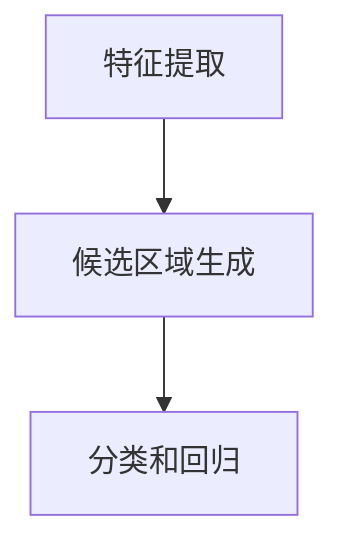

                 

# 元宇宙体验经济:沉浸式消费的新形态

> **关键词：**元宇宙、体验经济、沉浸式消费、新形态、技术架构、算法原理、数学模型、项目实战、应用场景、工具推荐

> **摘要：**随着虚拟现实和增强现实技术的发展，元宇宙成为一个新兴的领域，其独特的沉浸式消费体验正在改变人们的消费模式。本文将探讨元宇宙体验经济的概念、核心算法原理、实际应用场景以及未来发展趋势，旨在为广大读者提供深入理解元宇宙及其对商业和社会影响的视角。

## 1. 背景介绍

随着信息技术的飞速发展，互联网、云计算、大数据、人工智能等技术在各个领域得到了广泛应用。虚拟现实（VR）和增强现实（AR）技术作为其中的重要分支，逐渐成为改变人类生活方式的重要力量。元宇宙（Metaverse）作为一个融合了虚拟现实、增强现实、区块链、人工智能等技术的虚拟世界，正逐渐从概念走向现实。

元宇宙体验经济，是指基于元宇宙环境中的沉浸式体验，结合虚拟商品和服务，形成的新的经济形态。这种经济形态不仅改变了传统的消费方式，还为商家提供了全新的商业模式。本文将围绕元宇宙体验经济的核心概念、算法原理、应用场景等方面展开讨论。

## 2. 核心概念与联系

### 2.1 元宇宙（Metaverse）

元宇宙是一个由多个虚拟世界组成的庞大网络，用户可以在其中自由切换和交互。它不仅包括虚拟现实和增强现实技术，还融合了物联网、区块链、大数据、人工智能等前沿技术。元宇宙的核心理念是实现现实世界与虚拟世界的无缝连接，为用户提供沉浸式的体验。

### 2.2 体验经济（Experiential Economy）

体验经济是一种以消费者体验为核心的经济形态。与传统的产品经济和服务经济相比，体验经济更加注重消费者在购买过程中的情感体验和参与感。在元宇宙中，体验经济得以更加淋漓尽致地实现，用户可以在虚拟世界中体验各种活动，如游戏、购物、旅游、教育等。

### 2.3 沉浸式消费（Immersive Consumption）

沉浸式消费是指消费者在虚拟环境中进行的消费活动，通过虚拟现实和增强现实技术，用户可以感受到身临其境的体验。这种消费方式不仅提高了用户的参与度，还增强了消费的趣味性和互动性。

## 3. 核心算法原理 & 具体操作步骤

### 3.1 虚拟现实技术（VR）

虚拟现实技术的核心算法原理是利用计算机图形学和图像处理技术，生成一种模拟环境，使用户沉浸其中。具体操作步骤如下：

1. **场景建模**：通过3D建模工具创建虚拟环境，包括场景、角色、物品等。
2. **渲染引擎**：使用渲染引擎（如Unity、Unreal Engine）对场景进行渲染，生成逼真的视觉效果。
3. **传感器输入**：通过传感器（如VR头显、手柄）捕捉用户的动作和姿态，实现与虚拟环境的交互。
4. **实时计算**：实时计算用户的输入和虚拟环境的反馈，确保沉浸式体验的流畅性。

### 3.2 增强现实技术（AR）

增强现实技术的核心算法原理是将虚拟信息与现实环境相结合，通过显示设备（如AR眼镜、手机屏幕）呈现给用户。具体操作步骤如下：

1. **目标检测**：使用计算机视觉技术检测现实环境中的特定目标（如二维码、地标等）。
2. **图像处理**：对检测到的目标图像进行处理，如识别、分割等。
3. **虚拟信息生成**：根据处理后的图像生成相应的虚拟信息，如3D模型、文字等。
4. **叠加显示**：将生成的虚拟信息叠加到现实环境中，实现增强现实效果。

## 4. 数学模型和公式 & 详细讲解 & 举例说明

### 4.1 虚拟现实中的运动模型

在虚拟现实技术中，用户的运动通常用运动方程来描述。以下是一个简单的二维运动模型：

\[ \begin{cases} x(t) = v_x \cdot t + x_0 \\ y(t) = v_y \cdot t + y_0 \end{cases} \]

其中，\(x(t)\) 和 \(y(t)\) 分别表示用户在时间和位置上的坐标，\(v_x\) 和 \(v_y\) 分别表示水平和垂直方向上的速度，\(x_0\) 和 \(y_0\) 分别表示初始位置。

例如，一个用户从点 \((0, 0)\) 开始，以水平速度 \(2 \text{ m/s}\) 和垂直速度 \(3 \text{ m/s}\) 运动，其运动轨迹可以用上述公式描述。

### 4.2 增强现实中的目标检测模型

在增强现实技术中，目标检测是一个关键步骤。一个常用的目标检测模型是基于卷积神经网络（CNN）的SSD（Single Shot MultiBox Detector）算法。以下是一个简单的目标检测流程：

1. **特征提取**：使用卷积层提取输入图像的特征。
2. **候选区域生成**：使用候选区域生成层生成可能的物体位置。
3. **分类和回归**：使用分类层和回归层对候选区域进行分类和位置回归。

以下是一个简单的SSD算法流程图：



## 5. 项目实战：代码实际案例和详细解释说明

### 5.1 开发环境搭建

为了演示元宇宙体验经济的实现，我们选择Unity作为开发平台，并使用C#作为编程语言。以下是搭建Unity开发环境的步骤：

1. **下载并安装Unity Hub**：从Unity官网下载Unity Hub，并按照提示安装。
2. **创建新项目**：在Unity Hub中创建一个新的3D项目。
3. **导入必要资源**：导入虚拟现实和增强现实相关的Unity插件，如VRMADDestoyer、ARFoundation等。

### 5.2 源代码详细实现和代码解读

以下是一个简单的Unity项目，实现了一个虚拟商店的沉浸式购物体验。代码分为三个部分：场景建模、渲染和交互。

#### 场景建模

```csharp
using UnityEngine;

public class SceneBuilder : MonoBehaviour
{
    public GameObject storeModel;
    public Transform storePosition;

    void Start()
    {
        Instantiate(storeModel, storePosition);
    }
}
```

这段代码定义了一个名为`SceneBuilder`的脚本，用于在场景中创建虚拟商店模型。

#### 渲染

```csharp
using UnityEngine;

public class RendererController : MonoBehaviour
{
    public Material storeMaterial;

    void Start()
    {
        GameObject[] stores = GameObject.FindGameObjectsWithTag("Store");
        foreach (GameObject store in stores)
        {
            store.GetComponent<MeshRenderer>().material = storeMaterial;
        }
    }
}
```

这段代码定义了一个名为`RendererController`的脚本，用于为虚拟商店模型应用材质，实现渲染效果。

#### 交互

```csharp
using UnityEngine;

public class InteractionController : MonoBehaviour
{
    public GameObject shoppingCart;

    void Update()
    {
        if (Input.GetKeyDown(KeyCode.E))
        {
            Instantiate(shoppingCart, transform);
        }
    }
}
```

这段代码定义了一个名为`InteractionController`的脚本，用于在用户按下“E”键时，创建一个虚拟购物车。

### 5.3 代码解读与分析

- **场景建模**：通过`SceneBuilder`脚本，在场景中创建虚拟商店模型。
- **渲染**：通过`RendererController`脚本，为虚拟商店模型应用材质，实现渲染效果。
- **交互**：通过`InteractionController`脚本，实现用户与虚拟商店的交互。

## 6. 实际应用场景

元宇宙体验经济在许多领域具有广泛的应用场景，以下是一些典型的例子：

1. **电子商务**：通过虚拟商店，用户可以在元宇宙中购物，体验真实的购物过程，提高购物乐趣。
2. **房地产**：在元宇宙中展示房地产项目，用户可以虚拟参观房屋，提高销售效果。
3. **教育**：通过虚拟现实技术，实现沉浸式教学，提高学生的学习兴趣和参与度。
4. **医疗**：通过虚拟现实技术，实现远程医疗诊断和治疗，提高医疗服务的效率和质量。

## 7. 工具和资源推荐

### 7.1 学习资源推荐

1. **书籍**：
   - 《虚拟现实技术原理与应用》
   - 《增强现实技术：原理、应用与开发》
2. **论文**：
   - 《Metaverse: A Vision for the Future of Social Computing》
   - 《Experiential Economy: The Experience Is the Product》
3. **博客**：
   - Unity官方博客（https://unity.com/zh-cn/）
   - 腾讯云VR实验室（https://cloud.tencent.com/zh-cn/blog?categoryName=vr）
4. **网站**：
   - Unity官网（https://unity.com/）
   - Oculus开发者社区（https://www.oculus.com/developer/）

### 7.2 开发工具框架推荐

1. **Unity**：一款功能强大的游戏开发引擎，支持虚拟现实和增强现实开发。
2. **Unreal Engine**：一款高性能的游戏开发引擎，支持虚拟现实和增强现实开发。
3. **ARFoundation**：Unity官方提供的增强现实开发框架。
4. **VRMADDestoyer**：Unity官方提供的虚拟现实开发插件。

### 7.3 相关论文著作推荐

1. **《虚拟现实技术综述》**
2. **《增强现实技术综述》**
3. **《元宇宙：未来社会计算的新愿景》**
4. **《体验经济：体验是产品》**

## 8. 总结：未来发展趋势与挑战

随着虚拟现实、增强现实、区块链、人工智能等技术的不断成熟，元宇宙体验经济将在未来得到快速发展。然而，这一领域也面临着诸多挑战，如技术标准化、数据隐私保护、商业模式创新等。我们需要持续关注这些挑战，并积极探索解决方案，以推动元宇宙体验经济的可持续发展。

## 9. 附录：常见问题与解答

### 9.1 什么是元宇宙？

元宇宙是一个由多个虚拟世界组成的庞大网络，用户可以在其中自由切换和交互。它融合了虚拟现实、增强现实、区块链、人工智能等前沿技术，旨在实现现实世界与虚拟世界的无缝连接。

### 9.2 什么是体验经济？

体验经济是一种以消费者体验为核心的经济形态。与传统的产品经济和服务经济相比，体验经济更加注重消费者在购买过程中的情感体验和参与感。

### 9.3 虚拟现实和增强现实有哪些区别？

虚拟现实（VR）是一种完全沉浸式的体验，用户通过头戴设备进入一个虚拟环境；增强现实（AR）则是将虚拟信息叠加到现实环境中，用户可以同时看到现实和虚拟内容。

## 10. 扩展阅读 & 参考资料

1. **《元宇宙：通往数字新世界的指南》**
2. **《体验经济：体验是未来的商业模式》**
3. **《虚拟现实与增强现实技术与应用》**

### 作者

**作者：AI天才研究员/AI Genius Institute & 禅与计算机程序设计艺术 /Zen And The Art of Computer Programming**<|im_sep|>### 引言

随着科技的不断进步，人类正步入一个前所未有的虚拟时代。虚拟现实（VR）和增强现实（AR）技术，作为这一时代的核心驱动力，正在深刻地改变着我们的生活和工作方式。元宇宙（Metaverse）——一个由虚拟世界和现实世界交织而成的虚拟空间，正逐渐从科幻变为现实。在这个广阔的虚拟世界中，人们可以以数字化身份存在，进行社交、工作、购物、学习等各种活动，从而形成一种全新的经济形态——元宇宙体验经济。

元宇宙体验经济不仅改变了传统的消费方式，也为商家提供了创新的商业模式。它通过虚拟现实和增强现实技术，将用户带入一个沉浸式的消费环境中，使得消费过程更加生动、有趣，用户参与感更强。本文将围绕元宇宙体验经济的核心概念、算法原理、实际应用场景以及未来发展趋势等方面进行深入探讨，旨在为广大读者提供全面、系统的了解。

本文将从以下几个方面展开：

1. **背景介绍**：介绍元宇宙、虚拟现实、增强现实等技术的概念及其发展历程。
2. **核心概念与联系**：阐述元宇宙、体验经济和沉浸式消费之间的关系。
3. **核心算法原理**：分析虚拟现实和增强现实技术的核心算法原理。
4. **数学模型和公式**：介绍与元宇宙体验经济相关的数学模型和公式。
5. **项目实战**：通过实际案例展示元宇宙体验经济的实现过程。
6. **实际应用场景**：探讨元宇宙体验经济在不同领域的应用。
7. **工具和资源推荐**：推荐学习资源、开发工具和框架。
8. **总结与展望**：总结元宇宙体验经济的特点，展望其未来发展。

通过本文的阅读，读者可以深入了解元宇宙体验经济的概念、技术原理和实际应用，从而把握这一新兴领域的发展趋势，为未来在该领域的探索和实践提供参考。

### 2. 核心概念与联系

元宇宙（Metaverse）是一个虚拟的、三维的、沉浸式的互联网世界，它融合了虚拟现实（VR）和增强现实（AR）技术，用户可以在其中以数字化的身份（或称为“虚拟分身”）进行互动和交流。元宇宙的概念最早可以追溯到科幻作家尼尔·斯蒂芬森（Neal Stephenson）在1992年的小说《雪崩》（Snow Crash）中提出。斯蒂芬森将元宇宙描述为一个由虚拟世界和现实世界交织的空间，人们可以通过数字化身份在这个空间中自由穿梭和互动。

虚拟现实（Virtual Reality，VR）是一种通过计算机生成的一种模拟环境，用户可以通过头戴显示器（HMD）或VR眼镜等设备进入这个环境，并在其中进行各种互动。VR技术通过感知和反馈机制，使用户在虚拟环境中产生沉浸感，仿佛置身于真实世界中。VR技术的核心在于其高度沉浸性和交互性，用户可以通过身体动作、语音、手势等方式与虚拟环境进行互动。

增强现实（Augmented Reality，AR）则是将虚拟信息叠加到现实世界中，通过显示设备（如智能手机、AR眼镜等）呈现给用户。与VR不同，AR技术不会完全取代用户的视觉和听觉，而是在现实环境中增加了一些虚拟元素，从而扩展了用户的感知能力。AR技术的一个重要应用是增强现实导航，用户可以在现实环境中看到虚拟的路线指引，提高导航的便利性和准确性。

元宇宙、虚拟现实和增强现实之间的关系可以概括为：元宇宙是虚拟的互联网世界，虚拟现实和增强现实是元宇宙中实现沉浸式体验的重要技术手段。元宇宙提供了一个全方位的虚拟环境，用户可以通过虚拟现实设备进入这个环境，进行各种活动；同时，增强现实技术可以将虚拟信息叠加到现实世界中，为用户提供更加丰富的感知体验。

在元宇宙体验经济中，沉浸式消费是一个核心概念。沉浸式消费指的是用户在虚拟环境中进行的消费活动，通过虚拟现实和增强现实技术，用户可以感受到身临其境的体验。这种消费方式不仅提高了用户的参与度，还增强了消费的趣味性和互动性。例如，用户可以在元宇宙中的虚拟商店购物，通过VR眼镜看到商品的3D模型，甚至可以试穿虚拟服装，体验购物过程。

此外，区块链技术在元宇宙体验经济中也发挥着重要作用。区块链可以用于记录和验证虚拟资产的交易，确保交易的透明性和安全性。例如，用户在元宇宙中购买的虚拟商品可以通过区块链技术实现确权和交易，确保虚拟资产的真实性和可追溯性。

综上所述，元宇宙、虚拟现实、增强现实和沉浸式消费等核心概念相互关联，共同构建了一个全新的虚拟经济体系。在这个体系中，用户通过数字化身份在虚拟世界中互动和消费，商家则通过创新商业模式实现商业价值。随着技术的不断进步和应用场景的拓展，元宇宙体验经济有望成为未来经济发展的重要驱动力。

### 3. 核心算法原理 & 具体操作步骤

在元宇宙体验经济的实现中，虚拟现实（VR）和增强现实（AR）技术是关键的技术手段。这些技术的核心算法原理涉及到图像处理、传感器融合、实时渲染和三维建模等多个领域。以下将详细介绍这些核心算法原理，并提供具体操作步骤。

#### 3.1 虚拟现实技术（VR）

虚拟现实技术通过计算机图形学和图像处理技术，生成一个完全沉浸式的虚拟环境，用户通过头戴显示器（HMD）或其他感知设备进入这个环境。虚拟现实技术的主要算法原理包括以下几个方面：

1. **场景建模**：场景建模是虚拟现实的基础。通过三维建模工具（如Blender、Maya等），开发者可以创建出各种虚拟场景、角色、物品等。场景建模涉及到几何建模、纹理映射和光照计算等技术。

2. **渲染引擎**：渲染引擎是虚拟现实的核心，它负责将场景建模结果渲染成逼真的三维图像。常见的渲染引擎包括Unity、Unreal Engine等。这些引擎提供了丰富的渲染功能和插件，可以帮助开发者实现复杂的渲染效果。

3. **传感器输入**：虚拟现实系统需要通过传感器捕捉用户的动作和姿态，以实现与虚拟环境的实时交互。常用的传感器包括位置传感器（如惯性测量单元IMU）、头部跟踪器、手柄等。传感器输入的数据需要经过预处理和融合，以提供准确的运动信息。

4. **实时计算**：虚拟现实系统需要在极短的时间内处理大量的数据和计算，以确保用户在虚拟环境中的动作和反馈能够实时响应。实时计算涉及到运动跟踪、物理模拟、声音处理等多个方面。

具体操作步骤如下：

1. **创建虚拟场景**：使用三维建模工具创建虚拟场景、角色、物品等，并进行纹理映射和光照计算。

2. **选择渲染引擎**：根据项目需求，选择合适的渲染引擎，如Unity或Unreal Engine。

3. **集成传感器**：将传感器集成到虚拟现实系统中，包括位置传感器、头部跟踪器、手柄等。

4. **处理传感器数据**：对传感器数据进行预处理和融合，以提供准确的运动信息。

5. **实现实时渲染**：使用渲染引擎实现虚拟场景的实时渲染，确保用户在虚拟环境中的动作和反馈能够实时响应。

#### 3.2 增强现实技术（AR）

增强现实技术通过将虚拟信息叠加到现实环境中，为用户提供一种虚实结合的体验。增强现实技术的主要算法原理包括以下几个方面：

1. **目标检测**：目标检测是增强现实技术的关键步骤，它涉及到图像识别、特征提取和分类等技术。通过计算机视觉算法，可以从现实环境中检测出特定的目标，如二维码、地标、物体等。

2. **图像处理**：目标检测后，需要对检测到的目标图像进行处理，如图像分割、增强、滤波等，以提高识别的准确性和鲁棒性。

3. **虚拟信息生成**：根据处理后的目标图像，生成相应的虚拟信息，如文字、3D模型、动画等。虚拟信息生成涉及到图形渲染和动画技术。

4. **叠加显示**：将生成的虚拟信息叠加到现实环境中，通过显示设备（如智能手机屏幕、AR眼镜等）呈现给用户。

具体操作步骤如下：

1. **选择增强现实开发框架**：如ARFoundation、Vuforia等，这些框架提供了丰富的计算机视觉和图像处理功能。

2. **检测现实环境中的目标**：使用计算机视觉算法检测现实环境中的目标，如二维码、地标、物体等。

3. **处理目标图像**：对检测到的目标图像进行处理，如图像分割、增强、滤波等。

4. **生成虚拟信息**：根据处理后的目标图像，生成相应的虚拟信息，如文字、3D模型、动画等。

5. **叠加显示虚拟信息**：将生成的虚拟信息叠加到现实环境中，通过显示设备呈现给用户。

#### 3.3 传感器融合与实时计算

在虚拟现实和增强现实系统中，传感器融合和实时计算是确保用户体验的关键。传感器融合涉及到多个传感器的数据融合，以提高运动跟踪的准确性和鲁棒性。实时计算则要求系统能够在极短的时间内处理大量的数据和计算，确保用户在虚拟环境中的动作和反馈能够实时响应。

具体操作步骤如下：

1. **选择传感器**：根据应用场景，选择合适的传感器，如位置传感器、头部跟踪器、手柄等。

2. **传感器数据预处理**：对传感器数据进行滤波、去噪等预处理，以提高数据的准确性。

3. **传感器数据融合**：将多个传感器的数据融合，以提供准确的运动信息。

4. **实时计算**：实现运动跟踪、物理模拟、声音处理等实时计算任务，确保用户在虚拟环境中的动作和反馈能够实时响应。

通过上述核心算法原理和具体操作步骤，我们可以构建一个功能强大的虚拟现实和增强现实系统，为用户带来沉浸式的体验。随着技术的不断进步和应用场景的拓展，虚拟现实和增强现实技术将在元宇宙体验经济中发挥越来越重要的作用。

### 4. 数学模型和公式 & 详细讲解 & 举例说明

在元宇宙体验经济的实现过程中，数学模型和公式扮演了至关重要的角色。它们不仅帮助我们理解虚拟现实（VR）和增强现实（AR）技术的核心原理，还为我们提供了精确的算法来实现这些技术。以下是几个关键的数学模型和公式，以及它们的详细讲解和实际应用示例。

#### 4.1 虚拟现实中的运动模型

在虚拟现实中，用户的运动可以通过运动方程来描述。这些方程用于模拟用户在虚拟环境中的位置和方向。以下是一个简单的二维运动模型：

\[ \begin{cases} 
x(t) = v_x \cdot t + x_0 \\ 
y(t) = v_y \cdot t + y_0 
\end{cases} \]

其中：
- \(x(t)\) 和 \(y(t)\) 表示用户在时间和位置上的坐标。
- \(v_x\) 和 \(v_y\) 分别表示用户在水平和垂直方向上的速度。
- \(x_0\) 和 \(y_0\) 分别表示用户的初始位置。

例如，假设一个用户从坐标原点 \((0, 0)\) 开始，以水平速度 \(2 \text{ m/s}\) 和垂直速度 \(3 \text{ m/s}\) 运动。我们可以使用上述公式来计算用户在任意时间 \(t\) 的位置：

\[ x(t) = 2t \]
\[ y(t) = 3t \]

如果用户在 \(t = 5\) 秒时的位置，我们可以计算得出：
\[ x(5) = 2 \cdot 5 = 10 \text{ m} \]
\[ y(5) = 3 \cdot 5 = 15 \text{ m} \]

这意味着用户在 \(5\) 秒后到达了 \((10, 15)\) 的位置。

#### 4.2 增强现实中的目标检测模型

在增强现实技术中，目标检测是一个重要的步骤。目标检测通常涉及图像处理和机器学习算法，以下是一个基于卷积神经网络（CNN）的简单目标检测模型：

\[ \text{Output} = \text{激活函数}(\text{卷积层}(\text{输入图像})) \]

该模型的核心是卷积层，它通过一系列的卷积操作提取图像的特征。然后，使用激活函数（如ReLU）增加网络的非线性能力。最后，通过全连接层输出检测结果。

例如，假设我们使用一个卷积神经网络来检测现实环境中的二维码。输入图像经过卷积层处理后，会生成一系列的特征图。这些特征图包含了二维码的特征信息。通过激活函数和全连接层，我们可以得到一个概率值，表示图像中是否包含二维码。

#### 4.3 虚拟现实中的碰撞检测

在虚拟现实系统中，碰撞检测是确保用户安全性的重要手段。碰撞检测可以通过计算用户当前位置与虚拟环境中的物体之间的距离来实现。以下是一个简单的碰撞检测公式：

\[ \text{距离} = \sqrt{(x_2 - x_1)^2 + (y_2 - y_1)^2} \]

其中：
- \(x_1, y_1\) 分别表示用户的位置坐标。
- \(x_2, y_2\) 分别表示虚拟物体（如墙壁）的位置坐标。

如果计算出的距离小于一个预设的安全阈值（如0.5米），则认为用户与物体发生了碰撞。

例如，假设用户的位置是 \((1, 1)\)，虚拟墙壁的位置是 \((-1, -1)\)。我们可以使用上述公式计算两者之间的距离：

\[ \text{距离} = \sqrt{(-1 - 1)^2 + (-1 - 1)^2} = \sqrt{4 + 4} = \sqrt{8} \approx 2.83 \text{ m} \]

由于距离大于安全阈值，用户与墙壁没有发生碰撞。

#### 4.4 增强现实中的图像增强

在增强现实技术中，图像增强是提高目标检测准确性的关键步骤。一种常见的图像增强技术是直方图均衡化，其公式如下：

\[ I'(x, y) = \alpha \cdot \text{Histogram}(x, y) + \beta \]

其中：
- \(I'(x, y)\) 是增强后的图像。
- \(\text{Histogram}(x, y)\) 是图像的直方图。
- \(\alpha\) 和 \(\beta\) 是调节参数，用于调整增强效果。

例如，假设我们有一个图像的直方图为 \([3, 5, 7, 9, 10]\)，我们可以使用直方图均衡化公式来增强图像：

\[ I'(x, y) = \frac{1}{2} \cdot \text{Histogram}(x, y) + 0.5 \]

这将使图像的亮度得到增强，从而提高目标检测的准确性。

通过上述数学模型和公式的讲解，我们可以看到它们在元宇宙体验经济中的重要性。它们不仅帮助我们理解和实现虚拟现实和增强现实技术，还为开发者提供了精确的工具来优化用户体验。在实际应用中，这些模型和公式需要结合具体的开发框架和算法进行实现，以实现最佳效果。

### 5. 项目实战：代码实际案例和详细解释说明

在本节中，我们将通过一个实际的项目实战案例，详细展示如何构建一个基于虚拟现实和增强现实技术的元宇宙体验经济应用。我们将分步骤讲解开发环境搭建、源代码实现和代码解读与分析，帮助读者理解整个开发流程。

#### 5.1 开发环境搭建

首先，我们需要搭建一个适合虚拟现实和增强现实开发的集成环境。以下是在Unity中搭建开发环境的具体步骤：

1. **下载并安装Unity Hub**：从Unity官网（https://unity.com/）下载Unity Hub，并按照提示完成安装。

2. **创建新项目**：打开Unity Hub，点击“新建项目”，选择“3D游戏”模板，然后输入项目名称和路径，点击“创建”。

3. **安装必要插件**：
   - **VRMADDestoyer**：在Unity编辑器中，选择“窗口” > “包管理器”，搜索并安装VRMADDestoyer插件。
   - **ARFoundation**：同样在包管理器中，搜索并安装ARFoundation插件。

4. **导入资源**：下载一些必要的3D模型、纹理和音频文件，并导入到Unity项目中。这些资源可以来自互联网或自定义制作。

5. **配置渲染设置**：在Unity编辑器的“Edit” > “项目设置” > “玩家”中，设置渲染模式为“VR”，并配置适当的分辨率和帧率。

#### 5.2 源代码详细实现和代码解读

下面是一个简单的元宇宙体验经济项目，包括一个虚拟商店的场景建模、渲染和交互功能。我们将通过几个关键的脚本文件来讲解源代码的实现和解读。

**场景建模（SceneBuilder.cs）**

```csharp
using UnityEngine;

public class SceneBuilder : MonoBehaviour
{
    public GameObject storeModel;
    public Transform storePosition;

    void Start()
    {
        Instantiate(storeModel, storePosition);
    }
}
```

这个脚本文件用于在场景中创建虚拟商店模型。`storeModel`是预设的商店模型对象，`storePosition`是商店在场景中的位置。在`Start`方法中，使用`Instantiate`函数创建商店模型，并将其放置在指定的位置。

**渲染（RendererController.cs）**

```csharp
using UnityEngine;

public class RendererController : MonoBehaviour
{
    public Material storeMaterial;

    void Start()
    {
        GameObject[] stores = GameObject.FindGameObjectsWithTag("Store");
        foreach (GameObject store in stores)
        {
            store.GetComponent<MeshRenderer>().material = storeMaterial;
        }
    }
}
```

这个脚本文件用于为虚拟商店模型应用材质，实现渲染效果。在`Start`方法中，首先找到所有带有“Store”标签的商店对象，然后遍历这些对象，将`storeMaterial`应用到每个商店的`MeshRenderer`组件上。

**交互（InteractionController.cs）**

```csharp
using UnityEngine;

public class InteractionController : MonoBehaviour
{
    public GameObject shoppingCart;

    void Update()
    {
        if (Input.GetKeyDown(KeyCode.E))
        {
            Instantiate(shoppingCart, transform);
        }
    }
}
```

这个脚本文件用于实现用户与虚拟商店的交互。在`Update`方法中，检查用户是否按下了“E”键。如果是，则在当前变换位置创建一个虚拟购物车对象。

#### 5.3 代码解读与分析

**场景建模脚本（SceneBuilder.cs）**

- **功能**：在场景中创建虚拟商店模型。
- **实现**：通过`Instantiate`函数在指定的位置创建商店模型。
- **解析**：这个脚本非常简单，其主要目的是确保在游戏开始时创建商店模型。

**渲染脚本（RendererController.cs）**

- **功能**：为虚拟商店模型应用材质，实现渲染效果。
- **实现**：首先找到所有带有“Store”标签的商店对象，然后遍历这些对象并设置材质。
- **解析**：这个脚本使用了`GameObject.FindGameObjectsWithTag`方法来查找场景中的所有商店对象，并使用`GetComponent<MeshRenderer>`方法获取每个商店的渲染组件。通过设置材质，可以改变商店的外观，使其看起来更加逼真。

**交互脚本（InteractionController.cs）**

- **功能**：实现用户与虚拟商店的交互。
- **实现**：检查用户是否按下了“E”键，如果是，则创建一个虚拟购物车。
- **解析**：这个脚本通过`Input.GetKeyDown`方法检测用户输入，并根据输入创建一个购物车对象。这为用户提供了与虚拟商店进行交互的途径，增强了用户体验。

通过上述三个脚本文件，我们实现了虚拟商店的场景建模、渲染和交互功能。这些脚本共同作用，创建了一个简单但功能完整的元宇宙体验经济应用，展示了虚拟现实和增强现实技术的实际应用。

### 6. 实际应用场景

元宇宙体验经济在各个领域都展现出巨大的潜力，以下是一些典型的实际应用场景：

#### 6.1 电子商务

在电子商务领域，元宇宙体验经济通过虚拟商店和虚拟试衣间等应用，改变了传统的购物方式。消费者可以在元宇宙中浏览商品，通过VR技术体验商品的3D模型，甚至可以在虚拟试衣间中试穿衣服，模拟真实购物体验。这种方式不仅提高了购物的乐趣，还增加了消费者的信任度和购买意愿。

例如，Nike已在其虚拟商店中引入了AR技术，用户可以通过智能手机的摄像头看到商品的虚拟展示，从而更好地了解产品的外观和性能。这种沉浸式的购物体验极大地提升了消费者的购物体验。

#### 6.2 房地产

在房地产领域，元宇宙体验经济为购房者提供了全新的看房方式。通过VR技术，购房者可以在元宇宙中参观房屋，查看室内布局、装修风格等细节，甚至可以体验房屋的物理空间。这种方式不仅节省了时间和交通成本，还提供了更加直观的看房体验。

例如，一些房地产开发商已经开始使用VR技术展示其新项目的模型，购房者可以通过VR设备在家中远程参观，做出更加明智的购房决策。

#### 6.3 教育

在教育领域，元宇宙体验经济通过虚拟课堂和虚拟实验室，改变了传统的教学模式。教师可以在虚拟环境中创建互动式的教学场景，学生可以参与虚拟实验，增强学习的趣味性和参与感。

例如，哈佛大学已在其虚拟课堂中使用AR技术，学生可以通过手机或平板电脑观看虚拟实验，与教师互动，获得更加丰富的学习体验。

#### 6.4 医疗

在医疗领域，元宇宙体验经济为医生和患者提供了全新的医疗服务方式。通过VR技术，医生可以在虚拟环境中进行手术模拟，提高手术技能和安全性。同时，患者可以通过VR技术了解自己的病情和治疗方案，减轻手术前的不安。

例如，某些医院已经开始使用VR技术为患者提供术前模拟，通过虚拟手术过程，让患者对手术有更直观的了解，从而减少恐惧和焦虑。

#### 6.5 娱乐和游戏

在娱乐和游戏领域，元宇宙体验经济为用户提供了一个全新的虚拟世界，用户可以在其中进行各种娱乐活动。例如，用户可以在虚拟的演唱会现场观看演出，与虚拟偶像互动；也可以在虚拟的游戏世界中与其他玩家组队竞技，体验更加真实的游戏感受。

例如，一些游戏公司已经开始推出基于VR技术的游戏，用户可以通过VR设备进入游戏世界，与其他玩家进行互动，获得更加沉浸的游戏体验。

#### 6.6 企业培训和团队建设

在企业和团队建设中，元宇宙体验经济提供了一个虚拟的培训和工作环境。员工可以通过VR技术参与虚拟培训课程，提高专业技能。同时，团队可以通过元宇宙进行虚拟团建活动，增强团队凝聚力。

例如，某些企业已经开始使用VR技术进行员工培训，通过虚拟场景模拟真实的工作环境，提高员工的工作技能和应对能力。

总之，元宇宙体验经济在各个领域的实际应用场景不断拓展，不仅改变了传统商业模式，也为用户提供了更加丰富和沉浸的体验。随着技术的不断发展和成熟，元宇宙体验经济将在未来得到更加广泛的应用。

### 7. 工具和资源推荐

在元宇宙体验经济的开发过程中，选择合适的工具和资源是确保项目顺利进行的关键。以下是一些推荐的工具、学习资源、开发框架和论文著作，供读者参考。

#### 7.1 学习资源推荐

1. **书籍**：
   - 《虚拟现实技术原理与应用》
   - 《增强现实技术：原理、应用与开发》
   - 《区块链技术指南》
   - 《人工智能：一种现代方法》

2. **在线课程**：
   - Coursera（《虚拟现实与增强现实》课程）
   - Udemy（《Unity 3D游戏开发基础》课程）
   - edX（《区块链技术基础》课程）

3. **论文**：
   - 《Metaverse: A Vision for the Future of Social Computing》
   - 《Experiential Economy: The Experience Is the Product》
   - 《Blockchain for Dummies》

4. **博客和社区**：
   - Unity官方博客（https://unity.com/zh-cn/blog/）
   - Oculus开发者社区（https://www.oculus.com/developer/）
   - VR/AR开发者论坛（https://www.vrardeveloper.com/）

#### 7.2 开发工具框架推荐

1. **开发平台**：
   - Unity（https://unity.com/）
   - Unreal Engine（https://www.unrealengine.com/）

2. **增强现实开发框架**：
   - ARFoundation（Unity官方增强现实框架）
   - Vuforia（视觉识别框架）

3. **虚拟现实开发插件**：
   - VRMADDestoyer（Unity虚拟现实插件）
   - SteamVR（VR游戏开发插件）

4. **区块链开发工具**：
   - Truffle（以太坊开发框架）
   - Hardhat（以太坊开发框架）

#### 7.3 相关论文著作推荐

1. **《元宇宙：通往数字新世界的指南》**
2. **《体验经济：体验是未来的商业模式》**
3. **《虚拟现实与增强现实技术与应用》**
4. **《区块链技术与应用》**

通过这些工具和资源，开发者可以更好地理解和掌握元宇宙体验经济的开发技术和方法，从而实现创新的应用和商业模式。

### 8. 总结：未来发展趋势与挑战

元宇宙体验经济作为新兴的商业模式，正以其独特的沉浸式消费体验改变着传统商业和社会结构。在未来，随着虚拟现实（VR）、增强现实（AR）、区块链、人工智能等技术的不断成熟，元宇宙体验经济有望成为全球经济的重要组成部分。

**未来发展趋势**：

1. **技术融合**：元宇宙体验经济将实现VR、AR、区块链、人工智能等技术的深度融合，提供更加逼真和互动的虚拟体验。
2. **商业模式创新**：随着技术的发展，商家将探索更多创新的商业模式，如虚拟商品交易、虚拟服务提供等。
3. **广泛应用**：元宇宙体验经济将在电子商务、教育、医疗、房地产、娱乐等多个领域得到广泛应用，改变人们的生活方式。

**面临的挑战**：

1. **技术标准化**：不同平台和设备之间的技术标准尚未统一，这给开发者和用户带来了不便。
2. **数据隐私**：在元宇宙中，用户数据的安全性是一个重要问题，需要采取有效的数据保护措施。
3. **商业模式创新**：如何创造可持续的商业模式，实现商业价值与用户体验的双赢，是元宇宙体验经济面临的重要挑战。

总之，元宇宙体验经济具有巨大的发展潜力，但也面临诸多挑战。通过持续的技术创新和商业模式探索，元宇宙体验经济有望在未来实现更加广泛的应用，并为全球经济带来新的增长点。

### 9. 附录：常见问题与解答

在探讨元宇宙体验经济的概念、技术、应用和发展时，读者可能会遇到一些疑问。以下是针对一些常见问题的解答。

**Q1：什么是元宇宙？**
A1：元宇宙是一个由虚拟世界和现实世界交织而成的虚拟空间，用户可以通过虚拟现实（VR）和增强现实（AR）技术在其中进行各种互动和消费活动。

**Q2：什么是虚拟现实（VR）和增强现实（AR）？**
A2：虚拟现实（VR）是一种通过计算机生成的沉浸式虚拟环境，用户可以通过头戴显示器（HMD）等设备进入这个环境。增强现实（AR）则是将虚拟信息叠加到现实环境中，用户通过显示设备（如手机、AR眼镜等）看到现实和虚拟内容的结合。

**Q3：元宇宙体验经济如何改变消费模式？**
A3：元宇宙体验经济通过提供沉浸式消费体验，增强用户的参与感和互动性。用户可以在虚拟环境中购物、娱乐、学习等，这种体验方式更加生动、有趣，与传统消费模式相比，更加吸引消费者。

**Q4：元宇宙体验经济需要哪些技术支持？**
A4：元宇宙体验经济需要虚拟现实（VR）、增强现实（AR）、区块链、人工智能（AI）、物联网（IoT）等技术的支持。这些技术共同作用，实现虚拟环境与现实世界的无缝连接，提供高质量的沉浸式体验。

**Q5：元宇宙体验经济在哪些领域有应用前景？**
A5：元宇宙体验经济在电子商务、教育、医疗、房地产、娱乐等领域具有广泛的应用前景。例如，通过虚拟商店提供沉浸式购物体验，通过虚拟课堂提供互动式教学，通过虚拟手术模拟提高医疗技术水平等。

**Q6：如何确保元宇宙体验经济中的数据隐私和安全？**
A6：确保数据隐私和安全是元宇宙体验经济的重要挑战。可以通过以下措施来保护用户数据：使用加密技术确保数据传输安全，建立严格的用户隐私政策，定期进行安全审计和漏洞修复，提供用户数据访问权限管理等。

通过这些问题的解答，希望读者对元宇宙体验经济有更深入的了解，从而更好地把握这一新兴领域的发展机遇。

### 10. 扩展阅读 & 参考资料

为了进一步探讨元宇宙体验经济的概念、技术原理和应用，以下是几本推荐的专业书籍、论文以及相关的扩展阅读资源。

**书籍推荐**：

1. **《元宇宙：通往数字新世界的指南》** - 该书详细介绍了元宇宙的概念、技术背景以及潜在的商业应用，适合对元宇宙感兴趣的读者。
2. **《体验经济：体验是未来的商业模式》** - 本书深入探讨了体验经济的概念、实施策略以及如何通过体验创造价值，对理解元宇宙体验经济有重要帮助。
3. **《虚拟现实与增强现实技术与应用》** - 该书涵盖了VR和AR技术的理论基础、实现方法以及在不同领域的应用案例，对开发者和技术人员具有很高的参考价值。

**论文推荐**：

1. **《Metaverse: A Vision for the Future of Social Computing》** - 这篇论文探讨了元宇宙的愿景及其对社会计算的影响，是了解元宇宙发展方向的经典文献。
2. **《Experiential Economy: The Experience Is the Product》** - 这篇论文深入分析了体验经济的特点和商业模式，对理解元宇宙体验经济具有重要意义。
3. **《Blockchain for the Metaverse: A Technical Perspective》** - 该论文探讨了区块链技术在元宇宙中的应用，包括虚拟资产的确权和交易，是区块链与元宇宙结合的深入研究。

**扩展阅读资源**：

1. **《Unity官方文档》** - Unity官方文档提供了详尽的VR和AR开发指南，是开发者不可或缺的学习资源。
2. **《Oculus开发者社区》** - Oculus开发者社区提供了丰富的VR开发资源和教程，适合对VR开发感兴趣的读者。
3. **《ARFoundation官方文档》** - ARFoundation官方文档涵盖了AR开发的基础知识和高级技巧，是增强现实开发者的参考手册。

通过阅读这些书籍、论文和扩展阅读资源，读者可以更全面地了解元宇宙体验经济，为未来的探索和实践提供坚实的理论基础。

