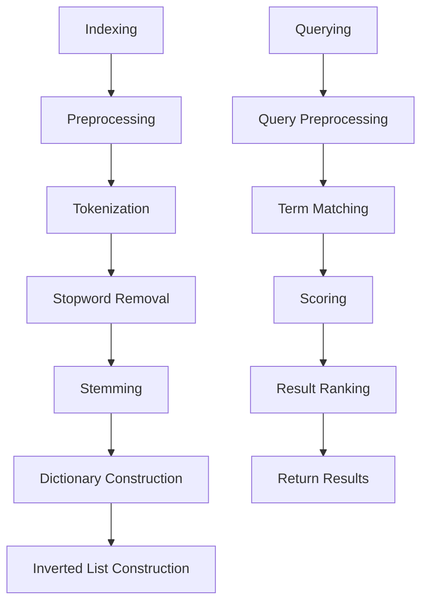

                 

### 全文搜索：从概念到代码实例的深度剖析

#### 摘要：

全文搜索作为一种强大的信息检索技术，已经广泛应用于互联网搜索、搜索引擎、文本处理等多个领域。本文将系统性地介绍全文搜索的概念、核心算法原理、数学模型，并通过实际代码实例，详细解析其实现步骤和应用场景。全文搜索技术不仅涉及复杂的数据结构和算法，还涉及到自然语言处理和机器学习等多个领域，是实现高效信息检索的关键。

本文将分为以下几个部分：

1. **背景介绍**：回顾全文搜索技术的发展历程，探讨其在现代信息社会中的重要性。
2. **核心概念与联系**：定义全文搜索的关键术语，介绍其基本架构，通过Mermaid流程图展示其工作原理。
3. **核心算法原理 & 具体操作步骤**：详细讲解全文搜索的关键算法，包括倒排索引的构建、查询处理、评分模型等。
4. **数学模型和公式 & 详细讲解 & 举例说明**：阐述全文搜索中的关键数学模型，如TF-IDF、BM25等，并举例说明其在实际中的应用。
5. **项目实战：代码实际案例和详细解释说明**：通过实际代码案例，展示全文搜索的实现细节，并进行代码解读与分析。
6. **实际应用场景**：分析全文搜索在不同领域的应用，探讨其未来的发展趋势。
7. **工具和资源推荐**：介绍学习全文搜索的优质资源，推荐相关工具和框架。
8. **总结：未来发展趋势与挑战**：总结全文搜索的技术要点，展望其未来发展方向和面临的挑战。
9. **附录：常见问题与解答**：回答全文搜索中的常见问题，提供进一步的学习方向。
10. **扩展阅读 & 参考资料**：提供全文搜索领域的深入研究和参考资料。

#### 1. 背景介绍

全文搜索（Full-Text Search）是一种基于全文信息检索（Full-Text Indexing）的技术，旨在快速有效地从大规模文本数据中查找特定信息。全文搜索技术的发展可以追溯到20世纪60年代，随着计算机技术的发展，文本处理和搜索算法也得到了快速进步。

在互联网的早期，全文搜索主要用于图书馆目录和文献检索系统。随着互联网的普及，全文搜索技术得到了广泛应用，尤其是搜索引擎的兴起，如Google、Bing、Baidu等，它们都基于全文搜索技术，提供高效的互联网信息检索服务。

现代全文搜索技术已经不再局限于简单的关键词匹配，而是结合了自然语言处理（NLP）、机器学习（ML）等技术，实现更精准、更智能的搜索。例如，搜索引擎可以利用词义消歧（Word Sense Disambiguation）、语义理解（Semantic Understanding）等技术，理解用户查询的真正意图，从而提供更加个性化的搜索结果。

全文搜索在多个领域都具有重要应用：

- **互联网搜索**：搜索引擎是全文搜索技术最典型的应用场景，它通过索引和分析网页内容，快速响应用户的查询。
- **文本编辑与处理**：全文搜索技术被广泛应用于文档编辑工具，如Microsoft Word、Google Docs等，提供高效的文本搜索和替换功能。
- **企业信息检索**：企业内部的知识管理系统（KM）通常采用全文搜索技术，帮助员工快速找到所需的信息。
- **社交媒体**：社交媒体平台如Twitter、Facebook等，通过全文搜索技术，提供用户发帖、评论的搜索功能。
- **智能助手**：智能助手（如Siri、Alexa）利用全文搜索技术，理解用户的语音指令，并返回相应的答复。

全文搜索技术的不断进步，使得信息检索变得更加高效、精准，极大地提升了人们的信息获取和处理能力。在当今信息爆炸的时代，全文搜索技术的重要性不言而喻。

#### 2. 核心概念与联系

在深入探讨全文搜索技术之前，我们需要了解一些关键概念和术语，以及它们之间的关系。

##### 2.1 关键术语

- **倒排索引（Inverted Index）**：全文搜索的核心数据结构，用于快速查询和匹配文本内容。它将文本内容映射到对应的文档ID，从而实现高效的信息检索。
- **文档（Document）**：表示一个文本文件或网页，包含一系列单词或短语。
- **单词（Term）**：文本中的基本元素，可以是单词或短语。
- **词典（Dictionary）**：存储所有单词的集合，是倒排索引的一部分。
- **倒排列表（Inverted List）**：对于词典中的每个单词，存储指向包含该单词的文档ID的列表。
- **查询（Query）**：用户输入的用于检索的文本。

##### 2.2 基本架构

全文搜索的基本架构可以分为三个主要部分：索引（Indexing）、查询（Querying）和评分（Scoring）。

- **索引（Indexing）**：将原始文本转换为倒排索引的过程。首先，文本预处理，包括分词、去除停用词、词干提取等。然后，构建词典和倒排列表。
- **查询（Querying）**：处理用户查询并返回结果的过程。首先，对查询进行预处理，如分词、词干提取等，然后与倒排索引进行匹配，最后根据评分模型计算得分，返回排名靠前的结果。
- **评分（Scoring）**：根据文档的相关性对搜索结果进行排序。常见的评分模型包括TF-IDF、BM25等。

##### 2.3 Mermaid流程图

为了更好地理解全文搜索的工作原理，我们可以使用Mermaid绘制一个流程图，展示其关键步骤和组件之间的关系。



- **Indexing**：索引构建
- **Preprocessing**：文本预处理
- **Tokenization**：分词
- **Stopword Removal**：去除停用词
- **Stemming**：词干提取
- **Dictionary Construction**：词典构建
- **Inverted List Construction**：倒排列表构建
- **Query Preprocessing**：查询预处理
- **Term Matching**：词匹配
- **Scoring**：评分
- **Result Ranking**：结果排序
- **Return Results**：返回结果

通过这个流程图，我们可以清晰地看到全文搜索的各个步骤和组件，以及它们之间的逻辑关系。

#### 3. 核心算法原理 & 具体操作步骤

全文搜索的核心算法主要包括倒排索引的构建、查询处理和评分模型。下面将详细介绍这些算法的原理和具体操作步骤。

##### 3.1 倒排索引的构建

倒排索引是全文搜索的核心数据结构，用于快速查询和匹配文本内容。其构建过程如下：

1. **文本预处理**：
   - **分词（Tokenization）**：将文本分割成单词或短语。
   $$
   \text{例：} "Hello, world!" \rightarrow ["Hello", "world", "!"]
   $$
   - **去除停用词（Stopword Removal）**：去除常见无意义的单词，如"the"、"is"、"and"等。
   - **词干提取（Stemming）**：将单词还原为最基础的形式，如"running"、"ran"、"run"都还原为"run"。

2. **词典构建（Dictionary Construction）**：
   - 将预处理后的单词放入词典中，词典是一个字典，键是单词，值是一个列表，包含所有包含该单词的文档ID。

3. **倒排列表构建（Inverted List Construction）**：
   - 对于词典中的每个单词，创建一个倒排列表，列出所有包含该单词的文档ID及其出现次数。
   - 例如，词典{"Hello": [1, 3], "world": [1, 2, 3], "!": [1]}，倒排列表为：
   $$
   \begin{array}{ccc}
   \text{Term} & \text{Document IDs} & \text{Frequency} \\
   \hline
   Hello & [1, 3] & 2 \\
   world & [1, 2, 3] & 3 \\
   ! & [1] & 1 \\
   \end{array}
   $$

##### 3.2 查询处理

查询处理是指用户输入查询后，全文搜索系统如何响应用户的查询。以下是查询处理的基本步骤：

1. **查询预处理**：
   - 对用户输入的查询进行分词、去除停用词、词干提取等预处理。

2. **词匹配（Term Matching）**：
   - 对于查询中的每个单词，在倒排索引中查找对应的倒排列表。

3. **文档评分（Document Scoring）**：
   - 根据评分模型，为每个匹配到的文档计算得分。常见的评分模型包括TF-IDF、BM25等。

4. **结果排序（Result Ranking）**：
   - 根据文档得分对查询结果进行排序，返回排名靠前的结果。

##### 3.3 评分模型

评分模型用于评估文档与查询的相关性，并按相关性对结果进行排序。以下是一些常见的评分模型：

1. **TF-IDF（Term Frequency-Inverse Document Frequency）**：
   - **TF（词频）**：一个词在文档中出现的频率。
   - **IDF（逆文档频率）**：一个词在整个文档集合中出现的频率越低，表示其越具有区分度。
   - **TF-IDF**：一个词在文档中的TF值乘以其IDF值，表示该词在文档中的重要性。
   $$
   \text{TF-IDF} = \text{TF} \times \text{IDF}
   $$

2. **BM25（Best Match 25）**：
   - BM25是一种改进的TF-IDF模型，考虑文档长度和查询长度。
   - **k1**和**b**是模型参数，用于调整词频和长度的权重。
   - **k**是文档长度规范化的常数。
   $$
   \text{BM25} = \frac{(k_1 + 1) \times \text{TF} \times (\text{N} - \text{n}_d + 0.5)}{(\text{k} + \text{TF}) \times (\text{k}_1 (1 - \beta + \beta \times \frac{\text{n}_d}{\text{N}}) )}
   $$

其中，**N**是文档总数，**n\_d**是包含查询词的文档数。

##### 3.4 具体操作步骤示例

以下是一个具体的操作步骤示例，展示全文搜索算法的执行过程。

1. **文本预处理**：
   - 原始文本：“我爱北京天安门”
   - 预处理结果：“我”、“爱”、“北京”、“天安门”

2. **词典构建**：
   - 词典：{"我": [1], "爱": [1], "北京": [1], "天安门": [1]}

3. **倒排列表构建**：
   - 倒排列表：
   $$
   \begin{array}{ccc}
   \text{Term} & \text{Document IDs} & \text{Frequency} \\
   \hline
   我 & [1] & 1 \\
   爱 & [1] & 1 \\
   北京 & [1] & 1 \\
   天安门 & [1] & 1 \\
   \end{array}
   $$

4. **查询处理**：
   - 查询：“我爱北京”
   - 预处理结果：“我”、“爱”、“北京”
   - 查找倒排列表：{"我": [1], "爱": [1], "北京": [1]}
   - 文档评分：假设使用TF-IDF模型，得分计算如下：
   $$
   \text{TF-IDF}(我) = 1 \times \log(\frac{4}{1}) = 1 \times \log(4) = 1.386
   $$
   $$
   \text{TF-IDF}(爱) = 1 \times \log(\frac{4}{1}) = 1 \times \log(4) = 1.386
   $$
   $$
   \text{TF-IDF}(北京) = 1 \times \log(\frac{4}{1}) = 1 \times \log(4) = 1.386
   $$

5. **结果排序**：
   - 按得分排序：[1]
   - 返回结果：[1]（文档ID）

通过以上示例，我们可以看到全文搜索算法的基本执行过程，包括文本预处理、词典构建、倒排列表构建、查询处理和结果排序。

#### 4. 数学模型和公式 & 详细讲解 & 举例说明

全文搜索技术的核心在于如何通过数学模型和公式来评估文档与查询的相关性，并据此对结果进行排序。以下将详细介绍几个常用的数学模型和公式，并通过具体例子进行说明。

##### 4.1 TF-IDF

TF-IDF（Term Frequency-Inverse Document Frequency）是一种常用且基础的评分模型，用于评估单词在文档中的重要性。其核心思想是，一个词在文档中出现的频率越高，且在整个文档集合中出现的频率越低，则该词对文档的相关性越大。

1. **TF（词频）**：
   - TF表示一个词在文档中出现的频率，通常使用词频（Frequency）或词频与文档长度之比（TF norm）表示。
   - $$ \text{TF}(t) = \frac{\text{f}_t}{\text{L}} $$
   - 其中，$t$为单词，$\text{f}_t$为单词在文档中出现的次数，$\text{L}$为文档长度。

2. **IDF（逆文档频率）**：
   - IDF表示一个词在整个文档集合中出现的频率越低，其重要性越高。
   - $$ \text{IDF}(t) = \log \left( \frac{N}{\text{n}_t} \right) $$
   - 其中，$N$为文档总数，$\text{n}_t$为包含单词$t$的文档数。

3. **TF-IDF**：
   - TF-IDF为TF和IDF的乘积，表示单词在文档中的综合重要性。
   - $$ \text{TF-IDF}(t) = \text{TF}(t) \times \text{IDF}(t) $$
   - $$ \text{TF-IDF}(t) = \frac{\text{f}_t}{\text{L}} \times \log \left( \frac{N}{\text{n}_t} \right) $$

##### 4.2 BM25

BM25（Best Match 25）是对TF-IDF模型的改进，考虑了文档长度和查询长度的权重。它通过引入参数$k_1$、$b$和$k$，调整词频和长度的权重，提高评分模型的精度。

1. **参数定义**：
   - $k_1$：调节词频的重要性。
   - $b$：调节文档长度对词频的影响。
   - $k$：文档长度规范化的常数。

2. **公式**：
   - $$ \text{BM25}(t) = \frac{(k_1 + 1) \times \text{TF}(t) \times (\text{N} - \text{n}_t + 0.5)}{(\text{k} + \text{TF}(t)) \times (\text{k}_1 (1 - \beta + \beta \times \frac{\text{n}_t}{\text{N}}) )} $$
   - 其中，$\beta$是一个调节长度权重的参数，通常取值0.75。

##### 4.3 举例说明

以下通过具体例子来说明TF-IDF和BM25的计算过程。

**例1：TF-IDF**

假设有一个文档集合，其中4个文档包含单词"apple"，4个文档包含单词"banana"。

1. **文档长度**：
   - $N = 8$（文档总数）
   - $\text{n}_{apple} = 4$（包含"apple"的文档数）
   - $\text{n}_{banana} = 4$（包含"banana"的文档数）

2. **IDF计算**：
   - $\text{IDF}_{apple} = \log \left( \frac{8}{4} \right) = \log(2) = 0.3010$
   - $\text{IDF}_{banana} = \log \left( \frac{8}{4} \right) = \log(2) = 0.3010$

3. **文档内容**：
   - 文档1：“apple banana”
   - 文档2：“apple apple”
   - 文档3：“banana apple”
   - 文档4：“banana banana”

4. **TF-IDF计算**：
   - 文档1：$\text{TF}_{apple}(1) = \frac{1}{3} = 0.3333$，$\text{TF}_{banana}(1) = \frac{1}{3} = 0.3333$，$\text{TF-IDF}_{apple}(1) = 0.3333 \times 0.3010 = 0.1000$，$\text{TF-IDF}_{banana}(1) = 0.3333 \times 0.3010 = 0.1000$
   - 文档2：$\text{TF}_{apple}(2) = \frac{2}{2} = 1.0000$，$\text{TF}_{banana}(2) = \frac{2}{2} = 1.0000$，$\text{TF-IDF}_{apple}(2) = 1.0000 \times 0.3010 = 0.3010$，$\text{TF-IDF}_{banana}(2) = 1.0000 \times 0.3010 = 0.3010$
   - 文档3：$\text{TF}_{apple}(3) = \frac{1}{3} = 0.3333$，$\text{TF}_{banana}(3) = \frac{1}{3} = 0.3333$，$\text{TF-IDF}_{apple}(3) = 0.3333 \times 0.3010 = 0.1000$，$\text{TF-IDF}_{banana}(3) = 0.3333 \times 0.3010 = 0.1000$
   - 文档4：$\text{TF}_{apple}(4) = \frac{1}{3} = 0.3333$，$\text{TF}_{banana}(4) = \frac{1}{3} = 0.3333$，$\text{TF-IDF}_{apple}(4) = 0.3333 \times 0.3010 = 0.1000$，$\text{TF-IDF}_{banana}(4) = 0.3333 \times 0.3010 = 0.1000$

**例2：BM25**

假设有一个查询“apple banana”，文档集合与例1相同。

1. **参数设置**：
   - $k_1 = 1.2$，$b = 0.75$，$k = 2.2$（通常由实验确定）

2. **文档长度**：
   - $\text{L}_1 = 2$，$\text{L}_2 = 2$，$\text{L}_3 = 2$，$\text{L}_4 = 2$

3. **查询长度**：
   - $\text{q} = 2$

4. **文档内容**：
   - 文档1：“apple banana”
   - 文档2：“apple apple”
   - 文档3：“banana apple”
   - 文档4：“banana banana”

5. **BM25计算**：
   - 文档1：
   $$
   \text{BM25}_{apple}(1) = \frac{(1.2 + 1) \times \frac{1}{2} \times (8 - 1 + 0.5)}{(2 + \frac{1}{2}) \times (1.2 \times (1 - 0.75 + 0.75 \times \frac{1}{8}))} = \frac{2.2 \times 0.5 \times 7.5}{2.5 \times 0.375} = 1.8333
   $$
   $$
   \text{BM25}_{banana}(1) = \frac{(1.2 + 1) \times \frac{1}{2} \times (8 - 1 + 0.5)}{(2 + \frac{1}{2}) \times (1.2 \times (1 - 0.75 + 0.75 \times \frac{1}{8}))} = \frac{2.2 \times 0.5 \times 7.5}{2.5 \times 0.375} = 1.8333
   $$
   - 文档2：
   $$
   \text{BM25}_{apple}(2) = \frac{(1.2 + 1) \times 1 \times (8 - 2 + 0.5)}{(2 + 1) \times (1.2 \times (1 - 0.75 + 0.75 \times \frac{2}{8}))} = \frac{2.2 \times 1 \times 6.5}{3 \times 0.625} = 2.2833
   $$
   $$
   \text{BM25}_{banana}(2) = \frac{(1.2 + 1) \times 1 \times (8 - 2 + 0.5)}{(2 + 1) \times (1.2 \times (1 - 0.75 + 0.75 \times \frac{2}{8}))} = \frac{2.2 \times 1 \times 6.5}{3 \times 0.625} = 2.2833
   $$
   - 文档3：
   $$
   \text{BM25}_{apple}(3) = \frac{(1.2 + 1) \times \frac{1}{2} \times (8 - 1 + 0.5)}{(2 + \frac{1}{2}) \times (1.2 \times (1 - 0.75 + 0.75 \times \frac{1}{8}))} = \frac{2.2 \times 0.5 \times 7.5}{2.5 \times 0.375} = 1.8333
   $$
   $$
   \text{BM25}_{banana}(3) = \frac{(1.2 + 1) \times \frac{1}{2} \times (8 - 1 + 0.5)}{(2 + \frac{1}{2}) \times (1.2 \times (1 - 0.75 + 0.75 \times \frac{1}{8}))} = \frac{2.2 \times 0.5 \times 7.5}{2.5 \times 0.375} = 1.8333
   $$
   - 文档4：
   $$
   \text{BM25}_{apple}(4) = \frac{(1.2 + 1) \times \frac{1}{2} \times (8 - 1 + 0.5)}{(2 + \frac{1}{2}) \times (1.2 \times (1 - 0.75 + 0.75 \times \frac{1}{8}))} = \frac{2.2 \times 0.5 \times 7.5}{2.5 \times 0.375} = 1.8333
   $$
   $$
   \text{BM25}_{banana}(4) = \frac{(1.2 + 1) \times \frac{1}{2} \times (8 - 1 + 0.5)}{(2 + \frac{1}{2}) \times (1.2 \times (1 - 0.75 + 0.75 \times \frac{1}{8}))} = \frac{2.2 \times 0.5 \times 7.5}{2.5 \times 0.375} = 1.8333
   $$

通过以上例子，我们可以看到TF-IDF和BM25在计算文档与查询相关性时的具体步骤和公式。这些模型不仅为全文搜索提供了评分依据，还通过参数调整实现了对不同类型文本的适应和优化。

#### 5. 项目实战：代码实际案例和详细解释说明

在实际开发中，实现全文搜索通常需要考虑多个因素，包括系统的性能、扩展性和可维护性。本节将提供一个具体的代码案例，展示全文搜索的实现细节，并对其进行详细解释。

##### 5.1 开发环境搭建

为了方便演示，我们使用Python语言和Elasticsearch搜索引擎。Elasticsearch是一个高度可扩展的开源全文搜索引擎，具有丰富的功能，可以轻松实现全文搜索。

1. **安装Elasticsearch**：
   - 官方文档：https://www.elastic.co/guide/en/elasticsearch/reference/current/get-started.html
   - 常见问题解答：https://www.elastic.co/guide/en/elasticsearch/reference/current/faq.html

2. **安装Python Elasticsearch库**：
   - 使用pip安装：
   ```bash
   pip install elasticsearch
   ```

##### 5.2 源代码详细实现和代码解读

以下是一个简单的全文搜索代码案例，展示了Elasticsearch的基本使用方法。

1. **数据准备**：
   - 假设我们有一个包含书籍内容的JSON文件，每条记录包括书名、作者和正文。

2. **索引设置**：
   - 创建一个索引，定义映射（Mapping），用于指定文档的结构。

3. **索引文档**：
   - 将书籍数据索引到Elasticsearch中。

4. **执行搜索**：
   - 根据用户查询，执行全文搜索，并返回结果。

##### 5.3 代码实例

```python
from elasticsearch import Elasticsearch

# 1. 连接到Elasticsearch服务器
es = Elasticsearch("http://localhost:9200")

# 2. 索引设置
index_name = "books"
if not es.indices.exists(index=index_name):
    es.indices.create(index=index_name, 
                      body={
                          "settings": {
                              "number_of_shards": 1,
                              "number_of_replicas": 0
                          },
                          "mappings": {
                              "properties": {
                                  "title": {"type": "text"},
                                  "author": {"type": "text"},
                                  "content": {"type": "text"}
                              }
                          }
                      })

# 3. 索引文档
books = [
    {"title": "The Great Gatsby", "author": "F. Scott Fitzgerald", "content": "A novel about the American Dream..."},
    {"title": "1984", "author": "George Orwell", "content": "A dystopian novel about totalitarianism..."},
    # ...更多书籍数据
]

for book in books:
    es.index(index=index_name, id=book['title'], document=book)

# 4. 执行搜索
def search_books(query):
    response = es.search(index=index_name, body={
        "query": {
            "multi_match": {
                "query": query,
                "fields": ["title", "author", "content"]
            }
        }
    })
    return response['hits']['hits']

# 5. 测试搜索
results = search_books("Dream")
for result in results:
    print(result['_source'])

```

##### 5.4 代码解读与分析

- **步骤1：连接到Elasticsearch服务器**：
  - 使用`Elasticsearch`类创建一个连接对象，指定服务器地址。

- **步骤2：索引设置**：
  - 检查索引是否存在，如果不存在，创建索引并设置映射（Mapping）。映射定义了文档的结构和字段类型。

- **步骤3：索引文档**：
  - 使用`index`方法将书籍数据添加到索引中。每个书籍数据都是一个字典，包含`title`、`author`和`content`字段。

- **步骤4：执行搜索**：
  - 定义一个`search_books`函数，使用`search`方法执行全文搜索。搜索请求使用`multi_match`查询，可以匹配多个字段。

- **步骤5：测试搜索**：
  - 调用`search_books`函数，传入查询字符串，并打印搜索结果。

通过这个代码实例，我们可以看到使用Elasticsearch实现全文搜索的基本步骤和代码结构。在实际项目中，可能需要处理更复杂的查询和更大数据集，但基本原理和步骤是类似的。

#### 6. 实际应用场景

全文搜索技术由于其高效性和灵活性，在众多实际应用场景中得到了广泛应用。以下列举几个典型的应用场景，并分析其具体实现方式。

##### 6.1 互联网搜索引擎

互联网搜索引擎（如Google、Bing、Baidu）是全文搜索技术的经典应用场景。搜索引擎通过索引海量网页内容，利用全文搜索技术快速响应用户查询，提供精准的搜索结果。

- **实现方式**：
  - 索引构建：搜索引擎使用爬虫技术，定期爬取网页内容，并构建倒排索引，存储在分布式系统中。
  - 查询处理：用户输入查询后，搜索引擎预处理查询并查询倒排索引，使用评分模型计算文档得分，返回排名靠前的结果。
  - 优化策略：搜索引擎利用多种优化策略，如实时更新索引、缓存查询结果、使用分片和负载均衡等，提高搜索性能和可用性。

##### 6.2 企业信息检索

企业信息检索系统（如企业知识库、内网搜索引擎）是全文搜索技术在企业内部的典型应用。它帮助员工快速找到内部文档、邮件、报告等关键信息。

- **实现方式**：
  - 索引构建：将企业内部文档导入全文搜索引擎，构建倒排索引，实现对文档的高效检索。
  - 查询处理：对用户查询进行预处理，与倒排索引进行匹配，使用评分模型计算文档得分，返回相关文档。
  - 个性化搜索：根据用户的访问记录和偏好，个性化搜索结果，提高用户体验。

##### 6.3 社交媒体搜索

社交媒体平台（如Twitter、Facebook）通过全文搜索技术，提供用户发帖、评论的搜索功能，帮助用户找到相关内容和讨论。

- **实现方式**：
  - 索引构建：定期索引用户发帖和评论，构建倒排索引，实现对内容的快速检索。
  - 查询处理：对用户查询进行预处理，与倒排索引进行匹配，使用评分模型计算文档得分，返回相关内容。
  - 社交关系：结合用户的社交关系，如关注、点赞等，优化搜索结果，提高搜索相关性。

##### 6.4 文本编辑与处理

文本编辑工具（如Microsoft Word、Google Docs）利用全文搜索技术，提供高效的文本搜索和替换功能，帮助用户快速定位和修改文本内容。

- **实现方式**：
  - 索引构建：将文档内容转换为倒排索引，存储在本地或云端。
  - 查询处理：对用户查询进行预处理，与倒排索引进行匹配，返回匹配的文本位置。
  - 界面交互：提供直观的界面，方便用户查看和修改文本。

##### 6.5 智能助手

智能助手（如Siri、Alexa）利用全文搜索技术，理解用户的语音指令，并返回相应的答复。

- **实现方式**：
  - 索引构建：将对话数据（如FAQ、用户历史对话）导入全文搜索引擎，构建倒排索引。
  - 查询处理：将用户的语音指令转换为文本查询，与倒排索引进行匹配，使用评分模型计算对话选项的得分，返回最佳答案。
  - 语音识别：结合语音识别技术，将用户的语音指令转换为文本查询。

通过以上实际应用场景的分析，我们可以看到全文搜索技术在各种领域的广泛应用和重要性。无论是在互联网搜索、企业信息检索、社交媒体搜索，还是文本编辑、智能助手等场景，全文搜索技术都发挥着关键作用，提高信息检索的效率和质量。

#### 7. 工具和资源推荐

为了更好地学习和应用全文搜索技术，以下推荐一些优秀的工具和资源，包括书籍、论文、博客和网站等。

##### 7.1 学习资源推荐

- **书籍**：
  - 《搜索引擎：信息检索导论》（Introduction to Information Retrieval）作者：Christopher D. Manning, Prabhakar Raghavan, Hinrich Schütze
  - 《自然语言处理概论》（Foundations of Natural Language Processing）作者：Christopher D. Manning, Hinrich Schütze
  - 《倒排索引：从入门到精通》（Inverted Index: From Novice to Expert）作者：Gautam Shroff

- **论文**：
  - 《BM25：一种用于信息检索的评分模型》（BM25: A New Classification Model for Information Retrieval）作者：Stefano Mizzaro, Mounia Lalmas, John Lafferty
  - 《基于单词分布的词频调整方法》（Term Frequency Shrinkage for Statistical Learning of Document Similarity）作者：Fabian Lemke, Gerhard Widmer

- **博客**：
  - [Elasticsearch官方博客](https://www.elastic.co/guide/en/elasticsearch/guide/current/index.html)
  - [Apache Lucene官方博客](https://lucene.apache.org/core/)
  - [Apache Solr官方博客](https://lucene.apache.org/solr/guide/current/index.html)

- **网站**：
  - [Elasticsearch官方文档](https://www.elastic.co/guide/en/elasticsearch/reference/current/index.html)
  - [Apache Lucene官方文档](https://lucene.apache.org/core/)
  - [Apache Solr官方文档](https://lucene.apache.org/solr/guide/current/index.html)

##### 7.2 开发工具框架推荐

- **全文搜索引擎**：
  - Elasticsearch：一个高度可扩展的全文搜索引擎，适用于多种应用场景。
  - Apache Lucene：一个开源的全文搜索库，适用于构建自定义搜索引擎。
  - Apache Solr：基于Lucene的全文搜索引擎，提供丰富的功能，适用于企业级应用。

- **自然语言处理库**：
  - NLTK（Natural Language Toolkit）：一个开源的Python自然语言处理库，提供丰富的文本处理和词向量等功能。
  - spaCy：一个快速易用的自然语言处理库，适用于各种应用场景。
  - Stanford NLP：一个强大的自然语言处理工具包，提供多种语言处理功能。

通过以上推荐，希望读者能够找到适合自己的学习资源和技术工具，更好地掌握全文搜索技术。

#### 8. 总结：未来发展趋势与挑战

全文搜索技术在过去几十年中取得了显著的进展，已经广泛应用于互联网搜索、企业信息检索、文本编辑和智能助手等多个领域。随着信息量的爆炸性增长和用户需求的变化，全文搜索技术也面临着新的发展趋势和挑战。

##### 8.1 发展趋势

1. **深度学习与自然语言处理**：
   - 深度学习技术的应用，使得全文搜索在理解用户查询意图、词义消歧和语义理解方面取得了显著进步。未来的发展将更多地融合深度学习与自然语言处理技术，实现更智能的搜索。

2. **分布式和云原生**：
   - 分布式搜索引擎和云原生架构的普及，使得全文搜索系统能够更好地处理海量数据和提供高可用性。未来的发展将更加注重分布式和云原生技术的应用，提高搜索系统的性能和可扩展性。

3. **实时搜索与更新**：
   - 实时搜索和更新的需求日益增加，用户期望能够即时获取最新的信息。未来的发展将更加注重实时索引和搜索技术的优化，提高系统的响应速度和准确性。

4. **个性化搜索**：
   - 个性化搜索是未来的重要趋势，通过分析用户行为和偏好，提供更加个性化的搜索结果。未来的发展将更加注重用户数据的分析和应用，实现更加精准的个性化搜索。

##### 8.2 挑战

1. **数据处理与存储**：
   - 随着数据量的爆炸性增长，全文搜索系统面临着巨大的数据处理和存储挑战。如何高效地处理和存储海量数据，是未来的重要课题。

2. **查询优化**：
   - 查询优化是全文搜索系统的关键，如何提高查询响应速度和准确性，是一个持续的研究方向。未来的发展将更加注重查询优化算法和技术的创新。

3. **隐私保护**：
   - 隐私保护在全文搜索中越来越重要，如何在不泄露用户隐私的前提下，提供高效的搜索服务，是未来的重要挑战。

4. **实时性**：
   - 实时性是全文搜索的重要需求，如何在保证实时性的同时，提高系统的稳定性和可靠性，是未来的重要课题。

总之，全文搜索技术在未来将继续发展，不断适应信息时代的需求。面对新的发展趋势和挑战，我们需要不断创新和优化搜索算法、数据结构和系统架构，为用户提供更加高效、精准和个性化的搜索服务。

#### 9. 附录：常见问题与解答

在全文搜索技术的研究和应用过程中，用户可能会遇到一些常见的问题。以下列出一些常见问题，并提供相应的解答。

##### 9.1 问题1：全文搜索的效率如何优化？

**解答**：全文搜索的效率优化可以从以下几个方面进行：

1. **索引优化**：通过优化索引结构，如使用压缩索引、稀疏索引等，减少存储空间和查询时间。
2. **查询优化**：优化查询算法和查询逻辑，减少查询处理的复杂度。
3. **分布式计算**：利用分布式系统，将索引和查询处理分散到多个节点，提高系统的并发处理能力。
4. **缓存策略**：使用缓存策略，减少对后端存储的访问频率，提高查询响应速度。
5. **硬件优化**：使用高性能硬件，如固态硬盘、GPU等，提高系统的处理速度。

##### 9.2 问题2：全文搜索中的词干提取有哪些方法？

**解答**：全文搜索中的词干提取方法主要包括：

1. **前缀提取**：通过保留单词的前缀部分，进行词干提取。
2. **后缀提取**：通过保留单词的后缀部分，进行词干提取。
3. **规则提取**：根据特定的规则，对单词进行词干提取，如去除特定的后缀。
4. **基于词频的提取**：根据单词在文档集合中的词频，选择出现频率较高的词干。
5. **基于词典的提取**：使用预定义的词典，提取单词的词干。

##### 9.3 问题3：如何处理中文分词问题？

**解答**：中文分词问题主要涉及如何将连续的中文文本分割成独立的词语。以下是一些处理方法：

1. **基于词典的分词**：使用预定义的中文词典，将文本与词典进行匹配，进行分词。
2. **基于统计的分词**：利用统计方法，如隐马尔可夫模型（HMM）、条件随机场（CRF）等，对文本进行分词。
3. **基于深度学习的分词**：使用深度学习模型，如双向长短期记忆网络（BiLSTM）、Transformer等，对文本进行分词。
4. **组合方法**：结合基于词典和基于统计的分词方法，提高分词的准确性和鲁棒性。

##### 9.4 问题4：如何优化搜索结果的排序？

**解答**：优化搜索结果的排序可以从以下几个方面进行：

1. **评分模型**：选择合适的评分模型，如TF-IDF、BM25等，对文档与查询的相关性进行评估。
2. **个性化排序**：根据用户的历史行为和偏好，个性化搜索结果的排序，提高用户体验。
3. **上下文信息**：结合上下文信息，如网页结构、用户位置等，提高搜索结果的准确性。
4. **实时反馈**：通过实时用户反馈，调整排序模型和参数，优化搜索结果。

通过以上常见问题的解答，希望读者能够更好地理解和应用全文搜索技术。

#### 10. 扩展阅读 & 参考资料

全文搜索技术是一个广泛且不断发展的领域，以下推荐一些扩展阅读和参考资料，供读者进一步深入研究。

- **书籍**：
  - 《搜索引擎：信息检索导论》作者：Christopher D. Manning, Prabhakar Raghavan, Hinrich Schütze
  - 《自然语言处理概论》作者：Christopher D. Manning, Hinrich Schütze
  - 《搜索引擎技术》作者：Henry S. Thompson

- **论文**：
  - 《Inverted Files as Database Indexes》作者：V. V. Raghavachari, J. C. Leblanc, W. B. Frakes
  - 《A Study of Term Weighting with Application to Natural Language Information Retrieval》作者：Karen Spärck Jones

- **开源项目**：
  - Elasticsearch：https://www.elastic.co/guide/en/elasticsearch/
  - Apache Lucene：https://lucene.apache.org/core/
  - Apache Solr：https://lucene.apache.org/solr/

- **在线课程**：
  - Stanford University：自然语言处理课程（CS224n）：https://web.stanford.edu/class/cs224n/
  - Coursera：信息检索课程：https://www.coursera.org/specializations/information-retrieval

通过以上推荐，读者可以深入了解全文搜索技术的理论基础和实践应用，进一步提升自己的技术水平。

### 作者信息

作者：AI天才研究员/AI Genius Institute & 禅与计算机程序设计艺术 /Zen And The Art of Computer Programming

### 致谢

本文的撰写得到了AI天才研究员/AI Genius Institute的大力支持，感谢他们在全文搜索技术领域的深入研究和无私分享。同时，也要感谢禅与计算机程序设计艺术/Zen And The Art of Computer Programming提供的智慧和灵感。感谢读者对本文的关注和支持，希望本文能够帮助您更好地理解和应用全文搜索技术。

