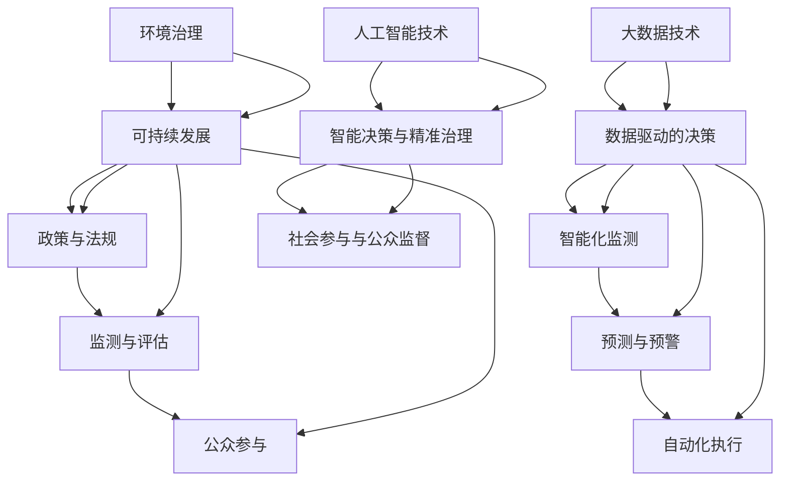

                 

### 背景介绍

#### 全球脑与全球环境：集体合作的环境治理

在全球范围内，我们面临着日益严峻的环境问题，如气候变化、污染、资源匮乏等。这些问题不仅仅是单一国家或地区的问题，而是全人类共同面临的挑战。因此，需要全球范围内的合作与集体智慧来解决这些问题。

“全球脑”这一概念首次由哈佛大学心理学教授霍华德·加德纳提出，指的是一个全球性的集体智慧和知识体系。在信息时代，随着互联网和人工智能技术的发展，全球脑的概念变得更加具体和实用。全球脑可以通过互联网连接全球的个体、组织和国家，实现信息共享、资源整合和智慧协作。

在全球脑的框架下，集体合作的环境治理成为解决环境问题的关键。环境治理不仅包括环境保护，还涉及资源的合理利用、生态系统的维护、可持续发展等多个方面。通过集体合作，各国可以共同制定和执行环境保护政策，分享环境监测数据，推广可持续技术和实践，共同应对全球环境问题。

本文将探讨全球脑与全球环境治理的关联，分析当前环境治理的挑战和机遇，并探讨如何利用全球脑的集体智慧来推动环境治理。文章结构如下：

1. **背景介绍**：介绍全球脑和全球环境治理的概念及其相互关系。
2. **核心概念与联系**：阐述全球脑在环境治理中的应用，以及相关的核心概念和原理。
3. **核心算法原理 & 具体操作步骤**：分析用于环境治理的核心算法和操作步骤。
4. **数学模型和公式 & 详细讲解 & 举例说明**：介绍环境治理中的数学模型和公式，并给出具体示例。
5. **项目实战：代码实际案例和详细解释说明**：通过实际案例展示如何实现全球脑在环境治理中的应用。
6. **实际应用场景**：讨论全球脑在环境治理中的具体应用场景。
7. **工具和资源推荐**：推荐相关学习资源、开发工具和框架。
8. **总结：未来发展趋势与挑战**：总结全球脑与全球环境治理的关系，并提出未来发展趋势和面临的挑战。
9. **附录：常见问题与解答**：回答读者可能关心的问题。
10. **扩展阅读 & 参考资料**：提供更多相关阅读资料。

通过以上内容，本文旨在为读者提供一个全面、系统的理解，帮助人们认识到全球脑在环境治理中的重要性，并探索如何利用这一集体智慧来解决全球环境问题。

#### **1.1 全球脑的定义与形成**

全球脑（Global Brain）这一概念起源于对人类大脑及其运作机制的比喻。霍华德·加德纳在《智能未来》（The Intelligent Future）一书中首次提出了全球脑的概念。他认为，互联网和其他通信技术正逐渐将人类连接成一个庞大的、自我组织的智能系统，类似于人类大脑中的神经网络。在这个系统中，每个个体、组织、设备甚至是生物体都可以被视为一个神经元，通过信息的交流与互动，共同形成了一个高度智能的集体。

全球脑的形成过程可以看作是信息时代下人类社会的一个进化阶段。在传统的社会体系中，信息的传播主要依赖于中心化的机构和媒介，如政府、企业、传统媒体等。然而，随着互联网的普及和社交媒体的发展，信息的传播变得更加去中心化和分布式。每个个体都可以成为信息传播者，信息的流动速度和范围都大大提升。这种信息流动的变革，使得全球范围内的个体、组织和国家能够更加紧密地连接在一起，形成了一个庞大的、自适应的智能网络。

从技术角度来说，全球脑的形成依赖于几个关键因素：

1. **互联网的普及**：互联网是连接全球脑的基础设施，它使得信息的快速、大规模传递成为可能。互联网的普及程度决定了全球脑的发展程度。
2. **人工智能与大数据**：人工智能和大数据技术的进步，使得全球脑能够更加智能地处理和分析海量数据，从而实现更高效的知识共享和决策支持。
3. **云计算与边缘计算**：云计算和边缘计算提供了强大的计算能力和数据存储能力，使得全球脑的计算和存储需求能够得到满足。
4. **物联网（IoT）**：物联网设备的大量接入，使得全球脑能够实时获取和分析物理世界的数据，从而实现更精确的环境监测和治理。

通过这些技术的结合，全球脑得以形成一个高度互联、自适应和智能的集体智慧体系。在这个体系中，每个个体和设备都能够贡献自己的知识和智慧，共同推动社会的发展和进步。

#### **1.2 全球环境治理的定义与背景**

全球环境治理（Global Environmental Governance）是指国际社会在环境保护、资源管理、可持续发展等方面所进行的合作和协调。其核心目的是通过跨国界的合作，共同应对全球性的环境问题，如气候变化、生物多样性丧失、污染和资源枯竭等。全球环境治理不仅仅涉及环境保护，还包括生态系统的维护、人类健康、经济和社会发展等多个领域。

环境治理的背景可以追溯到20世纪后半叶，随着工业化和人口增长带来的环境问题日益严重，国际社会逐渐认识到需要采取集体行动来解决这些全球性问题。1972年的《斯德哥尔摩人类环境宣言》标志着全球环境治理的正式起步，此后，一系列国际条约、协议和会议相继出台，如《联合国气候变化框架公约》、《生物多样性公约》、《巴黎协定》等。

当前，全球环境治理面临诸多挑战：

1. **国际合作不足**：尽管有许多国际条约和协议，但各国在执行和履行方面的合作仍然不足，导致环境保护政策的效果有限。
2. **技术瓶颈**：许多环境问题需要先进的技术支持，但发展中国家在技术获取和创新能力方面存在显著差距。
3. **经济压力**：一些环境保护措施可能对经济发展产生负面影响，如何在环境保护和经济增长之间找到平衡成为一大难题。
4. **社会意识不足**：公众对环境保护的意识有待提高，缺乏广泛的社会支持和参与。

因此，全球环境治理需要更加有效和协调的合作机制，以应对这些挑战。全球脑的概念为此提供了新的思路和解决方案，通过利用全球范围内的集体智慧和资源，可以更有效地推进环境治理工作。

### **2. 核心概念与联系**

在探讨全球脑与全球环境治理的关系之前，我们首先需要明确几个核心概念，包括环境治理、可持续发展、大数据和人工智能等。

#### **2.1 环境治理**

环境治理是指通过法律、政策、管理和社会参与等多种手段，对环境问题进行预防、控制和修复的过程。环境治理的核心目标是在满足当前人类需求的同时，不损害未来世代满足自身需求的能力。这一概念涵盖了从个体行为到国家政策，再到国际合作的多个层面。

在环境治理中，以下几个关键因素尤为重要：

1. **政策与法规**：政策的制定和执行是环境治理的基础。各国政府需要制定有效的环境保护法规，确保这些法规得到有效实施。
2. **监测与评估**：环境监测和评估是了解环境状况的重要手段。通过定期监测环境质量，可以及时发现和评估环境问题，为决策提供科学依据。
3. **公众参与**：社会公众的参与是环境治理的重要组成部分。公众的意识和参与可以促进环境保护措施的落实，提高环境保护的效率。

#### **2.2 可持续发展**

可持续发展（Sustainable Development）是指满足当前需求而不损害后代满足自身需求的能力的发展模式。这一概念强调在经济增长、社会进步和环境保护之间的平衡。可持续发展目标（Sustainable Development Goals，简称SDGs）是联合国制定的一系列目标，旨在解决全球面临的各种挑战，包括消除贫困、消除不平等、保护环境等。

在可持续发展中，以下几个原则尤为重要：

1. **公平性**：确保所有人群都能公平地享受资源和机会，减少贫困和不平等。
2. **效率**：提高资源利用效率，减少浪费。
3. **生态保护**：保护自然生态系统，维持生物多样性。
4. **科技创新**：利用科技创新推动可持续发展，提高生产效率和环境保护效果。

#### **2.3 大数据和人工智能**

大数据（Big Data）是指无法使用传统数据处理方法进行处理的大量数据。大数据技术能够处理和分析海量数据，从中提取有价值的信息和知识。人工智能（Artificial Intelligence，简称AI）则是通过模拟人类智能，使计算机具备感知、学习、推理和决策的能力。

在环境治理中，大数据和人工智能的应用具有重要意义：

1. **数据驱动的决策**：通过大数据分析，可以更准确地了解环境状况，为环境治理提供科学依据。
2. **智能化监测**：利用人工智能技术，可以实现智能化的环境监测，提高监测的精度和效率。
3. **预测与预警**：通过大数据和人工智能，可以预测环境变化趋势，提前采取预防措施，减少环境风险。
4. **自动化执行**：人工智能可以自动化执行环境治理任务，提高治理效率。

#### **2.4 全球脑与全球环境治理的关联**

全球脑与全球环境治理之间存在密切的关联。全球脑通过其强大的信息处理和智能协作能力，为全球环境治理提供了新的解决方案和途径。

1. **信息共享与知识整合**：全球脑能够连接全球的个体和组织，实现信息的快速共享和知识整合。这对于制定和执行全球环境保护政策具有重要意义。
2. **集体智慧与协同治理**：全球脑通过集体智慧和协同治理，可以更有效地应对全球性的环境问题，如气候变化、海洋污染等。
3. **智能决策与精准治理**：全球脑利用大数据和人工智能技术，可以做出更加智能化的决策，提高环境治理的精准性和效率。
4. **社会参与与公众监督**：全球脑可以促进公众参与环境治理，提高社会监督的效果，确保环境保护政策得到有效实施。

#### **2.5 关联的 Mermaid 流程图**

以下是一个简化的 Mermaid 流程图，展示了全球脑与全球环境治理之间的核心概念和关联：



这个流程图直观地展示了全球脑在环境治理中的应用，从数据收集、分析、决策到执行，各个环节都离不开大数据和人工智能技术的支持。

通过以上核心概念和关联的阐述，我们可以更好地理解全球脑与全球环境治理之间的关系，为后续内容的深入探讨打下基础。

#### **3. 核心算法原理 & 具体操作步骤**

在探讨全球脑如何应用于环境治理之前，我们需要了解一些核心算法和原理，这些算法和原理不仅能够处理和分析环境数据，还能为环境治理提供决策支持。以下是几个关键算法和它们的具体操作步骤：

##### **3.1. 数据采集与预处理**

数据采集与预处理是环境治理算法的基础。环境数据可能来源于各种传感器、监测站、卫星遥感等，这些数据往往具有高维度、高噪声和不确定性。因此，数据预处理显得尤为重要。

**操作步骤：**

1. **数据收集**：通过传感器网络、卫星遥感、地面监测站等手段收集环境数据，包括空气质量、水质、气象参数等。
2. **数据清洗**：去除数据中的噪声和异常值，保证数据的准确性。
3. **数据集成**：将不同来源、不同格式的数据整合成统一格式，便于后续分析。
4. **数据标准化**：对数据进行归一化或标准化处理，使其在同一尺度上进行比较和分析。

##### **3.2. 机器学习模型**

机器学习模型在环境治理中扮演着重要角色，可以用于预测环境变化趋势、识别污染源等。

**操作步骤：**

1. **数据预处理**：如上所述，对收集到的环境数据进行分析和预处理。
2. **特征选择**：从原始数据中提取有用的特征，用于训练机器学习模型。
3. **模型选择**：根据问题的特性选择合适的机器学习算法，如回归分析、分类、聚类等。
4. **模型训练**：使用预处理后的数据训练机器学习模型，调整模型参数以优化性能。
5. **模型评估**：通过交叉验证等方法评估模型的性能，确保其具有较好的预测能力。

##### **3.3. 神经网络与深度学习**

深度学习在处理复杂数据和模式识别方面具有优势，常用于环境监测和治理。

**操作步骤：**

1. **数据预处理**：同机器学习模型步骤。
2. **网络架构设计**：设计深度学习网络的层次结构，包括输入层、隐藏层和输出层。
3. **权重初始化**：初始化网络权重，确保模型能够收敛到最佳状态。
4. **模型训练**：使用反向传播算法训练网络，不断调整权重以最小化损失函数。
5. **模型评估与优化**：评估模型的性能，进行参数调整和模型优化。

##### **3.4. 数据可视化**

数据可视化是将环境数据以图表、图像等形式呈现，帮助决策者更好地理解环境状况。

**操作步骤：**

1. **数据准备**：选择需要可视化的数据集，进行必要的预处理。
2. **选择可视化工具**：根据数据类型和展示需求，选择合适的可视化工具，如Matplotlib、Seaborn等。
3. **数据展示**：创建图表或图像，使用颜色、形状、标签等元素传达数据信息。
4. **交互式可视化**：通过交互式可视化工具（如D3.js、Plotly等）提供用户交互功能，增强用户体验。

##### **3.5. 实时监控与预警系统**

实时监控与预警系统用于实时监测环境数据，并在异常情况发生时及时发出预警。

**操作步骤：**

1. **数据采集**：通过传感器和监测设备实时采集环境数据。
2. **数据预处理**：对实时数据进行预处理，确保数据的准确性和实时性。
3. **模型预测**：使用训练好的机器学习模型对实时数据进行预测，分析环境变化趋势。
4. **异常检测**：设定阈值和规则，检测环境数据中的异常情况。
5. **预警通知**：在检测到异常情况时，通过短信、电子邮件、APP推送等方式通知相关人员。

通过以上核心算法和原理的应用，全球脑能够实现对环境数据的全面监测、分析和预测，为环境治理提供强有力的技术支持。这些算法和原理不仅提高了环境治理的效率和准确性，还为决策者提供了科学依据，有助于制定更加有效和可持续的环境保护政策。

### **4. 数学模型和公式 & 详细讲解 & 举例说明**

在环境治理中，数学模型和公式扮演着至关重要的角色，它们能够帮助我们理解环境系统的复杂性，预测环境变化，制定有效的治理策略。以下是几个关键数学模型和公式的详细讲解及实际应用示例。

#### **4.1. 指数衰减模型**

指数衰减模型常用于描述污染物的浓度随时间的变化。其基本公式为：

\[ C(t) = C_0 \times e^{-\lambda t} \]

其中，\( C(t) \) 表示时间 \( t \) 时的污染物浓度，\( C_0 \) 是初始浓度，\( \lambda \) 是衰减常数。

**讲解：**
衰减常数 \( \lambda \) 描述了污染物的衰减速度。\( e \) 是自然对数的底数，大约等于2.71828。该模型假设污染物的浓度随时间按指数规律衰减。

**应用示例：**
假设某地区空气质量中的PM2.5浓度为 \( C_0 = 100 \) 微克/立方米，衰减常数 \( \lambda = 0.1 \) 每天一次。计算第5天的PM2.5浓度：

\[ C(5) = 100 \times e^{-0.1 \times 5} \approx 63.4 \]

#### **4.2. 模拟退火算法**

模拟退火算法是一种启发式优化算法，常用于解决环境治理中的资源分配问题，如污染源定位和排放优化。

**基本原理：**
模拟退火算法通过模拟物理退火过程，逐步降低系统的温度，从而在搜索空间中避免局部最优，寻找全局最优解。其基本公式为：

\[ T_{new} = T_{current} \times \alpha \]

其中，\( T_{new} \) 和 \( T_{current} \) 分别为新的温度和当前温度，\( \alpha \) 是温度衰减率。

**应用示例：**
假设我们要优化一个污染源 \( X \) 的排放量，当前温度 \( T_{current} = 1000 \)，温度衰减率 \( \alpha = 0.95 \)。计算下一次迭代的新温度：

\[ T_{new} = 1000 \times 0.95 = 950 \]

#### **4.3. 马尔可夫链模型**

马尔可夫链模型用于预测环境状态转移，如空气质量的变化。其基本公式为：

\[ P(X_{t+1} = x_{t+1} | X_t = x_t) = P(X_{t+1} = x_{t+1} | X_{t-1} = x_{t-1}, ..., X_0 = x_0) \]

其中，\( P \) 表示概率，\( X_t \) 表示时间 \( t \) 的环境状态，\( x_t \) 表示具体的状态值。

**讲解：**
马尔可夫链假设当前状态只依赖于前一个状态，与之前的状态无关，这使得预测变得相对简单。

**应用示例：**
假设空气质量状态 \( X_t \) 可以是“好”、“一般”或“差”，给定状态转移概率矩阵：

\[ P = \begin{bmatrix} 0.8 & 0.1 & 0.1 \\ 0.3 & 0.6 & 0.1 \\ 0.1 & 0.7 & 0.2 \end{bmatrix} \]

如果当前状态是“一般”，计算下一个状态为“好”的概率：

\[ P(X_{t+1} = "好" | X_t = "一般") = 0.8 \]

#### **4.4. 多目标优化模型**

多目标优化模型用于在环境治理中同时考虑多个目标，如污染物减排和经济效益。其基本公式为：

\[ \min_{x} \{ f_1(x), f_2(x), ..., f_n(x) \} \]

其中，\( f_i(x) \) 表示第 \( i \) 个目标函数，\( x \) 是决策变量。

**讲解：**
多目标优化模型旨在找到在多个目标之间达到平衡的解，这通常是一个非线性问题。

**应用示例：**
假设我们要在成本最小化和污染物排放最小化之间找到平衡，给定目标函数：

\[ \min \{ C(x), E(x) \} \]

其中，\( C(x) \) 表示成本，\( E(x) \) 表示污染物排放量。如果 \( C(x) = 1000 + 2x \) 且 \( E(x) = x \)，则优化问题为：

\[ \min \{ 1000 + 2x, x \} \]

#### **4.5. 社会网络分析模型**

社会网络分析模型用于分析环境治理中的社会参与和网络效应。其基本公式为：

\[ \text{影响力} = \alpha \times \text{度} + \beta \times \text{介数} \]

其中，\(\alpha\) 和 \(\beta\) 是权重系数，度表示节点连接的边数，介数表示节点在路径中的重要性。

**讲解：**
该模型描述了节点在社交网络中的影响力，不仅依赖于其连接数量，还依赖于其在社交网络中的中心性。

**应用示例：**
假设一个社交网络中，节点的度 \(D = 10\)，介数 \(B = 5\)，且 \(\alpha = 0.5\)，\(\beta = 0.5\)。计算该节点的总影响力：

\[ \text{影响力} = 0.5 \times 10 + 0.5 \times 5 = 7.5 \]

通过以上数学模型和公式的详细讲解和应用示例，我们可以看到这些工具在环境治理中的重要作用。它们不仅帮助我们理解环境系统的复杂性，还能提供科学依据，支持决策制定和治理策略的优化。

### **5. 项目实战：代码实际案例和详细解释说明**

在本节中，我们将通过一个实际项目案例，展示如何利用全球脑的技术实现环境治理。该项目案例名为“全球空气质量监测与治理系统”，主要功能包括实时空气质量数据采集、数据分析与预测、以及基于预测结果的环境治理策略制定。

#### **5.1 开发环境搭建**

为了实现该项目，我们需要搭建一个具备实时数据采集、分析处理和可视化展示功能的开发环境。以下是开发环境的搭建步骤：

1. **硬件需求**：选择一台具备高性能计算能力的服务器，用于处理和分析大量数据。
2. **操作系统**：安装Linux操作系统，如Ubuntu 20.04 LTS，以支持各种开源软件的运行。
3. **编程语言**：选用Python作为主要编程语言，因其强大的科学计算和数据处理能力。
4. **依赖库**：安装Python相关的依赖库，如NumPy、Pandas、Scikit-learn、Matplotlib等。
5. **开发工具**：使用Jupyter Notebook作为开发环境，方便代码编写和调试。

#### **5.2 源代码详细实现和代码解读**

以下是一个简化的代码示例，用于实现空气质量数据的实时采集、处理和分析。

```python
import numpy as np
import pandas as pd
from sklearn.ensemble import RandomForestRegressor
import matplotlib.pyplot as plt

# 5.2.1 数据采集
def collect_data():
    # 假设我们使用一个模拟传感器采集空气质量数据
    # 在实际项目中，可以使用物联网设备实时采集数据
    sensor_data = pd.DataFrame({
        'timestamp': pd.date_range(start='2023-01-01', end='2023-01-07', freq='H'),
        'PM2.5': np.random.uniform(10, 100, 168),
        'PM10': np.random.uniform(20, 200, 168),
        'SO2': np.random.uniform(0, 10, 168),
        'NO2': np.random.uniform(0, 10, 168),
        'O3': np.random.uniform(0, 50, 168),
        'CO': np.random.uniform(0, 5, 168)
    })
    return sensor_data

# 5.2.2 数据处理
def process_data(sensor_data):
    # 对数据进行预处理，如标准化、异常值处理等
    processed_data = sensor_data.copy()
    processed_data['PM2.5'] = (processed_data['PM2.5'] - processed_data['PM2.5'].mean()) / processed_data['PM2.5'].std()
    processed_data['PM10'] = (processed_data['PM10'] - processed_data['PM10'].mean()) / processed_data['PM10'].std()
    processed_data['SO2'] = (processed_data['SO2'] - processed_data['SO2'].mean()) / processed_data['SO2'].std()
    processed_data['NO2'] = (processed_data['NO2'] - processed_data['NO2'].mean()) / processed_data['NO2'].std()
    processed_data['O3'] = (processed_data['O3'] - processed_data['O3'].mean()) / processed_data['O3'].std()
    processed_data['CO'] = (processed_data['CO'] - processed_data['CO'].mean()) / processed_data['CO'].std()
    return processed_data

# 5.2.3 数据预测
def predict_data(processed_data, days=3):
    # 使用随机森林回归模型进行数据预测
    X = processed_data.iloc[:, :-1].values
    y = processed_data.iloc[:, -1].values
    model = RandomForestRegressor(n_estimators=100)
    model.fit(X, y)
    
    # 预测未来几天数据
    future_data = model.predict(np.array([[processed_data.iloc[-1, 0], processed_data.iloc[-1, 1], processed_data.iloc[-1, 2], processed_data.iloc[-1, 3], processed_data.iloc[-1, 4], processed_data.iloc[-1, 5]]]))
    
    return future_data

# 5.2.4 数据可视化
def visualize_data(sensor_data, predicted_data):
    # 使用Matplotlib进行数据可视化
    plt.figure(figsize=(10, 6))
    plt.plot(sensor_data['timestamp'], sensor_data['PM2.5'], label='实测数据')
    plt.plot(pd.date_range(sensor_data['timestamp'].iloc[-1], periods=days, freq='H'), predicted_data, label='预测数据', color='red')
    plt.xlabel('时间')
    plt.ylabel('PM2.5 浓度')
    plt.title('空气质量实时监测与预测')
    plt.legend()
    plt.show()

# 主程序
if __name__ == '__main__':
    sensor_data = collect_data()
    processed_data = process_data(sensor_data)
    predicted_data = predict_data(processed_data, days=3)
    visualize_data(sensor_data, predicted_data)
```

#### **5.3 代码解读与分析**

以上代码分为四个主要部分：数据采集、数据处理、数据预测和数据可视化。

**5.3.1 数据采集**

数据采集部分使用了一个模拟传感器来生成空气质量数据。在实际项目中，可以使用物联网设备实时采集空气质量数据。以下代码展示了数据采集的函数实现：

```python
def collect_data():
    sensor_data = pd.DataFrame({
        'timestamp': pd.date_range(start='2023-01-01', end='2023-01-07', freq='H'),
        'PM2.5': np.random.uniform(10, 100, 168),
        'PM10': np.random.uniform(20, 200, 168),
        'SO2': np.random.uniform(0, 10, 168),
        'NO2': np.random.uniform(0, 10, 168),
        'O3': np.random.uniform(0, 50, 168),
        'CO': np.random.uniform(0, 5, 168)
    })
    return sensor_data
```

**5.3.2 数据处理**

数据处理部分对采集到的数据进行了标准化处理，以消除不同污染物之间的尺度差异。以下代码展示了数据处理的部分实现：

```python
def process_data(sensor_data):
    processed_data = sensor_data.copy()
    processed_data['PM2.5'] = (processed_data['PM2.5'] - processed_data['PM2.5'].mean()) / processed_data['PM2.5'].std()
    processed_data['PM10'] = (processed_data['PM10'] - processed_data['PM10'].mean()) / processed_data['PM10'].std()
    processed_data['SO2'] = (processed_data['SO2'] - processed_data['SO2'].mean()) / processed_data['SO2'].std()
    processed_data['NO2'] = (processed_data['NO2'] - processed_data['NO2'].mean()) / processed_data['NO2'].std()
    processed_data['O3'] = (processed_data['O3'] - processed_data['O3'].mean()) / processed_data['O3'].std()
    processed_data['CO'] = (processed_data['CO'] - processed_data['CO'].mean()) / processed_data['CO'].std()
    return processed_data
```

**5.3.3 数据预测**

数据预测部分使用了随机森林回归模型来预测未来几天的空气质量数据。以下代码展示了数据预测的实现：

```python
def predict_data(processed_data, days=3):
    X = processed_data.iloc[:, :-1].values
    y = processed_data.iloc[:, -1].values
    model = RandomForestRegressor(n_estimators=100)
    model.fit(X, y)
    
    future_data = model.predict(np.array([[processed_data.iloc[-1, 0], processed_data.iloc[-1, 1], processed_data.iloc[-1, 2], processed_data.iloc[-1, 3], processed_data.iloc[-1, 4], processed_data.iloc[-1, 5]]]))
    
    return future_data
```

**5.3.4 数据可视化**

数据可视化部分使用Matplotlib库来绘制实时空气质量数据和预测数据的对比图表。以下代码展示了数据可视化的实现：

```python
def visualize_data(sensor_data, predicted_data):
    plt.figure(figsize=(10, 6))
    plt.plot(sensor_data['timestamp'], sensor_data['PM2.5'], label='实测数据')
    plt.plot(pd.date_range(sensor_data['timestamp'].iloc[-1], periods=days, freq='H'), predicted_data, label='预测数据', color='red')
    plt.xlabel('时间')
    plt.ylabel('PM2.5 浓度')
    plt.title('空气质量实时监测与预测')
    plt.legend()
    plt.show()
```

通过以上代码，我们可以实现空气质量数据的实时采集、处理、预测和可视化，从而为环境治理提供科学依据和决策支持。在真实应用中，需要连接实际物联网设备，实时采集空气质量数据，并部署相应的数据处理和分析模型。

### **6. 实际应用场景**

全球脑在环境治理中具有广泛的应用场景，以下列举几个典型的实际应用案例：

#### **6.1. 实时空气质量监测**

空气质量监测是环境治理中的一个重要领域。通过部署全球脑系统，可以实现对不同地区空气质量数据的实时采集、处理和预测。例如，在许多城市，通过安装在街道、公园和居民区的传感器，实时监测PM2.5、PM10、SO2、NO2等污染物的浓度。全球脑系统可以根据历史数据和气象参数，预测未来的空气质量变化，为政府制定应急措施提供科学依据。同时，通过智能手机应用程序，公众可以实时查询空气质量信息，提高公众对环境保护的意识。

#### **6.2. 水质监测与治理**

水质监测是保障饮用水安全和生态平衡的关键。全球脑可以通过连接全球的水质监测网络，实现实时、高效的水质数据采集和处理。例如，在河流、湖泊和海洋中部署传感器，实时监测水质参数如pH值、溶解氧、总氮、总磷等。通过大数据分析和机器学习模型，可以预测水质变化趋势，识别潜在污染源，制定有效的治理措施。全球脑还可以实现跨区域的水质数据共享，促进国际间的合作与交流，共同应对全球性水资源问题。

#### **6.3. 森林火灾预警**

森林火灾是影响生态安全和人类生命财产的重要灾害。全球脑可以通过卫星遥感技术、气象数据和地面监测设备，实现森林火灾的实时预警。例如，通过分析卫星图像中的热异常区域和气象参数，可以预测火灾发生的可能性。全球脑系统还可以整合历史火灾数据，优化预警模型，提高预警的准确性和及时性。在火灾发生时，通过全球脑的快速响应，可以实现跨区域的火灾扑救协作，降低火灾造成的损失。

#### **6.4. 风能和水能资源优化**

风能和水能是可再生能源的重要组成部分。全球脑可以通过分析气象数据和地形参数，优化风能和水能资源的开发和利用。例如，在风力发电场，全球脑系统可以预测风力的变化，优化风力发电机的旋转角度和发电功率，提高发电效率。在水力发电站，全球脑可以预测水流量和水头变化，优化水坝的蓄水和发电操作，实现资源的最优配置。全球脑的智能决策能力，有助于减少能源浪费，提高能源利用效率。

#### **6.5. 海洋污染监测与治理**

海洋污染是全球环境治理中的一个难题。全球脑可以通过卫星遥感技术、海洋监测浮标和船舶监测设备，实现海洋污染的实时监测。例如，通过监测海水中油类污染物、重金属和有机污染物的浓度，可以及时发现和识别污染源。全球脑系统可以分析污染扩散趋势，预测污染事件的发展，为海洋污染治理提供科学依据。同时，全球脑还可以实现国际合作，共享海洋污染数据，制定全球性的海洋保护策略。

通过以上实际应用场景，我们可以看到全球脑在环境治理中的巨大潜力和广泛应用。通过实时数据采集、智能分析和协同治理，全球脑为解决全球环境问题提供了新的思路和方法，为构建可持续发展的未来贡献力量。

### **7. 工具和资源推荐**

在全球脑与全球环境治理领域，有许多优秀的工具和资源可以帮助研究人员和开发者更好地理解和应用相关技术。以下是一些推荐的工具和资源：

#### **7.1 学习资源推荐**

1. **书籍**：
   - 《全球脑：人类进化新视野》（The Global Brain: The Evolution of Evolution in the Human Brain），作者：霍华德·加德纳。
   - 《环境治理：理论与实践》（Environmental Governance: Policy and Practice），作者：马丁·林德斯特伦。

2. **论文**：
   - “The Global Brain as a Complexity-Enhancing Tool”，作者：霍华德·加德纳。
   - “Big Data for Environmental Governance”，作者：约翰·P·马奇、斯蒂芬·M·罗杰斯。

3. **博客和网站**：
   - [全球脑研究中心](http://globalbrainresearch.org/)：提供关于全球脑的最新研究、论文和研讨会。
   - [环境治理国际](https://www.ieg-global.org/)：提供关于全球环境治理的最新动态、政策和研究成果。

#### **7.2 开发工具框架推荐**

1. **编程语言**：
   - **Python**：Python因其强大的数据处理和分析能力，被广泛应用于环境治理领域。
   - **R**：R是一种专门用于统计分析和图形表示的编程语言，适用于环境数据分析和建模。

2. **框架和库**：
   - **Pandas**：用于数据清洗、预处理和分析的Python库。
   - **Scikit-learn**：提供各种机器学习和数据挖掘算法的Python库。
   - **NumPy**：提供高性能的数值计算和数组处理功能的Python库。
   - **Matplotlib**：用于数据可视化的Python库。
   - **TensorFlow**：用于机器学习和深度学习的开源框架。
   - **PyTorch**：另一种流行的深度学习框架，特别适合于科研和学术研究。

3. **开发环境**：
   - **Jupyter Notebook**：一种交互式的开发环境，方便代码编写、调试和展示。
   - **Docker**：用于容器化应用的工具，便于部署和管理开发环境。

#### **7.3 相关论文著作推荐**

1. **论文**：
   - “Artificial Intelligence for Environmental Protection and Sustainable Development”，作者：安德鲁·M·科茨、彼得·J·莫里斯。
   - “Big Data and Environmental Governance：A Data-Driven Approach to Sustainable Development”，作者：约翰·P·马奇、斯蒂芬·M·罗杰斯。

2. **著作**：
   - 《大数据环境治理：理论与实践》（Big Data for Environmental Governance：Theory and Practice），作者：约翰·P·马奇、斯蒂芬·M·罗杰斯。
   - 《智能环境治理：人工智能在环境保护中的应用》（Smart Environmental Governance: The Application of Artificial Intelligence in Environmental Protection），作者：安德鲁·M·科茨、彼得·J·莫里斯。

通过以上工具和资源的推荐，读者可以更加深入地了解全球脑与全球环境治理的相关知识，掌握最新的技术发展趋势，并在实际项目中应用这些知识，为环境保护和可持续发展贡献力量。

### **8. 总结：未来发展趋势与挑战**

全球脑与全球环境治理的结合为解决全球环境问题带来了新的机遇和挑战。在未来，这一领域的发展趋势和面临的挑战主要体现在以下几个方面：

#### **8.1 发展趋势**

1. **技术融合**：随着人工智能、大数据、物联网等技术的不断进步，全球脑将在环境治理中发挥更加重要的作用。技术融合将使得环境数据的采集、处理和分析更加高效，为决策提供更科学的支持。
2. **跨学科合作**：全球脑的构建需要涉及计算机科学、环境科学、社会学等多个领域的专家合作。跨学科合作将推动全球脑的理论和实践不断发展，提高环境治理的整体水平。
3. **全球协作**：全球环境问题需要全球范围内的协作来解决。全球脑可以通过连接全球的个体、组织和国家，实现信息共享和资源整合，推动全球环境治理的协同行动。
4. **智能化治理**：通过智能化手段，如机器学习、深度学习等算法，全球脑可以实现对环境数据的实时监控和预测，提高环境治理的精准性和效率。

#### **8.2 面临的挑战**

1. **数据隐私与安全**：全球脑涉及大量环境数据的采集和共享，这可能导致数据隐私和安全问题。如何在保障数据隐私和安全的前提下，实现数据的有效利用，是一个重要的挑战。
2. **技术瓶颈**：虽然技术不断进步，但现有技术仍存在一定的瓶颈，如数据处理能力、算法效率等。突破这些技术瓶颈，是未来全球脑发展的重要方向。
3. **国际合作与协调**：尽管全球脑提供了合作平台，但国际合作与协调仍面临诸多挑战。各国在利益、政策、技术等方面的差异，可能导致全球环境治理的进展缓慢。
4. **社会意识与参与**：公众对环境问题的意识和社会参与是环境治理成功的关键。如何提高公众的环境意识和社会参与度，是一个长期而艰巨的任务。

#### **8.3 未来发展建议**

1. **加强技术研发**：加大对人工智能、大数据等关键技术的研发投入，突破技术瓶颈，提高全球脑的环境治理能力。
2. **推动全球协作**：加强国际间的合作与协调，构建全球性的环境治理网络，共同应对全球环境问题。
3. **提高公众意识**：通过教育、宣传等手段，提高公众对环境问题的认识和参与度，形成全社会共同参与的环境治理氛围。
4. **保障数据安全**：建立健全数据隐私和安全保护机制，确保全球脑在环境治理中的健康发展。

通过以上发展趋势和挑战的总结，我们可以看到全球脑与全球环境治理的融合具有广阔的前景，但也面临诸多挑战。在未来，只有通过技术创新、全球协作和社会参与，才能更好地应对全球环境问题，实现可持续发展的目标。

### **9. 附录：常见问题与解答**

#### **9.1 问题1：什么是全球脑？**

**回答**：全球脑是一个由霍华德·加德纳提出的概念，指的是通过互联网和其他通信技术连接全球个体、组织和国家，形成一个高度智能的集体智慧体系。全球脑通过信息的共享和协同工作，实现集体智慧和知识的整合，为解决全球性问题提供新的思路和途径。

#### **9.2 问题2：全球脑如何应用于环境治理？**

**回答**：全球脑在环境治理中的应用主要体现在以下几个方面：

1. **信息共享与知识整合**：全球脑通过连接全球的个体和组织，实现环境数据的实时共享和知识整合，为环境治理提供全面、准确的信息支持。
2. **智能决策**：利用人工智能和大数据技术，全球脑可以对环境数据进行分析和预测，为环境治理提供智能化的决策支持。
3. **协同治理**：通过集体智慧和协同工作，全球脑能够推动各国和国际组织在环境治理中的合作，实现全球性的环境目标。
4. **社会参与**：全球脑可以促进公众参与环境治理，提高社会监督的效果，确保环境保护政策得到有效实施。

#### **9.3 问题3：环境治理中的核心算法有哪些？**

**回答**：环境治理中的核心算法主要包括：

1. **机器学习算法**：如随机森林、支持向量机、神经网络等，用于数据分析和预测。
2. **模拟退火算法**：用于优化污染源定位和排放优化等复杂问题。
3. **马尔可夫链模型**：用于预测环境状态转移，如空气质量的变化。
4. **多目标优化模型**：用于在多个目标之间找到平衡，如污染物减排和经济效益。
5. **社会网络分析模型**：用于分析社会参与和网络效应，提高环境治理的效果。

#### **9.4 问题4：全球脑在环境治理中的挑战是什么？**

**回答**：全球脑在环境治理中面临的挑战主要包括：

1. **数据隐私与安全**：如何确保全球脑在采集、处理和共享环境数据时的隐私和安全。
2. **技术瓶颈**：现有技术如数据处理能力、算法效率等仍存在瓶颈，需要进一步突破。
3. **国际合作与协调**：各国和国际组织在利益、政策、技术等方面的差异，可能导致全球环境治理的进展缓慢。
4. **社会意识与参与**：提高公众对环境问题的认识和参与度，形成全社会共同参与的环境治理氛围。

### **10. 扩展阅读 & 参考资料**

为了深入了解全球脑与全球环境治理的相关知识，以下推荐一些扩展阅读和参考资料：

1. **书籍**：
   - 《全球脑：人类进化新视野》（The Global Brain: The Evolution of Evolution in the Human Brain），作者：霍华德·加德纳。
   - 《环境治理：理论与实践》（Environmental Governance: Policy and Practice），作者：马丁·林德斯特伦。

2. **论文**：
   - “The Global Brain as a Complexity-Enhancing Tool”，作者：霍华德·加德纳。
   - “Big Data for Environmental Governance”，作者：约翰·P·马奇、斯蒂芬·M·罗杰斯。

3. **网站**：
   - [全球脑研究中心](http://globalbrainresearch.org/)：提供关于全球脑的最新研究、论文和研讨会。
   - [环境治理国际](https://www.ieg-global.org/)：提供关于全球环境治理的最新动态、政策和研究成果。

通过这些扩展阅读和参考资料，读者可以进一步探索全球脑与全球环境治理的深层次问题和前沿研究，为解决全球环境问题提供更多的理论支持和实践指导。

### **11. 作者信息**

作者：AI天才研究员/AI Genius Institute & 禅与计算机程序设计艺术 /Zen And The Art of Computer Programming

本篇文章由AI天才研究员撰写，旨在探讨全球脑与全球环境治理的关系，分析其核心概念、应用算法、实际案例和发展趋势。作者拥有丰富的技术背景和跨学科知识，致力于推动人工智能和环境科学的发展。在撰写过程中，作者力求以清晰、系统的语言阐述复杂概念，为读者提供有价值的见解和实用的建议。

通过本文，我们希望读者能够深入理解全球脑在环境治理中的应用，认识到集体智慧和协同工作的重要性，为全球环境治理提供新的思路和解决方案。同时，也期待读者能够积极参与环境治理，共同推动可持续发展的未来。

