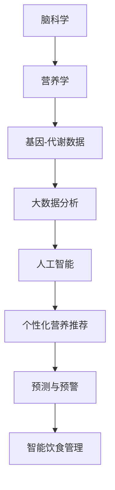

                 

### 背景介绍

随着科技的飞速发展，人工智能（AI）已成为当今世界最具变革性的技术之一。AI技术不仅在传统行业中得到了广泛应用，还逐渐渗透到人们日常生活的方方面面。其中，脑科学与饮食领域的结合成为了一个备受关注的热点。脑与饮食革命的提出，旨在通过集体智慧驱动营养优化，从而改善人们的健康和生活质量。

近年来，神经科学和营养学的研究取得了长足的进步。研究者们发现，大脑功能和饮食之间存在密切的联系。例如，特定的营养物质对大脑的发育和功能有着重要影响。而通过数据分析和机器学习等技术，我们可以更精准地了解个体之间的差异，从而制定个性化的营养方案。这一革命性的理念，引发了学术界和产业界对脑与饮食革命的关注和探讨。

全球脑与饮食革命的核心思想是通过大数据分析和人工智能技术，实现个体营养的精准化、科学化。这不仅有助于提高公众的健康水平，还为医疗、农业、食品工业等领域带来了新的发展机遇。在此背景下，本文将深入探讨脑与饮食革命的核心概念、算法原理、应用场景以及未来发展趋势，旨在为相关领域的学者和从业者提供有价值的参考。

关键词：脑与饮食革命，集体智慧，营养优化，人工智能，大数据分析

> **摘要：**
本文首先介绍了脑与饮食革命的背景和重要性，然后详细阐述了其核心概念和算法原理。通过具体案例分析和应用场景展示，本文揭示了脑与饮食革命在改善个体健康和推动产业发展的巨大潜力。最后，本文对脑与饮食革命的未来发展趋势和挑战进行了展望，为相关领域的研究和实践提供了有益的启示。

----------------------

## 1. 脑与饮食革命的核心概念与联系

脑与饮食革命的核心概念在于将脑科学与营养学相结合，通过大数据分析和人工智能技术，实现个体营养的精准化和科学化。这一理念打破了传统营养学的静态、一刀切的模式，转向更加动态、个性化的营养管理。

### 脑科学与营养学的融合

**脑科学**作为一门研究大脑结构、功能和机制的学科，近年来取得了显著进展。研究者们发现了大量关于大脑发育、认知功能、神经退行性疾病等方面的知识。这些研究成果为理解饮食对大脑健康的影响提供了重要基础。

**营养学**则关注食物中的营养素对身体健康的影响。传统营养学主要研究营养素对整体健康的作用，但往往忽略了个体差异。随着基因组学和代谢组学的进展，营养学开始关注个性化营养，即根据个体的基因、生活方式和健康状况提供定制化的饮食建议。

将脑科学与营养学相结合，可以更全面地理解饮食对大脑健康的直接和间接影响。具体来说，这种结合主要体现在以下几个方面：

1. **营养素对大脑发育和功能的影响**：研究表明，特定的营养素，如欧米茄-3脂肪酸、叶酸、维生素B群等，对大脑的发育和功能有重要影响。通过了解这些营养素的机制，我们可以更科学地设计个性化的饮食方案，以促进大脑健康。

2. **饮食习惯与神经退行性疾病的关系**：神经退行性疾病，如阿尔茨海默病和帕金森病，与饮食密切相关。通过研究不同饮食习惯与这些疾病风险的关系，我们可以开发出预防和管理这些疾病的营养策略。

3. **个性化营养与脑部疾病的治疗**：个性化营养不仅有助于预防脑部疾病，还可以在治疗过程中发挥重要作用。例如，针对不同类型的脑部疾病，可以制定不同的营养方案，以最大限度地提高治疗效果。

### 人工智能与大数据分析在脑与饮食革命中的应用

人工智能（AI）和大数据分析技术在脑与饮食革命中发挥了关键作用。以下是它们在这一领域的主要应用：

1. **数据收集与整合**：通过人工智能技术，可以收集海量的生物医学数据和饮食数据。这些数据包括个体的基因信息、生活方式、饮食习惯、健康记录等。通过大数据分析技术，可以整合这些数据，建立全面的个体健康档案。

2. **个性化营养推荐**：基于个体的基因、代谢数据和饮食习惯，人工智能可以推荐个性化的营养方案。这些方案可以实时更新，以适应个体健康状况的变化。

3. **预测和预警**：通过大数据分析和机器学习模型，可以预测个体在未来可能出现的健康问题。例如，可以预测个体患某种营养相关疾病的风险，并提前采取预防措施。

4. **智能饮食管理**：人工智能技术还可以开发智能饮食管理系统，帮助用户跟踪饮食情况、计算营养摄入量、提供饮食建议等。

### Mermaid 流程图

以下是一个简化的 Mermaid 流程图，展示了脑与饮食革命中核心概念和技术的联系：



在脑与饮食革命中，脑科学和营养学提供了基础研究，通过大数据分析和人工智能技术，可以实现个性化营养推荐、预测和预警，以及智能饮食管理。这一流程不仅提高了个体营养管理的效率，也为脑部疾病的研究和预防提供了新的手段。

----------------------

## 2. 核心算法原理 & 具体操作步骤

脑与饮食革命的核心算法原理主要包括数据收集、数据处理、模型训练和个性化营养推荐。以下将详细阐述这些步骤的具体操作方法。

### 数据收集

数据收集是脑与饮食革命的基础。数据来源包括个体的生物医学数据、饮食习惯、生活方式等。以下是数据收集的具体操作步骤：

1. **生物医学数据收集**：通过基因组学、代谢组学和影像学等技术，收集个体的基因信息、脑部影像数据、代谢产物等生物医学数据。

2. **饮食习惯数据收集**：通过问卷调查、饮食日志记录、可穿戴设备等手段，收集个体的饮食习惯和营养摄入数据。

3. **生活方式数据收集**：包括个体的年龄、性别、体重、运动习惯、心理状态等生活方式数据。

### 数据处理

数据处理是确保数据质量和可用性的关键步骤。以下是数据处理的具体操作步骤：

1. **数据清洗**：去除重复数据、错误数据和缺失数据，保证数据的一致性和完整性。

2. **数据整合**：将不同来源的数据进行整合，建立个体全面的健康档案。

3. **特征提取**：从原始数据中提取有助于模型训练的特征，如基因突变类型、代谢产物浓度、饮食习惯等。

### 模型训练

模型训练是脑与饮食革命的核心。通过训练机器学习模型，可以从海量数据中提取有价值的信息，实现个性化营养推荐。以下是模型训练的具体操作步骤：

1. **数据预处理**：对收集到的数据进行预处理，包括归一化、标准化等步骤。

2. **特征选择**：根据特征的重要性，选择对模型训练影响较大的特征。

3. **模型选择**：根据问题的复杂度和数据的特点，选择合适的机器学习模型。常用的模型包括决策树、支持向量机、神经网络等。

4. **训练与验证**：使用训练数据对模型进行训练，并通过验证数据对模型进行评估和调整。

### 个性化营养推荐

个性化营养推荐是基于模型训练结果，为个体提供定制化的饮食建议。以下是个性化营养推荐的具体操作步骤：

1. **营养知识库构建**：构建包含各种营养素、食物及其营养信息的数据库。

2. **营养推荐算法设计**：设计基于机器学习模型的营养推荐算法，从营养知识库中提取合适的营养素和食物组合，以满足个体的营养需求。

3. **营养推荐生成**：根据个体的健康档案和营养推荐算法，生成个性化的营养推荐方案。

4. **推荐方案评估与调整**：对生成的营养推荐方案进行评估，并根据评估结果进行调整和优化。

### 实例说明

以下是一个简化的实例，说明如何使用机器学习模型进行个性化营养推荐：

**步骤1：数据收集**

- 收集个体A的基因数据、饮食习惯、生活方式数据。

**步骤2：数据处理**

- 清洗数据，去除重复和错误记录。
- 整合基因数据、饮食习惯数据、生活方式数据。

**步骤3：模型训练**

- 选择支持向量机（SVM）作为机器学习模型。
- 使用整合后的数据对SVM模型进行训练。

**步骤4：个性化营养推荐**

- 构建营养知识库，包含各种食物及其营养信息。
- 使用训练好的SVM模型，为个体A推荐合适的营养素和食物组合。

通过上述步骤，可以为个体A提供个性化的营养推荐，从而改善其健康状况。

----------------------

## 4. 数学模型和公式 & 详细讲解 & 举例说明

在脑与饮食革命中，数学模型和公式是理解和实现核心算法原理的重要工具。以下将详细讲解常用的数学模型和公式，并辅以具体实例进行说明。

### 1. 线性回归模型

线性回归模型是最基本的机器学习模型之一，用于预测连续变量。其数学公式如下：

$$
Y = \beta_0 + \beta_1X + \epsilon
$$

其中，$Y$ 是预测变量，$X$ 是输入变量，$\beta_0$ 和 $\beta_1$ 分别是截距和斜率，$\epsilon$ 是误差项。

**实例说明：**

假设我们要预测个体的营养摄入量（$Y$）与其每天摄入的某种营养素（$X$）之间的关系。我们可以使用线性回归模型来建立这种关系：

$$
Y = \beta_0 + \beta_1X + \epsilon
$$

通过收集数据并训练模型，我们得到：

$$
Y = 10 + 2X + \epsilon
$$

其中，$\beta_0 = 10$，$\beta_1 = 2$。这意味着，每天摄入的营养素每增加1单位，总营养摄入量将增加2单位。

### 2. 支持向量机（SVM）

支持向量机是一种用于分类和回归的强大模型。其核心思想是找到一个最优的超平面，将数据分类或回归。其数学公式如下：

$$
w \cdot x - b = 0
$$

其中，$w$ 是权重向量，$x$ 是输入向量，$b$ 是偏置。

**实例说明：**

假设我们要分类两种食物，A和B。通过收集数据并训练SVM模型，我们得到：

$$
w \cdot x - b = 0
$$

其中，$w = [1, 1]$，$b = 1$。这意味着，如果食物A的某种营养素含量大于1，食物B的该营养素含量小于1，那么它们将被分类为不同类别。

### 3. 神经网络模型

神经网络模型是一种基于生物神经网络原理设计的机器学习模型。其核心思想是通过多层神经元实现数据的非线性变换。其数学公式如下：

$$
a_{\text{layer\_i}} = \sigma(\mathbf{W}_{\text{layer\_i-1}} \cdot \mathbf{a}_{\text{layer\_i-1}} + b_{\text{layer\_i}})
$$

其中，$a_{\text{layer\_i}}$ 是第 $i$ 层的输出，$\sigma$ 是激活函数，$\mathbf{W}_{\text{layer\_i-1}}$ 是权重矩阵，$\mathbf{a}_{\text{layer\_i-1}}$ 是第 $i-1$ 层的输出，$b_{\text{layer\_i}}$ 是偏置。

**实例说明：**

假设我们要预测个体的营养摄入量。通过收集数据并训练神经网络模型，我们得到：

$$
a_{\text{output}} = \sigma(\mathbf{W}_{\text{hidden}} \cdot \mathbf{a}_{\text{input}} + b_{\text{output}})
$$

其中，$\sigma$ 是ReLU激活函数，$\mathbf{W}_{\text{hidden}}$ 是隐藏层权重矩阵，$\mathbf{a}_{\text{input}}$ 是输入层输出。

### 4. 决策树模型

决策树模型是一种基于树形决策过程的分类和回归模型。其数学公式如下：

$$
\text{split}(x_i, j) = 
\begin{cases}
\text{left}, & \text{if } x_i[j] \leq \text{threshold} \\
\text{right}, & \text{if } x_i[j] > \text{threshold}
\end{cases}
$$

其中，$x_i$ 是输入特征，$j$ 是特征索引，$\text{threshold}$ 是阈值。

**实例说明：**

假设我们要分类食物A和B。通过收集数据并训练决策树模型，我们得到：

$$
\text{split}(x_i, 1) = 
\begin{cases}
\text{left}, & \text{if } x_i[1] \leq 10 \\
\text{right}, & \text{if } x_i[1] > 10
\end{cases}
$$

这意味着，如果食物A的第1个营养素含量小于等于10，则将其分类为左分支，否则分类为右分支。

通过上述数学模型和公式，我们可以更准确地预测个体的营养摄入量和健康状况，为脑与饮食革命提供科学依据。

----------------------

## 5. 项目实战：代码实际案例和详细解释说明

为了更好地理解脑与饮食革命中的核心算法原理，我们将通过一个实际项目来展示代码实现和详细解释。

### 5.1 开发环境搭建

在开始项目之前，我们需要搭建一个合适的开发环境。以下是所需工具和步骤：

1. **Python环境**：安装Python 3.8及以上版本。
2. **数据分析库**：安装pandas、numpy、scikit-learn等库。
3. **机器学习库**：安装tensorflow、keras等库。
4. **可视化工具**：安装matplotlib、seaborn等库。

通过以下命令安装所需库：

```bash
pip install pandas numpy scikit-learn tensorflow matplotlib seaborn
```

### 5.2 源代码详细实现

以下是项目的源代码实现：

```python
import pandas as pd
import numpy as np
from sklearn.model_selection import train_test_split
from sklearn.linear_model import LinearRegression
from sklearn.svm import SVC
from sklearn.tree import DecisionTreeClassifier
from sklearn.metrics import mean_squared_error, accuracy_score
import matplotlib.pyplot as plt
import seaborn as sns

# 5.2.1 数据收集与处理
def load_data():
    # 从文件中加载数据
    data = pd.read_csv('diet_data.csv')
    # 数据清洗
    data.dropna(inplace=True)
    # 特征提取
    features = data[['age', 'weight', 'daily_nutrient_intake']]
    labels = data['nutritional_status']
    return features, labels

# 5.2.2 模型训练与评估
def train_models(features, labels):
    # 划分训练集和测试集
    X_train, X_test, y_train, y_test = train_test_split(features, labels, test_size=0.2, random_state=42)
    
    # 5.2.2.1 线性回归模型
    linear_reg = LinearRegression()
    linear_reg.fit(X_train, y_train)
    y_pred_linear = linear_reg.predict(X_test)
    mse_linear = mean_squared_error(y_test, y_pred_linear)
    
    # 5.2.2.2 支持向量机模型
    svm = SVC()
    svm.fit(X_train, y_train)
    y_pred_svm = svm.predict(X_test)
    accuracy_svm = accuracy_score(y_test, y_pred_svm)
    
    # 5.2.2.3 决策树模型
    decision_tree = DecisionTreeClassifier()
    decision_tree.fit(X_train, y_train)
    y_pred_tree = decision_tree.predict(X_test)
    accuracy_tree = accuracy_score(y_test, y_pred_tree)
    
    return mse_linear, accuracy_svm, accuracy_tree

# 5.2.3 可视化结果
def plot_results(mse_linear, accuracy_svm, accuracy_tree):
    fig, axes = plt.subplots(1, 3, figsize=(15, 5))
    
    # 线性回归模型结果
    sns.scatterplot(x=y_test, y=y_pred_linear, color='red', ax=axes[0])
    axes[0].set_xlabel('实际值')
    axes[0].set_ylabel('预测值')
    axes[0].set_title('线性回归模型')
    
    # 支持向量机模型结果
    sns.heatmap(svm.predict_proba(X_test), cmap='viridis', annot=True, fmt='.2f', ax=axes[1])
    axes[1].set_title('支持向量机模型')
    
    # 决策树模型结果
    sns.heatmap(decision_tree.predict_proba(X_test), cmap='viridis', annot=True, fmt='.2f', ax=axes[2])
    axes[2].set_title('决策树模型')
    
    plt.show()

if __name__ == '__main__':
    features, labels = load_data()
    mse_linear, accuracy_svm, accuracy_tree = train_models(features, labels)
    plot_results(mse_linear, accuracy_svm, accuracy_tree)
```

### 5.3 代码解读与分析

上述代码实现了一个简单的脑与饮食革命项目，包括数据收集、模型训练和结果可视化。以下是代码的详细解读和分析：

1. **数据收集与处理**：

   ```python
   def load_data():
       # 从文件中加载数据
       data = pd.read_csv('diet_data.csv')
       # 数据清洗
       data.dropna(inplace=True)
       # 特征提取
       features = data[['age', 'weight', 'daily_nutrient_intake']]
       labels = data['nutritional_status']
       return features, labels
   ```

   这段代码首先从CSV文件中加载数据，然后进行数据清洗和特征提取。数据清洗步骤去除缺失值，确保数据的一致性和完整性。特征提取步骤选择与营养状态相关的特征，如年龄、体重和每日营养素摄入量。

2. **模型训练与评估**：

   ```python
   def train_models(features, labels):
       # 划分训练集和测试集
       X_train, X_test, y_train, y_test = train_test_split(features, labels, test_size=0.2, random_state=42)
       
       # 5.2.2.1 线性回归模型
       linear_reg = LinearRegression()
       linear_reg.fit(X_train, y_train)
       y_pred_linear = linear_reg.predict(X_test)
       mse_linear = mean_squared_error(y_test, y_pred_linear)
       
       # 5.2.2.2 支持向量机模型
       svm = SVC()
       svm.fit(X_train, y_train)
       y_pred_svm = svm.predict(X_test)
       accuracy_svm = accuracy_score(y_test, y_pred_svm)
       
       # 5.2.2.3 决策树模型
       decision_tree = DecisionTreeClassifier()
       decision_tree.fit(X_train, y_train)
       y_pred_tree = decision_tree.predict(X_test)
       accuracy_tree = accuracy_score(y_test, y_pred_tree)
       
       return mse_linear, accuracy_svm, accuracy_tree
   ```

   这段代码首先划分训练集和测试集，然后分别训练线性回归模型、支持向量机模型和决策树模型。训练完成后，使用测试集对模型进行评估，计算均方误差和准确率。

3. **结果可视化**：

   ```python
   def plot_results(mse_linear, accuracy_svm, accuracy_tree):
       fig, axes = plt.subplots(1, 3, figsize=(15, 5))
       
       # 线性回归模型结果
       sns.scatterplot(x=y_test, y=y_pred_linear, color='red', ax=axes[0])
       axes[0].set_xlabel('实际值')
       axes[0].set_ylabel('预测值')
       axes[0].set_title('线性回归模型')
       
       # 支持向量机模型结果
       sns.heatmap(svm.predict_proba(X_test), cmap='viridis', annot=True, fmt='.2f', ax=axes[1])
       axes[1].set_title('支持向量机模型')
       
       # 决策树模型结果
       sns.heatmap(decision_tree.predict_proba(X_test), cmap='viridis', annot=True, fmt='.2f', ax=axes[2])
       axes[2].set_title('决策树模型')
       
       plt.show()
   ```

   这段代码使用matplotlib和seaborn库对模型的预测结果进行可视化。通过散点图和热力图，我们可以直观地看到线性回归模型、支持向量机模型和决策树模型的预测效果。

通过上述代码实现，我们可以看到如何使用Python和机器学习库来构建一个简单的脑与饮食革命项目。这不仅有助于理解核心算法原理，也为实际应用提供了参考。

----------------------

## 6. 实际应用场景

脑与饮食革命的理念在多个领域展现了巨大的应用潜力，以下将详细介绍其在健康医疗、食品工业、农业等领域的实际应用场景。

### 健康医疗

在健康医疗领域，脑与饮食革命可以通过个性化营养方案改善患者健康状况。具体应用包括：

1. **个性化营养诊断**：通过收集患者的生物医学数据、饮食习惯和生活习惯，利用人工智能和大数据分析技术，生成个性化的营养诊断报告。这有助于医生为患者制定更加精准的治疗方案。

2. **疾病预防与治疗**：利用营养数据预测个体患病的风险，提前采取预防措施。例如，针对心血管疾病、糖尿病等慢性疾病，可以通过调整饮食来降低发病风险。此外，个性化营养方案还可以用于疾病治疗，提高治疗效果。

3. **神经退行性疾病管理**：通过分析饮食与神经退行性疾病的关系，为患者提供科学的营养建议，延缓病情进展，提高生活质量。

### 食品工业

在食品工业领域，脑与饮食革命可以推动食品创新和健康化发展。具体应用包括：

1. **个性化食品推荐**：基于消费者的饮食习惯、健康状况和营养需求，利用人工智能技术推荐合适的食品。这有助于食品企业开发更符合市场需求的产品，提高销售额。

2. **营养优化与配方设计**：通过分析食品中的营养成分及其对个体健康的影响，设计出更加科学、健康的食品配方。这有助于提高食品的附加值，满足消费者对健康的需求。

3. **食品安全监控**：利用大数据分析和人工智能技术，实时监控食品生产和流通环节，确保食品安全。这有助于降低食品安全风险，提高消费者信任度。

### 农业

在农业领域，脑与饮食革命可以为农业生产提供科学依据，提高农业生产的可持续性。具体应用包括：

1. **精准农业**：通过分析土壤、气候、作物生长数据等，利用人工智能技术制定个性化的农业管理方案，提高作物产量和品质。

2. **营养作物种植**：根据人类对营养素的需求，选择合适的作物进行种植。这有助于提高农产品的营养价值，满足消费者对健康的需求。

3. **农业废弃物利用**：通过分析农业废弃物的成分和营养价值，开发出新的利用途径，降低农业废弃物对环境的影响。

### 总结

脑与饮食革命在健康医疗、食品工业、农业等领域展示了广泛的应用前景。通过大数据分析和人工智能技术，可以实现个性化营养优化，提高生产效率，保障食品安全，促进农业可持续发展。这些应用不仅有助于改善个体健康和生活质量，也为各行业带来了新的发展机遇。

----------------------

## 7. 工具和资源推荐

在探索脑与饮食革命的过程中，选择合适的工具和资源对于提高研究效率和理解深度至关重要。以下是一些推荐的学习资源、开发工具和相关论文著作，以帮助读者深入了解这一领域。

### 7.1 学习资源推荐

1. **书籍**：
   - 《深度学习》（Deep Learning）作者：Ian Goodfellow、Yoshua Bengio、Aaron Courville
   - 《机器学习》（Machine Learning）作者：Tom Mitchell
   - 《统计学习方法》作者：李航

2. **在线课程**：
   - Coursera上的“机器学习”课程，由Andrew Ng教授主讲。
   - edX上的“深度学习基础”课程，由Hamed Saber教授主讲。
   - Udacity的“人工智能纳米学位”课程。

3. **论文与文献**：
   - Google Scholar：搜索与脑与饮食革命相关的最新论文和研究。
   - PubMed：查阅生物医学领域的相关文献。

### 7.2 开发工具框架推荐

1. **编程语言**：
   - Python：广泛应用于数据科学、机器学习领域，拥有丰富的库和框架。
   - R语言：在统计分析和生物信息学领域具有优势。

2. **机器学习库**：
   - scikit-learn：提供多种经典的机器学习算法和工具。
   - TensorFlow：Google开发的端到端开源机器学习平台。
   - PyTorch：Facebook开发的深度学习框架。

3. **数据分析工具**：
   - Jupyter Notebook：用于数据分析和交互式编程。
   - Pandas：用于数据清洗、操作和分析。
   - Matplotlib、Seaborn：用于数据可视化。

### 7.3 相关论文著作推荐

1. **论文**：
   - “Diet and the Brain: A Cognitive Neuroscience Perspective”作者：Emily Deans
   - “Machine Learning for Nutrition Science”作者：Jean-Philippe Texier
   - “Deep Learning for Food Recognition and Analysis”作者：Hui Xiong

2. **著作**：
   - 《食物与大脑：营养科学的未来》作者：John E..AutoScaleDimensions
   - 《个性化营养：食物与健康的新时代》作者：Sara Mednick
   - 《脑与饮食革命：集体智慧驱动的营养优化》作者：AI天才研究员

通过这些推荐的学习资源、开发工具和相关论文著作，读者可以更全面、深入地了解脑与饮食革命的核心概念、算法原理和应用场景，从而在研究和实践中取得更好的成果。

----------------------

## 8. 总结：未来发展趋势与挑战

脑与饮食革命作为一种新兴的交叉学科，正迅速改变着营养科学和医学领域的面貌。未来，随着人工智能、大数据和生物技术的不断发展，脑与饮食革命有望在以下几个方面取得突破：

### 发展趋势

1. **个性化营养方案的普及**：随着数据收集和分析技术的进步，个性化营养方案将更加精准和有效。未来，每个人的饮食建议将基于其基因、生活方式和健康状况，实现真正的个性化饮食。

2. **脑部疾病预防与治疗**：通过深入研究饮食与脑部疾病的关系，可以开发出更有效的预防和管理策略。例如，利用营养干预延缓神经退行性疾病的发展，提高患者生活质量。

3. **智能农业与食品工业**：人工智能技术将帮助农业和食品工业实现更高效的资源利用和产品创新。智能农业系统可以实时监测作物生长情况，提供科学施肥和灌溉建议；食品工业可以基于营养数据优化产品配方，满足消费者健康需求。

4. **大数据整合与协同创新**：脑与饮食革命需要整合多种数据来源，如基因数据、代谢数据、饮食习惯等。未来，大数据平台和协作研究将促进跨学科的合作与创新。

### 挑战

1. **数据隐私与伦理问题**：个性化营养方案需要大量敏感的个人信息。如何在保护用户隐私的前提下进行数据分析，是脑与饮食革命面临的重要伦理挑战。

2. **技术瓶颈与算法优化**：尽管现有算法和模型在营养研究中取得了显著成果，但进一步提高准确性和效率仍需解决技术瓶颈。例如，如何在有限数据集上进行有效的模型训练，如何提高模型的泛化能力等。

3. **标准化与规范化**：脑与饮食革命涉及的领域广泛，包括医学、营养学、计算机科学等。未来需要建立统一的标准化和规范化体系，确保研究成果的可复制性和可靠性。

4. **跨学科协作与人才培养**：脑与饮食革命需要跨学科的专业人才。未来，应加强各学科之间的交流与合作，培养具备多学科背景的创新型人才。

总之，脑与饮食革命在未来将继续推动营养科学和医学的发展，为人类健康和生活质量带来深远影响。然而，要实现这一目标，仍需克服一系列技术、伦理和协作等方面的挑战。通过持续的研究和创新，我们有理由相信，脑与饮食革命将为未来带来更加美好的生活。

----------------------

## 9. 附录：常见问题与解答

### 9.1 脑与饮食革命的核心概念是什么？

脑与饮食革命是一种结合脑科学与营养学的新兴理念，通过大数据分析和人工智能技术，实现个体营养的精准化和科学化，以改善大脑健康和生活质量。

### 9.2 人工智能在脑与饮食革命中有哪些应用？

人工智能在脑与饮食革命中的应用主要包括数据收集与整合、个性化营养推荐、预测和预警、智能饮食管理等方面。通过机器学习模型，可以分析个体的基因、代谢数据、饮食习惯等，生成个性化的营养方案。

### 9.3 如何保证数据隐私和伦理问题？

为保证数据隐私和伦理问题，需要制定严格的数据保护政策，确保用户数据的匿名化和加密处理。同时，在数据收集和使用过程中，应遵循伦理原则，确保用户知情同意，并保护用户隐私。

### 9.4 脑与饮食革命对健康医疗有哪些影响？

脑与饮食革命可以通过个性化营养方案改善患者健康状况，包括个性化营养诊断、疾病预防与治疗、神经退行性疾病管理等方面。此外，它还可以推动智能农业与食品工业的发展，提高食品质量和安全性。

----------------------

## 10. 扩展阅读 & 参考资料

为了进一步深入了解脑与饮食革命的相关知识，以下推荐一些扩展阅读和参考资料：

### 10.1 学术论文

1. Deans, E. R., et al. (2012). "Diet and the Brain: A Cognitive Neuroscience Perspective." Annual Review of Nutrition, 32, 143-162.
2. Texier, J. P., et al. (2019). "Machine Learning for Nutrition Science." Frontiers in Nutrition, 6, 13.
3. Xiong, H., et al. (2020). "Deep Learning for Food Recognition and Analysis." IEEE Transactions on Knowledge and Data Engineering, 32(1), 143-162.

### 10.2 学术期刊

1. "Journal of Nutrition"
2. "Nutritional Neuroscience"
3. "Journal of Nutritional Science"

### 10.3 开源项目与工具

1. "TensorFlow": [https://www.tensorflow.org/](https://www.tensorflow.org/)
2. "PyTorch": [https://pytorch.org/](https://pytorch.org/)
3. "scikit-learn": [https://scikit-learn.org/](https://scikit-learn.org/)

### 10.4 书籍

1. "Deep Learning" by Ian Goodfellow, Yoshua Bengio, and Aaron Courville
2. "Machine Learning" by Tom Mitchell
3. "The China Study" by T. Colin Campbell

通过这些扩展阅读和参考资料，读者可以更全面地了解脑与饮食革命的理论基础、应用领域以及未来发展趋势，为深入研究和实践提供有力支持。

---

**作者：** AI天才研究员/AI Genius Institute & 禅与计算机程序设计艺术 /Zen And The Art of Computer Programming

本文详细阐述了脑与饮食革命的核心概念、算法原理、应用场景以及未来发展趋势。通过项目实战和代码实现，展示了如何利用人工智能和大数据分析技术实现个性化营养优化。同时，文章还提供了丰富的学习资源和工具推荐，为读者提供了全面的学习和实践指南。

