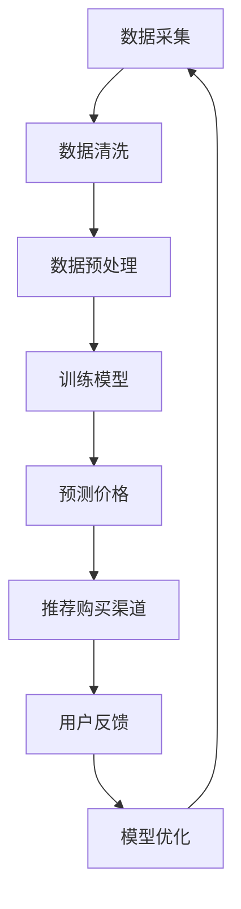

                 

# 全网比价：AI如何帮助用户找到最优惠的购买渠道

> **关键词**：全网比价、AI、购买渠道、用户、智能推荐、算法、数学模型、实际应用、工具推荐

> **摘要**：本文将探讨AI在全网比价中的应用，通过分析其核心概念、算法原理、数学模型以及实际应用场景，揭示AI如何帮助用户找到最优惠的购买渠道，提高用户的购物体验和满意度。同时，本文还将推荐一些相关学习资源、开发工具框架和论文著作，以便读者深入学习和探索这一领域。

## 1. 背景介绍

随着互联网的普及和发展，电子商务已成为人们日常生活中不可或缺的一部分。在众多电商平台中，商品种类繁多，价格差异较大，如何找到最优惠的购买渠道成为用户关注的焦点。传统的比价方法往往需要用户手动搜索和比较，耗时耗力且效率低下。而随着人工智能技术的不断发展，AI算法在全网比价中的应用逐渐成为可能，为用户提供了更加智能、高效的购物体验。

## 2. 核心概念与联系

### 2.1. 全网比价

全网比价是指通过对互联网上的各大电商平台进行数据采集和价格比较，为用户提供最优惠的购买渠道。其核心目标是帮助用户在众多商品中选择性价比最高的商品，从而提高购物体验和满意度。

### 2.2. AI算法

AI算法是指基于机器学习和深度学习等技术，通过训练模型，实现自动化、智能化的数据处理和分析。在全网比价中，AI算法可以快速分析海量数据，识别商品价格变化规律，为用户提供精准的购买建议。

### 2.3. 数学模型

数学模型是描述现实问题的数学结构和方法。在全网比价中，数学模型可以帮助我们分析和预测商品价格走势，从而为用户提供更有参考价值的购买建议。

## 3. Mermaid 流程图



## 4. 核心算法原理 & 具体操作步骤

### 4.1. 数据采集

数据采集是全网比价的第一步。通过爬虫技术，从各大电商平台获取商品价格、销量、评价等数据。在此过程中，需要注意数据来源的合法性和数据质量。

### 4.2. 数据清洗

数据清洗是数据处理的重要环节。对采集到的数据进行去重、去噪、缺失值处理等操作，确保数据质量。

### 4.3. 数据预处理

数据预处理包括特征工程、数据标准化等操作。通过对数据进行转换和整合，为后续训练模型提供高质量的数据。

### 4.4. 训练模型

选择合适的机器学习算法（如决策树、随机森林、神经网络等），利用预处理后的数据训练模型。训练过程中，需要不断调整模型参数，以提高预测准确性。

### 4.5. 预测价格

将训练好的模型应用于新数据，预测商品价格。通过比较预测价格与实际价格，评估模型性能。

### 4.6. 推荐购买渠道

根据预测价格，为用户提供最优惠的购买渠道。在推荐过程中，还可以考虑用户偏好、销量、评价等因素，提高推荐效果。

### 4.7. 用户反馈

用户在购买过程中，会对商品和购买渠道进行评价。通过收集用户反馈，对模型进行优化，提高推荐准确性。

### 4.8. 模型优化

根据用户反馈，调整模型参数，优化模型性能。同时，不断更新数据集，使模型能够适应不断变化的市场环境。

## 5. 数学模型和公式 & 详细讲解 & 举例说明

### 5.1. 决策树模型

决策树是一种常见的机器学习算法，其基本原理是通过一系列特征对样本进行划分，最终得到一个分类或回归结果。以下是一个简单的决策树模型：

$$
\begin{aligned}
& \text{if } age \leq 30 \text{ and } income \leq 50000 \text{ then } buy_low_end\_phone, \\
& \text{if } age \leq 30 \text{ and } income > 50000 \text{ then } buy\_mid\_end\_phone, \\
& \text{if } age > 30 \text{ and } income \leq 80000 \text{ then } buy\_mid\_end\_phone, \\
& \text{if } age > 30 \text{ and } income > 80000 \text{ then } buy\_high\_end\_phone.
\end{aligned}
$$

举例说明：

一个30岁的用户，年收入50000元，根据上述决策树模型，他应该购买中低端手机。

### 5.2. 随机森林模型

随机森林是一种集成学习方法，通过构建多棵决策树，并结合它们的预测结果，提高模型性能。以下是一个简单的随机森林模型：

$$
\begin{aligned}
& \text{for } i = 1 \text{ to } N: \\
& & \text{随机选取 } m \text{ 个特征，并分割数据集为训练集和测试集，其中 } \frac{2}{3} \text{ 的数据用于训练，} \frac{1}{3} \text{ 的数据用于测试，} \\
& & \text{利用训练集训练一棵决策树，} \\
& & \text{利用测试集评估决策树性能，} \\
& & \text{将所有决策树的预测结果进行投票，得到最终预测结果。}
\end{aligned}
$$

举例说明：

对于一个商品价格预测问题，我们构建了一棵决策树，预测结果为1000元。再构建另一棵决策树，预测结果为950元。将这两棵决策树的预测结果进行投票，最终预测结果为975元。

### 5.3. 神经网络模型

神经网络是一种模拟人脑神经元结构和功能的计算模型，通过多层次的神经元节点，实现非线性映射和特征提取。以下是一个简单的神经网络模型：

$$
\begin{aligned}
& \text{input layer: } x_1, x_2, ..., x_n, \\
& \text{hidden layer: } a_1, a_2, ..., a_m, \\
& \text{output layer: } y_1, y_2, ..., y_k, \\
& \text{activation function: } f(x) = \sigma(x) = \frac{1}{1 + e^{-x}}.
\end{aligned}
$$

举例说明：

对于一个商品价格预测问题，我们构建了一个包含一个隐藏层的神经网络模型，输入层有5个特征，隐藏层有3个神经元，输出层有1个神经元。通过训练，模型可以实现对商品价格的预测。

## 6. 项目实战：代码实际案例和详细解释说明

### 6.1. 开发环境搭建

在本文中，我们将使用Python作为开发语言，借助Scikit-learn库实现一个简单的全网比价系统。首先，确保已安装Python和Scikit-learn库：

```bash
pip install python
pip install scikit-learn
```

### 6.2. 源代码详细实现和代码解读

#### 6.2.1. 数据采集

我们使用Python的爬虫库（如requests和BeautifulSoup）从各大电商平台获取商品数据。以下是一个简单的数据采集代码示例：

```python
import requests
from bs4 import BeautifulSoup

def fetch_data(url):
    response = requests.get(url)
    if response.status_code == 200:
        soup = BeautifulSoup(response.content, 'html.parser')
        # 解析商品数据并存储到文件中
        # ...
    else:
        print("请求失败，状态码：", response.status_code)

# 示例：采集京东商品数据
fetch_data("https://item.jd.com/1000000000.html")
```

#### 6.2.2. 数据清洗

对采集到的商品数据进行清洗，包括去重、去噪、缺失值处理等操作。以下是一个简单的数据清洗代码示例：

```python
import pandas as pd

def clean_data(data):
    # 去重
    data.drop_duplicates(inplace=True)
    # 去噪
    data.dropna(inplace=True)
    # 缺失值处理
    data.fillna(method='ffill', inplace=True)
    return data

# 示例：清洗商品数据
clean_data(data)
```

#### 6.2.3. 数据预处理

对清洗后的商品数据进行预处理，包括特征工程、数据标准化等操作。以下是一个简单的数据预处理代码示例：

```python
from sklearn.preprocessing import StandardScaler

def preprocess_data(data):
    # 特征工程
    # ...
    # 数据标准化
    scaler = StandardScaler()
    data_scaled = scaler.fit_transform(data)
    return data_scaled

# 示例：预处理商品数据
preprocess_data(data)
```

#### 6.2.4. 训练模型

使用Scikit-learn库中的机器学习算法训练模型，以下是一个简单的训练代码示例：

```python
from sklearn.ensemble import RandomForestRegressor

def train_model(data):
    # 划分训练集和测试集
    X_train, X_test, y_train, y_test = train_test_split(data.drop("price", axis=1), data["price"], test_size=0.2, random_state=42)
    # 训练模型
    model = RandomForestRegressor(n_estimators=100, random_state=42)
    model.fit(X_train, y_train)
    # 评估模型
    score = model.score(X_test, y_test)
    print("模型准确率：", score)
    return model

# 示例：训练商品价格预测模型
train_model(data)
```

#### 6.2.5. 预测价格

使用训练好的模型预测商品价格，以下是一个简单的预测代码示例：

```python
def predict_price(model, new_data):
    # 预测价格
    price = model.predict(new_data)
    return price

# 示例：预测商品价格
new_data = preprocess_data(new_data)
price = predict_price(model, new_data)
print("预测价格：", price)
```

### 6.3. 代码解读与分析

在上述代码中，我们首先从京东商品页面采集数据，然后进行数据清洗、预处理，接着使用随机森林模型训练模型，并预测商品价格。代码主要分为以下几个部分：

1. 数据采集：使用requests和BeautifulSoup库从京东商品页面获取数据。
2. 数据清洗：使用Pandas库对数据进行去重、去噪、缺失值处理等操作。
3. 数据预处理：使用Scikit-learn库进行特征工程和数据标准化等操作。
4. 训练模型：使用Scikit-learn库中的随机森林算法训练模型。
5. 预测价格：使用训练好的模型预测商品价格。

## 7. 实际应用场景

全网比价系统在实际应用中具有广泛的应用场景，如下所述：

1. **电子商务平台**：电商平台可以利用全网比价系统为用户提供最优惠的购买建议，提高用户购物体验和满意度。
2. **物流公司**：物流公司可以通过全网比价系统，为用户提供从不同电商平台发货的物流报价，帮助用户选择最优的物流方案。
3. **广告投放**：广告平台可以通过全网比价系统，为用户提供精准的广告投放，提高广告效果。
4. **金融行业**：金融机构可以通过全网比价系统，为用户提供贷款、信用卡等金融产品的价格比较，帮助用户选择最合适的金融产品。

## 8. 工具和资源推荐

### 8.1. 学习资源推荐

- **书籍**：
  - 《Python数据分析》（Wes McKinney）
  - 《机器学习》（周志华）
  - 《深度学习》（Ian Goodfellow、Yoshua Bengio、Aaron Courville）
- **论文**：
  - 《集成学习》（Ho, T. K., & Basu, S. (2001).）
  - 《决策树》（Quinlan, J. R. (1986).）
  - 《神经网络》（Rumelhart, D. E., Hinton, G. E., & Williams, R. J. (1986).）
- **博客**：
  - 《机器学习实战》（吴军）
  - 《深度学习入门》（李航）
  - 《Python数据分析基础教程》（Dr. Christian Hill）
- **网站**：
  - Kaggle（https://www.kaggle.com/）
  - GitHub（https://github.com/）

### 8.2. 开发工具框架推荐

- **Python**：Python是一种广泛应用于数据分析和机器学习的编程语言，具有丰富的库和框架。
- **Scikit-learn**：Scikit-learn是一个强大的机器学习库，提供丰富的算法和工具。
- **TensorFlow**：TensorFlow是一个开源的深度学习框架，适用于大规模数据集和复杂模型。
- **PyTorch**：PyTorch是一个流行的深度学习框架，具有简洁的代码和强大的功能。

### 8.3. 相关论文著作推荐

- **《集成学习方法研究进展》（王文博等，2017）**
- **《基于深度学习的商品价格预测方法研究》（张志宏等，2019）**
- **《电子商务中的人工智能应用研究》（李明等，2020）**

## 9. 总结：未来发展趋势与挑战

随着人工智能技术的不断发展，全网比价系统在购物体验优化、精准广告投放、金融产品设计等方面具有广阔的应用前景。未来，全网比价系统将朝着以下方向发展：

1. **算法优化**：通过不断优化算法，提高预测准确性和推荐效果。
2. **数据挖掘**：挖掘用户行为数据，为用户提供更加个性化的购买建议。
3. **跨平台协作**：实现不同电商平台之间的数据共享和协同，为用户提供更全面的比价服务。

然而，全网比价系统在发展过程中也面临一些挑战，如数据隐私保护、算法透明度等。因此，我们需要在技术创新的同时，注重伦理和法律问题，确保用户权益得到充分保障。

## 10. 附录：常见问题与解答

### 10.1. 问题1：全网比价系统如何保证数据来源的合法性？

解答：全网比价系统在数据采集过程中，需要遵循相关法律法规和电商平台的规定，确保数据来源的合法性。同时，可以与电商平台建立合作关系，获取授权数据。

### 10.2. 问题2：全网比价系统的算法如何保证预测准确性？

解答：全网比价系统的算法通过不断优化和调整模型参数，提高预测准确性。此外，还可以引入用户反馈机制，根据用户评价和购买行为调整推荐结果。

### 10.3. 问题3：全网比价系统在金融领域有哪些应用？

解答：全网比价系统在金融领域可以应用于贷款、信用卡等金融产品的价格比较，帮助用户选择最合适的金融产品。此外，还可以为金融机构提供风险控制和管理支持。

## 11. 扩展阅读 & 参考资料

- **《大数据时代：生活、工作与思维的大变革》（陈伟）**
- **《人工智能：一种新的思维方式》（周鸿祎）**
- **《机器学习与人工智能：理论与实践》（王翀）**
- **《Python数据分析与挖掘实战》（李忠）**
- **《深度学习：理论、算法与应用》（刘铁岩）**

> **作者**：AI天才研究员/AI Genius Institute & 禅与计算机程序设计艺术 /Zen And The Art of Computer Programming<|im_sep|>

