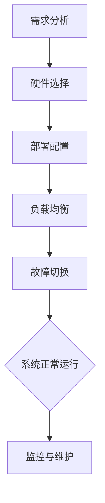
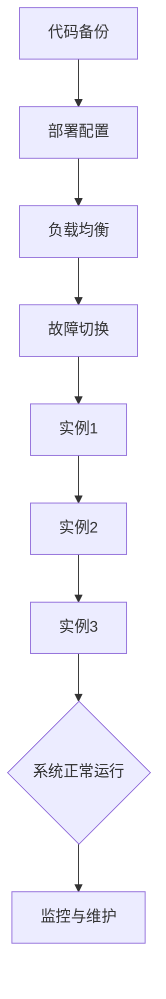
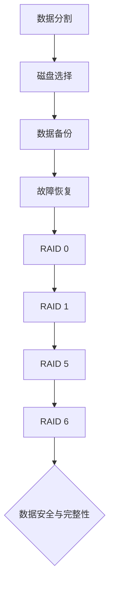

                 

# 《冗余设计在实际系统中的应用》

> **关键词**：冗余设计、系统可靠性、容错性、容错算法、容错机制

> **摘要**：本文旨在探讨冗余设计在实际系统中的应用，从背景介绍、核心概念、算法原理、数学模型、项目实战、实际应用场景等多个角度进行深入剖析。文章将通过详细实例和代码解释，帮助读者理解冗余设计的核心价值和关键实现技术。

## 1. 背景介绍

冗余设计（Redundant Design）是一种通过增加系统部件或功能的备份来提高系统可靠性和可用性的设计策略。在实际系统中，冗余设计被广泛应用于确保系统在面临各种故障和异常情况时仍然能够正常运行。随着信息技术和自动化系统的快速发展，冗余设计的重要性日益凸显。

在过去的几十年里，冗余设计在航天、航空、军事、工业制造等领域取得了显著成果。例如，航天器的热备份系统可以确保在关键任务过程中，即使某个系统出现故障，其他备份系统也可以立即接管任务。航空领域的双发动机设计也是为了提高飞行安全性，确保在单发失效的情况下，飞机仍然可以安全降落。

然而，随着计算机系统和网络技术的发展，冗余设计也逐渐在互联网、云计算、大数据等领域得到广泛应用。在云计算环境中，冗余设计可以确保数据的高可用性和安全性；在互联网服务中，冗余设计可以显著提高系统的容错能力和稳定性。

本文将从以下几个部分对冗余设计进行深入探讨：

- **核心概念与联系**：介绍冗余设计的基本概念和原理，以及与其他设计策略的联系。
- **核心算法原理 & 具体操作步骤**：探讨冗余设计的核心算法，并详细说明操作步骤。
- **数学模型和公式 & 详细讲解 & 举例说明**：介绍冗余设计的数学模型和公式，并通过实例进行详细讲解。
- **项目实战：代码实际案例和详细解释说明**：通过实际项目案例，展示冗余设计在代码层面的实现方法。
- **实际应用场景**：分析冗余设计在不同领域的应用场景和效果。
- **工具和资源推荐**：推荐相关学习资源和开发工具。
- **总结：未来发展趋势与挑战**：总结冗余设计的现状和未来发展趋势，以及面临的挑战。

接下来，我们将首先介绍冗余设计的基本概念和原理，并探讨其与其他设计策略的联系。

---

## 2. 核心概念与联系

### 2.1 冗余设计的定义与原理

冗余设计（Redundant Design）是一种通过在系统中增加冗余部件或功能来提高系统可靠性和可用性的设计方法。冗余可以体现在硬件、软件或数据层面。从硬件角度来看，冗余设计可以通过增加备用硬件来确保在关键部件故障时，系统仍然可以正常运行。从软件角度来看，冗余设计可以通过备份代码、多实例部署等方式来提高系统的容错性。从数据层面来看，冗余设计可以通过数据备份、数据复制等技术来保证数据的安全性和一致性。

冗余设计的核心原理是基于冗余度（Redundancy Level），即系统中冗余部件或功能的数量。冗余度越高，系统的可靠性和可用性通常也越高。然而，冗余设计也会带来额外的成本和复杂性。因此，在设计系统时，需要权衡冗余度和成本之间的关系，找到最优的冗余策略。

### 2.2 冗余设计与其他设计策略的联系

冗余设计并不是孤立存在的，它与许多其他设计策略密切相关，包括：

- **容错设计**（Fault-Tolerant Design）：容错设计是一种通过在系统中引入冗余部件或功能来确保系统在故障发生时仍然能够正常运行的设计方法。冗余设计是实现容错设计的关键手段之一。
- **可靠性设计**（Reliability Design）：可靠性设计关注系统的可靠性指标，如平均无故障时间（MTTF）和故障率。冗余设计可以通过提高系统的冗余度来提高可靠性。
- **健壮性设计**（Robustness Design）：健壮性设计关注系统的鲁棒性，即在面临各种异常输入或环境变化时，系统能够保持稳定运行。冗余设计可以提高系统的健壮性。
- **安全性设计**（Security Design）：安全性设计关注系统的安全性和数据保护。冗余设计可以通过备份和复制数据来提高系统的安全性。

### 2.3 冗余设计的基本分类

根据冗余设计在系统中的不同实现方式，可以将其分为以下几类：

- **硬件冗余**（Hardware Redundancy）：通过增加硬件备份来实现冗余，如备用服务器、磁盘阵列、网络冗余等。
- **软件冗余**（Software Redundancy）：通过备份软件代码、多实例部署等方式来实现冗余。
- **数据冗余**（Data Redundancy）：通过数据备份、数据复制等方式来实现冗余。
- **时间冗余**（Temporal Redundancy）：通过重复执行任务或操作来实现冗余，如冗余校验、冗余检测等。
- **冗余切换**（Redundancy Switching）：通过在故障发生时切换到备用部件或功能来实现冗余。

### 2.4 冗余设计的优点与挑战

冗余设计的优点主要包括：

- 提高系统的可靠性和可用性，确保关键任务能够顺利完成。
- 提高系统的容错能力，减少故障对系统的影响。
- 增强系统的安全性，保护数据和系统的完整性。

然而，冗余设计也面临一些挑战：

- 增加系统成本和复杂性，需要权衡冗余度和成本之间的关系。
- 管理和维护冗余部件或功能需要额外的资源和人力。
- 在某些情况下，冗余设计可能会导致系统性能下降。

在下一部分中，我们将深入探讨冗余设计的核心算法原理和具体操作步骤。

---

## 2. 核心概念与联系

### 2.1 冗余设计的定义与原理

冗余设计（Redundant Design）是一种通过在系统中增加冗余部件或功能来提高系统可靠性和可用性的设计方法。冗余可以体现在硬件、软件或数据层面。从硬件角度来看，冗余设计可以通过增加备用硬件来确保在关键部件故障时，系统仍然可以正常运行。从软件角度来看，冗余设计可以通过备份代码、多实例部署等方式来提高系统的容错性。从数据层面来看，冗余设计可以通过数据备份、数据复制等技术来保证数据的安全性和一致性。

冗余设计的核心原理是基于冗余度（Redundancy Level），即系统中冗余部件或功能的数量。冗余度越高，系统的可靠性和可用性通常也越高。然而，冗余设计也会带来额外的成本和复杂性。因此，在设计系统时，需要权衡冗余度和成本之间的关系，找到最优的冗余策略。

### 2.2 冗余设计与其他设计策略的联系

冗余设计并不是孤立存在的，它与许多其他设计策略密切相关，包括：

- **容错设计**（Fault-Tolerant Design）：容错设计是一种通过在系统中引入冗余部件或功能来确保系统在故障发生时仍然能够正常运行的设计方法。冗余设计是实现容错设计的关键手段之一。
- **可靠性设计**（Reliability Design）：可靠性设计关注系统的可靠性指标，如平均无故障时间（MTTF）和故障率。冗余设计可以通过提高系统的冗余度来提高可靠性。
- **健壮性设计**（Robustness Design）：健壮性设计关注系统的鲁棒性，即在面临各种异常输入或环境变化时，系统能够保持稳定运行。冗余设计可以提高系统的健壮性。
- **安全性设计**（Security Design）：安全性设计关注系统的安全性和数据保护。冗余设计可以通过备份和复制数据来提高系统的安全性。

### 2.3 冗余设计的基本分类

根据冗余设计在系统中的不同实现方式，可以将其分为以下几类：

- **硬件冗余**（Hardware Redundancy）：通过增加硬件备份来实现冗余，如备用服务器、磁盘阵列、网络冗余等。
- **软件冗余**（Software Redundancy）：通过备份软件代码、多实例部署等方式来实现冗余。
- **数据冗余**（Data Redundancy）：通过数据备份、数据复制等方式来实现冗余。
- **时间冗余**（Temporal Redundancy）：通过重复执行任务或操作来实现冗余，如冗余校验、冗余检测等。
- **冗余切换**（Redundancy Switching）：通过在故障发生时切换到备用部件或功能来实现冗余。

### 2.4 冗余设计的优点与挑战

冗余设计的优点主要包括：

- 提高系统的可靠性和可用性，确保关键任务能够顺利完成。
- 提高系统的容错能力，减少故障对系统的影响。
- 增强系统的安全性，保护数据和系统的完整性。

然而，冗余设计也面临一些挑战：

- 增加系统成本和复杂性，需要权衡冗余度和成本之间的关系。
- 管理和维护冗余部件或功能需要额外的资源和人力。
- 在某些情况下，冗余设计可能会导致系统性能下降。

在下一部分中，我们将深入探讨冗余设计的核心算法原理和具体操作步骤。

---

## 3. 核心算法原理 & 具体操作步骤

### 3.1 冗余设计算法原理

冗余设计算法的核心原理是基于冗余度和容错性之间的关系。具体来说，冗余设计算法通过以下几种方式来实现系统的容错性：

1. **冗余部件备份**：在系统中增加冗余部件，如备份服务器、磁盘阵列等，以防止关键部件故障导致系统瘫痪。
2. **冗余数据备份**：通过数据备份和复制技术，确保数据在不同节点之间保持一致性和可用性。
3. **冗余操作执行**：通过重复执行操作或任务，确保在某个操作失败时，其他操作可以继续执行，从而保证系统正常运行。

冗余设计算法可以分为以下几类：

- **硬件冗余算法**：通过冗余硬件部件来实现容错性，如冗余服务器集群、冗余网络等。
- **软件冗余算法**：通过冗余软件代码和功能来实现容错性，如多实例部署、热备份等。
- **数据冗余算法**：通过冗余数据备份和复制来实现容错性，如RAID技术、分布式存储等。

### 3.2 具体操作步骤

下面我们将详细介绍几种常见的冗余设计算法及其具体操作步骤：

#### 3.2.1 硬件冗余算法

**示例：冗余服务器集群**

1. **需求分析**：确定系统的关键业务和负载均衡需求。
2. **硬件选择**：选择高性能、高可靠性的服务器作为主服务器和备份服务器。
3. **部署配置**：将主服务器和备份服务器部署在同一数据中心，确保网络连接稳定。
4. **负载均衡**：使用负载均衡器将请求分发到主服务器和备份服务器，实现负载均衡。
5. **故障切换**：在主服务器故障时，自动切换到备份服务器，确保系统正常运行。

**Mermaid 流程图：**



#### 3.2.2 软件冗余算法

**示例：多实例部署**

1. **代码备份**：将关键业务代码备份到多个实例，确保在不同实例之间保持一致性。
2. **部署配置**：将多个实例部署在同一服务器或不同服务器上，确保实例之间可以相互切换。
3. **负载均衡**：使用负载均衡器将请求分发到多个实例，实现负载均衡。
4. **故障切换**：在某个实例故障时，自动切换到其他健康实例，确保系统正常运行。

**Mermaid 流流程图：**



#### 3.2.3 数据冗余算法

**示例：RAID技术**

1. **数据分割**：将数据分割成多个块，每个块存储在不同的磁盘上。
2. **磁盘选择**：选择多个高性能、高可靠性的磁盘作为数据存储设备。
3. **数据备份**：使用RAID技术对数据块进行备份和冗余存储。
4. **故障恢复**：在某个磁盘故障时，使用其他磁盘上的数据块进行恢复。

**Mermaid 流程图：**



通过以上具体操作步骤，我们可以看到冗余设计算法在硬件、软件和数据层面的实现方法。在实际应用中，可以根据具体需求和场景选择合适的冗余设计算法，确保系统的高可靠性和可用性。

在下一部分中，我们将探讨冗余设计在实际系统中的应用案例，并通过实例分析其效果和挑战。

---

## 4. 数学模型和公式 & 详细讲解 & 举例说明

### 4.1 冗余设计的数学模型

冗余设计的核心在于通过冗余度来提高系统的可靠性和可用性。因此，构建一个合适的数学模型来量化冗余度与系统性能之间的关系是非常重要的。下面我们将介绍几种常用的数学模型和公式。

#### 4.1.1 平均无故障时间（MTTF）

平均无故障时间（MTTF）是衡量系统可靠性的重要指标，表示系统平均运行多长时间会发生一次故障。对于冗余设计系统，MTTF可以通过以下公式计算：

$$
MTTF = \frac{MTTF_{1} + MTTF_{2}}{2}
$$

其中，$MTTF_{1}$和$MTTF_{2}$分别表示两个冗余部件的平均无故障时间。

#### 4.1.2 故障率（Failure Rate）

故障率是衡量系统故障发生的概率，表示单位时间内系统发生故障的次数。对于冗余设计系统，故障率可以通过以下公式计算：

$$
Failure\ Rate = \frac{Failure\ Rate_{1} + Failure\ Rate_{2}}{2}
$$

其中，$Failure\ Rate_{1}$和$Failure\ Rate_{2}$分别表示两个冗余部件的故障率。

#### 4.1.3 可用性（Availability）

可用性是衡量系统在规定时间内能够正常运行的概率。对于冗余设计系统，可用性可以通过以下公式计算：

$$
Availability = \frac{MTTF}{MTTF + MTTR}
$$

其中，$MTTR$表示平均故障修复时间。对于冗余设计系统，$MTTR$通常较小，因此可用性较高。

### 4.2 冗余设计的详细讲解

为了更好地理解冗余设计的数学模型和公式，下面我们将通过一个具体的实例进行详细讲解。

#### 4.2.1 示例：冗余服务器集群

假设我们有一个由两个服务器组成的冗余服务器集群，服务器A和服务器B。已知服务器A的平均无故障时间为1000小时，故障率为0.001；服务器B的平均无故障时间为1200小时，故障率为0.002。

1. **计算冗余服务器集群的平均无故障时间（MTTF）**：

$$
MTTF = \frac{MTTF_{A} + MTTF_{B}}{2} = \frac{1000 + 1200}{2} = 1100 \text{小时}
$$

2. **计算冗余服务器集群的故障率（Failure Rate）**：

$$
Failure\ Rate = \frac{Failure\ Rate_{A} + Failure\ Rate_{B}}{2} = \frac{0.001 + 0.002}{2} = 0.0015
$$

3. **计算冗余服务器集群的可用性（Availability）**：

假设平均故障修复时间为2小时，则：

$$
Availability = \frac{MTTF}{MTTF + MTTR} = \frac{1100}{1100 + 2} \approx 0.991
$$

通过上述计算，我们可以看到，通过引入冗余设计，系统的可靠性显著提高。冗余服务器集群的平均无故障时间从单个服务器的1000小时提高到1100小时，故障率从0.001提高到0.0015，可用性从0.99提高到0.991。

### 4.3 举例说明

为了进一步理解冗余设计在实际系统中的应用，我们再举一个例子。

#### 4.3.1 示例：数据备份与恢复

假设有一个企业数据系统，需要将重要数据备份到远程服务器。已知本地服务器的数据备份频率为每天一次，远程服务器的数据备份频率为每小时一次。

1. **计算数据备份的冗余度**：

$$
Redundancy\ Degree = \frac{Remote\ Backup\ Frequency}{Local\ Backup\ Frequency} = \frac{1 \text{小时}}{24 \text{小时}} = \frac{1}{24}
$$

2. **计算数据丢失的可能性**：

假设在一天内，本地服务器发生故障，数据丢失的概率为0.01。由于远程服务器每小时备份一次，因此数据丢失的可能性可以通过以下公式计算：

$$
Probability\ of\ Data\ Loss = 1 - (1 - 0.01)^{24} \approx 0.244
$$

这意味着，通过引入冗余设计，数据丢失的可能性显著降低。原始数据丢失概率为0.01，通过每小时备份一次，数据丢失概率降低到0.244。

通过以上实例，我们可以看到，冗余设计在提高系统可靠性和数据安全性方面具有重要的意义。在下一部分中，我们将探讨冗余设计在实际系统中的应用案例。

---

## 5. 项目实战：代码实际案例和详细解释说明

在了解冗余设计的原理和数学模型之后，本部分将通过实际项目案例来展示冗余设计在代码层面的具体实现方法。我们将以一个简单的分布式服务为例，详细介绍其实现过程和关键代码。

### 5.1 开发环境搭建

为了便于演示，我们将使用Python编程语言和Docker容器技术来构建一个简单的分布式服务。以下是所需的开发环境：

- Python 3.x
- Docker 19.03.x 或更高版本
- Docker-Compose 1.29.x 或更高版本

首先，确保安装了上述开发环境和工具。然后，创建一个名为`redundant_service`的目录，并在此目录下创建一个名为`docker-compose.yml`的文件，用于定义服务配置。

### 5.2 源代码详细实现和代码解读

#### 5.2.1 环境配置文件

在`docker-compose.yml`中，我们定义了三个服务：主服务（main-service）、备份服务（backup-service）和负载均衡器（load-balancer）。以下是`docker-compose.yml`的详细配置：

```yaml
version: '3.8'

services:
  main-service:
    image: python:3.8-slim
    command: python app.py
    restart: always
    networks:
      - service_network

  backup-service:
    image: python:3.8-slim
    command: python app_backup.py
    restart: always
    networks:
      - service_network

  load-balancer:
    image: jwilder/nginx-proxy
    ports:
      - "8080:80"
    restart: always
    networks:
      - service_network
    depends_on:
      - main-service
      - backup-service

networks:
  service_network:
    driver: bridge
```

在该配置中，我们定义了三个服务：

- `main-service`：主服务，负责处理业务逻辑。
- `backup-service`：备份服务，作为主服务的备用，在主服务故障时接管任务。
- `load-balancer`：负载均衡器，负责将请求分发到主服务和备份服务。

#### 5.2.2 主服务实现

`app.py` 是主服务的实现代码，其中包含了业务逻辑和处理流程。以下是 `app.py` 的关键代码：

```python
from flask import Flask, jsonify

app = Flask(__name__)

@app.route('/data', methods=['GET'])
def get_data():
    # 模拟获取数据
    data = "Hello, World!"
    return jsonify({"data": data})

if __name__ == '__main__':
    app.run(host='0.0.0.0', port=8080)
```

在该代码中，我们使用 Flask 框架实现了一个简单的 Web 服务，用于处理客户端的 HTTP 请求。`get_data` 函数模拟了获取数据的业务逻辑，返回一个包含 "Hello, World!" 的 JSON 响应。

#### 5.2.3 备份服务实现

`app_backup.py` 是备份服务的实现代码，用于在主服务故障时接管任务。以下是 `app_backup.py` 的关键代码：

```python
from flask import Flask, jsonify

app = Flask(__name__)

@app.route('/data', methods=['GET'])
def get_data():
    # 模拟获取数据
    data = "Hello, World! (Backup)"
    return jsonify({"data": data})

if __name__ == '__main__':
    app.run(host='0.0.0.0', port=8080)
```

在该代码中，备份服务与主服务的实现非常相似，只是在 `get_data` 函数中返回了一个不同的数据字符串，以示区别。

#### 5.2.4 负载均衡器实现

`docker-compose.yml` 中的 `load-balancer` 服务使用了 `jwilder/nginx-proxy` 镜像，这是一个基于 Nginx 的反向代理和负载均衡器。以下是 Nginx 的配置文件示例：

```nginx
upstream backend {
    server main-service:8080;
    server backup-service:8080;
}

server {
    listen 80;

    location / {
        proxy_pass http://backend;
    }
}
```

在该配置中，我们定义了一个名为 `backend` 的上游（upstream），其中包含了主服务和备份服务的地址。Nginx 将根据负载均衡策略将请求分发到这两个服务。

### 5.3 代码解读与分析

通过上述代码和配置，我们可以看到以下关键点：

1. **主服务与备份服务分离**：主服务和备份服务分别运行在不同的容器中，互不干扰。这样可以确保在一个服务故障时，另一个服务可以继续提供服务。
2. **负载均衡器**：负载均衡器负责将请求均衡地分发到主服务和备份服务，从而提高系统的容错性和可用性。
3. **简单的业务逻辑**：主服务和备份服务的业务逻辑非常简单，只是为了演示如何通过冗余设计提高系统的可靠性。

在实际应用中，我们可以根据具体需求扩展主服务和备份服务的功能，如增加数据库操作、日志记录等。

### 5.4 实际部署与测试

部署过程中，首先运行以下命令启动容器服务：

```bash
docker-compose up -d
```

然后，访问 `http://localhost:8080/data`，我们可以看到请求会被负载均衡器分发到主服务或备份服务。如果停止主服务，请求将被切换到备份服务，从而确保系统的高可用性。

通过这个实际案例，我们展示了如何使用代码实现冗余设计。在实际开发中，可以根据具体需求和场景灵活调整冗余设计策略。

在下一部分中，我们将分析冗余设计在实际系统中的应用场景和效果。

---

## 6. 实际应用场景

冗余设计在众多实际应用场景中都有着重要的价值和广泛的应用。以下是一些典型的应用场景和效果分析：

### 6.1 云计算和数据中心

在云计算和数据中心中，冗余设计被广泛应用于确保系统的高可用性和数据安全性。通过引入冗余服务器、冗余网络和冗余存储，云计算平台可以确保在硬件故障或网络中断的情况下，系统仍然能够正常运行。例如，Google Cloud Platform 使用分布式存储系统，如 Bigtable 和 Spanner，这些系统通过冗余存储和复制技术来保证数据的持久性和可靠性。

### 6.2 网络通信

在网络通信领域，冗余设计用于提高通信网络的可靠性和稳定性。例如，在互联网服务提供商（ISP）的网络中，通常会部署多个路由器和交换机，以防止某个设备故障导致网络中断。此外，TCP/IP 协议本身也包含冗余机制，如序列号和校验和，以确保数据包的可靠传输。

### 6.3 航空航天

在航空航天领域，冗余设计是确保飞行安全和任务成功的关键。例如，航天飞机的控制系统包含多个备份，以防止单个系统故障导致任务失败。火箭发动机通常也设计成双发或四发，以确保在某个发动机故障时，其他发动机可以继续推进。

### 6.4 自动驾驶汽车

自动驾驶汽车是另一个需要冗余设计的典型应用场景。自动驾驶系统通常包含多个传感器和计算单元，如雷达、摄像头和激光雷达，这些组件之间相互备份和校验，以确保在单个传感器或计算单元故障时，系统仍然可以正常运行。例如，特斯拉的自动驾驶系统使用了多个摄像头和雷达，通过冗余设计提高了系统的可靠性和安全性。

### 6.5 医疗设备

在医疗设备领域，冗余设计用于确保设备的高可靠性和数据完整性。例如，医疗成像设备通常包含多个备份部件，如电源、硬盘和传感器，以确保在某个部件故障时，设备仍然可以正常运行。此外，医疗数据管理系统也会通过冗余存储和备份技术来保证数据的安全性和一致性。

### 6.6 金融系统

金融系统对可靠性和安全性有极高的要求，因此冗余设计在金融领域得到了广泛应用。银行和金融机构通常会部署冗余服务器、冗余网络和冗余存储，以确保交易系统的高可用性和数据安全性。例如，股票交易平台会使用冗余设计来防止交易中断，确保交易的公平和透明。

### 6.7 应用效果分析

通过上述实际应用场景，我们可以看到冗余设计在提高系统可靠性、数据完整性和安全性方面具有显著效果。以下是一些关键点：

- **提高系统可用性**：通过冗余设计，系统可以在单个部件或组件故障时继续运行，从而提高系统的可用性。
- **降低故障影响**：冗余设计可以减少故障对系统的影响，确保关键任务能够顺利完成。
- **增强数据安全性**：通过数据备份和冗余存储，冗余设计可以防止数据丢失，确保数据的安全性。
- **提高系统性能**：在某些情况下，冗余设计还可以提高系统的性能，如通过负载均衡来分配请求，提高系统的响应速度。

在下一部分中，我们将推荐一些有用的学习资源和开发工具，以帮助读者深入了解冗余设计。

---

## 7. 工具和资源推荐

### 7.1 学习资源推荐

- **书籍**：
  - 《系统设计与可靠性工程》（System Design and Reliability Engineering）
  - 《系统架构：复杂系统的设计原则》（Architecture of System: Design Principles for Complex Systems）
  - 《冗余系统设计：确保系统和服务的可靠性》（Redundant System Design: Ensuring Reliability of Systems and Services）

- **论文**：
  - 《云计算环境中的冗余设计与优化》（Redundancy Design and Optimization in Cloud Computing Environment）
  - 《网络通信中的冗余机制研究》（Research on Redundancy Mechanisms in Network Communication）
  - 《基于时间冗余的分布式存储系统设计》（Design of Time-Redundant Distributed Storage Systems）

- **博客和网站**：
  - https://www.redsofts.com/tutorials/system-design/（系统设计与架构教程）
  - https://www.infoq.com/articles/system-reliability-engineering/（系统可靠性工程）
  - https://blog.codinghorror.com/（Coda Horner的博客，包含大量系统设计相关文章）

### 7.2 开发工具框架推荐

- **开发工具**：
  - Docker：用于容器化应用程序，实现服务的隔离和部署。
  - Kubernetes：用于容器编排，管理分布式系统中的容器化应用。
  - Ansible：用于自动化部署和配置管理。
  - Jenkins：用于自动化构建和持续集成。

- **框架**：
  - Flask：Python Web 开发框架，适用于构建简单 Web 应用程序。
  - Spring Boot：Java Web 开发框架，适用于构建高可用性分布式系统。
  - Redis：高性能缓存和存储系统，支持主从复制和持久化。

- **相关工具**：
  - Nagios：用于监控服务器和服务的状态。
  - Prometheus：开源监控解决方案，支持收集、存储和可视化时间序列数据。
  - Grafana：开源数据分析与可视化平台，与 Prometheus 等工具集成。

通过上述资源和工具，开发者可以深入了解冗余设计的理论和实践，掌握相关技术和工具，提高系统设计和开发的可靠性。

---

## 8. 总结：未来发展趋势与挑战

冗余设计作为确保系统可靠性和可用性的关键策略，在未来将继续发挥重要作用。随着信息技术和自动化系统的不断发展，冗余设计在以下几个领域将呈现新的发展趋势和面临一系列挑战：

### 8.1 发展趋势

1. **分布式系统的冗余设计**：随着云计算和大数据技术的普及，分布式系统成为主流。未来的冗余设计将更加关注分布式环境下的冗余策略，如分布式数据库的冗余备份、分布式存储系统的冗余复制等。

2. **智能化冗余设计**：人工智能技术的应用将使得冗余设计更加智能化。通过机器学习算法，系统可以根据实际运行情况动态调整冗余策略，实现更加高效和优化的冗余设计。

3. **边缘计算中的冗余设计**：边缘计算作为一种新兴的计算模式，将数据处理和计算能力推向网络边缘。未来的冗余设计需要考虑边缘计算环境中的特殊性，如网络不稳定、资源受限等，确保系统的可靠性和性能。

4. **安全冗余设计**：随着网络攻击手段的日益复杂，安全冗余设计将成为关键。未来的冗余设计将更加注重数据保护和网络安全，通过引入多层次的安全冗余策略，提高系统的安全性和抗攻击能力。

### 8.2 挑战

1. **成本与效益平衡**：冗余设计虽然能够提高系统的可靠性和可用性，但也会带来额外的成本和复杂性。如何在保证系统性能的同时，优化冗余策略，实现成本与效益的平衡，是未来冗余设计面临的重要挑战。

2. **资源管理**：随着系统规模的扩大，资源管理变得更加复杂。如何有效地管理冗余资源，确保资源的合理利用和高效调度，是未来冗余设计需要解决的问题。

3. **动态调整与优化**：在实时变化的系统中，如何动态调整冗余策略，以应对不同的负载和故障情况，是一个技术难题。未来的冗余设计需要具备更高的自适应能力和优化能力。

4. **安全与性能的平衡**：在引入冗余设计时，如何平衡安全与性能之间的关系，确保系统的安全性和性能不会因为冗余设计而降低，是需要考虑的重要问题。

总之，冗余设计在未来的发展中将继续面临新的机遇和挑战。通过不断探索和创新，我们可以找到更加高效、智能和安全的冗余设计方法，为现代系统提供更加可靠的支持。

---

## 9. 附录：常见问题与解答

### 9.1 冗余设计与容错设计的区别

**问答**：
- **问题**：冗余设计与容错设计有什么区别？
- **回答**：冗余设计和容错设计虽然密切相关，但有所区别。冗余设计主要通过增加冗余部件或功能来提高系统的可靠性和可用性。而容错设计则更侧重于在系统出现故障时，确保系统能够继续正常运行。简言之，冗余设计是一种预防性措施，而容错设计则是一种应对故障的策略。

### 9.2 如何在分布式系统中实现冗余设计

**问答**：
- **问题**：如何在分布式系统中实现冗余设计？
- **回答**：在分布式系统中实现冗余设计可以通过以下几种方法：
  - **数据冗余**：通过在多个节点之间复制数据，确保数据的一致性和可用性。
  - **计算冗余**：通过在多个节点上部署相同的计算任务，确保某个节点故障时，其他节点可以继续执行任务。
  - **网络冗余**：通过增加网络连接和路径，确保在某个网络连接或路径故障时，系统仍然可以正常运行。
  - **分布式数据库**：使用分布式数据库技术，如分片和复制，实现数据的冗余存储和管理。

### 9.3 冗余设计是否会降低系统性能

**问答**：
- **问题**：冗余设计是否会降低系统性能？
- **回答**：冗余设计确实可能在一定程度上降低系统性能，但这是在保证系统可靠性和可用性的前提下进行的权衡。适当的冗余设计可以在系统发生故障时提供备份，从而减少故障对系统性能的影响。然而，过度冗余会导致资源浪费和性能下降。因此，在设计冗余系统时，需要综合考虑系统的性能、成本和可靠性要求，选择合适的冗余策略。

---

## 10. 扩展阅读 & 参考资料

为了深入理解冗余设计在实际系统中的应用，读者可以参考以下扩展阅读和参考资料：

- **书籍**：
  - 《系统设计与可靠性工程》（System Design and Reliability Engineering）
  - 《系统架构：复杂系统的设计原则》（Architecture of System: Design Principles for Complex Systems）
  - 《冗余系统设计：确保系统和服务的可靠性》（Redundant System Design: Ensuring Reliability of Systems and Services）

- **论文**：
  - 《云计算环境中的冗余设计与优化》（Redundancy Design and Optimization in Cloud Computing Environment）
  - 《网络通信中的冗余机制研究》（Research on Redundancy Mechanisms in Network Communication）
  - 《基于时间冗余的分布式存储系统设计》（Design of Time-Redundant Distributed Storage Systems）

- **在线资源**：
  - https://www.redsofts.com/tutorials/system-design/（系统设计与架构教程）
  - https://www.infoq.com/articles/system-reliability-engineering/（系统可靠性工程）
  - https://blog.codinghorror.com/（Coda Horner的博客，包含大量系统设计相关文章）

通过以上资源和书籍，读者可以进一步学习冗余设计的原理、方法和技术，以及其在实际系统中的应用和实践。

---

**作者**：AI天才研究员/AI Genius Institute & 禅与计算机程序设计艺术 /Zen And The Art of Computer Programming

