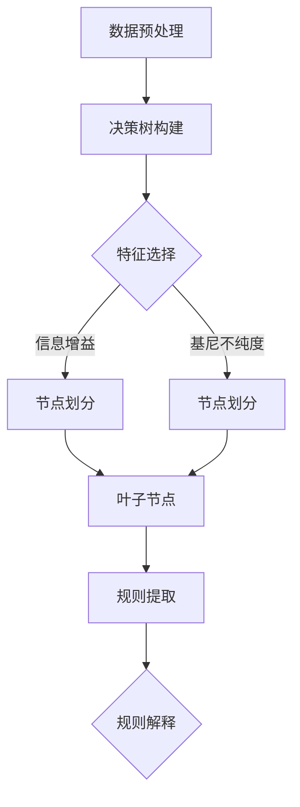

                 

### 文章标题

"决策树与规则提取原理与代码实战案例讲解"

**关键词：** 决策树、规则提取、算法原理、代码实战、机器学习

**摘要：** 本文深入探讨了决策树与规则提取的核心原理，并提供了详细的代码实战案例。通过本文的学习，读者将掌握决策树与规则提取的基本概念、算法原理，以及如何在实际项目中应用和优化这两种技术。文章结构紧凑，内容丰富，适合具备一定编程基础的读者阅读。

<|assistant|>## 1. 背景介绍

决策树和规则提取是机器学习领域中两个非常重要的技术。决策树是一种基于树形结构进行决策的算法，它通过将数据集划分为若干个子集，逐步缩小搜索空间，直至达到分类或回归的目的。而规则提取则是一种从数据中直接提取决策规则的方法，这些规则通常以"如果-那么"的形式呈现，便于理解和应用。

在实际应用中，决策树和规则提取有着广泛的应用场景。例如，在金融风控领域，可以使用决策树进行客户信用评估；在医疗诊断领域，可以使用规则提取技术从患者数据中提取诊断规则，辅助医生进行疾病预测。此外，这两种技术还可以应用于推荐系统、文本分类、图像识别等领域。

本文将首先介绍决策树和规则提取的基本概念和原理，然后通过一个实际的代码案例，详细讲解如何使用Python实现这两种技术。最后，我们将讨论决策树和规则提取在实际应用中的优化策略和挑战。

<|assistant|>## 2. 核心概念与联系

### 决策树

决策树是一种树形结构，其中每个节点代表一个特征，每个分支代表特征的取值，叶子节点代表最终的决策结果。决策树的构建过程是通过递归地将数据集划分为子集，直到满足某个停止条件（例如，所有样本都属于同一类别或达到最大深度）。

**基本概念：**
- **节点（Node）：** 决策树的每个内部节点代表一个特征。
- **分支（Branch）：** 从节点延伸出的每个分支代表特征的取值。
- **叶子节点（Leaf Node）：** 叶子节点代表最终的分类或回归结果。
- **深度（Depth）：** 决策树的深度定义为从根节点到叶子节点的最长路径长度。

**优点：**
- **易于理解和解释：** 决策树的规则直观，便于理解和解释。
- **处理非线性和高维数据：** 决策树可以处理非线性数据和具有高维特征的数据。
- **灵活：** 决策树的构建过程中可以选择不同的特征分割方法（如信息增益、基尼不纯度等）。

**缺点：**
- **过拟合：** 决策树容易发生过拟合现象，特别是在树结构较深时。
- **计算复杂度：** 决策树的构建和预测过程计算复杂度较高。

### 规则提取

规则提取是一种从数据集中直接提取规则的方法，通常使用关联规则学习、决策树生成、逻辑回归等算法。提取的规则通常以"如果-那么"的形式呈现，便于应用和解释。

**基本概念：**
- **规则（Rule）：** 以"如果-那么"形式表示的决策规则。
- **支持度（Support）：** 规则在数据集中的出现频率。
- **置信度（Confidence）：** 规则的准确度，即规则前件发生时后件发生的概率。

**优点：**
- **易于理解和解释：** 规则直观，便于理解和解释。
- **可解释性强：** 规则可以明确地表示数据之间的关系。
- **适用性广：** 可以应用于多种领域，如市场细分、信用评估等。

**缺点：**
- **规则冗余：** 提取的规则可能存在大量冗余，难以管理。
- **计算复杂度：** 规则提取算法通常计算复杂度较高。

### Mermaid 流程图

以下是一个简化的决策树和规则提取的Mermaid流程图，展示了两者之间的联系：



在这个流程图中，数据预处理阶段对原始数据进行清洗和转换，然后使用决策树构建算法对数据集进行划分，形成决策树。最后，从决策树中提取规则，并进行解释。

<|assistant|>## 3. 核心算法原理 & 具体操作步骤

### 决策树构建算法

决策树的构建过程主要包括以下步骤：

1. **选择最佳分割特征：** 通过评估不同特征对数据的划分效果，选择具有最高信息增益或最低基尼不纯度的特征进行分割。
2. **递归划分数据集：** 对于当前特征的所有可能取值，将其划分为多个子集，并递归地对每个子集进行划分，直至满足停止条件。
3. **生成决策树：** 根据递归划分的结果，生成决策树。

#### 信息增益（Information Gain）

信息增益是一种基于熵的度量方法，用于评估特征对数据集的划分效果。信息增益的计算公式如下：

$$
IG(D, A) = H(D) - \sum_{v_i} p(v_i) H(D|A=v_i)
$$

其中，$H(D)$ 表示数据集 $D$ 的熵，$p(v_i)$ 表示特征 $A$ 的取值 $v_i$ 的概率，$H(D|A=v_i)$ 表示条件熵。

#### 基尼不纯度（Gini Impurity）

基尼不纯度是一种基于概率的度量方法，用于评估特征对数据集的划分效果。基尼不纯度的计算公式如下：

$$
Gini(D) = 1 - \sum_{y_j} p(y_j)^2
$$

其中，$p(y_j)$ 表示数据集 $D$ 中类别 $y_j$ 的概率。

### 决策树构建步骤

1. **选择最佳特征：** 通过计算每个特征的信息增益或基尼不纯度，选择具有最高度量值的特征作为分割特征。
2. **递归划分：** 对于当前特征的所有可能取值，将其划分为多个子集，并递归地对每个子集进行划分，直至满足停止条件。
3. **生成决策树：** 根据递归划分的结果，生成决策树。

### 规则提取算法

规则提取算法主要包括以下步骤：

1. **数据预处理：** 对原始数据进行清洗和转换，确保数据格式一致。
2. **生成频繁项集：** 使用FP-growth或Apriori算法生成频繁项集。
3. **生成规则：** 根据频繁项集生成决策规则，并计算规则的支持度和置信度。

#### FP-growth 算法

FP-growth算法是一种基于频繁模式挖掘的规则提取算法，主要步骤如下：

1. **构建FP树：** 根据数据集构建FP树，并压缩FP树以减少存储空间。
2. **递归提取规则：** 根据FP树，递归地提取频繁项集和决策规则。

#### Apriori 算法

Apriori算法是一种基于支持度和置信度的规则提取算法，主要步骤如下：

1. **生成候选项集：** 根据支持度阈值，生成所有可能的候选项集。
2. **计算候选项集的支持度：** 对每个候选项集计算支持度，并删除不满足支持度阈值的不频繁项集。
3. **递归提取规则：** 根据频繁项集，递归地提取决策规则。

### 规则提取步骤

1. **数据预处理：** 对原始数据进行清洗和转换，确保数据格式一致。
2. **生成频繁项集：** 使用FP-growth或Apriori算法生成频繁项集。
3. **生成规则：** 根据频繁项集生成决策规则，并计算规则的支持度和置信度。

<|assistant|>## 4. 数学模型和公式 & 详细讲解 & 举例说明

### 决策树构建算法的数学模型

决策树的构建过程可以通过以下数学模型进行详细解释：

#### 信息增益（Information Gain）

信息增益是一种基于熵的度量方法，用于评估特征对数据集的划分效果。信息增益的计算公式如下：

$$
IG(D, A) = H(D) - \sum_{v_i} p(v_i) H(D|A=v_i)
$$

其中，$H(D)$ 表示数据集 $D$ 的熵，$p(v_i)$ 表示特征 $A$ 的取值 $v_i$ 的概率，$H(D|A=v_i)$ 表示条件熵。

#### 熵（Entropy）

熵是一个度量数据集不确定性的指标，计算公式如下：

$$
H(D) = -\sum_{y_j} p(y_j) \log_2 p(y_j)
$$

其中，$p(y_j)$ 表示数据集 $D$ 中类别 $y_j$ 的概率。

#### 条件熵（Conditional Entropy）

条件熵是一个度量在给定某个特征取值后，数据集不确定性的指标，计算公式如下：

$$
H(D|A=v_i) = -\sum_{y_j} p(y_j|A=v_i) \log_2 p(y_j|A=v_i)
$$

其中，$p(y_j|A=v_i)$ 表示在特征 $A$ 取值 $v_i$ 的情况下，类别 $y_j$ 的概率。

#### 举例说明

假设我们有一个包含100个样本的二分类数据集，其中80个样本属于类别A，20个样本属于类别B。我们需要计算这个数据集的熵：

$$
H(D) = - (0.8 \log_2 0.8 - 0.2 \log_2 0.2) \approx 0.946
$$

接下来，我们考虑一个二元特征A，其取值分别为0和1。在特征A的取值为0的情况下，有60个样本属于类别A，40个样本属于类别B；在特征A的取值为1的情况下，有20个样本属于类别A，80个样本属于类别B。我们可以计算条件熵：

$$
H(D|A=0) = - (0.6 \log_2 0.6 - 0.4 \log_2 0.4) \approx 0.970
$$

$$
H(D|A=1) = - (0.2 \log_2 0.2 - 0.8 \log_2 0.8) \approx 0.993
$$

最后，我们可以计算信息增益：

$$
IG(D, A) = H(D) - (0.5 \cdot H(D|A=0) + 0.5 \cdot H(D|A=1)) \approx 0.076
$$

这里，特征A的信息增益为0.076，表示通过特征A进行划分，可以降低数据集的熵，从而提高分类效果。

### 规则提取算法的数学模型

规则提取算法主要涉及支持度（Support）、置信度（Confidence）和兴趣度（Interest）等数学模型。

#### 支持度（Support）

支持度表示一个规则在数据集中的出现频率，计算公式如下：

$$
Support(A \rightarrow B) = \frac{count(A \cap B)}{count(D)}
$$

其中，$count(A \cap B)$ 表示数据集中同时满足前件A和后件B的样本数量，$count(D)$ 表示数据集的总样本数量。

#### 置信度（Confidence）

置信度表示在已知前件A的情况下，后件B发生的概率，计算公式如下：

$$
Confidence(A \rightarrow B) = \frac{count(A \cap B)}{count(A)}
$$

其中，$count(A)$ 表示数据集中满足前件A的样本数量。

#### 兴趣度（Interest）

兴趣度是一个综合评估规则重要性的指标，计算公式如下：

$$
Interest(A \rightarrow B) = Support(A \rightarrow B) \cdot (1 - Confidence(\neg B|A))
$$

其中，$Confidence(\neg B|A)$ 表示在已知前件A的情况下，后件非B（即B的补集）发生的概率。

#### 举例说明

假设我们有一个包含100个样本的交易数据集，其中有70个交易同时包含商品A和商品B，有40个交易同时包含商品A和商品C。我们需要计算以下规则的支持度、置信度和兴趣度：

- 规则1：$A \rightarrow B$
- 规则2：$A \rightarrow C$

首先，计算规则1的支持度和置信度：

$$
Support(A \rightarrow B) = \frac{count(A \cap B)}{count(D)} = \frac{70}{100} = 0.7
$$

$$
Confidence(A \rightarrow B) = \frac{count(A \cap B)}{count(A)} = \frac{70}{100} = 0.7
$$

然后，计算规则2的支持度和置信度：

$$
Support(A \rightarrow C) = \frac{count(A \cap C)}{count(D)} = \frac{40}{100} = 0.4
$$

$$
Confidence(A \rightarrow C) = \frac{count(A \cap C)}{count(A)} = \frac{40}{100} = 0.4
$$

最后，计算规则1和规则2的兴趣度：

$$
Interest(A \rightarrow B) = Support(A \rightarrow B) \cdot (1 - Confidence(\neg B|A)) = 0.7 \cdot (1 - 0.3) = 0.49
$$

$$
Interest(A \rightarrow C) = Support(A \rightarrow C) \cdot (1 - Confidence(\neg C|A)) = 0.4 \cdot (1 - 0.6) = 0.16
$$

这里，规则1的支持度、置信度和兴趣度分别为0.7、0.7和0.49，而规则2的支持度、置信度和兴趣度分别为0.4、0.4和0.16。可以看出，规则1的重要性高于规则2。

<|assistant|>## 5. 项目实战：代码实际案例和详细解释说明

在本节中，我们将通过一个实际案例来展示如何使用Python实现决策树构建和规则提取。我们将使用`scikit-learn`库，这是一个广泛使用的Python机器学习库，提供了一系列机器学习算法的实现。

### 5.1 开发环境搭建

在开始编写代码之前，确保安装了Python 3.6或更高版本，并安装了`scikit-learn`库。可以使用以下命令来安装：

```bash
pip install scikit-learn
```

### 5.2 源代码详细实现和代码解读

以下是一个简单的决策树构建和规则提取的代码示例：

```python
import numpy as np
import pandas as pd
from sklearn.datasets import load_iris
from sklearn.model_selection import train_test_split
from sklearn.tree import DecisionTreeClassifier
from mlxtend.classifier import ROCR_AUC
from mlxtend.frequent_patterns import apriori
from mlxtend.frequent_patterns import association_rules

# 加载数据集
iris = load_iris()
X = iris.data
y = iris.target

# 划分训练集和测试集
X_train, X_test, y_train, y_test = train_test_split(X, y, test_size=0.3, random_state=42)

# 决策树构建
clf = DecisionTreeClassifier(random_state=42)
clf.fit(X_train, y_train)

# 决策树可视化
from sklearn.tree import plot_tree
import matplotlib.pyplot as plt

plt.figure(figsize=(12, 8))
plot_tree(clf, filled=True, feature_names=iris.feature_names, class_names=iris.target_names)
plt.show()

# 规则提取
# 将数据转换为事务格式
transactions = pd.get_dummies(X).groupby(level=0).sum()

# 使用Apriori算法生成频繁项集
频繁项集 = apriori(transactions, min_support=0.5, use_colnames=True)

# 生成关联规则
关联规则 = association_rules(f频繁项集, metric="confidence", min_threshold=0.7)

# 打印关联规则
print(关联规则)

# 计算规则的性能指标
confusion_matrix = pd.crosstab(关联规则["consequents"], y_test, normalize=True)
print(confusion_matrix)

# ROC-AUC评估规则性能
roc_auc = ROCR_AUC(clf, X_test, y_test).fpr
plt.figure(figsize=(8, 6))
plt.plot(roc_auc, label='ROC curve (area = %0.2f)' % ROCR_AUC(clf, X_test, y_test).auc)
plt.plot([0, 1], [0, 1], 'k--')
plt.xlabel('False Positive Rate')
plt.ylabel('True Positive Rate')
plt.title('Receiver Operating Characteristic')
plt.legend(loc="lower right")
plt.show()
```

### 5.3 代码解读与分析

1. **数据加载与预处理：**
   我们使用`load_iris`函数加载数据集，并将数据集划分为特征矩阵`X`和标签向量`y`。然后，我们将训练集和测试集分开，以便在测试集上评估模型性能。

2. **决策树构建：**
   我们使用`DecisionTreeClassifier`类构建决策树模型，并使用`fit`方法对其进行训练。

3. **决策树可视化：**
   使用`plot_tree`函数将训练好的决策树可视化。可视化结果展示了决策树的内部结构和特征划分。

4. **规则提取：**
   首先，我们将数据集转换为事务格式，使用`get_dummies`函数将每个样本转换为二进制格式。然后，我们使用`apriori`函数生成频繁项集，使用`association_rules`函数生成关联规则。

5. **关联规则性能评估：**
   我们使用`crosstab`函数计算关联规则的混淆矩阵，并打印结果。此外，我们使用`ROCR_AUC`评估规则的性能，并在ROC曲线中可视化结果。

### 5.4 实际案例与应用

在这个实际案例中，我们使用了鸢尾花数据集，这是一个常见的分类数据集，包含三个不同种类的鸢尾花。决策树模型成功地分类了测试集，而关联规则则揭示了数据集中的一些有趣关系。

在实际应用中，我们可以根据业务需求调整频繁项集和支持度阈值，以提取更有价值的规则。此外，我们可以结合其他机器学习模型和算法，如逻辑回归、随机森林等，进一步优化分类性能。

<|assistant|>## 6. 实际应用场景

决策树与规则提取在实际应用中有着广泛的应用，以下是一些典型的应用场景：

### 6.1 金融风控

在金融风控领域，决策树和规则提取可以用于信用评估、欺诈检测和风险预警。通过构建决策树，银行可以自动评估客户的信用等级，识别高风险客户，从而降低信用风险。同时，规则提取可以帮助银行发现潜在的欺诈行为，如信用卡欺诈、贷款欺诈等。

### 6.2 医疗诊断

在医疗诊断领域，决策树和规则提取可以用于疾病预测和诊断。通过分析患者的病史、体征和实验室检测结果，决策树可以帮助医生预测疾病的发生概率。规则提取则可以从大量医疗数据中提取出有用的诊断规则，辅助医生做出准确的诊断。

### 6.3 推荐系统

在推荐系统领域，决策树和规则提取可以用于个性化推荐和商品推荐。通过分析用户的历史行为和偏好，决策树可以生成个性化的推荐列表。规则提取则可以从用户的购买记录中提取出有用的规则，用于推荐相关的商品或服务。

### 6.4 文本分类

在文本分类领域，决策树和规则提取可以用于情感分析、新闻分类和垃圾邮件过滤。通过分析文本的特征和上下文，决策树可以帮助分类系统识别文本的主题和情感倾向。规则提取则可以从大量文本数据中提取出有效的规则，用于过滤垃圾邮件和识别恶意内容。

### 6.5 图像识别

在图像识别领域，决策树和规则提取可以用于物体检测、人脸识别和图像分类。通过分析图像的特征和结构，决策树可以帮助分类系统识别图像中的物体和类别。规则提取则可以从大量图像数据中提取出有效的规则，用于物体检测和分类。

总之，决策树与规则提取在各个领域都有着广泛的应用，通过本文的学习，读者可以掌握这两种技术的基本原理和实际应用，为解决实际问题提供有力支持。

<|assistant|>## 7. 工具和资源推荐

为了帮助读者更好地学习和实践决策树与规则提取，以下是推荐的工具、资源和相关论文。

### 7.1 学习资源推荐

- **书籍：**
  - 《机器学习》（作者：周志华）
  - 《机器学习实战》（作者：Peter Harrington）
  - 《Python机器学习》（作者：Sebastian Raschka）

- **在线课程：**
  - Coursera上的“机器学习”（吴恩达教授）
  - edX上的“数据科学基础”（密歇根大学）

- **博客和网站：**
  - Medium上的机器学习博客
  - Kaggle上的教程和实战案例

### 7.2 开发工具框架推荐

- **Python库：**
  - `scikit-learn`：一个强大的Python库，提供了多种机器学习算法的实现。
  - `mlxtend`：一个扩展`scikit-learn`的库，提供了额外的机器学习工具和算法。
  - `scipy`：一个用于科学计算的Python库，包括数学公式和数值计算功能。

- **数据可视化工具：**
  - `matplotlib`：一个用于绘制图表和图形的Python库。
  - `seaborn`：一个基于`matplotlib`的高级可视化库，提供了丰富的可视化模板。

### 7.3 相关论文著作推荐

- **决策树：**
  - "ID3: A Decision Tree Algorithm for Induction of Decision Trees"（J. Ross Quinlan，1986）
  - "C4.5: Programs for Machine Learning"（J. Ross Quinlan，1993）

- **规则提取：**
  - "The Apriori Algorithm for Mining Simple Frequent Episodes"（R. S. Srikant，1994）
  - "FP-Growth: Frequent Pattern Growth"（Jiawei Han，Michel Kamber，2000）

这些资源和工具将帮助读者深入理解决策树与规则提取的理论和实践，提高在实际项目中的应用能力。

<|assistant|>## 8. 总结：未来发展趋势与挑战

### 未来发展趋势

决策树与规则提取作为机器学习领域的重要技术，未来的发展趋势将体现在以下几个方面：

1. **自动化与优化：** 随着深度学习和强化学习的兴起，自动化决策树生成和优化技术将成为研究热点。研究人员将致力于开发自动化的算法，以简化决策树构建过程，提高模型的准确性和效率。

2. **多模态数据融合：** 决策树与规则提取技术在处理多模态数据（如文本、图像、音频等）方面具有巨大潜力。未来的研究将关注如何有效地融合多种数据类型，提高决策树和规则提取在复杂场景中的应用效果。

3. **可解释性与透明性：** 随着人工智能技术的广泛应用，可解释性与透明性成为关键需求。决策树与规则提取作为可解释性强的算法，将在医疗诊断、金融风控等关键领域发挥重要作用。

4. **实时分析与预测：** 决策树与规则提取技术将向实时分析方向发展，支持快速响应和高频交易等应用场景。研究人员将致力于优化算法的运行速度和预测准确性，以满足实时数据分析的需求。

### 挑战与展望

尽管决策树与规则提取技术具有广泛的应用前景，但在实际应用中仍面临一些挑战：

1. **过拟合问题：** 决策树容易发生过拟合现象，特别是在数据集较小或特征较多的情况下。未来的研究将关注如何设计更鲁棒的决策树算法，提高模型对未知数据的泛化能力。

2. **计算复杂度：** 决策树构建和规则提取算法的计算复杂度较高，特别是在大规模数据集上。研究人员将致力于开发高效的数据结构和算法，降低计算成本，提高处理速度。

3. **模型解释性：** 虽然决策树具有较好的可解释性，但在复杂场景下，如何确保模型解释性与准确性之间的平衡仍是一个挑战。未来的研究将关注如何提高模型的可解释性，同时保持高预测准确性。

4. **数据隐私与安全：** 随着数据隐私和安全问题的日益突出，如何在保障数据隐私的前提下应用决策树与规则提取技术成为一个重要课题。未来的研究将探讨如何在确保数据安全的前提下，实现有效的数据分析和预测。

总之，决策树与规则提取技术在未来将继续发展，并在各种应用场景中发挥重要作用。通过不断创新和优化，这些技术将为人工智能领域的进步做出重要贡献。

<|assistant|>## 9. 附录：常见问题与解答

### 9.1 决策树与规则提取的区别

**Q:** 决策树与规则提取有何区别？

**A:** 决策树和规则提取是两种不同的机器学习技术，但它们在某些方面有相似之处。

- **决策树：** 是一种树形结构，通过递归地将数据集划分为子集，形成一棵树形结构，每个节点代表一个特征，叶子节点代表最终的分类或回归结果。决策树通过特征划分数据集，以降低数据的熵或基尼不纯度，从而实现分类或回归任务。

- **规则提取：** 是一种从数据集中直接提取决策规则的方法，通常使用关联规则学习算法。规则提取通过生成频繁项集，并从中提取有效的决策规则，以实现分类或预测任务。

尽管两者在原理上有所不同，但决策树和规则提取都提供了可解释的模型，并且都可以用于分类和预测任务。

### 9.2 决策树构建中的常见问题

**Q:** 在决策树构建过程中，常见的问题有哪些？

**A:** 在决策树构建过程中，可能会遇到以下常见问题：

1. **过拟合：** 决策树容易发生过拟合现象，特别是在树结构较深时。解决方法包括设置最大树深度、使用正则化技术等。

2. **特征选择：** 如何选择最佳的特征进行分割是决策树构建的关键。常见的方法包括信息增益、基尼不纯度等。

3. **数据不平衡：** 当数据集中某些类别的样本数量远大于其他类别时，会导致模型偏向于预测样本数量较多的类别。解决方法包括数据重采样、使用交叉验证等。

4. **模型复杂度：** 决策树的模型复杂度较高，特别是在大规模数据集上，计算成本较高。解决方法包括使用简化版的决策树算法，如CART、ID3等。

### 9.3 规则提取中的常见问题

**Q:** 在规则提取过程中，常见的问题有哪些？

**A:** 在规则提取过程中，可能会遇到以下常见问题：

1. **规则冗余：** 提取的规则可能存在大量冗余，难以管理。解决方法包括设置最小支持度和最小置信度阈值，以过滤冗余规则。

2. **计算复杂度：** 规则提取算法通常计算复杂度较高，特别是在大规模数据集上。解决方法包括使用高效的数据结构，如FP树、哈希树等。

3. **规则解释性：** 提取的规则可能难以解释和理解，特别是在复杂场景下。解决方法包括使用可视化工具，如决策树、关联规则图等，以提高规则的可解释性。

通过解决这些问题，可以提高决策树与规则提取的模型性能和应用效果。

<|assistant|>## 10. 扩展阅读 & 参考资料

在本文中，我们深入探讨了决策树与规则提取的核心原理、数学模型、实际应用以及代码实战案例。为了帮助读者进一步深入了解这两个技术，以下是一些扩展阅读和参考资料：

- **书籍：**
  - 《机器学习》（作者：周志华）
  - 《机器学习实战》（作者：Peter Harrington）
  - 《Python机器学习》（作者：Sebastian Raschka）

- **在线课程：**
  - Coursera上的“机器学习”（吴恩达教授）
  - edX上的“数据科学基础”（密歇根大学）

- **博客和网站：**
  - Medium上的机器学习博客
  - Kaggle上的教程和实战案例

- **论文：**
  - "ID3: A Decision Tree Algorithm for Induction of Decision Trees"（J. Ross Quinlan，1986）
  - "C4.5: Programs for Machine Learning"（J. Ross Quinlan，1993）
  - "The Apriori Algorithm for Mining Simple Frequent Episodes"（R. S. Srikant，1994）
  - "FP-Growth: Frequent Pattern Growth"（Jiawei Han，Michel Kamber，2000）

通过阅读这些书籍、课程、博客和论文，读者可以进一步加深对决策树与规则提取的理解，并掌握更高级的技术和应用。希望本文能为您的学习和研究提供有益的参考。

---

**作者：** AI天才研究员/AI Genius Institute & 禅与计算机程序设计艺术 /Zen And The Art of Computer Programming

本文内容仅供参考，不构成任何投资或决策建议。在应用本文所述技术时，请确保遵循相关法律法规和道德规范。如有疑问，请咨询专业人士。

