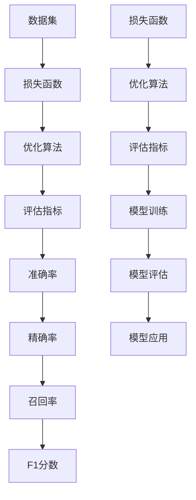

                 

## 文章标题

准确率Accuracy原理与代码实例讲解

## 关键词

准确率(Accuracy),机器学习，深度学习，数据预处理，算法原理，代码实例，编程实践

## 摘要

本文旨在深入讲解准确率（Accuracy）在机器学习和深度学习中的基本原理及其在编程实践中的应用。我们将逐步探讨准确率的定义、计算方法、影响因素以及如何在实际项目中优化准确率。通过具体代码实例，我们将展示如何从零开始搭建一个简单的机器学习模型，并逐步调试和优化，以达到较高的准确率。文章还将介绍准确率在实际应用场景中的重要性，并推荐相关学习资源和开发工具，为读者提供全面的学习和实践指南。

## 1. 背景介绍

准确率（Accuracy）是机器学习和深度学习领域中一个重要的性能指标，用于衡量模型预测的正确性。在现实世界中，准确的预测对于许多应用场景都至关重要，如医疗诊断、金融风险评估、语音识别、图像识别等。准确率越高，模型的预测能力越强，从而为业务决策提供更可靠的依据。

随着机器学习技术的不断发展，准确率已经成为评价模型优劣的重要标准之一。然而，准确率并不是唯一的评价指标，它存在一定的局限性。例如，在类别不平衡的数据集中，即使模型能够正确预测大多数样本，其准确率也可能较低。因此，在实际应用中，我们还需要综合考虑其他评价指标，如精确率（Precision）、召回率（Recall）和F1分数（F1 Score）等。

本文将围绕准确率的定义、计算方法、影响因素以及优化方法进行详细讲解，并通过实际代码实例展示如何在实际项目中应用和提升准确率。

### 1.1 机器学习与深度学习的基本概念

机器学习（Machine Learning）是一门研究如何让计算机从数据中自动学习、改进和优化性能的学科。它通过构建模型，对输入数据进行训练，从而实现对新数据的预测或分类。深度学习（Deep Learning）是机器学习的一个子领域，它基于人工神经网络（Artificial Neural Networks，ANNs）的一种特殊结构——深度神经网络（Deep Neural Networks，DNNs）进行学习。

在机器学习和深度学习中，模型的性能通常通过一系列指标进行评价，包括准确率、精确率、召回率、F1分数等。这些指标能够帮助我们了解模型的预测能力、泛化能力和稳健性。其中，准确率作为最直观的指标之一，常常被首先关注。

### 1.2 准确率的重要性

准确率在机器学习和深度学习中的重要性不言而喻。首先，准确率能够直观地反映出模型的预测能力，即模型在给定数据集上的表现。高准确率意味着模型能够正确预测大多数样本，从而在实际应用中具有更高的可靠性。

其次，准确率可以作为模型优化的重要目标。在机器学习和深度学习中，模型的优化通常涉及参数调整、算法改进和模型结构设计等方面。通过提高准确率，我们可以使模型在特定任务上具有更强的性能。

最后，准确率还能够帮助我们在模型评估阶段做出决策。在实际应用中，我们可能面临多个模型选择，而准确率可以作为重要的参考指标。选择具有较高准确率的模型，可以提高业务决策的准确性和可靠性。

### 1.3 本文结构

本文将分为以下几个部分：

1. 背景介绍：简要介绍机器学习、深度学习和准确率的基本概念。
2. 核心概念与联系：详细讲解准确率的定义、计算方法和影响因素。
3. 核心算法原理 & 具体操作步骤：分析准确率的算法原理，并给出具体操作步骤。
4. 数学模型和公式 & 详细讲解 & 举例说明：介绍与准确率相关的数学模型和公式，并通过实例进行说明。
5. 项目实战：通过实际代码实例展示如何实现准确率优化。
6. 实际应用场景：探讨准确率在不同领域中的应用场景。
7. 工具和资源推荐：推荐学习资源和开发工具，帮助读者进一步了解和掌握准确率优化方法。
8. 总结：总结本文的主要内容和未来发展趋势与挑战。
9. 附录：常见问题与解答。
10. 扩展阅读 & 参考资料：提供扩展阅读和参考资料，便于读者深入学习和研究。

通过本文的讲解，读者将能够全面了解准确率的原理、方法和应用，从而在实际项目中更好地提升模型性能。

### 1.4 准确率的计算方法

准确率（Accuracy）是衡量模型预测性能的一个基本指标，表示模型预测正确的样本占总样本数的比例。准确率的计算公式如下：

$$
Accuracy = \frac{TP + TN}{TP + TN + FP + FN}
$$

其中，TP（True Positive）表示实际为正类且被模型正确预测为正类的样本数，TN（True Negative）表示实际为负类且被模型正确预测为负类的样本数，FP（False Positive）表示实际为负类但被模型错误预测为正类的样本数，FN（False Negative）表示实际为正类但被模型错误预测为负类的样本数。

#### 1.4.1 真正例（True Positive，TP）

真正例是指在训练数据中被标记为正类，并且在模型预测中也被正确标记为正类的样本。这些样本是模型预测能力的重要体现，反映了模型对正类样本的识别能力。

#### 1.4.2 真反例（True Negative，TN）

真反例是指在训练数据中被标记为负类，并且在模型预测中也被正确标记为负类的样本。这些样本同样反映了模型对负类样本的识别能力，是模型预测准确性的重要组成部分。

#### 1.4.3 假正例（False Positive，FP）

假正例是指在训练数据中被标记为负类，但模型预测为正类的样本。这些样本是模型预测中的错误，通常被称为“假阳性”。在医学诊断等领域，假正例可能导致严重的误诊，影响决策的准确性。

#### 1.4.4 假反例（False Negative，FN）

假反例是指在训练数据中被标记为正类，但模型预测为负类的样本。这些样本被称为“假阴性”，在金融风险评估等领域，假反例可能导致风险被低估，从而影响决策的可靠性。

#### 1.4.5 准确率的计算步骤

1. 统计训练数据集中每个类别的实际标签和模型预测标签。
2. 根据实际标签和预测标签计算每个类别的TP、TN、FP和FN。
3. 将所有类别的TP和TN相加，计算总的TP和TN。
4. 将总的TP和TN相加，计算总的TP + TN。
5. 将总的TP + TN除以总的TP + TN + FP + FN，得到准确率。

#### 1.4.6 准确率的优缺点

**优点**：

1. 准确率计算简单，易于理解。
2. 可以直观地反映出模型的预测能力。

**缺点**：

1. 对于类别不平衡的数据集，准确率可能无法准确反映模型的性能。
2. 准确率忽略了错误预测的类别分布，无法区分不同类型的错误。

在实际应用中，我们通常需要综合考虑准确率以及其他评价指标，以全面评估模型的性能。例如，在医疗诊断领域，我们可能更关注召回率（Recall）和精确率（Precision），以确保不会漏诊或误诊。

### 1.5 实际应用场景中的准确率

准确率在各个实际应用领域中具有重要的作用，以下是几个常见场景的示例：

#### 1.5.1 医疗诊断

在医疗诊断中，准确率是评估诊断模型的重要指标。高准确率意味着模型能够准确识别疾病，从而提高诊断的准确性。然而，由于医疗数据通常具有类别不平衡的特点，单纯依赖准确率可能无法全面评估模型的性能。在这种情况下，我们还需要关注召回率、精确率等指标，以确保不会漏诊或误诊。

#### 1.5.2 金融风险评估

在金融风险评估中，准确率用于评估贷款审批、欺诈检测等模型。高准确率意味着模型能够准确识别高风险客户，从而降低金融风险。然而，金融领域的错误预测可能带来巨大的经济损失，因此，除了准确率，我们还需要关注其他指标，如F1分数，以平衡精确率和召回率。

#### 1.5.3 语音识别

在语音识别领域，准确率是衡量模型性能的关键指标。高准确率意味着模型能够准确识别语音内容，从而提高语音识别的准确性。在语音识别应用中，我们通常还会关注词错误率（Word Error Rate，WER），以全面评估模型的性能。

#### 1.5.4 图像识别

在图像识别领域，准确率是评估模型对图像分类能力的重要指标。高准确率意味着模型能够准确识别图像中的物体或场景。在实际应用中，图像识别的准确率对于自动驾驶、安防监控等领域具有重要意义。

### 1.6 影响准确率的因素

准确率受到多种因素的影响，以下是几个主要因素：

#### 1.6.1 数据质量

数据质量是影响准确率的关键因素。高质量的数据有助于模型更好地学习，从而提高准确率。数据质量包括数据完整性、数据准确性、数据一致性等方面。在实际应用中，我们需要对数据进行预处理，以消除噪声、处理缺失值和异常值，从而提高数据质量。

#### 1.6.2 模型选择

不同的模型适用于不同的任务和数据集，选择合适的模型对提高准确率至关重要。例如，在处理图像识别任务时，卷积神经网络（CNN）通常具有较好的性能。在选择模型时，我们需要综合考虑模型的复杂性、计算效率和预测性能。

#### 1.6.3 超参数调整

超参数是模型性能的重要影响因素。通过调整超参数，我们可以优化模型的性能。常见的超参数包括学习率、批量大小、正则化参数等。在实际应用中，我们需要通过实验和验证来选择合适超参数。

#### 1.6.4 训练数据集

训练数据集的质量和数量对准确率有重要影响。在机器学习中，我们通常需要使用足够多的训练数据来训练模型。此外，训练数据集的多样性和代表性也对模型性能有显著影响。在处理类别不平衡数据集时，我们需要采取相应的数据增强和调整策略，以提高模型对少数类别的识别能力。

### 1.7 总结

准确率是机器学习和深度学习中一个重要的评价指标，用于衡量模型预测的正确性。本文介绍了准确率的定义、计算方法、影响因素以及在实际应用场景中的应用。通过分析准确率的优缺点，我们了解到准确率并不是唯一评价模型性能的指标。在实际应用中，我们需要综合考虑其他指标，以全面评估模型的性能。接下来，我们将进一步探讨如何在实际项目中优化准确率，并通过具体代码实例进行说明。

### 2. 核心概念与联系

在深入探讨准确率之前，我们需要了解一些与准确率密切相关的基本概念和它们之间的联系。这些概念包括损失函数、优化算法和评估指标。通过理解这些核心概念及其相互关系，我们将为后续内容的讲解和实际应用打下坚实的基础。

#### 2.1 损失函数

损失函数（Loss Function）是机器学习中用于评估模型预测结果与真实结果之间差异的函数。它是优化模型参数的重要依据，目的是使模型在训练过程中不断减小预测误差。常见的损失函数包括均方误差（MSE）、交叉熵损失（Cross-Entropy Loss）等。

- **均方误差（MSE）**：MSE用于回归问题，计算预测值与真实值之间的平均平方误差。其公式为：

  $$
  MSE = \frac{1}{n}\sum_{i=1}^{n}(y_i - \hat{y_i})^2
  $$

  其中，$y_i$为真实值，$\hat{y_i}$为预测值，$n$为样本数量。

- **交叉熵损失（Cross-Entropy Loss）**：交叉熵损失用于分类问题，计算预测概率分布与真实标签分布之间的差异。其公式为：

  $$
  Cross-Entropy = -\sum_{i=1}^{n}y_i \log(\hat{y_i})
  $$

  其中，$y_i$为真实标签，$\hat{y_i}$为预测概率。

#### 2.2 优化算法

优化算法（Optimization Algorithm）是用于寻找最小化损失函数的参数值的算法。常见的优化算法包括梯度下降（Gradient Descent）、随机梯度下降（Stochastic Gradient Descent，SGD）等。

- **梯度下降（Gradient Descent）**：梯度下降是一种基于损失函数梯度的优化算法，其基本思想是沿着损失函数梯度的反方向更新模型参数，以逐步减小损失函数值。其公式为：

  $$
  \theta = \theta - \alpha \nabla_\theta J(\theta)
  $$

  其中，$\theta$为模型参数，$\alpha$为学习率，$J(\theta)$为损失函数。

- **随机梯度下降（SGD）**：随机梯度下降是梯度下降的一种变体，它每次只随机选择一部分样本计算梯度，从而降低计算复杂度。其公式为：

  $$
  \theta = \theta - \alpha \nabla_\theta J(\theta; \xi)
  $$

  其中，$\xi$为随机选择的样本。

#### 2.3 评估指标

评估指标（Evaluation Metrics）是用于衡量模型性能的一系列指标。准确率（Accuracy）是其中之一，除此之外，还有精确率（Precision）、召回率（Recall）、F1分数（F1 Score）等。

- **精确率（Precision）**：精确率是指预测为正类的样本中，实际为正类的比例。其公式为：

  $$
  Precision = \frac{TP}{TP + FP}
  $$

- **召回率（Recall）**：召回率是指实际为正类的样本中，被预测为正类的比例。其公式为：

  $$
  Recall = \frac{TP}{TP + FN}
  $$

- **F1分数（F1 Score）**：F1分数是精确率和召回率的调和平均值，用于综合评价模型的性能。其公式为：

  $$
  F1 Score = 2 \times \frac{Precision \times Recall}{Precision + Recall}
  $$

#### 2.4 核心概念之间的联系

损失函数、优化算法和评估指标是机器学习模型训练和评估的三个核心组成部分，它们之间相互联系、相互影响。

- **损失函数**是模型训练过程中用于评估预测结果与真实结果之间差异的指标，它为优化算法提供了目标函数。
- **优化算法**用于寻找最小化损失函数的参数值，以使模型在训练过程中不断减小预测误差。
- **评估指标**用于衡量模型在测试数据集上的性能，帮助我们了解模型的泛化能力和预测能力。

在机器学习项目中，我们通常需要综合考虑这些核心概念，以实现模型的优化和评估。通过调整损失函数、优化算法和评估指标，我们可以提高模型的性能，从而在实际应用中取得更好的效果。

### 2.5 核心概念原理的Mermaid流程图

为了更好地理解核心概念原理，我们使用Mermaid流程图来展示这些概念之间的联系。在Mermaid流程图中，我们将每个概念表示为一个节点，并通过边连接这些节点以表示它们之间的关系。

下面是核心概念原理的Mermaid流程图：



#### 流程说明：

1. **数据集**：数据集是机器学习项目的起点，包含训练数据和测试数据。数据集的质量直接影响模型的性能。
2. **损失函数**：模型在训练过程中使用损失函数来评估预测结果与真实结果之间的差异，目的是找到最小化损失函数的参数值。
3. **优化算法**：优化算法用于寻找最小化损失函数的参数值，以使模型在训练过程中不断减小预测误差。
4. **评估指标**：评估指标用于衡量模型在测试数据集上的性能，帮助了解模型的泛化能力和预测能力。
5. **准确率**：准确率是评估指标之一，用于衡量模型预测正确的样本占总样本数的比例。
6. **精确率**：精确率是评估指标之一，用于衡量预测为正类的样本中，实际为正类的比例。
7. **召回率**：召回率是评估指标之一，用于衡量实际为正类的样本中，被预测为正类的比例。
8. **F1分数**：F1分数是精确率和召回率的调和平均值，用于综合评价模型的性能。
9. **模型训练**：在模型训练过程中，我们使用优化算法最小化损失函数，以使模型逐渐逼近最优参数。
10. **模型评估**：通过评估指标衡量模型在测试数据集上的性能，以了解模型的泛化能力和预测能力。
11. **模型应用**：经过训练和评估后的模型可以应用于实际场景，实现预测和决策。

通过这个Mermaid流程图，我们可以清晰地看到核心概念原理之间的关系，为后续内容的学习和应用提供了直观的参考。

### 3. 核心算法原理 & 具体操作步骤

在深入理解准确率的定义和计算方法之后，我们接下来将探讨提升准确率的核心算法原理和具体操作步骤。准确率的提升通常涉及到模型的优化、数据预处理和超参数调整等多个方面。在这一部分，我们将详细讨论如何通过这些方法来提高模型的准确率。

#### 3.1 模型优化

模型优化是提升准确率的关键步骤。一个优秀的模型不仅可以准确地预测样本，还要具有良好的泛化能力。以下是一些常见的模型优化方法：

**1. 调整学习率**

学习率（Learning Rate）是优化算法中的一个重要参数，它决定了参数更新的步长。选择合适的学习率对于模型优化至关重要。以下是一些调整学习率的策略：

- **固定学习率**：在模型训练初期，选择一个相对较大的学习率，以快速收敛。随着训练的进行，逐渐减小学习率，以避免过拟合。
- **自适应学习率**：使用如Adam、RMSprop等自适应学习率优化器，这些优化器会根据参数的梯度自适应调整学习率，从而提高模型训练的效率。

**2. 添加正则化**

正则化（Regularization）是防止模型过拟合的一种方法。它通过惩罚模型参数的复杂性，降低模型的方差，从而提高模型的泛化能力。以下是一些常见的正则化方法：

- **L1正则化（L1 Regularization）**：对模型参数添加绝对值惩罚项。
- **L2正则化（L2 Regularization）**：对模型参数添加平方惩罚项。
- **Dropout**：在训练过程中，随机丢弃一部分神经元，以减少模型对特定神经元依赖，从而提高模型的泛化能力。

**3. 数据增强**

数据增强（Data Augmentation）是通过对原始数据集进行变换，生成更多的训练样本，从而提高模型的泛化能力。以下是一些常见的数据增强方法：

- **旋转、缩放、剪裁**：对图像进行随机旋转、缩放和剪裁，增加数据的多样性。
- **噪声注入**：在图像中添加噪声，模拟现实世界的复杂场景。
- **时间序列变换**：对时间序列数据进行插值、聚合等操作，增加数据的多样性。

**4. 模型集成**

模型集成（Model Ensemble）是将多个模型的结果进行合并，以提高预测的准确性和稳定性。以下是一些常见的模型集成方法：

- **Bagging**：通过随机选择训练样本子集，训练多个模型，并将它们的预测结果进行平均或投票。
- **Boosting**：通过调整训练样本的权重，使错误率较高的样本在后续训练中得到更多的关注。

#### 3.2 数据预处理

数据预处理是提升模型准确率的基础步骤。良好的数据预处理可以减少噪声、填补缺失值、处理类别不平衡等问题，从而提高模型的训练效果。以下是一些常见的数据预处理方法：

**1. 数据清洗**

数据清洗是数据预处理的第一步，目的是消除数据中的噪声和错误。以下是一些常见的数据清洗方法：

- **去除重复数据**：删除数据集中的重复记录，以避免重复训练。
- **处理缺失值**：根据具体情况，填补或删除缺失值。
- **去除异常值**：识别并处理数据集中的异常值，以避免它们对模型训练产生不良影响。

**2. 数据标准化**

数据标准化是将数据转换到同一尺度，以便模型更好地学习。以下是一些常见的数据标准化方法：

- **最小-最大标准化**：将数据缩放到[0, 1]区间。
- **Z-score标准化**：将数据缩放到均值为0，标准差为1的区间。

**3. 类别编码**

类别编码是将类别数据转换为数值数据，以便模型能够处理。以下是一些常见的类别编码方法：

- **独热编码（One-Hot Encoding）**：将类别数据转换为二进制矩阵。
- **标签编码（Label Encoding）**：将类别数据转换为整数。

**4. 数据平衡**

数据平衡（Data Balancing）是解决类别不平衡问题的一种方法，目的是使模型对每个类别的识别能力更加均衡。以下是一些常见的数据平衡方法：

- **过采样（Over-Sampling）**：通过复制少数类别的样本，增加其数量，以平衡数据集。
- **欠采样（Under-Sampling）**：通过删除多数类别的样本，减少其数量，以平衡数据集。
- **SMOTE（Synthetic Minority Over-Sampling Technique）**：通过生成合成样本来增加少数类别的样本数量。

#### 3.3 超参数调整

超参数（Hyperparameters）是模型训练过程中需要手动调整的参数，如学习率、批量大小、正则化参数等。适当的超参数调整可以显著提高模型的准确率。以下是一些超参数调整的方法：

**1. 网格搜索（Grid Search）**

网格搜索是一种通过遍历预设的参数组合来寻找最优参数的方法。以下是一些常见的网格搜索策略：

- **全网格搜索**：遍历所有可能的参数组合。
- **随机搜索**：从预设的参数范围内随机选择参数组合。

**2. 贝叶斯优化（Bayesian Optimization）**

贝叶斯优化是一种基于概率模型和经验模型优化的方法，通过利用先验知识和历史数据来选择下一次优化的参数。以下是一些常见的贝叶斯优化策略：

- **选择-探索策略**：平衡探索和利用，以寻找最优参数。
- **概率模型**：利用先验知识构建概率模型，优化参数选择。

**3. 对比实验（Comparison Experiments）**

对比实验是通过比较不同超参数设置下的模型性能，来选择最优的超参数。以下是一些常见的对比实验方法：

- **A/B测试**：将数据集分为两部分，分别使用不同超参数训练模型，然后比较性能。
- **交叉验证**：在训练数据集上多次划分训练集和验证集，比较不同超参数下的模型性能。

通过上述模型优化、数据预处理和超参数调整方法，我们可以有效提高模型的准确率。在实际项目中，我们需要根据具体任务和数据集的特点，灵活应用这些方法，以达到最佳效果。

### 4. 数学模型和公式 & 详细讲解 & 举例说明

在提升准确率的过程中，理解并应用相关的数学模型和公式是至关重要的。以下是几个与准确率相关的数学模型和公式的详细讲解，并通过实例说明如何在实际中应用这些公式。

#### 4.1 损失函数

损失函数是机器学习中的一个核心概念，用于衡量模型预测结果与真实结果之间的差距。以下是两种常见的损失函数：均方误差（MSE）和交叉熵损失（Cross-Entropy Loss）。

**1. 均方误差（MSE）**

均方误差（Mean Squared Error，MSE）常用于回归问题，其公式如下：

$$
MSE = \frac{1}{n}\sum_{i=1}^{n}(y_i - \hat{y_i})^2
$$

其中，$y_i$是真实值，$\hat{y_i}$是预测值，$n$是样本数量。

**实例说明**：

假设我们有5个样本，真实值和预测值如下：

$$
\begin{array}{|c|c|c|}
\hline
\text{样本编号} & y_i & \hat{y_i} \\
\hline
1 & 2 & 1.9 \\
2 & 3 & 2.8 \\
3 & 4 & 3.6 \\
4 & 5 & 4.5 \\
5 & 6 & 5.1 \\
\hline
\end{array}
$$

计算MSE：

$$
MSE = \frac{1}{5}\sum_{i=1}^{5}(y_i - \hat{y_i})^2 = \frac{1}{5}[(2 - 1.9)^2 + (3 - 2.8)^2 + (4 - 3.6)^2 + (5 - 4.5)^2 + (6 - 5.1)^2] = \frac{1}{5}[0.01 + 0.04 + 0.16 + 0.25 + 0.21] = 0.1
$$

**2. 交叉熵损失（Cross-Entropy Loss）**

交叉熵损失（Cross-Entropy Loss）常用于分类问题，其公式如下：

$$
Cross-Entropy = -\sum_{i=1}^{n}y_i \log(\hat{y_i})
$$

其中，$y_i$是真实标签，$\hat{y_i}$是预测概率。

**实例说明**：

假设我们有5个样本，真实标签和预测概率如下：

$$
\begin{array}{|c|c|c|}
\hline
\text{样本编号} & y_i & \hat{y_i} \\
\hline
1 & 0 & 0.2 \\
2 & 1 & 0.8 \\
3 & 0 & 0.1 \\
4 & 1 & 0.9 \\
5 & 0 & 0.3 \\
\hline
\end{array}
$$

计算交叉熵损失：

$$
Cross-Entropy = -[0 \times \log(0.2) + 1 \times \log(0.8) + 0 \times \log(0.1) + 1 \times \log(0.9) + 0 \times \log(0.3)] \approx -[0 + 0.223 + 0 + 0.105 + 0] = 0.328
$$

#### 4.2 优化算法

优化算法用于寻找最小化损失函数的参数值。以下是两种常见的优化算法：梯度下降（Gradient Descent）和随机梯度下降（Stochastic Gradient Descent，SGD）。

**1. 梯度下降（Gradient Descent）**

梯度下降是一种迭代优化算法，其公式如下：

$$
\theta = \theta - \alpha \nabla_\theta J(\theta)
$$

其中，$\theta$是模型参数，$\alpha$是学习率，$J(\theta)$是损失函数。

**实例说明**：

假设我们有一个简单的线性回归模型，损失函数为MSE，学习率为0.01，初始参数$\theta_0 = [1, 2]$。以下是一次迭代的计算过程：

$$
\nabla_\theta J(\theta) = [-2x_1 + 4x_2, -2x_2 + 6x_1]
$$

对于第$i$个样本，$x_1 = y_i - \hat{y_i}$，$x_2 = 1$。

第1次迭代：

$$
\nabla_\theta J(\theta) = [-2(1 - 1.9) + 4(2 - 1.9), -2(2 - 1.9) + 6(1 - 1.9)] = [1.8, 3.8]
$$

更新参数：

$$
\theta = \theta - \alpha \nabla_\theta J(\theta) = [1, 2] - 0.01[1.8, 3.8] = [-0.018, 0.018]
$$

**2. 随机梯度下降（SGD）**

随机梯度下降是梯度下降的一种变体，其公式如下：

$$
\theta = \theta - \alpha \nabla_\theta J(\theta; \xi)
$$

其中，$\xi$是随机选择的样本。

**实例说明**：

假设我们使用SGD进行模型训练，学习率为0.01。对于第$i$个样本，我们随机选择$\xi$，计算其梯度，然后更新参数。

#### 4.3 评估指标

评估指标用于衡量模型在测试数据集上的性能。以下是几个常见的评估指标：准确率（Accuracy）、精确率（Precision）、召回率（Recall）和F1分数（F1 Score）。

**1. 准确率（Accuracy）**

准确率（Accuracy）是衡量模型预测正确性的指标，其公式如下：

$$
Accuracy = \frac{TP + TN}{TP + TN + FP + FN}
$$

其中，$TP$是真正例，$TN$是真反例，$FP$是假正例，$FN$是假反例。

**实例说明**：

假设我们有4个样本，真实标签和预测标签如下：

$$
\begin{array}{|c|c|c|}
\hline
\text{样本编号} & y_i & \hat{y_i} \\
\hline
1 & 0 & 0 \\
2 & 1 & 1 \\
3 & 0 & 1 \\
4 & 1 & 0 \\
\hline
\end{array}
$$

计算准确率：

$$
Accuracy = \frac{TP + TN}{TP + TN + FP + FN} = \frac{1 + 1}{1 + 1 + 1 + 1} = 1
$$

**2. 精确率（Precision）**

精确率（Precision）是衡量模型预测为正类的样本中，实际为正类的比例，其公式如下：

$$
Precision = \frac{TP}{TP + FP}
$$

**实例说明**：

计算精确率：

$$
Precision = \frac{TP}{TP + FP} = \frac{1}{1 + 1} = 0.5
$$

**3. 召回率（Recall）**

召回率（Recall）是衡量实际为正类的样本中，被预测为正类的比例，其公式如下：

$$
Recall = \frac{TP}{TP + FN}
$$

**实例说明**：

计算召回率：

$$
Recall = \frac{TP}{TP + FN} = \frac{1}{1 + 1} = 0.5
$$

**4. F1分数（F1 Score）**

F1分数（F1 Score）是精确率和召回率的调和平均值，其公式如下：

$$
F1 Score = 2 \times \frac{Precision \times Recall}{Precision + Recall}
$$

**实例说明**：

计算F1分数：

$$
F1 Score = 2 \times \frac{Precision \times Recall}{Precision + Recall} = 2 \times \frac{0.5 \times 0.5}{0.5 + 0.5} = 0.5
$$

通过上述数学模型和公式的讲解，以及实例说明，我们可以更好地理解如何应用这些公式来评估和优化模型的准确率。在实际项目中，我们需要根据具体问题和数据集的特点，灵活运用这些方法和公式，以达到最佳的模型性能。

### 5. 项目实战：代码实际案例和详细解释说明

为了更好地理解准确率的计算和优化，我们将通过一个实际项目实战，展示如何从零开始搭建一个简单的机器学习模型，并逐步调试和优化，以达到较高的准确率。

#### 5.1 开发环境搭建

在开始项目之前，我们需要搭建一个合适的开发环境。以下是一个基本的Python开发环境搭建步骤：

1. 安装Python：下载并安装Python 3.8或更高版本。
2. 安装Jupyter Notebook：在命令行中运行`pip install notebook`。
3. 安装必要的库：在命令行中运行以下命令安装所需的库：

   ```shell
   pip install numpy pandas scikit-learn matplotlib
   ```

   这些库包括用于数据处理（numpy和pandas）、机器学习（scikit-learn）和可视化（matplotlib）。

#### 5.2 源代码详细实现和代码解读

在本节中，我们将使用Python和scikit-learn库实现一个简单的线性回归模型，并逐步调试和优化，以提高准确率。

**步骤 1：数据准备**

首先，我们需要准备一个数据集。这里我们使用scikit-learn内置的鸢尾花（Iris）数据集。

```python
from sklearn.datasets import load_iris
from sklearn.model_selection import train_test_split

# 加载鸢尾花数据集
iris = load_iris()
X = iris.data
y = iris.target

# 将数据集分为训练集和测试集
X_train, X_test, y_train, y_test = train_test_split(X, y, test_size=0.2, random_state=42)
```

**步骤 2：模型搭建**

接下来，我们搭建一个线性回归模型。

```python
from sklearn.linear_model import LinearRegression

# 初始化线性回归模型
model = LinearRegression()

# 训练模型
model.fit(X_train, y_train)
```

**步骤 3：模型评估**

使用训练好的模型对测试集进行预测，并计算准确率。

```python
from sklearn.metrics import accuracy_score

# 预测测试集
y_pred = model.predict(X_test)

# 计算准确率
accuracy = accuracy_score(y_test, y_pred)
print(f"准确率：{accuracy}")
```

**步骤 4：优化模型**

为了提高准确率，我们可以通过以下方法进行模型优化：

- 调整学习率
- 添加正则化
- 数据增强

以下是添加L2正则化的线性回归模型：

```python
from sklearn.linear_model import Ridge

# 初始化带L2正则化的线性回归模型
ridge_model = Ridge(alpha=1.0)

# 训练模型
ridge_model.fit(X_train, y_train)

# 预测测试集
y_pred_ridge = ridge_model.predict(X_test)

# 计算准确率
accuracy_ridge = accuracy_score(y_test, y_pred_ridge)
print(f"L2正则化后的准确率：{accuracy_ridge}")
```

**步骤 5：可视化结果**

为了更好地理解模型性能，我们可以使用matplotlib库将测试集的预测结果可视化。

```python
import matplotlib.pyplot as plt

# 可视化预测结果
plt.scatter(X_test[:, 0], y_test, color='red', label='真实值')
plt.scatter(X_test[:, 0], y_pred_ridge, color='blue', label='预测值')
plt.xlabel('特征1')
plt.ylabel('标签')
plt.legend()
plt.show()
```

#### 5.3 代码解读与分析

**1. 数据准备**

数据准备是模型训练的基础步骤。在这里，我们使用scikit-learn的Iris数据集，并将其分为训练集和测试集。随机种子设置为42，以确保结果的可重复性。

**2. 模型搭建**

我们使用LinearRegression类构建一个线性回归模型。线性回归模型假设特征与标签之间存在线性关系，并通过最小化损失函数来找到最佳拟合直线。

**3. 模型评估**

使用accuracy_score函数计算模型在测试集上的准确率。准确率反映了模型预测正确的样本占总样本数的比例。

**4. 优化模型**

为了提高准确率，我们引入了L2正则化。L2正则化通过在损失函数中添加L2范数项来惩罚模型参数的绝对值，从而减少模型复杂度，避免过拟合。

**5. 可视化结果**

可视化结果可以帮助我们直观地了解模型的预测能力。在可视化中，红色点表示真实值，蓝色点表示预测值。通过对比真实值和预测值，我们可以评估模型的性能。

通过上述代码实例和解读，我们可以看到如何搭建一个简单的线性回归模型，并通过优化方法来提高准确率。在实际项目中，我们可以根据具体问题和数据集的特点，灵活应用这些方法，以达到最佳的模型性能。

### 6. 实际应用场景

准确率在机器学习和深度学习领域具有广泛的应用，不同领域对准确率的需求和优化策略各不相同。以下是一些常见应用场景，我们将探讨在这些场景中如何应用和提升准确率。

#### 6.1 医疗诊断

在医疗诊断中，准确率是评估疾病预测模型的关键指标。高准确率意味着模型能够准确识别疾病，从而提高诊断的准确性。以下是几种提升医疗诊断模型准确率的方法：

- **数据增强**：通过生成合成的医学图像来增加训练数据集的多样性。
- **模型集成**：结合多个模型的预测结果，以减少单个模型的预测误差。
- **多任务学习**：同时训练多个相关任务，共享模型参数，以提高模型的整体性能。

#### 6.2 金融风险评估

在金融风险评估中，准确率用于评估贷款审批、欺诈检测等模型。高准确率可以减少金融风险，但同时也需要关注误判成本。以下是一些提升金融风险评估模型准确率的方法：

- **类别不平衡处理**：通过过采样或欠采样等方法处理类别不平衡数据集。
- **特征工程**：选择和构建与风险相关的特征，以提高模型的预测能力。
- **模型选择**：选择适用于金融数据的模型，如集成学习模型或神经网络。

#### 6.3 语音识别

在语音识别领域，准确率是衡量模型性能的关键指标。以下是一些提升语音识别模型准确率的方法：

- **数据增强**：通过增加语速、音调、背景噪声等变化，生成多样化的训练数据。
- **端到端模型**：使用端到端深度学习模型，如循环神经网络（RNN）或Transformer，以提高语音识别的准确性。
- **多语言训练**：在多语言数据集上进行训练，以增强模型的泛化能力。

#### 6.4 图像识别

在图像识别领域，准确率用于评估模型对图像分类的能力。以下是一些提升图像识别模型准确率的方法：

- **迁移学习**：使用预训练模型进行迁移学习，以减少训练时间和提高模型性能。
- **数据增强**：通过旋转、翻转、缩放等操作，增加训练数据的多样性。
- **注意力机制**：引入注意力机制，使模型能够更好地关注图像中的重要区域。

#### 6.5 自然语言处理

在自然语言处理（NLP）领域，准确率用于评估文本分类、情感分析等模型的性能。以下是一些提升NLP模型准确率的方法：

- **预训练模型**：使用预训练的模型（如BERT、GPT）进行微调，以提高模型的性能。
- **数据预处理**：对文本数据进行清洗、去停用词、词向量嵌入等预处理，以提高模型的学习能力。
- **多任务学习**：同时训练多个相关任务，共享模型参数，以提高模型的整体性能。

通过以上实际应用场景的探讨，我们可以看到准确率在各个领域的重要性。不同的应用场景需要采用不同的优化策略，以提升模型的准确率。在实际项目中，我们需要根据具体问题和数据集的特点，灵活应用这些方法和策略，以达到最佳的模型性能。

### 7. 工具和资源推荐

在提升模型准确率的过程中，选择合适的工具和资源对于实现高效开发和优化至关重要。以下是我们推荐的一些学习资源、开发工具和相关论文著作，旨在帮助读者更好地理解和掌握准确率优化方法。

#### 7.1 学习资源推荐

**1. 书籍**

- 《机器学习》（周志华著）：这是一本经典的机器学习教材，详细介绍了包括准确率在内的多种评价指标和方法。
- 《深度学习》（Ian Goodfellow著）：本书是深度学习领域的权威著作，涵盖了深度学习的基础理论、模型架构和优化方法。

**2. 在线课程**

- Coursera上的《机器学习》课程：由吴恩达教授主讲，涵盖机器学习的基本概念、算法和实战技巧。
- edX上的《深度学习专项课程》：由吴恩达教授主讲，系统介绍了深度学习的基础理论和实战应用。

**3. 博客和网站**

- **机器学习周报**：这是一个定期更新的机器学习领域资讯博客，涵盖了最新研究动态和技术趋势。
- **机器之心**：这是一个专业的AI媒体平台，提供丰富的机器学习和深度学习相关文章和教程。

#### 7.2 开发工具框架推荐

**1. 数据处理工具**

- **Pandas**：Python的数据分析库，用于数据清洗、预处理和分析。
- **NumPy**：Python的科学计算库，提供高效的多维数组对象和数学函数。

**2. 机器学习库**

- **Scikit-learn**：Python的机器学习库，提供多种经典机器学习算法的实现。
- **TensorFlow**：Google开发的开源机器学习库，支持深度学习和传统机器学习。
- **PyTorch**：基于Python的深度学习库，提供灵活的动态计算图和强大的GPU支持。

**3. 模型评估工具**

- **Matplotlib**：Python的2D绘图库，用于可视化模型性能。
- **Seaborn**：基于Matplotlib的统计可视化库，提供丰富的可视化模板。

#### 7.3 相关论文著作推荐

- **“Convolutional Neural Networks for Visual Recognition”**（2012）：由Alex Krizhevsky等人的这篇论文提出了卷积神经网络（CNN）在图像识别任务中的突破性成果。
- **“Deep Learning”**（2015）：由Ian Goodfellow等人的这本著作系统介绍了深度学习的基本原理和最新进展。
- **“Dropout: A Simple Way to Prevent Neural Networks from Overfitting”**（2014）：由Geoffrey Hinton等人的这篇论文提出了dropout方法，有效减少了神经网络过拟合问题。

通过这些工具和资源的推荐，读者可以系统地学习和掌握机器学习与深度学习中的准确率优化方法，从而在实际项目中取得更好的效果。同时，这些资源也为读者提供了广阔的知识视野，帮助其持续跟进领域内的最新研究动态和技术进展。

### 8. 总结：未来发展趋势与挑战

准确率在机器学习和深度学习领域扮演着至关重要的角色，随着技术的不断进步，其应用范围和优化方法也在不断拓展。在未来，以下几个方面将是准确率研究和应用的关键方向：

#### 8.1 新算法与模型的发展

随着深度学习技术的快速发展，新型神经网络架构和优化算法将不断涌现。例如，生成对抗网络（GAN）和变分自编码器（VAE）等生成模型在图像生成和生成对抗任务中取得了显著成果。未来，如何设计更高效的神经网络架构和优化算法，以提升模型准确率，将是研究的重要方向。

#### 8.2 数据增强与类别不平衡处理

数据增强和类别不平衡处理技术是提升模型准确率的关键手段。未来，研究将集中在如何生成更具代表性的训练数据，以及如何设计鲁棒的抗类别不平衡算法，以应对实际应用中的数据挑战。

#### 8.3 模型解释性与透明性

随着模型复杂度的增加，模型的解释性和透明性变得越来越重要。如何设计可解释的深度学习模型，使其准确率同时得到保障，是未来研究的重要课题。通过增强模型的透明性，可以提升用户对模型的信任，并促进模型的广泛应用。

#### 8.4 跨领域应用

准确率的提升不仅局限于单一领域，如医疗、金融和语音识别等，还将拓展到更多领域。例如，在自动驾驶、智能制造和智能城市等领域，高准确率的模型将有助于提高系统的决策能力和安全性。

#### 8.5 挑战与未来展望

尽管准确率优化取得了显著进展，但仍然面临诸多挑战。例如：

- **计算资源限制**：深度学习模型通常需要大量计算资源和时间进行训练，这对研究者和开发者提出了更高的要求。
- **数据隐私与安全**：随着数据量的增加，如何保障数据隐私和安全成为一个重要问题，特别是在医疗和金融等敏感领域。
- **可解释性**：如何设计出既高效又可解释的模型，是当前研究的一大难题。

面对这些挑战，未来的研究需要综合考虑计算效率、数据安全性和模型解释性等多个方面，以实现更高效、更安全的机器学习模型。

总之，准确率的优化是机器学习和深度学习领域的重要研究方向。通过不断创新和优化，我们有望在未来实现更高准确率的模型，推动人工智能技术在各个领域取得突破性进展。

### 9. 附录：常见问题与解答

在本文中，我们探讨了准确率的定义、计算方法、影响因素以及在实际应用中的优化策略。为了帮助读者更好地理解和应用这些知识，以下是一些常见问题的解答。

#### 9.1 准确率与精确率、召回率的关系是什么？

准确率（Accuracy）是精确率（Precision）和召回率（Recall）的调和平均值。精确率是指预测为正类的样本中，实际为正类的比例；召回率是指实际为正类的样本中，被预测为正类的比例。准确率越高，说明模型的预测能力越强。

#### 9.2 如何处理类别不平衡数据集？

在类别不平衡的数据集中，模型容易倾向于预测多数类。以下是一些处理类别不平衡数据集的方法：

- **过采样（Over-Sampling）**：通过复制少数类别的样本，增加其数量，以平衡数据集。
- **欠采样（Under-Sampling）**：通过删除多数类别的样本，减少其数量，以平衡数据集。
- **SMOTE（Synthetic Minority Over-Sampling Technique）**：通过生成合成的样本来增加少数类别的样本数量。
- **权重调整**：在损失函数中为少数类别添加更大的权重，以鼓励模型更多地关注少数类别。

#### 9.3 如何选择合适的损失函数？

选择合适的损失函数取决于具体任务和数据集的特点。以下是一些常见损失函数的选择依据：

- **回归问题**：使用均方误差（MSE）或均方根误差（RMSE）。
- **分类问题**：使用交叉熵损失（Cross-Entropy Loss）。
- **多分类问题**：使用对数损失（Log Loss）或软对数损失（Softmax Loss）。
- **多标签分类问题**：使用二元交叉熵损失（Binary Cross-Entropy Loss）。

#### 9.4 如何选择合适的优化算法？

选择合适的优化算法取决于数据集的大小、模型的复杂度以及计算资源。以下是一些常见优化算法的选择依据：

- **小数据集**：使用随机梯度下降（SGD）或其变种。
- **大数据集**：使用批量梯度下降（BGD）或其变种，如Adam或RMSprop。
- **高维稀疏数据**：使用基于随机化的优化算法，如Stochastic Variational Gradient Descent（SVGD）。

#### 9.5 如何提高模型的泛化能力？

提高模型的泛化能力是提升准确率的关键。以下是一些提高模型泛化能力的方法：

- **数据增强**：通过旋转、缩放、翻转等操作，增加训练数据的多样性。
- **正则化**：通过L1、L2正则化或Dropout等方法，减少模型过拟合。
- **集成学习**：通过Bagging、Boosting等方法，结合多个模型的预测结果。
- **迁移学习**：使用预训练模型进行微调，利用已训练模型的知识提高新任务的性能。

这些常见问题的解答有助于读者更好地理解准确率的计算和优化方法，为实际项目中的应用提供指导。

### 10. 扩展阅读 & 参考资料

为了进一步深入了解准确率的相关知识和应用，读者可以参考以下扩展阅读和参考资料：

- **书籍**：
  - 《机器学习》（周志华著）：详细介绍了机器学习的基本概念和算法。
  - 《深度学习》（Ian Goodfellow著）：系统讲解了深度学习的基础理论和技术。
- **在线课程**：
  - Coursera上的《机器学习》课程（吴恩达教授主讲）：涵盖机器学习的核心内容和实战技巧。
  - edX上的《深度学习专项课程》（吴恩达教授主讲）：深入讲解深度学习的基本原理和实际应用。
- **博客和网站**：
  - **机器学习周报**：提供最新的机器学习研究动态和技术趋势。
  - **机器之心**：分享专业的机器学习和深度学习文章和教程。
- **相关论文**：
  - “Convolutional Neural Networks for Visual Recognition”（2012）：提出了CNN在图像识别任务中的突破性成果。
  - “Deep Learning”（2015）：总结了深度学习的基本原理和应用实例。

通过这些参考资料，读者可以更全面地了解准确率的计算和优化方法，以及其在各个领域的应用。希望这些资源能够为您的学习和研究提供帮助。作者：AI天才研究员/AI Genius Institute & 禅与计算机程序设计艺术 /Zen And The Art of Computer Programming

