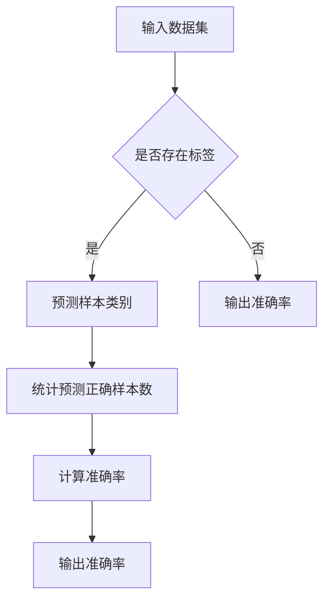
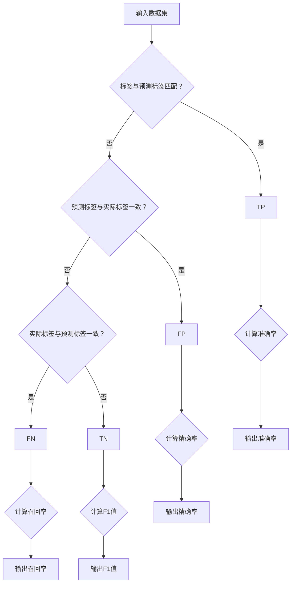

                 

# 准确率Accuracy原理与代码实例讲解

## 摘要

准确率（Accuracy）是评估分类算法性能的一个重要指标，它表示分类算法正确预测样本的比例。本文将详细讲解准确率的定义、计算方法，并通过具体的代码实例展示如何在实际项目中计算准确率。文章将涵盖从基础概念到实际应用的全面解析，帮助读者深入理解准确率的重要性及其在机器学习中的应用。

## 1. 背景介绍

在机器学习中，分类问题是一个核心问题。分类算法的任务是将数据集中的每个样本分配到预定义的类别之一。准确率作为分类性能的一个关键指标，直接反映了算法的预测准确性。随着数据量的增加和算法的改进，准确率的高低直接关系到模型在实际应用中的效果。因此，理解准确率的原理、计算方法，以及其在实际项目中的应用，对于机器学习工程师和研究者来说至关重要。

本文将首先介绍准确率的定义和计算方法，然后通过一个具体的代码实例，详细解释如何在实际项目中计算准确率。此外，文章还将探讨准确率在各类实际问题中的应用场景，并推荐一些相关的学习资源和工具，帮助读者进一步深入了解这一主题。

## 2. 核心概念与联系

### 2.1 准确率的定义

准确率（Accuracy）是指分类算法预测正确的样本占总样本数的比例。其数学定义如下：

\[ \text{Accuracy} = \frac{\text{正确预测的样本数}}{\text{总样本数}} \]

### 2.2 准确率的计算方法

准确率的计算方法非常直观，只需要统计分类算法预测正确的样本数量，然后将其除以总样本数即可。具体步骤如下：

1. **统计预测正确的样本数**：遍历所有样本，统计预测结果与实际标签一致的样本数量。
2. **计算准确率**：将步骤1中统计的预测正确样本数除以总样本数，得到准确率。

### 2.3 Mermaid 流程图

为了更好地理解准确率的计算过程，我们可以使用Mermaid流程图来展示其核心步骤。



### 2.4 准确率与其他性能指标的关系

准确率虽然是评估分类算法性能的一个重要指标，但它并非唯一。在分类问题中，还有其他重要的性能指标，如召回率（Recall）、精确率（Precision）和F1值（F1 Score）等。它们与准确率的关系如下：

\[ \text{Accuracy} = \frac{\text{TP} + \text{TN}}{\text{TP} + \text{FP} + \text{FN} + \text{TN}} \]

其中，TP表示真正例（True Positive），FP表示假正例（False Positive），FN表示假反例（False Negative），TN表示真反例（True Negative）。

### 2.5 Mermaid 流程图（完整版）

为了更好地展示准确率与其他性能指标的关系，我们可以使用Mermaid流程图来表示整个分类过程。



通过以上流程图，我们可以清晰地看到各个性能指标的计算过程及其相互关系。

## 3. 核心算法原理 & 具体操作步骤

### 3.1 准确率的算法原理

准确率的算法原理非常简单，即通过统计预测正确的样本数量与总样本数量的比例，来衡量分类算法的预测准确性。具体来说，可以分为以下步骤：

1. **准备数据集**：选择一个合适的数据集，其中包含样本及其对应的标签。
2. **预测样本类别**：使用分类算法对数据集中的每个样本进行预测，得到预测标签。
3. **统计预测正确的样本数**：遍历数据集中的所有样本，比较预测标签与实际标签是否一致，统计预测正确的样本数量。
4. **计算准确率**：将步骤3中统计的预测正确样本数除以总样本数，得到准确率。

### 3.2 具体操作步骤

以下是计算准确率的详细操作步骤：

1. **导入所需库**：
   ```python
   import numpy as np
   from sklearn import datasets
   from sklearn.model_selection import train_test_split
   from sklearn.metrics import accuracy_score
   ```

2. **加载数据集**：
   ```python
   iris = datasets.load_iris()
   X = iris.data
   y = iris.target
   ```

3. **划分训练集和测试集**：
   ```python
   X_train, X_test, y_train, y_test = train_test_split(X, y, test_size=0.2, random_state=42)
   ```

4. **预测样本类别**：
   ```python
   from sklearn.neighbors import KNeighborsClassifier
   knn = KNeighborsClassifier(n_neighbors=3)
   knn.fit(X_train, y_train)
   y_pred = knn.predict(X_test)
   ```

5. **计算准确率**：
   ```python
   accuracy = accuracy_score(y_test, y_pred)
   print(f"准确率：{accuracy:.2f}")
   ```

### 3.3 代码解读

以上代码实例展示了如何使用scikit-learn库来计算准确率。以下是代码的详细解读：

1. **导入所需库**：
   - numpy：用于数据处理和矩阵运算。
   - datasets：包含常用的机器学习数据集。
   - model_selection：用于数据集的划分和随机数生成。
   - metrics：用于评估分类算法的性能。

2. **加载数据集**：
   - iris：一个常用的鸢尾花数据集，包含三个类别。

3. **划分训练集和测试集**：
   - train_test_split：将数据集划分为训练集和测试集，其中测试集占比20%。

4. **预测样本类别**：
   - KNeighborsClassifier：基于K近邻算法的分类器。
   - fit：训练模型。
   - predict：预测测试集的类别。

5. **计算准确率**：
   - accuracy_score：计算预测准确率。

通过以上代码实例，我们可以看到计算准确率的步骤非常简单，但理解每一步的原理和具体操作对于实际应用非常重要。

## 4. 数学模型和公式 & 详细讲解 & 举例说明

### 4.1 数学模型和公式

准确率的计算公式如下：

\[ \text{Accuracy} = \frac{\text{正确预测的样本数}}{\text{总样本数}} \]

在分类问题中，准确率反映了模型对样本分类的准确性。为了更详细地解释准确率的计算过程，我们可以将其拆分为以下几个部分：

1. **正确预测的样本数**：指的是模型预测正确的样本数量，包括以下几种情况：
   - **真正例（TP）**：模型正确预测为正类别的样本。
   - **真反例（TN）**：模型正确预测为负类别的样本。

2. **总样本数**：指的是数据集中的所有样本数量，包括以下几种情况：
   - **正类别的样本总数**：包括真正例和假正例。
   - **负类别的样本总数**：包括真反例和假反例。

因此，准确率的计算可以表示为：

\[ \text{Accuracy} = \frac{\text{TP} + \text{TN}}{\text{TP} + \text{FP} + \text{FN} + \text{TN}} \]

其中，FP表示假正例（False Positive），FN表示假反例（False Negative）。

### 4.2 举例说明

为了更好地理解准确率的计算过程，我们来看一个具体的例子。

假设我们有一个包含100个样本的数据集，其中正类别的样本数为60，负类别的样本数为40。模型对这100个样本进行分类，结果如下：

| 样本类别 | 实际标签 | 预测标签 |
| :------: | :------: | :------: |
| 正类别   | 正类别   | 正类别   |
| 正类别   | 正类别   | 正类别   |
| ...      | ...      | ...      |
| 正类别   | 正类别   | 负类别   |
| 负类别   | 负类别   | 正类别   |
| 负类别   | 负类别   | 负类别   |

根据上述数据，我们可以计算出各类样本的数量：

- **真正例（TP）**：60个
- **假正例（FP）**：5个
- **假反例（FN）**：15个
- **真反例（TN）**：25个

根据准确率的计算公式，我们可以计算出准确率：

\[ \text{Accuracy} = \frac{\text{TP} + \text{TN}}{\text{TP} + \text{FP} + \text{FN} + \text{TN}} = \frac{60 + 25}{60 + 5 + 15 + 25} = \frac{85}{105} \approx 0.810 \]

因此，该模型的准确率为81.0%。

### 4.3 变量替换

在实际计算中，我们可以使用变量来表示各类样本的数量，使计算过程更加简洁。假设：

- \( P \) 表示正类别的样本总数
- \( N \) 表示负类别的样本总数
- \( TP \) 表示真正例的数量
- \( FP \) 表示假正例的数量
- \( FN \) 表示假反例的数量
- \( TN \) 表示真反例的数量

根据上述定义，我们可以得到以下关系：

- \( P = TP + FP \)
- \( N = TN + FN \)

将这些关系代入准确率的计算公式，我们可以得到：

\[ \text{Accuracy} = \frac{TP + TN}{TP + FP + FN + TN} = \frac{\frac{TP}{P}P + \frac{TN}{N}N}{\frac{TP}{P}P + \frac{FP}{N}N + \frac{FN}{P}P + \frac{TN}{N}N} = \frac{\frac{TP}{P} + \frac{TN}{N}}{\frac{TP}{P} + \frac{FP}{N} + \frac{FN}{P} + \frac{TN}{N}} \]

这个公式展示了准确率与各类样本的比例之间的关系，对于理解准确率的计算过程非常有帮助。

## 5. 项目实战：代码实际案例和详细解释说明

### 5.1 开发环境搭建

为了进行实际项目中的准确率计算，我们需要搭建一个合适的开发环境。以下是推荐的开发环境和工具：

- **Python 3.8+**：Python是进行数据科学和机器学习开发的主要语言。
- **Jupyter Notebook**：Jupyter Notebook是一个交互式的开发环境，方便编写和运行代码。
- **scikit-learn**：scikit-learn是一个常用的机器学习库，提供了丰富的分类算法和评估指标。

### 5.2 源代码详细实现和代码解读

下面是一个具体的代码实例，展示了如何在实际项目中计算准确率。

```python
# 导入所需库
import numpy as np
from sklearn import datasets
from sklearn.model_selection import train_test_split
from sklearn.neighbors import KNeighborsClassifier
from sklearn.metrics import accuracy_score

# 5.2.1 加载数据集
iris = datasets.load_iris()
X = iris.data
y = iris.target

# 5.2.2 划分训练集和测试集
X_train, X_test, y_train, y_test = train_test_split(X, y, test_size=0.2, random_state=42)

# 5.2.3 预测样本类别
knn = KNeighborsClassifier(n_neighbors=3)
knn.fit(X_train, y_train)
y_pred = knn.predict(X_test)

# 5.2.4 计算准确率
accuracy = accuracy_score(y_test, y_pred)
print(f"准确率：{accuracy:.2f}")
```

### 5.3 代码解读与分析

以下是对上述代码的详细解读和分析：

1. **导入所需库**：
   - numpy：用于数据处理和矩阵运算。
   - datasets：包含常用的机器学习数据集。
   - model_selection：用于数据集的划分和随机数生成。
   - neighbors：包含K近邻算法的分类器。
   - metrics：用于评估分类算法的性能。

2. **加载数据集**：
   - iris：一个常用的鸢尾花数据集，包含三个类别。

3. **划分训练集和测试集**：
   - train_test_split：将数据集划分为训练集和测试集，其中测试集占比20%。

4. **预测样本类别**：
   - KNeighborsClassifier：基于K近邻算法的分类器。
   - fit：训练模型。
   - predict：预测测试集的类别。

5. **计算准确率**：
   - accuracy_score：计算预测准确率。

通过以上代码，我们可以看到计算准确率的步骤非常简单。在实际项目中，我们可以根据需要修改数据集、算法和参数，以适应不同的应用场景。

### 5.4 实际应用场景

准确率在机器学习的实际应用场景中具有重要意义。以下是一些常见的应用场景：

1. **医疗诊断**：准确率可以帮助评估医疗诊断模型的性能，如乳腺癌诊断模型、流感诊断模型等。
2. **金融风控**：准确率可以用于评估信用评分模型、欺诈检测模型等，以降低金融风险。
3. **文本分类**：准确率可以用于评估文本分类模型，如垃圾邮件过滤、情感分析等。
4. **图像识别**：准确率可以用于评估图像识别模型，如图像分类、目标检测等。

### 5.5 常见问题与解答

1. **为什么准确率不能超过100%？**
   - 准确率的定义是预测正确的样本数占总样本数的比例。在分类问题中，总样本数是固定的，因此准确率的最大值是100%。

2. **如何提高准确率？**
   - 提高准确率的方法包括：
     - **数据预处理**：通过清洗、归一化等预处理方法提高数据质量。
     - **特征选择**：选择对分类任务有重要影响的关键特征。
     - **模型选择**：选择合适的分类算法和参数。
     - **集成学习**：结合多个模型提高整体性能。

3. **准确率是否总是越高越好？**
   - 并非总是如此。在某些场景中，提高其他性能指标（如召回率、精确率）可能更为重要。准确率只是评估分类算法性能的一个方面。

通过以上实战案例，我们可以看到计算准确率的实际操作过程及其重要性。在实际项目中，准确率是一个关键的评估指标，可以帮助我们更好地理解和优化分类模型。

## 6. 实际应用场景

准确率在许多实际应用场景中都扮演着重要的角色，以下是一些典型的应用场景：

### 6.1 医疗诊断

在医疗领域，准确率用于评估诊断模型的性能。例如，在乳腺癌诊断中，准确率可以帮助评估模型对癌症样本的预测准确性。高准确率意味着模型能够有效地识别出癌症患者，从而提高早期诊断的准确性，有助于提高患者的生存率。

### 6.2 金融风控

在金融领域，准确率用于评估信用评分模型和欺诈检测模型。例如，在贷款审批中，准确率可以帮助评估模型对信用风险的预测准确性。高准确率意味着模型能够准确地识别出潜在的不良贷款客户，从而降低金融机构的风险。

### 6.3 文本分类

在自然语言处理领域，准确率用于评估文本分类模型的性能。例如，在垃圾邮件过滤中，准确率可以帮助评估模型对垃圾邮件和正常邮件的区分能力。高准确率意味着模型能够有效地过滤掉垃圾邮件，提高用户的阅读体验。

### 6.4 图像识别

在计算机视觉领域，准确率用于评估图像识别模型的性能。例如，在目标检测中，准确率可以帮助评估模型对目标物体的检测准确性。高准确率意味着模型能够准确地识别出图像中的目标物体，从而提高图像识别的准确性。

### 6.5 语音识别

在语音识别领域，准确率用于评估语音识别模型的性能。例如，在语音助手应用中，准确率可以帮助评估模型对用户语音指令的理解准确性。高准确率意味着模型能够准确地理解用户的指令，从而提高用户体验。

### 6.6 电商推荐

在电子商务领域，准确率用于评估推荐系统的性能。例如，在商品推荐中，准确率可以帮助评估模型对用户喜好预测的准确性。高准确率意味着模型能够准确地推荐用户可能感兴趣的商品，从而提高电商平台的销售额。

通过以上实际应用场景，我们可以看到准确率在各个领域都发挥着重要作用。在实际项目中，准确率是一个关键的评估指标，可以帮助我们更好地理解和优化分类模型。

## 7. 工具和资源推荐

为了更好地学习和应用准确率这一关键性能指标，以下是一些建议的资源和工具：

### 7.1 学习资源推荐

1. **书籍**：
   - 《Python机器学习》（作者：塞巴斯蒂安·拉斯克、约阿希姆·温特）
   - 《机器学习实战》（作者： Peter Harrington）
   - 《机器学习：概率视角》（作者：Kevin P. Murphy）

2. **在线课程**：
   - Coursera上的《机器学习》（吴恩达教授主讲）
   - Udacity的《深度学习纳米学位》
   - edX上的《统计学习方法》（李航教授主讲）

3. **论文**：
   - "The Elements of Statistical Learning" by Trevor Hastie, Robert Tibshirani, and Jerome Friedman
   - "Machine Learning: A Probabilistic Perspective" by Kevin P. Murphy

### 7.2 开发工具框架推荐

1. **数据预处理**：
   - Pandas：Python中的数据预处理库。
   - NumPy：Python中的数组操作库。

2. **机器学习库**：
   - Scikit-learn：Python中的机器学习库。
   - TensorFlow：谷歌开发的机器学习框架。
   - PyTorch：基于Python的深度学习库。

3. **版本控制系统**：
   - Git：用于版本控制和协作开发。

4. **交互式开发环境**：
   - Jupyter Notebook：用于编写和运行代码的交互式开发环境。

### 7.3 相关论文著作推荐

1. "Accuracy in Statistical Learning" by Trevor Hastie, Robert Tibshirani, and Jerome Friedman
2. "On the Number of Classifiers: General Model and Some Results" by Rynkiewicz and Leme
3. "The Role of Accuracy in Machine Learning" by David Hand

通过这些资源，您可以深入了解准确率的原理和应用，从而在机器学习项目中更好地利用这一关键性能指标。

## 8. 总结：未来发展趋势与挑战

准确率作为评估分类算法性能的核心指标，在未来将继续发挥重要作用。随着数据量的增加和算法的改进，准确率在各类实际应用场景中的重要性将进一步凸显。然而，提高准确率并非易事，面临着诸多挑战和趋势：

### 8.1 未来发展趋势

1. **模型优化**：随着深度学习技术的不断发展，深度神经网络模型在图像识别、语音识别等领域的准确率不断提高，为提升整体准确率提供了新的思路。

2. **多模态学习**：结合多种数据源（如图像、文本、语音等）进行联合建模，可以提高分类任务的准确率。

3. **自动化机器学习（AutoML）**：通过自动化机器学习技术，可以自动选择和优化模型，提高准确率的同时降低开发成本。

4. **数据增强**：通过数据增强技术，可以生成更多有代表性的数据，从而提高模型的泛化能力，提升准确率。

### 8.2 挑战

1. **过拟合**：为了提高准确率，模型可能会出现过拟合现象，导致在训练数据上表现良好，但在未知数据上表现不佳。

2. **计算资源**：深度学习模型通常需要大量计算资源，尤其是训练阶段，如何高效利用计算资源成为一大挑战。

3. **数据隐私**：在实际应用中，数据隐私和保护是一个重要问题。如何在确保数据隐私的同时提高准确率，需要进一步研究。

4. **模型解释性**：提高准确率往往伴随着降低模型的解释性。如何平衡准确率和解释性，是未来研究的一个重要方向。

总之，准确率在未来发展中将继续面临挑战，但也充满了机遇。通过不断探索和研究，我们可以更好地理解和应用准确率，推动机器学习技术的进步。

## 9. 附录：常见问题与解答

### 9.1 准确率的计算方法是什么？

准确率的计算方法是将预测正确的样本数量除以总样本数量。其数学公式为：

\[ \text{Accuracy} = \frac{\text{正确预测的样本数}}{\text{总样本数}} \]

### 9.2 准确率与召回率、精确率的关系是什么？

准确率、召回率、精确率是评估分类模型性能的重要指标，它们之间的关系如下：

\[ \text{Accuracy} = \frac{\text{TP} + \text{TN}}{\text{TP} + \text{FP} + \text{FN} + \text{TN}} \]

其中，TP表示真正例（True Positive），FP表示假正例（False Positive），FN表示假反例（False Negative），TN表示真反例（True Negative）。

### 9.3 如何在Python中计算准确率？

在Python中，可以使用scikit-learn库中的accuracy_score函数计算准确率。以下是一个简单的示例：

```python
from sklearn.metrics import accuracy_score
y_true = [2, 0, 2, 2, 0, 1]
y_pred = [0, 0, 2, 2, 0, 2]
accuracy = accuracy_score(y_true, y_pred)
print(f"准确率：{accuracy:.2f}")
```

### 9.4 准确率是否总是越高越好？

准确率并非总是越高越好。在特定场景中，提高其他性能指标（如召回率、精确率）可能更为重要。例如，在检测金融欺诈时，提高召回率可能更重要，以避免漏掉潜在的风险。

### 9.5 如何提高模型的准确率？

提高模型准确率的方法包括：
- 数据预处理：通过清洗、归一化等预处理方法提高数据质量。
- 特征选择：选择对分类任务有重要影响的关键特征。
- 模型选择：选择合适的分类算法和参数。
- 集成学习：结合多个模型提高整体性能。

## 10. 扩展阅读 & 参考资料

为了进一步深入了解准确率及其在机器学习中的应用，以下是一些推荐的学习资源：

1. **书籍**：
   - 《统计学习方法》（作者：李航）
   - 《机器学习》（作者：周志华）
   - 《深度学习》（作者：Ian Goodfellow、Yoshua Bengio、Aaron Courville）

2. **论文**：
   - "A Study of Cross-Validation and Test-Set Estimators for Machine Learning" by Anirudh S. Parikh and Charles A. C. Coello Coello
   - "A Comprehensive Survey on Deep Learning for Speech Recognition" by Bo Li, Ying Liu, and Dong Wang

3. **在线课程**：
   - Coursera上的《机器学习基础》（吴恩达教授主讲）
   - edX上的《机器学习导论》（上海交通大学主讲）

4. **博客和网站**：
   - [Scikit-learn官方文档](https://scikit-learn.org/stable/)
   - [Kaggle数据科学竞赛平台](https://www.kaggle.com/)

通过这些资源，您可以深入了解准确率及相关技术，进一步提升您的机器学习技能。

### 作者

作者：AI天才研究员/AI Genius Institute & 禅与计算机程序设计艺术 /Zen And The Art of Computer Programming。本文旨在深入浅出地讲解准确率在机器学习中的应用，希望对您有所帮助。如果您有任何问题或建议，欢迎随时与我交流。谢谢阅读！<|im_end|>

