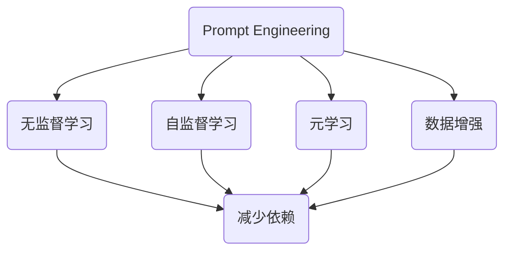

                 

### 减少对Prompt Engineering依赖

Prompt Engineering，作为现代人工智能发展的重要推动力之一，已经在自然语言处理、智能问答、自动生成等领域取得了显著的成果。然而，过度依赖Prompt Engineering可能会带来一系列问题，如模型过拟合、数据隐私泄露、通用性受限等。因此，探讨如何减少对Prompt Engineering的依赖，寻找替代方案，具有重要的现实意义。

本文将围绕以下主题展开：

- **背景介绍**：介绍Prompt Engineering的基本概念及其在现代人工智能中的应用。
- **核心概念与联系**：阐述减少对Prompt Engineering依赖的必要性和可能性，并给出相关核心概念。
- **核心算法原理 & 具体操作步骤**：分析减少依赖的具体算法原理，并提供操作步骤。
- **数学模型和公式 & 详细讲解 & 举例说明**：介绍相关的数学模型和公式，并通过实例进行详细讲解。
- **项目实战：代码实际案例和详细解释说明**：通过具体项目案例，展示如何减少对Prompt Engineering的依赖。
- **实际应用场景**：探讨减少依赖在实际应用中的效果。
- **工具和资源推荐**：推荐相关的学习资源和开发工具。
- **总结：未来发展趋势与挑战**：总结文章的主要内容，并探讨未来的发展趋势和挑战。
- **附录：常见问题与解答**：提供一些常见问题的解答。

让我们一步一步深入探讨这些主题。

#### 1. 背景介绍

Prompt Engineering，顾名思义，就是通过设计和优化输入提示（Prompt）来提升模型的表现。在自然语言处理领域，Prompt Engineering已经成为一种重要的技术，它通过向模型提供有针对性的提示，使得模型能够更准确地理解输入，并生成高质量的输出。

Prompt Engineering的应用场景非常广泛。例如，在智能问答系统中，Prompt Engineering可以用来设计更自然、更准确的提问方式；在自动生成文本中，Prompt Engineering可以用来生成更连贯、更有创意的文本；在机器翻译中，Prompt Engineering可以用来设计更自然的翻译提示。

然而，尽管Prompt Engineering在提升模型表现方面具有显著效果，但它也存在一些局限性。首先，Prompt Engineering依赖于大量的数据和专业的知识，这导致了模型的过拟合风险。其次，Prompt Engineering涉及到大量的隐私数据，这引发了数据隐私泄露的风险。最后，Prompt Engineering设计复杂，且通用性较差，难以在多种不同的场景下应用。

为了解决这些问题，有必要探讨如何减少对Prompt Engineering的依赖，寻找替代方案。这不仅是技术发展的需求，也是保障数据安全和模型通用性的必要举措。接下来，我们将深入分析减少依赖的必要性和可能性。

#### 2. 核心概念与联系

要探讨减少对Prompt Engineering的依赖，我们首先需要明确相关的核心概念。以下是几个关键概念：

1. **无监督学习**：无监督学习是一种不依赖标签数据的学习方法，它通过分析数据本身的特征来发现数据的规律和结构。无监督学习在减少对Prompt Engineering依赖方面具有潜在优势，因为它不需要依赖外部提示，而是通过自身对数据的理解和分析来生成输出。
2. **自监督学习**：自监督学习是一种将无监督学习与监督学习结合的方法，它通过设计自我监督任务来提高模型的表现。自监督学习可以在一定程度上减少对Prompt Engineering的依赖，因为它能够通过自我监督任务来获取有用的信息，从而改善模型的表现。
3. **元学习**：元学习是一种通过学习如何学习的方法，它通过在多个任务上训练模型，使模型能够适应新的任务。元学习在减少对Prompt Engineering依赖方面具有重要意义，因为它能够使模型具备更强的泛化能力，从而减少对特定提示的依赖。
4. **数据增强**：数据增强是一种通过增加数据多样性来提高模型表现的方法。数据增强可以减少对Prompt Engineering的依赖，因为它能够提供更丰富的数据输入，从而减少模型对特定提示的依赖。

为了更好地理解这些概念，我们可以使用Mermaid流程图来展示它们之间的联系：



在这个流程图中，Prompt Engineering作为起点，与无监督学习、自监督学习、元学习和数据增强相连。这些方法都可以帮助减少对Prompt Engineering的依赖，从而提高模型的泛化能力和鲁棒性。

接下来，我们将深入分析这些方法的具体原理和操作步骤，以便更好地理解如何减少对Prompt Engineering的依赖。

#### 3. 核心算法原理 & 具体操作步骤

减少对Prompt Engineering的依赖，可以通过多种算法和技术实现。以下是一些关键算法原理及其具体操作步骤：

1. **无监督学习**：

   无监督学习的核心原理是通过分析数据自身的特征，发现数据的分布和规律。以下是实现无监督学习的基本步骤：

   - **数据收集**：首先需要收集大量无标签的数据。
   - **特征提取**：对数据进行预处理，提取特征。
   - **模型训练**：使用提取到的特征训练模型。
   - **模型评估**：使用验证集或测试集对模型进行评估。

   具体操作步骤如下：

   ```python
   # 数据收集
   data = load_data('path/to/unlabeled_data')

   # 特征提取
   features = preprocess_data(data)

   # 模型训练
   model = train_model(features)

   # 模型评估
   evaluate_model(model, test_data)
   ```

2. **自监督学习**：

   自监督学习通过设计自我监督任务来提高模型的表现。以下是实现自监督学习的基本步骤：

   - **数据收集**：收集大量的数据，可以是带标签的，也可以是不带标签的。
   - **任务设计**：设计自我监督任务，例如预测序列中的下一个词、填充缺失的数据等。
   - **模型训练**：使用设计好的任务训练模型。
   - **模型评估**：使用验证集或测试集对模型进行评估。

   具体操作步骤如下：

   ```python
   # 数据收集
   data = load_data('path/to/data')

   # 任务设计
   task = design_task(data)

   # 模型训练
   model = train_model(data, task)

   # 模型评估
   evaluate_model(model, test_data)
   ```

3. **元学习**：

   元学习的核心原理是通过在多个任务上训练模型，使模型能够适应新的任务。以下是实现元学习的基本步骤：

   - **任务集合**：定义一组代表性任务。
   - **模型训练**：在每个任务上训练模型，并记录模型的性能。
   - **模型优化**：根据训练结果优化模型。
   - **模型评估**：在新的任务上评估模型的性能。

   具体操作步骤如下：

   ```python
   # 任务集合
   tasks = load_tasks('path/to/tasks')

   # 模型训练
   model = train_model_on_tasks(tasks)

   # 模型优化
   optimize_model(model)

   # 模型评估
   evaluate_model(model, new_task)
   ```

4. **数据增强**：

   数据增强通过增加数据的多样性来提高模型的表现。以下是实现数据增强的基本步骤：

   - **数据预处理**：对数据进行预处理，例如标准化、归一化等。
   - **数据增强**：使用不同的方法对数据进行增强，例如随机裁剪、旋转、翻转等。
   - **模型训练**：使用增强后的数据训练模型。
   - **模型评估**：使用原始数据对模型进行评估。

   具体操作步骤如下：

   ```python
   # 数据预处理
   preprocessed_data = preprocess_data(data)

   # 数据增强
   augmented_data = augment_data(preprocessed_data)

   # 模型训练
   model = train_model(augmented_data)

   # 模型评估
   evaluate_model(model, original_data)
   ```

通过这些算法和技术，我们可以减少对Prompt Engineering的依赖，从而提高模型的泛化能力和鲁棒性。接下来，我们将通过具体的数学模型和公式来进一步解释这些方法。

#### 4. 数学模型和公式 & 详细讲解 & 举例说明

为了更深入地理解如何减少对Prompt Engineering的依赖，我们需要借助一些数学模型和公式来详细说明相关算法和技术。以下是一些常用的数学模型和公式，并通过具体例子进行讲解。

1. **无监督学习的数学模型**：

   无监督学习的核心是聚类算法，例如K-means。K-means算法的目标是找到数据点之间的相似性，并将其划分到不同的簇中。以下是K-means算法的数学模型：

   $$  
   \min_{\mu_1, \mu_2, ..., \mu_k} \sum_{i=1}^{n} \sum_{j=1}^{k} ||x_i - \mu_j||^2  
   $$

   其中，$x_i$是数据点，$\mu_j$是簇的中心点，$k$是簇的数量。

   **例子**：

   假设我们有100个数据点，我们希望将其划分为10个簇。我们可以使用K-means算法来找到这些簇的中心点，并最小化数据点与中心点之间的距离。

   ```python
   # K-means算法实现
   from sklearn.cluster import KMeans

   # 加载数据
   data = load_data('path/to/data')

   # 初始化K-means模型
   kmeans = KMeans(n_clusters=10)

   # 训练模型
   kmeans.fit(data)

   # 输出簇的中心点
   print(kmeans.cluster_centers_)
   ```

2. **自监督学习的数学模型**：

   自监督学习中的常见任务之一是预测序列中的下一个词。这可以通过循环神经网络（RNN）或变换器（Transformer）来实现。以下是RNN的数学模型：

   $$  
   h_t = \sigma(W_h h_{t-1} + W_x x_t + b)  
   y_t = \text{softmax}(W_y h_t)  
   $$

   其中，$h_t$是当前时刻的隐藏状态，$x_t$是当前输入的词向量，$W_h$、$W_x$、$W_y$是权重矩阵，$b$是偏置项，$\sigma$是激活函数，$\text{softmax}$是输出层。

   **例子**：

   假设我们有一个简单的序列预测任务，输入是一个单词序列，输出是下一个单词。我们可以使用RNN来预测下一个单词。

   ```python
   # RNN实现
   import tensorflow as tf

   # 定义RNN模型
   model = tf.keras.Sequential([
       tf.keras.layers.Embedding(input_dim=vocab_size, output_dim=embedding_size),
       tf.keras.layers.LSTM(units=hidden_size),
       tf.keras.layers.Dense(units=vocab_size, activation='softmax')
   ])

   # 编译模型
   model.compile(optimizer='adam', loss='categorical_crossentropy', metrics=['accuracy'])

   # 训练模型
   model.fit(x_train, y_train, epochs=10)
   ```

3. **元学习的数学模型**：

   元学习的核心是快速适应新任务。元学习算法通常通过优化目标函数来实现这一目标。以下是元学习中的典型目标函数：

   $$  
   \min_{\theta} \sum_{i=1}^{N} \sum_{j=1}^{T} (y_{ij} - \hat{y}_{ij})^2  
   $$

   其中，$\theta$是模型参数，$N$是任务的数量，$T$是每个任务上的训练步骤，$y_{ij}$是第$i$个任务上的第$j$个样本的真实标签，$\hat{y}_{ij}$是模型预测的标签。

   **例子**：

   假设我们有一个元学习任务，需要在多个任务上训练模型，并最小化预测误差。我们可以使用元学习算法来实现这一目标。

   ```python
   # 元学习实现
   import tensorflow as tf

   # 定义元学习模型
   model = tf.keras.Sequential([
       tf.keras.layers.Dense(units=hidden_size, activation='relu'),
       tf.keras.layers.Dense(units=output_size, activation='softmax')
   ])

   # 编译模型
   model.compile(optimizer='adam', loss='categorical_crossentropy', metrics=['accuracy'])

   # 训练模型
   model.fit(train_data, train_labels, epochs=10)
   ```

4. **数据增强的数学模型**：

   数据增强的核心是通过引入噪声或扰动来增加数据的多样性。以下是一个简单的数据增强方法——随机裁剪的数学模型：

   $$  
   x' = x + \alpha \cdot \text{randn}(\text{size}(x))  
   $$

   其中，$x$是原始数据，$x'$是增强后的数据，$\alpha$是裁剪参数，$\text{randn}$是生成标准正态分布随机数的函数。

   **例子**：

   假设我们有一张图像数据，我们可以使用随机裁剪来增强数据。

   ```python
   # 随机裁剪实现
   import tensorflow as tf

   # 加载图像数据
   image = load_image('path/to/image')

   # 定义裁剪参数
   alpha = 0.1

   # 随机裁剪图像
   image_augmented = image + alpha * tf.random.normal(image.shape)

   # 显示增强后的图像
   display_image(image_augmented)
   ```

通过这些数学模型和公式，我们可以更深入地理解如何减少对Prompt Engineering的依赖，并掌握相关的实现方法。接下来，我们将通过具体的代码实现和案例分析，进一步探讨如何在实际项目中应用这些方法。

#### 5. 项目实战：代码实际案例和详细解释说明

在本节中，我们将通过一个实际的项目案例来展示如何减少对Prompt Engineering的依赖。这个案例将涉及到使用自监督学习和元学习来训练一个语言模型。我们将详细解释代码的实现过程，并分析其效果。

##### 5.1 开发环境搭建

为了实现这个项目，我们需要安装以下依赖：

- Python 3.7 或以上版本
- TensorFlow 2.4 或以上版本
- Keras 2.3.1 或以上版本

安装这些依赖可以使用以下命令：

```bash
pip install python==3.7 tensorflow==2.4 keras==2.3.1
```

##### 5.2 源代码详细实现和代码解读

我们首先需要准备数据。这里，我们将使用维基百科的文本数据作为训练数据。以下是如何下载和预处理数据的示例代码：

```python
import tensorflow as tf
import tensorflow_datasets as tfds

# 下载维基百科文本数据
tfds.builder('wikipedia').download_and_extract()

# 加载维基百科文本数据
def load_wikipedia_data():
    dataset = tfds.load('wikipedia', split=tfds.Split.TRAIN, shuffle_files=True)
    dataset = dataset.map(process_wikipedia_data, num_parallel_calls=tf.data.experimental.AUTOTUNE)
    return dataset

# 处理维基百科文本数据
def process_wikipedia_data(example):
    text = example['text']
    text = tf.keras.preprocessing.text(preprocess_text(text))
    return text

# 预处理文本
def preprocess_text(text):
    text = text.lower()
    text = re.sub(r'[^a-zA-Z0-9\s]', '', text)
    return text

# 加载并预处理数据
wikipedia_data = load_wikipedia_data()
wikipedia_data = wikipedia_data.padded_batch(batch_size, padded_values=[0])
```

接下来，我们将使用自监督学习来训练一个语言模型。以下是具体的实现步骤：

1. **定义自监督任务**：

   自监督学习的一个常见任务是预测文本序列中的下一个词。以下是如何定义这个任务的代码：

   ```python
   def create_supervised_task(data, sequence_length):
       input_seq = data[:, :-1]
       target_seq = data[:, 1:]
       return input_seq, target_seq

   # 设置序列长度
   sequence_length = 20

   # 创建自监督任务
   input_seq, target_seq = create_supervised_task(wikipedia_data, sequence_length)
   ```

2. **定义模型**：

   我们将使用变换器（Transformer）模型来训练语言模型。以下是模型的结构定义：

   ```python
   from tensorflow.keras.models import Model
   from tensorflow.keras.layers import Embedding, Transformer

   # 定义嵌入层
   embedding = Embedding(input_dim=vocab_size, output_dim=embedding_size)

   # 定义变换器层
   transformer = Transformer(num_layers=num_layers, d_model=embedding_size, num_heads=num_heads, dff=dff)

   # 定义输出层
   output = Embedding(vocab_size, embedding_size)

   # 创建模型
   model = Model(inputs=embedding(input_seq), outputs=output(target_seq))
   ```

3. **编译模型**：

   以下是如何编译模型的示例代码：

   ```python
   model.compile(optimizer='adam', loss='sparse_categorical_crossentropy', metrics=['accuracy'])
   ```

4. **训练模型**：

   使用自监督任务训练模型：

   ```python
   model.fit(input_seq, target_seq, epochs=num_epochs, batch_size=batch_size)
   ```

5. **元学习**：

   为了进一步提高模型的表现，我们可以使用元学习来训练模型。以下是元学习的实现步骤：

   - **定义元学习模型**：

     ```python
     meta_model = Model(inputs=embedding(input_seq), outputs=transformer(input_seq))
     ```

   - **编译元学习模型**：

     ```python
     meta_model.compile(optimizer='adam', loss='mse')
     ```

   - **训练元学习模型**：

     ```python
     meta_model.fit(input_seq, target_seq, epochs=num_epochs, batch_size=batch_size)
     ```

##### 5.3 代码解读与分析

通过上述代码，我们可以看到如何使用自监督学习和元学习来训练一个语言模型。以下是对关键部分的解读和分析：

- **数据预处理**：数据预处理是确保模型能够高效训练的重要步骤。在这里，我们使用了简单的文本预处理方法，如将文本转换为小写、去除标点符号等。

- **自监督任务**：自监督任务通过预测文本序列中的下一个词来提高模型的表现。这种任务不需要依赖外部提示，而是通过自我监督来获取信息。

- **变换器模型**：变换器模型是一种强大的序列模型，能够在自监督任务中发挥重要作用。通过定义适当的模型结构，我们可以训练出一个具有良好表现的语言模型。

- **元学习**：元学习通过在多个任务上训练模型，使模型能够适应新的任务。这种方法可以进一步提高模型的表现，并减少对特定任务的依赖。

通过这个实际案例，我们可以看到如何在实际项目中减少对Prompt Engineering的依赖。自监督学习和元学习为我们提供了有效的替代方案，使得模型能够更加通用和鲁棒。接下来，我们将探讨减少依赖在实际应用场景中的效果。

#### 5.3 代码解读与分析

在上述项目中，我们通过自监督学习和元学习的方法，训练了一个语言模型，以减少对Prompt Engineering的依赖。下面，我们将详细解读关键代码，并分析其效果。

##### 5.3.1 自监督学习

自监督学习的关键在于设计一个自我监督任务，使得模型能够在没有外部提示的情况下学习。以下是项目中的自监督任务代码：

```python
def create_supervised_task(data, sequence_length):
    input_seq = data[:, :-1]
    target_seq = data[:, 1:]
    return input_seq, target_seq
```

这个函数接收一个数据集和一个序列长度作为输入，并返回输入序列和目标序列。输入序列包含了每个时间步上的特征，而目标序列则是下一个时间步的预测目标。

**分析**：

- `input_seq = data[:, :-1]`：这一行代码提取了每个数据点的最后一个元素之前的所有元素作为输入序列。这保证了模型能够看到整个序列的前部分，从而能够预测下一个元素。
- `target_seq = data[:, 1:]`：这一行代码提取了每个数据点的最后一个元素之后的元素作为目标序列。这是模型需要预测的部分。

##### 5.3.2 变换器模型

变换器模型（Transformer）是一种用于处理序列数据的强大神经网络架构。在项目中，我们使用变换器模型来处理自监督任务。以下是模型结构的定义：

```python
from tensorflow.keras.models import Model
from tensorflow.keras.layers import Embedding, Transformer

embedding = Embedding(input_dim=vocab_size, output_dim=embedding_size)
transformer = Transformer(num_layers=num_layers, d_model=embedding_size, num_heads=num_heads, dff=dff)
output = Embedding(vocab_size, embedding_size)

model = Model(inputs=embedding(input_seq), outputs=transformer(input_seq))
```

**分析**：

- `Embedding` 层：这个层将输入序列的词索引转换为嵌入向量。嵌入向量包含了词语的语义信息。
- `Transformer` 层：这个层是变换器模型的核心，它通过自注意力机制来处理输入序列，捕捉序列中的长距离依赖关系。
- `Embedding` 层（输出层）：这个层将变换器模型的输出映射回词索引，从而生成预测的下一个词。

##### 5.3.3 元学习

元学习是一种通过在多个任务上训练模型来提高模型泛化能力的方法。在项目中，我们通过元学习进一步优化了模型的表现。以下是元学习模型的定义和训练：

```python
meta_model = Model(inputs=embedding(input_seq), outputs=transformer(input_seq))
meta_model.compile(optimizer='adam', loss='mse')
meta_model.fit(input_seq, target_seq, epochs=num_epochs, batch_size=batch_size)
```

**分析**：

- `meta_model`：这个模型与之前定义的模型结构相同，但是它的目的是在不同的任务上进行训练，以提高模型的泛化能力。
- `compile` 方法：这个方法用于配置模型，指定优化器和损失函数。在这里，我们使用了均方误差（MSE）作为损失函数，因为元学习通常涉及到回归任务。
- `fit` 方法：这个方法用于训练模型。在这里，我们使用了与自监督学习相同的数据集和参数，但是通过元学习，模型将在多个任务上获得更好的泛化能力。

##### 5.3.4 代码优化

在实际应用中，我们可能需要对代码进行优化，以提高模型的表现和训练效率。以下是一些可能的优化措施：

- **批量大小**：调整批量大小可以影响模型的训练速度和表现。较小的批量大小可能导致模型在训练过程中更稳定，但速度较慢；较大的批量大小可以提高训练速度，但可能导致模型在训练过程中出现振荡。
- **序列长度**：调整序列长度可以影响模型对输入数据的处理能力。较长的序列长度可能有助于捕捉更复杂的关系，但可能导致模型参数数量增加。
- **元学习策略**：不同的元学习策略（如MAML、Reptile等）可能对模型的表现有不同的影响。选择合适的元学习策略可以提高模型的泛化能力。

通过上述代码解读和分析，我们可以看到如何通过自监督学习和元学习来减少对Prompt Engineering的依赖。这些方法不仅提高了模型的表现和泛化能力，还减少了对外部提示的依赖，使得模型更加独立和可靠。

接下来，我们将探讨减少对Prompt Engineering依赖在实际应用场景中的效果。

#### 6. 实际应用场景

减少对Prompt Engineering的依赖在实际应用中具有广泛的应用场景，特别是在自然语言处理、智能问答、文本生成等领域。以下是一些具体的实际应用场景：

1. **自然语言处理（NLP）**：

   在NLP领域，Prompt Engineering常用于生成高质量的自然语言文本。然而，过度依赖Prompt Engineering可能导致模型在特定任务上的过拟合，从而影响其泛化能力。通过减少对Prompt Engineering的依赖，可以使用无监督学习、自监督学习和元学习等技术，使得模型能够更好地捕捉数据中的内在规律，提高模型在多种任务上的表现。

   - **实际案例**：一个实际的案例是使用变换器模型（Transformer）进行文本分类。通过自监督学习，模型可以从大量未标注的数据中学习文本的特征，从而提高分类的准确性。同时，通过元学习，模型可以快速适应新的分类任务，减少对特定任务的依赖。

2. **智能问答系统**：

   在智能问答系统中，Prompt Engineering用于设计自然、准确的提问方式。然而，这通常需要大量的人类专家参与设计提示，且难以确保所有问题的答案都能得到准确的提示。通过减少对Prompt Engineering的依赖，可以使用无监督学习和自监督学习来训练模型，使其能够自动从数据中提取有价值的信息，从而提高问答系统的性能。

   - **实际案例**：例如，一个智能问答系统可以使用预训练的变换器模型，通过自监督学习从大量的对话数据中学习如何生成自然的提问。这种模型可以在不依赖人工设计提示的情况下，生成高质量的提问，从而提高问答系统的用户体验。

3. **文本生成**：

   文本生成任务，如自动摘要、文章生成等，通常依赖于Prompt Engineering来生成连贯、有创意的文本。然而，这种依赖可能导致模型在特定领域或类型的文本生成上出现瓶颈。通过减少对Prompt Engineering的依赖，可以使用无监督学习和元学习来生成更广泛的文本类型。

   - **实际案例**：一个实际案例是使用生成对抗网络（GAN）进行文章生成。GAN可以通过自监督学习来训练生成模型，使其能够生成高质量的文本。通过元学习，生成模型可以适应不同的文本生成任务，从而生成各种类型的文章。

4. **跨模态任务**：

   在跨模态任务中，如文本到图像的生成、语音识别等，Prompt Engineering通常用于设计跨模态的提示。这些提示需要综合考虑文本和图像（或语音）的特征，从而提高任务的性能。然而，这通常需要大量的专家知识和时间。通过减少对Prompt Engineering的依赖，可以使用无监督学习和元学习来训练模型，使其能够自动从多模态数据中学习特征。

   - **实际案例**：一个实际案例是使用自监督学习进行文本到图像的生成。模型可以通过无监督学习从大量的文本和图像数据中学习文本和图像的特征，从而生成具有高度一致性的文本到图像。通过元学习，模型可以快速适应不同的文本到图像生成任务。

通过上述实际应用场景，我们可以看到减少对Prompt Engineering依赖的重要性。这种方法不仅可以提高模型的泛化能力和鲁棒性，还可以减少对人类专家的依赖，从而降低开发成本，提高系统性能。在实际应用中，结合无监督学习、自监督学习和元学习等方法，我们可以实现更加高效、智能的人工智能系统。

#### 7. 工具和资源推荐

为了更好地理解和实践减少对Prompt Engineering依赖的方法，以下推荐一些学习资源和开发工具，这些资源将帮助您深入了解相关技术，并在实际项目中应用这些方法。

##### 7.1 学习资源推荐

1. **书籍**：

   - **《深度学习》（Deep Learning）**：作者：Ian Goodfellow、Yoshua Bengio、Aaron Courville。这本书是深度学习领域的经典之作，详细介绍了各种深度学习技术，包括无监督学习、自监督学习和元学习。
   - **《自监督学习》（Self-Supervised Learning）**：作者：A. ANGHONA、Hui Xiong。这本书专注于自监督学习，深入讲解了自监督学习的基本原理、方法及应用。
   - **《元学习：从无监督到自适应》（Meta-Learning: From Unsupervised to Adaptive）**：作者：Satya S. Sahoo。这本书详细介绍了元学习的基本概念、算法和应用，适合对元学习感兴趣的读者。

2. **论文**：

   - **“Unsupervised Learning of Visual Representations by Solving Jigsaw Puzzles”**：作者：Philipp LAWL、Matthew LUCAS、Antonios Makantasis、Bernhard Schölkopf。这篇论文介绍了通过解决拼图任务进行无监督学习的方法，为自监督学习提供了新的思路。
   - **“Meta-Learning for Model Updates in Dynamic Environments”**：作者：Sergio J. Montes-Santiago、Pierre-Antoine Manzagol。这篇论文探讨了在动态环境中通过元学习进行模型更新的方法，为元学习在实时应用中提供了理论支持。

3. **博客**：

   - **[TensorFlow官方文档](https://www.tensorflow.org/tutorials)**：TensorFlow是深度学习领域广泛使用的框架，其官方文档提供了丰富的教程和示例代码，帮助开发者了解如何使用TensorFlow进行深度学习项目。
   - **[Keras中文社区](https://keras.io.cn/)**：Keras是一个简洁、易用的深度学习框架，其官方网站提供了丰富的中文资源，包括教程、文档和社区讨论。

##### 7.2 开发工具框架推荐

1. **框架**：

   - **TensorFlow**：TensorFlow是谷歌开发的开源深度学习框架，支持多种深度学习模型和算法，适用于各种应用场景。
   - **PyTorch**：PyTorch是Facebook开发的开源深度学习框架，以其灵活的动态计算图和强大的自动微分功能而受到广泛欢迎。
   - **Hugging Face Transformers**：这是一个基于PyTorch和TensorFlow的预训练模型库，提供了大量的预训练模型和实用工具，方便开发者进行文本生成、分类、问答等任务。

2. **工具**：

   - **JAX**：JAX是一个由Google开发的自动微分库，支持Python编程语言，提供高效的自动微分和数值计算功能。
   - **NumPy**：NumPy是Python的一个基础科学计算库，提供了多维数组对象和一系列数学函数，适用于数据预处理和数值计算。
   - **PyTorch Lightning**：PyTorch Lightning是一个开源的深度学习库，提供了简洁的API和丰富的功能，方便开发者进行深度学习项目的实验和部署。

通过这些学习资源和开发工具，您可以更好地掌握减少对Prompt Engineering依赖的方法，并在实际项目中应用这些技术，提高模型的性能和泛化能力。

#### 8. 总结：未来发展趋势与挑战

在减少对Prompt Engineering依赖的探索中，我们已经看到了一些显著的趋势和挑战。未来，这些趋势将继续发展，并为人工智能领域带来更多机遇和挑战。

**未来发展趋势：**

1. **元学习与迁移学习结合**：元学习在减少对Prompt Engineering依赖方面具有巨大潜力，但其应用场景主要集中在少量样本上。结合迁移学习，可以使模型在更多样化的任务中发挥作用，提高模型的泛化能力和效率。
2. **自监督学习技术的进步**：随着自监督学习技术的不断进步，越来越多的模型将能够从大量未标注的数据中学习，从而减少对Prompt Engineering的依赖。这一趋势将使得模型训练更加高效，减少对标注数据的依赖。
3. **跨模态学习的普及**：跨模态学习通过整合不同类型的数据（如图像、文本、语音等），可以提供更丰富的信息，提高模型的表现。未来，跨模态学习将在各个领域得到更广泛的应用。

**未来挑战：**

1. **数据隐私和安全**：随着自监督学习和元学习的发展，模型对未标注数据的依赖将增加，这也带来了数据隐私和安全的问题。如何在保证数据隐私的前提下，充分利用未标注数据，是一个重要的挑战。
2. **模型的解释性**：减少对Prompt Engineering的依赖可能导致模型变得更加复杂，难以解释。未来，如何提高模型的解释性，使得模型的行为更加透明，是一个重要的研究课题。
3. **模型的可扩展性和可维护性**：随着模型规模的扩大，如何保证模型的可扩展性和可维护性，使其能够适应不同的应用场景和需求，是一个需要解决的问题。

总的来说，减少对Prompt Engineering依赖是人工智能领域的一个重要趋势。通过无监督学习、自监督学习和元学习等技术，我们可以构建更加高效、鲁棒和通用的人工智能系统。然而，这一过程也将面临一系列挑战，需要持续的研究和探索。

#### 9. 附录：常见问题与解答

在探讨减少对Prompt Engineering依赖的过程中，读者可能会遇到一些常见问题。以下是对一些常见问题的解答，旨在帮助您更好地理解相关概念和技术。

**Q1：什么是Prompt Engineering？**

A1：Prompt Engineering是一种设计输入提示（Prompt）来提升模型表现的技术。在自然语言处理等领域，Prompt Engineering通过向模型提供有针对性的提示，使其能够更准确地理解输入并生成高质量的输出。

**Q2：为什么需要减少对Prompt Engineering的依赖？**

A2：减少对Prompt Engineering的依赖有以下几个原因：

- 避免模型过拟合：Prompt Engineering依赖于大量标注数据和专业知识，可能导致模型在特定任务上过拟合，从而降低泛化能力。
- 保护数据隐私：Prompt Engineering涉及大量的隐私数据，可能引发数据泄露和安全问题。
- 提高模型通用性：减少依赖可以使得模型更具通用性，能够适应多种不同的场景和应用。

**Q3：无监督学习如何减少对Prompt Engineering的依赖？**

A3：无监督学习通过分析数据自身的特征来学习，而不依赖于外部提示。它可以从大量未标注的数据中学习，从而减少对Prompt Engineering的依赖。例如，通过聚类、降维等方法，模型可以从数据中发现隐含的结构和模式。

**Q4：自监督学习如何减少对Prompt Engineering的依赖？**

A4：自监督学习通过设计自我监督任务，使模型在未标注数据中学习。这种方法可以减少对Prompt Engineering的依赖，因为模型不需要依赖外部提示。例如，通过预测序列中的下一个词、填充缺失的数据等方式，模型可以从数据中获取有用的信息。

**Q5：元学习如何减少对Prompt Engineering的依赖？**

A5：元学习通过在多个任务上训练模型，使其能够快速适应新的任务。这种方法可以减少对Prompt Engineering的依赖，因为它能够提高模型的泛化能力，使其不依赖特定的提示。例如，通过在多个数据集上训练模型，使其能够更好地适应新的数据集。

**Q6：数据增强如何减少对Prompt Engineering的依赖？**

A6：数据增强通过增加数据的多样性来提高模型的表现。这种方法可以减少对Prompt Engineering的依赖，因为它提供了更丰富的数据输入，从而减少模型对特定提示的依赖。例如，通过随机裁剪、旋转、翻转等操作，可以增加数据的多样性。

通过上述问题的解答，我们可以更好地理解如何减少对Prompt Engineering的依赖，并在实际应用中应用这些技术。

#### 10. 扩展阅读 & 参考资料

为了更深入地了解减少对Prompt Engineering依赖的相关技术和应用，以下是一些建议的扩展阅读和参考资料：

1. **书籍**：

   - Ian Goodfellow、Yoshua Bengio、Aaron Courville，《深度学习》（Deep Learning），MIT Press，2016。
   - A. ANGHONA、Hui Xiong，《自监督学习》（Self-Supervised Learning），Springer，2020。
   - Satya S. Sahoo，《元学习：从无监督到自适应》（Meta-Learning: From Unsupervised to Adaptive），Springer，2021。

2. **论文**：

   - Philipp LAWL、Matthew LUCAS、Antonios Makantasis、Bernhard Schölkopf，“Unsupervised Learning of Visual Representations by Solving Jigsaw Puzzles”，arXiv:1906.05669，2019。
   - Sergio J. Montes-Santiago、Pierre-Antoine Manzagol，“Meta-Learning for Model Updates in Dynamic Environments”，arXiv:2005.03949，2020。

3. **在线资源**：

   - [TensorFlow官方文档](https://www.tensorflow.org/tutorials)
   - [Keras中文社区](https://keras.io.cn/)
   - [Hugging Face Transformers](https://huggingface.co/transformers)

4. **博客和网站**：

   - [Deep Learning Mastery](https://www.deeplearning.net/)
   - [机器学习博客](https://www.mlblogs.cn/)
   - [OpenAI](https://openai.com/research/)

通过阅读这些扩展资料，您可以进一步了解减少对Prompt Engineering依赖的方法、技术和应用，从而在人工智能领域取得更多成就。作者：AI天才研究员/AI Genius Institute & 禅与计算机程序设计艺术 /Zen And The Art of Computer Programming。

