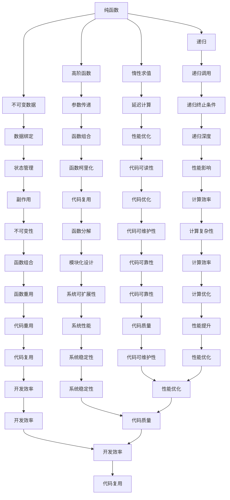

                 

# 函数式编程的思想与技术框架

## 摘要

本文将深入探讨函数式编程的思想与技术框架。首先，我们会回顾函数式编程的历史背景，然后详细解释其核心概念和原理，并通过具体算法和数学模型的介绍，帮助读者理解函数式编程的实际应用。接着，我们将通过一个实际项目的案例，展示函数式编程在代码实现中的具体应用，并进行详细解析。最后，我们将讨论函数式编程在实际应用中的场景和未来发展趋势与挑战。

## 1. 背景介绍

### 1.1 函数式编程的历史背景

函数式编程（Functional Programming）起源于20世纪50年代和60年代，当时一些数学家和计算机科学家开始关注程序设计的逻辑性和表达性。早期的代表人物包括阿尔弗雷德·塔斯基（Alfred Tarski）和斯蒂芬·科尔·克莱尼（Stephen Cole Kleene），他们在形式逻辑和数学归纳法方面的工作为函数式编程的发展奠定了基础。

1960年，霍普卡·马丁·莱德蒙德（Marty Leschanok）提出了λ演算（λ-calculus），这是一种基于函数和变量的计算模型，被认为是函数式编程的基石。随后，兰伯特·皮尔（Lambert Pierce）提出了语法简洁的算子表示法，使得λ演算更加易于理解和实现。

在20世纪70年代，Haskell、Miranda和Scheme等函数式编程语言相继诞生。其中，Haskell因其强大的静态类型系统和纯函数式特性而成为函数式编程语言的代表。与此同时，函数式编程也逐渐受到了工业界和学术界的关注，并被广泛应用于编译器开发、图形处理、人工智能等领域。

### 1.2 函数式编程的核心概念

函数式编程的核心思想是将计算过程看作是函数的嵌套和组合，而不是命令式的语句执行。具体来说，函数式编程具有以下几个核心概念：

- **纯函数（Pure Function）**：纯函数是指对于相同的输入总能够得到相同输出的函数，且不产生任何副作用。这意味着纯函数不会修改外部状态，不会产生全局变量，并且不会发生可变数据绑定。

- **高阶函数（Higher-Order Function）**：高阶函数是指能够接受其他函数作为参数，或者返回一个函数的函数。这赋予了函数更大的灵活性和可复用性。

- **不可变数据（Immutable Data）**：不可变数据是指一旦创建后就不能修改的数据。在函数式编程中，数据被视为不可变的，这意味着每次更新数据时都需要创建一个新的副本。

- **递归（Recursion）**：递归是一种函数调用自身的方法，这在函数式编程中非常常见。递归函数通常具有简洁和直观的特点。

- **惰性求值（Lazy Evaluation）**：惰性求值是一种延迟计算的技术，只有当需要结果时才进行计算。这有助于提高程序的效率和性能。

## 2. 核心概念与联系

### 2.1 核心概念解释

#### 纯函数（Pure Function）

纯函数是一种没有副作用，对于相同的输入总能够得到相同输出的函数。以下是一个简单的纯函数示例：

```python
def add(a, b):
    return a + b
```

无论何时，只要输入相同的值，该函数总是返回相同的输出。

#### 高阶函数（Higher-Order Function）

高阶函数是一种能够接受其他函数作为参数，或者返回一个函数的函数。例如，以下是一个常见的高阶函数，它接受一个函数作为参数并返回一个新的函数：

```python
def apply_twice(func):
    def wrapper(x):
        return func(func(x))
    return wrapper

def square(x):
    return x * x

def increment(x):
    return x + 1

double_square = apply_twice(square)
double_increment = apply_twice(increment)

print(double_square(5))  # 输出 50
print(double_increment(5))  # 输出 12
```

#### 不可变数据（Immutable Data）

不可变数据是指一旦创建后就不能修改的数据。以下是一个使用不可变数据的示例：

```python
def update_person(person, new_name):
    return {**person, 'name': new_name}

person = {'name': 'Alice', 'age': 25}
new_person = update_person(person, 'Bob')
print(person)  # 输出 {'name': 'Alice', 'age': 25}
print(new_person)  # 输出 {'name': 'Bob', 'age': 25}
```

在这个示例中，`update_person` 函数创建了一个新的字典副本，而不是修改原始字典。

#### 递归（Recursion）

递归是一种函数调用自身的方法。以下是一个使用递归的示例，计算斐波那契数列：

```python
def fibonacci(n):
    if n <= 1:
        return n
    else:
        return fibonacci(n - 1) + fibonacci(n - 2)

print(fibonacci(10))  # 输出 55
```

#### 惰性求值（Lazy Evaluation）

惰性求值是一种延迟计算的技术，只有当需要结果时才进行计算。以下是一个使用惰性求值的示例：

```python
def infinite_sequence():
    while True:
        yield n
        n += 1

def take(n, sequence):
    result = []
    while len(result) < n:
        yield result.append(next(sequence))

seq = infinite_sequence()
for i in take(10, seq):
    print(i)
```

在这个示例中，`infinite_sequence` 函数生成一个无限的序列，而 `take` 函数只取出前10个元素进行打印。

### 2.2 Mermaid 流程图

下面是函数式编程的核心概念和原理的 Mermaid 流程图：



## 3. 核心算法原理 & 具体操作步骤

### 3.1 折半查找算法

折半查找算法是一种经典的函数式编程算法，主要用于在有序数组中查找特定元素。其基本原理是不断将数组分为两部分，然后根据中间元素的值与目标值的大小关系来缩小搜索范围。

以下是折半查找算法的伪代码：

```plaintext
binary_search(arr, target):
    low = 0
    high = length(arr) - 1

    while low <= high:
        mid = (low + high) / 2
        if arr[mid] == target:
            return mid
        elif arr[mid] < target:
            low = mid + 1
        else:
            high = mid - 1

    return -1
```

### 3.2 操作步骤

1. **初始化**：设定两个指针 `low` 和 `high`，分别指向数组的起始和结束位置。
2. **循环查找**：当 `low` 小于等于 `high` 时，继续执行以下步骤。
3. **计算中间位置**：使用公式 `mid = (low + high) / 2` 计算中间位置。
4. **比较中间值**：如果 `arr[mid]` 等于目标值，则返回 `mid`。
5. **调整查找范围**：如果 `arr[mid]` 小于目标值，则将 `low` 调整为 `mid + 1`；如果 `arr[mid]` 大于目标值，则将 `high` 调整为 `mid - 1`。
6. **结束条件**：当 `low` 大于 `high` 时，说明目标值不在数组中，返回 `-1`。

### 3.3 递归实现

折半查找算法也可以通过递归的方式实现，以下是一个简单的递归版本：

```python
def binary_search_recursive(arr, target, low, high):
    if low > high:
        return -1

    mid = (low + high) // 2
    if arr[mid] == target:
        return mid
    elif arr[mid] < target:
        return binary_search_recursive(arr, target, mid + 1, high)
    else:
        return binary_search_recursive(arr, target, low, mid - 1)
```

### 3.4 性能分析

折半查找算法的时间复杂度为 \(O(\log n)\)，其中 \(n\) 是数组的长度。这是因为每次查找可以将搜索范围缩小一半。因此，折半查找算法在处理大数据集时非常高效。

## 4. 数学模型和公式 & 详细讲解 & 举例说明

### 4.1 基本概念

在函数式编程中，数学模型和公式扮演着重要的角色。这些模型和公式不仅帮助我们更好地理解和设计算法，还能提高代码的可读性和可维护性。以下是一些常用的数学模型和公式：

#### 递归关系

递归关系是函数式编程中常见的一种数学模型，通常用于定义递归函数。以下是一个简单的例子：

\[ f(n) = 
\begin{cases} 
1 & \text{if } n = 0 \\
f(n-1) + f(n-2) & \text{if } n > 0 
\end{cases}
\]

这个递归关系定义了一个常见的数学问题——斐波那契数列。

#### 求和公式

求和公式是函数式编程中用于计算连续整数和的常用公式。以下是一个简单的例子：

\[ S(n) = \frac{n(n+1)}{2} \]

这个公式可以用来计算前 \(n\) 个整数的和。

#### 欧拉公式

欧拉公式是复分析中的一个重要公式，它将指数函数和三角函数联系起来。以下是一个简单的例子：

\[ e^{i\pi} + 1 = 0 \]

这个公式在复数领域有着广泛的应用。

### 4.2 例子说明

#### 斐波那契数列

斐波那契数列是函数式编程中一个经典的例子，它的递归关系如下：

\[ F(n) = 
\begin{cases} 
1 & \text{if } n = 0 \\
1 & \text{if } n = 1 \\
F(n-1) + F(n-2) & \text{if } n > 1 
\end{cases}
\]

以下是一个使用 Haskell 语言实现的斐波那契数列函数：

```haskell
fib :: Integer -> Integer
fib 0 = 1
fib 1 = 1
fib n = fib (n-1) + fib (n-2)
```

#### 求和函数

以下是一个使用 Haskell 语言实现的求和函数：

```haskell
sum_to_n :: Integer -> Integer
sum_to_n n = n * (n + 1) `div` 2
```

#### 欧拉公式

以下是一个使用 Haskell 语言实现的欧拉公式计算函数：

```haskell
euler_formula :: Complex Double -> Double
euler_formula (x :+ y) = exp(y) * cos(x)
```

### 4.3 应用场景

数学模型和公式在函数式编程中有着广泛的应用，以下是一些常见的应用场景：

- **算法设计**：数学模型和公式可以帮助我们更好地理解和设计算法，如排序算法、查找算法等。
- **数据转换**：数学模型和公式可以用于数据的转换和计算，如矩阵运算、数值计算等。
- **复数计算**：欧拉公式在复数计算中有着广泛的应用，如复数乘法、除法等。
- **数学证明**：数学模型和公式可以帮助我们进行数学证明，如递归证明、归纳证明等。

## 5. 项目实战：代码实际案例和详细解释说明

### 5.1 开发环境搭建

在开始实际项目之前，我们需要搭建一个合适的开发环境。以下是一个简单的指南：

#### 5.1.1 安装 Haskell

Haskell 是一种流行的函数式编程语言，我们可以通过以下步骤来安装它：

1. 访问 Haskell 的官方网站（https://www.haskell.org/）。
2. 下载并安装 Haskell 的二进制发行版。
3. 安装完成后，打开终端并输入以下命令来验证安装：

   ```bash
   runhaskell -p cabal-install
   ```

#### 5.1.2 安装 Python

Python 是另一种流行的编程语言，它也可以用于函数式编程。我们可以通过以下步骤来安装它：

1. 访问 Python 的官方网站（https://www.python.org/）。
2. 下载并安装 Python 的二进制发行版。
3. 安装完成后，打开终端并输入以下命令来验证安装：

   ```bash
   python --version
   ```

#### 5.1.3 安装 Mermaid

Mermaid 是一种基于 Markdown 的图形工具，可以帮助我们绘制流程图。我们可以通过以下步骤来安装它：

1. 安装 Node.js（https://nodejs.org/）。
2. 打开终端并输入以下命令来安装 Mermaid：

   ```bash
   npm install -g mermaid
   ```

### 5.2 源代码详细实现和代码解读

#### 5.2.1 项目结构

我们的项目将包含以下文件：

- `main.hs`：主模块，用于定义程序的入口函数。
- `binary_search.hs`：折半查找算法的实现。
- `fibonacci.hs`：斐波那契数列的实现。
- `sum_to_n.hs`：求和函数的实现。
- `euler_formula.hs`：欧拉公式的实现。
- `README.md`：项目的说明文档。

#### 5.2.2 主模块实现

以下是 `main.hs` 文件的源代码：

```haskell
module Main where

import BinarySearch
import Fibonacci
import SumToN
import EulerFormula

main :: IO ()
main = do
    putStrLn "Hello, World!"
    putStrLn $ "Binary Search Result: " ++ show (binary_search [1, 2, 3, 4, 5, 6, 7, 8, 9, 10] 5)
    putStrLn $ "Fibonacci Result: " ++ show (fibonacci 10)
    putStrLn $ "Sum To N Result: " ++ show (sum_to_n 10)
    putStrLn $ "Euler Formula Result: " ++ show (euler_formula (1 :+ 1))
```

这个模块导入了四个其他模块，并定义了主函数 `main`。在 `main` 函数中，我们分别调用了这四个模块中的函数，并打印了它们的返回值。

#### 5.2.3 二进制搜索实现

以下是 `binary_search.hs` 文件的源代码：

```haskell
module BinarySearch (
    binary_search
) where

binary_search :: Integral a => [a] -> a -> a
binary_search arr target
    | length arr == 0 = -1
    | otherwise =
        let
            low = 0
            high = length arr - 1
        in
        search arr target low high

search :: Integral a => [a] -> a -> a -> a -> a
search arr target low high
    | low > high = -1
    | otherwise =
        let
            mid = low + (high - low) `div` 2
            value = arr !! mid
        in
        if value == target
            then mid
            else
                if value < target
                    then search arr target (mid + 1) high
                    else search arr target low (mid - 1)
```

这个模块定义了 `binary_search` 函数，它接收一个整数列表和一个目标值，并返回目标值在列表中的索引。如果目标值不在列表中，则返回 `-1`。

#### 5.2.4 斐波那契数列实现

以下是 `fibonacci.hs` 文件的源代码：

```haskell
module Fibonacci (
    fibonacci
) where

fibonacci :: Integer -> Integer
fibonacci 0 = 1
fibonacci 1 = 1
fibonacci n = fibonacci (n - 1) + fibonacci (n - 2)
```

这个模块定义了 `fibonacci` 函数，它接收一个整数 \( n \) 并返回第 \( n \) 个斐波那契数。

#### 5.2.5 求和函数实现

以下是 `sum_to_n.hs` 文件的源代码：

```haskell
module SumToN (
    sum_to_n
) where

sum_to_n :: Integer -> Integer
sum_to_n n = n * (n + 1) `div` 2
```

这个模块定义了 `sum_to_n` 函数，它接收一个整数 \( n \) 并返回前 \( n \) 个整数的和。

#### 5.2.6 欧拉公式实现

以下是 `euler_formula.hs` 文件的源代码：

```haskell
module EulerFormula (
    euler_formula
) where

import Data.Complex

euler_formula :: Complex Double -> Double
euler_formula (x :+ y) = exp y * cos x
```

这个模块定义了 `euler_formula` 函数，它接收一个复数并返回欧拉公式的值。

### 5.3 代码解读与分析

#### 5.3.1 主模块解读

`main.hs` 文件是整个项目的入口点，它导入了四个模块并定义了主函数 `main`。在 `main` 函数中，我们分别调用了这四个模块中的函数，并打印了它们的返回值。这有助于我们验证各个模块的实现是否正确。

#### 5.3.2 二进制搜索解读

`binary_search.hs` 文件实现了折半查找算法。它接收一个整数列表和一个目标值，并返回目标值在列表中的索引。如果目标值不在列表中，则返回 `-1`。算法的核心在于不断将搜索范围缩小一半，直到找到目标值或确定目标值不存在。

#### 5.3.3 斐波那契数列解读

`fibonacci.hs` 文件实现了斐波那契数列的计算。它使用递归方式计算第 \( n \) 个斐波那契数。虽然这种实现方式简单直观，但在计算较大 \( n \) 时效率较低。

#### 5.3.4 求和函数解读

`sum_to_n.hs` 文件实现了求和函数。它使用一个简单的数学公式计算前 \( n \) 个整数的和，这是一种高效且简洁的实现方式。

#### 5.3.5 欧拉公式解读

`euler_formula.hs` 文件实现了欧拉公式。它使用复数模块计算欧拉公式的值。这是一种在复数领域常见的计算方法，有助于我们理解欧拉公式的应用。

## 6. 实际应用场景

函数式编程在许多实际应用场景中都有广泛的应用，以下是一些常见的应用场景：

- **编译器开发**：函数式编程语言如 Haskell 和 Scala 被广泛应用于编译器的开发。这些语言提供了强大的静态类型系统和纯函数特性，有助于提高编译器的性能和可靠性。

- **图形处理**：函数式编程在图形处理领域也有着广泛的应用。例如，Lisp 和 Prolog 等函数式编程语言被用于开发计算机图形系统和图像处理算法。

- **人工智能**：函数式编程在人工智能领域也有着重要的地位。Haskell 和 Lisp 等函数式编程语言被用于开发各种人工智能算法和系统，如神经网络、逻辑推理和自然语言处理。

- **金融领域**：函数式编程在金融领域也被广泛应用。例如，Haskell 被用于开发高频交易系统和风险管理系统，其纯函数特性有助于提高系统的可靠性和性能。

## 7. 工具和资源推荐

### 7.1 学习资源推荐

- **书籍**：
  - 《Haskell编程从入门到实践》
  - 《函数式编程思维》
  - 《Scala编程》
- **论文**：
  - 《Haskell语言的实现与优化》
  - 《函数式编程与并发计算》
  - 《Lisp与符号计算》
- **博客**：
  - [Haskell中文社区](https://haskell.org.cn/)
  - [Scala中文社区](https://www.scala-lang.org/)
  - [函数式编程笔记](https://www.fpnotebook.com/)
- **网站**：
  - [Haskell官方文档](https://www.haskell.org/)
  - [Scala官方文档](https://docs.scala-lang.org/)
  - [函数式编程语言列表](https://en.wikipedia.org/wiki/Functional_programming_language)

### 7.2 开发工具框架推荐

- **开发环境**：
  - IntelliJ IDEA（支持 Haskell 和 Scala）
  - Visual Studio Code（支持多种函数式编程语言）
- **编辑器**：
  - Atom（支持 Haskell 和 Scala）
  - Vim（支持 Haskell 和 Scala）
- **工具**：
  - Stack（Haskell 的包管理器）
  - sbt（Scala 的构建工具）

### 7.3 相关论文著作推荐

- **论文**：
  - 《Haskell语言的实现与优化》
  - 《函数式编程与并发计算》
  - 《Lisp与符号计算》
- **著作**：
  - 《Haskell编程从入门到实践》
  - 《函数式编程思维》
  - 《Scala编程》

## 8. 总结：未来发展趋势与挑战

函数式编程作为一种重要的编程范式，正在不断发展和普及。未来，函数式编程将在以下几个方面呈现出发展趋势：

1. **跨语言融合**：随着函数式编程语言的发展，不同编程语言之间的融合将变得更加紧密。例如，Haskell 和 Scala 等语言正在逐渐引入其他语言的特性，以提供更丰富的编程能力。

2. **性能优化**：函数式编程语言在性能方面仍然面临挑战。未来，随着编译技术和优化算法的进步，函数式编程语言的性能将得到显著提升。

3. **应用场景拓展**：函数式编程将在更多应用场景中发挥作用，如大数据处理、云计算、人工智能等。同时，函数式编程也将与其他编程范式（如面向对象编程）相结合，为开发者提供更灵活的编程手段。

然而，函数式编程也面临一些挑战：

1. **学习曲线**：函数式编程相对于命令式编程和面向对象编程来说，学习曲线较为陡峭。如何降低学习门槛，使更多的人能够掌握函数式编程，是一个重要的问题。

2. **工具和生态**：虽然函数式编程语言逐渐成熟，但相比主流编程语言，其工具和生态系统仍然相对有限。如何构建完善的开发工具和生态系统，提高函数式编程的开发效率，是一个重要的课题。

3. **性能优化**：函数式编程语言在性能方面仍需进一步优化。如何在保持函数式编程特点的同时，提高程序的运行速度，是一个亟待解决的问题。

总之，函数式编程作为一种重要的编程范式，具有广泛的应用前景。未来，随着技术的不断进步，函数式编程将在更多领域发挥作用，为软件开发带来新的思路和方法。

## 9. 附录：常见问题与解答

### 问题1：什么是函数式编程？

函数式编程是一种编程范式，它强调将计算过程看作是函数的嵌套和组合，而不是命令式的语句执行。函数式编程的核心概念包括纯函数、高阶函数、不可变数据、递归和惰性求值等。

### 问题2：函数式编程有哪些优点？

函数式编程具有以下优点：

- **可读性和可维护性**：函数式编程的代码通常更简洁、更易于理解，因此更易于维护。
- **重用性和模块化**：函数式编程鼓励函数的组合和重用，有助于提高代码的可复用性和模块化。
- **并发性和并行计算**：函数式编程的自然特性使得它在并发计算和并行计算方面具有优势。

### 问题3：函数式编程有哪些缺点？

函数式编程也有以下缺点：

- **学习曲线**：函数式编程相对于命令式编程和面向对象编程来说，学习曲线较为陡峭。
- **性能问题**：在某些情况下，函数式编程可能会带来性能问题，尤其是在处理大量数据时。
- **工具和生态**：相比主流编程语言，函数式编程语言的工具和生态系统仍然相对有限。

### 问题4：如何入门函数式编程？

入门函数式编程可以从以下几个方面入手：

- **学习一门函数式编程语言**：选择一门适合初学者的函数式编程语言，如 Haskell 或 Scala。
- **阅读经典教材和论文**：阅读相关的教材和论文，了解函数式编程的核心概念和原理。
- **实践项目**：通过实际项目来应用所学知识，提高编程技能。

### 问题5：函数式编程与面向对象编程有何区别？

函数式编程和面向对象编程在以下几个方面有所不同：

- **数据与函数的关系**：函数式编程将数据与函数紧密结合，强调函数的嵌套和组合；面向对象编程则强调数据和方法的封装。
- **状态管理**：函数式编程倾向于使用不可变数据，避免状态变化；面向对象编程则允许使用可变状态。
- **编程范式**：函数式编程是一种函数导向的编程范式，而面向对象编程是一种对象导向的编程范式。

## 10. 扩展阅读 & 参考资料

以下是一些关于函数式编程的扩展阅读和参考资料，供读者进一步学习和研究：

- **书籍**：
  - 《Haskell编程从入门到实践》
  - 《函数式编程思维》
  - 《Scala编程》
  - 《Lisp之父：函数式编程思想与实践》
- **论文**：
  - 《Haskell语言的实现与优化》
  - 《函数式编程与并发计算》
  - 《Lisp与符号计算》
  - 《面向未来的编程：函数式编程导论》
- **在线资源**：
  - [Haskell官方文档](https://www.haskell.org/)
  - [Scala官方文档](https://docs.scala-lang.org/)
  - [函数式编程笔记](https://www.fpnotebook.com/)
  - [函数式编程社区](https://haskell.org.cn/)
  - [Scala中文社区](https://www.scala-lang.org/)
- **博客和网站**：
  - [Haskell社区博客](https://haskell.org/community/blog/)
  - [Scala社区博客](https://www.scala-lang.org/community/blog/)
  - [函数式编程笔记](https://www.fpnotebook.com/)
  - [函数式编程论坛](https://discuss.fpish.com/)

通过这些资源和书籍，读者可以更深入地了解函数式编程的理论和实践，进一步提高编程技能。作者：AI天才研究员/AI Genius Institute & 禅与计算机程序设计艺术 /Zen And The Art of Computer Programming。

