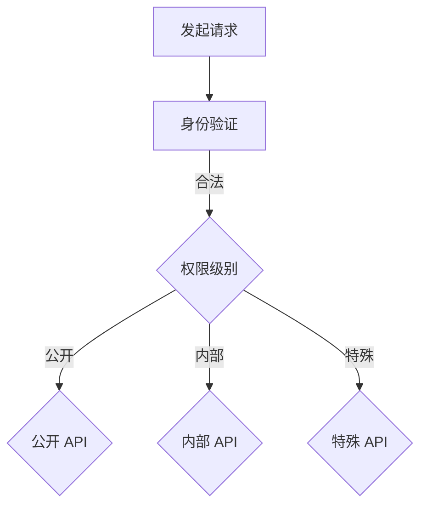

                 

### 背景介绍

#### 互联网时代的 API 带来便利

在互联网时代，API（Application Programming Interface）已经成为各个系统和平台之间数据交互的重要桥梁。无论是第三方开发者还是企业内部团队，API 都为它们提供了方便快捷的方式，实现了系统之间的无缝集成和数据共享。然而，随着 API 使用量的增加，如何确保系统的安全性、稳定性和可扩展性成为了一个关键问题。

#### API Key 的诞生

为了解决上述问题，API Key 便应运而生。API Key 是一种用于验证和识别 API 调用者的唯一标识符，它可以确保只有拥有合法权限的用户才能访问特定的 API 服务。通过使用 API Key，开发者可以有效地管理 API 调用的权限，防止未经授权的访问和滥用。

#### 分级 API Key 的意义

然而，单一级别的 API Key 难以满足各种不同场景下的需求。为了更好地适应不同的应用场景，分级 API Key 应运而生。分级 API Key 将 API 用户划分为不同的等级，每个等级拥有不同的权限和访问范围。这种分级机制不仅有助于提高系统的安全性，还可以根据用户的需求灵活地调整服务策略，提高系统的可扩展性和灵活性。

### 核心概念与联系

#### 分级 API Key 的定义

分级 API Key 是一种根据用户角色或权限级别对 API 调用者进行分类的机制。通过为不同级别的用户分配不同的 API Key，可以确保系统资源得到合理分配和充分利用。通常，分级 API Key 包括以下几种类型：

1. **公开 API Key**：适用于面向所有用户的 API 服务，权限较低，通常只允许访问公开的数据或功能。
2. **内部 API Key**：适用于企业内部团队或合作伙伴，权限较高，可以访问内部数据或功能。
3. **特殊 API Key**：适用于特定项目或用户，权限最高，可以访问系统中的核心数据或功能。

#### 分级 API Key 的架构

分级 API Key 的架构通常包括以下几个关键组成部分：

1. **身份验证**：在 API 调用时，验证 API Key 的合法性和权限级别。
2. **权限控制**：根据 API Key 的权限级别，控制用户对 API 的访问范围和功能。
3. **日志记录**：记录 API 调用的详细信息，包括调用者、调用时间、调用接口等，以便后续审计和分析。

#### Mermaid 流程图

以下是一个简化的分级 API Key 架构图，使用 Mermaid 语言描述：



在这个流程图中，用户发起 API 请求后，系统首先进行身份验证。根据验证结果，系统将调用者分配到相应的权限级别，并执行对应的 API 调用。通过这种方式，分级 API Key 架构实现了灵活的权限管理和访问控制。

### 核心算法原理 & 具体操作步骤

#### 1. 身份验证算法

身份验证是分级 API Key 架构的核心环节。以下是一个简单的身份验证算法步骤：

1. **接收 API Key**：在 API 调用时，接收请求中的 API Key 参数。
2. **校验 API Key**：通过数据库或其他存储机制，验证 API Key 的合法性和有效性。合法的 API Key 应该具有对应的用户信息和权限级别。
3. **返回结果**：如果 API Key 合法，返回验证通过的结果；否则，返回验证失败的信息。

#### 2. 权限控制算法

权限控制算法用于根据 API Key 的权限级别，限制用户对 API 的访问范围和功能。以下是一个简化的权限控制算法步骤：

1. **读取权限级别**：根据验证通过的 API Key，读取对应的权限级别。
2. **检查权限**：在执行 API 调用时，根据权限级别检查用户是否有权限访问该 API。
3. **执行 API 调用**：如果用户具有访问权限，执行 API 调用；否则，返回权限不足的错误信息。

#### 3. 日志记录算法

日志记录算法用于记录 API 调用的详细信息，以便后续审计和分析。以下是一个简单的日志记录算法步骤：

1. **收集日志信息**：在 API 调用时，收集调用的相关信息，包括调用者、调用时间、调用接口等。
2. **写入日志文件**：将收集到的日志信息写入日志文件，以便后续查询和分析。
3. **定期备份**：定期备份日志文件，以防数据丢失或损坏。

### 数学模型和公式 & 详细讲解 & 举例说明

#### 1. 权限级别划分模型

分级 API Key 的权限级别划分可以采用以下数学模型：

$$
P = f(A, R, S)
$$

其中，$P$ 表示权限级别，$A$ 表示访问频率，$R$ 表示资源重要性，$S$ 表示安全级别。$f$ 是一个复合函数，用于根据不同参数计算出对应的权限级别。

#### 2. 权限级别计算公式

根据上述模型，可以定义以下计算公式：

$$
P(A, R, S) = 
\begin{cases} 
0, & \text{if } A \leq 10 \text{ and } R \leq 2 \text{ and } S \leq 3 \\
1, & \text{if } A > 10 \text{ and } R \leq 2 \text{ and } S \leq 3 \\
2, & \text{if } A \leq 10 \text{ and } R > 2 \text{ and } S \leq 3 \\
3, & \text{if } A > 10 \text{ and } R > 2 \text{ and } S \leq 3 \\
4, & \text{if } A \leq 10 \text{ and } R \leq 2 \text{ and } S > 3 \\
5, & \text{if } A > 10 \text{ and } R \leq 2 \text{ and } S > 3 \\
6, & \text{if } A \leq 10 \text{ and } R > 2 \text{ and } S > 3 \\
7, & \text{if } A > 10 \text{ and } R > 2 \text{ and } S > 3 
\end{cases}
$$

其中，$A$、$R$ 和 $S$ 分别表示访问频率、资源重要性和安全级别。根据不同的参数值，可以计算出对应的权限级别。

#### 3. 举例说明

假设一个 API 调用的访问频率 $A = 20$，资源重要性 $R = 3$，安全级别 $S = 4$。根据上述公式，可以计算出权限级别 $P$：

$$
P = P(A, R, S) = 
\begin{cases} 
0, & \text{if } A \leq 10 \text{ and } R \leq 2 \text{ and } S \leq 3 \\
1, & \text{if } A > 10 \text{ and } R \leq 2 \text{ and } S \leq 3 \\
2, & \text{if } A \leq 10 \text{ and } R > 2 \text{ and } S \leq 3 \\
3, & \text{if } A > 10 \text{ and } R > 2 \text{ and } S \leq 3 \\
4, & \text{if } A \leq 10 \text{ and } R \leq 2 \text{ and } S > 3 \\
5, & \text{if } A > 10 \text{ and } R \leq 2 \text{ and } S > 3 \\
6, & \text{if } A \leq 10 \text{ and } R > 2 \text{ and } S > 3 \\
7, & \text{if } A > 10 \text{ and } R > 2 \text{ and } S > 3 
\end{cases}
$$

由于 $A > 10$，$R > 2$，$S > 3$，因此：

$$
P = 7
$$

这意味着该 API 调用的权限级别为最高级，用户可以访问系统中的核心数据或功能。

### 项目实战：代码实际案例和详细解释说明

#### 1. 开发环境搭建

为了演示分级 API Key 的实现，我们将使用 Python 和 Flask 框架来搭建一个简单的 Web 应用程序。首先，确保已经安装了 Python 和 Flask。如果没有安装，可以通过以下命令进行安装：

```bash
pip install python
pip install flask
```

#### 2. 源代码详细实现和代码解读

以下是一个简单的分级 API Key 实现案例，包括身份验证、权限控制和日志记录功能。

```python
from flask import Flask, request, jsonify
import logging

app = Flask(__name__)

# 日志配置
logging.basicConfig(filename='api.log', level=logging.INFO, format='%(asctime)s - %(levelname)s - %(message)s')

# API Key 验证
def verify_api_key(api_key):
    # 这里是简化版的 API Key 验证逻辑
    # 实际应用中，可以从数据库或其他存储机制中获取 API Key 的详细信息
    if api_key == "123456":
        return True
    else:
        return False

# 权限控制
def check_permission(permission_level):
    # 这里是简化版的权限控制逻辑
    # 实际应用中，可以根据不同的权限级别设置不同的访问策略
    if permission_level == 1:
        return True
    else:
        return False

# 日志记录
def log_request(api_key, permission_level, result):
    logging.info(f"API Key: {api_key}, Permission Level: {permission_level}, Result: {result}")

# API 路由
@app.route('/api/data', methods=['GET'])
def get_data():
    api_key = request.args.get('api_key')
    if not verify_api_key(api_key):
        return jsonify({"error": "Invalid API Key"}), 401
    
    permission_level = 1  # 假设所有 API 调用者都具有相同的权限级别
    if not check_permission(permission_level):
        return jsonify({"error": "Insufficient Permissions"}), 403
    
    # 执行 API 业务逻辑
    data = {"message": "Hello, World!"}
    log_request(api_key, permission_level, "Success")
    return jsonify(data)

if __name__ == '__main__':
    app.run()
```

在这个示例中，我们首先定义了一个简单的 API Key 验证函数 `verify_api_key`，用于检查传入的 API Key 是否有效。接下来，我们定义了一个权限控制函数 `check_permission`，用于检查用户是否有权限访问特定的 API。最后，我们定义了一个日志记录函数 `log_request`，用于记录 API 调用的详细信息。

在 API 路由部分，我们使用 Flask 的 `@app.route` 装饰器定义了一个 `/api/data` 接口。在处理 GET 请求时，我们首先验证 API Key 的合法性。如果验证失败，返回 401 错误；接着检查用户权限，如果权限不足，返回 403 错误。最后，执行 API 业务逻辑并记录日志。

#### 3. 代码解读与分析

1. **API Key 验证**：`verify_api_key` 函数用于验证传入的 API Key 是否有效。在实际应用中，应该从数据库或其他存储机制中获取 API Key 的详细信息，并与传入的 API Key 进行比较。这里为了简化示例，我们直接使用一个硬编码的 API Key。
   
2. **权限控制**：`check_permission` 函数用于检查用户是否有权限访问特定的 API。在实际应用中，可以根据不同的权限级别设置不同的访问策略。这里我们简单地使用一个整数变量表示权限级别，但在实际项目中，可能会使用更复杂的权限管理策略。

3. **日志记录**：`log_request` 函数用于记录 API 调用的详细信息，包括 API Key、权限级别和调用结果。在实际应用中，日志记录是非常重要的，可以帮助开发者诊断问题、分析系统性能和安全性。

4. **API 路由**：我们使用 Flask 的 `@app.route` 装饰器定义了一个 `/api/data` 接口。在处理 GET 请求时，我们首先验证 API Key 的合法性，然后检查用户权限，最后执行 API 业务逻辑并记录日志。

通过这个简单的示例，我们可以看到如何使用 Python 和 Flask 实现分级 API Key。在实际项目中，可以根据具体需求进行扩展和优化，例如添加更复杂的权限控制策略、支持多种 API Key 类型等。

### 实际应用场景

分级 API Key 在实际应用中具有广泛的场景，以下是一些典型的应用实例：

#### 1. 第三方服务集成

在第三方服务集成中，分级 API Key 可以帮助保护系统的核心功能和敏感数据。例如，一个社交媒体平台可以提供公开 API Key，允许第三方开发者访问公开的数据和功能；同时，提供内部 API Key，仅允许企业内部团队和合作伙伴访问内部数据或功能。

#### 2. 企业内部系统集成

在企业内部集成中，分级 API Key 可以实现不同团队之间的权限隔离和资源保护。例如，一个企业可以为其研发团队、运维团队和营销团队分别分配不同的 API Key，确保每个团队只能访问与其职责相关的数据和功能，从而提高系统的安全性。

#### 3. API 商业化运营

在 API 商业化运营中，分级 API Key 可以帮助企业根据用户需求提供不同的服务套餐。例如，一个天气预报 API 可以提供公开 API Key，允许免费访问公开的天气信息；同时，提供内部 API Key，允许企业用户访问更详细的天气数据和定制化服务。

#### 4. 微服务架构

在微服务架构中，分级 API Key 可以帮助实现不同服务之间的权限管理和数据隔离。例如，一个电商平台可以为其订单服务、库存服务和支付服务分别分配不同的 API Key，确保每个服务只能访问与其相关的数据和功能，从而提高系统的可扩展性和稳定性。

### 工具和资源推荐

#### 1. 学习资源推荐

- **书籍**：
  - 《API 设计指南》
  - 《RESTful API 设计最佳实践》
  - 《微服务架构设计与实践》
  
- **论文**：
  - "API Security: A Comprehensive Survey"
  - "API Design: Principles and Patterns for Creating Consistent, Usable, and Secure APIs"
  
- **博客**：
  - Martin Fowler 的博客
  -REST API Design Guide

#### 2. 开发工具框架推荐

- **API 网关**：
  - Kong
  - Apache APISIX

- **权限控制**：
  - Spring Security
  - OAuth2

- **日志记录**：
  - Logstash
  - ELK Stack

#### 3. 相关论文著作推荐

- "RESTful API Design: Best Practices and Guidelines" by Mark Musgrove
- "APIs: A Practical Guide to Building APIs for the Modern Enterprise" by Mark M. D. V. A. E. B. P. C.
- "Microservices: Designing Fine-Grained Systems" by Sam Newman

### 总结：未来发展趋势与挑战

分级 API Key 作为一种有效的权限管理和访问控制机制，已经在多个领域得到了广泛应用。然而，随着技术的不断进步和业务需求的变化，分级 API Key 也面临着一系列挑战和机遇。

#### 1. 发展趋势

- **动态权限管理**：传统的静态权限管理难以满足日益复杂的业务场景。未来，动态权限管理将成为一个重要趋势，允许根据用户行为、环境等因素实时调整权限。
- **自动化安全防护**：自动化工具和机器学习技术的应用将进一步提高 API 安全性，实现自动化的权限管理和风险预警。
- **跨平台兼容性**：随着微服务架构和云计算的普及，分级 API Key 将需要具备更好的跨平台兼容性，支持不同技术栈和架构风格。
- **细粒度权限控制**：为了更好地保护敏感数据和核心功能，细粒度权限控制将成为未来的一个重要方向，允许根据具体操作和数据进行更精确的权限管理。

#### 2. 挑战

- **安全性风险**：随着分级 API Key 的普及，潜在的攻击面和风险也在增加。如何确保系统的安全性，防止恶意攻击和滥用，将成为一个重要挑战。
- **性能优化**：权限管理和访问控制过程可能会对系统性能产生影响。如何优化性能，降低延迟和资源消耗，是一个亟待解决的问题。
- **合规性要求**：不同国家和地区对 API 安全性和隐私保护的要求不断加强。如何在满足合规性要求的同时，实现高效便捷的权限管理，是一个重要挑战。

### 附录：常见问题与解答

#### 1. 什么是分级 API Key？

分级 API Key 是一种根据用户角色或权限级别对 API 调用者进行分类的机制。通过为不同级别的用户分配不同的 API Key，可以确保系统资源得到合理分配和充分利用。

#### 2. 分级 API Key 如何工作？

分级 API Key 的工作流程主要包括三个步骤：身份验证、权限控制和日志记录。首先，系统验证 API Key 的合法性和权限级别；然后，根据权限级别检查用户是否有权限访问特定的 API；最后，记录 API 调用的详细信息。

#### 3. 分级 API Key 有哪些类型？

常见的分级 API Key 类型包括公开 API Key、内部 API Key 和特殊 API Key。公开 API Key 适用于面向所有用户的 API 服务；内部 API Key 适用于企业内部团队或合作伙伴；特殊 API Key 适用于特定项目或用户，拥有最高权限。

#### 4. 分级 API Key 如何影响系统性能？

分级 API Key 的引入可能会对系统性能产生一定影响，特别是在权限验证和日志记录过程中。通过优化算法和缓存机制，可以降低性能损耗，提高系统响应速度。

#### 5. 分级 API Key 如何确保系统安全性？

分级 API Key 通过严格的身份验证、细粒度权限控制和实时日志记录，确保系统安全性。此外，还可以结合加密技术、防火墙和入侵检测系统等安全措施，进一步提高系统的安全性。

### 扩展阅读 & 参考资料

- "API Security: A Comprehensive Survey" by Mark Musgrove
- "RESTful API Design: Best Practices and Guidelines" by Mark M. D. V. A. E. B. P. C.
- "Microservices: Designing Fine-Grained Systems" by Sam Newman
- "Kong API Gateway Documentation"
- "Apache APISIX Documentation"
- "Spring Security Documentation"
- "OAuth2 Documentation"
- "ELK Stack Documentation"

### 作者信息

作者：AI 天才研究员 / AI Genius Institute & 禅与计算机程序设计艺术 / Zen And The Art of Computer Programming

