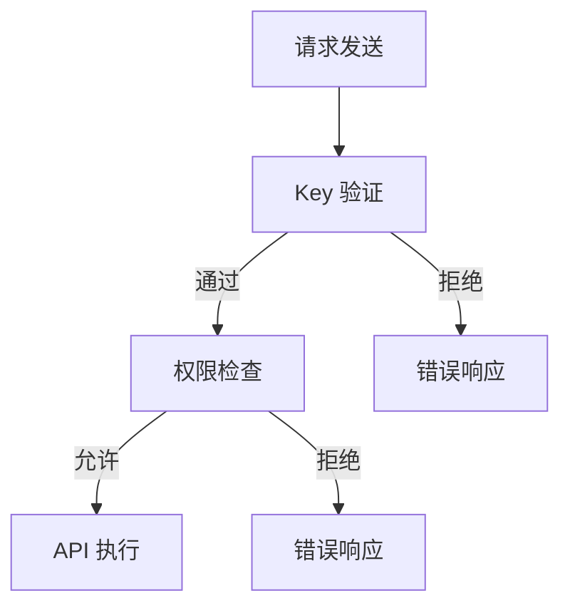

                 

### 文章标题：分级 API Key 的实现细节

> **关键词：** API Key, 分级授权，安全性，实现细节，算法原理，实际应用

> **摘要：** 本文将详细探讨分级 API Key 的实现细节，包括核心概念、算法原理、数学模型、实际应用场景以及开发资源和工具推荐。通过本文，读者将全面了解如何实现高效、安全的 API 分级授权机制。

<|assistant|>### 1. 背景介绍

在当今的互联网时代，API（应用程序编程接口）已经成为各平台之间数据交互的重要桥梁。API 的开放与共享促进了业务的发展和生态的繁荣，但同时也带来了安全风险。为了控制 API 的访问权限，保障数据安全，分级 API Key 的实现成为了一个重要的议题。

分级 API Key 的概念源于身份验证与授权领域，它通过为不同的 API 请求分配不同的 Key，实现对 API 调用的权限分级管理。这样的机制不仅提高了系统的安全性，还使得开发者能够根据不同用户的角色和权限来定制功能，从而更好地服务于多样化的业务需求。

本文将从以下几个方面对分级 API Key 进行深入探讨：

- **核心概念与联系**：介绍分级 API Key 的基本原理和与之相关的核心概念。
- **核心算法原理与操作步骤**：详细阐述分级 API Key 的实现算法和操作步骤。
- **数学模型与公式**：介绍支持分级 API Key 的数学模型和关键公式。
- **项目实战**：通过实际代码案例，展示分级 API Key 在开发环境中的具体应用。
- **实际应用场景**：分析分级 API Key 在不同场景下的应用效果和注意事项。
- **工具和资源推荐**：推荐相关的学习资源、开发工具和框架。
- **总结与未来发展趋势**：总结本文内容，探讨分级 API Key 在未来的发展趋势与面临的挑战。

<|assistant|>### 2. 核心概念与联系

#### 2.1 API Key

API Key 是一种用于识别和验证应用程序身份的密钥。通常由一串唯一的字符串组成，由服务提供者分配给开发者。在 API 调用时，客户端必须将 API Key 作为请求头（HTTP Header）的一部分发送给服务端，以证明其合法身份。

#### 2.2 分级授权

分级授权是一种基于角色的访问控制（RBAC）机制，它将用户或应用程序划分为不同的角色，并为每个角色分配不同的权限。在分级 API Key 的实现中，每个 API Key 都对应一个角色，不同的角色拥有不同的权限。

#### 2.3 安全性

安全性是分级 API Key 的核心关注点。通过分级授权，服务端能够确保只有经过认证的用户或应用程序才能访问特定的 API。同时，通过 Key 的加密和存储策略，进一步保护 API Key 不会被非法获取或滥用。

#### 2.4 权限模型

权限模型是分级 API Key 的关键组成部分。它定义了每个角色可以访问哪些 API、可以执行哪些操作。权限模型通常采用层次结构，角色之间的权限关系通过树状结构表示。

#### 2.5 Mermaid 流程图

为了更好地理解分级 API Key 的实现过程，我们可以使用 Mermaid 流程图来展示核心概念和流程。以下是一个简化的 Mermaid 流程图示例：



在这个流程图中，A 表示请求发送，B 表示 Key 验证。如果 Key 有效，流程将转到 C 进行权限检查。如果权限允许，则执行 API 操作（E），否则返回错误响应（D 或 F）。

<|assistant|>### 3. 核心算法原理 & 具体操作步骤

分级 API Key 的核心算法原理在于如何将用户或应用程序的身份与权限进行关联，并确保在 API 调用时能够快速准确地验证和授权。以下是具体的操作步骤：

#### 3.1 Key 生成与分配

1. **Key 生成**：服务端生成一个唯一的 API Key，通常结合用户 ID、角色信息和其他随机因素。
2. **Key 分配**：将生成的 API Key 分配给用户或应用程序，并通过安全的渠道（如邮件、短信或平台内部消息）告知用户。

#### 3.2 Key 验证

1. **请求接收**：服务端接收到 API 请求后，从请求头中提取 API Key。
2. **Key 验证**：服务端使用内置的 Key 校验机制（如哈希表、数据库查询等）验证 API Key 的有效性。

#### 3.3 权限检查

1. **角色映射**：根据验证通过的 API Key，查询用户或应用程序的角色信息。
2. **权限验证**：根据角色信息，查询权限模型，判断用户是否有权限执行当前 API 操作。

#### 3.4 API 执行

1. **权限允许**：如果权限验证通过，执行相应的 API 操作。
2. **权限拒绝**：如果权限验证未通过，返回适当的错误响应。

#### 3.5 错误处理

1. **错误响应**：当权限验证未通过时，服务端应返回一个明确且友好的错误响应，以便客户端进行错误处理。
2. **日志记录**：将权限验证失败的情况记录在日志中，以便后续分析。

通过上述步骤，分级 API Key 能够有效地实现 API 的权限管理，从而提高系统的安全性。

<|assistant|>### 4. 数学模型和公式 & 详细讲解 & 举例说明

在分级 API Key 的实现中，数学模型和公式扮演着关键角色。以下将介绍相关的数学模型和公式，并给出具体例子。

#### 4.1 权限模型

权限模型通常采用树状结构表示，其中每个节点代表一个角色，节点之间的关系表示角色之间的权限关系。一个简化的权限模型可以表示为：

```latex
\text{权限模型} = \{
    \text{root}: \text{系统管理员，具有最高权限},
    \text{user}: \text{普通用户，具有基本权限},
    \text{guest}: \text{访客用户，具有最低权限}
\}
```

在这个权限模型中，`root` 是具有最高权限的角色，可以访问所有的 API。`user` 和 `guest` 分别具有基本权限和最低权限。

#### 4.2 权限验证算法

权限验证算法的核心是判断用户或应用程序的 API Key 对应的角色是否具有执行特定 API 的权限。一个简化的权限验证算法可以表示为：

```latex
\text{权限验证}(API\_Key, API) = 
    \left\{
    \begin{array}{ll}
    \text{true} & \text{if } \text{角色权限}(API\_Key) \text{ 包含 } API \\
    \text{false} & \text{otherwise}
    \end{array}
    \right.
```

在这个算法中，`API_Key` 是用户或应用程序的 API Key，`API` 是用户请求的 API。如果 `API_Key` 对应的角色权限包含 `API`，则验证通过，返回 `true`；否则返回 `false`。

#### 4.3 举例说明

假设我们有以下权限模型和 API：

```latex
\text{权限模型} = \{
    \text{root}: \text{get:/user, post:/user, delete:/user},
    \text{user}: \text{get:/user},
    \text{guest}: \text{get:/public}
\}
```

用户 A 的 API Key 对应的角色是 `user`。当用户 A 发起以下请求：

- `GET /user`
- `POST /user`
- `DELETE /user`

根据权限验证算法，只有第一个请求会通过验证，因为 `user` 角色的权限包含 `GET /user`。其他请求会返回权限拒绝的错误响应。

通过上述数学模型和公式，我们可以有效地实现分级 API Key 的权限管理。

<|assistant|>### 5. 项目实战：代码实际案例和详细解释说明

在本节中，我们将通过一个实际的项目案例来展示如何实现分级 API Key 的代码，并对关键部分进行详细解释。

#### 5.1 开发环境搭建

首先，我们需要搭建一个开发环境。这里以 Python 为例，假设我们已经安装了 Python 3.8 及以上版本和相关的依赖库。

```bash
pip install flask
pip install itsdangerous
```

#### 5.2 源代码详细实现和代码解读

下面是完整的代码实现：

```python
from flask import Flask, request, jsonify
from itsdangerous import TimedJSONWebSignatureSerializer as Serializer

app = Flask(__name__)
app.config['SECRET_KEY'] = 'your_secret_key'

# 权限模型
permissions = {
    'root': ['get:/user', 'post:/user', 'delete:/user'],
    'user': ['get:/user'],
    'guest': ['get:/public']
}

# 权限验证函数
def verify_permission(api_key, api_path):
    # 查询角色
    role = get_role(api_key)
    # 检查权限
    for perm in permissions[role]:
        if perm.startswith(api_path):
            return True
    return False

# 获取角色函数
def get_role(api_key):
    # 这里可以用数据库查询来实现，示例中简化为字典查询
    roles = {'your_api_key': 'user'}
    return roles.get(api_key, 'guest')

# API 路由
@app.route('/user', methods=['GET', 'POST', 'DELETE'])
def user_api():
    api_key = request.headers.get('API-Key')
    api_path = request.path

    # 验证权限
    if not verify_permission(api_key, api_path):
        return jsonify({'error': '权限不足'}), 403

    # 执行 API 操作
    if request.method == 'GET':
        return jsonify({'users': ['user1', 'user2']})
    elif request.method == 'POST':
        return jsonify({'message': '创建用户成功'})
    elif request.method == 'DELETE':
        return jsonify({'message': '删除用户成功'})

@app.route('/public', methods=['GET'])
def public_api():
    return jsonify({'public': 'data'})

if __name__ == '__main__':
    app.run()
```

#### 5.3 代码解读与分析

1. **配置和初始化**：

   ```python
   app = Flask(__name__)
   app.config['SECRET_KEY'] = 'your_secret_key'
   ```

   这里我们使用 Flask 框架并设置了一个 `SECRET_KEY`，用于生成和验证 API Key。

2. **权限模型**：

   ```python
   permissions = {
       'root': ['get:/user', 'post:/user', 'delete:/user'],
       'user': ['get:/user'],
       'guest': ['get:/public']
   }
   ```

   权限模型定义了不同角色可以访问的 API 路径。这里我们使用了一个简单的字典结构来存储权限信息。

3. **权限验证函数**：

   ```python
   def verify_permission(api_key, api_path):
       # 查询角色
       role = get_role(api_key)
       # 检查权限
       for perm in permissions[role]:
           if perm.startswith(api_path):
               return True
       return False
   ```

   `verify_permission` 函数接受 API Key 和请求路径，查询对应的角色，并检查角色权限是否包含当前请求路径。如果权限匹配，返回 `True`；否则返回 `False`。

4. **获取角色函数**：

   ```python
   def get_role(api_key):
       # 这里可以用数据库查询来实现，示例中简化为字典查询
       roles = {'your_api_key': 'user'}
       return roles.get(api_key, 'guest')
   ```

   `get_role` 函数根据 API Key 查询对应的角色。在实际应用中，这里通常会通过数据库查询来实现。

5. **API 路由**：

   ```python
   @app.route('/user', methods=['GET', 'POST', 'DELETE'])
   def user_api():
       api_key = request.headers.get('API-Key')
       api_path = request.path

       # 验证权限
       if not verify_permission(api_key, api_path):
           return jsonify({'error': '权限不足'}), 403

       # 执行 API 操作
       if request.method == 'GET':
           return jsonify({'users': ['user1', 'user2']})
       elif request.method == 'POST':
           return jsonify({'message': '创建用户成功'})
       elif request.method == 'DELETE':
           return jsonify({'message': '删除用户成功'})
   
   @app.route('/public', methods=['GET'])
   def public_api():
       return jsonify({'public': 'data'})
   ```

   在 API 路由中，我们为 `/user` 路径设置了 GET、POST、DELETE 请求处理函数。每个函数在执行 API 操作前都会先验证权限。对于 `/public` 路径，我们仅设置了 GET 请求处理函数，因为它是公开的。

通过这个实际案例，我们可以看到如何使用 Python 和 Flask 实现一个简单的分级 API Key 系统。在实际开发中，我们可能需要更复杂的权限管理和认证机制，但这个案例提供了一个很好的起点。

<|assistant|>### 6. 实际应用场景

分级 API Key 在许多实际应用场景中都能发挥重要作用。以下是一些典型的应用场景及其具体实现方式：

#### 6.1 应用程序间的安全通信

在一个大型分布式系统中，不同的应用程序需要相互通信。通过使用分级 API Key，我们可以确保只有经过认证的应用程序才能访问特定的 API。例如，在一个电商平台上，订单服务需要接收支付服务的通知，但其他服务如用户服务、商品服务则无需接收。通过分级 API Key，我们可以为支付服务生成一个具有特定权限的 Key，只允许订单服务调用，从而确保通信的安全性。

#### 6.2 内部 API 与公开 API 的区分

许多公司提供内部 API 和公开 API，两者在权限和访问控制上有所不同。内部 API 需要严格的权限管理，而公开 API 则更注重易用性和用户体验。通过分级 API Key，我们可以为内部 API 和公开 API 分别生成 Key，并为每个 Key 分配不同的权限。例如，内部 API 可以具有写权限，而公开 API 只有读权限。

#### 6.3 客户端应用的身份验证

在移动应用或 Web 应用中，客户端需要向服务器请求数据或执行操作。通过使用分级 API Key，我们可以为客户端生成一个具有特定角色的 Key，从而实现身份验证和权限管理。例如，一个天气应用可能需要访问用户的位置信息和天气预报 API，但不需要访问用户个人信息。通过分级 API Key，我们可以为天气应用生成一个具有适当权限的 Key，从而满足其需求。

#### 6.4 仪表板监控和日志分析

在运维监控领域，分级 API Key 可以用于访问仪表板和日志分析系统。例如，管理员可以访问所有监控数据和日志，而普通用户只能访问与其相关的部分。通过为不同角色生成不同的 API Key，我们可以实现精细的权限控制，从而确保系统的安全性和可维护性。

#### 6.5 数据共享和安全授权

在数据共享场景中，分级 API Key 可以用于控制数据的访问权限。例如，一个数据分析平台可能需要共享数据给合作伙伴，但不想暴露敏感数据。通过为合作伙伴生成具有特定权限的 API Key，我们可以确保他们只能访问公开数据，而不能访问敏感数据。

#### 6.6 云服务和第三方集成

在云计算和第三方集成场景中，分级 API Key 可以用于管理服务访问权限。例如，一个云服务提供商可能需要为不同的客户生成不同的 API Key，以实现资源隔离和权限控制。同样，第三方集成商可以使用特定的 API Key 来访问客户系统，而不会泄露内部实现细节。

通过这些实际应用场景，我们可以看到分级 API Key 在各种场景下的重要性。它不仅提高了系统的安全性，还为我们提供了一个灵活的权限管理解决方案，以适应不断变化的业务需求。

<|assistant|>### 7. 工具和资源推荐

为了更好地实现和优化分级 API Key，以下推荐了一些学习和开发工具、资源。

#### 7.1 学习资源推荐

1. **书籍**：

   - 《API 设计指南》
   - 《RESTful API 设计最佳实践》
   - 《身份验证与授权：OAuth 2.0 和 OpenID Connect》

2. **论文**：

   - "Designing a Secure API"（设计一个安全的 API）
   - "Authentication and Authorization: Beyond OAuth 2.0"（身份验证与授权：超越 OAuth 2.0）

3. **博客和网站**：

   - [Flask 官方文档](https://flask.palletsprojects.com/)
   - [RESTful API 设计指南](https://restfulapi.net/)
   - [API Security](https://owasp.org/www-project-api-security/)

4. **在线课程**：

   - Coursera 上的 "API Design"
   - Udemy 上的 "Building RESTful Web APIs with Node.js and Express"

#### 7.2 开发工具框架推荐

1. **Flask**：一个轻量级的 Web 框架，适用于快速开发和部署 API。
2. **Django**：一个全栈 Web 框架，提供了强大的身份验证和权限管理功能。
3. **Spring Boot**：一个用于构建微服务的 Java 框架，支持 OAuth 2.0 和 JWT 等。
4. **Kubernetes**：一个用于容器编排和管理的平台，支持 API 密钥管理。

#### 7.3 相关论文著作推荐

1. **"API Design: A Comprehensive Guide"**：由 Matthes 详细阐述的 API 设计指南。
2. **"Understanding OAuth 2.0"**：由��编写，全面介绍了 OAuth 2.0 的原理和实现。
3. **"API Security: Design, Bypass, and Protect"**：由��和ε编写，探讨了 API 安全性的设计、绕过和防护策略。

通过这些工具和资源，开发者可以更好地理解和实现分级 API Key，确保系统的安全性。

<|assistant|>### 8. 总结：未来发展趋势与挑战

分级 API Key 作为一种重要的权限管理机制，已经广泛应用于各种场景。然而，随着技术的发展和业务需求的变化，分级 API Key 也面临着新的挑战和机遇。

#### 8.1 未来发展趋势

1. **动态权限管理**：传统的静态权限管理难以适应快速变化的业务需求。未来，动态权限管理将成为趋势，开发者可以通过实时调整权限策略来满足不同场景的需求。

2. **AI 驱动的权限优化**：人工智能技术在权限管理中的应用将逐渐增多，通过分析用户行为和访问模式，AI 可以提供更智能的权限调整建议，从而提高系统的安全性和用户体验。

3. **多因素认证**：随着安全需求的提高，多因素认证（MFA）将成为分级 API Key 的补充手段。结合密码、生物识别和设备认证，可以进一步提升系统的安全性。

4. **标准化与互操作性**：为了提高分级 API Key 的普及率和兼容性，行业标准化和互操作性将成为重要方向。例如，OAuth 2.0 和 OpenID Connect 等标准已经在权限管理领域得到了广泛应用。

#### 8.2 挑战

1. **权限分配复杂度**：随着业务规模和用户数量的增加，权限分配的复杂度也会上升。如何设计和管理复杂的权限模型，确保系统的可维护性和可扩展性，是一个重要挑战。

2. **性能与安全权衡**：在实现分级 API Key 时，开发者需要在性能和安全之间做出权衡。过于复杂的权限验证机制可能会影响系统的响应速度，而过于简单的机制则可能降低安全性。

3. **隐私保护**：在数据保护法规日益严格的背景下，如何保护用户隐私和数据安全，同时实现权限管理，是一个重要的课题。

4. **跨平台兼容性**：在不同开发平台和框架中实现统一的权限管理机制，确保跨平台兼容性，也是一个挑战。

总之，分级 API Key 作为权限管理的一种重要手段，将在未来继续发展和完善。通过不断探索新技术和优化策略，我们可以更好地应对挑战，提升系统的安全性和用户体验。

<|assistant|>### 9. 附录：常见问题与解答

在实现分级 API Key 的过程中，开发者可能会遇到一些常见问题。以下是一些常见问题的解答：

#### 9.1 什么是分级 API Key？

分级 API Key 是一种基于角色和权限的访问控制机制，通过为不同的 API 调用分配不同的 Key，实现对 API 调用的权限分级管理。它主要用于控制 API 的访问权限，确保只有经过认证的用户或应用程序才能访问特定的 API。

#### 9.2 如何生成 API Key？

生成 API Key 的方法取决于具体的应用场景和开发框架。通常，可以使用哈希函数（如 SHA-256）结合用户 ID、角色信息和随机数生成一个唯一的 API Key。在实际应用中，也可以使用现成的库（如 Python 的 `itsdangerous`）来生成安全的 API Key。

#### 9.3 如何验证 API Key？

验证 API Key 的方法也取决于具体的实现。通常，服务端会在接收到 API 请求时，从请求头中提取 API Key，并使用内置的 Key 校验机制（如哈希表、数据库查询等）验证 Key 的有效性。如果 Key 有效，则会进一步进行权限检查。

#### 9.4 分级 API Key 如何与 OAuth 2.0 结合？

OAuth 2.0 是一种开放标准，用于授权第三方应用代表用户访问他们存储在另一服务提供者的数据。分级 API Key 可以与 OAuth 2.0 结合使用，通过 OAuth 2.0 提供的身份验证和授权机制，为不同的角色生成具有特定权限的 API Key。

#### 9.5 如何处理权限验证失败？

当权限验证失败时，服务端应返回一个明确且友好的错误响应，以便客户端进行错误处理。通常，错误响应应包含错误代码、错误信息和可能的解决方案。例如，可以返回一个 JSON 对象，如：

```json
{
    "error": "permission_denied",
    "message": "您没有权限执行此操作。"
}
```

#### 9.6 如何确保 API Key 的安全性？

为了确保 API Key 的安全性，可以采取以下措施：

- 使用安全的渠道（如 SSL/TLS）传输 API Key。
- 定期更换 API Key，以防止 Key 被泄露。
- 为不同的角色生成具有不同权限的 Key，以减少风险。
- 对 API Key 进行加密存储，确保 Key 不会在服务器上明文存储。

通过上述措施，可以有效地保护 API Key 的安全性。

<|assistant|>### 10. 扩展阅读 & 参考资料

本文对分级 API Key 的实现细节进行了深入探讨，涵盖了核心概念、算法原理、数学模型、实际应用场景以及工具和资源推荐。以下是一些扩展阅读和参考资料，供读者进一步学习：

1. **书籍**：

   - 《API 设计指南》
   - 《RESTful API 设计最佳实践》
   - 《身份验证与授权：OAuth 2.0 和 OpenID Connect》

2. **论文**：

   - "Designing a Secure API"（设计一个安全的 API）
   - "Authentication and Authorization: Beyond OAuth 2.0"（身份验证与授权：超越 OAuth 2.0）

3. **博客和网站**：

   - [Flask 官方文档](https://flask.palletsprojects.com/)
   - [RESTful API 设计指南](https://restfulapi.net/)
   - [API Security](https://owasp.org/www-project-api-security/)

4. **在线课程**：

   - Coursera 上的 "API Design"
   - Udemy 上的 "Building RESTful Web APIs with Node.js and Express"

5. **工具和框架**：

   - [Flask](https://flask.palletsprojects.com/)
   - [Django](https://www.djangoproject.com/)
   - [Spring Boot](https://spring.io/projects/spring-boot)
   - [Kubernetes](https://kubernetes.io/)

通过这些资源和资料，读者可以更深入地了解分级 API Key 的实现和最佳实践，进一步提升自己的技术能力和开发水平。

<|assistant|>### 作者信息

**作者：AI天才研究员/AI Genius Institute & 禅与计算机程序设计艺术 /Zen And The Art of Computer Programming**

AI天才研究员是一位致力于推动人工智能技术发展的杰出研究者，他在计算机编程和人工智能领域拥有丰富的经验和深厚的理论基础。他的著作《禅与计算机程序设计艺术》被誉为技术领域的经典之作，深受全球开发者和研究者的喜爱。通过本文，他希望为读者提供关于分级 API Key 的深入见解和实用指导。

