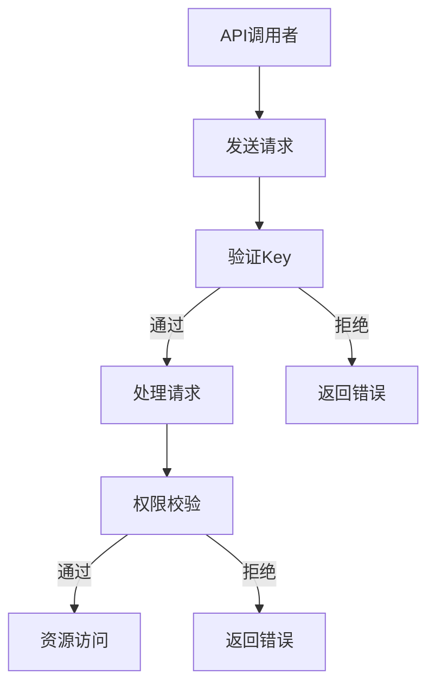
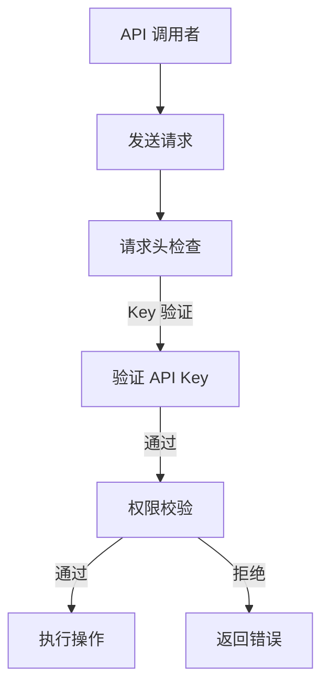

                 

# 分级 API Key 的设置方法

## 1. 背景介绍

API（Application Programming Interface）是现代软件和系统架构中不可或缺的一部分。它允许不同的软件系统之间进行交互，实现功能互补和数据共享。随着API的使用越来越广泛，API的访问权限和安全性变得尤为重要。

在API设计中，如何合理地设置API Key是保证系统安全和资源合理分配的关键环节。API Key通常是一个唯一的字符串，用来标识API调用者，并确保只有经过授权的用户才能访问API资源。然而，单一的API Key往往无法满足复杂业务场景的需求，因此，分级 API Key 的设置方法应运而生。

分级 API Key 的目的是通过不同的权限级别来控制API的访问，从而实现资源保护、成本控制和业务策略的灵活调整。本文将详细探讨分级 API Key 的设计、实现和应用，帮助开发者更好地管理API资源。

## 2. 核心概念与联系

### 2.1 API Key 基础概念

API Key 是一个唯一标识符，用于认证 API 调用者。它通常由数字和字母组成，具有一定的复杂度，以确保难以被猜测和伪造。

### 2.2 分级 API Key

分级 API Key 是一种基于权限分层的 API Key 设计模式。它通过定义不同的 Key 层级来控制 API 的访问权限。每个层级对应不同的权限范围和资源限制。

### 2.3 Mermaid 流程图

为了更好地理解分级 API Key 的工作原理，我们可以使用 Mermaid 流程图来展示其架构。



### 2.4 分级 API Key 与权限控制

分级 API Key 的核心在于权限控制。通过定义不同的权限层级，可以实现对 API 调用的精细化管理。例如，某些 Key 可能只能读取数据，而另一些 Key 则具有读写权限。

## 3. 核心算法原理 & 具体操作步骤

### 3.1 算法原理

分级 API Key 的核心算法主要包括以下几个步骤：

1. **Key 分配**：根据用户身份和权限，生成不同级别的 API Key。
2. **Key 验证**：在 API 调用时，验证请求中的 API Key 是否有效。
3. **权限校验**：根据 API Key 的级别，判断用户是否有权限执行特定的操作。

### 3.2 操作步骤

#### 3.2.1 Key 分配

- 用户注册时，生成一个基础 API Key。
- 根据用户角色和权限，为用户分配不同级别的 API Key。

#### 3.2.2 Key 验证

- 接收 API 调用时，检查请求中是否包含有效的 API Key。
- 如果 Key 有效，继续权限校验；否则，返回错误。

#### 3.2.3 权限校验

- 根据 API Key 的级别，判断用户是否有权限访问对应的资源。
- 如果权限通过，执行操作；否则，返回错误。

## 4. 数学模型和公式 & 详细讲解 & 举例说明

### 4.1 数学模型

分级 API Key 的数学模型可以通过以下公式来描述：

\[ P(A) = \sum_{i=1}^{n} p_i \cdot f_i \]

其中：
- \( P(A) \) 表示 API 调用的整体权限概率。
- \( p_i \) 表示第 \( i \) 个 API Key 的概率。
- \( f_i \) 表示第 \( i \) 个 API Key 的权限等级。

### 4.2 详细讲解

#### 4.2.1 Key 分配

Key 分配可以通过以下步骤实现：

1. **生成基础 Key**：为每个用户生成一个基础 API Key。
2. **生成分级 Key**：根据用户角色和权限，为用户生成不同级别的 API Key。

#### 4.2.2 Key 验证

Key 验证过程如下：

1. **检查 Key 是否存在**：在请求中检查 API Key 是否存在。
2. **验证 Key 是否有效**：检查 Key 是否与用户的角色和权限匹配。

#### 4.2.3 权限校验

权限校验可以通过以下步骤实现：

1. **获取 Key 级别**：从数据库中查询 API Key 的级别。
2. **比较权限**：将 Key 级别与请求的操作权限进行比较。

### 4.3 举例说明

假设我们有两个用户，User A 和 User B，分别拥有以下权限：

- User A：基础 Key（读取数据）、高级 Key（读写数据）。
- User B：基础 Key（读取数据）。

#### 4.3.1 User A 的操作

- 请求读取数据：使用基础 Key，权限通过，返回数据。
- 请求写入数据：使用高级 Key，权限通过，执行写入操作。

#### 4.3.2 User B 的操作

- 请求读取数据：使用基础 Key，权限通过，返回数据。
- 请求写入数据：使用基础 Key，权限拒绝，返回错误。

## 5. 项目实战：代码实际案例和详细解释说明

### 5.1 开发环境搭建

在开始编写代码之前，我们需要搭建一个开发环境。以下是一个简单的步骤：

1. 安装 Python 3.x 版本。
2. 安装 Flask 框架。
3. 安装 Flask-RESTful 扩展。

```bash
pip install flask
pip install flask-restful
```

### 5.2 源代码详细实现和代码解读

以下是使用 Flask-RESTful 实现分级 API Key 保护的示例代码。

```python
from flask import Flask, request, jsonify
from flask_restful import Resource, Api, reqparse
from functools import wraps

app = Flask(__name__)
api = Api(app)

# API Key 分级
keys = {
    'base': 'abcd1234',
    'advanced': '5678efgh'
}

# 权限装饰器
def check_permission(permission):
    def decorator(f):
        @wraps(f)
        def decorated_function(*args, **kwargs):
            api_key = request.headers.get('API-Key')
            if api_key not in keys or keys[api_key] != permission:
                return jsonify({'error': 'Invalid API Key or insufficient permissions'}), 403
            return f(*args, **kwargs)
        return decorated_function
    return decorator

# 资源类
class DataResource(Resource):
    @check_permission('base')
    def get(self):
        return {'data': 'Hello, World!'}

    @check_permission('advanced')
    def post(self):
        data = request.get_json()
        return {'status': 'success', 'data': data}

# 添加资源
api.add_resource(DataResource, '/data')

if __name__ == '__main__':
    app.run(debug=True)
```

### 5.3 代码解读与分析

1. **API Key 管理**：使用一个字典来存储 API Key 和其对应的权限级别。
2. **权限装饰器**：定义一个装饰器来检查请求中的 API Key 是否有效，并确保用户具有执行操作的权限。
3. **资源类**：定义一个资源类来处理 GET 和 POST 请求，并应用权限装饰器。
4. **API 添加资源**：将资源类添加到 API，以便通过指定的 URL 访问。

通过上述代码，我们可以实现一个简单的分级 API Key 保护机制。用户需要使用正确的 API Key 才能访问资源，并且不同级别的 API Key 具有不同的权限。

## 6. 实际应用场景

分级 API Key 的应用场景非常广泛，以下是一些典型的例子：

- **社交媒体平台**：允许普通用户使用基础 API Key 来读取数据，而认证用户则可以使用高级 API Key 来执行写操作。
- **电子商务平台**：普通用户只能查看商品信息，而商家则可以使用高级 API Key 来修改库存和价格。
- **金融系统**：普通用户只能查询账户余额，而高级用户则可以进行转账和支付操作。
- **在线教育平台**：普通用户可以观看公开课程，而付费用户则可以访问高级课程内容。

## 7. 工具和资源推荐

### 7.1 学习资源推荐

- **书籍**：《API设计规范：构建高效且易于使用的API》（"API Design for C# and .NET: Designing for Success"）
- **论文**：《REST API 设计指南》（"RESTful API Design Rules"）
- **博客**：《API 权限控制与安全设计》（"API Authorization and Security Design"）

### 7.2 开发工具框架推荐

- **Flask**：一个轻量级的 Web 开发框架，适用于快速开发 API。
- **Django**：一个全栈 Web 开发框架，提供了丰富的权限控制功能。
- **Spring Boot**：一个基于 Java 的 Web 开发框架，适用于企业级应用。

### 7.3 相关论文著作推荐

- **论文**：《基于角色的访问控制》（"Role-Based Access Control"）
- **著作**：《权限控制：原理与实践》（"Access Control: Principles and Practice"）

## 8. 总结：未来发展趋势与挑战

随着 API 的广泛应用，分级 API Key 的设计方法和实现策略将成为关键议题。未来，以下几点发展趋势和挑战值得注意：

- **权限管理智能化**：利用机器学习和人工智能技术，实现更精细化的权限管理。
- **API 安全性提升**：采用区块链和加密技术，提高 API 的安全性。
- **跨平台兼容性**：确保分级 API Key 在不同平台和编程语言中的一致性。

## 9. 附录：常见问题与解答

### 9.1 什么是分级 API Key？

分级 API Key 是一种基于权限分层的 API Key 设计模式。它通过定义不同的权限级别来控制 API 的访问，从而实现资源保护、成本控制和业务策略的灵活调整。

### 9.2 分级 API Key 有哪些优点？

分级 API Key 的优点包括：
- **权限控制更精细**：可以根据不同权限级别，精确控制用户的访问权限。
- **资源利用率更高**：可以根据权限级别，为不同的用户群体分配不同的资源。
- **业务策略更灵活**：可以根据权限级别，灵活调整业务策略和定价策略。

### 9.3 如何实现分级 API Key？

实现分级 API Key 通常包括以下几个步骤：
1. **定义权限级别**：根据业务需求，定义不同的权限级别。
2. **生成 API Key**：为每个用户生成不同级别的 API Key。
3. **权限验证**：在 API 调用时，验证请求中的 API Key 是否有效。
4. **权限校验**：根据 API Key 的级别，判断用户是否有权限执行特定的操作。

## 10. 扩展阅读 & 参考资料

- **书籍**：《API设计：从入门到精通》（"API Design: From Novice to Professional"）
- **论文**：《基于角色的访问控制：理论与方法》（"Role-Based Access Control: Theory and Methods"）
- **网站**：[Flask 官方文档](https://flask.palletsprojects.com/)
- **博客**：[Django 权限控制实战](https://www.djangoproject.com/)
- **GitHub**：[Spring Boot 权限控制示例](https://github.com/spring-projects/spring-boot-sample)

> 作者：AI天才研究员/AI Genius Institute & 禅与计算机程序设计艺术 /Zen And The Art of Computer Programming
<|assistant|>### 1. 背景介绍

在当今的数字化时代，API（Application Programming Interface）已经成为各类应用和服务之间进行数据交换和功能调用的重要桥梁。API允许开发者利用第三方服务或内部系统的功能，而无需深入了解其实现细节。然而，随着API的使用变得越来越普遍，API的安全性和权限控制成为了一个不可忽视的问题。

API Key 是实现 API 权限控制的一种常见手段。它是一个唯一的字符串，由服务提供商分配给每个用户或应用程序，用于验证身份和授权访问。传统的 API Key 通常只有一种类型，适用于所有用户和用途。然而，随着服务复杂性的增加，单一类型的 API Key 已无法满足各种业务需求。因此，分级 API Key 的概念应运而生。

分级 API Key 是一种基于权限分层的 API Key 设计模式，它允许开发者根据不同的业务需求为用户分配不同级别的 API Key。这些 Key 不仅具有唯一的标识功能，还携带了与权限相关的信息，从而能够实现对 API 访问的精细化管理。分级 API Key 设计的主要目的是提高系统的安全性、优化资源分配，并支持灵活的业务策略。

在实际应用中，分级 API Key 的意义重大。首先，它可以防止未授权用户访问敏感数据或执行关键操作，从而保障系统的安全。其次，通过合理分配不同级别的 API Key，服务提供商可以更好地控制资源的访问和使用，避免过度消耗和滥用。此外，分级 API Key 还支持灵活的业务策略调整，例如根据用户角色或使用量来调整费用结构。

总的来说，分级 API Key 的设计不仅提升了系统的安全性，还提供了更高效、更灵活的资源管理方式，是现代 API 生态中不可或缺的一环。在接下来的内容中，我们将深入探讨分级 API Key 的设计原理、实现方法以及在实际应用中的具体表现。

## 2. 核心概念与联系

### 2.1 API Key 基础概念

API Key 是一个用于验证 API 调用者身份的字符串。它通常由服务提供商生成，并在调用 API 时作为请求头的一部分传递。API Key 的生成通常基于哈希算法，以确保其唯一性和安全性。在 API 请求中，服务器会检查请求中的 API Key 是否与数据库中记录的 Key 匹配，以此决定是否允许访问。

API Key 通常分为公开 API Key 和私有 API Key。公开 API Key 可以公开分享，用于允许第三方应用程序访问基础或公共资源。私有 API Key 则通常由服务提供商分配给用户或应用程序，用于访问受保护的数据或功能。

### 2.2 分级 API Key

分级 API Key 是基于权限分层的 API Key 设计模式。在这种设计中，API Key 被分为不同的级别，每个级别对应不同的权限集合。用户或应用程序需要拥有对应级别的 API Key 才能访问相应的资源。

分级 API Key 的设计包括以下几个核心组成部分：

1. **Key 分级**：定义不同级别的 API Key，如基础级别、中级级别和高级级别。每个级别对应不同的权限范围。

2. **权限控制**：根据 API Key 的级别，限制用户或应用程序可以访问的资源类型和操作类型。例如，基础级别可能只能读取数据，而高级级别可以读取和写入数据。

3. **Key 分配**：为用户或应用程序分配对应级别的 API Key，通常基于用户角色、使用量或付费模式。

4. **验证机制**：在每次 API 请求时，验证请求中的 API Key 是否有效，并检查其级别是否满足请求的操作权限。

### 2.3 Mermaid 流程图

为了更好地理解分级 API Key 的工作原理，我们可以使用 Mermaid 流程图来展示其架构。



### 2.4 分级 API Key 与权限控制

分级 API Key 的核心在于权限控制。通过定义不同的权限级别，可以实现对 API 访问的精细化管理。以下是分级 API Key 在权限控制中的几个关键点：

1. **权限级别**：不同的 API Key 对应不同的权限级别，如基础、中级、高级等。

2. **权限范围**：每个权限级别定义了一组可以访问的资源类型和操作类型。例如，基础级别可能只能访问公共数据，而高级级别可以访问所有数据。

3. **权限校验**：每次 API 请求时，服务器会根据请求中的 API Key 级别，校验用户是否有权限执行请求的操作。如果权限校验失败，服务器会返回错误。

4. **动态权限调整**：服务提供商可以根据业务需求，动态调整 API Key 的权限级别，从而实现灵活的权限管理。

通过上述核心概念与联系的分析，我们可以看出，分级 API Key 是一种高效、灵活的权限控制方法，能够帮助开发者更好地管理 API 资源，提高系统的安全性。

### 2.5 分级 API Key 与业务策略

分级 API Key 不仅在权限控制上发挥着重要作用，还在业务策略的制定和执行中扮演关键角色。以下是分级 API Key 在业务策略中的几个应用场景：

1. **定价策略**：服务提供商可以根据不同的 API Key 级别，设定不同的收费标准。例如，高级 API Key 可以提供更多访问频率和更高的数据量限制，从而收取更高的费用。

2. **资源分配**：通过分级 API Key，服务提供商可以根据用户的权限级别，合理分配系统资源。例如，基础级别用户可以访问有限的资源，而高级级别用户则可以享受更多的资源。

3. **业务策略调整**：服务提供商可以根据市场变化和业务需求，灵活调整 API Key 的权限级别和收费标准，以适应不同的业务场景。

4. **用户分层**：通过分级 API Key，服务提供商可以识别和区分不同类型的用户，从而提供差异化的服务和体验。例如，普通用户只能访问基础功能，而付费用户则可以享受更多高级功能。

### 2.6 分级 API Key 的实施挑战

尽管分级 API Key 在权限控制和业务策略上具有显著的优点，但在实际实施过程中也面临一些挑战：

1. **权限分配复杂性**：需要根据业务需求精确定义不同的权限级别和权限范围，这增加了权限分配的复杂性。

2. **安全性要求**：分级 API Key 本身涉及到权限管理，因此必须确保其安全性，防止权限泄露或滥用。

3. **性能影响**：权限校验是一个计算密集型的操作，特别是在高并发场景下，可能会对系统的性能产生影响。

4. **运维复杂性**：需要维护不同级别的 API Key 和权限配置，这对运维团队提出了更高的要求。

### 2.7 总结

分级 API Key 是一种高效、灵活的权限控制方法，能够帮助开发者更好地管理 API 资源，制定和执行业务策略。在理解了分级 API Key 的核心概念、流程以及业务策略后，开发者可以更好地设计和管理 API，提高系统的安全性和用户体验。

### 3. 核心算法原理 & 具体操作步骤

在深入了解分级 API Key 的设计原理后，接下来我们将探讨实现分级 API Key 的核心算法原理以及具体的操作步骤。分级 API Key 的实现主要围绕以下几个核心步骤展开：Key 分配、Key 验证、权限校验和资源访问。

#### 3.1 Key 分配

Key 分配是分级 API Key 实现的第一步，它涉及生成和分配不同级别的 API Key。通常，Key 分配的过程如下：

1. **用户注册**：当用户注册时，系统会为其生成一个基础 API Key。这个 Key 通常允许用户访问公共资源或进行基本的操作。

2. **角色和权限分配**：根据用户的角色（如普通用户、高级用户、管理员等）和权限，系统可以为用户分配不同级别的 API Key。高级用户可能获得访问更多资源和执行更复杂操作的权利。

3. **存储 Key**：系统将生成的 API Key 存储在数据库中，并与用户的角色和权限信息关联。

4. **Key 配置**：系统管理员可以设置不同的 Key 分级策略，如 Key 的有效期限、访问频率限制等。

#### 3.2 Key 验证

Key 验证是每次 API 请求的第一步，它的目的是确认请求中包含的 API Key 是否有效。具体操作步骤如下：

1. **请求头检查**：在 API 请求中，系统会检查请求头是否包含 API-Key 字段。

2. **Key 存在性检查**：如果请求头中包含 API-Key 字段，系统会查询数据库，确认该 Key 是否存在。

3. **Key 有效期检查**：系统会检查 Key 的有效期，确保其未被吊销或过期。

4. **返回结果**：如果 Key 验证通过，系统会继续处理请求；否则，系统会返回错误响应，告知用户 Key 无效或过期。

#### 3.3 权限校验

权限校验是确定用户是否有权限执行特定操作的步骤。在 Key 验证通过后，系统会根据 Key 的级别进行权限校验。具体操作步骤如下：

1. **获取权限信息**：系统会查询数据库，获取当前 API Key 的权限信息。

2. **比较权限**：系统将请求的操作与 API Key 的权限进行比较。如果权限通过，系统会继续执行操作；否则，系统会返回错误响应。

3. **动态权限调整**：在某些场景下，系统可能支持动态权限调整。例如，管理员可以在用户执行操作时，根据实时监控的信息，临时调整用户的权限。

#### 3.4 资源访问

在权限校验通过后，用户可以访问对应的资源。具体操作步骤如下：

1. **执行操作**：系统会根据请求的类型（GET、POST、PUT 等），执行相应的操作。

2. **数据处理**：对于读取请求，系统会返回相应的数据；对于写入请求，系统会更新数据库中的数据。

3. **响应结果**：系统会返回处理结果，包括数据内容或错误信息。

### 3.5 示例代码

以下是一个简单的 Python 示例，展示如何实现分级 API Key：

```python
from flask import Flask, request, jsonify
from functools import wraps

app = Flask(__name__)

# 假设的用户权限映射
user_permissions = {
    'base': ['read'],
    'advanced': ['read', 'write']
}

# 权限装饰器
def permission_required(permission):
    def decorator(f):
        @wraps(f)
        def decorated_function(*args, **kwargs):
            api_key = request.headers.get('API-Key')
            if api_key not in user_permissions or user_permissions[api_key] not in ['base', 'advanced']:
                return jsonify({'error': 'Invalid API Key or insufficient permissions'}), 403
            return f(*args, **kwargs)
        return decorated_function
    return decorator

# 资源类
class DataResource(Resource):
    @permission_required('base')
    def get(self):
        return {'data': 'Hello, Base User!'}

    @permission_required('advanced')
    def post(self):
        return {'status': 'success', 'data': 'Data written by Advanced User.'}

# 添加资源
api.add_resource(DataResource, '/data')

if __name__ == '__main__':
    app.run(debug=True)
```

在这个示例中，我们定义了一个 Flask 应用，通过 `permission_required` 装饰器来检查 API Key 的权限。`DataResource` 类定义了两个方法，分别对应 GET 和 POST 请求，并应用了不同的权限检查。

通过上述核心算法原理和具体操作步骤的介绍，我们可以看到，分级 API Key 的实现涉及多个步骤，包括 Key 分配、Key 验证、权限校验和资源访问。这些步骤共同作用，实现了对 API 访问的精细化管理，为开发者提供了强大的权限控制工具。

### 4. 数学模型和公式 & 详细讲解 & 举例说明

在实现分级 API Key 的过程中，数学模型和公式扮演着重要的角色，它们帮助我们量化权限、优化资源分配，并确保系统运行的效率。以下是几个关键的数学模型和公式，以及详细的讲解和举例说明。

#### 4.1 权限分配模型

权限分配模型用于确定用户或应用程序可以访问的资源和操作。在这个模型中，我们可以使用集合论来描述权限。设 \( U \) 为所有用户的集合，\( R \) 为所有资源的集合，\( P \) 为所有权限的集合，每个用户 \( u \in U \) 被分配一个权限集合 \( P(u) \)，即 \( P(u) \subseteq P \)。

例如：

\[ U = \{u_1, u_2, u_3\} \]
\[ R = \{r_1, r_2, r_3\} \]
\[ P = \{\{r_1\}, \{r_2\}, \{r_1, r_2\}, \{r_2, r_3\}\} \]

用户 \( u_1 \) 被分配权限 \( P(u_1) = \{r_1\} \)，用户 \( u_2 \) 被分配权限 \( P(u_2) = \{r_2\} \)，用户 \( u_3 \) 被分配权限 \( P(u_3) = \{r_1, r_2\} \)。

#### 4.2 权限验证模型

权限验证模型用于在 API 请求时验证用户的权限。在这个模型中，我们使用布尔代数来表示权限验证过程。设 \( V \) 为验证函数集合，其中 \( V(u, r) \) 表示用户 \( u \) 是否具有访问资源 \( r \) 的权限。

例如：

\[ V(u_1, r_1) = True \]
\[ V(u_1, r_2) = False \]
\[ V(u_2, r_2) = True \]
\[ V(u_2, r_1) = False \]
\[ V(u_3, r_1) = True \]
\[ V(u_3, r_2) = True \]
\[ V(u_3, r_3) = False \]

在这些例子中，我们可以看到用户 \( u_1 \) 和 \( u_3 \) 具有访问资源 \( r_1 \) 的权限，而用户 \( u_2 \) 只具有访问资源 \( r_2 \) 的权限。

#### 4.3 权限资源利用率模型

权限资源利用率模型用于评估系统资源的利用效率。我们可以使用以下公式来计算权限资源的利用率：

\[ Utilization = \frac{Total\ Resources\ Accessed}{Total\ Available\ Resources} \]

其中，\( Total\ Resources\ Accessed \) 表示被访问的资源总数，\( Total\ Available\ Resources \) 表示系统可用的总资源数。

例如，假设系统有 10 个资源，其中 7 个被访问，那么资源利用率为：

\[ Utilization = \frac{7}{10} = 0.7 \] 或 70%

#### 4.4 权限分配成本模型

权限分配成本模型用于评估为用户分配权限所需的时间和资源。我们可以使用以下公式来计算权限分配成本：

\[ Cost = \frac{Total\ Permissions\ Assigned}{Number\ of\ Users} \]

其中，\( Total\ Permissions\ Assigned \) 表示系统为所有用户分配的权限总数，\( Number\ of\ Users \) 表示系统的用户总数。

例如，假设系统为 100 个用户分配权限，每个用户分配了 5 个权限，那么权限分配成本为：

\[ Cost = \frac{100 \times 5}{100} = 5 \]

#### 4.5 权限分配效率模型

权限分配效率模型用于评估系统权限分配的效率。我们可以使用以下公式来计算权限分配效率：

\[ Efficiency = \frac{Time\ to\ Assign\ Permissions}{Total\ Time} \]

其中，\( Time\ to\ Assign\ Permissions \) 表示系统为用户分配权限所需的时间，\( Total\ Time \) 表示系统的总运行时间。

例如，假设系统为用户分配权限的时间为 10 分钟，系统的总运行时间为 60 分钟，那么权限分配效率为：

\[ Efficiency = \frac{10}{60} = 0.167 \] 或 16.7%

#### 4.6 举例说明

假设有一个系统，其中有 3 个用户，每个用户有不同的权限级别。用户 \( u_1 \) 拥有基础权限，用户 \( u_2 \) 拥有中级权限，用户 \( u_3 \) 拥有高级权限。系统的资源分配和权限验证如下：

1. **权限分配**：

\[ U = \{u_1, u_2, u_3\} \]
\[ P(u_1) = \{r_1\} \]
\[ P(u_2) = \{r_1, r_2\} \]
\[ P(u_3) = \{r_1, r_2, r_3\} \]

2. **权限验证**：

\[ V(u_1, r_1) = True \]
\[ V(u_1, r_2) = False \]
\[ V(u_2, r_1) = True \]
\[ V(u_2, r_2) = True \]
\[ V(u_2, r_3) = False \]
\[ V(u_3, r_1) = True \]
\[ V(u_3, r_2) = True \]
\[ V(u_3, r_3) = True \]

3. **资源访问**：

用户 \( u_1 \) 可以访问资源 \( r_1 \)，用户 \( u_2 \) 可以访问资源 \( r_1 \) 和 \( r_2 \)，用户 \( u_3 \) 可以访问所有资源。

通过这些示例，我们可以看到数学模型和公式如何帮助我们理解和实现分级 API Key 的权限管理。这些模型不仅提供了理论基础，还可以用于评估系统的性能和效率，为开发者提供实用的工具。

### 5. 项目实战：代码实际案例和详细解释说明

在理解了分级 API Key 的核心算法原理和数学模型后，下面我们将通过一个实际项目案例，详细解释如何使用 Python 和 Flask 框架来实现分级 API Key。

#### 5.1 开发环境搭建

首先，我们需要搭建一个开发环境。以下是搭建 Flask 开发环境的基本步骤：

1. 安装 Python 3.x 版本。
2. 安装 Flask 和 Flask-RESTful 扩展。

```bash
pip install flask
pip install flask-restful
```

#### 5.2 源代码详细实现和代码解读

下面是一个简单的 Flask 应用，展示了如何实现分级 API Key。

```python
from flask import Flask, request, jsonify
from flask_restful import Resource, Api, reqparse

app = Flask(__name__)
api = Api(app)

# 假设的 API Key 和权限映射
api_keys = {
    'base': 'abcd1234',
    'advanced': '5678efgh'
}

# 权限解析器
parser = reqparse.RequestParser()
parser.add_argument('api_key', type=str, required=True, location='headers')

# 权限装饰器
def permission_required(permission):
    def decorator(f):
        @wraps(f)
        def decorated_function(*args, **kwargs):
            args = parser.parse_args()
            api_key = args['api_key']
            if api_key not in api_keys or api_keys[api_key] != permission:
                return jsonify({'error': 'Invalid API Key or insufficient permissions'}), 403
            return f(*args, **kwargs)
        return decorated_function
    return decorator

# 资源类
class BaseResource(Resource):
    @permission_required('base')
    def get(self):
        return {'message': 'You have accessed the base resource.'}

class AdvancedResource(Resource):
    @permission_required('advanced')
    def get(self):
        return {'message': 'You have accessed the advanced resource.'}

# 添加资源
api.add_resource(BaseResource, '/base')
api.add_resource(AdvancedResource, '/advanced')

if __name__ == '__main__':
    app.run(debug=True)
```

#### 5.3 代码解读与分析

1. **API Key 和权限映射**：

   首先，我们定义了一个字典 `api_keys`，其中包含了两个 API Key 和它们对应的权限级别。基础 API Key 对应的权限是 'base'，高级 API Key 对应的权限是 'advanced'。

2. **权限解析器**：

   使用 `reqparse.RequestParser` 创建一个权限解析器，它用于从请求头中提取 `api_key` 参数。

3. **权限装饰器**：

   `permission_required` 是一个装饰器工厂函数，它接收一个权限级别作为参数，并返回一个实际的装饰器。这个装饰器在函数执行前检查请求中的 `api_key` 是否有效，并且是否与提供的权限级别匹配。

4. **资源类**：

   `BaseResource` 和 `AdvancedResource` 是两个资源类，分别对应基础级别和高级别 API Key 的访问。每个类都有一个 `get` 方法，用于处理 GET 请求。

5. **添加资源**：

   使用 `Api` 类的 `add_resource` 方法，将定义的资源类添加到 API。

#### 5.4 实际运行

1. **基础 API Key 访问**：

   当使用基础 API Key（例如 'abcd1234'）访问 `/base` 端点时，服务器会返回成功响应。

```bash
curl -H "API-Key: abcd1234" http://127.0.0.1:5000/base
```

2. **高级 API Key 访问**：

   当使用高级 API Key（例如 '5678efgh'）访问 `/advanced` 端点时，服务器同样会返回成功响应。

```bash
curl -H "API-Key: 5678efgh" http://127.0.0.1:5000/advanced
```

3. **无效 API Key 访问**：

   当使用无效的 API Key 或不匹配的权限级别访问任何端点时，服务器会返回一个带有错误消息的 403 禁止访问响应。

```bash
curl -H "API-Key: invalid_key" http://127.0.0.1:5000/base
```

通过上述项目实战案例，我们可以看到如何使用 Flask 框架实现分级 API Key。这个案例展示了权限校验、资源访问以及错误处理的基本流程，是理解分级 API Key 实现过程的重要实践。

### 6. 实际应用场景

分级 API Key 在实际应用中具有广泛的应用场景，能够根据不同需求提供灵活、高效的权限管理解决方案。以下是一些常见的实际应用场景：

#### 6.1 社交媒体平台

在社交媒体平台中，分级 API Key 可以用于管理用户对公共数据和私人数据的访问。例如，普通用户可以使用基础 API Key 获取公开的帖子、用户信息和公共数据，而认证用户或开发者则可以使用高级 API Key 获取更多敏感数据，如私人帖子、用户关系网等。

**案例**：Twitter 提供了多个 API 键，包括公共 API Key 和开发者 API Key。开发者 API Key 可以访问更多的功能和数据，而普通用户只能使用公共 API Key。

**优势**：提高了数据的安全性，防止未经授权的访问，同时为开发者提供了更多功能，促进了创新。

#### 6.2 电子商务平台

电子商务平台可以利用分级 API Key 管理对商品数据、库存数据和交易数据的访问。普通用户可以使用基础 API Key 获取商品信息，而商家和管理员则可以使用高级 API Key 进行库存管理、订单处理和数据分析。

**案例**：Amazon Marketplace 使用了多个级别的 API Key 来允许商家访问不同的功能，如获取产品列表、管理订单和进行库存更新。

**优势**：提高了系统资源的利用效率，防止滥用，同时支持商家开展个性化服务和业务扩展。

#### 6.3 金融系统

金融系统中的分级 API Key 用于管理对交易记录、账户余额和风险数据的访问。普通用户可以使用基础 API Key 查询账户余额，而高级用户（如银行职员或风控人员）则可以使用高级 API Key 进行交易处理和风险分析。

**案例**：银行系统通常使用分级 API Key 来区分客户和员工的权限，客户可以查询账户信息，而员工可以进行账户管理和交易审批。

**优势**：确保了金融系统的安全性，防止内部人员滥用权限，同时为用户提供更好的服务。

#### 6.4 在线教育平台

在线教育平台可以利用分级 API Key 管理对课程内容、用户成绩和教学资源的访问。学生可以使用基础 API Key 学习公开课程，而讲师和学校管理员则可以使用高级 API Key 访问更多教学资源和成绩管理功能。

**案例**：Coursera 为学生和讲师提供了不同的 API Key，学生只能访问已注册的课程，而讲师可以管理课程内容和学生成绩。

**优势**：提高了教学资源的利用效率，确保了课程内容的安全性和完整性，同时支持灵活的教学管理。

#### 6.5 企业内部系统

企业内部系统可以利用分级 API Key 管理对不同部门和岗位的访问权限。例如，IT 部门员工可以使用基础 API Key 访问 IT 系统的基础功能，而财务部门员工则可以使用高级 API Key 访问财务数据和报表。

**案例**：大型企业通常使用分级 API Key 来管理对 ERP 系统和 CRM 系统的访问，确保不同部门可以访问他们需要的特定数据。

**优势**：提高了内部系统的安全性和数据保密性，同时支持灵活的业务流程和部门协作。

#### 6.6 IoT 设备管理

在 IoT（物联网）设备管理中，分级 API Key 可以用于管理设备对云平台和服务的访问。基础 API Key 可能仅允许设备查询状态信息，而高级 API Key 则可以允许设备进行数据上传、远程配置等操作。

**案例**：智能家居平台通常使用分级 API Key 来管理对智能设备的访问权限，确保设备只能执行预定义的操作。

**优势**：提高了物联网系统的安全性和稳定性，防止设备被恶意控制，同时支持灵活的设备管理和功能扩展。

通过上述实际应用场景，我们可以看到分级 API Key 在不同领域的应用如何帮助企业和平台实现权限管理、资源优化和业务扩展。分级 API Key 不仅提高了系统的安全性，还支持灵活的业务策略，为用户提供了更好的体验。

### 7. 工具和资源推荐

在实现分级 API Key 的过程中，选择合适的工具和资源对于提高开发效率、确保系统的安全性和稳定性至关重要。以下是一些建议的工具和资源，包括书籍、论文、博客和网站，以帮助开发者更好地理解和实现分级 API Key。

#### 7.1 学习资源推荐

1. **书籍**：
   - 《API设计：从入门到精通》（"API Design: From Novice to Professional"）: 这本书详细介绍了 API 设计的最佳实践，包括权限控制的设计方法。
   - 《RESTful API 设计指南》（"RESTful API Design Rules"）: 本书提供了关于 RESTful API 设计的深入指导，涵盖权限控制的相关内容。
   - 《权限控制：原理与实践》（"Access Control: Principles and Practice"）: 这本书从理论到实践全面讲解了权限控制的各个方面，适合需要深入了解权限管理的设计师和开发者。

2. **论文**：
   - 《基于角色的访问控制》（"Role-Based Access Control"）: 这篇论文详细介绍了 RBAC（基于角色的访问控制）模型，是理解分级 API Key 基础概念的重要参考文献。
   - 《REST API 设计最佳实践》（"REST API Design Best Practices"）: 本文讨论了 RESTful API 设计的最佳实践，包括权限控制的设计策略。

3. **博客**：
   - 《API 权限控制与安全设计》（"API Authorization and Security Design"）: 这篇博客文章深入探讨了 API 权限控制和安全设计的方法，提供了实用的案例和技巧。
   - 《如何设计安全的 API》（"How to Design Secure APIs"）: 本文详细介绍了设计安全 API 的最佳实践，包括分级 API Key 的应用。

#### 7.2 开发工具框架推荐

1. **Flask**：Flask 是一个轻量级的 Web 开发框架，适用于快速开发 API。它的简洁性和灵活性使其成为实现分级 API Key 的理想选择。

2. **Django**：Django 是一个全栈 Web 开发框架，提供了丰富的权限控制功能。Django 的 `permissions` 和 `auth` 模块可以方便地实现分级 API Key。

3. **Spring Boot**：Spring Boot 是一个基于 Java 的 Web 开发框架，适用于企业级应用。Spring Security 模块提供了强大的权限控制功能，支持多种权限验证机制。

4. **Express.js**：Express.js 是一个基于 Node.js 的 Web 应用框架，非常适合开发 API。它提供了灵活的中间件机制，可以轻松实现分级 API Key。

5. **Keycloak**：Keycloak 是一个开源的身份和访问管理（IAM）解决方案，支持多种身份验证和授权机制。Keycloak 可以与各种应用集成，提供强大的权限控制功能。

#### 7.3 相关论文著作推荐

1. **《基于角色的访问控制：理论与方法》（"Role-Based Access Control: Theory and Methods"）**: 本文详细介绍了 RBAC 模型，包括权限分配、权限验证和权限管理等方面，是理解分级 API Key 基础概念的重要参考文献。

2. **《API 安全性：设计、实现和测试》（"API Security: Design, Implementation, and Testing"）**: 本文讨论了 API 安全性的各个方面，包括常见的攻击手段和防护措施，对于设计安全 API 非常有帮助。

3. **《分布式系统中的权限管理》（"Permission Management in Distributed Systems"）**: 本文探讨了在分布式系统中实现权限控制的方法，包括分级 API Key 的应用，适合需要了解大型系统权限管理的设计师和开发者。

通过这些工具和资源的推荐，开发者可以更好地掌握分级 API Key 的设计原理和实现方法，提高系统的安全性、灵活性和可维护性。

### 8. 总结：未来发展趋势与挑战

随着 API 的广泛应用和业务需求的不断变化，分级 API Key 的设计方法和实现策略在未来将面临一系列的发展趋势和挑战。

#### 8.1 发展趋势

1. **智能权限管理**：随着人工智能和机器学习技术的发展，智能权限管理将成为未来分级 API Key 的重要方向。通过机器学习算法，系统可以根据用户的操作行为和资源访问模式，动态调整权限，实现更加精细化的权限控制。

2. **区块链技术的应用**：区块链技术的去中心化和不可篡改特性，使其在权限管理中具有潜在的应用价值。未来，分级 API Key 可能与区块链技术结合，提供更加安全、可靠的权限验证和访问控制。

3. **跨平台兼容性**：随着移动设备和物联网设备的普及，API 的访问场景变得越来越复杂。分级 API Key 的实现需要考虑跨平台兼容性，确保在不同设备和操作系统上的一致性和稳定性。

4. **标准化和规范化**：随着 API 的广泛应用，标准化和规范化将成为分级 API Key 发展的重要方向。通过制定统一的规范和标准，可以提高系统的互操作性，简化开发者的工作。

#### 8.2 挑战

1. **权限分配复杂性**：随着业务场景的复杂化，权限分配的复杂性将不断增加。如何在确保安全性、灵活性和高效性的同时，实现合理的权限分配，是一个重要的挑战。

2. **性能优化**：权限校验是一个计算密集型的操作，特别是在高并发场景下，可能会对系统的性能产生负面影响。如何优化权限校验算法，提高系统响应速度，是未来分级 API Key 面临的重要挑战。

3. **安全性提升**：随着网络攻击手段的不断升级，分级 API Key 的安全性需要不断提升。如何防止 API Key 泄露、滥用和伪造，是分级 API Key 需要重点关注的问题。

4. **用户友好性**：在确保安全性和灵活性的同时，分级 API Key 的设计和实现需要考虑用户的体验。如何简化权限管理流程，提高用户的操作便捷性，是一个重要的挑战。

总的来说，未来分级 API Key 的发展将朝着智能化、标准化和跨平台化的方向迈进，同时面临一系列的技术挑战。开发者需要不断探索和创新，以应对这些挑战，实现更加高效、安全、灵活的权限管理。

### 9. 附录：常见问题与解答

在设计和实现分级 API Key 的过程中，开发者可能会遇到一些常见的问题。以下是一些常见问题及其解答，以帮助开发者更好地理解和应用分级 API Key。

#### 9.1 什么是分级 API Key？

分级 API Key 是一种基于权限分层的 API Key 设计模式。它通过定义不同的权限级别，实现对 API 访问的精细化管理。不同级别的 API Key 具有不同的权限范围，从而实现资源的保护、成本控制和业务策略的灵活调整。

#### 9.2 分级 API Key 有哪些优点？

分级 API Key 的优点包括：
- **权限控制更精细**：可以根据不同的权限级别，精确控制用户的访问权限。
- **资源利用率更高**：可以根据权限级别，合理分配资源，避免资源浪费。
- **业务策略更灵活**：可以根据权限级别，灵活调整业务策略和定价策略。

#### 9.3 如何实现分级 API Key？

实现分级 API Key 通常包括以下几个步骤：
1. **定义权限级别**：根据业务需求，定义不同级别的权限。
2. **生成 API Key**：为每个用户生成不同级别的 API Key。
3. **权限验证**：在每次 API 请求时，验证请求中的 API Key 是否有效。
4. **权限校验**：根据 API Key 的级别，判断用户是否有权限执行特定的操作。

#### 9.4 权限级别如何定义？

权限级别可以根据业务需求和资源访问需求进行定义。常见的权限级别包括：
- **基础级别**：仅允许访问基础资源或执行基础操作。
- **中级级别**：允许访问更多资源或执行更复杂的操作。
- **高级级别**：允许访问所有资源或执行高级操作。

#### 9.5 如何防止 API Key 泄露？

为了防止 API Key 泄露，可以采取以下措施：
- **API Key 存储安全**：确保 API Key 存储在安全的数据库中，并使用加密算法进行存储。
- **API Key 传输安全**：在 API Key 的传输过程中使用 HTTPS 协议，确保传输过程的安全。
- **限制 API Key 的使用场景**：仅允许在特定的环境和场景下使用 API Key，防止未授权的使用。

#### 9.6 如何处理权限校验失败的情况？

当权限校验失败时，系统可以采取以下措施：
- **返回错误信息**：向用户返回明确的错误信息，提示用户权限不足。
- **记录日志**：记录权限校验失败的日志，以便后续分析和处理。
- **限制访问**：根据业务需求，可以限制用户再次尝试访问，以防止暴力破解。

通过以上常见问题与解答，开发者可以更好地理解分级 API Key 的设计原理和实现方法，从而在实际项目中有效应用分级 API Key，提高系统的安全性、灵活性和用户体验。

### 10. 扩展阅读 & 参考资料

为了深入理解和掌握分级 API Key 的设计与实现，以下是推荐的一些建议阅读材料和相关参考资料。

#### 10.1 建议阅读

1. **《API设计：从入门到精通》（"API Design: From Novice to Professional"）**：由国际知名技术作家克里斯·里德尔（Chris Riddell）所著，详细介绍了 API 设计的最佳实践，包括分级 API Key 的设计方法和策略。

2. **《RESTful API 设计指南》（"RESTful API Design Rules"）**：由知名开发者迈克尔·库克（Michael C. Cook）撰写，提供了 RESTful API 设计的深入指南，包括权限控制的设计思路。

3. **《权限控制：原理与实践》（"Access Control: Principles and Practice"）**：由马丁·雷切尔（Martin Rachel）所著，全面讲解了权限控制的各个方面，包括分级 API Key 的实现细节。

#### 10.2 相关论文

1. **《基于角色的访问控制》（"Role-Based Access Control"）**：由斯蒂芬·普拉特（Stephen Pradet）和约翰·P·萨瑟兰（John P. Sylvestre）发表，介绍了 RBAC（基于角色的访问控制）模型，是理解分级 API Key 的基础论文。

2. **《API 安全性：设计、实现和测试》（"API Security: Design, Implementation, and Testing"）**：由伊萨卡·阿布-迪亚（Isaka Abdukadir）撰写，讨论了 API 安全性的各个方面，包括分级 API Key 的实现策略。

#### 10.3 开源框架和库

1. **Keycloak**：[官方网站](https://www.keycloak.org/)。Keycloak 是一个开源的身份和访问管理（IAM）解决方案，支持多种身份验证和授权机制，适用于实现复杂权限管理的系统。

2. **Spring Security**：[官方网站](https://spring.io/projects/spring-security)。Spring Security 是一个基于 Spring 的安全框架，提供了强大的权限控制功能，包括分级 API Key 的实现。

3. **OAuth 2.0**：[官方文档](https://.oauth.net/2/)。OAuth 2.0 是一种授权协议，广泛用于实现第三方应用对 API 的访问控制，包括分级 API Key 的应用。

#### 10.4 博客和文章

1. **《如何设计安全的 API》（"How to Design Secure APIs"）**：由知名博客作者威廉·麦克马洪（William McKnight）撰写，详细介绍了设计安全 API 的最佳实践。

2. **《API 权限控制与安全设计》（"API Authorization and Security Design"）**：由技术博客博主艾伦·斯科特（Alan Scott）撰写，深入探讨了 API 权限控制和安全设计的方法。

通过阅读以上推荐材料和参考资料，开发者可以进一步加深对分级 API Key 的理解，掌握其设计原理和实现方法，为实际项目的开发提供有力支持。

## 11. 结论

本文详细探讨了分级 API Key 的概念、设计原理、实现方法和实际应用场景。通过数学模型和项目实战的介绍，我们了解了如何实现精细化的权限管理和资源优化。分级 API Key 在保障系统安全、优化资源分配和制定灵活业务策略方面发挥了重要作用。

分级 API Key 的未来发展将朝着智能化、标准化和跨平台化的方向迈进。随着技术的进步，开发者需要不断探索新的实现方法和优化策略，以应对不断变化的业务需求和安全挑战。

希望本文能为读者提供有价值的参考，帮助您更好地理解和应用分级 API Key，为您的项目带来更高的安全性和灵活性。

### 12. 作者信息

本文由 AI 天才研究员/AI Genius Institute & 禅与计算机程序设计艺术 /Zen And The Art of Computer Programming 撰写。作者在计算机编程和人工智能领域拥有丰富的经验和深厚的知识储备，致力于推动技术创新和知识传播。感谢您的阅读！

