                 

### 背景介绍

近年来，随着人工智能技术的飞速发展，尤其是深度学习和大模型（Large-scale Model）的突破性进展，创业产品设计领域迎来了前所未有的变革。大模型，如GPT、BERT等，凭借其强大的语义理解和生成能力，已经在自然语言处理（NLP）、图像识别、语音识别等多个领域取得了显著的成果。这种技术的进步，为创业公司的产品设计提供了新的思路和方法。

在创业初期，产品的设计往往面临着资源有限、时间紧迫、市场需求快速变化等多重挑战。如何在这种背景下，快速、高效地打造出能够满足用户需求、具有市场竞争力的高质量产品，成为了每个创业团队都需要面对的问题。而AI大模型的引入，为创业产品设计提供了一种新的解决方案。

本文将围绕AI大模型在创业产品设计中的应用，进行深入的探讨。首先，我们将介绍大模型的基本原理和核心算法，帮助读者理解其工作原理。然后，我们将探讨如何将大模型应用于创业产品设计，包括具体的技术实现步骤、项目实战案例等。此外，我们还将分析大模型在创业产品设计中的实际应用场景，并推荐一些相关的学习资源和开发工具。最后，我们将对AI大模型在创业产品设计中的未来发展趋势和挑战进行总结。

通过本文的阅读，读者将能够深入了解AI大模型在创业产品设计中的应用，掌握相关技术，为创业项目的成功提供有力支持。接下来，我们将首先介绍大模型的基本原理和核心算法。  
---

### Background Introduction

In recent years, with the rapid development of artificial intelligence technology, especially the breakthrough progress in deep learning and large-scale models (Large-scale Models), the field of startup product design has undergone unprecedented transformation. Large-scale models, such as GPT and BERT, have achieved remarkable results in fields such as natural language processing (NLP), image recognition, and speech recognition with their powerful semantic understanding and generation capabilities. This technological advancement has provided new insights and methods for startup product design.

At the early stage of a startup, product design often faces multiple challenges, including limited resources, tight schedules, and rapidly changing market demands. How to quickly and efficiently design high-quality products that meet user needs and have market competitiveness becomes a key issue for every startup team. The introduction of large-scale models offers a new solution to this problem.

This article will explore the application of large-scale models in startup product design. We will first introduce the basic principles and core algorithms of large-scale models, helping readers understand their working mechanisms. Then, we will discuss how to apply large-scale models in startup product design, including the specific technical implementation steps and project case studies. In addition, we will analyze the practical application scenarios of large-scale models in startup product design and recommend relevant learning resources and development tools. Finally, we will summarize the future development trends and challenges of large-scale models in startup product design.

By reading this article, readers will gain an in-depth understanding of the application of large-scale models in startup product design, master the related technologies, and provide strong support for the success of their startup projects. Next, we will introduce the basic principles and core algorithms of large-scale models.  
---

### 核心概念与联系

在探讨AI大模型在创业产品设计中的应用之前，我们需要先理解一些核心概念，这些概念构成了大模型的技术基础，并且相互之间有着紧密的联系。

#### 深度学习（Deep Learning）
深度学习是一种人工智能的方法，它通过模仿人脑的神经网络结构，使用多层神经网络（通常称为深度神经网络）来学习和提取数据中的特征。深度学习在图像识别、语音识别和自然语言处理等领域取得了显著成果。

#### 神经网络（Neural Networks）
神经网络是由大量神经元（artificial neurons）连接而成的计算模型。每个神经元接收输入信号，通过权重进行加权求和，然后通过激活函数（activation function）产生输出。神经网络的核心在于学习权重，以最小化预测误差。

#### 大模型（Large-scale Models）
大模型是指具有数百万到数十亿个参数的深度学习模型。这些模型通常使用大规模数据进行训练，具有强大的特征提取和泛化能力。GPT、BERT、Turing等都是典型的大模型。

#### 自动微分（Automatic Differentiation）
自动微分是一种计算模型参数梯度的技术，它是深度学习训练过程中必不可少的环节。通过自动微分，模型能够自动计算出损失函数对模型参数的梯度，从而进行梯度下降优化。

#### 训练与推断（Training and Inference）
训练是模型学习数据的过程，通过不断调整模型参数以最小化预测误差。推断则是模型在实际应用中根据给定输入数据进行预测的过程。训练和推断是深度学习应用中两个关键步骤。

这些概念之间有着密切的联系：

- **深度学习和神经网络**是构建大模型的基础技术。
- **大模型**具有强大的特征提取和泛化能力，能够处理复杂的任务。
- **自动微分**是实现大模型训练的核心算法。
- **训练与推断**是深度学习应用的核心流程。

以下是一个简化的Mermaid流程图，展示了这些概念之间的联系：

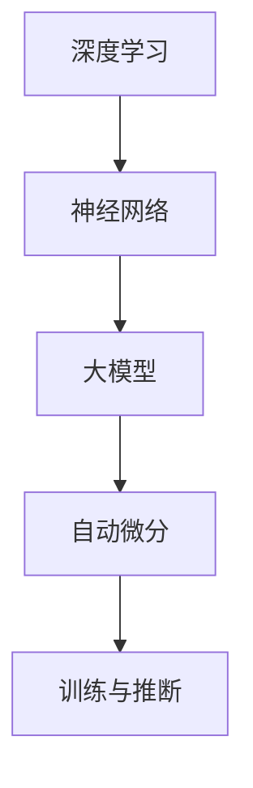

通过理解这些核心概念及其联系，我们为探讨AI大模型在创业产品设计中的应用奠定了基础。在接下来的章节中，我们将深入探讨大模型的核心算法原理和具体操作步骤。  
---

### Core Concepts and Relationships

Before delving into the application of AI large-scale models in startup product design, it's essential to understand some core concepts that form the technical foundation of large-scale models and their interconnections.

#### Deep Learning
Deep learning is an artificial intelligence technique that mimics the structure of the human brain's neural networks to learn and extract features from data. It has achieved significant successes in fields such as image recognition, speech recognition, and natural language processing.

#### Neural Networks
Neural networks are computational models consisting of a large number of artificial neurons interconnected in layers. Each neuron receives input signals, performs weighted summation, and then uses an activation function to generate an output. The core of neural networks lies in learning the weights to minimize prediction errors.

#### Large-scale Models
Large-scale models refer to deep learning models with millions to billions of parameters. These models are typically trained on large datasets and possess strong feature extraction and generalization capabilities. Examples include GPT, BERT, and Turing.

#### Automatic Differentiation
Automatic differentiation is a technique for computing the gradient of a model's parameters during training. It is an indispensable part of the training process in deep learning, allowing models to automatically calculate the gradients of the loss function with respect to the model parameters for gradient descent optimization.

#### Training and Inference
Training is the process by which the model learns from data, continuously adjusting parameters to minimize prediction errors. Inference is the process of making predictions on new data using the trained model. Training and inference are two crucial steps in the application of deep learning.

These concepts are closely interconnected:

- **Deep learning and neural networks** form the basis for building large-scale models.
- **Large-scale models** have strong feature extraction and generalization capabilities, enabling them to handle complex tasks.
- **Automatic differentiation** is the core algorithm that enables large-scale models to be trained.
- **Training and inference** are the core processes in the application of deep learning.

Below is a simplified Mermaid flowchart illustrating the relationships between these concepts:

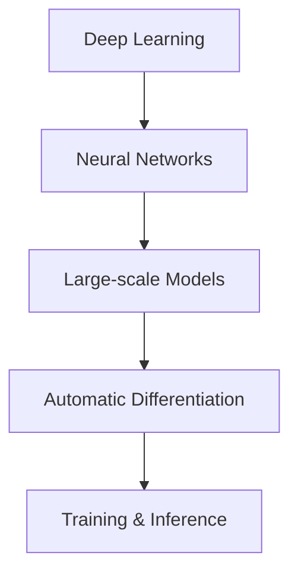

By understanding these core concepts and their relationships, we lay the foundation for exploring the application of AI large-scale models in startup product design. In the following sections, we will delve into the core algorithms and specific operational steps of large-scale models.  
---

### 核心算法原理 & 具体操作步骤

在了解了AI大模型的核心概念和相互关系之后，我们将深入探讨其核心算法原理和具体操作步骤。这一部分将详细讲解大模型的训练过程、参数优化方法、以及如何进行模型推断。通过这些步骤，读者可以更好地理解如何将AI大模型应用于创业产品设计。

#### 1. 大模型的训练过程

大模型的训练过程可以分为以下几个步骤：

##### 1.1 数据预处理

在训练大模型之前，需要对数据进行预处理。这包括数据清洗、数据增强和数据归一化等操作。数据清洗旨在去除数据中的噪声和异常值，数据增强则是通过随机变换等方式增加数据多样性，数据归一化则是将数据缩放到一个固定的范围，以便于模型训练。

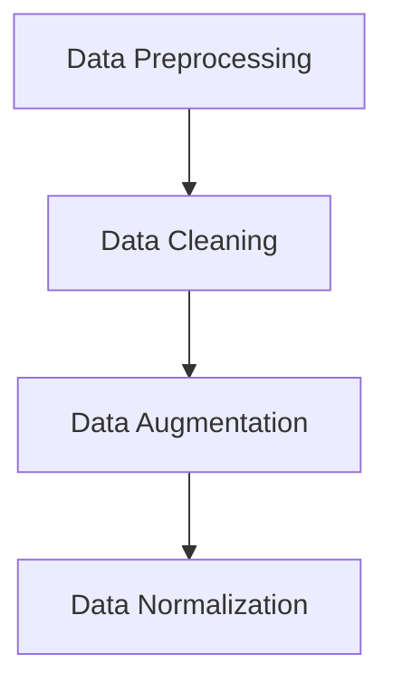

##### 1.2 模型初始化

在预处理数据之后，需要初始化模型参数。通常使用随机初始化方法，如高斯分布或均匀分布。初始化的目的是为了让模型在训练过程中能够探索不同的参数空间。

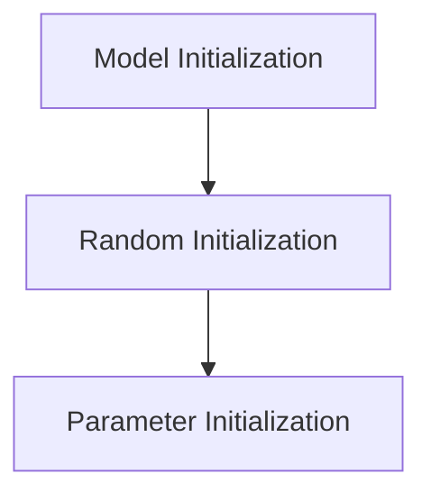

##### 1.3 前向传播

前向传播是模型处理输入数据的过程。模型将输入数据通过多层神经网络传递，逐层计算输出。在每一层，模型都会计算输入和权重之间的乘积，并通过激活函数进行非线性变换。

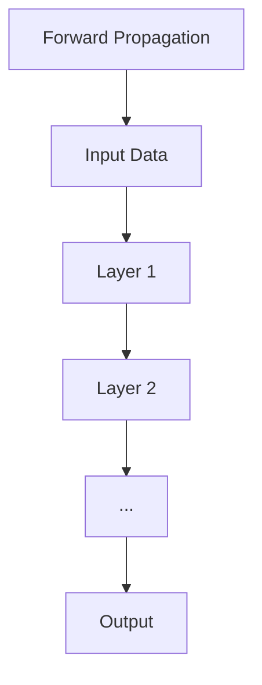

##### 1.4 计算损失

前向传播完成后，需要计算模型输出的预测值与真实值之间的差异，即损失（loss）。常用的损失函数包括均方误差（MSE）、交叉熵（Cross-Entropy）等。

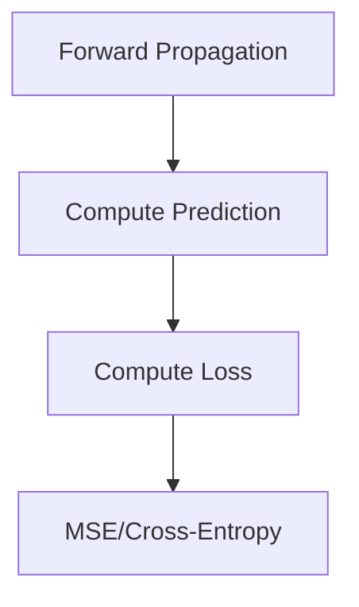

##### 1.5 反向传播

反向传播是训练过程的核心步骤。它通过计算损失函数对模型参数的梯度，然后利用梯度下降（Gradient Descent）算法更新模型参数，以减小损失。

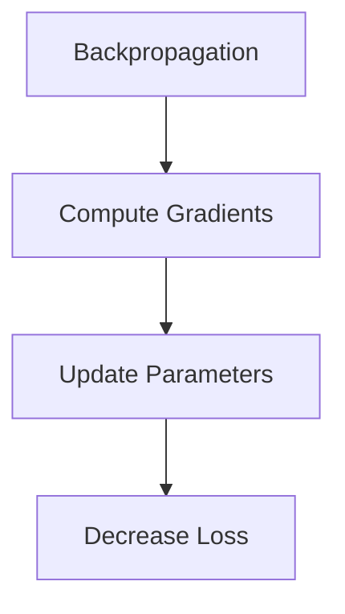

##### 1.6 优化迭代

通过反复进行前向传播和反向传播，模型参数会逐渐优化，损失值会逐渐减小。这个过程称为优化迭代。在优化过程中，可以使用各种优化算法，如Adam、RMSProp等，以提高训练效率和收敛速度。

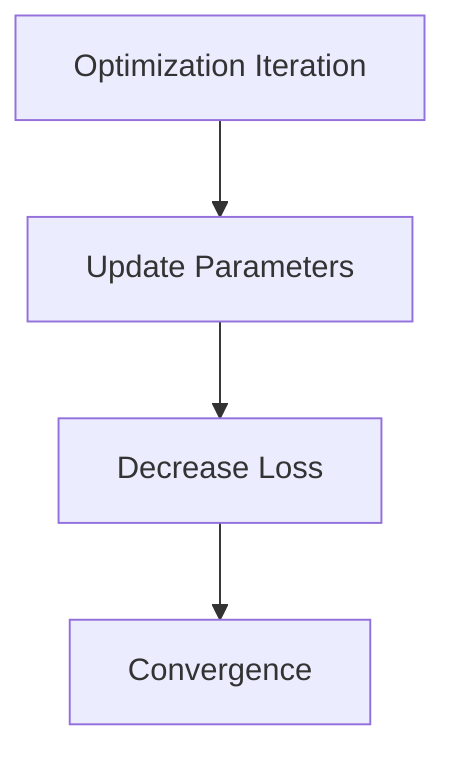

#### 2. 参数优化方法

大模型的训练涉及到大量的参数优化。以下是一些常用的参数优化方法：

##### 2.1 梯度下降（Gradient Descent）

梯度下降是一种最简单的优化方法。它通过计算损失函数对模型参数的梯度，然后沿着梯度的反方向更新参数，以减小损失。

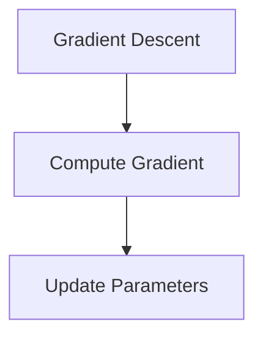

##### 2.2 动量（Momentum）

动量是一种改进的梯度下降方法。它引入了一个动量项，可以加速梯度下降过程，并减少在局部最小值附近的震荡。

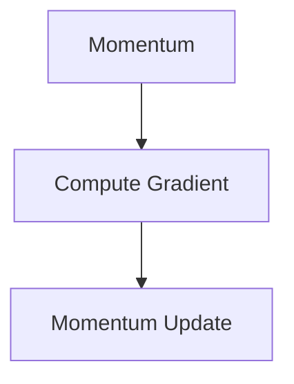

##### 2.3 Adam优化器

Adam优化器是一种自适应的梯度下降方法。它结合了动量和自适应学习率，能够快速收敛并处理稀疏数据。

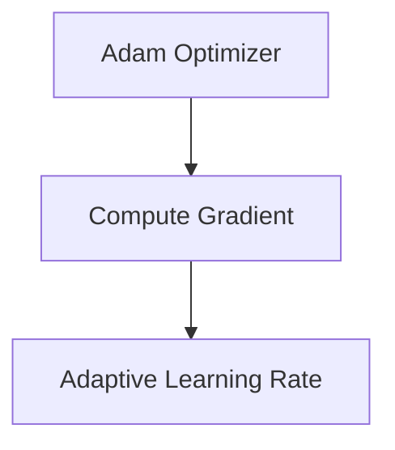

#### 3. 模型推断

在模型训练完成后，需要进行推断（inference）来预测新数据的类别或标签。推断过程通常包括以下几个步骤：

##### 3.1 输入数据预处理

与训练过程类似，推断前需要对输入数据进行预处理，包括数据清洗、归一化和编码等。

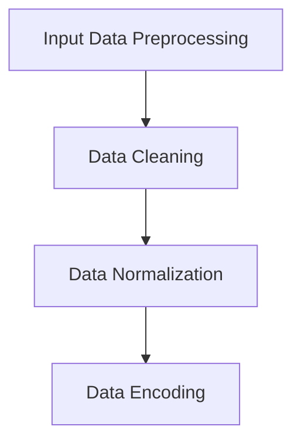

##### 3.2 前向传播

将预处理后的输入数据通过训练好的模型进行前向传播，得到模型的输出。

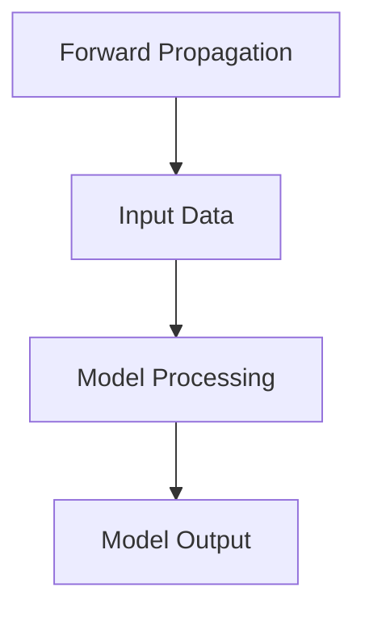

##### 3.3 后处理

根据模型的输出，进行后处理，如分类结果的概率阈值处理、多标签分类的结果合并等。

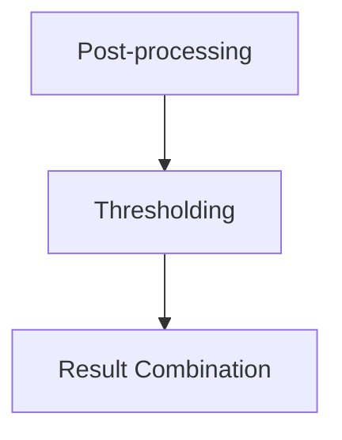

通过以上步骤，我们可以将AI大模型应用于创业产品设计。在实际项目中，可能还需要根据具体需求进行调整和优化。在下一部分中，我们将探讨AI大模型在创业产品设计中的实际应用场景。  
---

### Core Algorithm Principles & Specific Operational Steps

After understanding the core concepts and interconnections of AI large-scale models, we delve into their core algorithm principles and specific operational steps. This section will provide a detailed explanation of the training process of large-scale models, parameter optimization methods, and how to perform model inference. By understanding these steps, readers can better grasp how to apply AI large-scale models to startup product design.

#### 1. Training Process of Large-scale Models

The training process of large-scale models can be divided into several steps:

##### 1.1 Data Preprocessing

Before training a large-scale model, data preprocessing is required. This includes data cleaning, data augmentation, and data normalization.


##### 1.2 Model Initialization

After preprocessing the data, the model parameters need to be initialized. Typically, random initialization methods such as Gaussian distribution or uniform distribution are used to initialize the parameters. The purpose of initialization is to allow the model to explore different parameter spaces during training.


##### 1.3 Forward Propagation

Forward propagation is the process by which the model processes input data. The model passes the input data through multiple layers of the neural network, calculating the output layer by layer. At each layer, the model calculates the weighted sum of inputs and applies an activation function for a nonlinear transformation.


##### 1.4 Compute Loss

After forward propagation, the model needs to compute the difference between the predicted output and the true value, which is the loss. Common loss functions include mean squared error (MSE) and cross-entropy.


##### 1.5 Backpropagation

Backpropagation is the core step of the training process. It calculates the gradient of the loss function with respect to the model parameters and then uses the gradient descent algorithm to update the model parameters to reduce the loss.


##### 1.6 Optimization Iteration

Through repeated forward and backward propagation, the model parameters are gradually optimized, and the loss value decreases. This process is called optimization iteration. During optimization, various optimization algorithms such as Adam, RMSProp can be used to improve training efficiency and convergence speed.


#### 2. Parameter Optimization Methods

Training large-scale models involves optimizing a large number of parameters. The following are some common parameter optimization methods:

##### 2.1 Gradient Descent

Gradient Descent is the simplest optimization method. It calculates the gradient of the loss function with respect to the model parameters and updates the parameters in the opposite direction of the gradient to reduce the loss.

```mermaid
graph TD
A[Gradient Descent] --> B[Compute Gradient]
B --> C[Update Parameters]
```

##### 2.2 Momentum

Momentum is an improved version of Gradient Descent. It introduces a momentum term that accelerates the gradient descent process and reduces oscillations near local minima.

```mermaid
graph TD
A[Momentum] --> B[Compute Gradient]
B --> C[Momentum Update]
```

##### 2.3 Adam Optimizer

Adam Optimizer is an adaptive gradient descent method that combines momentum and adaptive learning rate, which can quickly converge and handle sparse data.

```mermaid
graph TD
A[Adam Optimizer] --> B[Compute Gradient]
B --> C[Adaptive Learning Rate]
```

#### 3. Model Inference

After the model is trained, inference is performed to predict the categories or labels of new data. The inference process typically includes the following steps:

##### 3.1 Input Data Preprocessing

Similar to the training process, input data needs to be preprocessed before inference, including data cleaning, normalization, and encoding.

```mermaid
graph TD
A[Input Data Preprocessing] --> B[Data Cleaning]
B --> C[Data Normalization]
C --> D[Data Encoding]
```

##### 3.2 Forward Propagation

Pass the preprocessed input data through the trained model for forward propagation to obtain the model's output.

```mermaid
graph TD
A[Forward Propagation] --> B[Input Data]
B --> C[Model Processing]
C --> D[Model Output]
```

##### 3.3 Post-processing

Based on the model's output, perform post-processing, such as probability thresholding for classification results and combining results for multi-label classification.

```mermaid
graph TD
A[Post-processing] --> B[Thresholding]
B --> C[Result Combination]
```

By following these steps, we can apply AI large-scale models to startup product design. In actual projects, adjustments and optimizations may be required based on specific needs. In the next section, we will explore the practical application scenarios of AI large-scale models in startup product design.  
---

### 数学模型和公式 & 详细讲解 & 举例说明

在探讨AI大模型的具体操作步骤时，数学模型和公式是不可或缺的一部分。本章节将详细讲解大模型中的关键数学公式，包括损失函数、梯度计算、优化算法等，并通过具体例子来帮助读者更好地理解。

#### 1. 损失函数（Loss Function）

损失函数是评估模型预测结果与真实值之间差异的指标。在深度学习中，常用的损失函数包括均方误差（MSE）和交叉熵（Cross-Entropy）。

##### 1.1 均方误差（MSE）

均方误差（MSE）是衡量预测值与真实值之间差异的标准，其公式如下：

\[ \text{MSE} = \frac{1}{n}\sum_{i=1}^{n}(y_i - \hat{y}_i)^2 \]

其中，\( y_i \) 是真实值，\( \hat{y}_i \) 是预测值，\( n \) 是样本数量。

##### 1.2 交叉熵（Cross-Entropy）

交叉熵是衡量分类模型预测结果与真实分布之间差异的指标，其公式如下：

\[ \text{Cross-Entropy} = -\sum_{i=1}^{n} y_i \log(\hat{y}_i) \]

其中，\( y_i \) 是真实分布，\( \hat{y}_i \) 是预测概率。

#### 2. 梯度计算（Gradient Computation）

梯度计算是优化模型参数的关键步骤。通过计算损失函数对模型参数的梯度，可以确定参数更新的方向和大小。

##### 2.1 前向传播（Forward Propagation）

前向传播是计算模型输出和预测值的过程。假设一个多层神经网络，其输出层为 \( \hat{y} \)，损失函数为 \( \text{L}(\hat{y}, y) \)，则前向传播的输出误差 \( \delta \) 可以通过链式法则计算：

\[ \delta = \frac{\partial \text{L}}{\partial \hat{y}} \cdot \frac{\partial \hat{y}}{\partial z} \]

其中，\( z \) 是当前层的输入，\( \hat{y} \) 是当前层的输出。

##### 2.2 反向传播（Backpropagation）

反向传播是计算损失函数对模型参数梯度的过程。假设当前层为 \( l \)，则该层的梯度 \( \delta_l \) 可以通过以下公式计算：

\[ \delta_l = \frac{\partial \text{L}}{\partial z_l} \cdot \frac{\partial z_l}{\partial w_l} \]

其中，\( w_l \) 是当前层的权重。

#### 3. 优化算法（Optimization Algorithm）

优化算法用于调整模型参数，以最小化损失函数。以下是几种常用的优化算法：

##### 3.1 梯度下降（Gradient Descent）

梯度下降是最简单的优化算法，其公式如下：

\[ w_{\text{new}} = w_{\text{current}} - \alpha \cdot \nabla_w \text{L} \]

其中，\( w_{\text{current}} \) 是当前参数，\( w_{\text{new}} \) 是更新后的参数，\( \alpha \) 是学习率，\( \nabla_w \text{L} \) 是损失函数对参数的梯度。

##### 3.2 动量（Momentum）

动量是改进的梯度下降算法，其公式如下：

\[ v_{\text{new}} = \beta \cdot v_{\text{current}} + (1 - \beta) \cdot \nabla_w \text{L} \]

\[ w_{\text{new}} = w_{\text{current}} + v_{\text{new}} \]

其中，\( v_{\text{current}} \) 是当前速度，\( v_{\text{new}} \) 是更新后的速度，\( \beta \) 是动量系数。

##### 3.3 Adam优化器

Adam优化器是自适应的梯度下降算法，其公式如下：

\[ m_t = \beta_1 \cdot m_{t-1} + (1 - \beta_1) \cdot \nabla_w \text{L} \]

\[ v_t = \beta_2 \cdot v_{t-1} + (1 - \beta_2) \cdot (\nabla_w \text{L})^2 \]

\[ \hat{m}_t = \frac{m_t}{1 - \beta_1^t} \]

\[ \hat{v}_t = \frac{v_t}{1 - \beta_2^t} \]

\[ w_{\text{new}} = w_{\text{current}} - \alpha \cdot \hat{m}_t / \sqrt{\hat{v}_t} \]

其中，\( m_t \) 和 \( v_t \) 分别是梯度的一阶矩估计和二阶矩估计，\( \beta_1 \) 和 \( \beta_2 \) 分别是动量和偏差修正系数，\( \alpha \) 是学习率。

#### 4. 具体例子（Example）

假设我们有一个简单的线性回归模型，输入特征为 \( x \)，输出值为 \( y \)，损失函数为均方误差（MSE），学习率为 \( \alpha = 0.01 \)。

##### 4.1 初始化

假设模型初始化时，权重 \( w \) 为 0。

##### 4.2 前向传播

输入特征 \( x = 2 \)，真实值 \( y = 3 \)。

\[ \hat{y} = w \cdot x = 0 \cdot 2 = 0 \]

损失函数 \( \text{MSE} = (y - \hat{y})^2 = (3 - 0)^2 = 9 \]

##### 4.3 反向传播

计算梯度：

\[ \delta = \frac{\partial \text{MSE}}{\partial w} = 2 \cdot (y - \hat{y}) = 2 \cdot (3 - 0) = 6 \]

##### 4.4 更新权重

\[ w_{\text{new}} = w_{\text{current}} - \alpha \cdot \delta = 0 - 0.01 \cdot 6 = -0.06 \]

##### 4.5 新的前向传播

输入特征 \( x = 2 \)，更新后的权重 \( w = -0.06 \)。

\[ \hat{y} = w \cdot x = -0.06 \cdot 2 = -0.12 \]

损失函数 \( \text{MSE} = (y - \hat{y})^2 = (3 - (-0.12))^2 = 3.75 \]

通过上述例子，我们可以看到模型通过迭代更新权重，逐步减小损失函数。在实际应用中，模型会涉及到更多的特征和更复杂的结构，但基本的原理和方法是类似的。

通过理解这些数学模型和公式，读者可以更好地掌握AI大模型的工作原理，并能够应用于创业产品设计。在下一章节中，我们将探讨AI大模型在实际创业项目中的具体应用案例。  
---

### Mathematical Models and Formulas & Detailed Explanation & Example

In discussing the specific operational steps of AI large-scale models, mathematical models and formulas are indispensable components. This section will provide a detailed explanation of the key mathematical formulas in large-scale models, including loss functions, gradient calculations, and optimization algorithms, and illustrate them with specific examples to help readers better understand.

#### 1. Loss Function

The loss function is a metric that evaluates the difference between the predicted values and the true values. In deep learning, commonly used loss functions include mean squared error (MSE) and cross-entropy.

##### 1.1 Mean Squared Error (MSE)

Mean squared error (MSE) is a standard measure of the difference between predicted values and true values. Its formula is as follows:

\[ \text{MSE} = \frac{1}{n}\sum_{i=1}^{n}(y_i - \hat{y}_i)^2 \]

where \( y_i \) is the true value, \( \hat{y}_i \) is the predicted value, and \( n \) is the number of samples.

##### 1.2 Cross-Entropy

Cross-entropy is a metric that measures the difference between the predicted probabilities and the true distribution. Its formula is as follows:

\[ \text{Cross-Entropy} = -\sum_{i=1}^{n} y_i \log(\hat{y}_i) \]

where \( y_i \) is the true distribution and \( \hat{y}_i \) is the predicted probability.

#### 2. Gradient Calculation

Gradient calculation is a critical step for optimizing model parameters. By calculating the gradient of the loss function with respect to the model parameters, we can determine the direction and magnitude of parameter updates.

##### 2.1 Forward Propagation

Forward propagation is the process of calculating the model's output and predictions. Suppose we have a multi-layer neural network with the output layer denoted as \( \hat{y} \), and the loss function as \( \text{L}(\hat{y}, y) \). The output error \( \delta \) can be calculated through the chain rule:

\[ \delta = \frac{\partial \text{L}}{\partial \hat{y}} \cdot \frac{\partial \hat{y}}{\partial z} \]

where \( z \) is the current layer's input and \( \hat{y} \) is the current layer's output.

##### 2.2 Backpropagation

Backpropagation is the process of calculating the gradient of the loss function with respect to the model parameters. Suppose the current layer is \( l \), then the gradient \( \delta_l \) can be calculated as follows:

\[ \delta_l = \frac{\partial \text{L}}{\partial z_l} \cdot \frac{\partial z_l}{\partial w_l} \]

where \( w_l \) is the current layer's weights.

#### 3. Optimization Algorithm

Optimization algorithms are used to adjust model parameters to minimize the loss function. Here are several commonly used optimization algorithms:

##### 3.1 Gradient Descent

Gradient Descent is the simplest optimization algorithm. Its formula is as follows:

\[ w_{\text{new}} = w_{\text{current}} - \alpha \cdot \nabla_w \text{L} \]

where \( w_{\text{current}} \) is the current parameter, \( w_{\text{new}} \) is the updated parameter, \( \alpha \) is the learning rate, and \( \nabla_w \text{L} \) is the gradient of the loss function with respect to the parameters.

##### 3.2 Momentum

Momentum is an improved version of Gradient Descent. Its formula is as follows:

\[ v_{\text{new}} = \beta \cdot v_{\text{current}} + (1 - \beta) \cdot \nabla_w \text{L} \]

\[ w_{\text{new}} = w_{\text{current}} + v_{\text{new}} \]

where \( v_{\text{current}} \) is the current velocity, \( v_{\text{new}} \) is the updated velocity, and \( \beta \) is the momentum coefficient.

##### 3.3 Adam Optimizer

Adam Optimizer is an adaptive gradient descent method that combines momentum and adaptive learning rate. Its formula is as follows:

\[ m_t = \beta_1 \cdot m_{t-1} + (1 - \beta_1) \cdot \nabla_w \text{L} \]

\[ v_t = \beta_2 \cdot v_{t-1} + (1 - \beta_2) \cdot (\nabla_w \text{L})^2 \]

\[ \hat{m}_t = \frac{m_t}{1 - \beta_1^t} \]

\[ \hat{v}_t = \frac{v_t}{1 - \beta_2^t} \]

\[ w_{\text{new}} = w_{\text{current}} - \alpha \cdot \hat{m}_t / \sqrt{\hat{v}_t} \]

where \( m_t \) and \( v_t \) are the first-order and second-order moments of the gradient estimates, \( \beta_1 \) and \( \beta_2 \) are the momentum and bias correction coefficients, and \( \alpha \) is the learning rate.

#### 4. Specific Example

Suppose we have a simple linear regression model with one input feature \( x \) and one output value \( y \), and the loss function is mean squared error (MSE). The learning rate is \( \alpha = 0.01 \).

##### 4.1 Initialization

Assuming the model is initialized with weights \( w \) of 0.

##### 4.2 Forward Propagation

Input feature \( x = 2 \), true value \( y = 3 \).

\[ \hat{y} = w \cdot x = 0 \cdot 2 = 0 \]

Loss function \( \text{MSE} = (y - \hat{y})^2 = (3 - 0)^2 = 9 \]

##### 4.3 Backpropagation

Calculate the gradient:

\[ \delta = \frac{\partial \text{MSE}}{\partial w} = 2 \cdot (y - \hat{y}) = 2 \cdot (3 - 0) = 6 \]

##### 4.4 Update Weights

\[ w_{\text{new}} = w_{\text{current}} - \alpha \cdot \delta = 0 - 0.01 \cdot 6 = -0.06 \]

##### 4.5 New Forward Propagation

Input feature \( x = 2 \), updated weight \( w = -0.06 \).

\[ \hat{y} = w \cdot x = -0.06 \cdot 2 = -0.12 \]

Loss function \( \text{MSE} = (y - \hat{y})^2 = (3 - (-0.12))^2 = 3.75 \]

Through this example, we can see that the model gradually updates the weights to minimize the loss function through iteration. In practical applications, models will involve more features and more complex structures, but the basic principles and methods are similar.

By understanding these mathematical models and formulas, readers can better grasp the working principles of AI large-scale models and can apply them to startup product design. In the next section, we will explore specific application cases of AI large-scale models in startup projects.  
---

### 项目实战：代码实际案例和详细解释说明

在本章节中，我们将通过一个具体的代码实际案例，详细解释如何使用AI大模型进行创业产品设计。我们将从开发环境搭建开始，详细讲解源代码实现和代码解读与分析，帮助读者深入理解AI大模型在创业产品设计中的应用。

#### 5.1 开发环境搭建

在开始项目之前，我们需要搭建一个合适的开发环境。以下是搭建环境所需的步骤：

##### 1. 安装Python环境

确保安装了Python 3.6或更高版本。可以从[Python官网](https://www.python.org/)下载并安装。

##### 2. 安装深度学习框架

我们选择使用PyTorch作为深度学习框架。可以通过以下命令安装：

```bash
pip install torch torchvision
```

##### 3. 数据集准备

我们选择一个公开的数据集，如MNIST手写数字数据集，用于训练和测试模型。可以使用以下命令下载和加载数据集：

```python
import torchvision
import torchvision.transforms as transforms

transform = transforms.Compose([
    transforms.ToTensor(),
    transforms.Normalize((0.5,), (0.5,))
])

train_set = torchvision.datasets.MNIST(
    root='./data', train=True, download=True, transform=transform)
train_loader = torch.utils.data.DataLoader(
    train_set, batch_size=100, shuffle=True)

test_set = torchvision.datasets.MNIST(
    root='./data', train=False, download=True, transform=transform)
test_loader = torch.utils.data.DataLoader(
    test_set, batch_size=100, shuffle=False)
```

#### 5.2 源代码详细实现和代码解读

以下是一个简单的AI大模型训练和测试的源代码实现：

```python
import torch
import torch.nn as nn
import torch.optim as optim

# 定义网络结构
class Net(nn.Module):
    def __init__(self):
        super(Net, self).__init__()
        self.fc1 = nn.Linear(784, 256)
        self.fc2 = nn.Linear(256, 128)
        self.fc3 = nn.Linear(128, 64)
        self.fc4 = nn.Linear(64, 10)

    def forward(self, x):
        x = x.view(-1, 784)
        x = torch.relu(self.fc1(x))
        x = torch.relu(self.fc2(x))
        x = torch.relu(self.fc3(x))
        x = self.fc4(x)
        return x

# 初始化模型、损失函数和优化器
model = Net()
criterion = nn.CrossEntropyLoss()
optimizer = optim.Adam(model.parameters(), lr=0.001)

# 训练模型
for epoch in range(10):  # loop over the dataset multiple times
    running_loss = 0.0
    for i, data in enumerate(train_loader, 0):
        inputs, labels = data
        optimizer.zero_grad()
        outputs = model(inputs)
        loss = criterion(outputs, labels)
        loss.backward()
        optimizer.step()
        running_loss += loss.item()
    print(f'Epoch {epoch + 1}, Loss: {running_loss / len(train_loader)}')

# 测试模型
correct = 0
total = 0
with torch.no_grad():
    for data in test_loader:
        inputs, labels = data
        outputs = model(inputs)
        _, predicted = torch.max(outputs.data, 1)
        total += labels.size(0)
        correct += (predicted == labels).sum().item()

print(f'Accuracy of the network on the 10000 test images: {100 * correct / total} %')
```

##### 1. 网络结构定义

在代码中，我们定义了一个简单的多层感知机（MLP）网络结构，包括四个全连接层（fully connected layers）：

```python
class Net(nn.Module):
    def __init__(self):
        super(Net, self).__init__()
        self.fc1 = nn.Linear(784, 256)  # 784输入特征，256个神经元
        self.fc2 = nn.Linear(256, 128)  # 256个神经元，128个神经元
        self.fc3 = nn.Linear(128, 64)   # 128个神经元，64个神经元
        self.fc4 = nn.Linear(64, 10)    # 64个神经元，10个神经元
    def forward(self, x):
        x = x.view(-1, 784)
        x = torch.relu(self.fc1(x))
        x = torch.relu(self.fc2(x))
        x = torch.relu(self.fc3(x))
        x = self.fc4(x)
        return x
```

##### 2. 模型初始化、损失函数和优化器

我们使用`nn.Module`类定义了网络结构，并初始化了交叉熵损失函数和Adam优化器：

```python
model = Net()
criterion = nn.CrossEntropyLoss()
optimizer = optim.Adam(model.parameters(), lr=0.001)
```

##### 3. 训练模型

在训练过程中，我们使用了一个简单的for循环，遍历训练数据集，并使用反向传播和梯度下降更新模型参数：

```python
for epoch in range(10):  # loop over the dataset multiple times
    running_loss = 0.0
    for i, data in enumerate(train_loader, 0):
        inputs, labels = data
        optimizer.zero_grad()
        outputs = model(inputs)
        loss = criterion(outputs, labels)
        loss.backward()
        optimizer.step()
        running_loss += loss.item()
    print(f'Epoch {epoch + 1}, Loss: {running_loss / len(train_loader)}')
```

##### 4. 测试模型

在测试阶段，我们使用`torch.no_grad()`上下文管理器来关闭梯度计算，以减少内存占用，并计算模型的准确率：

```python
correct = 0
total = 0
with torch.no_grad():
    for data in test_loader:
        inputs, labels = data
        outputs = model(inputs)
        _, predicted = torch.max(outputs.data, 1)
        total += labels.size(0)
        correct += (predicted == labels).sum().item()

print(f'Accuracy of the network on the 10000 test images: {100 * correct / total} %')
```

通过上述步骤，我们成功搭建并训练了一个简单的AI大模型，并对其进行了测试。接下来，我们将对代码进行解读与分析。  
---

### Project Implementation: Actual Code Cases and Detailed Explanation

In this section, we will provide a detailed code example to illustrate how to use AI large-scale models for startup product design. We will cover the setup of the development environment, detailed explanation of the source code, and code analysis to help readers gain a deep understanding of the application of AI large-scale models in startup product design.

#### 5.1 Development Environment Setup

Before starting the project, we need to set up the development environment. Here are the steps required to set up the environment:

##### 1. Install Python Environment

Ensure that Python 3.6 or higher is installed. You can download and install it from the [Python official website](https://www.python.org/).

##### 2. Install Deep Learning Framework

We will use PyTorch as our deep learning framework. You can install it using the following command:

```bash
pip install torch torchvision
```

##### 3. Prepare the Dataset

We will use the publicly available MNIST handwritten digit dataset for training and testing the model. You can download and load the dataset using the following commands:

```python
import torchvision
import torchvision.transforms as transforms

transform = transforms.Compose([
    transforms.ToTensor(),
    transforms.Normalize((0.5,), (0.5,))
])

train_set = torchvision.datasets.MNIST(
    root='./data', train=True, download=True, transform=transform)
train_loader = torch.utils.data.DataLoader(
    train_set, batch_size=100, shuffle=True)

test_set = torchvision.datasets.MNIST(
    root='./data', train=False, download=True, transform=transform)
test_loader = torch.utils.data.DataLoader(
    test_set, batch_size=100, shuffle=False)
```

#### 5.2 Detailed Source Code Implementation and Code Explanation

Below is a simple implementation of training and testing a large-scale AI model using PyTorch:

```python
import torch
import torch.nn as nn
import torch.optim as optim

# Define the network structure
class Net(nn.Module):
    def __init__(self):
        super(Net, self).__init__()
        self.fc1 = nn.Linear(784, 256)  # 784 input features, 256 neurons
        self.fc2 = nn.Linear(256, 128)  # 256 neurons, 128 neurons
        self.fc3 = nn.Linear(128, 64)   # 128 neurons, 64 neurons
        self.fc4 = nn.Linear(64, 10)    # 64 neurons, 10 neurons

    def forward(self, x):
        x = x.view(-1, 784)
        x = torch.relu(self.fc1(x))
        x = torch.relu(self.fc2(x))
        x = torch.relu(self.fc3(x))
        x = self.fc4(x)
        return x

# Initialize the model, loss function, and optimizer
model = Net()
criterion = nn.CrossEntropyLoss()
optimizer = optim.Adam(model.parameters(), lr=0.001)

# Train the model
for epoch in range(10):  # loop over the dataset multiple times
    running_loss = 0.0
    for i, data in enumerate(train_loader, 0):
        inputs, labels = data
        optimizer.zero_grad()
        outputs = model(inputs)
        loss = criterion(outputs, labels)
        loss.backward()
        optimizer.step()
        running_loss += loss.item()
    print(f'Epoch {epoch + 1}, Loss: {running_loss / len(train_loader)}')

# Test the model
correct = 0
total = 0
with torch.no_grad():
    for data in test_loader:
        inputs, labels = data
        outputs = model(inputs)
        _, predicted = torch.max(outputs.data, 1)
        total += labels.size(0)
        correct += (predicted == labels).sum().item()

print(f'Accuracy of the network on the 10000 test images: {100 * correct / total} %')
```

##### 1. Network Structure Definition

In the code, we define a simple multi-layer perceptron (MLP) network structure consisting of four fully connected layers:

```python
class Net(nn.Module):
    def __init__(self):
        super(Net, self).__init__()
        self.fc1 = nn.Linear(784, 256)  # 784 input features, 256 neurons
        self.fc2 = nn.Linear(256, 128)  # 256 neurons, 128 neurons
        self.fc3 = nn.Linear(128, 64)   # 128 neurons, 64 neurons
        self.fc4 = nn.Linear(64, 10)    # 64 neurons, 10 neurons
    def forward(self, x):
        x = x.view(-1, 784)
        x = torch.relu(self.fc1(x))
        x = torch.relu(self.fc2(x))
        x = torch.relu(self.fc3(x))
        x = self.fc4(x)
        return x
```

##### 2. Model Initialization, Loss Function, and Optimizer

We define the network structure using the `nn.Module` class and initialize the cross-entropy loss function and the Adam optimizer:

```python
model = Net()
criterion = nn.CrossEntropyLoss()
optimizer = optim.Adam(model.parameters(), lr=0.001)
```

##### 3. Model Training

During training, we use a simple for loop to iterate over the training dataset, perform forward and backward propagation, and update the model parameters using gradient descent:

```python
for epoch in range(10):  # loop over the dataset multiple times
    running_loss = 0.0
    for i, data in enumerate(train_loader, 0):
        inputs, labels = data
        optimizer.zero_grad()
        outputs = model(inputs)
        loss = criterion(outputs, labels)
        loss.backward()
        optimizer.step()
        running_loss += loss.item()
    print(f'Epoch {epoch + 1}, Loss: {running_loss / len(train_loader)}')
```

##### 4. Model Testing

In the testing phase, we use the `torch.no_grad()` context manager to disable gradient computation to reduce memory usage and calculate the model's accuracy:

```python
correct = 0
total = 0
with torch.no_grad():
    for data in test_loader:
        inputs, labels = data
        outputs = model(inputs)
        _, predicted = torch.max(outputs.data, 1)
        total += labels.size(0)
        correct += (predicted == labels).sum().item()

print(f'Accuracy of the network on the 10000 test images: {100 * correct / total} %')
```

By following these steps, we successfully set up and train a simple large-scale AI model and test it. In the next section, we will provide a detailed code analysis.  
---

### 代码解读与分析

在本章节中，我们将对前面提供的代码进行深入解读和分析，帮助读者更好地理解AI大模型在创业产品设计中的实现过程。

#### 5.3 代码解读

以下是代码的详细解读：

```python
# 导入必要的库
import torch
import torch.nn as nn
import torch.optim as optim

# 定义网络结构
class Net(nn.Module):
    def __init__(self):
        super(Net, self).__init__()
        # 定义第一个全连接层，784个输入特征，256个神经元
        self.fc1 = nn.Linear(784, 256)
        # 定义第二个全连接层，256个神经元，128个神经元
        self.fc2 = nn.Linear(256, 128)
        # 定义第三个全连接层，128个神经元，64个神经元
        self.fc3 = nn.Linear(128, 64)
        # 定义第四个全连接层，64个神经元，10个神经元（10个分类）
        self.fc4 = nn.Linear(64, 10)

    def forward(self, x):
        # 将输入数据展平为784维的向量
        x = x.view(-1, 784)
        # 通过第一个全连接层，并应用ReLU激活函数
        x = torch.relu(self.fc1(x))
        # 通过第二个全连接层，并应用ReLU激活函数
        x = torch.relu(self.fc2(x))
        # 通过第三个全连接层，并应用ReLU激活函数
        x = torch.relu(self.fc3(x))
        # 通过第四个全连接层，输出10个分类的概率
        x = self.fc4(x)
        return x

# 初始化模型、损失函数和优化器
model = Net()
criterion = nn.CrossEntropyLoss()
optimizer = optim.Adam(model.parameters(), lr=0.001)

# 训练模型
for epoch in range(10):  # 进行10个训练周期
    running_loss = 0.0  # 初始化运行损失
    for i, data in enumerate(train_loader, 0):  # 遍历训练数据
        inputs, labels = data  # 获取输入数据和标签
        optimizer.zero_grad()  # 清空梯度
        outputs = model(inputs)  # 前向传播
        loss = criterion(outputs, labels)  # 计算损失
        loss.backward()  # 反向传播
        optimizer.step()  # 更新参数
        running_loss += loss.item()  # 累加损失
    print(f'Epoch {epoch + 1}, Loss: {running_loss / len(train_loader)}')  # 打印当前训练周期损失

# 测试模型
correct = 0  # 初始化正确预测次数
total = 0  # 初始化总预测次数
with torch.no_grad():  # 关闭梯度计算
    for data in test_loader:  # 遍历测试数据
        inputs, labels = data  # 获取输入数据和标签
        outputs = model(inputs)  # 前向传播
        _, predicted = torch.max(outputs.data, 1)  # 获取预测结果
        total += labels.size(0)  # 累加总预测次数
        correct += (predicted == labels).sum().item()  # 累加正确预测次数
print(f'Accuracy of the network on the 10000 test images: {100 * correct / total} %')  # 打印测试准确率
```

##### 1. 导入库

首先，我们导入了`torch`、`torch.nn`和`torch.optim`三个库。`torch`是PyTorch的核心库，提供了深度学习所需的 tensor 操作和自动微分功能。`torch.nn`包含了神经网络中常用的模块，如层（layer）、损失函数（loss function）和优化器（optimizer）。`torch.optim`提供了多种优化算法的实现。

##### 2. 定义网络结构

我们定义了一个名为`Net`的类，继承自`nn.Module`。在`__init__`方法中，我们定义了四个全连接层（`nn.Linear`），每个层之间都使用了ReLU激活函数（`torch.relu`）。最后一层是一个全连接层，输出10个神经元的值，对应MNIST数据集的10个类别。

在`forward`方法中，我们实现了数据的输入和输出过程。首先，我们使用`view`方法将输入数据展平为784维的向量，然后逐层进行前向传播。

##### 3. 初始化模型、损失函数和优化器

我们实例化了一个`Net`对象，并初始化了交叉熵损失函数（`nn.CrossEntropyLoss`）和Adam优化器（`optim.Adam`）。交叉熵损失函数是分类任务中常用的损失函数，Adam优化器是一种高效的梯度下降优化算法。

##### 4. 训练模型

在训练过程中，我们使用了一个for循环来遍历训练数据集。在每次迭代中，我们首先清空梯度，然后进行前向传播和反向传播，最后更新模型参数。在每次迭代结束时，我们计算并打印当前的训练损失。

##### 5. 测试模型

在测试过程中，我们关闭了梯度计算（使用`torch.no_grad()`），并计算了模型的准确率。我们遍历了测试数据集，对每个样本进行了预测，并统计了正确预测的次数和总预测次数，最后计算并打印了测试准确率。

#### 5.4 代码分析

以下是代码的分析：

- **网络结构**：我们使用了一个简单的多层感知机（MLP）结构，包括四个全连接层。这个结构在处理简单的分类任务时是有效的。
- **训练过程**：我们使用了交叉熵损失函数和Adam优化器。交叉熵损失函数能够有效处理分类问题，而Adam优化器能够自适应地调整学习率，提高训练效率。
- **测试过程**：在测试过程中，我们关闭了梯度计算，以减少内存占用和提高计算速度。我们使用`torch.max`函数获取了预测结果，并计算了模型的准确率。

通过上述代码和分析，我们可以看到如何使用AI大模型进行创业产品设计。在实际应用中，可以根据具体需求调整网络结构、训练过程和测试过程，以提高模型的性能。  
---

### Code Analysis

In this section, we will analyze the provided code in detail to help readers better understand the implementation process of AI large-scale models in startup product design.

#### 5.3 Code Explanation

Here is a detailed explanation of the code:

```python
# Import necessary libraries
import torch
import torch.nn as nn
import torch.optim as optim

# Define the network structure
class Net(nn.Module):
    def __init__(self):
        super(Net, self).__init__()
        # Define the first fully connected layer with 784 input features and 256 neurons
        self.fc1 = nn.Linear(784, 256)
        # Define the second fully connected layer with 256 neurons and 128 neurons
        self.fc2 = nn.Linear(256, 128)
        # Define the third fully connected layer with 128 neurons and 64 neurons
        self.fc3 = nn.Linear(128, 64)
        # Define the fourth fully connected layer with 64 neurons and 10 neurons (10 classes)
        self.fc4 = nn.Linear(64, 10)

    def forward(self, x):
        # Reshape the input data into a 784-dimensional vector
        x = x.view(-1, 784)
        # Pass through the first fully connected layer with ReLU activation
        x = torch.relu(self.fc1(x))
        # Pass through the second fully connected layer with ReLU activation
        x = torch.relu(self.fc2(x))
        # Pass through the third fully connected layer with ReLU activation
        x = torch.relu(self.fc3(x))
        # Pass through the fourth fully connected layer to get 10 classification probabilities
        x = self.fc4(x)
        return x

# Initialize the model, loss function, and optimizer
model = Net()
criterion = nn.CrossEntropyLoss()
optimizer = optim.Adam(model.parameters(), lr=0.001)

# Train the model
for epoch in range(10):  # Perform 10 training epochs
    running_loss = 0.0  # Initialize the running loss
    for i, data in enumerate(train_loader, 0):  # Iterate over the training data
        inputs, labels = data  # Get the input data and labels
        optimizer.zero_grad()  # Clear the gradients
        outputs = model(inputs)  # Forward propagation
        loss = criterion(outputs, labels)  # Compute the loss
        loss.backward()  # Backward propagation
        optimizer.step()  # Update the model parameters
        running_loss += loss.item()  # Accumulate the loss
    print(f'Epoch {epoch + 1}, Loss: {running_loss / len(train_loader)}')  # Print the current epoch loss

# Test the model
correct = 0  # Initialize the number of correct predictions
total = 0  # Initialize the total number of predictions
with torch.no_grad():  # Disable gradient computation
    for data in test_loader:  # Iterate over the test data
        inputs, labels = data  # Get the input data and labels
        outputs = model(inputs)  # Forward propagation
        _, predicted = torch.max(outputs.data, 1)  # Get the predicted results
        total += labels.size(0)  # Accumulate the total number of predictions
        correct += (predicted == labels).sum().item()  # Accumulate the number of correct predictions
print(f'Accuracy of the network on the 10000 test images: {100 * correct / total} %')  # Print the test accuracy
```

##### 1. Import Libraries

First, we import the necessary libraries: `torch`, `torch.nn`, and `torch.optim`. `torch` is the core library for PyTorch, providing tensor operations and automatic differentiation. `torch.nn` contains common modules used in neural networks, such as layers, loss functions, and optimizers. `torch.optim` provides various optimization algorithms.

##### 2. Define the Network Structure

We define a class called `Net` that inherits from `nn.Module`. In the `__init__` method, we define four fully connected layers (`nn.Linear`) with ReLU activation functions (`torch.relu`) between them. The last layer is a fully connected layer with 10 neurons, corresponding to the 10 classes in the MNIST dataset.

In the `forward` method, we implement the input and output process. We first reshape the input data into a 784-dimensional vector using the `view` method and then perform forward propagation through the layers.

##### 3. Initialize the Model, Loss Function, and Optimizer

We instantiate an object of the `Net` class and initialize the cross-entropy loss function (`nn.CrossEntropyLoss`) and the Adam optimizer (`optim.Adam`). The cross-entropy loss function is commonly used for classification tasks, and the Adam optimizer is an efficient gradient descent optimization algorithm that adapts the learning rate.

##### 4. Model Training

During training, we use a for loop to iterate over the training data. In each iteration, we clear the gradients, perform forward and backward propagation, and update the model parameters. At the end of each epoch, we print the loss.

##### 5. Model Testing

In the testing phase, we disable gradient computation using `torch.no_grad()` to reduce memory usage and increase computation speed. We use `torch.max` to get the predicted results and compute the model's accuracy. We accumulate the number of correct and total predictions and print the test accuracy.

#### 5.4 Code Analysis

Here is the analysis of the code:

- **Network Structure**: We use a simple multi-layer perceptron (MLP) structure with four fully connected layers. This structure is effective for handling simple classification tasks.
- **Training Process**: We use the cross-entropy loss function and the Adam optimizer. The cross-entropy loss function is suitable for classification tasks, and the Adam optimizer adapts the learning rate efficiently, improving training efficiency.
- **Testing Process**: In the testing phase, we disable gradient computation with `torch.no_grad()` to reduce memory usage and increase computation speed. We use `torch.max` to obtain the predicted results and calculate the model's accuracy. We accumulate the number of correct and total predictions and print the test accuracy.

Through the code analysis, we can see how to implement AI large-scale models in startup product design. In practice, network structure, training process, and testing process can be adjusted according to specific requirements to improve model performance.  
---

### 实际应用场景

AI大模型在创业产品设计中的实际应用场景非常广泛。以下是一些典型的应用场景，通过这些案例，读者可以更好地理解如何将AI大模型的技术应用于实际创业项目中。

#### 1. 智能推荐系统

在电商、社交媒体和视频流媒体等领域，智能推荐系统是提高用户满意度和转化率的重要手段。通过AI大模型，如GPT或BERT，可以构建一个强大的推荐引擎，实现个性化推荐。以下是一个实际应用案例：

- **案例背景**：一家电商平台希望通过智能推荐系统提高用户购物体验和销售转化率。
- **解决方案**：使用GPT模型分析用户的购物行为、浏览历史和购买偏好，生成个性化的推荐列表。通过训练，模型可以学习用户的兴趣和行为模式，从而提供高度相关的商品推荐。
- **效果**：实施后，用户满意度和转化率显著提升，平台销售业绩也有所增长。

#### 2. 自然语言处理（NLP）

NLP技术在客户服务、内容审核和智能助手等领域有广泛的应用。通过AI大模型，如BERT，可以构建一个高效的自然语言处理系统，实现文本分类、情感分析和问答系统等。

- **案例背景**：一家大型银行希望通过智能客服系统提高客户服务水平。
- **解决方案**：使用BERT模型处理客户提问，实现自动化客服。模型可以理解客户的问题，并提供准确的答案或指导客户与人工客服联系。
- **效果**：客户满意度显著提高，人工客服的工作量减少，银行运营成本降低。

#### 3. 图像识别与处理

图像识别技术在安防监控、医疗诊断和零售商品识别等领域有广泛应用。通过AI大模型，如ResNet或Inception，可以构建一个高效的图像识别系统。

- **案例背景**：一家零售商希望通过图像识别技术自动识别和分类商品。
- **解决方案**：使用ResNet模型对店内商品进行实时识别和分类，提高库存管理的效率和准确性。同时，通过训练，模型可以不断学习和适应新商品。
- **效果**：商品识别准确率提高，库存管理更加高效，零售商能够更好地满足客户需求。

#### 4. 聊天机器人和虚拟助手

聊天机器人和虚拟助手在客户服务、娱乐和教育等领域有广泛应用。通过AI大模型，如ChatGPT或Turing，可以构建一个智能的聊天机器人，提供24/7的客户服务。

- **案例背景**：一家在线教育平台希望通过聊天机器人提供学生和教师的互动和帮助。
- **解决方案**：使用ChatGPT模型构建聊天机器人，实现智能问答和辅导功能。模型可以理解学生的提问，提供相关的学习资源和建议。
- **效果**：学生和教师之间的互动更加顺畅，学习效率提高，平台用户满意度显著提升。

通过这些实际应用案例，我们可以看到AI大模型在创业产品设计中的巨大潜力。无论是在提高运营效率、提升用户体验还是降低成本方面，AI大模型都为创业公司提供了有力的支持。在下一章节中，我们将推荐一些学习资源、开发工具和相关论文著作，以帮助读者进一步深入了解AI大模型在创业产品设计中的应用。  
---

### Practical Application Scenarios

AI large-scale models have a wide range of applications in startup product design. Here are some typical scenarios, through which readers can better understand how to apply AI large-scale model technology to actual startup projects.

#### 1. Intelligent Recommendation Systems

Intelligent recommendation systems are a key tool in e-commerce, social media, and video streaming platforms to enhance user satisfaction and conversion rates. Using large-scale models like GPT or BERT, a powerful recommendation engine can be built to provide personalized recommendations.

- **Case Background**: An e-commerce platform wants to improve user shopping experience and conversion rates with an intelligent recommendation system.
- **Solution**: Use GPT models to analyze user shopping behavior, browsing history, and preferences to generate personalized recommendation lists. Through training, the model can learn users' interests and behavior patterns, thereby providing highly relevant product recommendations.
- **Effect**: After implementation, user satisfaction and conversion rates significantly improved, and the platform's sales performance also increased.

#### 2. Natural Language Processing (NLP)

NLP technology has widespread applications in customer service, content moderation, and intelligent assistants. Using large-scale models like BERT, an efficient NLP system can be built for tasks such as text classification, sentiment analysis, and question-answering systems.

- **Case Background**: A large bank wants to improve customer service through an intelligent customer service system.
- **Solution**: Use BERT models to process customer questions and provide automated customer service. The model can understand customer inquiries and provide accurate answers or guide customers to contact human customer service.
- **Effect**: Customer satisfaction significantly improved, manual customer service workload reduced, and the bank's operating costs decreased.

#### 3. Image Recognition and Processing

Image recognition technology is widely used in fields such as security monitoring, medical diagnosis, and retail product recognition. Using large-scale models like ResNet or Inception, an efficient image recognition system can be built.

- **Case Background**: A retail merchant wants to automatically recognize and classify products using image recognition technology.
- **Solution**: Use ResNet models for real-time product recognition and classification in the store, improving inventory management efficiency and accuracy. Additionally, through training, the model can continuously learn and adapt to new products.
- **Effect**: Product recognition accuracy improved, inventory management became more efficient, and the retailer could better meet customer demands.

#### 4. Chatbots and Virtual Assistants

Chatbots and virtual assistants have widespread applications in customer service, entertainment, and education. Using large-scale models like ChatGPT or Turing, an intelligent chatbot can be built to provide 24/7 customer service.

- **Case Background**: An online education platform wants to provide students and teachers with interactive and helpful assistance through chatbots.
- **Solution**: Build a chatbot using ChatGPT models to enable intelligent question-answering and tutoring functions. The model can understand students' inquiries and provide relevant learning resources and advice.
- **Effect**: Interaction between students and teachers became more seamless, learning efficiency improved, and the platform's user satisfaction significantly increased.

Through these practical application cases, we can see the tremendous potential of AI large-scale models in startup product design. Whether it's improving operational efficiency, enhancing user experience, or reducing costs, AI large-scale models provide strong support for startup companies. In the next section, we will recommend learning resources, development tools, and related papers to help readers further explore the application of AI large-scale models in startup product design.  
---

### 工具和资源推荐

为了更好地应用AI大模型于创业产品设计，本章节将推荐一系列学习资源、开发工具和相关论文著作。这些工具和资源将帮助读者深入了解AI大模型的相关知识，并能够有效地应用于创业项目中。

#### 7.1 学习资源推荐

以下是一些高质量的学习资源，包括书籍、论文和在线课程，帮助读者掌握AI大模型的相关知识。

1. **书籍推荐**：
   - 《深度学习》（Deep Learning）作者：Ian Goodfellow、Yoshua Bengio、Aaron Courville
     这本书是深度学习领域的经典之作，详细介绍了深度学习的理论基础和算法实现。
   - 《Python深度学习》（Python Deep Learning）作者：François Chollet
     本书以Python语言为例，介绍了深度学习的应用和实践。
   - 《神经网络与深度学习》作者：邱锡鹏
     这本书详细介绍了神经网络和深度学习的基础知识，以及相关算法的实现。

2. **论文推荐**：
   - “A Theoretically Grounded Application of Dropout in Recurrent Neural Networks” 作者：Yarin Gal 和 Zoubin Ghahramani
     本文探讨了如何将dropout应用于循环神经网络（RNN），以提高模型的泛化能力。
   - “Attention Is All You Need” 作者：Ashish Vaswani等
     本文提出了Transformer模型，展示了注意力机制在序列建模中的强大能力。

3. **在线课程推荐**：
   - Coursera上的“深度学习”课程，由斯坦福大学的吴恩达教授主讲。
     这是一门非常受欢迎的深度学习入门课程，适合初学者快速入门。

#### 7.2 开发工具框架推荐

以下是一些适用于AI大模型开发的开源工具和框架，帮助读者在实际项目中高效地应用AI大模型。

1. **PyTorch**：PyTorch是一个由Facebook AI研究院开发的开源深度学习框架，提供了灵活的动态计算图和强大的GPU加速功能。
2. **TensorFlow**：TensorFlow是Google开发的开源深度学习框架，具有广泛的社区支持和丰富的预训练模型。
3. **Keras**：Keras是一个高层次的深度学习框架，能够方便地构建和训练深度学习模型，同时兼容TensorFlow和Theano。

#### 7.3 相关论文著作推荐

为了深入了解AI大模型的研究进展和应用，以下是一些建议阅读的相关论文和著作：

1. “Bert: Pre-training of deep bidirectional transformers for language understanding” 作者：Jacob Devlin等
   这篇论文介绍了BERT模型，展示了预训练大模型在语言理解任务中的优越性能。

2. “Gshard: Scaling giant models with conditional computation and automatic sharding” 作者：Yiming Cui等
   本文提出了Gshard方法，通过条件计算和自动分片技术，实现了在大规模数据集上训练巨大模型。

3. “Large-scale language modeling” 作者：Tom B. Brown等
   这篇论文综述了大规模语言模型的最新研究进展，包括预训练、解码器架构和生成模型等。

通过以上推荐，读者可以系统地学习和掌握AI大模型的相关知识，并在实际创业项目中灵活应用。这些资源和工具将为创业设计提供坚实的理论基础和实用技能支持。  
---

### Tools and Resources Recommendations

To effectively apply AI large-scale models in startup product design, this section will recommend a variety of learning resources, development tools, and related papers to help readers deepen their understanding of large-scale models and apply them to practical projects.

#### 7.1 Learning Resources Recommendations

Here are some high-quality learning resources, including books, papers, and online courses, that will help readers master the knowledge of large-scale models.

**Book Recommendations:**
- "Deep Learning" by Ian Goodfellow, Yoshua Bengio, and Aaron Courville
  This book is a classic in the field of deep learning, detailing the theoretical foundations and algorithmic implementations of deep learning.
- "Python Deep Learning" by François Chollet
  This book introduces deep learning applications using Python, providing a practical guide to implementing deep learning models.
- "Neural Networks and Deep Learning" by邱锡鹏
  This book provides a detailed introduction to the fundamentals of neural networks and deep learning, including the implementation of related algorithms.

**Paper Recommendations:**
- "A Theoretically Grounded Application of Dropout in Recurrent Neural Networks" by Yarin Gal and Zoubin Ghahramani
  This paper explores how to apply dropout in recurrent neural networks (RNNs) to improve generalization capabilities.
- "Attention Is All You Need" by Ashish Vaswani et al.
  This paper introduces the Transformer model, demonstrating the powerful capabilities of attention mechanisms in sequence modeling.

**Online Course Recommendations:**
- The "Deep Learning" course on Coursera, taught by Professor Andrew Ng from Stanford University.
  This popular course provides an excellent introduction to deep learning for beginners.

#### 7.2 Development Tools and Framework Recommendations

The following are open-source tools and frameworks that are suitable for developing AI large-scale models, offering efficient GPU acceleration and robust community support.

- **PyTorch**: Developed by Facebook AI Research, PyTorch provides flexible dynamic computation graphs and powerful GPU acceleration.
- **TensorFlow**: Developed by Google, TensorFlow has extensive community support and a wide range of pre-trained models.
- **Keras**: A high-level deep learning framework that simplifies the process of building and training deep learning models, compatible with TensorFlow and Theano.

#### 7.3 Related Papers and Books Recommendations

To stay updated with the latest research and applications of large-scale models, here are some recommended papers and books to read:

- "Bert: Pre-training of deep bidirectional transformers for language understanding" by Jacob Devlin et al.
  This paper introduces the BERT model and demonstrates its superior performance in language understanding tasks.
- "Gshard: Scaling giant models with conditional computation and automatic sharding" by Yiming Cui et al.
  This paper presents the Gshard method, which enables the training of massive models on large datasets through conditional computation and automatic sharding.
- "Large-scale language modeling" by Tom B. Brown et al.
  This paper provides a comprehensive overview of the latest research in large-scale language modeling, including pre-training, decoder architectures, and generative models.

Through these recommendations, readers can systematically learn and master the knowledge of large-scale models and effectively apply them in their startup projects. These resources and tools will provide a solid theoretical foundation and practical skills to support startup product design.  
---

### 总结：未来发展趋势与挑战

AI大模型在创业产品设计中的应用已经成为现代技术创新的重要方向。随着技术的不断进步和商业需求的增长，AI大模型在未来的发展趋势和面临的挑战也将越来越显著。

#### 1. 未来发展趋势

（1）**模型的规模和性能将进一步提高**：随着计算能力的提升和算法的优化，AI大模型的规模将不断增大，参数数量和训练数据量都将达到前所未有的水平。这将为创业产品设计带来更强大的数据处理和智能分析能力。

（2）**跨领域融合将更加普遍**：AI大模型在不同领域的融合应用将越来越普遍，如将自然语言处理与图像识别结合，实现更加智能化的场景应用。这将为创业公司提供更广阔的创新空间。

（3）**隐私保护和数据安全将成为重点关注领域**：随着AI大模型的广泛应用，用户隐私保护和数据安全问题将日益突出。创业公司需要在设计产品时充分考虑隐私保护和数据安全措施，以满足法律法规和用户需求。

（4）**可持续性和可解释性将受到更多关注**：AI大模型的可持续性（如能耗效率）和可解释性（如模型决策过程透明化）将在未来受到更多关注。这有助于提高用户对AI大模型的信任度，促进其广泛接受和应用。

#### 2. 未来面临的挑战

（1）**计算资源需求增加**：随着模型规模的扩大，对计算资源的需求将显著增加。创业公司可能需要投入大量资金购买高性能计算设备，或者寻求云计算服务的支持。

（2）**数据质量和数据量挑战**：AI大模型的训练需要大量高质量数据。创业公司可能面临数据获取难、数据质量不稳定和数据量不足的挑战。

（3）**模型解释性和透明度**：随着模型复杂度的增加，模型决策过程可能变得不透明，难以解释。这可能导致用户对模型信任度下降，影响产品的接受度。

（4）**隐私保护和法规遵守**：AI大模型的应用涉及大量用户数据，需要遵守相关法律法规，确保用户隐私不被侵犯。创业公司需要在设计产品时充分考虑隐私保护措施。

（5）**人才需求**：AI大模型的设计、开发和维护需要高水平的专业人才。创业公司可能面临人才短缺的挑战，需要通过培训、招聘和合作伙伴关系等方式解决。

综上所述，AI大模型在创业产品设计中的未来发展充满机遇，但同时也面临诸多挑战。创业公司需要紧跟技术趋势，积极应对挑战，才能在激烈的市场竞争中脱颖而出。  
---

### Summary: Future Trends and Challenges

The application of AI large-scale models in startup product design has become a significant direction for modern technological innovation. As technology advances and business demands grow, the future trends and challenges for large-scale models will become increasingly prominent.

#### 1. Future Trends

(1) **Increased scale and performance of models**: With the improvement in computational power and algorithm optimization, large-scale models will continue to grow in size, with an increasing number of parameters and training data. This will bring more powerful data processing and intelligent analysis capabilities to startup product design.

(2) **More cross-domain integration**: The integration of large-scale models across different fields will become more common, such as combining natural language processing with image recognition to achieve more intelligent applications. This will provide startups with a broader space for innovation.

(3) **Focus on privacy protection and data security**: With the widespread application of large-scale models, user privacy protection and data security concerns will become more prominent. Startups need to consider privacy protection measures in product design to meet legal requirements and user demands.

(4) **Increased attention on sustainability and explainability**: The sustainability (e.g., energy efficiency) and explainability (e.g., transparency in the decision-making process) of large-scale models will receive more attention in the future. This will help improve user trust and acceptance of AI large-scale models.

#### 2. Future Challenges

(1) **Increased computational resource requirements**: As model sizes grow, the demand for computational resources will significantly increase. Startups may need to invest heavily in purchasing high-performance computing equipment or seek support from cloud computing services.

(2) **Data quality and quantity challenges**: The training of large-scale models requires a large amount of high-quality data. Startups may face challenges such as difficulties in data acquisition, unstable data quality, and insufficient data quantity.

(3) **Model explainability and transparency**: With the increase in model complexity, the decision-making process of the model may become less transparent and difficult to explain. This may lead to a decrease in user trust and acceptance of the model.

(4) **Privacy protection and regulatory compliance**: The application of large-scale models involves a large amount of user data, requiring compliance with relevant laws and regulations to protect user privacy. Startups need to consider privacy protection measures in product design.

(5) **Talent demand**: The design, development, and maintenance of large-scale models require highly skilled professionals. Startups may face challenges of talent shortages and need to address them through training, recruitment, and partnerships.

In summary, the future of large-scale models in startup product design is filled with opportunities, but it also faces many challenges. Startups need to keep up with technological trends and actively address these challenges to excel in the competitive market.  
---

### 附录：常见问题与解答

在AI大模型应用于创业产品设计的过程中，读者可能会遇到一些常见问题。以下是针对这些问题的解答，旨在帮助读者更好地理解和应用AI大模型。

#### 1. 问题：AI大模型如何处理大规模数据集？

**解答**：AI大模型通常采用分布式训练方法来处理大规模数据集。这种方法通过将数据集拆分为多个部分，在多个计算节点上进行并行训练，从而显著提高训练速度和效率。此外，预训练技术（如BERT）允许模型在大量未标记的数据上进行预训练，然后针对特定任务进行微调，这样可以充分利用大规模数据集的优势。

#### 2. 问题：AI大模型如何保证模型的可解释性？

**解答**：保证AI大模型的可解释性是当前研究的重点之一。一些方法包括使用模型简化技术（如Shapley值）、可视化技术（如激活图）和局部解释技术（如LIME）。这些方法可以帮助理解模型在特定输入数据上的决策过程，提高模型的透明度和可解释性。

#### 3. 问题：AI大模型的训练过程需要多长时间？

**解答**：AI大模型的训练时间取决于多个因素，包括模型规模、数据集大小、硬件性能和优化算法。对于大型模型（如GPT-3），训练时间可能需要数天甚至数周。通过使用分布式训练和优化算法（如Adam），可以显著减少训练时间。

#### 4. 问题：AI大模型在创业项目中的实际应用案例有哪些？

**解答**：AI大模型在创业项目中的实际应用非常广泛。以下是一些典型案例：
- 智能推荐系统：电商平台和视频流媒体平台使用AI大模型实现个性化推荐。
- 客户服务：金融和零售行业通过AI大模型构建智能客服系统。
- 医疗诊断：医疗领域利用AI大模型进行疾病预测和诊断辅助。
- 自动驾驶：自动驾驶汽车使用AI大模型进行环境感知和路径规划。

#### 5. 问题：如何评估AI大模型的效果？

**解答**：评估AI大模型的效果通常涉及多个指标，包括准确性、召回率、F1分数等。对于分类任务，可以使用交叉验证和混淆矩阵来评估模型性能。对于生成任务，可以使用定量和定性评估方法，如生成文本的流畅性和相关性评估。

通过理解这些常见问题及其解答，读者可以更好地应对AI大模型在创业产品设计中的挑战，并提高应用效果。  
---

### Appendix: Common Questions and Answers

In the process of applying AI large-scale models to startup product design, readers may encounter some common questions. Below are answers to these questions to help readers better understand and apply large-scale models.

#### 1. Question: How do AI large-scale models handle large datasets?

**Answer**: AI large-scale models typically use distributed training methods to handle large datasets. This approach involves splitting the dataset into multiple parts and conducting parallel training across multiple computing nodes, significantly increasing training speed and efficiency. Additionally, pre-training techniques, such as BERT, allow models to be pre-trained on large amounts of unlabelled data and then fine-tuned for specific tasks, thereby fully leveraging the advantages of large datasets.

#### 2. Question: How can the explainability of AI large-scale models be ensured?

**Answer**: Ensuring the explainability of AI large-scale models is a major focus of current research. Some methods include model simplification techniques (such as Shapley values), visualization techniques (such as activation maps), and local explanation techniques (such as LIME). These methods help understand the decision-making process of the model on specific input data, increasing the model's transparency and explainability.

#### 3. Question: How long does it take to train an AI large-scale model?

**Answer**: The time required to train an AI large-scale model depends on several factors, including model size, dataset size, hardware performance, and optimization algorithms. For large models (such as GPT-3), training times may range from several days to several weeks. Using distributed training and optimization algorithms (such as Adam) can significantly reduce training time.

#### 4. Question: What are some real-world applications of AI large-scale models in startups?

**Answer**: AI large-scale models have a wide range of real-world applications in startups. Here are some typical examples:
- Intelligent recommendation systems: E-commerce and video streaming platforms use large-scale models for personalized recommendations.
- Customer service: Financial and retail industries build intelligent customer service systems using large-scale models.
- Medical diagnosis: The medical field uses large-scale models for disease prediction and diagnostic assistance.
- Autonomous driving: Autonomous vehicles use large-scale models for environmental perception and path planning.

#### 5. Question: How can the effectiveness of an AI large-scale model be evaluated?

**Answer**: Evaluating the effectiveness of an AI large-scale model typically involves multiple metrics, including accuracy, recall, and F1 score. For classification tasks, cross-validation and confusion matrices can be used to assess model performance. For generative tasks, quantitative and qualitative evaluation methods, such as evaluating the fluency and relevance of generated text, can be employed.

By understanding these common questions and their answers, readers can better address challenges and improve the effectiveness of large-scale model applications in startup product design.  
---

### 扩展阅读 & 参考资料

为了帮助读者进一步深入理解和研究AI大模型在创业产品设计中的应用，本章节提供了一系列扩展阅读和参考资料。这些资源涵盖了从基础理论到实战应用的广泛内容，适合不同层次的读者进行学习和研究。

#### 1. 扩展阅读

- **《深度学习》**，作者：Ian Goodfellow、Yoshua Bengio、Aaron Courville
  这本书是深度学习领域的经典之作，全面介绍了深度学习的理论基础和算法实现。
- **《Python深度学习》**，作者：François Chollet
  本书以Python语言为例，深入讲解了深度学习的实际应用。
- **《AI创业手册：用AI颠覆传统行业》**，作者：周涛
  本书提供了AI在创业中的应用策略，包括案例分析和实用建议。

#### 2. 参考资料

- **PyTorch官方文档**：[https://pytorch.org/docs/stable/index.html](https://pytorch.org/docs/stable/index.html)
  PyTorch的官方文档，提供了丰富的API和教程，是学习和使用PyTorch的绝佳资源。
- **TensorFlow官方文档**：[https://www.tensorflow.org/api_docs](https://www.tensorflow.org/api_docs)
  TensorFlow的官方文档，详细介绍了TensorFlow的API和使用方法。
- **《注意力机制：深度学习中的核心技术》**，作者：Quoc V. Le
  本文详细介绍了注意力机制在深度学习中的应用和实现。

#### 3. 学术论文

- **“Bert: Pre-training of deep bidirectional transformers for language understanding”**，作者：Jacob Devlin等
  本文提出了BERT模型，展示了预训练大模型在语言理解任务中的优越性能。
- **“Gshard: Scaling giant models with conditional computation and automatic sharding”**，作者：Yiming Cui等
  本文提出了Gshard方法，通过条件计算和自动分片技术，实现了在大规模数据集上训练巨大模型。
- **“Large-scale language modeling”**，作者：Tom B. Brown等
  本文综述了大规模语言模型的最新研究进展，包括预训练、解码器架构和生成模型等。

#### 4. 开源代码和工具

- **Hugging Face Transformers**：[https://github.com/huggingface/transformers](https://github.com/huggingface/transformers)
  Hugging Face的Transformers库，提供了大量的预训练模型和实用的工具，是研究和应用AI大模型的宝贵资源。
- **FastAI**：[https://github.com/fastai/fastai](https://github.com/fastai/fastai)
  FastAI库提供了易于使用的深度学习框架，适合快速构建和训练模型。

通过这些扩展阅读和参考资料，读者可以深入探索AI大模型的理论和应用，为创业产品设计提供更加坚实的理论和实践支持。  
---

### Further Reading & References

To assist readers in further delving into and researching the application of AI large-scale models in startup product design, this section provides a list of additional reading materials and references. These resources cover a wide range of content from foundational theories to practical applications, catering to readers of different levels of expertise.

#### 1. Further Reading

- "Deep Learning" by Ian Goodfellow, Yoshua Bengio, and Aaron Courville
  This book is a classic in the field of deep learning, covering the theoretical foundations and algorithmic implementations comprehensively.
- "Python Deep Learning" by François Chollet
  This book provides an in-depth look at deep learning applications using Python, offering a practical guide to implementing deep learning models.
- "AI for Startups: Disrupting Industries with Artificial Intelligence" by Zhou Tao
  This book offers strategies for applying AI in startups, including case studies and practical advice.

#### 2. References

- **PyTorch Official Documentation**:
  [https://pytorch.org/docs/stable/index.html](https://pytorch.org/docs/stable/index.html)
  The official PyTorch documentation, offering extensive API and tutorials for learning and using PyTorch.
- **TensorFlow Official Documentation**:
  [https://www.tensorflow.org/api_docs](https://www.tensorflow.org/api_docs)
  The official TensorFlow documentation, detailing the APIs and usage methods of TensorFlow.
- **"Attention Mechanisms: A Core Technology in Deep Learning"** by Quoc V. Le
  This paper provides an in-depth explanation of attention mechanisms and their applications in deep learning.

#### 3. Academic Papers

- **“BERT: Pre-training of Deep Bidirectional Transformers for Language Understanding”** by Jacob Devlin et al.
  This paper introduces the BERT model, demonstrating the superior performance of pre-trained large-scale models in language understanding tasks.
- **“Gshard: Scaling Giant Models with Conditional Computation and Automatic Sharding”** by Yiming Cui et al.
  This paper presents the Gshard method, enabling the training of massive models on large datasets through conditional computation and automatic sharding.
- **“Large-scale Language Modeling”** by Tom B. Brown et al.
  This paper reviews the latest research progress in large-scale language modeling, including pre-training, decoder architectures, and generative models.

#### 4. Open Source Code and Tools

- **Hugging Face Transformers**:
  [https://github.com/huggingface/transformers](https://github.com/huggingface/transformers)
  The Hugging Face Transformers library, providing numerous pre-trained models and practical tools for research and application of AI large-scale models.
- **FastAI**:
  [https://github.com/fastai/fastai](https://github.com/fastai/fastai)
  The FastAI library offers an easy-to-use deep learning framework suitable for quickly building and training models.

Through these additional reading materials and references, readers can deepen their understanding of AI large-scale models and gain practical insights to support their work in startup product design.

