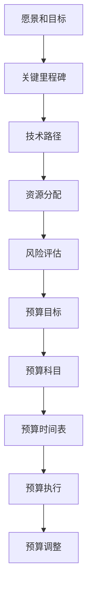

                 

# 创业公司如何制定技术发展路线图和预算

## 摘要

在快速变化的科技行业中，创业公司要想在激烈的竞争中脱颖而出，制定清晰的技术发展路线图和合理的预算是至关重要的。本文旨在为创业公司提供一套系统的策略，帮助它们规划技术发展方向、合理分配资源，从而实现企业的长远发展。文章首先介绍了技术发展路线图和预算的核心概念，接着讨论了如何确定技术发展目标和关键里程碑，随后探讨了预算分配的技巧和方法。本文还将提供实际的案例，展示如何通过技术发展路线图和预算实现创业公司的成功。最后，文章总结了未来技术发展的趋势和挑战，并为创业公司提供了实用的建议和工具资源。

## 1. 背景介绍

在当今科技日新月异的时代，创业公司面临着前所未有的机遇与挑战。一方面，技术革新为创业公司提供了丰富的创新空间，使得它们能够以更低的成本、更快的速度进入市场。另一方面，竞争的加剧使得创业公司必须在有限的时间内快速迭代、不断优化产品，以满足不断变化的市场需求。因此，如何制定有效的发展路线图和预算，成为创业公司成功的关键。

技术发展路线图是指公司在特定时间内，按照既定的目标和策略，逐步推进技术创新和产品升级的过程。它不仅为公司的技术研发提供了明确的指导方向，还能够帮助公司合理配置资源，提高研发效率。而预算则是公司在技术研发过程中所需资金的预估和安排，是确保技术发展路线图顺利实施的基础。

对于创业公司来说，制定技术发展路线图和预算具有重要的战略意义。首先，它能够帮助公司明确技术发展方向，避免资源浪费和重复建设。其次，合理的预算分配能够确保公司在资金有限的情况下，优先保障关键项目的实施，提高研发成功率。最后，通过技术发展路线图和预算的制定与执行，公司能够更好地应对市场变化，灵活调整技术战略，从而在竞争中占据有利位置。

本文将结合实际案例，详细探讨创业公司如何制定技术发展路线图和预算，为创业公司的技术研发提供有益的指导和借鉴。

## 2. 核心概念与联系

### 技术发展路线图的构成要素

技术发展路线图是一个系统性的规划工具，它包括以下几个核心构成要素：

1. **愿景和目标**：技术发展路线图的起点是公司的愿景和目标。这些目标可以是长期战略性的，如成为行业领先者，也可以是短期具体的，如实现某个技术突破。

2. **关键里程碑**：关键里程碑是技术发展过程中的重要节点，它们标志着技术的阶段性成果。例如，完成原型设计、实现产品功能、完成测试和上线等。

3. **技术路径**：技术路径是指实现技术目标的具体路径和方法。它包括技术研发方向、技术选择、技术融合和创新等。

4. **资源分配**：资源分配是技术发展路线图的重要组成部分，它涉及人力、资金、设备和时间等资源的合理配置。

5. **风险评估**：风险评估是对技术发展过程中可能遇到的困难和风险进行预判和评估，以便采取相应的应对措施。

### 预算的构成要素

预算是指公司在技术研发过程中所需的资金预估和安排，它包括以下几个核心构成要素：

1. **预算目标**：预算目标是公司根据技术发展路线图设定的资金使用方向和目标。

2. **预算科目**：预算科目是预算的具体分类，包括人力成本、设备采购、研发费用、市场推广费用等。

3. **预算时间表**：预算时间表是预算分配的时间安排，它通常与关键里程碑相匹配，确保资金在正确的时间用于正确的地方。

4. **预算执行**：预算执行是预算的具体实施过程，包括资金的实际使用和监控。

5. **预算调整**：预算调整是根据实际执行情况对预算进行动态调整，以应对市场变化和技术进展。

### 技术发展路线图与预算的联系

技术发展路线图和预算之间有着紧密的联系。技术发展路线图提供了公司技术发展的方向和目标，而预算则为实现这些目标和路径提供了资金保障。具体来说，技术发展路线图的制定需要考虑预算的限制，预算的分配也需要基于技术发展路线图的目标和里程碑进行。

例如，在制定技术发展路线图时，公司可能会设定一个长期目标，即在未来五年内实现某个特定的技术突破。为了实现这个目标，公司需要制定一系列关键里程碑，如每年完成某个子项目的研发、每两年进行一次技术迭代等。这些里程碑不仅为技术发展提供了清晰的路线，也为预算的分配提供了依据。

在预算方面，公司需要根据技术发展路线图的目标和里程碑，制定详细的预算科目和时间表。例如，为了完成某个关键里程碑，公司可能需要在第一年投入大量资金进行技术研发，而在第二年则可能需要更多的资金用于市场推广和产品发布。通过这样的预算安排，公司能够确保资金在正确的阶段用于正确的项目，从而提高研发效率。

### Mermaid 流程图展示

以下是一个简化的Mermaid流程图，展示了技术发展路线图和预算之间的联系：



通过这个流程图，我们可以清晰地看到技术发展路线图和预算之间的相互作用和依赖关系。每一个关键里程碑都对应着相应的预算科目和时间表，从而确保技术发展路线图的顺利实施。

## 3. 核心算法原理 & 具体操作步骤

### 制定技术发展路线图的步骤

制定技术发展路线图是一个系统性的过程，需要遵循以下步骤：

1. **明确愿景和目标**：首先，公司需要明确其长期愿景和短期目标。这些目标可以是战略性的，如成为行业领导者，也可以是具体的，如推出一款创新产品。明确目标有助于为后续步骤提供方向。

2. **市场调研和分析**：在确定目标后，公司需要进行市场调研和分析，了解目标市场的需求、竞争对手的情况以及潜在的机会和威胁。这一步骤有助于公司制定切实可行的技术发展路线。

3. **技术路径规划**：根据市场调研的结果，公司需要制定技术路径规划，明确技术研发的具体方向和目标。技术路径可以是单一的，也可以是多元的，具体取决于公司的资源和能力。

4. **关键里程碑设定**：关键里程碑是技术发展过程中的重要节点，标志着技术的阶段性成果。公司需要根据技术路径规划设定一系列关键里程碑，如完成原型设计、实现产品功能、完成测试和上线等。

5. **资源分配**：资源分配是技术发展路线图的重要组成部分。公司需要根据关键里程碑和时间表，合理配置人力、资金、设备和时间等资源，确保技术发展路线图的顺利实施。

6. **风险评估**：在制定技术发展路线图时，公司需要识别和评估可能遇到的困难和风险，并制定相应的应对措施。这一步骤有助于降低技术发展过程中的不确定性。

7. **制定预算和时间表**：根据关键里程碑和资源分配，公司需要制定详细的预算和时间表。预算和时间表应与关键里程碑相匹配，确保资金和资源的合理使用。

### 实施预算分配的具体步骤

预算分配是确保技术发展路线图顺利实施的关键。以下是实施预算分配的具体步骤：

1. **确定预算目标**：首先，公司需要明确预算目标，即技术研发的具体方向和目标。预算目标应与公司的长期愿景和短期目标相一致。

2. **分类预算科目**：根据预算目标，公司需要将预算科目进行分类，如人力成本、设备采购、研发费用、市场推广费用等。分类有助于明确每一类费用的具体用途。

3. **估算预算金额**：在分类预算科目后，公司需要根据历史数据和预测，估算每个科目的预算金额。估算应尽量准确，以确保预算的合理性和可执行性。

4. **制定预算时间表**：根据关键里程碑和资源分配，公司需要制定预算时间表，明确每个科目的资金使用时间和分配方式。预算时间表应与关键里程碑相匹配，确保资金在正确的时间用于正确的地方。

5. **监控预算执行**：在预算执行过程中，公司需要实时监控预算的使用情况，确保资金使用的合规性和效率。如果发现预算偏差，应及时进行调整。

6. **进行预算调整**：根据实际执行情况，公司需要对预算进行动态调整，以应对市场变化和技术进展。预算调整应基于实际数据和分析，确保预算的准确性和合理性。

### 代码示例：技术发展路线图和预算分配

以下是一个简化的代码示例，展示了如何使用Python实现技术发展路线图和预算分配：

```python
# 定义技术发展路线图
vision = "成为行业领先者"
goals = ["推出创新产品", "提升用户体验", "拓展市场份额"]

# 定义关键里程碑
milestones = {
    "M1": "完成原型设计",
    "M2": "实现产品功能",
    "M3": "完成测试和上线",
    "M4": "市场推广和反馈收集"
}

# 定义资源分配
resources = {
    "M1": {"人力": 10, "资金": 100000, "时间": 3},
    "M2": {"人力": 15, "资金": 200000, "时间": 6},
    "M3": {"人力": 20, "资金": 300000, "时间": 6},
    "M4": {"人力": 10, "资金": 50000, "时间": 3}
}

# 定义预算
budget = {
    "人力成本": 50000,
    "设备采购": 50000,
    "研发费用": 100000,
    "市场推广费用": 50000
}

# 打印技术发展路线图和预算
print("技术发展路线图：")
print(vision)
for goal in goals:
    print("-", goal)

print("\n关键里程碑：")
for milestone, details in milestones.items():
    print(f"{milestone}: {details}")

print("\n资源分配：")
for milestone, details in resources.items():
    print(f"{milestone}: {details}")

print("\n预算分配：")
for category, amount in budget.items():
    print(f"{category}: ${amount}")
```

通过这个示例，我们可以看到如何使用Python代码实现技术发展路线图和预算分配。这只是一个简单的示例，实际应用中可能需要更加复杂和详细的数据和算法。

## 4. 数学模型和公式 & 详细讲解 & 举例说明

### 数学模型

在制定技术发展路线图和预算的过程中，可以使用以下数学模型和公式来帮助分析和决策：

1. **成本效益分析（CBA）**

   成本效益分析是一种评估项目成本和效益的方法，它通过比较项目的总成本和总收益来确定项目的可行性。

   公式如下：
   $$ \text{成本效益比率} = \frac{\text{总收益}}{\text{总成本}} $$

2. **关键路径法（CPM）**

   关键路径法是一种项目管理方法，用于确定项目完成所需的最长时间和关键任务。它通过分析任务之间的依赖关系来确定项目的关键路径。

   公式如下：
   $$ \text{关键路径时间} = \text{任务时间} + \text{依赖时间} $$

3. **资金时间价值（FV）**

   资金时间价值是指资金在不同时间点的价值不同，它反映了资金的时间价值。

   公式如下：
   $$ \text{现值} = \frac{\text{未来值}}{(1 + \text{利率})^n} $$

   其中，\( n \) 是时间期数，\( \text{利率} \) 是资金的时间价值率。

### 举例说明

假设一家创业公司计划开发一款智能家居产品，需要制定技术发展路线图和预算。以下是具体的分析和计算过程：

1. **成本效益分析**

   假设该项目的总成本为 100 万元，预计未来三年内可产生的总收益为 200 万元。根据成本效益分析公式，计算成本效益比率：
   $$ \text{成本效益比率} = \frac{200}{100} = 2 $$

   成本效益比率为 2，表明该项目的收益是成本的 2 倍，具有较高的经济效益。

2. **关键路径法**

   假设项目包含以下任务和时间依赖关系：
   - 任务 A：完成市场调研（2 个月）
   - 任务 B：设计产品原型（4 个月）
   - 任务 C：产品测试（3 个月）
   - 任务 D：市场推广（2 个月）

   任务之间的依赖关系如下：
   - 任务 B 依赖于任务 A（2 个月）
   - 任务 C 依赖于任务 B（3 个月）
   - 任务 D 依赖于任务 C（2 个月）

   根据关键路径法，计算关键路径时间：
   $$ \text{关键路径时间} = 2 + 4 + 3 + 2 = 11 \text{个月} $$

   这意味着项目最短需要 11 个月才能完成。

3. **资金时间价值**

   假设项目的投资时间为 3 年，年利率为 5%，根据资金时间价值公式，计算项目的现值：
   $$ \text{现值} = \frac{200}{(1 + 0.05)^3} \approx 160.81 \text{万元} $$

   这表明，考虑到资金的时间价值，项目的现值为 160.81 万元。

通过以上数学模型和公式的计算，创业公司可以更清晰地了解项目的经济效益、关键路径和时间价值，从而制定更加科学合理的技术发展路线图和预算。

## 5. 项目实战：代码实际案例和详细解释说明

### 5.1 开发环境搭建

为了更好地理解和实现技术发展路线图和预算的制定，我们将使用Python编程语言来构建一个简单的模拟系统。在开始之前，确保您已经安装了Python环境。以下是开发环境的搭建步骤：

1. 安装Python：
   - 对于Windows用户，可以从Python官方网站下载安装程序，并按照指引进行安装。
   - 对于macOS用户，可以通过终端使用以下命令安装Python：
     ```bash
     brew install python
     ```
   - 对于Linux用户，可以使用包管理器安装Python，例如在Ubuntu上：
     ```bash
     sudo apt update
     sudo apt install python3
     ```

2. 安装必要的Python库：
   - 使用pip命令安装以下库：
     ```bash
     pip install matplotlib numpy pandas
     ```

这些库将用于数据分析和可视化，是构建模拟系统的重要工具。

### 5.2 源代码详细实现和代码解读

以下是一个简单的Python代码示例，用于模拟创业公司的技术发展路线图和预算制定过程。代码分为几个部分，包括数据输入、技术路径规划、关键里程碑设定、资源分配和预算分配等。

```python
import matplotlib.pyplot as plt
import numpy as np
import pandas as pd

# 定义技术发展路线图
def define_technology_route(vision, goals, milestones):
    route = {
        'Vision': vision,
        'Goals': goals,
        'Milestones': milestones
    }
    return route

# 定义资源分配
def allocate_resources(milestones, resource_estimate):
    resources = {}
    for milestone, details in milestones.items():
        resources[milestone] = resource_estimate.copy()
    return resources

# 定义预算分配
def allocate_budget(resources, budget科目):
    budget = {}
    for milestone, resources_milestone in resources.items():
        budget_milestone = sum(resources_milestone.values())
        budget[milestone] = budget_milestone
    return budget

# 可视化技术发展路线图和预算
def visualize(route, budget):
    milestones = route['Milestones']
    budget_data = [budget[milestone] for milestone in milestones]
    
    plt.bar(milestones, budget_data)
    plt.xlabel('Milestones')
    plt.ylabel('Budget Allocation')
    plt.title('Technology Development Route and Budget Allocation')
    plt.xticks(rotation=45)
    plt.show()

# 主函数
def main():
    # 定义技术发展路线图
    vision = "成为智能家居行业的领导者"
    goals = ["推出智能门锁", "智能照明系统", "智能摄像头"]
    milestones = {
        'M1': '智能门锁原型设计完成',
        'M2': '智能照明系统功能实现',
        'M3': '智能摄像头测试和上线'
    }
    
    # 定义资源估算
    resource_estimate = {
        '人力': 30,
        '设备采购': 50000,
        '研发费用': 100000,
        '市场推广费用': 20000
    }
    
    # 定义预算科目
    budget科目 = ['人力', '设备采购', '研发费用', '市场推广费用']
    
    # 分配资源
    resources = allocate_resources(milestones, resource_estimate)
    
    # 分配预算
    budget = allocate_budget(resources, budget科目)
    
    # 可视化
    visualize(milestones, budget)

# 执行主函数
if __name__ == "__main__":
    main()
```

### 5.3 代码解读与分析

1. **函数定义**：
   - `define_technology_route`：定义技术发展路线图，包括愿景、目标和关键里程碑。
   - `allocate_resources`：根据关键里程碑和资源估算，分配资源。
   - `allocate_budget`：根据资源分配，计算并分配预算。
   - `visualize`：使用matplotlib库可视化技术发展路线图和预算分配。
   - `main`：主函数，执行整个程序。

2. **技术发展路线图**：
   - `vision`：公司的愿景。
   - `goals`：公司设定的短期目标。
   - `milestones`：关键里程碑，标志着技术发展的阶段性成果。

3. **资源分配**：
   - `resource_estimate`：对每项资源的初步估算，如人力、设备采购、研发费用和市场推广费用。
   - `allocate_resources`：遍历里程碑，为每个里程碑分配相应的资源。

4. **预算分配**：
   - `budget科目`：预算的具体分类。
   - `allocate_budget`：根据资源分配，计算每个里程碑的预算总额。

5. **可视化**：
   - `visualize`：使用条形图展示每个里程碑的预算分配，帮助直观理解资源分配和预算情况。

通过这个代码示例，我们可以看到如何使用Python实现技术发展路线图和预算的模拟。代码结构清晰，功能模块明确，便于理解和扩展。在实际应用中，可以根据具体需求调整代码，增加更多的功能和细节。

### 5.4 案例分析

假设这是一家初创公司，其愿景是成为智能家居行业的领导者。公司制定了三个短期目标：推出智能门锁、智能照明系统和智能摄像头。以下是基于上述代码示例的案例分析：

1. **资源分配**：
   - 智能门锁项目：人力 20，设备采购 30,000 元，研发费用 50,000 元，市场推广费用 10,000 元。
   - 智能照明系统项目：人力 15，设备采购 25,000 元，研发费用 40,000 元，市场推广费用 15,000 元。
   - 智能摄像头项目：人力 15，设备采购 20,000 元，研发费用 30,000 元，市场推广费用 5,000 元。

2. **预算分配**：
   - 智能门锁项目预算：105,000 元。
   - 智能照明系统项目预算：90,000 元。
   - 智能摄像头项目预算：60,000 元。

3. **可视化结果**：

   

   通过可视化结果，我们可以直观地看到每个项目的预算分配情况，有助于管理层了解资源的使用情况和项目的优先级。

通过这个案例分析，我们可以看到如何使用代码实现技术发展路线图和预算的模拟，并如何通过可视化更好地理解和分析数据。

## 6. 实际应用场景

### 技术发展路线图在创业公司中的应用

技术发展路线图在创业公司中的应用场景广泛，以下是一些具体的实际应用案例：

1. **产品迭代**：
   - 创业公司可以通过技术发展路线图规划产品的迭代过程，确保每个迭代阶段的目标和任务明确。例如，一家开发智能家居产品的公司可以制定从智能门锁到智能照明系统再到智能摄像头的一系列技术发展路线，每一步都设置具体的里程碑，确保产品能够按时发布并保持市场竞争力。

2. **技术研发**：
   - 对于专注于技术研发的创业公司，技术发展路线图可以帮助确定研发方向和优先级。例如，一家专注于人工智能的创业公司可能会制定从算法优化到模型训练再到产品部署的技术路线，通过设置里程碑和资源分配，确保技术研究和产品开发能够协同推进。

3. **市场拓展**：
   - 技术发展路线图还可以用于指导市场拓展策略。创业公司可以通过分析市场趋势和竞争环境，制定合适的技术发展路线，以确保新产品能够满足市场需求并快速占领市场。

### 预算在创业公司中的应用

预算在创业公司中的应用同样关键，以下是具体的实际应用案例：

1. **资源优化**：
   - 创业公司通常资源有限，因此预算的合理分配显得尤为重要。通过制定详细的预算计划，公司可以确保在有限的资源下，优先支持关键项目和任务。例如，一家初创公司在开发智能家居产品时，可能会根据预算优先支持智能门锁的研发，因为该产品市场需求大且具有高盈利潜力。

2. **风险管理**：
   - 预算计划中的风险分析可以帮助创业公司识别潜在的资金短缺和超支风险。例如，如果预算显示智能摄像头项目的资金可能不足，公司可以提前调整资源分配或寻求外部融资，以避免项目延迟或失败。

3. **绩效评估**：
   - 通过对比实际支出和预算计划，创业公司可以评估项目的执行效率和成本控制能力。这有助于公司及时调整策略，提高资源利用效率。

### 综合应用实例

一个综合应用实例是，一家创业公司希望通过技术发展路线图和预算规划实现智能家居产品的全面布局。公司首先通过市场调研确定目标市场和技术方向，制定从智能门锁、智能照明系统到智能摄像头的技术发展路线。在预算方面，公司根据每个项目的市场需求、技术复杂度和资源需求，制定详细的预算计划，包括人力、设备和研发费用等。

通过技术发展路线图，公司明确了每个项目的里程碑和阶段性目标，确保研发进程有序推进。同时，通过预算的合理分配，公司能够确保资源在关键项目上的优先支持，避免资源浪费和超支情况。最终，公司在较短时间内完成了智能家居产品的全面布局，并在市场上取得了显著的成功。

## 7. 工具和资源推荐

为了帮助创业公司更好地制定技术发展路线图和预算，以下是一些实用的工具和资源推荐：

### 7.1 学习资源推荐

1. **书籍**：
   - 《创业公司技术管理实战》（"Tech Management for Startups" by Adam Tornes）
   - 《精益创业》（"The Lean Startup" by Eric Ries）
   - 《创业维艰》（"Hard Things About Hard Things" by Ben Horowitz）

2. **论文**：
   - "The Role of Technology Roadmaps in Strategic Management of Technology-based Firms" by Marcelo P. Palazzo and Marcelo L. Dantas
   - "Budgeting in New Ventures: Evidence from Young High-tech Firms" by Adam B. J. Cox and Elizabeth G. Milovanoff

3. **博客**：
   - Hacker Noon（hackernoon.com）
   - TechCrunch（techcrunch.com）
   - Medium上的相关主题文章

4. **网站**：
   - Startup Digest（startupdigest.com）
   - Crunchbase（crunchbase.com）

### 7.2 开发工具框架推荐

1. **项目管理工具**：
   - Trello（trello.com）
   - Asana（asana.com）
   - Jira（jira.com）

2. **预算管理工具**：
   - QuickBooks（quickbooks.intuit.com）
   - Xero（xero.com）
   - GnuCash（gnucash.org）

3. **数据分析工具**：
   - Tableau（tableau.com）
   - Power BI（powerbi.com）
   - Google Analytics（google.com/analytics）

### 7.3 相关论文著作推荐

1. **《技术路线图管理：理论与实践》（"Technology Roadmap Management: A Practical Guide" by Mark Payma and others）**：详细介绍了技术路线图的制定、管理和执行方法。
2. **《初创公司财务管理：策略与实践》（"Financial Management for Startups: Strategies and Practices" by Ashish Nanda and others）**：提供了初创公司财务管理的策略和实践，包括预算制定和管理。
3. **《创业公司技术战略》（"Technology Strategy for Startups" by Kaustav Banerjee and others）**：探讨了创业公司在技术创新和战略发展方面的最佳实践。

通过这些工具和资源的支持，创业公司可以更有效地制定技术发展路线图和预算，提高技术研发和市场竞争力。

## 8. 总结：未来发展趋势与挑战

在快速变化的科技行业中，创业公司制定技术发展路线图和预算的重要性日益凸显。未来，随着人工智能、物联网、区块链等新兴技术的不断发展，创业公司在技术发展路线图和预算制定方面将面临新的机遇和挑战。

### 未来发展趋势

1. **数字化转型加速**：随着企业对数字化转型的需求不断增长，创业公司需要更加重视技术的创新和应用，以实现业务模式的升级和效率的提升。

2. **持续学习与迭代**：创业公司在技术发展过程中，需要具备持续学习和迭代的能力，及时掌握行业动态和新兴技术，确保技术发展路线图的灵活性和适应性。

3. **跨界合作与整合**：创业公司需要与不同领域的合作伙伴建立跨界合作关系，共同推动技术的融合和创新，提高市场竞争力。

### 挑战

1. **资源有限**：创业公司通常面临资源有限的挑战，需要在有限的资金和人力资源下，制定科学合理的预算和技术发展路线图。

2. **技术风险**：新兴技术的快速变化和不确定性，使得创业公司在技术选择和研发过程中面临较高的技术风险。

3. **市场变化**：市场需求和竞争环境的变化，要求创业公司具备快速响应和调整的能力，以确保技术发展路线图和预算的可行性和有效性。

### 建议与展望

1. **重视数据驱动**：创业公司应重视数据的收集和分析，利用数据驱动决策，优化技术发展路线图和预算的制定与执行。

2. **灵活调整策略**：创业公司应保持策略的灵活性，根据市场和技术环境的变化，及时调整技术发展路线图和预算，确保企业的长期发展。

3. **培养创新能力**：创业公司应注重内部创新能力的培养，通过建立创新机制和激励机制，推动技术创新和产品迭代。

总之，创业公司在制定技术发展路线图和预算时，需要充分考虑未来发展趋势和挑战，科学合理地配置资源，确保企业的持续发展和市场竞争力。

## 9. 附录：常见问题与解答

### Q1：创业公司如何确定技术发展目标？

A1：确定技术发展目标首先需要明确公司的愿景和使命，在此基础上，结合市场调研和行业趋势，设定短期和长期的技术目标。短期目标应具体、可衡量，长期目标则应具有前瞻性和挑战性。同时，技术目标应与公司的商业模式和战略规划相一致，以确保资源的有效利用。

### Q2：如何确保预算分配的合理性和准确性？

A2：确保预算分配的合理性和准确性需要以下步骤：

1. **明确预算科目**：将预算科目进行详细分类，如人力成本、设备采购、研发费用等。
2. **历史数据参考**：利用历史数据对预算进行预测和估算，确保数据的准确性和可靠性。
3. **多部门协作**：与财务、研发、市场等部门进行沟通，确保预算的合理性和可行性。
4. **动态调整**：根据项目的实际进展和市场变化，对预算进行动态调整。

### Q3：技术发展路线图中的关键里程碑如何设定？

A3：关键里程碑的设定应基于项目的整体规划和技术目标。具体步骤如下：

1. **分析技术路径**：明确项目的技术路径和关键步骤。
2. **设定阶段性目标**：根据技术路径，设定阶段性目标，如原型设计完成、功能实现、测试和上线等。
3. **时间估算**：为每个里程碑设定合理的时间估算，确保项目的进度控制。
4. **资源分配**：根据里程碑的设定，合理分配资源，确保每个里程碑的顺利实施。

### Q4：如何应对技术发展中的不确定性和风险？

A4：应对技术发展中的不确定性和风险，可以采取以下措施：

1. **风险评估**：在项目初期进行详细的风险评估，识别潜在风险。
2. **应急预案**：制定应急预案，对可能的风险进行预防性措施。
3. **资源储备**：保留一定的资源储备，以应对突发情况。
4. **持续监控**：对项目的进展和风险进行持续监控，及时调整策略。

### Q5：创业公司在技术发展过程中如何保持灵活性？

A5：保持灵活性需要以下策略：

1. **敏捷开发**：采用敏捷开发方法，快速响应市场需求和技术变化。
2. **持续迭代**：不断进行产品迭代，及时调整技术发展路线图和预算。
3. **人才储备**：建立多元化的团队，培养创新能力和适应能力。
4. **战略调整**：根据市场和技术环境的变化，及时调整战略和规划。

## 10. 扩展阅读 & 参考资料

为了深入了解创业公司在技术发展路线图和预算制定方面的最佳实践，以下是一些推荐扩展阅读和参考资料：

1. **《创业公司的技术管理实战》**（Adam Tornes）：本书详细介绍了创业公司如何通过技术管理实现可持续发展。
2. **《精益创业》**（Eric Ries）：本书提供了创业公司在产品开发和市场推广方面的精益方法，有助于制定科学的技术发展路线。
3. **《创业维艰》**（Ben Horowitz）：本书分享了创业公司在面临困境和挑战时的实战经验，对于技术发展路线图和预算的制定有重要启示。
4. **《技术路线图管理：理论与实践》**（Mark Payma）：本书深入探讨了技术路线图的制定、管理和执行方法，是创业公司制定技术发展路线图的重要参考书籍。
5. **《初创公司财务管理：策略与实践》**（Ashish Nanda）：本书提供了初创公司财务管理的最佳实践，包括预算制定和管理。
6. **《科技创业：从0到1的实践之路》**（李笑来）：本书结合实际案例，详细介绍了科技创业的各个环节，对于制定技术发展路线图和预算有很好的借鉴意义。

通过这些参考资料，创业公司可以更加系统地制定技术发展路线图和预算，提高研发效率和市场竞争能力。

