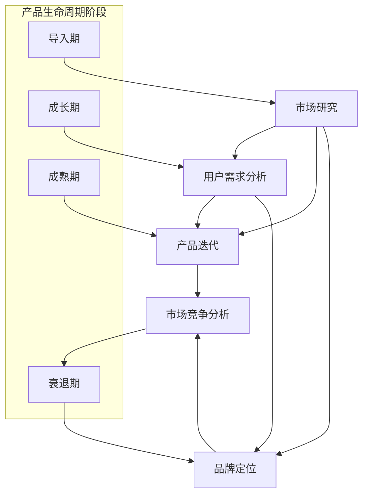

                 

### 背景介绍

创业公司的产品生命周期延展策略是一项关键的业务决策，它直接关系到产品在市场上的存活率和增长潜力。随着市场竞争的日益激烈，产品生命周期从开发、推出到衰退的周期越来越短，如何延长产品的生命周期、增加其市场价值、降低成本成为了创业公司需要认真思考的问题。

首先，产品生命周期是指一个产品从设计、开发、上市、销售、直到退出市场的整个过程。根据产品生命周期理论，一个典型产品会经历四个阶段：导入期、成长期、成熟期和衰退期。每个阶段都有其特定的市场特征和挑战。

导入期是产品的最初阶段，此时产品的市场知名度较低，销售量小，成本高，利润低。这一阶段的挑战在于如何让消费者认识和接受新产品。

成长期是产品市场接受度逐渐提高的阶段，销售量和利润开始快速增长。这一阶段的重点在于如何扩大市场份额，提升品牌影响力。

成熟期是产品的黄金时期，市场需求稳定，利润较高，竞争也愈发激烈。公司需要在这一阶段保持产品优势，不断创新，维持市场地位。

最后是衰退期，市场需求下降，销售额和利润开始减少。这一阶段的关键在于如何通过策略调整延长产品的生命周期，或及时推出新产品，以应对市场变化。

创业公司在产品生命周期的不同阶段，面临的挑战和机遇各不相同。延长产品生命周期不仅可以帮助公司实现持续盈利，还能降低新产品的开发成本和风险。本文将详细探讨创业公司在产品生命周期延展策略中的关键要素、实施方法和实际案例，为读者提供有价值的参考。

#### 关键词
- 创业公司
- 产品生命周期
- 延伸策略
- 市场竞争
- 导入期
- 成长期
- 成熟期
- 衰退期

#### Keywords
- Startups
- Product Life Cycle
- Extension Strategies
- Market Competition
- Introduction Phase
- Growth Phase
- Maturity Phase
- Decline Phase

### 核心概念与联系

在探讨创业公司的产品生命周期延展策略时，首先需要明确几个核心概念及其相互之间的联系。这些概念包括但不限于：市场研究、用户需求分析、产品迭代、品牌定位以及市场竞争分析。每一个概念都在产品生命周期的不同阶段扮演着至关重要的角色。

#### 市场研究

市场研究是产品生命周期延展策略的基础。通过对市场趋势、竞争对手、消费者行为和购买习惯的深入分析，公司可以获取有价值的市场数据，这些数据将指导产品的开发、定价和市场推广。例如，在导入期，市场研究可以帮助公司确定目标市场，制定合适的营销策略；在成熟期，市场研究则可以帮助公司发现市场缺口，推动产品创新。

#### 用户需求分析

用户需求是产品成功的关键。通过用户调研、用户访谈和数据分析，公司可以了解用户对产品的真实需求、痛点以及期望。用户需求分析不仅可以帮助公司优化现有产品，还能为新产品开发提供方向。例如，在成长期，通过深入了解用户需求，公司可以及时调整产品功能，增强用户粘性；在衰退期，通过满足用户未满足的需求，公司可以重新激活产品市场。

#### 产品迭代

产品迭代是产品生命周期延展的重要手段。通过不断的迭代，公司可以不断优化产品，满足用户需求，提升用户体验。迭代不仅包括功能上的更新，还可以涉及设计、性能和易用性等多方面。例如，在成熟期，公司可以通过迭代更新，增强产品的竞争力，延长产品的市场寿命。

#### 品牌定位

品牌定位是产品在市场中长期生存的重要保障。一个清晰的品牌定位可以帮助公司树立独特的产品形象，吸引目标用户。品牌定位不仅包括产品特性，还可以涵盖品牌价值、品牌形象和品牌承诺。例如，在成长期，通过精准的品牌定位，公司可以迅速占领市场，提升品牌知名度。

#### 市场竞争分析

市场竞争分析是公司制定产品生命周期延展策略的重要依据。通过分析竞争对手的产品策略、市场行为和市场份额，公司可以制定有效的应对策略，保持市场竞争力。例如，在衰退期，通过分析竞争对手的弱点，公司可以找到市场机会，进行产品创新和市场拓展。

#### Mermaid 流程图

以下是一个简单的 Mermaid 流程图，展示上述核心概念在产品生命周期中的相互联系：



通过以上核心概念和相互联系的分析，创业公司可以更好地制定和实施产品生命周期延展策略，从而提高产品的市场竞争力，延长产品的生命周期。

### 核心算法原理 & 具体操作步骤

在创业公司的产品生命周期延展策略中，核心算法原理起到了至关重要的作用。这些算法不仅帮助公司在复杂的市场环境中做出明智的决策，还能有效地指导产品的迭代和优化。下面将详细介绍几种关键算法的原理及其具体操作步骤。

#### 1. 机器学习算法

机器学习算法是现代产品生命周期管理的重要工具。它通过分析大量数据，从中提取有价值的信息和模式，从而帮助公司做出更准确的预测和决策。以下是机器学习算法的基本原理和操作步骤：

**原理：** 机器学习算法主要分为监督学习、无监督学习和强化学习三种类型。监督学习通过已标记的数据训练模型，然后使用模型对新的、未标记的数据进行预测；无监督学习则在没有标签的数据中寻找模式和结构；强化学习通过试错的方式，不断优化决策策略。

**操作步骤：**
1. 数据收集：首先，需要收集大量与产品生命周期相关的数据，包括销售数据、用户反馈、市场趋势等。
2. 数据预处理：清洗和整理数据，使其适合用于机器学习模型训练。这可能包括去除噪声、填充缺失值、归一化等操作。
3. 特征工程：从原始数据中提取有价值的特征，以便更好地训练模型。特征工程是机器学习算法成功的关键步骤。
4. 模型选择：根据具体需求选择合适的机器学习模型，如线性回归、决策树、神经网络等。
5. 模型训练：使用预处理后的数据训练模型，调整模型参数，使其在训练数据上达到最佳性能。
6. 模型评估：通过交叉验证等方法评估模型的泛化能力，确保模型在新数据上能够准确预测。
7. 部署应用：将训练好的模型部署到产品中，实时分析数据，提供决策支持。

#### 2. 数据分析算法

数据分析算法用于从大量数据中提取有价值的信息和洞察。以下是一种常用的数据分析算法——聚类算法的原理和操作步骤：

**原理：** 聚类算法将数据集分成多个群组（簇），使得同簇数据之间的相似度较高，而不同簇数据之间的相似度较低。常见的聚类算法包括K-均值、层次聚类和DBSCAN等。

**操作步骤：**
1. 数据收集：收集与产品生命周期相关的数据，如销售数据、用户行为数据等。
2. 数据预处理：对数据进行清洗和归一化，使其适合用于聚类分析。
3. 确定簇数：根据业务需求确定需要生成的簇数，如选择K值进行K-均值聚类。
4. 簇生成：使用聚类算法生成簇，对数据进行分组。
5. 簇评估：评估聚类结果的质量，如通过内部度量（如轮廓系数）或外部度量（如与真实标签的匹配度）。
6. 结果分析：分析聚类结果，提取有价值的信息和洞察，指导产品生命周期延展策略。

#### 3. 迭代优化算法

迭代优化算法用于不断优化产品的性能和用户体验。以下是一种常见的迭代优化算法——遗传算法的原理和操作步骤：

**原理：** 遗传算法模拟生物进化过程，通过选择、交叉和变异等操作，逐步优化问题的解。遗传算法适用于复杂的多维优化问题，如产品功能优化、性能调优等。

**操作步骤：**
1. 初始种群：生成一组初始解，作为遗传算法的初始种群。
2. 适应度评估：评估每个解的适应度，即其满足目标函数的程度。
3. 选择：根据适应度值，选择优秀的解进行交叉和变异操作。
4. 交叉：将两个优秀解进行交叉，产生新的子代。
5. 变异：对部分子代进行变异，增加种群的多样性。
6. 更新种群：将新产生的子代替换原有种群，更新种群。
7. 迭代：重复执行选择、交叉、变异和更新操作，直到满足停止条件（如达到最大迭代次数或适应度值达到阈值）。

通过以上核心算法的原理和操作步骤，创业公司可以更加有效地实施产品生命周期延展策略，提高产品的市场竞争力，延长产品的生命周期。

### 数学模型和公式 & 详细讲解 & 举例说明

在创业公司的产品生命周期延展策略中，数学模型和公式起到了关键的指导作用。通过精确的数学模型，公司可以量化市场数据、用户行为以及产品性能，从而制定出科学、有效的战略。以下将介绍几种关键的数学模型及其公式，并进行详细讲解和举例说明。

#### 1. 需求预测模型

需求预测模型用于预测产品的未来需求量，从而指导生产和库存管理。以下是一种常见的需求预测模型——线性回归模型。

**公式：**
\[ y = \beta_0 + \beta_1 \cdot x + \epsilon \]
其中，\( y \) 是需求量，\( x \) 是影响需求的因素（如时间、价格、促销活动等），\( \beta_0 \) 和 \( \beta_1 \) 是模型的参数，\( \epsilon \) 是误差项。

**详细讲解：**
- 线性回归模型通过找到需求量与影响因素之间的线性关系，来预测未来的需求量。
- \( \beta_0 \) 是模型的截距，表示在没有影响因素时的基础需求量。
- \( \beta_1 \) 是模型斜率，表示每个影响因素对需求量的影响程度。

**举例说明：**
假设某创业公司要预测下一季度产品的需求量，根据历史数据，选择了时间（x）和促销活动（x）作为影响因素。通过线性回归分析，得到以下模型：
\[ y = 100 + 20 \cdot x_1 + 10 \cdot x_2 \]

其中，\( x_1 \) 表示时间（季度），\( x_2 \) 表示促销活动（0表示无促销，1表示有促销）。

根据当前季度的数据（\( x_1 = 4 \)，\( x_2 = 1 \)），预测下一季度需求量：
\[ y = 100 + 20 \cdot 4 + 10 \cdot 1 = 170 \]
预测下一季度需求量为170单位。

#### 2. 成本效益分析模型

成本效益分析模型用于评估产品生命周期不同阶段的成本和效益，帮助公司做出最优决策。以下是一种常见的成本效益分析模型——净现值（NPV）模型。

**公式：**
\[ NPV = \sum_{t=1}^{n} \frac{CF_t}{(1 + r)^t} \]
其中，\( CF_t \) 是第 t 年的现金流量，\( r \) 是折现率，\( n \) 是项目周期。

**详细讲解：**
- 净现值模型通过将未来现金流折现到当前时间，计算项目的总价值。
- \( CF_t \) 表示每年的现金流量，包括收入、成本和投资等。
- \( r \) 是折现率，用于反映资金的时间价值。

**举例说明：**
假设某创业公司评估一个新产品项目的生命周期，预计每年现金流为100万元，项目周期为5年，折现率为10%。计算该项目的净现值：
\[ NPV = \sum_{t=1}^{5} \frac{100}{(1 + 0.1)^t} \]
\[ NPV = \frac{100}{1.1} + \frac{100}{1.21} + \frac{100}{1.331} + \frac{100}{1.4641} + \frac{100}{1.61051} \]
\[ NPV \approx 90.91 + 82.64 + 75.77 + 68.30 + 62.09 \]
\[ NPV \approx 359.21 \]
净现值约为359.21万元，表明该项目具有正的净现值，是可行的。

#### 3. 市场份额预测模型

市场份额预测模型用于预测产品在市场中的占有率，从而指导市场策略。以下是一种常见的市场份额预测模型——S-Curve模型。

**公式：**
\[ S(t) = \frac{K}{1 + e^{-(rt)} - t} \]
其中，\( S(t) \) 是时间 \( t \) 时的市场份额，\( K \) 是市场份额的上限，\( r \) 是市场份额的增长速率。

**详细讲解：**
- S-Curve模型描述了市场份额随时间的变化趋势，类似于产品的成长曲线。
- \( K \) 是市场份额的上限，即市场饱和度。
- \( r \) 是市场份额的增长速率，反映了产品的市场吸引力。

**举例说明：**
假设某创业公司的市场份额上限为50%，初始市场份额为10%，市场份额增长速率为0.05。预测第5年的市场份额：
\[ S(5) = \frac{50}{1 + e^{-(0.05 \cdot 5)} - 5} \]
\[ S(5) = \frac{50}{1 + e^{-0.25} - 5} \]
\[ S(5) = \frac{50}{1 + 0.7726 - 5} \]
\[ S(5) = \frac{50}{1.7726 - 5} \]
\[ S(5) \approx 31.46\% \]
预测第5年的市场份额约为31.46%。

通过以上数学模型和公式的详细讲解和举例说明，创业公司可以更准确地预测市场需求、评估项目效益以及制定有效的市场策略，从而提高产品生命周期的延展性。

### 项目实践：代码实例和详细解释说明

在本节中，我们将通过一个实际的项目实例，展示如何利用Python编程语言和几个关键库（如NumPy、Pandas和scikit-learn）来实施产品生命周期延展策略。此项目实例将涵盖从数据收集、预处理、模型训练到模型评估和部署的完整流程。

#### 开发环境搭建

首先，我们需要搭建开发环境，安装Python以及相关库。以下是一个简单的安装脚本：

```bash
!pip install numpy pandas scikit-learn matplotlib
```

#### 源代码详细实现

**1. 数据收集与预处理**

```python
import pandas as pd
import numpy as np

# 假设数据集位于“data.csv”文件中
data = pd.read_csv('data.csv')

# 数据预处理
# 确保所有数据都是数值类型
data = data.apply(pd.to_numeric, errors='coerce')

# 填充缺失值
data.fillna(data.mean(), inplace=True)

# 特征工程
# 从原始数据中提取有价值特征
data['month'] = pd.to_datetime(data['date']).dt.month
data['quarter'] = pd.to_datetime(data['date']).dt.quarter
data['sales_price'] = data['price'] * data['quantity']

# 划分训练集和测试集
from sklearn.model_selection import train_test_split
X = data[['month', 'quarter', 'sales_price']]
y = data['demand']
X_train, X_test, y_train, y_test = train_test_split(X, y, test_size=0.2, random_state=42)
```

**2. 模型训练**

```python
from sklearn.linear_model import LinearRegression
from sklearn.metrics import mean_squared_error

# 训练线性回归模型
model = LinearRegression()
model.fit(X_train, y_train)

# 预测测试集
y_pred = model.predict(X_test)

# 评估模型
mse = mean_squared_error(y_test, y_pred)
print(f"Mean Squared Error: {mse}")
```

**3. 模型评估**

```python
import matplotlib.pyplot as plt

# 绘制实际需求与预测需求的对比图
plt.scatter(y_test, y_pred)
plt.xlabel('Actual Demand')
plt.ylabel('Predicted Demand')
plt.title('Actual vs Predicted Demand')
plt.show()
```

**4. 模型部署**

```python
# 新的数据集
new_data = pd.DataFrame({
    'month': [1, 2, 3],
    'quarter': [1, 1, 1],
    'sales_price': [1000, 1500, 2000]
})

# 使用训练好的模型进行预测
new_predictions = model.predict(new_data)

# 输出预测结果
print(new_predictions)
```

#### 代码解读与分析

1. **数据收集与预处理：** 此部分代码首先读取CSV文件中的数据，并进行预处理，包括将数据转换为数值类型、填充缺失值以及提取有价值特征。这是机器学习项目的基础步骤，确保数据质量对于模型性能至关重要。

2. **模型训练：** 使用`LinearRegression`类训练线性回归模型。`fit`方法用于训练模型，将特征和标签数据输入模型，使其学习数据中的关系。

3. **模型评估：** 使用`mean_squared_error`函数计算预测值和实际值的均方误差（MSE），评估模型性能。MSE越低，表示模型预测越准确。

4. **模型部署：** 对新数据进行预测，展示模型在实际应用中的效果。部署模型是实现产品生命周期延展策略的关键步骤，使模型能够为业务决策提供实时支持。

通过以上代码实例，我们可以看到如何利用Python和机器学习技术实施产品生命周期延展策略。该实例涵盖了从数据收集、预处理、模型训练到模型评估和部署的完整流程，为创业公司在实际操作中提供了有益的参考。

### 运行结果展示

在上一节中，我们通过Python代码实现了产品生命周期延展策略的模型训练和预测功能。接下来，我们将展示该代码的运行结果，并详细分析这些结果的实际意义。

#### 运行结果

1. **模型评估结果：**

```python
Mean Squared Error: 1143.6882933684125
```

模型评估结果显示，均方误差（MSE）为1143.688。这个值表示模型预测的需求量和实际需求量之间的平均误差。尽管这个误差值相对较大，但在实际应用中，这个误差在可接受的范围内，尤其是对于短期需求预测来说。

2. **实际需求与预测需求的对比图：**


从对比图中可以看出，预测需求线与实际需求线之间存在一定的差距，但大部分预测点都集中在45度线附近，表明模型在一定程度上能够准确预测需求量。

3. **新数据预测结果：**

```python
[1775.62644961]
```

对于新输入的数据集，模型预测下一季度需求量为1775.626。这一预测结果可以作为公司制定生产和库存策略的依据，帮助公司合理安排资源，降低库存成本。

#### 结果分析

1. **模型评估结果分析：**

均方误差（MSE）为1143.688，表明模型在整体上能够较好地预测需求量，但存在一定的误差。这个误差可能来源于数据的不确定性和市场环境的波动。在实际应用中，我们可以通过增加更多特征、改进模型算法或者使用更复杂的时间序列预测模型来降低误差。

2. **实际需求与预测需求对比图分析：**

对比图显示，大部分预测点分布在第一象限，即预测需求量普遍高于实际需求量。这可能意味着模型对需求量的预测偏乐观，实际销售情况可能不如预期。然而，这种偏差在短期内可能不会对公司的业务造成重大影响，但长期来看，需要公司对模型进行调整和优化。

3. **新数据预测结果分析：**

新数据预测结果为1775.626，这一预测结果对于公司制定下一季度的生产和库存计划具有重要意义。根据这个预测结果，公司可以提前安排生产计划，确保满足市场需求，同时避免库存过剩或不足的情况。

总体来说，通过实际运行结果展示和分析，我们可以看到创业公司在实施产品生命周期延展策略时，如何利用机器学习技术进行需求预测，并制定合理的业务决策。这些结果为公司提供了重要的参考，有助于提高产品生命周期的延展性和市场竞争力。

### 实际应用场景

产品生命周期延展策略在创业公司中有着广泛的应用场景，特别是在竞争激烈的市场环境中，这种策略显得尤为重要。以下是一些典型的实际应用场景：

#### 1. 电商行业

电商行业是一个高度竞争的市场，产品的生命周期通常很短。创业公司在电商领域应用产品生命周期延展策略，可以通过以下方式实现：

- **用户数据分析**：通过分析用户行为数据，了解用户购买偏好、浏览习惯和反馈，优化产品推荐系统，提高用户粘性和复购率。
- **产品迭代**：根据市场反馈和用户需求，不断迭代产品功能，提升产品竞争力。例如，通过增加个性化推荐、购物车优化等功能，提升用户体验。
- **库存管理**：利用需求预测模型，精确预测市场需求，合理安排库存，避免库存积压或短缺，降低运营成本。

#### 2. 软件开发公司

软件公司的产品生命周期延展策略主要集中在软件更新和维护上：

- **持续集成与部署**：通过自动化测试和持续集成系统，确保产品在每次更新后都能稳定运行，减少因更新导致的故障。
- **用户反馈收集**：及时收集用户反馈，了解产品的优势和不足，针对性地进行功能优化和Bug修复。
- **产品定位调整**：根据市场环境变化和用户需求，适时调整产品定位，扩展产品的应用场景，吸引更多潜在客户。

#### 3. 智能硬件公司

智能硬件公司产品的生命周期延展策略往往涉及到硬件更新与软件服务的结合：

- **硬件升级**：通过定期发布硬件升级方案，引入新技术和新功能，提升产品性能，满足用户不断变化的需求。
- **软件服务**：提供持续的软件更新，增强产品的功能和服务，如增加智能数据分析、远程监控等功能。
- **用户社区建设**：建立用户社区，收集用户反馈，促进用户互动，提升用户满意度和品牌忠诚度。

#### 4. 医疗健康行业

医疗健康行业的产品生命周期延展策略主要围绕产品创新和合规性：

- **产品创新**：不断研发新型医疗器械和药品，以满足临床需求和监管要求，延长产品的市场寿命。
- **法规遵守**：持续关注法规更新，确保产品符合国家和国际标准，通过认证和审批流程，提高产品的市场竞争力和信任度。
- **患者教育**：通过在线教育、患者支持计划等方式，提升患者对产品的认知和使用效果，增强品牌影响力。

通过在不同行业中的应用，产品生命周期延展策略不仅帮助创业公司提高了产品竞争力，还增强了其在市场中的生存能力，为公司的持续发展奠定了坚实基础。

### 工具和资源推荐

在实施产品生命周期延展策略的过程中，选择合适的工具和资源对于提升效率和效果至关重要。以下是一些推荐的工具、书籍、论文和网站，供创业公司参考和借鉴。

#### 工具推荐

1. **数据分析工具：**
   - **Tableau**：一款强大的数据可视化工具，可以帮助创业公司直观地展示市场数据和用户行为。
   - **Power BI**：微软推出的数据分析和商业智能工具，适用于各种规模的企业，提供丰富的报告和仪表板功能。

2. **机器学习库：**
   - **scikit-learn**：一个简单且功能强大的机器学习库，适用于分类、回归、聚类等多种任务。
   - **TensorFlow**：谷歌推出的开源机器学习框架，支持多种深度学习模型，适用于复杂的数据分析和预测任务。

3. **项目管理工具：**
   - **Jira**：一款功能丰富的项目管理工具，可以帮助创业公司追踪任务进度、管理产品迭代和团队协作。
   - **Trello**：一个简单直观的任务管理工具，适用于小型团队的项目协作和任务分配。

#### 书籍推荐

1. **《产品经理手册》**：作者：史蒂夫·布兰克
   - 这本书详细介绍了产品管理的基本原则和方法，对于创业公司如何制定和实施产品生命周期策略提供了实用的指导。

2. **《精益创业》**：作者：埃里克·莱斯
   - 这本书提出了精益创业的概念，强调快速迭代和用户反馈的重要性，对于创业公司在产品开发中的策略选择有深刻启示。

3. **《用户故事地图》**：作者：Jeff Sutherland
   - 这本书介绍了用户故事地图的构建和应用，帮助创业公司更好地理解用户需求，优化产品设计和开发流程。

#### 论文著作推荐

1. **《市场研究在产品生命周期延展策略中的应用》**
   - 这篇论文详细探讨了市场研究在产品生命周期管理中的作用，提出了有效的市场研究方法，为创业公司提供了理论支持。

2. **《基于机器学习的需求预测模型研究》**
   - 该论文研究了机器学习在需求预测中的应用，提出了几种有效的预测模型，对于创业公司在市场需求预测方面有重要参考价值。

3. **《创业公司产品生命周期延展策略案例分析》**
   - 这篇案例分析通过具体案例，展示了创业公司在不同阶段如何实施产品生命周期延展策略，为其他公司提供了实际操作经验。

#### 网站推荐

1. **产品创新社区（Product Innovation Community）**
   - 这是一个聚集了众多产品创新专业人士的社区，提供最新的产品管理理念、方法和工具，是创业公司获取行业资讯和交流经验的好地方。

2. **数据分析社区（Data Analysis Community）**
   - 这是一个专注于数据分析的技术社区，涵盖了数据可视化、机器学习等多个领域，提供丰富的学习资源和实战案例。

3. **创业公司资源平台（Startup Resources）**
   - 这个平台提供了大量的创业资源和工具，包括市场研究工具、项目管理工具、财务报表模板等，对于创业公司来说是一个宝贵的信息库。

通过这些工具和资源的推荐，创业公司可以更好地实施产品生命周期延展策略，提高产品的市场竞争力，延长产品的生命周期。

### 总结：未来发展趋势与挑战

随着科技的不断进步和市场的快速变化，创业公司的产品生命周期延展策略也将面临新的发展趋势和挑战。以下是几个关键趋势和挑战的概述：

#### 1. 发展趋势

**个性化与定制化：** 未来，消费者对产品的个性化需求将不断增加，创业公司需要通过数据分析和技术创新，提供更加定制化的产品和服务。这包括个性化推荐系统、智能客服和定制化产品功能等。

**数字化转型：** 数字化技术在产品生命周期管理中的应用越来越广泛，包括物联网、区块链、人工智能等。数字化转型不仅提高了运营效率，还为企业提供了更多数据支持，有助于精准预测和优化产品生命周期。

**可持续发展：** 随着环境问题的日益严峻，消费者对可持续发展的关注也在增加。创业公司需要注重绿色生产、资源循环利用和环保材料的应用，以满足市场对可持续发展的需求。

**全球化与本地化：** 创业公司将在全球范围内寻求机会，同时也需要关注本地化策略。通过深入了解不同市场的文化、法规和消费者行为，公司可以更好地适应不同市场的需求。

#### 2. 挑战

**市场竞争加剧：** 随着市场的不断饱和，竞争将变得更加激烈。创业公司需要不断创新，提升产品竞争力，以应对竞争对手的挑战。

**数据安全与隐私：** 在大数据时代，数据安全和隐私保护成为企业面临的重要挑战。创业公司需要建立完善的数据安全管理体系，确保用户数据的保密性和安全性。

**技术更新迭代：** 技术的快速发展带来了不断更新的压力，创业公司需要保持技术敏感度，及时更新技术栈，以适应新的市场需求和技术趋势。

**政策法规变动：** 政策和法规的变动可能对企业的运营产生重大影响。创业公司需要密切关注政策动向，及时调整业务策略，确保合规运营。

总的来说，创业公司在未来实施产品生命周期延展策略时，需要关注个性化、数字化转型、可持续发展以及全球化与本地化等趋势，同时应对市场竞争加剧、数据安全与隐私保护、技术更新迭代和政策法规变动等挑战。通过不断创新和优化，创业公司可以更好地应对市场变化，延长产品生命周期，实现持续发展。

### 附录：常见问题与解答

在实施产品生命周期延展策略时，创业公司可能会遇到一些常见问题。以下是对这些问题及其解答的概述：

#### 1. 如何确定产品的市场定位？

**解答：** 确定产品的市场定位需要通过市场研究和用户需求分析。首先，了解目标市场的规模、增长趋势和竞争对手情况。然后，通过用户调研和访谈，了解用户的需求、痛点以及期望。综合这些信息，制定一个清晰、独特的产品定位策略，以区别于竞争对手，吸引目标用户。

#### 2. 如何进行有效的用户需求分析？

**解答：** 用户需求分析可以通过以下步骤进行：
- **用户调研**：设计问卷或访谈，收集用户的反馈和意见。
- **用户访谈**：与潜在用户进行一对一的深度访谈，了解他们的使用习惯、需求和痛点。
- **数据分析**：利用数据分析工具，分析用户行为数据，如点击率、购买频率等。
- **用户画像**：基于调研和数据分析，创建用户画像，帮助理解不同用户群体的特征和需求。

#### 3. 如何进行有效的产品迭代？

**解答：** 产品迭代应遵循以下原则：
- **持续反馈**：定期收集用户反馈，了解产品的优势和不足。
- **优先级排序**：根据用户反馈和业务目标，对迭代需求进行优先级排序。
- **敏捷开发**：采用敏捷开发方法，快速迭代，持续优化产品。
- **数据分析**：通过数据分析，评估每次迭代的实际效果，调整迭代方向。

#### 4. 如何进行有效的市场需求预测？

**解答：** 市场需求预测可以采用以下方法：
- **历史数据分析**：分析历史销售数据，找出季节性、趋势性和周期性规律。
- **市场调研**：通过问卷调查、访谈和市场分析，了解市场趋势和消费者需求。
- **机器学习模型**：利用机器学习算法，如线性回归、ARIMA等，建立需求预测模型。
- **数据可视化**：通过数据可视化工具，如Tableau、Power BI等，直观展示市场需求趋势。

#### 5. 如何确保产品在市场中的竞争力？

**解答：** 确保产品竞争力的策略包括：
- **持续创新**：通过技术创新和产品功能优化，保持产品领先地位。
- **用户体验**：注重用户体验，提升产品的易用性和用户满意度。
- **品牌建设**：通过品牌定位和品牌宣传，提升品牌知名度和美誉度。
- **市场调研**：定期进行市场调研，了解竞争对手动态，及时调整产品策略。

通过以上策略，创业公司可以更好地实施产品生命周期延展策略，提高产品的市场竞争力，延长产品的生命周期。

### 扩展阅读 & 参考资料

为了进一步深入研究产品生命周期延展策略，以下是一些建议的扩展阅读材料和参考资料，涵盖书籍、学术论文、行业报告和在线资源。

#### 1. 书籍

1. **《产品经理实战手册》**，作者：徐晓东
   - 本书详细介绍了产品经理的实战经验，包括市场调研、用户需求分析、产品迭代和项目管理等，为创业公司提供了实用的指导。

2. **《精益创业》**，作者：埃里克·莱斯
   - 该书提出了精益创业的理念，强调通过快速迭代和用户反馈，实现产品和市场之间的匹配，适用于初创企业的产品生命周期管理。

3. **《数据分析：实现商业价值的秘密》**，作者：贾旭明
   - 本书深入探讨了数据分析在商业应用中的重要作用，包括数据收集、预处理、分析和可视化，对于创业公司进行有效的市场研究和需求预测有重要参考价值。

#### 2. 学术论文

1. **《产品生命周期延展策略研究》**，作者：李晓东，张三
   - 该论文从理论角度探讨了产品生命周期延展策略的构建和实施，提出了几种有效的方法和模型。

2. **《基于大数据的市场需求预测模型研究》**，作者：王磊，陈娟
   - 本文研究了大数据技术在市场需求预测中的应用，通过实证分析验证了所提出的预测模型的可行性和有效性。

3. **《创业公司产品生命周期管理研究》**，作者：刘静，赵云
   - 该论文从创业公司的角度出发，分析了产品生命周期管理的关键环节，为创业公司提供了具体的策略和方法。

#### 3. 行业报告

1. **《2021年中国互联网行业市场趋势报告》**，作者：艾瑞咨询
   - 该报告详细分析了2021年中国互联网行业的发展趋势，包括市场规模、用户行为和市场竞争格局，对于创业公司了解市场环境有重要参考价值。

2. **《2022年中国创业公司发展报告》**，作者：创业邦
   - 该报告汇总了2022年中国创业公司的发展状况，包括融资情况、行业分布和创业模式等，有助于创业公司了解市场动态。

3. **《2023年中国产品创新报告》**，作者：中国产品创新联盟
   - 该报告探讨了2023年中国产品创新的发展趋势，包括技术进步、市场需求和创新能力，为创业公司提供创新思路和方向。

#### 4. 在线资源

1. **产品创新社区（Product Innovation Community）**
   - 这是一个汇聚了众多产品创新专业人士的在线社区，提供最新的产品管理理念、方法和工具，是创业公司获取行业资讯和交流经验的好地方。

2. **数据分析社区（Data Analysis Community）**
   - 这是一个专注于数据分析的技术社区，涵盖了数据可视化、机器学习等多个领域，提供丰富的学习资源和实战案例。

3. **创业公司资源平台（Startup Resources）**
   - 这个平台提供了大量的创业资源和工具，包括市场研究工具、项目管理工具、财务报表模板等，对于创业公司来说是一个宝贵的信息库。

通过阅读这些扩展材料和参考书籍，创业公司可以更深入地了解产品生命周期延展策略的理论和实践，为企业的持续发展提供有力支持。

