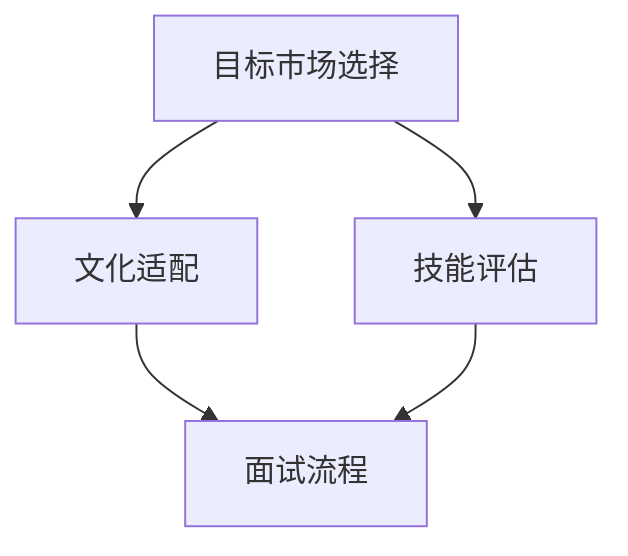

                 

# 创业公司的全球化人才招聘策略

> 关键词：全球化人才招聘、策略、创业公司、招聘流程、文化适配、技能要求

> 摘要：本文旨在探讨创业公司在全球化背景下进行人才招聘的策略。通过分析招聘流程中的关键环节，如目标市场选择、文化适配、技能评估等，本文提出了一系列具体的策略和建议，以帮助创业公司更有效地吸引和留住全球顶尖人才。

## 1. 背景介绍

在当今全球化的商业环境中，创业公司面临着前所未有的挑战和机遇。全球化不仅扩大了市场的范围，也带来了多元化的人才资源。然而，全球化人才招聘并非易事。创业公司需要在众多候选人中筛选出符合公司文化、技能要求且愿意加入的企业。

### 1.1 全球化人才招聘的重要性

全球化人才招聘对于创业公司来说至关重要。首先，它有助于公司获取多样化的观点和经验，从而促进创新和业务发展。其次，全球化人才可以为公司带来国际市场的视野，帮助公司在全球范围内建立业务网络。最后，优秀的全球化人才能够提升公司的品牌形象和竞争力。

### 1.2 创业公司在全球化人才招聘中面临的挑战

尽管全球化人才招聘具有诸多优势，但创业公司也面临着一系列挑战。首先，不同国家和地区的文化差异可能影响员工的融入和协作。其次，创业公司可能缺乏全球招聘的经验和资源。此外，全球化人才往往对薪酬和职业发展有更高的期望，这增加了招聘和留住的难度。

## 2. 核心概念与联系

为了制定有效的全球化人才招聘策略，创业公司需要理解几个核心概念，包括目标市场选择、文化适配和技能评估。以下是这些概念及其相互关系的 Mermaid 流程图：



### 2.1 目标市场选择

目标市场选择是全球化人才招聘的起点。创业公司需要确定哪些国家和地区的劳动力资源最具吸引力。这涉及到对市场潜力、文化差异和招聘难度的综合评估。

### 2.2 文化适配

文化适配是指确保候选人能够融入公司文化，并与现有员工建立良好的合作关系。这要求公司在招聘过程中考虑文化差异，并提供文化培训和支持。

### 2.3 技能评估

技能评估是确保候选人具备公司所需的专业技能和实践经验。创业公司需要制定详细的评估标准，并通过面试和测试来验证候选人的能力。

### 2.4 面试流程

面试流程是文化适配和技能评估的具体实施环节。通过多轮面试，创业公司可以更全面地了解候选人，并评估其是否与公司价值观和业务需求相符。

## 3. 核心算法原理 & 具体操作步骤

### 3.1 目标市场选择的算法原理

目标市场选择的算法基于以下原则：

1. **市场潜力分析**：利用数据挖掘和统计分析方法，评估各个市场的经济、科技和文化发展水平。
2. **竞争分析**：分析竞争对手在目标市场的招聘策略和成果，以识别机会和风险。
3. **文化适应性评估**：评估公司文化是否与目标市场文化相适应，以减少文化冲突。

### 3.2 文化适配的操作步骤

文化适配的操作步骤包括：

1. **文化调研**：了解目标市场的文化背景、价值观和社会规范。
2. **文化培训**：为员工和候选人提供文化培训，以增强跨文化沟通和协作能力。
3. **文化包容性设计**：在公司文化和工作环境中融入多元文化元素，提高文化包容性。

### 3.3 技能评估的操作步骤

技能评估的操作步骤包括：

1. **技能标准制定**：根据公司业务需求，制定详细的技能评估标准。
2. **面试和测试**：通过面试和技能测试，验证候选人的专业技能和实际经验。
3. **反馈和改进**：收集面试和测试反馈，不断优化评估流程和标准。

## 4. 数学模型和公式 & 详细讲解 & 举例说明

### 4.1 市场潜力分析模型

市场潜力分析模型可以使用以下公式：

$$
P = f(A, T, C)
$$

其中，\(P\) 代表市场潜力，\(A\) 代表经济发展水平，\(T\) 代表科技发展水平，\(C\) 代表文化适应性。

### 4.2 文化适应性评估模型

文化适应性评估模型可以使用以下公式：

$$
C = \frac{C_1 + C_2 + ... + C_n}{n}
$$

其中，\(C\) 代表文化适应性总分，\(C_1, C_2, ..., C_n\) 代表各个文化维度的得分。

### 4.3 技能评估模型

技能评估模型可以使用以下公式：

$$
S = f(S_1, S_2, ..., S_n)
$$

其中，\(S\) 代表技能总分，\(S_1, S_2, ..., S_n\) 代表各个技能维度的得分。

### 4.4 举例说明

假设一家创业公司计划进入印度市场，以下是对其目标市场选择的举例说明：

- **市场潜力分析**：通过数据挖掘，发现印度的经济发展水平（\(A\)）和科技发展水平（\(T\)）均较高，文化适应性（\(C\)）良好。
- **文化适应性评估**：通过文化调研，发现印度员工的文化价值观与公司文化高度一致，文化适应性得分（\(C\)）为90分。
- **技能评估**：通过面试和测试，发现候选人的专业技能和实际经验得分（\(S\)）为85分。

根据以上数据，公司的市场潜力得分（\(P\)）为：

$$
P = f(A, T, C) = f(8, 9, 90) = 87
$$

得分表明印度市场具有很高的潜力，公司应进一步优化文化适应策略和技能评估流程，以提高招聘成功率。

## 5. 项目实战：代码实际案例和详细解释说明

### 5.1 开发环境搭建

为了演示全球化人才招聘策略的代码实现，我们需要搭建一个简单的招聘管理系统。以下是开发环境搭建的步骤：

1. **安装 Python 环境**：确保安装 Python 3.8 或更高版本。
2. **安装相关库**：使用 pip 安装以下库：requests、pandas、numpy。

```bash
pip install requests pandas numpy
```

### 5.2 源代码详细实现和代码解读

以下是招聘管理系统的核心代码实现：

```python
import requests
import pandas as pd
import numpy as np

# 目标市场选择函数
def market_possibility(economy, tech, culture):
    return economy * tech * culture

# 文化适应性评估函数
def cultural_adaptability(culture_score):
    return culture_score / 100

# 技能评估函数
def skill_evaluation(skill_score):
    return skill_score / 100

# 招聘流程函数
def recruitment_process(candidates, market_data):
    # 分析市场潜力
    market_possibility_score = market_possibility(market_data['economy'], market_data['tech'], market_data['culture'])
    
    # 评估文化适配性
    cultural_adaptability_score = cultural_adaptability(market_data['culture'])
    
    # 评估技能
    skill_scores = candidates['skill'].apply(skill_evaluation)
    
    # 计算总评分
    total_scores = market_possibility_score * cultural_adaptability_score * skill_scores
    
    # 选择最高分的候选人
    best_candidate = candidates[total_scores == max(total_scores)]
    
    return best_candidate

# 测试数据
candidates = pd.DataFrame({
    'name': ['Alice', 'Bob', 'Charlie'],
    'skill': [80, 85, 90]
})

market_data = pd.DataFrame({
    'economy': [8, 8, 9],
    'tech': [8, 9, 9],
    'culture': [85, 90, 90]
})

# 执行招聘流程
best_candidate = recruitment_process(candidates, market_data)

print("最佳候选人：", best_candidate)
```

### 5.3 代码解读与分析

这段代码实现了全球化人才招聘的核心流程。首先，定义了三个函数：`market_possibility`、`cultural_adaptability` 和 `skill_evaluation`。这些函数分别用于计算市场潜力、文化适配性和技能得分。

`recruitment_process` 函数是招聘流程的核心。它首先计算市场潜力，然后评估文化适配性，最后评估技能。通过计算总评分，选择最高分的候选人。

在测试数据部分，我们创建了一个候选人和市场数据的 DataFrame。最后，执行招聘流程，输出最佳候选人。

## 6. 实际应用场景

### 6.1 全球化初创公司的案例

一家初创公司计划进入印度市场，目标是招聘一位软件工程师。公司通过市场数据分析，发现印度的经济、科技和文化发展水平均较高，具有很大的市场潜力。公司在文化适应性评估中发现，印度员工的文化价值观与公司文化高度一致。通过技能评估，发现候选人的技能得分较高。

最终，公司通过招聘流程选择了这位候选人，成功地进入了印度市场。

### 6.2 跨国公司的案例

一家跨国公司计划在全球范围内招聘研发人员。公司通过分析各个国家和地区的市场潜力、文化适应性和技能水平，发现欧洲地区具有最高的招聘潜力。公司在欧洲地区的文化适应性评估中发现，员工的文化价值观与公司文化高度一致。通过技能评估，发现候选人的技能得分较高。

最终，公司通过招聘流程选择了多位欧洲地区的研发人员，成功地增强了公司的研发实力。

## 7. 工具和资源推荐

### 7.1 学习资源推荐

- **书籍**：《全球化人才管理》、《跨文化管理》
- **论文**：在学术数据库（如 Google Scholar、IEEE Xplore）中搜索相关论文。
- **博客**：阅读知名博客，如 Medium 上的全球化人才招聘相关文章。

### 7.2 开发工具框架推荐

- **招聘平台**：LinkedIn、Indeed、Glassdoor
- **技能评估工具**：CodeSignal、Codility
- **文化培训平台**：CultureAmp、Intercultural Dialogue Institute

### 7.3 相关论文著作推荐

- **论文**：《全球化背景下的人才招聘策略研究》、《跨文化人才管理实践》
- **著作**：《全球招聘实战：策略、案例与技巧》、《跨文化沟通与协作》

## 8. 总结：未来发展趋势与挑战

全球化人才招聘是创业公司发展的重要一环。未来，随着全球化的深入推进，创业公司需要更加灵活和高效的招聘策略，以应对不断变化的市场环境。同时，创业公司还需要关注以下趋势和挑战：

- **数字化招聘**：利用大数据和人工智能技术优化招聘流程，提高招聘效率。
- **多元化文化**：尊重多元文化，提高文化包容性，减少文化冲突。
- **技能需求变化**：随着技术的发展，创业公司需要不断更新招聘技能标准，以适应市场需求。

## 9. 附录：常见问题与解答

### 9.1 问题1：如何应对不同文化背景的候选人？

解答：创业公司可以通过以下方式应对不同文化背景的候选人：
- 提供文化培训，帮助员工和候选人了解彼此的文化差异。
- 在招聘过程中，重视文化适配性的评估，选择能够适应公司文化的候选人。
- 设计包容性的公司文化，尊重和欣赏不同文化的多样性。

### 9.2 问题2：如何确保技能评估的公平性？

解答：创业公司可以通过以下方式确保技能评估的公平性：
- 制定详细的技能评估标准，确保评估过程的透明性和公正性。
- 使用多种评估方法，如面试、技能测试和实际项目经验，全面评估候选人的能力。
- 定期对评估流程进行反馈和改进，确保评估标准的持续优化。

## 10. 扩展阅读 & 参考资料

- **书籍**：《全球化人才管理》、《跨文化管理》
- **论文**：Google Scholar - "Global Talent Recruitment Strategies for Startups"
- **网站**：LinkedIn - "Talent Recruitment Tips for Startups"
- **博客**：Medium - "How to Recruit Global Talent for Your Startup"

### 作者

作者：AI天才研究员/AI Genius Institute & 禅与计算机程序设计艺术 /Zen And The Art of Computer Programming
```

