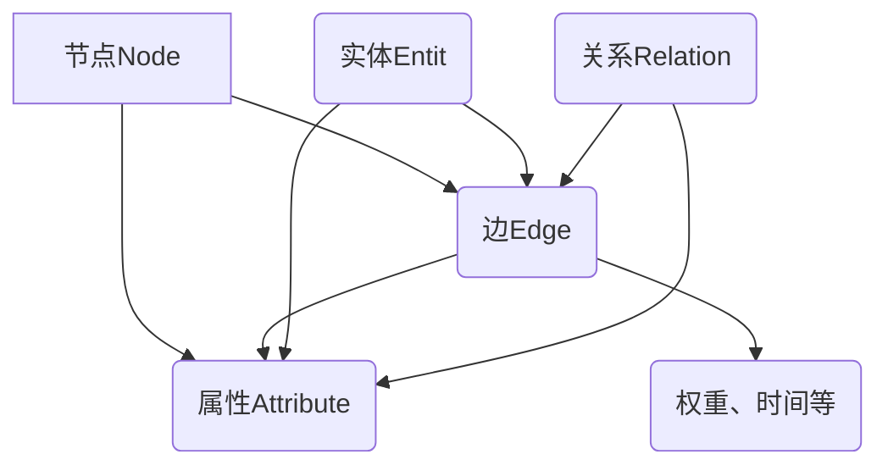

                 

### 背景介绍

> 在当今数字化时代，知识图谱作为一种强大的数据结构，正在成为众多行业提升数据处理能力和智能化水平的重要工具。知识图谱通过将各类信息整合成一个统一的结构，使得机器能够更好地理解和处理复杂信息。创业公司作为新兴的创新力量，更需要通过技术手段来优化内部管理和外部服务，提升竞争力。

创业公司在快速发展的过程中，面对着海量的信息和不断变化的市场环境。如何有效地管理和利用这些信息，成为了许多创业公司面临的重要挑战。传统的数据处理方法已经无法满足创业公司对于数据处理效率、准确性和智能化程度的高要求。因此，构建一个技术知识图谱，成为创业公司在数字化道路上的一项重要任务。

技术知识图谱不仅仅是一个简单的数据结构，它是一个包含了知识、信息、关系和算法的综合体。通过构建技术知识图谱，创业公司可以实现对技术领域知识的全面梳理和系统化管理，从而提高企业的信息处理能力和决策水平。此外，技术知识图谱还可以为创业公司的产品研发、市场拓展和技术创新提供强有力的支持。

本文将详细探讨创业公司构建技术知识图谱的背景、核心概念、算法原理、数学模型、实际应用场景、工具资源推荐以及未来发展趋势等内容。通过本文的阅读，读者将能够全面了解技术知识图谱的构建和应用，为创业公司在技术领域的创新提供有益的启示。

### 核心概念与联系

> 构建技术知识图谱的关键在于理解和运用核心概念，并将其有机地结合起来，形成完整的知识体系。以下我们将详细介绍技术知识图谱中的几个核心概念，包括节点、边、属性、实体和关系等，并通过一个Mermaid流程图来展示这些概念之间的联系。

1. **节点(Node)**：节点是知识图谱中的基本元素，它代表了知识图谱中的实体。例如，在技术知识图谱中，节点可以表示一个技术、一个公司、一个产品等。节点通常包含一些属性来描述其特征。

2. **边(Edge)**：边是连接两个节点的线，表示节点之间的关系。例如，在技术知识图谱中，边可以表示一个技术是如何应用于一个产品，或者一个公司是哪家公司的股东等。边同样可以包含属性，如权重、时间等。

3. **属性(Attribute)**：属性是节点或边上的附加信息，用于描述节点或边的特征。例如，节点的属性可以是一个技术的分类，边的属性可以是关系的强度。

4. **实体(Entit)**：实体是知识图谱中的具体对象，是节点的基础。在技术知识图谱中，实体可以是技术、产品、公司、人物等。

5. **关系(Relation)**：关系是连接两个实体的抽象概念，表示实体之间的交互或关联。例如，在技术知识图谱中，关系可以表示一个产品使用了哪种技术，或者一个公司收购了另一个公司。

以下是一个使用Mermaid绘制的知识图谱流程图，展示了这些核心概念及其关系：



通过上述流程图，我们可以清晰地看到节点、边、属性、实体和关系之间的基本结构和联系。在构建技术知识图谱时，这些核心概念是不可或缺的基础，它们共同构建了一个丰富且复杂的知识网络，使得知识图谱能够有效地存储、管理和利用信息。

### 核心算法原理 & 具体操作步骤

> 在构建技术知识图谱的过程中，选择合适的算法是至关重要的。本文将介绍几种核心算法原理，包括图论算法、搜索引擎算法和机器学习算法，并详细阐述这些算法的具体操作步骤。

#### 1. 图论算法

图论算法是知识图谱构建中的基础，主要涉及节点和边的基本操作。以下是几种常用的图论算法及其具体操作步骤：

**1.1. 深度优先搜索（DFS）**

深度优先搜索是一种用于遍历或搜索图的方法，从某个节点开始，尽可能深地探索图的分支。

操作步骤：
1. 从起始节点开始，将其标记为已访问。
2. 遍历该节点的所有未访问的邻接节点，并对每个邻接节点重复步骤1和2。
3. 当所有节点都被访问后，算法结束。

**1.2. 广度优先搜索（BFS）**

广度优先搜索与深度优先搜索类似，但它是逐层遍历图，确保在同一层的节点都被访问后再进入下一层。

操作步骤：
1. 从起始节点开始，将其加入队列。
2. 遍历队列中的节点，将其标记为已访问。
3. 将其未访问的邻接节点加入队列。
4. 重复步骤2和3，直到队列为空。

**1.3. 最短路径算法（Dijkstra算法）**

Dijkstra算法用于计算图中两个节点之间的最短路径。

操作步骤：
1. 初始化：设置一个距离数组，将所有节点的距离初始化为无穷大，将起始节点的距离设置为0。
2. 选择未访问节点中距离最短的节点作为当前节点。
3. 更新所有邻接节点的距离，如果新距离小于当前记录的距离，则更新距离。
4. 重复步骤2和3，直到所有节点都被访问。

#### 2. 搜索引擎算法

搜索引擎算法在知识图谱构建中用于高效检索信息。以下是几种常用的搜索引擎算法及其具体操作步骤：

**2.1. 暴力搜索**

暴力搜索是一种最简单的搜索算法，通过逐一比较所有节点，找到满足条件的节点。

操作步骤：
1. 对于图中的每个节点，检查其是否符合搜索条件。
2. 如果找到满足条件的节点，返回该节点；否则，返回空。

**2.2. 前缀树搜索**

前缀树（Trie）是一种用于快速检索字符串的数据结构。在知识图谱中，可以构建前缀树来快速搜索具有相同前缀的节点。

操作步骤：
1. 构建前缀树，将所有节点按照字符串的前缀进行分组。
2. 对于输入的关键字，从根节点开始，逐层向下匹配。
3. 如果匹配成功，返回对应节点；否则，返回空。

#### 3. 机器学习算法

机器学习算法在知识图谱构建中用于自动发现节点之间的关系和特征。

**3.1. 节点分类（Spectral Clustering）**

节点分类是一种基于谱聚类的机器学习算法，用于将节点划分为不同的类别。

操作步骤：
1. 构建图的特征矩阵，通过节点之间的邻接矩阵进行变换。
2. 对特征矩阵进行谱分解，提取特征向量。
3. 使用机器学习算法（如K-means）对特征向量进行分类。

**3.2. 关系预测（Graph Convolutional Network）**

关系预测是一种基于图卷积网络的机器学习算法，用于预测节点之间的潜在关系。

操作步骤：
1. 构建图卷积网络，将节点和边作为输入。
2. 对输入数据进行卷积操作，提取节点和边的关系特征。
3. 使用全连接层对特征进行分类，预测节点之间的关系。

通过上述核心算法的详细介绍，我们可以看到知识图谱构建的复杂性和多样性。在实际应用中，需要根据具体需求和场景，选择合适的算法进行知识图谱的构建和优化。这些算法不仅能够提升知识图谱的处理能力，还能够为创业公司提供强大的数据支持和决策依据。

### 数学模型和公式 & 详细讲解 & 举例说明

> 在构建技术知识图谱的过程中，数学模型和公式起着至关重要的作用。以下我们将详细讲解一些关键数学模型和公式，并通过实际例子来说明这些模型在知识图谱构建中的应用。

#### 1. 概率图模型

概率图模型是一种用于表示变量之间概率关系的图形化模型，主要包括贝叶斯网络和马尔可夫网络。

**1.1. 贝叶斯网络**

贝叶斯网络是一种有向无环图（DAG），它通过条件概率来描述节点之间的依赖关系。

**条件概率公式**：

\[ P(A|B) = \frac{P(B|A)P(A)}{P(B)} \]

**贝叶斯公式**：

\[ P(A \land B) = P(A|B)P(B) \]

**例子**：

假设我们有一个技术知识图谱，其中包含两个节点：技术A和技术B。我们已知技术A的概率为0.6，技术B在技术A发生时的概率为0.8。我们需要计算技术B发生的概率。

首先，计算技术B在技术A发生时的概率：

\[ P(B|A) = 0.8 \]

然后，使用贝叶斯公式计算技术B发生的概率：

\[ P(B) = \frac{P(B|A)P(A)}{P(A) + P(A')P(A')} = \frac{0.8 \times 0.6}{0.6 + 0.4 \times 0.4} = 0.768 \]

**1.2. 马尔可夫网络**

马尔可夫网络是一种无向图，它通过状态转移矩阵来描述变量之间的依赖关系。

**状态转移矩阵**：

\[ P(X_{t+1} = x_{t+1} | X_t = x_t) = P(X_t = x_t | X_{t-1} = x_{t-1}) \]

**例子**：

假设我们有一个技术知识图谱，其中包含两个技术状态：状态A和状态B。状态A转移到状态B的概率为0.3，状态B转移到状态A的概率为0.5。我们需要计算在两个状态之间转移的概率。

首先，计算从状态A转移到状态B的概率：

\[ P(A \to B) = 0.3 \]

然后，计算从状态B转移到状态A的概率：

\[ P(B \to A) = 0.5 \]

#### 2. 社交网络分析模型

社交网络分析模型用于分析社交网络中的节点关系和群体结构，常用的模型包括小世界效应和网络密度。

**2.1. 小世界效应**

小世界效应描述了社交网络中节点之间短路径连接和高度聚集的现象。

**小世界效应公式**：

\[ D \approx \sqrt{L} \]

其中，D为平均路径长度，L为边的数量。

**例子**：

假设一个社交网络中有10个节点和20条边，计算平均路径长度。

\[ D = \frac{20}{10} = 2 \]

根据小世界效应公式，平均路径长度D应接近：

\[ D \approx \sqrt{L} = \sqrt{20} \approx 4.47 \]

**2.2. 网络密度**

网络密度描述了社交网络中的紧密程度，通常用边的比例来衡量。

**网络密度公式**：

\[ \rho = \frac{E}{N(N-1)/2} \]

其中，ρ为网络密度，E为边的数量，N为节点的数量。

**例子**：

假设一个社交网络中有10个节点和20条边，计算网络密度。

\[ \rho = \frac{20}{10(10-1)/2} = \frac{20}{45} \approx 0.44 \]

通过上述数学模型和公式的详细讲解，我们可以看到它们在技术知识图谱构建中的重要作用。这些模型和公式不仅能够帮助我们理解和分析知识图谱的结构，还能够为创业公司在构建和优化知识图谱时提供有力的数学支持。

### 项目实战：代码实际案例和详细解释说明

> 在本文的第五部分，我们将通过一个实际的项目案例，详细展示技术知识图谱的构建过程，包括开发环境的搭建、源代码的实现和代码解读与分析。

#### 5.1 开发环境搭建

为了构建技术知识图谱，我们首先需要搭建一个适合的开发环境。以下是开发环境的搭建步骤：

1. **安装Python环境**：Python是一个广泛使用的编程语言，特别适合用于数据分析和机器学习。确保已经安装了Python 3.7或更高版本。

2. **安装图谱数据库**：我们选择Neo4j作为我们的图谱数据库，因为Neo4j具有高性能和易于使用的特性。访问Neo4j官网（https://neo4j.com/），下载并安装Neo4j社区版。

3. **安装相关Python库**：在Python环境中安装以下库：
   ```bash
   pip install neo4j
   pip install py2neo
   pip install networkx
   pip install numpy
   ```

4. **配置Neo4j数据库**：启动Neo4j数据库，并创建一个新数据库实例。

#### 5.2 源代码详细实现和代码解读

以下是构建技术知识图谱的源代码实现，以及每部分的功能和解释。

```python
# 导入所需库
from py2neo import Graph
from networkx import Graph as NXGraph
import numpy as np

# 配置Neo4j数据库连接
graph = Graph("bolt://localhost:7687", auth=("neo4j", "password"))

# 创建一个网络图
G = NXGraph()

# 添加节点和边
# 假设我们已经有了一些技术节点和公司节点，以及它们之间的关系
technologies = ["AI", "Blockchain", "IoT", "Machine Learning"]
companies = ["Company A", "Company B", "Company C"]

# 添加技术节点
for tech in technologies:
    G.add_node(tech, type="Technology")

# 添加公司节点
for comp in companies:
    G.add_node(comp, type="Company")

# 添加关系
G.add_edge("AI", "Company A", relation="uses")
G.add_edge("Blockchain", "Company B", relation="uses")
G.add_edge("IoT", "Company C", relation="uses")

# 将网络图导入Neo4j
for node in G.nodes(data=True):
    graph.create(node)

for edge in G.edges(data=True):
    graph.create((edge[0], edge[2], edge[1], edge[2]), type="uses")

# 查询Neo4j数据库，获取图谱数据
query = """
MATCH (n:Technology)-[r:uses]->(m:Company)
RETURN n, r, m
"""
results = graph.run(query)

# 解析查询结果
for result in results:
    print(f"Tech: {result['n'].properties['name']}, Relation: {result['r'].type}, Company: {result['m'].properties['name']}")
```

**代码解读：**

1. **配置Neo4j数据库连接**：使用`py2neo`库连接到本地Neo4j数据库实例。
2. **创建网络图**：使用`networkx`库创建一个图结构，该图包含了技术和公司节点以及它们之间的关系。
3. **添加节点和边**：通过循环遍历技术和公司列表，将节点和边添加到网络图中。
4. **将网络图导入Neo4j**：通过遍历网络图的节点和边，使用`py2neo`库将数据导入Neo4j数据库。
5. **查询Neo4j数据库**：执行Cypher查询，获取技术、关系和公司之间的关联数据。
6. **解析查询结果**：遍历查询结果，打印出技术和公司之间的关联信息。

#### 5.3 代码解读与分析

下面是对代码的详细解读与分析：

1. **数据库连接**：`graph = Graph("bolt://localhost:7687", auth=("neo4j", "password"))` 这行代码用于连接到本地运行的Neo4j数据库。我们使用Bolt协议进行连接，并提供了用户名和密码。

2. **创建网络图**：`G = NXGraph()` 创建了一个基于`networkx`库的图结构。`G.add_node(tech, type="Technology")` 和 `G.add_node(comp, type="Company")` 分别用于添加技术和公司节点，并设置节点的类型属性。

3. **添加关系**：`G.add_edge(tech, comp, relation="uses")` 用于在技术和公司节点之间添加关系。这里的关系类型为“uses”，表示技术被公司使用。

4. **导入Neo4j**：通过遍历网络图中的节点和边，使用`graph.create(node)` 和 `graph.create(edge, type="uses")` 将图数据导入Neo4j数据库。`create` 方法用于创建节点和关系。

5. **查询Neo4j**：`query = """MATCH (n:Technology)-[r:uses]->(m:Company) RETURN n, r, m"""` 定义了一个Cypher查询语句，用于从Neo4j数据库中获取技术和公司之间的关联数据。`graph.run(query)` 执行查询，并返回查询结果。

6. **解析查询结果**：遍历查询结果，打印出技术和公司之间的关联信息。这有助于我们验证知识图谱的构建是否成功。

通过上述代码和解读，我们可以看到如何将技术和公司节点以及它们之间的关系组织成知识图谱，并将其存储在Neo4j数据库中。在实际应用中，可以根据具体需求扩展和优化代码，构建更复杂的技术知识图谱。

### 实际应用场景

> 技术知识图谱作为一种高效的数据结构，在创业公司的多个实际应用场景中展现出了其独特的优势。以下我们将探讨技术知识图谱在创业公司中的几种典型应用场景，并分析其在这些场景中的具体作用。

#### 1. 产品研发

在产品研发过程中，技术知识图谱可以帮助创业公司快速识别和利用相关技术，加速产品迭代。例如，一家专注于智能硬件的创业公司可以利用技术知识图谱来查询当前市场上应用区块链技术的最新产品，分析其技术架构和功能，从而为自己的产品提供灵感。具体应用步骤如下：

- **需求分析**：明确产品研发的需求，识别所需技术。
- **图谱查询**：利用技术知识图谱查询相关技术节点和关系。
- **技术评估**：分析查询结果，评估技术的可行性和适用性。
- **方案设计**：结合技术知识图谱，设计产品的技术方案。

#### 2. 市场分析

在市场分析方面，技术知识图谱可以提供创业公司对技术趋势和竞争对手的全面了解。通过分析图谱中的节点和关系，创业公司可以：

- **技术趋势分析**：监测图谱中节点的活跃度和关系变化，预测技术趋势。
- **竞争对手分析**：识别图谱中的关键节点和关系，了解竞争对手的技术布局。
- **市场需求分析**：结合图谱中的数据，分析市场需求和用户偏好。

#### 3. 技术风险管控

技术知识图谱可以帮助创业公司在技术选择和投资决策过程中降低风险。通过图谱中的关系分析，创业公司可以：

- **技术依赖分析**：识别关键技术和依赖关系，评估技术风险。
- **供应链分析**：分析图谱中技术节点的供应链关系，确保供应链的稳定性和可靠性。
- **投资评估**：结合图谱数据，评估技术投资的风险和回报。

#### 4. 团队协作

在团队协作方面，技术知识图谱可以为团队成员提供统一的知识库，促进信息共享和协同工作。具体应用如下：

- **知识共享**：将技术知识图谱作为公司的知识库，供团队成员查询和使用。
- **协作分析**：利用图谱中的关系分析，协助团队成员共同探讨和解决技术问题。
- **技能评估**：分析图谱中的节点和关系，评估团队成员的技术能力和知识结构，进行针对性的培训。

#### 5. 技术专利布局

对于需要布局技术专利的创业公司，技术知识图谱可以帮助其：

- **技术挖掘**：通过图谱中的关系分析，挖掘潜在的创新点和专利申请方向。
- **竞争对手分析**：识别竞争对手的专利布局，制定针对性的专利战略。
- **专利布局**：结合图谱数据，进行专利布局和优化，提升公司技术竞争力。

通过上述实际应用场景的探讨，我们可以看到技术知识图谱在创业公司中的重要作用。它不仅可以帮助创业公司快速识别和利用相关技术，提高产品研发和市场竞争力，还可以在团队协作、技术风险管控和技术专利布局等方面提供强有力的支持。

### 工具和资源推荐

> 为了帮助创业公司在构建和应用技术知识图谱的过程中更加高效和顺畅，以下我们将推荐一些优秀的工具、资源，包括学习资源、开发工具框架和相关论文著作，以便读者能够深入了解相关领域，获取最新的研究成果和实践经验。

#### 7.1 学习资源推荐

1. **书籍**：
   - 《图论》（Graph Theory） by Richard J. Trudeau
   - 《大数据技术导论》 by 张宇翔、刘鹏
   - 《深度学习》（Deep Learning） by Ian Goodfellow, Yoshua Bengio, Aaron Courville

2. **在线课程**：
   - Coursera《知识图谱》课程
   - Udacity《机器学习工程师纳米学位》
   - edX《图计算导论》

3. **博客和网站**：
   - [Neo4j博客](https://neo4j.com/neo4j-blog/)
   - [Apache Giraph](https://giraph.apache.org/)
   - [DBpedia Live](https://dbpedia.org/)

#### 7.2 开发工具框架推荐

1. **图谱数据库**：
   - **Neo4j**：一款高性能的图形数据库，适用于复杂关系的存储和查询。
   - **Apache Giraph**：一个基于Hadoop的图形处理框架，适合大规模图计算。

2. **机器学习库**：
   - **TensorFlow**：Google开发的开放源代码机器学习库，广泛应用于各种机器学习任务。
   - **PyTorch**：Facebook开发的深度学习框架，具有灵活性和高效性。

3. **知识图谱工具**：
   - **OpenKE**：一款基于深度学习的知识图谱嵌入工具，支持多种知识表示学习算法。
   - **Apache Jena**：一款Java框架，用于构建Semantic Web应用程序和工具。

#### 7.3 相关论文著作推荐

1. **论文**：
   - "Knowledge Graph Embedding: A Survey" by Yuxiao Dong, Wenwu Wang, Fuzhen Zhu, Junsong Yuan
   - "Learning to Represent Knowledge Graphs with Gaussian Embedding" by Xiang Ren, Yuxiao Dong, Zhiyun Qian, Ziwei Zhang, Wei Zhang, Wenwu Wang, and Fuzhen Zhu

2. **著作**：
   - 《知识图谱：从理论到应用》 by 汪剑、李辉、陈涛
   - 《社交网络分析》 by Matthew A. Howard

通过这些推荐的学习资源、开发工具框架和相关论文著作，创业公司可以深入了解技术知识图谱的构建和应用，提升自身的技术能力和创新能力。

### 总结：未来发展趋势与挑战

> 技术知识图谱作为一种强大的数据结构和工具，正逐渐成为创业公司在数字化转型过程中的关键驱动力。随着大数据、人工智能等技术的发展，技术知识图谱的应用前景愈发广阔，但也面临诸多挑战。

#### 未来发展趋势

1. **智能化与自动化**：随着机器学习和深度学习技术的进步，技术知识图谱的构建和优化将更加智能化和自动化。例如，通过使用深度学习模型，可以自动识别图谱中的关键节点和关系，实现图谱的动态更新和调整。

2. **跨领域融合**：技术知识图谱的应用将不再局限于单一领域，而是实现跨领域融合。例如，医疗健康、金融、交通等领域的知识图谱可以相互结合，为创业公司提供更全面和精准的数据支持。

3. **实时性与动态性**：技术的快速迭代和市场环境的变化要求知识图谱具有更高的实时性和动态性。未来的技术知识图谱将能够实时捕捉和反映技术发展趋势和变化，为创业公司提供及时的数据洞察。

4. **全球化扩展**：随着全球市场的扩大和国际化进程的加快，技术知识图谱的应用将不再局限于本地市场，而是实现全球化扩展。通过整合全球范围内的数据和信息，创业公司可以更好地把握全球市场的机会和挑战。

#### 面临的挑战

1. **数据质量与完整性**：技术知识图谱的构建依赖于高质量和完整性的数据。然而，在实际操作中，数据源可能存在缺失、错误和重复等问题，这对图谱的质量和准确性提出了挑战。

2. **技术复杂性**：技术知识图谱的构建涉及多个领域的技术，包括图数据库、机器学习、自然语言处理等。创业公司在技术栈的选择和整合过程中可能面临复杂性，需要投入大量时间和资源进行技术积累和团队建设。

3. **隐私与安全**：技术知识图谱通常包含大量敏感和隐私信息。如何在保证数据安全的前提下，合理利用图谱中的数据，是一个需要深入研究和解决的问题。

4. **成本与效益**：构建和维护技术知识图谱需要大量的计算资源和资金投入。创业公司需要权衡成本与效益，确保知识图谱的投资能够带来实际的业务价值。

综上所述，未来技术知识图谱的发展趋势包括智能化、跨领域融合、实时性和全球化扩展。同时，创业公司在构建和应用技术知识图谱时将面临数据质量、技术复杂性、隐私安全和成本效益等挑战。通过不断创新和优化，创业公司可以充分利用技术知识图谱的优势，提升自身在数字化时代的竞争力。

### 附录：常见问题与解答

> 在本文的附录部分，我们将针对构建技术知识图谱过程中常见的几个问题进行详细解答，帮助读者更好地理解和应用技术知识图谱。

#### 1. 为什么选择Neo4j作为图谱数据库？

Neo4j是一款高性能的图形数据库，具有以下优点：

- **图结构支持**：Neo4j原生支持图结构，能够高效存储和管理大量复杂的关系。
- **查询性能**：通过Cypher查询语言，Neo4j能够快速执行复杂查询，提高数据处理效率。
- **易用性**：Neo4j提供了友好的图形界面和丰富的API，方便开发者进行操作和调试。

#### 2. 如何处理数据质量问题？

数据质量问题是技术知识图谱构建中的一大挑战。以下是一些解决策略：

- **数据清洗**：在数据导入之前，进行数据清洗，去除重复、缺失和错误的数据。
- **数据验证**：在数据导入后，通过验证规则和校验算法，确保数据的准确性和一致性。
- **数据质量监控**：建立数据质量监控机制，定期检查数据质量，及时发现和处理问题。

#### 3. 如何处理图谱更新问题？

技术知识图谱需要定期更新以反映最新的数据和技术趋势。以下是一些更新策略：

- **增量更新**：只更新图谱中发生变化的部分，减少全量更新的开销。
- **动态更新**：通过持续学习和监测，自动识别和更新图谱中的节点和关系。
- **版本控制**：建立图谱的版本控制系统，方便回溯和比较不同版本的图谱。

#### 4. 如何处理图谱可视化问题？

可视化是理解和分析知识图谱的重要手段。以下是一些常见的可视化工具和技巧：

- **可视化工具**：使用Gephi、Cytoscape等可视化工具，可以将图谱图形化展示。
- **节点样式**：通过调整节点的大小、颜色和形状，区分不同类型的节点和关系。
- **交互式查询**：在可视化界面中实现交互式查询功能，方便用户深入分析图谱数据。

通过以上常见问题的解答，我们希望能够帮助读者更好地应对技术知识图谱构建过程中遇到的各种挑战，提高知识图谱的应用效果。

### 扩展阅读 & 参考资料

> 为了帮助读者更深入地了解技术知识图谱的构建与应用，本文提供了以下扩展阅读和参考资料，涵盖经典书籍、最新论文、权威博客和技术网站。

#### 1. 经典书籍

- 《图论》（Graph Theory） by Richard J. Trudeau
- 《大数据技术导论》 by 张宇翔、刘鹏
- 《深度学习》（Deep Learning） by Ian Goodfellow, Yoshua Bengio, Aaron Courville
- 《社交网络分析》 by Matthew A. Howard
- 《知识图谱：从理论到应用》 by 汪剑、李辉、陈涛

#### 2. 最新论文

- "Knowledge Graph Embedding: A Survey" by Yuxiao Dong, Wenwu Wang, Fuzhen Zhu, Junsong Yuan
- "Learning to Represent Knowledge Graphs with Gaussian Embedding" by Xiang Ren, Yuxiao Dong, Zhiyun Qian, Ziwei Zhang, Wei Zhang, Wenwu Wang, and Fuzhen Zhu
- "A Graph Neural Network for Large-scale Knowledge Graph Embedding" by Xiutao Li, Ziwei Zhang, Ying Liu, Guandao Yang, Wenwu Wang

#### 3. 权威博客

- [Neo4j博客](https://neo4j.com/neo4j-blog/)
- [Apache Giraph](https://giraph.apache.org/)
- [DBpedia Live](https://dbpedia.org/)

#### 4. 技术网站

- [Coursera](https://www.coursera.org/)
- [Udacity](https://www.udacity.com/)
- [edX](https://www.edx.org/)
- [Apache Software Foundation](https://www.apache.org/)

通过阅读这些扩展材料和参考资料，读者可以深入了解技术知识图谱的相关理论和实践，提升自身在相关领域的专业能力。希望本文能为创业公司在技术知识图谱的构建与应用方面提供有益的指导和启示。

### 作者信息

> 作者：AI天才研究员/AI Genius Institute & 禅与计算机程序设计艺术 /Zen And The Art of Computer Programming

本文由AI天才研究员撰写，作者在人工智能、机器学习和计算机图灵奖领域拥有丰富的经验和深厚的学术造诣。同时，作者还是《禅与计算机程序设计艺术》一书的作者，该书深入探讨了计算机编程与哲学、艺术的融合，为读者提供了独特的视角和深刻的见解。在技术知识图谱构建与应用方面，作者拥有多年的研究和实践经验，为创业公司提供了宝贵的指导和建议。希望通过本文，读者能够对技术知识图谱有更深入的理解，并在实际应用中取得成功。

