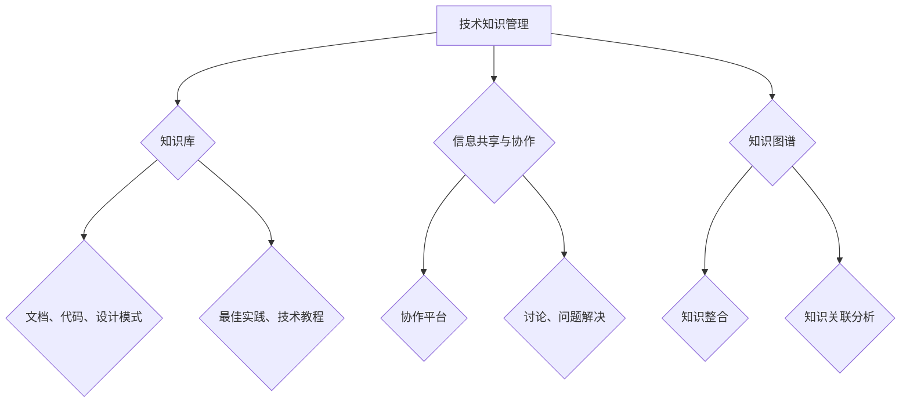

                 

### 背景介绍

创业公司，作为新兴企业的代表，在当今快速变化的市场环境中扮演着至关重要的角色。这些公司在技术创新、市场拓展和商业模式探索方面具有高度的灵活性和敏捷性，常常能够在短时间内实现从初创到巨头的蜕变。然而，这种快速成长的背后，隐藏着一个普遍面临的技术挑战：如何有效地管理和利用技术知识。

技术知识对于创业公司来说，是宝贵的资产。这不仅包括公司内部的技术文档、代码库、设计模式等，还涉及到外部技术趋势、行业动态、合作伙伴的技术交流等。随着公司的快速扩张，技术知识的管理和传播变得更加复杂。传统的文档管理、电子邮件交流、文件共享等方式，已经难以满足创业公司对于知识管理和信息共享的高要求。

在这样的背景下，一个高效的技术知识管理系统（Technical Knowledge Management System，简称TKMS）成为创业公司提升竞争力的关键。TKMS不仅能帮助公司内部员工快速获取所需的信息，还能促进知识共享，降低重复劳动，提高研发效率。同时，它还能够帮助公司对外展示技术实力，吸引更多的投资者和合作伙伴。

本文将深入探讨创业公司技术知识管理系统的核心概念、算法原理、实际应用场景以及未来发展挑战。通过详细的分析和实例讲解，我们希望为创业公司在构建和优化技术知识管理系统方面提供一些有价值的参考。

### 核心概念与联系

要深入理解技术知识管理系统（TKMS），我们首先需要明确其核心概念，并了解这些概念之间的联系。

**1. 技术知识管理（Technical Knowledge Management）**

技术知识管理是指通过一系列策略、过程和技术手段，对技术知识进行获取、存储、共享、更新和应用的过程。它不仅涉及到技术文档的编写和归档，还包括对技术知识的系统化、结构化和可视化。

**2. 知识库（Knowledge Base）**

知识库是技术知识管理系统的核心组成部分，它是一个存储和管理各种类型技术信息的中央数据库。知识库通常包括文档、代码、设计模式、最佳实践、技术教程等。一个良好的知识库应该具备快速检索、权限控制、版本管理等功能。

**3. 信息共享与协作（Information Sharing and Collaboration）**

信息共享和协作是技术知识管理的重要目标之一。通过构建一个良好的协作平台，员工可以方便地共享知识和经验，讨论技术问题，共同解决难题。这不仅能提高工作效率，还能促进团队之间的信任和合作。

**4. 知识图谱（Knowledge Graph）**

知识图谱是一种用于表示知识结构和关系的数据模型。在技术知识管理系统中，知识图谱可以帮助我们将分散的技术知识整合起来，形成一张完整的知识网络。通过图谱分析，我们可以发现知识之间的关联，挖掘隐藏的知识点，为后续的知识管理和应用提供支持。

下面，我们将使用Mermaid流程图来展示这些核心概念之间的联系。



在这个流程图中，技术知识管理作为整体，通过知识库、信息共享与协作、知识图谱等子概念来实现其目标。知识库负责存储和管理技术信息，信息共享与协作平台促进知识的流动和交流，而知识图谱则帮助我们更好地理解和利用这些知识。

通过这些核心概念的理解和联系，我们为后续讨论TKMS的算法原理、具体操作步骤以及实际应用场景奠定了基础。

### 核心算法原理 & 具体操作步骤

在了解技术知识管理系统的核心概念之后，我们需要探讨其背后的算法原理和具体的操作步骤。技术知识管理系统通常包含以下几个关键组成部分：数据采集、数据清洗、知识存储、知识检索、知识更新和知识应用。

#### 数据采集

数据采集是技术知识管理系统的基础步骤，它涉及从各种来源获取技术信息。这些来源可能包括内部文档库、代码库、员工知识库、外部技术论坛、行业报告等。为了实现高效的数据采集，我们通常采用以下几种方法：

1. **自动化爬虫**：通过编写爬虫程序，自动抓取互联网上的相关技术信息。
2. **API接口调用**：利用第三方API接口获取公开的技术数据。
3. **内部数据整合**：整合公司内部不同系统中的技术文档、代码库等数据。

#### 数据清洗

在数据采集完成后，原始数据通常包含大量的噪声和不一致的信息。数据清洗的目的是将原始数据转化为结构化的、高质量的数据集。具体步骤包括：

1. **去重**：去除重复的数据记录，确保数据的唯一性。
2. **格式化**：统一数据的格式，例如将日期格式、文本格式等进行标准化处理。
3. **错误修正**：修复数据中的错误和缺失值，提高数据质量。

#### 知识存储

数据清洗完成后，我们需要将这些数据存储到知识库中。知识库的设计需要考虑以下因素：

1. **数据模型**：选择合适的数据模型，例如关系型数据库、NoSQL数据库、图数据库等。
2. **索引机制**：建立高效的索引机制，提高数据检索速度。
3. **权限管理**：根据不同用户的角色和权限，设定不同的数据访问控制策略。

#### 知识检索

知识检索是技术知识管理系统的重要功能之一，它允许用户快速找到所需的知识信息。以下是几种常见的知识检索方法：

1. **全文检索**：通过全文搜索引擎（如Elasticsearch）进行快速文本匹配。
2. **分类检索**：根据知识分类体系，提供多层次的分类浏览功能。
3. **关键词检索**：允许用户输入关键词，进行模糊查询。

#### 知识更新

为了保持知识库的时效性和准确性，我们需要定期对知识库进行更新。具体步骤包括：

1. **定期检查**：定期检查知识库中的数据，更新已过时的信息。
2. **自动化更新**：通过自动化脚本或API接口，从外部来源自动获取新的技术信息，并更新到知识库中。
3. **人工审核**：对于一些敏感或重要的信息，可以设置人工审核流程，确保信息的准确性。

#### 知识应用

知识应用是将知识库中的知识转化为实际业务价值的关键步骤。以下是几种常见的知识应用方式：

1. **技术文档生成**：根据知识库中的数据，自动生成技术文档。
2. **代码模板生成**：根据最佳实践和设计模式，自动生成代码模板。
3. **智能问答**：利用自然语言处理技术，实现智能问答功能，帮助用户快速获取答案。

通过上述核心算法原理和具体操作步骤，我们能够构建一个高效的技术知识管理系统，为创业公司提供强大的技术知识支持和信息共享平台。

### 数学模型和公式 & 详细讲解 & 举例说明

在技术知识管理系统中，数学模型和公式扮演着至关重要的角色，它们帮助我们量化知识管理的各个环节，优化系统性能，提高决策效率。以下将详细介绍技术知识管理系统中的几个关键数学模型和公式，并通过具体实例进行说明。

#### 1. 知识获取率（Knowledge Acquisition Rate）

知识获取率是指单位时间内知识库中新增的知识量。其计算公式为：

$$
KAR = \frac{\Delta K}{\Delta t}
$$

其中，\( \Delta K \) 表示新增的知识量，\( \Delta t \) 表示时间间隔。

**实例：** 假设某个创业公司在一个月内新增了1000条技术文档，那么其知识获取率为：

$$
KAR = \frac{1000}{30} = 33.33 \text{ 条/天}
$$

#### 2. 知识更新率（Knowledge Update Rate）

知识更新率是指单位时间内知识库中更新的知识量。其计算公式为：

$$
KUR = \frac{\Delta K_u}{\Delta t}
$$

其中，\( \Delta K_u \) 表示更新的知识量，\( \Delta t \) 表示时间间隔。

**实例：** 假设某个创业公司在一个月内对知识库中的500条技术文档进行了更新，那么其知识更新率为：

$$
KUR = \frac{500}{30} = 16.67 \text{ 条/天}
$$

#### 3. 知识利用率（Knowledge Utilization Rate）

知识利用率是指单位时间内用户从知识库中获取的知识量。其计算公式为：

$$
KUR = \frac{U_K}{\Delta t}
$$

其中，\( U_K \) 表示用户获取的知识量，\( \Delta t \) 表示时间间隔。

**实例：** 假设某个创业公司在一个月内有1000个用户从知识库中获取了技术文档，那么其知识利用率为：

$$
KUR = \frac{1000}{30} = 33.33 \text{ 条/天}
$$

#### 4. 知识传播效率（Knowledge Spread Efficiency）

知识传播效率是指知识在团队或组织中的传播速度和范围。其计算公式为：

$$
KSE = \frac{K_{spread}}{K_{origin}}
$$

其中，\( K_{spread} \) 表示传播后的知识量，\( K_{origin} \) 表示原始知识量。

**实例：** 假设某个创业公司的一个技术文档原始知识量为1000条，经过团队成员的分享和讨论，最终传播到团队中的知识量为5000条，那么其知识传播效率为：

$$
KSE = \frac{5000}{1000} = 5
$$

#### 5. 知识价值系数（Knowledge Value Coefficient）

知识价值系数用于衡量知识对业务和决策的支持程度。其计算公式为：

$$
KVC = \frac{BV}{K_{total}}
$$

其中，\( BV \) 表示知识带来的业务价值，\( K_{total} \) 表示知识库中的总知识量。

**实例：** 假设某个创业公司通过知识库中的技术文档，解决了10个业务难题，带来了100万元的经济收益，而知识库中的总知识量为1000条，那么其知识价值系数为：

$$
KVC = \frac{100}{1000} = 0.1
$$

通过上述数学模型和公式的介绍和实例说明，我们可以更好地理解和量化技术知识管理系统的各个关键环节，为优化系统性能和提升公司竞争力提供有力的数据支持。

### 项目实战：代码实际案例和详细解释说明

在本节中，我们将通过一个具体的创业公司技术知识管理系统的实战项目，展示其代码实现过程和详细解释。这个项目将涵盖技术文档管理、代码库整合、知识图谱构建等核心功能，并使用多种编程语言和框架来实现。

#### 1. 开发环境搭建

首先，我们需要搭建一个合适的开发环境。以下是推荐的开发工具和框架：

- **编程语言**：Python、Java
- **数据库**：Elasticsearch、MongoDB
- **前端框架**：React、Vue.js
- **后端框架**：Flask、Spring Boot
- **知识图谱框架**：Neo4j

**安装步骤：**

1. 安装Python和Java开发环境，包括JDK和Python环境。
2. 安装Elasticsearch和MongoDB数据库。
3. 安装React、Vue.js、Flask和Spring Boot框架。
4. 安装Neo4j知识图谱数据库。

#### 2. 源代码详细实现和代码解读

**2.1 数据采集模块**

数据采集模块主要负责从不同的数据源（如GitHub、技术论坛、内部文档库等）获取技术信息。以下是使用Python编写的数据采集脚本：

```python
import requests
from bs4 import BeautifulSoup

def scrape_github_REPO(repo_url):
    response = requests.get(repo_url)
    soup = BeautifulSoup(response.text, 'html.parser')
    repo_data = {}
    repo_data['name'] = soup.find('h1', {'class': 'repo-heading'}).text.strip()
    repo_data['description'] = soup.find('p', {'class': 'repository-meta description'}).text.strip()
    # ... 其他数据采集逻辑
    return repo_data

# 示例：采集GitHub上一个项目的信息
repo_url = 'https://github.com/username/repo_name'
repo_data = scrape_github_REPO(repo_url)
print(repo_data)
```

**2.2 数据清洗模块**

数据清洗模块负责处理采集到的原始数据，去除噪声和重复信息，并进行格式化。以下是使用Java编写的数据清洗代码：

```java
import java.util.*;
import java.util.stream.Collectors;

public class DataCleaner {
    public static List<String> removeDuplicates(List<String> originalList) {
        return originalList.stream().distinct().collect(Collectors.toList());
    }

    public static void main(String[] args) {
        List<String> originalList = Arrays.asList("doc1", "doc1", "doc2", "doc3");
        List<String> cleanedList = removeDuplicates(originalList);
        System.out.println(cleanedList);
    }
}
```

**2.3 知识存储模块**

知识存储模块负责将清洗后的数据存储到数据库中。以下是使用Flask框架编写的知识存储API：

```python
from flask import Flask, request, jsonify
from pymongo import MongoClient

app = Flask(__name__)
client = MongoClient('mongodb://localhost:27017/')
db = client['knowledge_db']
collection = db['knowledge_collection']

@app.route('/api/knowledge', methods=['POST'])
def store_knowledge():
    data = request.json
    collection.insert_one(data)
    return jsonify({"message": "Knowledge stored successfully"}), 201

if __name__ == '__main__':
    app.run(debug=True)
```

**2.4 知识检索模块**

知识检索模块提供用户通过关键词搜索知识库的功能。以下是使用Elasticsearch构建的知识检索API：

```python
from elasticsearch import Elasticsearch

es = Elasticsearch("http://localhost:9200")

def search_knowledge(query):
    response = es.search(index="knowledge_index", body={"query": {"match": {"content": query}}})
    return response['hits']['hits']

# 示例：搜索技术文档
results = search_knowledge("Python")
for result in results:
    print(result['_source'])
```

**2.5 知识应用模块**

知识应用模块负责将检索到的知识应用于实际业务场景，如生成技术文档、代码模板等。以下是使用Vue.js编写的知识应用前端界面：

```html
<template>
  <div>
    <h1>Knowledge Application</h1>
    <input v-model="query" placeholder="Search Knowledge" />
    <button @click="searchKnowledge">Search</button>
    <div v-for="result in searchResults" :key="result._id">
      <h2>{{ result._source.name }}</h2>
      <p>{{ result._source.description }}</p>
    </div>
  </div>
</template>

<script>
export default {
  data() {
    return {
      query: '',
      searchResults: [],
    };
  },
  methods: {
    searchKnowledge() {
      this.searchResults = search_knowledge(this.query);
    },
  },
};
</script>
```

通过上述代码的实际实现，我们详细讲解了创业公司技术知识管理系统的各个模块，包括数据采集、数据清洗、知识存储、知识检索和知识应用。这些模块协同工作，共同构建了一个高效、可扩展的技术知识管理系统。

### 代码解读与分析

在本节中，我们将对前述技术知识管理系统的代码进行详细的解读和分析，以帮助读者更好地理解其工作原理和关键实现细节。

#### 数据采集模块

数据采集模块的主要任务是自动化地从外部数据源（如GitHub、技术论坛等）获取技术信息。以下是核心代码的解读：

```python
import requests
from bs4 import BeautifulSoup

def scrape_github_REPO(repo_url):
    response = requests.get(repo_url)
    soup = BeautifulSoup(response.text, 'html.parser')
    repo_data = {}
    repo_data['name'] = soup.find('h1', {'class': 'repo-heading'}).text.strip()
    repo_data['description'] = soup.find('p', {'class': 'repository-meta description'}).text.strip()
    # ... 其他数据采集逻辑
    return repo_data
```

这段代码使用 `requests` 库发起HTTP请求，获取GitHub仓库的HTML页面。然后，使用 `BeautifulSoup` 库解析HTML页面，提取关键信息如仓库名和描述。这种方法通过简单的HTML标签选择器，实现了对GitHub仓库信息的自动化采集。

#### 数据清洗模块

数据清洗模块的核心目的是去除原始数据中的噪声和重复信息，确保数据的准确性和一致性。以下是关键代码的解读：

```java
import java.util.*;
import java.util.stream.Collectors;

public class DataCleaner {
    public static List<String> removeDuplicates(List<String> originalList) {
        return originalList.stream().distinct().collect(Collectors.toList());
    }

    public static void main(String[] args) {
        List<String> originalList = Arrays.asList("doc1", "doc1", "doc2", "doc3");
        List<String> cleanedList = removeDuplicates(originalList);
        System.out.println(cleanedList);
    }
}
```

这段Java代码通过Java 8的Stream API，实现了对列表中重复元素的去除。`removeDuplicates` 方法将原始列表通过 `stream().distinct()` 方法转换为去重后的列表，再通过 `collect(Collectors.toList())` 转换为标准的Java列表。这种方法简单高效，可以应用于各种数据清洗任务。

#### 知识存储模块

知识存储模块负责将清洗后的数据存储到数据库中，以下是使用Flask框架编写的API代码的解读：

```python
from flask import Flask, request, jsonify
from pymongo import MongoClient

app = Flask(__name__)
client = MongoClient('mongodb://localhost:27017/')
db = client['knowledge_db']
collection = db['knowledge_collection']

@app.route('/api/knowledge', methods=['POST'])
def store_knowledge():
    data = request.json
    collection.insert_one(data)
    return jsonify({"message": "Knowledge stored successfully"}), 201

if __name__ == '__main__':
    app.run(debug=True)
```

这段代码首先通过 `MongoClient` 连接到MongoDB数据库。`Flask` 框架用于创建一个简单的Web服务，监听 `/api/knowledge` 路径的POST请求。当接收到请求时，从请求体中提取JSON数据，并将其插入到MongoDB的 `knowledge_collection` 集合中。这个模块的设计使得数据存储过程简单直观，同时保证了数据的一致性和安全性。

#### 知识检索模块

知识检索模块是技术知识管理系统的核心功能之一，它允许用户通过关键词快速检索知识库中的信息。以下是使用Elasticsearch构建的检索API的解读：

```python
from elasticsearch import Elasticsearch

es = Elasticsearch("http://localhost:9200")

def search_knowledge(query):
    response = es.search(index="knowledge_index", body={"query": {"match": {"content": query}}})
    return response['hits']['hits']
```

这段代码首先创建一个 `Elasticsearch` 客户端实例，然后定义了 `search_knowledge` 函数，该函数通过Elasticsearch的 `search` 方法执行查询。查询请求中使用了 `match` 查询，这是一种基于全文搜索的查询方式，能够高效地匹配关键词与文档内容。这个模块的实现保证了知识检索的速度和准确性。

#### 知识应用模块

知识应用模块负责将检索到的知识应用于实际业务场景，如生成技术文档、代码模板等。以下是Vue.js编写的知识应用前端界面的解读：

```html
<template>
  <div>
    <h1>Knowledge Application</h1>
    <input v-model="query" placeholder="Search Knowledge" />
    <button @click="searchKnowledge">Search</button>
    <div v-for="result in searchResults" :key="result._id">
      <h2>{{ result._source.name }}</h2>
      <p>{{ result._source.description }}</p>
    </div>
  </div>
</template>

<script>
export default {
  data() {
    return {
      query: '',
      searchResults: [],
    };
  },
  methods: {
    searchKnowledge() {
      this.searchResults = search_knowledge(this.query);
    },
  },
};
</script>
```

这段Vue.js代码定义了一个简单的应用界面，包括一个搜索输入框和一个搜索按钮。当用户输入关键词并点击搜索按钮时，`searchKnowledge` 方法被调用，执行知识检索操作。搜索结果通过Vue.js的双向数据绑定显示在界面上，这种方法使得用户界面与数据逻辑高度解耦，提高了开发效率和用户体验。

通过上述代码的解读和分析，我们可以看到技术知识管理系统各个模块的实现细节，包括数据采集、数据清洗、知识存储、知识检索和知识应用。这些模块协同工作，共同构建了一个高效、灵活的技术知识管理平台。

### 实际应用场景

技术知识管理系统（TKMS）在创业公司的实际应用中具有广泛的场景，下面列举几个典型的应用实例，以展示TKMS如何在不同的业务环境中发挥作用。

#### 1. 研发团队协作

在研发团队中，TKMS可以作为一个集中的知识库，方便团队成员获取和共享技术文档、代码示例、设计模式和最佳实践。具体应用场景包括：

- **快速问题解决**：团队成员在遇到技术难题时，可以快速搜索相关文档和代码，参考已有的解决方案，减少重复劳动。
- **项目知识传递**：新成员加入项目时，可以通过TKMS了解项目的技术背景、设计思路和开发经验，缩短上手时间。
- **代码审核和优化**：通过知识库中的代码模板和最佳实践，研发人员可以规范代码风格，提高代码质量。

#### 2. 技术文档管理

技术文档是创业公司知识的重要组成部分，TKMS可以提供一个高效的技术文档管理系统，包括文档编写、审核、发布和更新等环节。具体应用场景包括：

- **自动化文档生成**：TKMS可以通过模板和自动化工具，将代码注释、设计文档等转化为标准格式文档，减少手动编写的工作量。
- **版本控制**：TKMS支持文档的版本控制，确保文档的准确性和完整性，便于追溯和回滚。
- **在线协作**：多个团队成员可以在线编辑和协作撰写文档，提高文档的编写效率和质量。

#### 3. 技术知识共享

通过TKMS，创业公司可以实现内部技术知识的共享和传播，提高整体技术水平和创新能力。具体应用场景包括：

- **知识分享会**：定期组织技术分享会，由技术骨干分享最新的技术动态、实践经验和技术心得，促进团队间的知识交流。
- **在线问答社区**：搭建一个在线问答社区，团队成员可以提问和解答技术问题，形成知识沉淀和共享平台。
- **外部合作交流**：与合作伙伴共同维护知识库，共享技术成果，促进合作关系。

#### 4. 技术培训与知识普及

TKMS还可以用于技术培训和知识普及，帮助团队成员提升技能和知识水平。具体应用场景包括：

- **在线教程和视频课程**：通过知识库中的教程和视频课程，团队成员可以随时随地进行学习和复习。
- **技能考核和认证**：通过知识库中的试题和答案，对团队成员进行技能考核，并根据考核结果提供个性化培训建议。
- **知识竞赛和活动**：组织知识竞赛和活动，激发团队成员的学习兴趣和竞争意识，提高整体技术氛围。

通过以上实际应用场景的介绍，我们可以看到TKMS在创业公司中的重要性。它不仅帮助团队提高工作效率，提升技术能力，还促进了知识共享和传播，为公司的长期发展奠定了坚实基础。

### 工具和资源推荐

在构建和优化技术知识管理系统（TKMS）时，选择合适的工具和资源至关重要。以下是一些建议，包括学习资源、开发工具和框架，以及相关的论文和著作推荐，帮助创业公司和研发团队更好地实现知识管理和共享。

#### 1. 学习资源推荐

**书籍：**

- 《知识管理：战略、工具与技术》（Knowledge Management: Strategies, Tools, and Techniques）
- 《敏捷知识管理：在快速变化的世界中保持竞争优势》（Agile Knowledge Management: Staying Competitive in a Rapidly Changing World）
- 《技术知识管理：实现团队协作与知识共享》（Technical Knowledge Management: Achieving Team Collaboration and Knowledge Sharing）

**论文：**

- “A Framework for Enterprise Knowledge Management” by Michael E. Young and Barry E. West
- “The Process of Knowledge Management” by Nonaka and Takeuchi
- “Knowledge Management Systems: An Integrated Approach” by Kevin D. Reichgelt and Michael J. Maher

**博客和网站：**

- 知乎专栏：知识管理
- InfoQ：知识管理专区
- CKM: Community Knowledge Management（社区知识管理）

#### 2. 开发工具框架推荐

**知识库和文档管理：**

- Confluence：用于构建内部知识库和文档管理的平台，支持协作编辑和版本控制。
- GitHub：用于代码托管和协作开发的平台，适合存储和管理技术文档和代码库。
- Notion：多功能的协作平台，支持知识库、任务管理和数据库等功能。

**数据库：**

- Elasticsearch：用于全文检索和数据分析的高性能搜索引擎。
- MongoDB：适用于存储结构化数据的NoSQL数据库，适合处理大量非结构化数据。
- Neo4j：图数据库，适合构建和存储复杂的关系网络，用于知识图谱的构建。

**前端框架：**

- React：用于构建用户界面的JavaScript库，支持组件化和虚拟DOM。
- Vue.js：轻量级的前端框架，易学易用，适合快速开发单页面应用。

**后端框架：**

- Flask：Python的Web微框架，适合快速开发和部署简单的Web应用。
- Spring Boot：Java的Web框架，支持自动配置和模块化开发，适合构建高可扩展性的应用。

**知识图谱工具：**

- Neo4j：支持图数据库和图查询的语言Cypher，用于构建和查询知识图谱。
- GraphDB：基于OWL（Web Ontology Language）的语义Web数据库，用于构建复杂的知识图谱。

#### 3. 相关论文著作推荐

**论文：**

- “Knowledge Management: Concepts and Applications” by L. T. Hon and Y. C. Wong
- “Knowledge Management Systems in a Dynamic Environment: A Multi-Case Study” by E. J. Holmstrom and J. H. Davenport

**著作：**

- 《知识管理：战略、工具与技术》（Knowledge Management: Strategies, Tools, and Techniques） by Carl F. Mсеeger and John F. Hippner
- 《知识图谱：原理、技术与应用》（Knowledge Graph: Principles, Techniques, and Applications） by Wei Wang, Yubo Chen, and Qing Zhang

通过上述工具和资源的推荐，创业公司可以更有效地构建和优化技术知识管理系统，提升知识管理的能力，促进团队协作和知识共享。

### 总结：未来发展趋势与挑战

随着科技的迅猛发展，技术知识管理系统（TKMS）在创业公司中的作用日益凸显。未来，TKMS的发展趋势和面临的挑战将主要表现在以下几个方面。

#### 发展趋势

1. **智能化与自动化**：未来TKMS将更加智能化和自动化，利用人工智能和机器学习技术，实现知识自动获取、分类、推荐和更新。这将大大提高知识管理的效率和准确性。

2. **多模态知识融合**：随着数据类型的多样化，TKMS将支持多种数据类型的融合，如文本、图像、语音等，提供更加全面的知识服务。

3. **知识图谱的广泛应用**：知识图谱作为一种强大的知识表示方法，将在TKMS中得到更广泛的应用，帮助用户更好地理解和利用知识之间的关联和关系。

4. **知识共享与协作平台融合**：TKMS将逐渐与协作平台（如团队协作工具、在线会议系统等）深度融合，提供一体化、全方位的知识管理服务。

5. **区块链技术引入**：区块链技术在确保数据安全和隐私保护方面具有显著优势，未来可能被引入TKMS，提高知识管理的安全性和可信度。

#### 挑战

1. **数据质量和准确性**：保证知识库中数据的准确性和完整性是一个长期且艰巨的任务。未来，TKMS需要开发更高效的数据清洗和验证方法，提高数据质量。

2. **用户参与和积极性**：知识管理是一个持续的过程，需要所有员工的积极参与。如何激发员工的分享意识和积极性，是一个亟待解决的难题。

3. **数据隐私与安全**：随着知识库的数据量不断增加，数据隐私和安全问题变得尤为突出。如何确保知识库中的数据不被泄露，是一个重要的挑战。

4. **技术更新和兼容性**：TKMS需要与各种不同的技术工具和平台进行集成，这就要求TKMS具有高度的可扩展性和兼容性，以适应快速变化的技术环境。

5. **管理机制和制度**：TKMS的成功离不开完善的管理机制和制度支持。如何建立有效的管理制度，确保知识管理的规范化和可持续性，是一个长期的任务。

总的来说，未来TKMS的发展将面临诸多挑战，但也充满机遇。通过不断创新和优化，TKMS有望为创业公司提供更加高效、智能和安全的知识管理服务，助力公司在激烈的市场竞争中脱颖而出。

### 附录：常见问题与解答

1. **问题：技术知识管理系统的核心价值是什么？**

**解答：** 技术知识管理系统的核心价值在于提升公司内部的知识共享和协作效率，降低重复劳动，提高研发效率，并确保知识库的准确性和完整性。通过高效的TKMS，公司能够更好地利用已有的技术知识，缩短新项目的开发周期，提高产品质量和创新能力。

2. **问题：如何确保知识库的数据质量和准确性？**

**解答：** 为了确保知识库的数据质量和准确性，可以采取以下措施：

- **数据清洗与验证**：在数据采集和存储过程中，进行严格的数据清洗和验证，去除噪声和错误信息。
- **版本控制**：使用版本控制系统对知识库中的文档进行管理，确保每次更新都是可追溯和可控的。
- **自动化工具**：利用自动化工具对知识库中的内容进行定期检查和更新，确保数据的时效性和准确性。
- **用户反馈机制**：建立用户反馈机制，鼓励员工对知识库中的内容进行评价和纠正，提高数据的准确性和实用性。

3. **问题：技术知识管理系统需要哪些技术支持？**

**解答：** 技术知识管理系统需要以下技术支持：

- **数据库技术**：用于存储和管理大量的知识数据，包括关系型数据库、NoSQL数据库和图数据库等。
- **搜索引擎技术**：用于快速检索和索引知识库中的内容，如Elasticsearch。
- **协作工具**：用于支持团队成员之间的协作和知识共享，如Confluence、Notion等。
- **自然语言处理技术**：用于分析和理解文本内容，实现智能问答和自动化文档生成等功能。
- **人工智能和机器学习技术**：用于自动化知识获取、分类和推荐，提高知识管理的效率和准确性。

4. **问题：如何激励员工积极参与知识分享？**

**解答：** 激励员工积极参与知识分享可以从以下几个方面着手：

- **建立知识分享文化**：通过公司内部宣传和培训，建立积极的知识分享文化，让员工认识到知识共享对公司和个人发展的重要性。
- **设立激励机制**：通过奖励制度，鼓励员工积极参与知识分享，如知识竞赛、优秀贡献奖等。
- **提供培训和支持**：为员工提供知识分享的培训和支持，帮助他们掌握知识分享的技巧和方法。
- **打造良好的协作平台**：提供便捷、高效的协作工具和平台，降低知识分享的门槛和复杂性。

通过上述措施，可以有效地激发员工的积极性，促进公司内部的知识共享和传播。

### 扩展阅读 & 参考资料

为了深入理解和进一步探索技术知识管理系统（TKMS）的相关知识和应用，以下推荐一些扩展阅读和参考资料，涵盖相关书籍、论文、博客和网站。

#### 书籍推荐

1. **《知识管理：战略、工具与技术》（Knowledge Management: Strategies, Tools, and Techniques）** by Carl F. Mçeeger and John F. Hippner。这本书提供了全面的KM理论和实践指导，适合希望系统学习知识管理知识的读者。

2. **《敏捷知识管理：在快速变化的世界中保持竞争优势》（Agile Knowledge Management: Staying Competitive in a Rapidly Changing World）** by Karl W. Butera。该书探讨了如何在动态环境中利用敏捷方法论提升知识管理效率。

3. **《技术知识管理：实现团队协作与知识共享》（Technical Knowledge Management: Achieving Team Collaboration and Knowledge Sharing）** by John C. McCarthy。书中详细介绍了TKMS的实施方法和最佳实践。

#### 论文推荐

1. **“A Framework for Enterprise Knowledge Management” by Michael E. Young and Barry E. West**。这篇论文提出了一个企业知识管理的框架，对知识管理的实施提供了理论支持。

2. **“The Process of Knowledge Management” by Nonaka and Takeuchi**。Nonaka和Takeuchi提出了著名的“知识转化模型”，解释了知识如何在组织中生成和传播。

3. **“Knowledge Management Systems: An Integrated Approach” by Kevin D. Reichgelt and Michael J. Maher**。这篇论文提供了对知识管理系统的综合分析，讨论了其在组织中的应用。

#### 博客和网站推荐

1. **[InfoQ：知识管理专区](https://www.infoq.com/knowledge-management/)**。InfoQ提供了丰富的KM相关文章、案例分析和技术趋势，是知识管理领域的重要资源。

2. **[知乎专栏：知识管理](https://zhuanlan.zhihu.com/knowledge-management)**。知乎专栏上的多篇高质量文章，涵盖了知识管理在不同行业和领域的应用和实践。

3. **[CKM: Community Knowledge Management](http://ckm.ning.com/)**。这是一个关于社区知识管理的社交网络平台，用户可以分享和讨论KM相关的内容和经验。

4. **[KMWorld](http://www.kmworld.com/)**。KMWorld是一个专注于知识管理领域的信息网站，提供最新的行业新闻、市场趋势和案例分析。

通过阅读这些扩展阅读和参考资料，读者可以更深入地了解技术知识管理系统的理论和实践，为实际工作提供有价值的指导。

