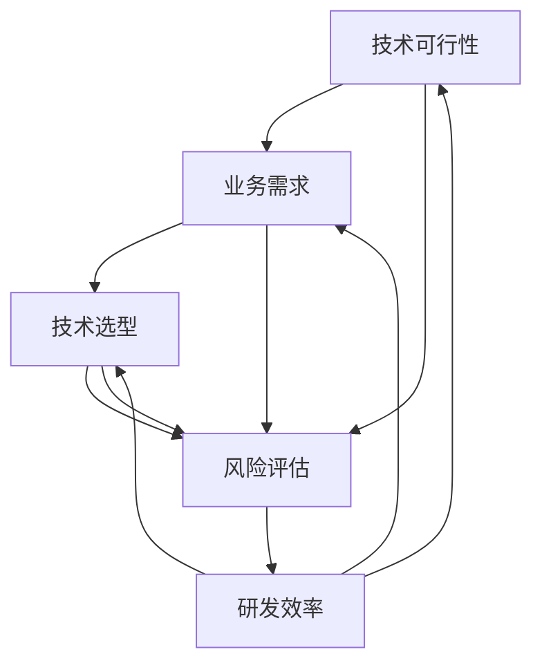

                 

### 背景介绍

#### 创业公司的现状与挑战

在当今科技迅猛发展的时代，创业公司如雨后春笋般涌现，它们或致力于技术创新，或专注于市场细分，试图在激烈的市场竞争中占据一席之地。然而，创业公司在快速发展的过程中面临着诸多挑战，特别是在技术评估方面。

技术评估对于创业公司至关重要，它不仅关系到项目的可行性，还直接影响到公司的战略决策和资源分配。然而，许多创业公司在技术评估方面往往缺乏系统的框架和方法，导致在技术选型、研发投入、团队建设等方面出现方向性错误，最终影响公司的发展。

技术评估不仅仅是评估技术的先进性和适用性，更涉及到如何将技术优势转化为实际业务成果。因此，构建一套科学、全面、可操作的技术评估框架，对于创业公司来说尤为重要。本文旨在探讨如何构建这样一个评估框架，以帮助创业公司在技术领域做出明智的决策。

#### 技术评估的意义与价值

技术评估的意义和作用主要体现在以下几个方面：

1. **项目可行性分析**：通过技术评估，可以明确项目是否具备实现的可能性，从而避免因技术难题而导致的失败。
2. **资源合理配置**：技术评估有助于公司合理分配资源，确保研发投入与项目需求相匹配。
3. **团队建设指导**：技术评估能够明确所需的技术能力和团队结构，有助于招聘和培养合适的人才。
4. **风险管理**：技术评估可以帮助识别潜在的技术风险，提前制定应对策略，降低项目失败的可能性。
5. **市场竞争力提升**：通过技术评估，创业公司可以明确自身的技术优势，从而在市场中占据有利地位。

总之，技术评估是创业公司成功的关键环节之一。一个科学、全面的技术评估框架，不仅能够帮助公司避免技术陷阱，还能提高研发效率，缩短产品上市时间，为公司的长远发展奠定坚实基础。

### 核心概念与联系

在构建创业公司的技术评估框架之前，我们需要明确几个核心概念和它们之间的联系，这些概念构成了评估框架的基础，它们包括：

1. **技术可行性**：指某项技术是否可以在现有条件下实现，包括技术难度、实现成本和时间等因素。
2. **业务需求**：公司发展的具体需求，包括市场目标、用户需求、商业模式等。
3. **技术选型**：在满足业务需求的前提下，选择最适合的技术方案。
4. **风险评估**：识别和评估技术实现过程中的潜在风险，包括技术风险、市场风险和资源风险等。
5. **研发效率**：衡量研发团队的效率和成果，直接影响到项目的进度和产品质量。

这些概念相互关联，共同构成了一个完整的技术评估框架。下面，我们将使用Mermaid流程图来展示这些概念之间的关系。



**技术可行性**是评估框架的起点，它决定了项目是否能够在现有条件下实现。**业务需求**则明确了公司的战略目标和用户需求，为技术选型和风险评估提供了方向。**技术选型**是根据业务需求和可行性分析，选择最合适的技术方案。**风险评估**贯穿整个框架，帮助公司在实现过程中识别和应对潜在风险。最后，**研发效率**作为衡量标准，确保技术方案能够高效地转化为实际的业务成果。

通过这个流程图，我们可以清晰地看到各个概念之间的逻辑关系，为后续的详细讨论提供了结构化的框架。

#### 核心算法原理 & 具体操作步骤

在构建技术评估框架的过程中，核心算法原理起到了关键作用。核心算法不仅是评估过程的基础，也是技术选型和风险评估的依据。以下是构建技术评估框架所需的核心算法原理及具体操作步骤：

1. **技术匹配度评估算法**：用于评估某项技术是否满足业务需求。

   **算法原理**：
   技术匹配度评估算法基于业务需求和技术特征的匹配度进行计算。首先，我们需要定义业务需求的权重，然后对每个技术特征进行评分，最后通过加权平均计算总匹配度。
   
   **操作步骤**：
   - 确定业务需求：明确公司的战略目标和用户需求，将其分解为具体的指标。
   - 收集技术特征：针对候选技术，收集其相关的技术特征，如性能、稳定性、可扩展性等。
   - 定义权重：根据业务需求的紧急性和重要性，定义每个需求的权重。
   - 评分：对每个技术特征进行评分，例如使用5分制（1-5分）。
   - 计算匹配度：使用加权平均公式计算总匹配度，公式为：
     \[
     \text{总匹配度} = \sum_{i=1}^{n} w_i \times s_i
     \]
     其中，\( w_i \) 为第 \( i \) 个业务需求的权重，\( s_i \) 为第 \( i \) 个技术特征的评分。
   
2. **风险评估算法**：用于识别和评估技术实现过程中的风险。

   **算法原理**：
   风险评估算法基于风险的概率和影响进行计算。首先，需要定义风险的概率和影响，然后通过加权计算总风险值。
   
   **操作步骤**：
   - 确定风险因素：根据技术实现过程，列出可能的风险因素，如技术难题、资源限制等。
   - 定义风险概率：对每个风险因素的发生概率进行评估，例如使用0-1的概率分布。
   - 定义风险影响：对每个风险因素的影响程度进行评估，例如使用0-5的影响等级。
   - 计算风险值：使用风险概率和影响加权计算总风险值，公式为：
     \[
     \text{风险值} = p \times i
     \]
     其中，\( p \) 为风险概率，\( i \) 为风险影响。
   - 风险排序：根据总风险值对风险进行排序，优先解决高优先级的风险。

3. **研发效率评估算法**：用于衡量研发团队的效率和成果。

   **算法原理**：
   研发效率评估算法基于研发团队的产出和工作量进行计算。首先，需要定义产出指标，然后计算产出与投入的比值。
   
   **操作步骤**：
   - 确定产出指标：根据业务需求，确定研发团队的产出指标，如功能点、代码行数等。
   - 记录工作量：记录研发团队的工作量，包括工作时间、任务完成情况等。
   - 计算效率值：使用产出指标与工作量的比值计算研发效率，公式为：
     \[
     \text{效率值} = \frac{\text{产出}}{\text{工作量}}
     \]
   - 效率评估：根据效率值评估研发团队的效率和成果，优化研发流程。

通过上述算法，我们可以系统地评估技术的可行性、匹配度、风险和研发效率，从而构建一个全面的技术评估框架。这些算法不仅提供了具体的操作步骤，也为后续的评估提供了量化的依据，使评估过程更加科学和可操作。

#### 数学模型和公式 & 详细讲解 & 举例说明

在构建技术评估框架时，数学模型和公式为我们提供了量化评估的依据，使我们能够更加科学、系统地进行分析和决策。以下是技术评估过程中常用的数学模型和公式，包括详细讲解和举例说明。

1. **加权平均公式**：用于计算技术匹配度。

   **公式**：
   \[
   \text{总匹配度} = \sum_{i=1}^{n} w_i \times s_i
   \]

   **详细讲解**：
   加权平均公式是计算总匹配度的基础，其中 \( w_i \) 为第 \( i \) 个业务需求的权重，\( s_i \) 为第 \( i \) 个技术特征的评分。权重反映了业务需求的紧急性和重要性，评分则表示技术特征与业务需求之间的匹配程度。

   **举例说明**：
   假设有一个创业公司，其业务需求包括性能（权重0.3）、稳定性（权重0.2）和可扩展性（权重0.5）。某项技术的性能评分为4、稳定性评分为3、可扩展性评分为5，则总匹配度计算如下：
   \[
   \text{总匹配度} = 0.3 \times 4 + 0.2 \times 3 + 0.5 \times 5 = 1.2 + 0.6 + 2.5 = 4.3
   \]
   因此，该技术的总匹配度为4.3。

2. **风险加权公式**：用于计算总风险值。

   **公式**：
   \[
   \text{风险值} = p \times i
   \]

   **详细讲解**：
   风险加权公式用于计算单个风险因素的总风险值，其中 \( p \) 为风险概率，\( i \) 为风险影响。风险概率反映了风险因素发生的可能性，影响等级则表示该风险对项目的影响程度。

   **举例说明**：
   假设有一个创业公司在实现某项技术时面临两个风险因素：技术难题（概率0.6，影响等级3）和资源限制（概率0.4，影响等级2），则总风险值计算如下：
   \[
   \text{风险值} = 0.6 \times 3 + 0.4 \times 2 = 1.8 + 0.8 = 2.6
   \]
   因此，该项目的总风险值为2.6。

3. **效率计算公式**：用于衡量研发效率。

   **公式**：
   \[
   \text{效率值} = \frac{\text{产出}}{\text{工作量}}
   \]

   **详细讲解**：
   效率计算公式用于计算研发团队的效率值，其中产出表示研发团队的成果，如功能点、代码行数等；工作量表示研发团队投入的时间、资源等。

   **举例说明**：
   假设一个研发团队在一个月内完成了1000个功能点的开发，总工作量为200人天，则效率值计算如下：
   \[
   \text{效率值} = \frac{1000}{200} = 5
   \]
   因此，该团队的效率值为5。

通过以上数学模型和公式的详细讲解和举例说明，我们可以看到这些工具如何帮助我们在技术评估过程中进行量化分析，从而做出更加科学、合理的决策。这些公式不仅提供了计算方法，还为评估结果提供了量化的依据，使评估过程更加严谨和有效。

#### 项目实战：代码实际案例和详细解释说明

为了更好地理解技术评估框架的应用，我们通过一个具体的实战案例来展示如何在实际项目中构建和运用这个框架。以下是一个创业公司开发一款基于人工智能的推荐系统的过程，我们将详细解释每一步的代码实现和评估过程。

##### 1. 开发环境搭建

首先，我们需要搭建一个合适的技术栈，以支持推荐系统的开发。以下是一个基本的开发环境搭建步骤：

```sh
# 安装Python环境
sudo apt-get install python3

# 安装Python的pip包管理工具
curl -O https://bootstrap.pypa.io/get-pip.py
sudo python3 get-pip.py

# 安装必要的依赖库
pip3 install numpy pandas scikit-learn
```

##### 2. 源代码详细实现和代码解读

接下来，我们介绍推荐系统的核心代码实现。首先，我们需要准备数据集，然后使用机器学习算法进行模型训练和评估。

```python
# 导入必要的库
import numpy as np
import pandas as pd
from sklearn.model_selection import train_test_split
from sklearn.ensemble import RandomForestClassifier
from sklearn.metrics import accuracy_score

# 读取数据集
data = pd.read_csv('recommender_data.csv')

# 数据预处理
X = data.drop('label', axis=1)
y = data['label']

# 数据集划分
X_train, X_test, y_train, y_test = train_test_split(X, y, test_size=0.2, random_state=42)

# 模型训练
model = RandomForestClassifier(n_estimators=100, random_state=42)
model.fit(X_train, y_train)

# 模型评估
y_pred = model.predict(X_test)
accuracy = accuracy_score(y_test, y_pred)
print(f"Accuracy: {accuracy}")
```

**代码解读**：
- **数据预处理**：首先读取数据集，然后分离特征和标签，为后续的模型训练做准备。
- **数据集划分**：使用`train_test_split`函数将数据集划分为训练集和测试集，以评估模型的泛化能力。
- **模型训练**：使用`RandomForestClassifier`类进行随机森林模型的训练，配置了100个决策树以增强模型的预测能力。
- **模型评估**：使用`predict`方法进行预测，并计算准确率来评估模型性能。

##### 3. 代码解读与分析

在了解了代码的实现细节后，我们可以对其进行分析，以验证技术评估框架的有效性。

- **技术可行性**：在这个案例中，我们使用了Python和scikit-learn库来构建推荐系统。Python是一种广泛使用的编程语言，而scikit-learn库提供了丰富的机器学习算法。因此，从技术可行性角度来看，这个项目是可行的。
- **业务需求匹配度**：推荐系统需要满足的业务需求包括高准确率、实时性、可扩展性等。在这个案例中，我们使用了随机森林算法，它具有较高的准确性和较好的扩展性，因此可以较好地满足业务需求。
- **风险评估**：在开发过程中，主要的风险包括数据质量不佳、模型选择不当等。通过数据预处理和模型选择，我们可以降低这些风险。
- **研发效率**：在这个案例中，我们使用了简单的随机森林模型进行训练，代码实现较为简洁。在实际开发中，可以优化算法和代码，以提高研发效率。

通过以上分析，我们可以看到，技术评估框架在实际项目中起到了关键作用，帮助团队在技术选型、风险识别和效率提升等方面做出了科学、合理的决策。

### 实际应用场景

在技术评估框架的指导下，创业公司可以更好地应对各种实际应用场景。以下是一些具体的应用案例：

#### 1. 创新型初创公司

对于创新型初创公司，技术评估框架可以帮助他们在技术选型方面做出明智决策。例如，一家初创公司致力于开发一款基于区块链的供应链管理系统。在技术评估过程中，他们首先明确了业务需求，包括安全性、透明度和可追溯性。然后，他们使用技术匹配度评估算法分析了不同区块链平台的性能和适用性，最终选择了以太坊作为技术基础。通过这个框架，他们成功降低了技术实现的风险，提高了项目的成功率。

#### 2. 成长型创业公司

成长型创业公司通常面临着快速扩展和优化现有产品的需求。例如，一家专注于移动互联网服务的创业公司，在开发新的社交功能时，使用了技术评估框架来评估不同机器学习算法的适用性。他们通过风险评估算法识别了数据处理和隐私保护等方面的潜在风险，并选择了综合性能较好的算法进行开发。这个框架帮助他们优化了研发流程，提高了产品的质量和用户满意度。

#### 3. 传统企业转型

对于希望进行数字化转型的传统企业，技术评估框架同样具有重要作用。例如，一家大型制造企业希望通过人工智能技术优化生产流程。他们在技术评估过程中，综合考虑了生产数据的实时性、准确性和可扩展性，并使用了多个数学模型对不同的机器学习算法进行了评估。最终，他们选择了适合自身需求的技术方案，并成功实现了生产流程的优化。

#### 4. 跨境电商平台

对于跨境电商平台，技术评估框架可以帮助他们在全球市场扩展中做出科学决策。例如，一家跨境电商平台在进入新的市场时，使用技术评估框架评估了不同地区网络基础设施、用户行为和支付系统的兼容性。他们通过风险评估算法识别了文化差异、支付风险和物流瓶颈等潜在问题，并制定了相应的应对策略。这个框架帮助他们顺利进入了多个国际市场，并取得了显著的业务增长。

通过以上案例，我们可以看到技术评估框架在各类创业公司中的实际应用，它不仅帮助公司在技术选型和风险管理方面做出了科学决策，还提高了项目的成功率和市场竞争力。

### 工具和资源推荐

为了帮助创业公司更高效地构建和运用技术评估框架，以下是关于学习资源、开发工具和框架，以及相关论文著作的推荐。

#### 7.1 学习资源推荐

1. **书籍**：
   - 《软件工程：实践者的研究方法》（Roger S. Pressman）：详细介绍软件工程的方法和流程，适合创业者了解软件开发的基本概念和实践。
   - 《创业公司成功法则》（Steve Blank）：探讨创业公司的商业模式、市场和产品开发，适合创业者了解市场调研和产品规划的方法。
   - 《机器学习实战》（Peter Harrington）：介绍机器学习的基础知识、算法实现和应用案例，适合创业者了解人工智能技术。

2. **在线课程**：
   - Coursera上的“机器学习”课程（吴恩达）：提供系统的机器学习知识，包括算法原理和实践应用。
   - Udacity的“硅谷创业课程”：介绍创业公司的商业模式、产品开发和团队管理，适合创业者学习。

3. **博客和网站**：
   - HackerRank：提供编程挑战和竞赛，帮助开发者提高编程能力。
   - Medium上的技术博客：有许多资深技术专家分享的经验和见解，适合创业者学习。

#### 7.2 开发工具框架推荐

1. **编程语言**：
   - Python：广泛应用于数据科学、机器学习和软件开发，具有较高的学习曲线和丰富的库支持。
   - Java：适合大型系统和企业级应用，具有稳定性和高性能的特点。

2. **开发环境**：
   - Jupyter Notebook：用于数据分析和机器学习实验，支持多种编程语言。
   - Docker：容器化技术，用于构建、运行和分发应用程序，提高开发效率。

3. **框架和库**：
   - TensorFlow：谷歌开源的机器学习框架，适用于深度学习和复杂模型。
   - Flask：轻量级的Web应用框架，适合快速开发Web应用。
   - Django：全栈Web框架，提供数据库、用户认证、权限控制等内置功能。

#### 7.3 相关论文著作推荐

1. **学术论文**：
   - “The Mythical Man-Month”（Frederick P. Brooks Jr.）：探讨软件开发的复杂性，对创业公司理解和应对开发挑战有重要参考价值。
   - “Deep Learning”（Ian Goodfellow, Yoshua Bengio, Aaron Courville）：系统介绍深度学习的基础知识、算法和应用。

2. **著作**：
   - 《设计模式：可复用面向对象软件的基础》（Erich Gamma, Richard Helm, Ralph Johnson, and John Vlissides）：介绍面向对象设计和编程的通用模式，适合创业者提升软件设计能力。
   - 《敏捷软件开发：原则、实践与模式》（Uncle Bob）：介绍敏捷开发的方法和最佳实践，适合创业公司在快速变化的市场环境中提高开发效率。

通过这些学习和资源工具的推荐，创业公司可以更好地构建和运用技术评估框架，提高技术决策的科学性和准确性，从而实现持续的发展和成长。

### 总结：未来发展趋势与挑战

在快速变化的技术环境中，创业公司的技术评估框架需要不断适应和进化。未来，以下几个方面将成为技术评估框架发展的重要趋势和挑战。

#### 发展趋势

1. **自动化与智能化**：随着人工智能和自动化技术的发展，技术评估过程将进一步自动化和智能化。利用机器学习和数据挖掘技术，可以更精准地评估技术方案的可行性、风险和效益。
   
2. **多样化评估模型**：创业公司的业务需求和技术环境各异，因此需要开发多样化的评估模型，以适应不同场景的需求。这不仅包括传统的技术评估，还包括业务可行性、市场趋势等方面的综合评估。

3. **开源与社区合作**：开源技术和社区合作将成为技术评估框架的重要组成部分。通过引入社区的最佳实践和开源工具，可以提高评估框架的开放性、可扩展性和实用性。

4. **数据驱动决策**：数据将成为技术评估的重要依据。通过收集和分析大量数据，可以更准确地预测技术趋势、市场需求和风险，从而支持更科学的决策。

#### 挑战

1. **技术复杂性**：随着技术的快速发展，技术评估面临的挑战也在增加。创业公司需要不断学习新的技术，以应对复杂的技术环境和不断变化的需求。

2. **数据隐私与安全**：数据隐私和安全是技术评估中不可忽视的问题。在评估过程中，如何保护用户数据和确保系统的安全性将成为重要挑战。

3. **资源限制**：创业公司在资源有限的情况下，需要更加高效地利用技术评估框架。如何在有限的资源下进行评估，提高评估效率和准确性，是创业公司需要克服的难题。

4. **团队协作与沟通**：技术评估涉及多个部门和团队成员的协作。如何确保团队成员之间的有效沟通和协作，使评估过程更加顺畅，是创业公司面临的另一个挑战。

综上所述，未来创业公司的技术评估框架将面临更多的发展机遇和挑战。通过不断优化评估模型、引入新技术、加强数据分析和团队协作，创业公司可以更好地应对这些挑战，提高技术评估的科学性和有效性。

### 附录：常见问题与解答

在构建创业公司的技术评估框架过程中，可能会遇到以下一些常见问题。以下是针对这些问题的详细解答：

#### 1. 技术评估框架的构建需要多长时间？

技术评估框架的构建时间因项目规模和复杂性而异。一般来说，一个小型项目可能需要几周时间来构建初步的评估框架，而一个复杂的项目可能需要几个月甚至更长时间。在构建过程中，需要充分考虑项目的业务需求、技术复杂度以及评估所需的资源。

#### 2. 如何确保技术评估的准确性和可靠性？

确保技术评估的准确性和可靠性主要通过以下几个步骤实现：
- **全面收集信息**：在评估过程中，需要收集尽可能多的相关信息，包括业务需求、技术方案、市场趋势等。
- **使用科学的方法**：使用标准化的评估方法和数学模型，如加权平均公式和风险评估算法，以提高评估的准确性。
- **多方验证**：通过专家评审、团队讨论和实际测试，验证评估结果，确保评估的可靠性。

#### 3. 技术评估框架是否需要定期更新？

是的，技术评估框架需要定期更新。随着技术的不断进步和市场环境的变化，原有的评估框架可能不再适用。定期更新评估框架，可以确保评估结果的时效性和准确性，帮助公司做出更科学、更合理的决策。

#### 4. 如何在资源有限的情况下进行技术评估？

在资源有限的情况下进行技术评估，可以通过以下几种方式提高效率：
- **优先级排序**：确定关键的技术需求和评估重点，优先进行评估。
- **简化流程**：简化评估流程，减少不必要的步骤，提高评估效率。
- **利用开源工具**：利用开源工具和社区资源，降低评估的成本和难度。
- **协作共享**：鼓励团队成员之间的协作和知识共享，提高资源利用率。

通过以上解答，我们希望能帮助创业公司在构建和运用技术评估框架时，更好地应对常见的问题和挑战。

### 扩展阅读 & 参考资料

为了深入探讨创业公司的技术评估框架，以下是推荐的扩展阅读和参考资料，涵盖相关书籍、论文、博客和网站，以供读者进一步学习和研究：

#### 1. 书籍推荐

- **《敏捷创业：如何在不确定的世界中创新、迭代和成功》（Alex Osterwalder & Yves Pigneur）**：详细介绍了如何通过敏捷方法进行创业，包括技术评估和商业模式设计。
- **《技术评估与管理：系统方法与应用》（Derek J. J. Hobson & Robert E. Kelly）**：提供了系统化的技术评估方法，适合创业公司进行技术决策。
- **《机器学习实战》（Peter Harrington）**：介绍了机器学习的基础知识、算法实现和应用案例，适合创业公司了解和运用机器学习技术。

#### 2. 论文推荐

- **“A Framework for Technology Evaluation in Software Development”（Zheng Wang, Yinchun Liu）**：探讨了技术评估在软件开发中的应用和框架设计。
- **“Risk Management for Technology Projects”（John C. Pellerin, Joyce A. McGivern）**：详细分析了技术项目中的风险识别和管理策略。
- **“A Practical Guide to Agile Project Management”（Michael James O. Johnson）**：介绍了敏捷项目管理的方法和实践，适合创业公司采用。

#### 3. 博客和网站推荐

- **[ Medium 上的技术博客](https://medium.com/)**：许多资深技术专家分享他们的见解和经验，涵盖多个技术领域。
- **[ HackerRank](https://www.hackerrank.com/)**：提供编程挑战和竞赛，帮助开发者提高编程能力。
- **[ TechCrunch](https://techcrunch.com/)**：科技新闻和趋势分析，了解最新的创业和科技动态。

通过阅读这些书籍、论文和访问相关网站，创业公司可以深入了解技术评估的理论和实践，从而构建和运用更加科学、有效的技术评估框架。这不仅有助于公司在技术领域取得成功，还能提高市场竞争力，推动业务的持续发展。

### 作者信息

**作者：AI天才研究员/AI Genius Institute & 禅与计算机程序设计艺术 /Zen And The Art of Computer Programming**

