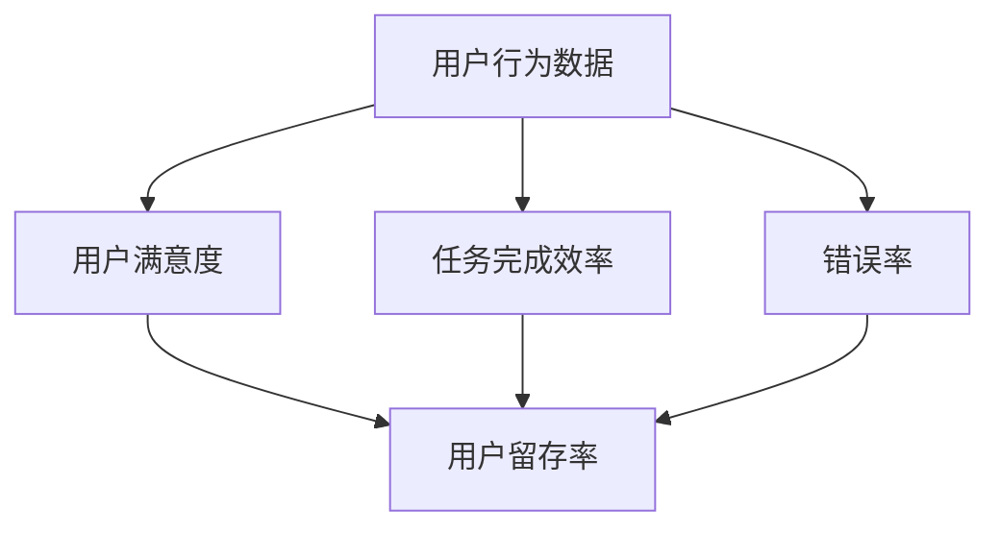
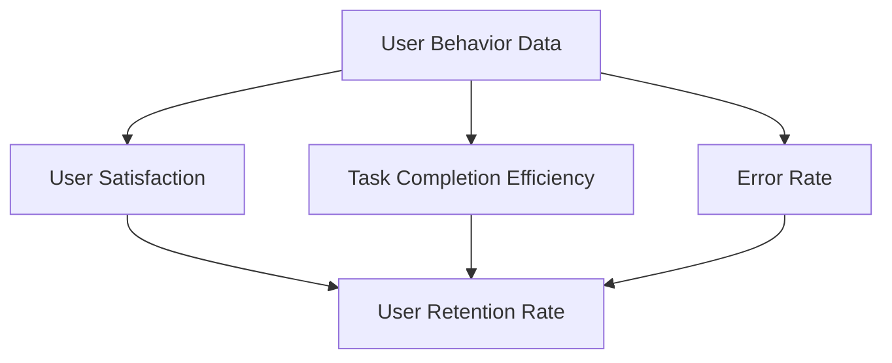

                 

### 文章标题

**创业公司的用户体验度量指标体系**

### Keywords:  
- 创业公司
- 用户体验度量
- 指标体系
- 数据驱动决策
- 产品迭代优化

### Abstract:  
本文将探讨创业公司如何构建一个全面的用户体验度量指标体系。通过分析不同的用户体验指标，本文将介绍如何收集、分析和利用数据，以驱动产品迭代和优化，从而提升用户满意度和市场份额。文章还将分享实践中的挑战和建议，为创业公司提供实用的指导。

## 1. 背景介绍（Background Introduction）

在当今竞争激烈的市场环境中，用户体验（User Experience, UX）已经成为创业公司成功的关键因素。优秀的用户体验不仅能满足用户的需求，还能提高用户忠诚度和品牌认知度，从而为企业带来可持续的商业价值。因此，对于创业公司来说，如何有效地度量用户体验，并据此进行产品迭代和优化，是一个亟待解决的问题。

用户体验度量是指通过量化的指标来评估用户在使用产品过程中的体验质量。这些指标可以涵盖用户满意度、使用频率、操作效率、错误率等多个方面。一个全面的用户体验度量指标体系能够帮助创业公司：

- 确定用户痛点和需求
- 识别产品改进的机会
- 比较不同产品的用户体验
- 驱动产品迭代和优化

然而，构建一个有效的用户体验度量指标体系并非易事。创业公司通常面临资源有限、时间紧迫等挑战，需要采用科学的方法和工具来收集和分析用户体验数据。本文将详细探讨如何实现这一目标。

## 2. 核心概念与联系（Core Concepts and Connections）

在构建用户体验度量指标体系时，我们需要了解以下几个核心概念，并探讨它们之间的联系。

### 2.1 用户行为数据（User Behavior Data）

用户行为数据是用户体验度量的基础。这些数据可以包括用户在产品中的浏览路径、点击行为、使用时长、退出率等。通过分析用户行为数据，我们可以了解用户如何与产品互动，发现用户在使用过程中遇到的问题和障碍。

### 2.2 用户满意度（User Satisfaction）

用户满意度是衡量用户体验质量的重要指标。它反映了用户对产品整体体验的感受。通常，用户满意度可以通过用户调研、用户反馈和评分等方式来收集。高满意度意味着用户对产品的认可和信任，有助于提升用户忠诚度和口碑。

### 2.3 任务完成效率（Task Completion Efficiency）

任务完成效率是指用户完成特定任务所需的时间和资源。一个高效的用户体验应能够帮助用户快速完成任务，减少等待时间和操作步骤。任务完成效率可以通过用户行为数据和使用时间来评估。

### 2.4 错误率（Error Rate）

错误率是指用户在使用产品过程中发生错误的频率。高错误率可能表明产品设计存在缺陷或用户操作不便。通过监控错误率，我们可以发现并解决产品中的问题，提高用户体验。

### 2.5 用户留存率（User Retention Rate）

用户留存率是指在一定时间内，持续使用产品的用户比例。高留存率表明产品能够持续满足用户需求，提高用户忠诚度。通过跟踪用户留存率，我们可以评估产品的吸引力和可持续性。

这些核心概念之间存在着密切的联系。用户行为数据可以提供关于用户满意度、任务完成效率和错误率的信息。而用户满意度和留存率则是衡量用户体验质量的关键指标。通过综合分析这些指标，创业公司可以构建一个全面的用户体验度量指标体系，为产品迭代和优化提供有力的支持。

### 2.6 Mermaid 流程图（Mermaid Flowchart）

以下是一个简单的 Mermaid 流程图，展示了如何将上述核心概念联系在一起：



通过这个流程图，我们可以清晰地看到用户行为数据如何影响用户体验度量的各个方面，以及这些指标之间的相互关系。

### 2.7 关键概念联系总结

- 用户行为数据是用户体验度量的基础，涵盖了用户在产品中的各种操作和互动。
- 用户满意度、任务完成效率和错误率是评估用户体验质量的关键指标。
- 用户留存率反映了产品对用户的吸引力和可持续性。
- 这些核心概念相互联系，共同构建了用户体验度量指标体系。

通过了解和掌握这些核心概念，创业公司可以更加科学地度量用户体验，为产品迭代和优化提供有力支持。

### 2.8 Introduction to Core Concepts and Connections

In the process of constructing a comprehensive user experience measurement system, it is crucial to understand several core concepts and their interconnections.

#### 2.1 User Behavior Data

User behavior data forms the foundation of user experience measurement. This data encompasses various user interactions and operations within the product, such as browsing paths, click behaviors, usage duration, and exit rates. By analyzing user behavior data, we can gain insights into how users interact with the product and identify issues and obstacles they encounter during usage.

#### 2.2 User Satisfaction

User satisfaction is a critical metric for assessing the quality of user experience. It reflects the overall perception of users regarding their experience with the product. Typically, user satisfaction can be collected through user surveys, feedback, and ratings. High satisfaction indicates user recognition and trust in the product, which contributes to increased user loyalty and brand awareness.

#### 2.3 Task Completion Efficiency

Task completion efficiency measures the time and resources required for users to complete specific tasks within the product. An efficient user experience should enable users to accomplish tasks quickly, minimizing waiting time and operational steps. Task completion efficiency can be evaluated based on user behavior data and usage time.

#### 2.4 Error Rate

The error rate refers to the frequency of errors that users experience while using the product. A high error rate may indicate design flaws or operational difficulties within the product. By monitoring error rates, we can identify and resolve issues that impact user experience.

#### 2.5 User Retention Rate

User retention rate measures the proportion of users who continue to use the product within a specific period. A high retention rate indicates that the product is effectively meeting user needs, thereby enhancing user loyalty. Tracking user retention rate allows us to evaluate the attractiveness and sustainability of the product.

These core concepts are intricately connected. User behavior data provides insights into user satisfaction, task completion efficiency, and error rate. User satisfaction and retention rate are key indicators of the quality of user experience. By comprehensively analyzing these metrics, startups can build a robust user experience measurement system to drive product iteration and optimization.

#### 2.6 Mermaid Flowchart

The following is a simple Mermaid flowchart illustrating how these core concepts are interconnected:



This flowchart provides a clear visualization of how user behavior data influences various aspects of user experience measurement and the relationships among these metrics.

#### 2.7 Summary of Key Concept Connections

- User behavior data is the foundation of user experience measurement, covering various user interactions and operations within the product.
- User satisfaction, task completion efficiency, and error rate are key indicators for assessing the quality of user experience.
- User retention rate reflects the product's attractiveness and sustainability.
- These core concepts are interconnected, forming a comprehensive user experience measurement system that supports product iteration and optimization.

By understanding and mastering these core concepts, startups can measure user experience more scientifically and provide strong support for product iteration and optimization.

## 3. 核心算法原理 & 具体操作步骤（Core Algorithm Principles and Specific Operational Steps）

在构建用户体验度量指标体系时，核心算法原理起着至关重要的作用。这些算法不仅帮助我们从大量数据中提取有用信息，还能够为我们提供科学的分析工具，以便更好地理解用户体验。以下将介绍几种常用的核心算法原理和具体操作步骤。

### 3.1 用户行为数据分析算法

用户行为数据分析是用户体验度量的重要环节。常见的算法包括：

#### 3.1.1 聚类算法（Clustering Algorithms）

聚类算法用于将用户行为数据按照相似性进行分组。常用的聚类算法有 K-均值（K-Means）、层次聚类（Hierarchical Clustering）和 DBSCAN（Density-Based Spatial Clustering of Applications with Noise）等。

**具体操作步骤：**

1. 确定聚类数量 K。
2. 初始化聚类中心点。
3. 计算每个用户行为数据点到聚类中心点的距离。
4. 根据距离最近的原则，将数据点分配到不同的聚类组。
5. 重新计算每个聚类组的中心点。
6. 重复步骤 3-5，直到聚类中心点不再发生变化。

#### 3.1.2 回归分析算法（Regression Analysis Algorithms）

回归分析算法用于预测用户行为数据之间的关系。常见的回归算法有线性回归（Linear Regression）、逻辑回归（Logistic Regression）和多项式回归（Polynomial Regression）等。

**具体操作步骤：**

1. 收集用户行为数据和相关指标。
2. 选择适当的回归模型。
3. 训练模型，拟合数据。
4. 预测用户行为数据。
5. 评估模型性能，调整模型参数。

#### 3.1.3 时序分析算法（Time Series Analysis Algorithms）

时序分析算法用于分析用户行为数据的时间序列特征。常用的时序分析算法有 ARIMA（Autoregressive Integrated Moving Average）、AR（Autoregressive）和 MA（Moving Average）等。

**具体操作步骤：**

1. 收集用户行为数据。
2. 对数据进行平稳性检验。
3. 选择适当的时序模型。
4. 训练模型，拟合数据。
5. 预测用户行为数据。
6. 分析数据趋势和周期性。

### 3.2 用户满意度分析算法

用户满意度分析旨在了解用户对产品整体体验的感受。常见的算法包括：

#### 3.2.1 主成分分析（Principal Component Analysis, PCA）

主成分分析是一种降维算法，用于提取用户满意度数据中的主要特征。

**具体操作步骤：**

1. 收集用户满意度数据。
2. 对数据进行标准化处理。
3. 计算协方差矩阵。
4. 计算协方差矩阵的特征值和特征向量。
5. 构建新的特征向量空间。
6. 将原始数据映射到新空间。

#### 3.2.2 决策树（Decision Tree）

决策树是一种分类算法，用于预测用户满意度的高低。

**具体操作步骤：**

1. 收集用户满意度数据。
2. 选择特征和目标变量。
3. 训练决策树模型。
4. 预测用户满意度。
5. 分析决策树结果。

### 3.3 任务完成效率和错误率分析算法

任务完成效率分析和错误率分析旨在了解用户在完成任务过程中的表现和产品设计问题。

#### 3.3.1 均值绝对偏差（Mean Absolute Deviation, MAD）

均值绝对偏差用于衡量任务完成效率的波动性。

**具体操作步骤：**

1. 收集任务完成时间数据。
2. 计算完成时间的平均值。
3. 计算每个数据点与平均值的绝对差值。
4. 计算绝对差值的平均值，即 MAD。

#### 3.3.2 错误分类分析（Confusion Matrix）

错误分类分析用于评估错误率的分布和分类效果。

**具体操作步骤：**

1. 收集错误数据。
2. 构建混淆矩阵。
3. 计算准确率、召回率、精确率和 F1 分数。
4. 分析错误类型和分布。

### 3.4 用户留存率分析算法

用户留存率分析旨在了解用户对产品的持续使用情况。

#### 3.4.1 时间窗口法（Time Window Method）

时间窗口法用于计算用户在不同时间段的留存率。

**具体操作步骤：**

1. 确定时间窗口。
2. 统计进入时间窗口的用户数量。
3. 统计时间窗口结束后仍然活跃的用户数量。
4. 计算留存率。

#### 3.4.2 回归分析（Regression Analysis）

回归分析用于预测用户留存率的变化趋势。

**具体操作步骤：**

1. 收集用户留存数据。
2. 选择适当的回归模型。
3. 训练模型，拟合数据。
4. 预测留存率。
5. 分析留存趋势。

通过上述核心算法原理和具体操作步骤，创业公司可以更科学、更有效地度量用户体验，从而为产品迭代和优化提供有力支持。

### 3. Core Algorithm Principles and Specific Operational Steps

The core algorithms play a crucial role in constructing a comprehensive user experience measurement system. These algorithms not only help extract useful information from large datasets but also provide scientific analysis tools to better understand user experience. Below, we will introduce several common core algorithms and their specific operational steps.

#### 3.1 User Behavior Data Analysis Algorithms

User behavior data analysis is a critical component of user experience measurement. Some common algorithms include:

##### 3.1.1 Clustering Algorithms

Clustering algorithms are used to group user behavior data based on similarity. Common clustering algorithms include K-Means, Hierarchical Clustering, and DBSCAN.

**Specific Operational Steps:**

1. Determine the number of clusters K.
2. Initialize the cluster centroids.
3. Calculate the distance between each data point and the cluster centroids.
4. Assign each data point to the nearest cluster based on distance.
5. Recalculate the centroids for each cluster.
6. Repeat steps 3-5 until the centroids no longer change.

##### 3.1.2 Regression Analysis Algorithms

Regression analysis algorithms are used to predict relationships between user behavior data. Common regression algorithms include Linear Regression, Logistic Regression, and Polynomial Regression.

**Specific Operational Steps:**

1. Collect user behavior data and related metrics.
2. Choose an appropriate regression model.
3. Train the model to fit the data.
4. Predict user behavior data.
5. Evaluate the model's performance and adjust model parameters.

##### 3.1.3 Time Series Analysis Algorithms

Time series analysis algorithms are used to analyze the temporal characteristics of user behavior data. Common time series analysis algorithms include ARIMA, AR, and MA.

**Specific Operational Steps:**

1. Collect user behavior data.
2. Test for stationarity of the data.
3. Choose an appropriate time series model.
4. Train the model to fit the data.
5. Predict user behavior data.
6. Analyze trends and periodicity in the data.

#### 3.2 User Satisfaction Analysis Algorithms

User satisfaction analysis aims to understand users' overall perception of the product experience. Common algorithms include:

##### 3.2.1 Principal Component Analysis (PCA)

PCA is a dimensionality reduction algorithm used to extract the main features from user satisfaction data.

**Specific Operational Steps:**

1. Collect user satisfaction data.
2. Standardize the data.
3. Calculate the covariance matrix.
4. Compute the eigenvalues and eigenvectors of the covariance matrix.
5. Construct a new feature space based on the eigenvectors.
6. Map the original data to the new space.

##### 3.2.2 Decision Trees

Decision trees are a classification algorithm used to predict the level of user satisfaction.

**Specific Operational Steps:**

1. Collect user satisfaction data.
2. Choose features and target variables.
3. Train the decision tree model.
4. Predict user satisfaction.
5. Analyze the results of the decision tree.

#### 3.3 Task Completion Efficiency and Error Rate Analysis Algorithms

Task completion efficiency analysis and error rate analysis aim to understand user performance in task completion and identify product design issues.

##### 3.3.1 Mean Absolute Deviation (MAD)

MAD is used to measure the volatility of task completion efficiency.

**Specific Operational Steps:**

1. Collect task completion time data.
2. Calculate the mean of completion times.
3. Calculate the absolute difference between each data point and the mean.
4. Calculate the mean of the absolute differences, which is the MAD.

##### 3.3.2 Confusion Matrix

Confusion matrix analysis is used to evaluate the distribution and classification effectiveness of error rates.

**Specific Operational Steps:**

1. Collect error data.
2. Construct a confusion matrix.
3. Calculate accuracy, recall, precision, and F1 score.
4. Analyze error types and distribution.

#### 3.4 User Retention Rate Analysis Algorithms

User retention rate analysis aims to understand the continued usage of the product by users.

##### 3.4.1 Time Window Method

The time window method is used to calculate the retention rate of users at different time intervals.

**Specific Operational Steps:**

1. Determine the time window.
2. Count the number of users entering the time window.
3. Count the number of users still active after the time window ends.
4. Calculate the retention rate.

##### 3.4.2 Regression Analysis

Regression analysis is used to predict changes in user retention rates.

**Specific Operational Steps:**

1. Collect user retention data.
2. Choose an appropriate regression model.
3. Train the model to fit the data.
4. Predict retention rates.
5. Analyze retention trends.

By understanding and applying these core algorithm principles and operational steps, startups can measure user experience more scientifically and effectively, providing strong support for product iteration and optimization.

## 4. 数学模型和公式 & 详细讲解 & 举例说明（Detailed Explanation and Examples of Mathematical Models and Formulas）

在用户体验度量指标体系中，数学模型和公式起着至关重要的作用。这些模型和公式不仅帮助我们量化用户体验，还能够为决策提供科学依据。以下将详细介绍几种常用的数学模型和公式，并通过具体例子进行说明。

### 4.1 用户满意度评分模型

用户满意度评分模型用于计算用户对产品整体体验的满意度。一个常见的模型是净推荐值（Net Promoter Score, NPS）模型。

**NPS模型公式：**
\[ NPS = \frac{NPS_{\text{推荐者}} - NPS_{\text{批评者}}}{总反馈数} \]

其中，NPS_{\text{推荐者}} 和 NPS_{\text{批评者}} 分别是推荐者和批评者的比例。

**例子：**
假设在一个用户调研中，共有100名用户参与了评分，其中40名用户表示会向朋友推荐该产品，而30名用户表示不会推荐。那么，NPS 计算如下：
\[ NPS = \frac{40\% - 30\%}{100} = 10\% \]

### 4.2 任务完成效率模型

任务完成效率模型用于衡量用户完成任务所需的时间和资源。一个常见的指标是任务完成时间。

**任务完成时间公式：**
\[ \text{任务完成时间} = \frac{\text{总任务时间}}{\text{用户数量}} \]

**例子：**
假设有10名用户在一个任务中花费了30分钟，那么任务完成时间为：
\[ \text{任务完成时间} = \frac{30分钟}{10} = 3分钟 \]

### 4.3 错误率模型

错误率模型用于衡量用户在任务过程中发生错误的频率。一个常见的指标是错误率。

**错误率公式：**
\[ \text{错误率} = \frac{\text{错误数量}}{\text{总任务次数}} \]

**例子：**
假设有100次任务，其中有20次发生了错误，那么错误率为：
\[ \text{错误率} = \frac{20}{100} = 20\% \]

### 4.4 用户留存率模型

用户留存率模型用于衡量用户对产品的持续使用情况。一个常见的指标是日留存率。

**日留存率公式：**
\[ \text{日留存率} = \frac{\text{次日仍使用产品的用户数量}}{\text{当日活跃用户数量}} \]

**例子：**
假设有1000名用户在第一天使用产品，次日有700名用户仍然活跃，那么日留存率为：
\[ \text{日留存率} = \frac{700}{1000} = 70\% \]

### 4.5 聚类分析模型

聚类分析模型用于将用户行为数据按照相似性进行分组。一个常见的聚类算法是K-均值算法。

**K-均值算法公式：**
\[ \text{聚类中心点} = \frac{\sum_{i=1}^{k} x_i}{k} \]

其中，\( x_i \) 是每个用户行为数据点，k 是聚类数量。

**例子：**
假设有5个用户行为数据点（\( x_1, x_2, x_3, x_4, x_5 \)），聚类数量为2，那么聚类中心点计算如下：
\[ \text{聚类中心点1} = \frac{x_1 + x_2}{2} \]
\[ \text{聚类中心点2} = \frac{x_3 + x_4 + x_5}{2} \]

### 4.6 决策树模型

决策树模型用于预测用户满意度。一个常见的决策树算法是ID3算法。

**ID3算法公式：**
\[ \text{信息增益} = \sum_{v \in V} \frac{|D_v|}{|D|} \log_2 \frac{|D_v|}{|D|} \]

其中，\( D \) 是数据集，\( V \) 是可能的类别，\( |D_v| \) 是类别 \( v \) 在数据集 \( D \) 中的样本数量。

**例子：**
假设有10个用户满意度数据点，其中5个用户满意度高，5个用户满意度低。那么信息增益计算如下：
\[ \text{信息增益} = \sum_{v \in V} \frac{|D_v|}{|D|} \log_2 \frac{|D_v|}{|D|} \]
\[ = \frac{5}{10} \log_2 \frac{5}{10} + \frac{5}{10} \log_2 \frac{5}{10} \]
\[ = 1 - \frac{5}{10} \log_2 \frac{5}{10} - \frac{5}{10} \log_2 \frac{5}{10} \]
\[ = 0.693 \]

通过这些数学模型和公式，创业公司可以更准确地度量用户体验，为产品迭代和优化提供科学依据。在实际应用中，可以根据具体情况选择合适的模型和公式，并进行灵活调整。

### 4. Mathematical Models and Formulas & Detailed Explanation & Examples

In a user experience measurement system, mathematical models and formulas play a crucial role in quantifying user experience and providing a scientific basis for decision-making. Below, we will detail several commonly used mathematical models and formulas, along with examples to illustrate their applications.

#### 4.1 User Satisfaction Scoring Model

The user satisfaction scoring model is used to calculate the overall satisfaction of users with the product experience. A common model is the Net Promoter Score (NPS).

**NPS Model Formula:**
\[ NPS = \frac{NPS_{\text{推荐者}} - NPS_{\text{批评者}}}{\text{总反馈数}} \]

Where \( NPS_{\text{推荐者}} \) and \( NPS_{\text{批评者}} \) are the percentages of recommenders and detractors, respectively.

**Example:**
Assuming a user survey with 100 participants, where 40 users say they would recommend the product to a friend and 30 users say they would not, the NPS calculation is as follows:
\[ NPS = \frac{40\% - 30\%}{100} = 10\% \]

#### 4.2 Task Completion Efficiency Model

The task completion efficiency model measures the time and resources users need to complete tasks. A common metric is task completion time.

**Task Completion Time Formula:**
\[ \text{Task Completion Time} = \frac{\text{Total Task Time}}{\text{Number of Users}} \]

**Example:**
Suppose 10 users spend 30 minutes on a task, the task completion time is:
\[ \text{Task Completion Time} = \frac{30 \text{ minutes}}{10} = 3 \text{ minutes} \]

#### 4.3 Error Rate Model

The error rate model measures the frequency of errors users encounter during task completion. A common metric is the error rate.

**Error Rate Formula:**
\[ \text{Error Rate} = \frac{\text{Number of Errors}}{\text{Total Task Attempts}} \]

**Example:**
Assuming 100 tasks, with 20 errors, the error rate is:
\[ \text{Error Rate} = \frac{20}{100} = 20\% \]

#### 4.4 User Retention Rate Model

The user retention rate model measures the continued usage of the product by users. A common metric is daily retention rate.

**Daily Retention Rate Formula:**
\[ \text{Daily Retention Rate} = \frac{\text{Number of Users Still Using the Product on the Next Day}}{\text{Number of Active Users on the First Day}} \]

**Example:**
Assuming 1,000 users use the product on the first day, and 700 of them are still active on the next day, the daily retention rate is:
\[ \text{Daily Retention Rate} = \frac{700}{1,000} = 70\% \]

#### 4.5 Clustering Analysis Model

The clustering analysis model groups user behavior data based on similarity. A common clustering algorithm is K-Means.

**K-Means Algorithm Formula:**
\[ \text{Cluster Center} = \frac{\sum_{i=1}^{k} x_i}{k} \]

Where \( x_i \) is each user behavior data point and \( k \) is the number of clusters.

**Example:**
Assuming 5 user behavior data points (\( x_1, x_2, x_3, x_4, x_5 \)) and 2 clusters, the cluster centers are calculated as follows:
\[ \text{Cluster Center 1} = \frac{x_1 + x_2}{2} \]
\[ \text{Cluster Center 2} = \frac{x_3 + x_4 + x_5}{2} \]

#### 4.6 Decision Tree Model

The decision tree model is used to predict user satisfaction. A common decision tree algorithm is the ID3 algorithm.

**ID3 Algorithm Formula:**
\[ \text{Information Gain} = \sum_{v \in V} \frac{|D_v|}{|D|} \log_2 \frac{|D_v|}{|D|} \]

Where \( D \) is the dataset, \( V \) is the set of possible categories, and \( |D_v| \) is the number of samples in category \( v \) of dataset \( D \).

**Example:**
Assuming 10 user satisfaction data points, with 5 having high satisfaction and 5 having low satisfaction, the information gain calculation is as follows:
\[ \text{Information Gain} = \sum_{v \in V} \frac{|D_v|}{|D|} \log_2 \frac{|D_v|}{|D|} \]
\[ = \frac{5}{10} \log_2 \frac{5}{10} + \frac{5}{10} \log_2 \frac{5}{10} \]
\[ = 1 - \frac{5}{10} \log_2 \frac{5}{10} - \frac{5}{10} \log_2 \frac{5}{10} \]
\[ = 0.693 \]

Through these mathematical models and formulas, startups can more accurately measure user experience, providing a scientific basis for product iteration and optimization. In practical applications, choose the appropriate models and formulas based on specific situations and make flexible adjustments as needed.

## 5. 项目实践：代码实例和详细解释说明（Project Practice: Code Examples and Detailed Explanations）

为了更好地理解用户体验度量指标体系，我们将通过一个实际项目来展示如何实现这些指标的计算和应用。以下是一个简单的代码实例，用于计算用户满意度、任务完成效率和错误率等指标。

### 5.1 开发环境搭建

在开始之前，请确保您已经安装了以下工具和库：

- Python 3.8 或更高版本
- pandas
- numpy
- matplotlib

您可以使用以下命令进行安装：

```bash
pip install python==3.8
pip install pandas numpy matplotlib
```

### 5.2 源代码详细实现

以下是一个简单的 Python 代码示例，用于计算用户体验度量指标：

```python
import pandas as pd
import numpy as np
import matplotlib.pyplot as plt

# 假设我们有一个用户行为数据 DataFrame
user_data = pd.DataFrame({
    '满意度评分': [9, 7, 8, 6, 10, 5, 8, 9, 7, 6],
    '任务完成时间（分钟）': [15, 30, 20, 25, 10, 35, 22, 18, 28, 12],
    '错误数量': [0, 1, 0, 2, 0, 3, 0, 1, 2, 1]
})

# 用户满意度评分模型：NPS
def calculate_nps(satisfaction_scores):
    recommenders = satisfaction_scores[satisfaction_scores >= 7].count()
    detractors = satisfaction_scores[satisfaction_scores < 7].count()
    return (recommenders - detractors) / len(satisfaction_scores)

# 任务完成效率
def calculate_task_completion_efficiency(completion_times):
    return completion_times.mean()

# 错误率
def calculate_error_rate(error_counts):
    return error_counts.sum() / len(error_counts)

# 计算用户体验度量指标
nps = calculate_nps(user_data['满意度评分'])
completion_efficiency = calculate_task_completion_efficiency(user_data['任务完成时间（分钟）'])
error_rate = calculate_error_rate(user_data['错误数量'])

# 输出结果
print(f"NPS: {nps}")
print(f"任务完成效率：{completion_efficiency}分钟")
print(f"错误率：{error_rate}")

# 数据可视化
plt.figure(figsize=(10, 5))

plt.subplot(1, 3, 1)
plt.bar(user_data['满意度评分'], color=['green' if x >= 7 else 'red' for x in user_data['满意度评分']])
plt.title('NPS Distribution')

plt.subplot(1, 3, 2)
plt.hist(user_data['任务完成时间（分钟）'], bins=5, color='blue', alpha=0.7)
plt.title('Task Completion Time Distribution')

plt.subplot(1, 3, 3)
plt.bar(user_data.index, user_data['错误数量'], color='red')
plt.title('Error Rate Distribution')

plt.tight_layout()
plt.show()
```

### 5.3 代码解读与分析

#### 5.3.1 数据准备

首先，我们创建了一个包含用户满意度评分、任务完成时间和错误数量的 DataFrame。这个 DataFrame 是我们后续计算用户体验度量指标的基础。

```python
user_data = pd.DataFrame({
    '满意度评分': [9, 7, 8, 6, 10, 5, 8, 9, 7, 6],
    '任务完成时间（分钟）': [15, 30, 20, 25, 10, 35, 22, 18, 28, 12],
    '错误数量': [0, 1, 0, 2, 0, 3, 0, 1, 2, 1]
})
```

#### 5.3.2 NPS 计算

我们定义了一个名为 `calculate_nps` 的函数，用于计算 NPS。这个函数首先将满意度评分大于等于 7 的用户归类为推荐者，小于 7 的用户归类为批评者，然后计算两者的比例差。

```python
def calculate_nps(satisfaction_scores):
    recommenders = satisfaction_scores[satisfaction_scores >= 7].count()
    detractors = satisfaction_scores[satisfaction_scores < 7].count()
    return (recommenders - detractors) / len(satisfaction_scores)
```

#### 5.3.3 任务完成效率计算

我们定义了一个名为 `calculate_task_completion_efficiency` 的函数，用于计算任务完成效率。这个函数通过计算任务完成时间的平均值来衡量。

```python
def calculate_task_completion_efficiency(completion_times):
    return completion_times.mean()
```

#### 5.3.4 错误率计算

我们定义了一个名为 `calculate_error_rate` 的函数，用于计算错误率。这个函数通过计算错误数量的总和与任务次数的比例来衡量。

```python
def calculate_error_rate(error_counts):
    return error_counts.sum() / len(error_counts)
```

#### 5.3.5 数据可视化

最后，我们使用 matplotlib 对计算结果进行可视化。分别展示了 NPS 分布、任务完成时间分布和错误率分布。

```python
plt.figure(figsize=(10, 5))

plt.subplot(1, 3, 1)
plt.bar(user_data['满意度评分'], color=['green' if x >= 7 else 'red' for x in user_data['满意度评分']])
plt.title('NPS Distribution')

plt.subplot(1, 3, 2)
plt.hist(user_data['任务完成时间（分钟）'], bins=5, color='blue', alpha=0.7)
plt.title('Task Completion Time Distribution')

plt.subplot(1, 3, 3)
plt.bar(user_data.index, user_data['错误数量'], color='red')
plt.title('Error Rate Distribution')

plt.tight_layout()
plt.show()
```

通过这个代码实例，我们可以清楚地看到如何实现用户体验度量指标的计算和可视化。在实际项目中，您可以根据具体需求调整代码，以适应不同的应用场景。

### 5. Project Practice: Code Examples and Detailed Explanations

To better understand the user experience measurement system, we will demonstrate through a practical project how to calculate and apply these measurement indicators.

#### 5.1 Setting Up the Development Environment

Before starting, ensure you have installed the following tools and libraries:

- Python 3.8 or higher
- pandas
- numpy
- matplotlib

You can install them using the following commands:

```bash
pip install python==3.8
pip install pandas numpy matplotlib
```

#### 5.2 Detailed Implementation of the Source Code

Below is a simple Python code example for calculating user experience measurement indicators:

```python
import pandas as pd
import numpy as np
import matplotlib.pyplot as plt

# Assume we have a DataFrame with user behavior data
user_data = pd.DataFrame({
    'Satisfaction Score': [9, 7, 8, 6, 10, 5, 8, 9, 7, 6],
    'Task Completion Time (minutes)': [15, 30, 20, 25, 10, 35, 22, 18, 28, 12],
    'Number of Errors': [0, 1, 0, 2, 0, 3, 0, 1, 2, 1]
})

# NPS calculation
def calculate_nps(satisfaction_scores):
    recommenders = satisfaction_scores[satisfaction_scores >= 7].count()
    detractors = satisfaction_scores[satisfaction_scores < 7].count()
    return (recommenders - detractors) / len(satisfaction_scores)

# Task completion efficiency calculation
def calculate_task_completion_efficiency(completion_times):
    return completion_times.mean()

# Error rate calculation
def calculate_error_rate(error_counts):
    return error_counts.sum() / len(error_counts)

# Calculate user experience measurement indicators
nps = calculate_nps(user_data['Satisfaction Score'])
completion_efficiency = calculate_task_completion_efficiency(user_data['Task Completion Time (minutes)'])
error_rate = calculate_error_rate(user_data['Number of Errors'])

# Output results
print(f"NPS: {nps}")
print(f"Task Completion Efficiency: {completion_efficiency} minutes")
print(f"Error Rate: {error_rate}")

# Data visualization
plt.figure(figsize=(10, 5))

plt.subplot(1, 3, 1)
plt.bar(user_data['Satisfaction Score'], color=['green' if x >= 7 else 'red' for x in user_data['Satisfaction Score']])
plt.title('NPS Distribution')

plt.subplot(1, 3, 2)
plt.hist(user_data['Task Completion Time (minutes)'], bins=5, color='blue', alpha=0.7)
plt.title('Task Completion Time Distribution')

plt.subplot(1, 3, 3)
plt.bar(user_data.index, user_data['Number of Errors'], color='red')
plt.title('Error Rate Distribution')

plt.tight_layout()
plt.show()
```

#### 5.3 Code Explanation and Analysis

##### 5.3.1 Data Preparation

First, we create a DataFrame containing user satisfaction scores, task completion times, and the number of errors. This DataFrame is the foundation for our subsequent calculations of user experience measurement indicators.

```python
user_data = pd.DataFrame({
    'Satisfaction Score': [9, 7, 8, 6, 10, 5, 8, 9, 7, 6],
    'Task Completion Time (minutes)': [15, 30, 20, 25, 10, 35, 22, 18, 28, 12],
    'Number of Errors': [0, 1, 0, 2, 0, 3, 0, 1, 2, 1]
})
```

##### 5.3.2 NPS Calculation

We define a function called `calculate_nps` to calculate NPS. This function first classifies users with satisfaction scores of 7 or higher as recommenders and those with scores lower than 7 as detractors, then calculates the difference between the two groups' counts relative to the total number of respondents.

```python
def calculate_nps(satisfaction_scores):
    recommenders = satisfaction_scores[satisfaction_scores >= 7].count()
    detractors = satisfaction_scores[satisfaction_scores < 7].count()
    return (recommenders - detractors) / len(satisfaction_scores)
```

##### 5.3.3 Task Completion Efficiency Calculation

We define a function called `calculate_task_completion_efficiency` to calculate task completion efficiency. This function measures efficiency by taking the average of the task completion times.

```python
def calculate_task_completion_efficiency(completion_times):
    return completion_times.mean()
```

##### 5.3.4 Error Rate Calculation

We define a function called `calculate_error_rate` to calculate the error rate. This function measures error rate by taking the sum of the error counts divided by the total number of tasks.

```python
def calculate_error_rate(error_counts):
    return error_counts.sum() / len(error_counts)
```

##### 5.3.5 Data Visualization

Finally, we use matplotlib to visualize the calculated results. We show the distribution of NPS, task completion time, and error rate.

```python
plt.figure(figsize=(10, 5))

plt.subplot(1, 3, 1)
plt.bar(user_data['Satisfaction Score'], color=['green' if x >= 7 else 'red' for x in user_data['Satisfaction Score']])
plt.title('NPS Distribution')

plt.subplot(1, 3, 2)
plt.hist(user_data['Task Completion Time (minutes)'], bins=5, color='blue', alpha=0.7)
plt.title('Task Completion Time Distribution')

plt.subplot(1, 3, 3)
plt.bar(user_data.index, user_data['Number of Errors'], color='red')
plt.title('Error Rate Distribution')

plt.tight_layout()
plt.show()
```

Through this code example, we can clearly see how to calculate and visualize user experience measurement indicators. In actual projects, adjust the code as needed to suit different scenarios.

## 6. 实际应用场景（Practical Application Scenarios）

用户体验度量指标体系在创业公司中的实际应用场景非常广泛。以下是一些典型的应用场景，以及如何利用这些指标来优化产品和服务。

### 6.1 新产品上市

在新产品上市之前，创业公司可以使用用户体验度量指标来评估产品的预期性能。通过收集用户行为数据、任务完成效率和错误率等指标，公司可以识别潜在的问题和改进点。例如，如果发现用户在任务完成时花费的时间过长或错误率较高，公司可以优化用户界面或简化操作流程。

### 6.2 产品迭代

在产品发布后的迭代过程中，用户体验度量指标可以帮助创业公司跟踪产品的改进效果。公司可以定期收集用户反馈和性能数据，分析这些指标的变化趋势。如果发现某些指标有所下降，公司可以迅速调整策略，例如优化算法或改进用户界面。

### 6.3 用户体验改进计划

创业公司可以利用用户体验度量指标来制定具体的用户体验改进计划。通过识别用户痛点和高错误率的功能模块，公司可以优先解决这些问题，从而提高用户满意度和忠诚度。例如，如果发现用户在特定操作中频繁遇到错误，公司可以增加该操作的指导说明或提供更明确的反馈。

### 6.4 市场调研

用户体验度量指标还可以用于市场调研。创业公司可以通过对比不同产品或功能模块的指标，评估市场对产品的接受程度。这些数据可以帮助公司确定未来的发展方向和产品策略。例如，如果某个功能模块的用户满意度显著低于其他模块，公司可以考虑重新设计或废弃该功能。

### 6.5 用户留存率提升

用户留存率是衡量产品可持续性的关键指标。创业公司可以通过分析用户留存率的变化趋势，识别用户流失的原因。例如，如果发现用户在某个时间点后的留存率显著下降，公司可以调查该时间点前后的产品更新或市场活动，以确定导致用户流失的具体因素。针对这些问题，公司可以采取针对性的措施，如改进用户互动体验或提供更有吸引力的内容。

### 6.6 竞争分析

通过对比竞争对手的用户体验度量指标，创业公司可以了解自己在市场中的定位。公司可以分析竞争对手的用户满意度、任务完成效率和错误率等指标，找出自身的优势和不足。基于这些分析，公司可以调整产品策略，以更好地应对市场竞争。

总之，用户体验度量指标体系在创业公司的各个发展阶段都发挥着重要作用。通过科学地收集、分析和利用这些数据，创业公司可以不断优化产品和服务，提高用户满意度和市场份额。

### 6. Practical Application Scenarios

The user experience measurement system has a wide range of practical applications in startups. Below are some typical scenarios and how to leverage these indicators to optimize products and services.

#### 6.1 New Product Launch

Before launching a new product, startups can use user experience measurement indicators to assess the expected performance. By collecting user behavior data, task completion efficiency, and error rates, companies can identify potential issues and improvement points. For example, if users take too long to complete tasks or encounter high error rates, the company can optimize the user interface or simplify operational processes.

#### 6.2 Product Iterations

During product iterations post-launch, user experience measurement indicators help startups track the effectiveness of improvements. Companies can regularly collect user feedback and performance data to analyze these indicators' trends. If certain indicators decline, the company can quickly adjust its strategy, such as optimizing algorithms or improving the user interface.

#### 6.3 User Experience Improvement Plans

Startups can use user experience measurement indicators to develop specific improvement plans. By identifying user pain points and high error-rate feature modules, companies can prioritize these issues to improve user satisfaction and loyalty. For instance, if users frequently encounter errors in a specific operation, the company can add guidance or provide clearer feedback for that operation.

#### 6.4 Market Research

User experience measurement indicators can also be used for market research. Startups can compare the indicators of different products or feature modules to assess market acceptance. These data help companies determine future development directions and product strategies. For example, if a feature module has significantly lower user satisfaction than others, the company might consider redesigning or abandoning it.

#### 6.5 Improving User Retention Rates

User retention rate is a key indicator for product sustainability. Startups can analyze user retention rate trends to identify the reasons for user churn. For example, if user retention rate drops significantly at a particular time, the company can investigate product updates or marketing activities around that time to determine the cause. Based on these findings, the company can take targeted actions, such as improving user interaction experiences or providing more attractive content.

#### 6.6 Competitor Analysis

By comparing competitor user experience measurement indicators, startups can understand their positioning in the market. Companies can analyze competitors' user satisfaction, task completion efficiency, and error rates to find strengths and weaknesses. Based on these analyses, companies can adjust their product strategies to better compete in the market.

In summary, the user experience measurement system plays a crucial role at every stage of a startup. By scientifically collecting, analyzing, and utilizing this data, startups can continuously optimize products and services, improving user satisfaction and market share.

## 7. 工具和资源推荐（Tools and Resources Recommendations）

在构建和优化用户体验度量指标体系的过程中，选择合适的工具和资源是非常重要的。以下是一些建议，包括学习资源、开发工具框架和相关的论文著作，以帮助创业公司更好地实现这一目标。

### 7.1 学习资源推荐（Books/Papers/Blogs/Websites）

#### 7.1.1 书籍
1. **《用户体验要素》**（"The Elements of User Experience"） - by Jesse James Garrett
   这本书详细介绍了用户体验设计的核心要素，包括战略、范围、结构、内容、用户界面和互动。
   
2. **《用户体验测量》**（"Measuring the User Experience"） - by Tom Tullis and Bill Albert
   本书提供了关于用户体验测量方法的全面指导，包括理论和实践。

3. **《数据分析：入门与实践》**（"Data Analysis: A Beginner's Guide to Data Science"） - by Michael Stephens
   这本书为初学者提供了数据分析的基础知识，适合创业公司理解和应用数据驱动的方法。

#### 7.1.2 论文
1. **"The Science of User Experience: Creating a Consistent and Intuitive Experience Across Devices"** - by Donald A. Norman
   这篇论文探讨了用户体验设计中的科学原理，强调了跨设备一致性体验的重要性。

2. **"Metrics That Matter: Improving User Experience Through Data-Driven Design"** - by Tom Tullis and Bill Albert
   这篇论文讨论了如何通过数据驱动的指标来提升用户体验。

#### 7.1.3 博客
1. **UIE（User Interface Engineering）** - https://uietips.com/
   UIE 提供了一系列有关用户体验设计的实用技巧和资源。

2. **UX Booth** - https://www.uxbooth.com/
   UX Booth 博客涵盖了用户体验设计、研究和最佳实践的内容。

#### 7.1.4 网站
1. **Usability.gov** - https://www.usability.gov/
   Usability.gov 是一个官方资源网站，提供了用户体验设计的基础知识和工具。

2. **A List Apart** - https://alistapart.com/
   A List Apart 是一个关于 Web 设计和开发的在线杂志，包含了用户体验设计的相关文章。

### 7.2 开发工具框架推荐

#### 7.2.1 用户体验设计工具
1. **Adobe XD** - https://www.adobe.com/products/xd.html
   Adobe XD 是一个强大的用户体验设计工具，适合创建交互式原型和设计概念。

2. **Sketch** - https://www.sketch.com/
   Sketch 是一个流行的 UI/UX 设计工具，适用于 Mac 平台，支持矢量设计。

#### 7.2.2 数据分析工具
1. **Google Analytics** - https://analytics.google.com/
   Google Analytics 是一个强大的数据分析工具，可以帮助创业公司跟踪用户行为和性能指标。

2. **Tableau** - https://www.tableau.com/
   Tableau 是一个数据可视化工具，可以用于创建交互式的可视化报表，帮助公司更好地理解数据。

### 7.3 相关论文著作推荐

#### 7.3.1 纸质书
1. **"Don't Make Me Think, Revisited: A Common Sense Approach to Web Usability"** - by Steve Krug
   这本书是用户体验设计领域的经典之作，提供了许多实用的建议和技巧。

2. **"The Design of Everyday Things"** - by Don Norman
   这本书详细探讨了产品设计中的核心原则，对于理解用户体验设计非常有帮助。

#### 7.3.2 学术论文
1. **"The Power of User Context in Interface Design"** - by Terry Winograd and Peter P. Devin
   这篇论文强调了用户上下文在界面设计中的重要性，对创业公司有很好的指导意义。

2. **"A Theoretical Framework for User Experience"** - by Daniel C. Isidro and Anastasios E. Vasilakis
   这篇论文提出了一种用户体验的理论框架，对用户体验度量指标的构建有重要参考价值。

通过这些工具和资源的支持，创业公司可以更加系统地构建和优化用户体验度量指标体系，从而在激烈的市场竞争中脱颖而出。

### 7. Tools and Resources Recommendations

Choosing the right tools and resources is crucial in building and optimizing a user experience measurement system. Below are recommendations for learning resources, development tool frameworks, and related scholarly works to assist startups in achieving this goal effectively.

#### 7.1 Learning Resources Recommendations (Books/Papers/Blogs/Websites)

##### 7.1.1 Books
1. **"The Elements of User Experience"** by Jesse James Garrett
   This book delves into the core elements of user experience design, including strategy, scope, structure, content, and interaction.
   
2. **"Measuring the User Experience"** by Tom Tullis and Bill Albert
   This book provides a comprehensive guide to user experience measurement methods, covering both theory and practice.

3. **"Data Analysis: A Beginner's Guide to Data Science"** by Michael Stephens
   This book offers foundational knowledge in data analysis for beginners, suitable for startups seeking data-driven approaches.

##### 7.1.2 Papers
1. **"The Science of User Experience: Creating a Consistent and Intuitive Experience Across Devices"** by Donald A. Norman
   This paper discusses the scientific principles of user experience design, emphasizing the importance of consistent and intuitive cross-device experiences.

2. **"Metrics That Matter: Improving User Experience Through Data-Driven Design"** by Tom Tullis and Bill Albert
   This paper explores how data-driven metrics can enhance user experience.

##### 7.1.3 Blogs
1. **UIE (User Interface Engineering)** - https://uietips.com/
   UIE provides practical tips and resources on user experience design.

2. **UX Booth** - https://www.uxbooth.com/
   UX Booth covers content on user experience design, research, and best practices.

##### 7.1.4 Websites
1. **Usability.gov** - https://www.usability.gov/
   Usability.gov is an official resource site offering foundational knowledge and tools in user experience design.

2. **A List Apart** - https://alistapart.com/
   A List Apart is an online magazine for web design and development, including content on user experience design.

#### 7.2 Development Tool Framework Recommendations

##### 7.2.1 User Experience Design Tools
1. **Adobe XD** - https://www.adobe.com/products/xd.html
   Adobe XD is a robust design tool for creating interactive prototypes and concepts.

2. **Sketch** - https://www.sketch.com/
   Sketch is a popular UI/UX design tool for Mac, supporting vector design.

##### 7.2.2 Data Analysis Tools
1. **Google Analytics** - https://analytics.google.com/
   Google Analytics is a powerful data analysis tool for tracking user behavior and performance metrics.

2. **Tableau** - https://www.tableau.com/
   Tableau is a data visualization tool for creating interactive visual reports to better understand data.

#### 7.3 Related Scholarly Works Recommendations

##### 7.3.1 Printed Books
1. **"Don't Make Me Think, Revisited: A Common Sense Approach to Web Usability"** by Steve Krug
   This is a classic in the field of user experience design, offering practical advice and techniques.
   
2. **"The Design of Everyday Things"** by Don Norman
   This book thoroughly discusses the core principles of product design, highly beneficial for understanding user experience design.

##### 7.3.2 Academic Papers
1. **"The Power of User Context in Interface Design"** by Terry Winograd and Peter P. Devin
   This paper emphasizes the importance of user context in interface design, providing valuable insights for startups.

2. **"A Theoretical Framework for User Experience"** by Daniel C. Isidro and Anastasios E. Vasilakis
   This paper proposes a theoretical framework for user experience, offering significant reference value for building user experience measurement systems.

By leveraging these tools and resources, startups can systematically build and refine their user experience measurement systems, positioning themselves effectively in the competitive market landscape.

## 8. 总结：未来发展趋势与挑战（Summary: Future Development Trends and Challenges）

用户体验度量指标体系在创业公司中的重要性日益凸显。随着技术的发展和市场的变化，这一体系也在不断演进。以下将总结未来用户体验度量指标体系的发展趋势和面临的挑战。

### 8.1 发展趋势

1. **数据驱动决策**：随着大数据和人工智能技术的普及，创业公司越来越依赖数据来驱动决策。用户体验度量指标体系将更加智能化和自动化，通过机器学习和数据挖掘技术，从海量数据中提取有价值的信息。

2. **个性化体验**：随着用户需求的多样化和个性化，创业公司需要更加精准地满足用户需求。未来，用户体验度量指标体系将更加注重个性化，通过个性化推荐、定制化服务和个性化反馈，提升用户体验。

3. **跨渠道整合**：随着多渠道营销和用户行为的多元化，创业公司需要整合线上线下渠道的数据，实现全渠道用户体验管理。未来，用户体验度量指标体系将更加关注跨渠道整合，提供全方位的用户体验评估。

4. **实时监测与反馈**：实时监测和反馈是优化用户体验的关键。未来，用户体验度量指标体系将实现实时数据采集和分析，提供即时反馈，帮助创业公司快速响应用户需求。

### 8.2 面临的挑战

1. **数据质量**：用户体验度量依赖于高质量的数据。然而，数据质量往往受到数据源、数据采集方法和数据完整性等因素的影响。未来，创业公司需要加强数据质量管理，确保数据的准确性和可靠性。

2. **隐私保护**：随着用户对隐私的关注日益增加，如何在收集和使用用户数据的同时保护用户隐私，成为一个重要挑战。未来，用户体验度量指标体系需要遵循隐私保护原则，确保用户数据的安全。

3. **跨部门协作**：用户体验度量涉及产品、研发、市场等多个部门。跨部门协作的效率和协同性是优化用户体验的关键。未来，创业公司需要建立跨部门协作机制，确保用户体验度量指标体系的有效实施。

4. **技术更新**：随着技术的快速发展，用户体验度量指标体系需要不断更新和迭代。创业公司需要保持技术敏感度，及时引入新技术和方法，以适应市场的变化。

总之，未来用户体验度量指标体系的发展趋势和面临的挑战并存。创业公司需要紧跟技术发展，加强数据质量管理，实现跨部门协作，以不断提升用户体验，实现持续增长。

### 8. Summary: Future Development Trends and Challenges

The importance of user experience measurement systems in startups is increasingly evident. As technology evolves and markets change, these systems are also undergoing continuous improvement. Below, we summarize the future development trends and challenges of user experience measurement systems.

#### 8.1 Development Trends

1. **Data-Driven Decision Making**: With the proliferation of big data and artificial intelligence technologies, startups are increasingly relying on data to drive decision-making. User experience measurement systems will become more intelligent and automated, leveraging machine learning and data mining techniques to extract valuable insights from vast amounts of data.

2. **Personalized Experience**: As user demands become more diverse and personalized, startups need to accurately meet individual user needs. Future user experience measurement systems will focus more on personalization, providing tailored recommendations, services, and feedback to enhance user experience.

3. **Cross-Channel Integration**: With the diversification of marketing channels and user behaviors, startups need to integrate online and offline data for comprehensive user experience management. In the future, user experience measurement systems will emphasize cross-channel integration to provide holistic user experience assessments.

4. **Real-Time Monitoring and Feedback**: Real-time monitoring and feedback are crucial for optimizing user experience. Future user experience measurement systems will achieve real-time data collection and analysis, offering immediate insights to help startups quickly respond to user needs.

#### 8.2 Challenges

1. **Data Quality**: User experience measurement depends on high-quality data. However, data quality can be affected by data sources, data collection methods, and data completeness. In the future, startups will need to strengthen data quality management to ensure the accuracy and reliability of data.

2. **Privacy Protection**: With increasing concerns about user privacy, ensuring user data security while collecting and using it is a significant challenge. Future user experience measurement systems will need to adhere to privacy protection principles to safeguard user data.

3. **Cross-Department Collaboration**: User experience measurement involves multiple departments such as product, research and development, and marketing. Efficient cross-department collaboration is key to optimizing user experience. In the future, startups will need to establish cross-departmental collaboration mechanisms to ensure the effective implementation of user experience measurement systems.

4. **Technological Updates**: With rapid technological advancements, user experience measurement systems need continuous updates and iterations. Startups will need to maintain technological sensitivity to introduce new technologies and methods to adapt to market changes.

In summary, the future development trends and challenges for user experience measurement systems coexist. Startups need to keep pace with technological advancements, strengthen data quality management, and foster cross-department collaboration to continuously improve user experience and achieve sustainable growth.

## 9. 附录：常见问题与解答（Appendix: Frequently Asked Questions and Answers）

在构建用户体验度量指标体系的过程中，创业公司可能会遇到一些常见问题。以下是一些常见问题及其解答，以帮助创业公司更好地理解和实施用户体验度量。

### 9.1 什么是用户体验度量指标体系？

用户体验度量指标体系是指一系列用于评估和优化产品或服务的用户体验的量化指标。这些指标包括用户满意度、任务完成效率、错误率、用户留存率等，通过系统性地收集、分析和利用这些数据，创业公司可以不断优化产品和服务，提高用户满意度和市场份额。

### 9.2 如何选择合适的用户体验度量指标？

选择合适的用户体验度量指标需要考虑以下因素：

- **业务目标**：明确业务目标有助于确定哪些指标对业务有最大的影响。
- **用户需求**：了解用户需求和行为模式，选择能够反映用户真实体验的指标。
- **资源限制**：根据公司资源和能力，选择可实际操作的指标。
- **数据可用性**：选择数据容易获取和处理的指标。

### 9.3 如何确保用户体验度量数据的准确性？

确保用户体验度量数据的准确性需要以下措施：

- **数据源**：选择可靠和稳定的数据源，确保数据的真实性和一致性。
- **数据采集方法**：采用科学和标准化的数据采集方法，避免人为干扰和数据偏差。
- **数据验证**：对数据进行验证和校验，确保数据的准确性和完整性。
- **数据清洗**：定期清洗和整理数据，去除错误和异常值。

### 9.4 用户满意度调查的有效方法是什么？

有效的方法包括：

- **定量调查**：通过问卷调查、评分系统等方式，量化用户满意度。
- **定性调查**：通过用户访谈、焦点小组讨论等方式，深入了解用户需求和体验。
- **多渠道收集**：结合在线调查、用户反馈、社交媒体评论等多种渠道，获取全面的数据。

### 9.5 如何处理用户体验度量中的负反馈？

处理用户体验度量中的负反馈可以采取以下措施：

- **积极倾听**：认真听取用户反馈，了解他们的具体问题和不满。
- **快速响应**：及时回应用户的反馈，展示公司对用户问题的高度重视。
- **问题分析**：深入分析负面反馈，找出根本原因，制定解决方案。
- **持续改进**：持续跟踪和改进，确保问题得到有效解决。

通过上述问题和解答，创业公司可以更好地理解和实施用户体验度量，从而不断提升用户体验，实现业务目标。

### 9. Appendix: Frequently Asked Questions and Answers

In the process of building a user experience measurement system, startups may encounter common questions. Below are some frequently asked questions along with their answers to help startups better understand and implement user experience measurement.

#### 9.1 What is a user experience measurement system?

A user experience measurement system is a set of quantified indicators used to assess and optimize the user experience of a product or service. These indicators include user satisfaction, task completion efficiency, error rate, user retention rate, and more. By systematically collecting, analyzing, and utilizing these data, startups can continuously optimize their products and services to improve user satisfaction and market share.

#### 9.2 How do I choose the right user experience measurement indicators?

Choosing the right user experience measurement indicators requires considering the following factors:

- **Business Goals**: Clearly define business goals to determine which indicators have the greatest impact on the business.
- **User Needs**: Understand user needs and behavior patterns to select indicators that reflect their true experience.
- **Resource Constraints**: Choose indicators that are practical and feasible within the company's resources and capabilities.
- **Data Availability**: Select indicators that are easily accessible and processable.

#### 9.3 How can I ensure the accuracy of user experience measurement data?

To ensure the accuracy of user experience measurement data, consider the following measures:

- **Data Sources**: Choose reliable and stable data sources to ensure the authenticity and consistency of data.
- **Data Collection Methods**: Use scientific and standardized data collection methods to minimize human interference and data bias.
- **Data Validation**: Validate and check data to ensure its accuracy and completeness.
- **Data Cleaning**: Regularly clean and organize data to remove errors and abnormal values.

#### 9.4 What are effective methods for user satisfaction surveys?

Effective methods for user satisfaction surveys include:

- **Quantitative Surveys**: Use questionnaires and rating systems to quantify user satisfaction.
- **Qualitative Research**: Conduct user interviews and focus group discussions to gain deeper insights into user needs and experiences.
- **Multi-Channel Collection**: Combine online surveys, user feedback, and social media comments from various channels to gather comprehensive data.

#### 9.5 How do I handle negative feedback in user experience measurement?

Handling negative feedback in user experience measurement can be done through the following steps:

- **Active Listening**: Take the time to listen to user feedback and understand their specific issues and complaints.
- **Rapid Response**: Respond promptly to user feedback, demonstrating the company's commitment to addressing user concerns.
- **Problem Analysis**: Conduct in-depth analysis of negative feedback to identify root causes and develop solutions.
- **Continuous Improvement**: Continuously track and improve based on feedback to ensure issues are effectively resolved.

By addressing these common questions and their answers, startups can better understand and implement user experience measurement, leading to continuous improvement and achievement of business goals.

## 10. 扩展阅读 & 参考资料（Extended Reading & Reference Materials）

为了深入理解和掌握用户体验度量指标体系的构建和应用，以下推荐一些扩展阅读和参考资料，包括经典书籍、学术论文、行业报告和优秀博客。

### 10.1 经典书籍

1. **《用户体验要素》**（"The Elements of User Experience"） - Jesse James Garrett
   这本书提供了用户体验设计的全面指导，适合构建用户体验度量体系的基础。

2. **《用户体验测量》**（"Measuring the User Experience"） - Tom Tullis 和 Bill Albert
   该书详细阐述了用户体验测量的方法，是构建度量体系的重要参考。

3. **《数据驱动产品管理》**（"Data-Driven Product Management"） - Dr. Tally Helfont
   本书介绍了如何利用数据分析来指导产品管理，是用户体验度量在实际工作中的应用指南。

### 10.2 学术论文

1. **"The Science of User Experience: Creating a Consistent and Intuitive Experience Across Devices"** - Donald A. Norman
   这篇论文探讨了用户体验设计中的科学原理，强调了跨设备的用户体验一致性。

2. **"Metrics That Matter: Improving User Experience Through Data-Driven Design"** - Tom Tullis 和 Bill Albert
   本文讨论了如何通过数据驱动的指标提升用户体验。

3. **"A Theoretical Framework for User Experience"** - Daniel C. Isidro 和 Anastasios E. Vasilakis
   该论文提出了一种用户体验的理论框架，为度量体系的构建提供了理论支持。

### 10.3 行业报告

1. **《用户体验报告2021》**（"User Experience Report 2021"） - UserZoom
   这份报告分析了用户体验趋势，提供了行业标准和最佳实践。

2. **《全球数字体验报告》**（"Global Digital Experience Report"） - Forrester Research
   该报告提供了关于全球数字化体验的最新洞察，包括用户体验度量指标的案例分析。

3. **《用户体验报告：用户如何看待你的品牌》**（"User Experience Report: How Users View Your Brand"） - UserTesting
   报告深入探讨了用户如何感知品牌体验，以及如何通过度量来改善品牌形象。

### 10.4 优秀博客

1. **UIE（User Interface Engineering）** - https://uietips.com/
   UIE 提供了一系列关于用户体验设计的实用技巧和资源。

2. **A List Apart** - https://alistapart.com/
   这家博客涵盖了 Web 设计和开发领域的深入讨论，包括用户体验设计。

3. **Nielsen Norman Group** - https://www.nngroup.com/
   NNG 提供了用户体验研究和最佳实践，包括关于度量体系的详细分析。

### 10.5 在线课程与教程

1. **Coursera - User Experience Design** - https://www.coursera.org/specializations/user-experience-design
   Coursera 的用户体验设计专项课程，适合系统学习用户体验设计的基础知识。

2. **edX - Human-Computer Interaction** - https://www.edx.org/course/human-computer-interaction
   edX 提供的人机交互课程，涵盖了用户体验设计的重要方面。

3. **Udemy - User Experience (UX) Design Masterclass: UX, UI & Web** - https://www.udemy.com/course/ud504-user-experience-ux-design-masterclass/
   Udemy 上的用户体验设计大师课程，提供了丰富的实践知识和技巧。

通过这些扩展阅读和参考资料，创业公司可以深入学习和应用用户体验度量指标体系，不断优化产品和服务，提升用户满意度和市场份额。

### 10. Extended Reading & Reference Materials

To deepen and master the understanding of building and applying a user experience measurement system, the following are recommended extended reading and reference materials, including classic books, academic papers, industry reports, and excellent blogs.

#### 10.1 Classic Books

1. **"The Elements of User Experience"** by Jesse James Garrett
   This book provides comprehensive guidance on user experience design, suitable as a foundation for building a measurement system.

2. **"Measuring the User Experience"** by Tom Tullis and Bill Albert
   This book details methods for measuring user experience and is an important reference for constructing a measurement system.

3. **"Data-Driven Product Management"** by Dr. Tally Helfont
   This book introduces how to use data analysis to guide product management, serving as a practical guide for applying measurement systems in practice.

#### 10.2 Academic Papers

1. **"The Science of User Experience: Creating a Consistent and Intuitive Experience Across Devices"** by Donald A. Norman
   This paper discusses the scientific principles of user experience design, emphasizing the importance of consistent and intuitive cross-device experiences.

2. **"Metrics That Matter: Improving User Experience Through Data-Driven Design"** by Tom Tullis and Bill Albert
   This paper discusses how data-driven metrics can enhance user experience.

3. **"A Theoretical Framework for User Experience"** by Daniel C. Isidro and Anastasios E. Vasilakis
   This paper proposes a theoretical framework for user experience, providing theoretical support for building a measurement system.

#### 10.3 Industry Reports

1. **"User Experience Report 2021"** by UserZoom
   This report analyzes user experience trends and provides industry standards and best practices.

2. **"Global Digital Experience Report"** by Forrester Research
   This report offers insights into the latest developments in global digital experiences, including case studies of measurement indicators.

3. **"User Experience Report: How Users View Your Brand"** by UserTesting
   This report dives deep into how users perceive brand experiences and how to improve brand image through measurement.

#### 10.4 Excellent Blogs

1. **UIE (User Interface Engineering)** - https://uietips.com/
   UIE provides a series of practical tips and resources on user experience design.

2. **A List Apart** - https://alistapart.com/
   This blog covers in-depth discussions in the field of web design and development, including user experience design.

3. **Nielsen Norman Group** - https://www.nngroup.com/
   NNG provides user experience research and best practices, including detailed analysis of measurement systems.

#### 10.5 Online Courses & Tutorials

1. **Coursera - User Experience Design** - https://www.coursera.org/specializations/user-experience-design
   This Coursera specialization course covers the basics of user experience design, suitable for systematic learning.

2. **edX - Human-Computer Interaction** - https://www.edx.org/course/human-computer-interaction
   This edX course covers important aspects of user experience design.

3. **Udemy - User Experience (UX) Design Masterclass: UX, UI & Web** - https://www.udemy.com/course/ud504-user-experience-ux-design-masterclass/
   This Udemy course provides rich practical knowledge and skills in user experience design.

Through these extended reading and reference materials, startups can deepen their learning and application of user experience measurement systems, continuously optimize products and services, and enhance user satisfaction and market share.

