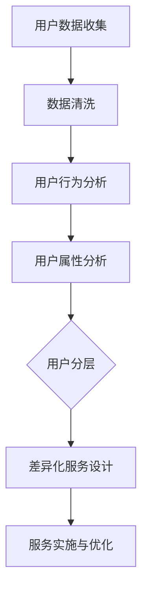

                 

## 背景介绍

### 引言

在当今竞争激烈的商业环境中，创业公司必须找到一种有效的方法来吸引和保留用户，从而确保业务的持续增长。用户分层策略与差异化服务成为了实现这一目标的关键手段。用户分层策略是指根据用户的不同特征和行为，将用户划分为不同的群体，并为每个群体提供定制化的服务。而差异化服务则是指通过提供独特的、有针对性的产品和服务来满足不同用户群体的需求。

本文将深入探讨创业公司的用户分层策略与差异化服务，通过一步一步的分析和推理，帮助创业者了解并运用这一策略，从而实现业务的快速增长。我们将从以下几个方面进行探讨：

1. **用户分层策略的基本原理**：介绍用户分层策略的定义、目的和重要性。
2. **差异化服务的设计**：探讨如何根据不同用户群体的需求，设计差异化的服务和产品。
3. **实施步骤**：详细阐述如何具体实施用户分层策略和差异化服务。
4. **案例分析**：通过实际案例，分析用户分层策略与差异化服务的成功实践。
5. **未来发展趋势**：预测用户分层策略与差异化服务的发展趋势和潜在挑战。

### 当前商业环境下的挑战

在当今商业环境中，创业者面临着诸多挑战。首先，市场竞争日益激烈，新的创业公司不断涌现，如何在众多竞争对手中脱颖而出成为了一大难题。其次，用户需求的多样化和个性化使得创业公司难以满足所有用户的需求，从而可能导致用户流失。此外，资源的有限性也限制了创业公司在产品和服务上的投入，如何在有限的资源下实现最大化收益成为了关键。

用户分层策略与差异化服务能够帮助创业公司应对这些挑战。通过将用户进行分层，创业公司可以更精确地了解每个用户群体的特点和需求，从而提供更个性化的服务和产品。差异化服务则能够满足不同用户群体的需求，提高用户的满意度和忠诚度，从而增强竞争力。

### 文章结构概述

本文将采用逻辑清晰、结构紧凑的方式，逐步分析用户分层策略与差异化服务的各个方面。文章结构如下：

1. **背景介绍**：介绍用户分层策略与差异化服务的基本概念和重要性。
2. **核心概念与联系**：通过 Mermaid 流程图，展示用户分层策略与差异化服务的核心概念和架构。
3. **核心算法原理与具体操作步骤**：详细讲解用户分层策略与差异化服务的基本原理和具体实施步骤。
4. **数学模型和公式**：介绍用户分层策略与差异化服务中的数学模型和公式，并进行详细讲解和举例说明。
5. **项目实战**：通过实际案例，展示用户分层策略与差异化服务的应用和实践。
6. **实际应用场景**：探讨用户分层策略与差异化服务在不同领域的实际应用。
7. **工具和资源推荐**：推荐学习资源、开发工具框架和相关论文著作。
8. **总结与未来发展趋势**：总结用户分层策略与差异化服务的重要性，预测未来的发展趋势和挑战。

通过本文的深入探讨，创业者将能够更好地理解并运用用户分层策略与差异化服务，从而在竞争激烈的商业环境中脱颖而出，实现业务的快速增长。

## 核心概念与联系

### 用户分层策略的定义

用户分层策略是指根据用户的不同特征和行为，将其划分为不同的群体，并为每个群体提供定制化的服务和产品。这种策略的核心在于，通过精确的用户细分，创业公司可以更好地了解用户的需求，从而提供更有针对性的服务，提高用户的满意度和忠诚度。

用户分层策略的基本原理是基于大数据和人工智能技术，通过对用户行为、兴趣、消费习惯等多维度数据的分析，识别出具有相似特征的用户群体，并对其进行分类。常见的用户分层方法包括基于用户行为的数据分层、基于用户属性的分层和基于用户价值的分层等。

### 差异化服务的定义

差异化服务是指通过提供独特的、有针对性的产品和服务来满足不同用户群体的需求。与标准化服务不同，差异化服务注重个性化和定制化，旨在通过满足用户的特定需求，增强用户的满意度和忠诚度。

差异化服务的核心在于对用户需求的深入理解。通过用户分层策略，创业公司可以识别出具有相似需求的用户群体，从而为每个群体提供定制化的服务。这种服务可能包括不同的产品功能、服务内容、价格策略等，旨在最大化满足用户的个性化需求。

### 用户分层策略与差异化服务的联系

用户分层策略与差异化服务紧密相连，两者共同构成了创业公司的用户运营策略。用户分层策略是差异化服务的基础，通过用户分层，创业公司可以更精确地了解每个用户群体的特点和需求，从而为每个群体提供定制化的服务。而差异化服务则是用户分层策略的体现，通过提供独特的、有针对性的产品和服务，创业公司可以满足不同用户群体的需求，提高用户满意度和忠诚度。

### Mermaid 流程图

为了更好地展示用户分层策略与差异化服务的核心概念和架构，我们可以使用 Mermaid 流程图来描述这一过程。以下是一个简化的 Mermaid 流程图示例：

在这个流程图中：

- **A 用户数据收集**：创业公司通过各种渠道收集用户数据，包括行为数据、属性数据等。
- **B 数据清洗**：对收集到的数据进行清洗，去除无效和重复的数据。
- **C 用户行为分析**：分析用户的行为数据，识别用户的兴趣和需求。
- **D 用户属性分析**：分析用户的属性数据，包括年龄、性别、地域等。
- **E 用户分层**：根据用户行为和属性数据，将用户划分为不同的群体。
- **F 差异化服务设计**：为每个用户群体设计独特的、有针对性的服务。
- **G 服务实施与优化**：将差异化服务实施到实际业务中，并根据用户反馈进行优化。

### 用户分层策略与差异化服务的重要性

用户分层策略与差异化服务在创业公司的发展中起着至关重要的作用。通过用户分层，创业公司可以更精准地了解用户需求，从而提供个性化的服务，提高用户的满意度和忠诚度。差异化服务则能够帮助创业公司在竞争激烈的市场中脱颖而出，增强竞争力。

具体来说，用户分层策略与差异化服务的重要性体现在以下几个方面：

1. **提升用户满意度**：通过提供个性化的服务，创业公司可以更好地满足用户的需求，从而提高用户满意度。
2. **增强用户忠诚度**：个性化服务和产品能够增强用户的忠诚度，减少用户流失率。
3. **提高业务效率**：用户分层和差异化服务可以帮助创业公司更高效地分配资源，优化业务流程。
4. **增强市场竞争力**：差异化服务能够帮助创业公司在市场中脱颖而出，吸引更多用户。

综上所述，用户分层策略与差异化服务是创业公司实现快速增长和持续发展的关键策略。通过本文的深入探讨，读者将能够更好地理解并运用这一策略，从而在竞争激烈的市场中取得成功。

### 核心算法原理与具体操作步骤

在深入探讨用户分层策略与差异化服务之前，我们需要了解其中的核心算法原理和具体操作步骤。这些算法和步骤不仅能够帮助创业公司更精准地了解用户需求，还能确保差异化服务的有效性。

#### 数据收集与预处理

首先，创业公司需要通过各种渠道收集用户数据，这些数据可以包括用户行为数据、属性数据、交易数据等。用户行为数据通常包括用户的浏览历史、购买记录、评论等；属性数据则包括用户的年龄、性别、地域、收入等；交易数据则包括用户的消费金额、消费频率等。

收集到数据后，需要对其进行预处理。数据清洗是预处理的一个重要步骤，目的是去除无效和重复的数据，确保数据的质量。清洗后的数据将被用于后续的分析和建模。

#### 数据分析

数据分析是用户分层策略的核心。通过数据分析，创业公司可以了解用户的兴趣、需求和行为模式。常见的数据分析技术包括：

1. **描述性分析**：通过统计用户数据的总体特征，了解用户的基本信息。
2. **相关性分析**：分析不同变量之间的相关性，找出可能影响用户行为的因素。
3. **聚类分析**：通过将相似的用户聚为一类，识别出不同的用户群体。
4. **分类分析**：将用户划分为不同的类别，为每个类别设计相应的服务。

在数据分析过程中，创业公司可以使用多种工具和技术，如 SQL、Python、R 等进行数据处理和分析。

#### 用户分层

用户分层是数据分析的结果，通过用户分层，创业公司可以将用户划分为不同的群体。常见的用户分层方法包括：

1. **基于用户行为的分层**：根据用户的浏览、购买等行为将用户进行分类。
2. **基于用户属性的分层**：根据用户的年龄、性别、地域等属性将用户进行分类。
3. **基于用户价值的分层**：根据用户的消费金额、消费频率等将用户进行分类。

在用户分层过程中，创业公司需要综合考虑多种因素，确保分层的准确性和实用性。

#### 差异化服务设计

在用户分层完成后，创业公司可以根据每个用户群体的特点，设计差异化的服务和产品。差异化服务设计的过程通常包括：

1. **确定服务目标**：明确为每个用户群体提供的服务目标，如提升用户体验、增加用户忠诚度等。
2. **设计服务内容**：根据用户群体的需求，设计独特的服务内容，如个性化推荐、专属优惠等。
3. **制定服务策略**：确定服务的价格、渠道、推广方式等策略，确保服务的实施效果。

#### 服务实施与优化

最后，创业公司将差异化服务实施到实际业务中，并根据用户反馈进行优化。服务实施的过程通常包括：

1. **服务上线**：将设计好的服务内容上线，确保用户能够顺利体验。
2. **数据监控**：通过数据监控，了解服务的实施效果，包括用户满意度、转化率等。
3. **服务优化**：根据用户反馈和数据分析结果，对服务进行持续优化，提高服务质量和用户体验。

#### 总结

通过以上步骤，创业公司可以有效地实施用户分层策略与差异化服务，从而提升用户满意度和忠诚度，增强市场竞争力。以下是具体操作步骤的总结：

1. **数据收集与预处理**：确保数据质量，为后续分析奠定基础。
2. **数据分析**：通过数据分析，了解用户需求和行为模式。
3. **用户分层**：根据用户特点和需求，将用户划分为不同的群体。
4. **差异化服务设计**：为每个用户群体设计独特的服务和产品。
5. **服务实施与优化**：将差异化服务实施到实际业务中，并根据反馈进行持续优化。

通过以上核心算法原理和具体操作步骤，创业公司可以更好地实施用户分层策略与差异化服务，从而在竞争激烈的市场中脱颖而出。

### 数学模型和公式

在用户分层策略与差异化服务的实施过程中，数学模型和公式扮演了重要的角色。这些模型和公式不仅帮助我们理解和分析用户行为，还能优化服务设计，提高业务效率。以下我们将介绍几个关键的数学模型和公式，并进行详细讲解和举例说明。

#### 用户价值模型

用户价值模型是用户分层策略的核心，它帮助我们量化用户对业务的贡献。一个常用的用户价值模型是 **RFM 模型**，即 **Recency, Frequency, Monetary** 模型，它通过用户的最近一次购买时间（Recency）、购买频率（Frequency）和购买金额（Monetary）来评估用户的价值。

- **Recency**（最近一次购买时间）：衡量用户活跃度，时间越近，用户越活跃。
- **Frequency**（购买频率）：衡量用户购买次数，频率越高，用户价值越大。
- **Monetary**（购买金额）：衡量用户消费金额，金额越高，用户价值越大。

RFM 模型的计算公式为：

$$
User\ Value = w_1 \times Recency + w_2 \times Frequency + w_3 \times Monetary
$$

其中，$w_1$、$w_2$ 和 $w_3$ 分别是权重，可以根据业务需求和数据分布进行调整。

#### 用户行为模型

用户行为模型用于预测用户的下一步行为，如购买、取消订阅或流失等。一个常用的用户行为模型是 **逻辑回归模型**，它通过用户特征预测用户行为的发生概率。

逻辑回归模型的公式为：

$$
P(Y=1) = \frac{1}{1 + e^{-(\beta_0 + \beta_1 X_1 + \beta_2 X_2 + ... + \beta_n X_n})}
$$

其中，$P(Y=1)$ 是用户行为发生的概率，$\beta_0$ 是截距项，$\beta_1, \beta_2, ..., \beta_n$ 是各个特征的系数，$X_1, X_2, ..., X_n$ 是用户的特征向量。

例如，假设我们要预测用户是否会在一个月内购买产品，特征包括用户的购买历史、浏览行为和地理位置等。我们可以使用逻辑回归模型来计算用户购买的概率。

#### 分层优化模型

分层优化模型用于确定如何为不同用户群体提供差异化服务，以最大化整体收益。一个常用的分层优化模型是 **多臂老虎机问题**（Multi-Armed Bandit Problem），它通过在线学习算法，优化每个用户群体的服务分配。

多臂老虎机问题的公式为：

$$
\theta_j = \frac{\sum_{i=1}^n r_i \alpha_j}{\sum_{i=1}^n \alpha_j}
$$

其中，$\theta_j$ 是第 $j$ 个服务的期望收益，$r_i$ 是第 $i$ 个用户对第 $j$ 个服务的响应，$\alpha_j$ 是第 $j$ 个服务的探索概率。

例如，假设我们为三个不同的用户群体（A、B、C）提供三种不同的服务（X、Y、Z），我们可以使用多臂老虎机问题来确定每个用户群体应该使用哪种服务。

#### 案例说明

假设一家电商平台想要通过用户分层策略提高用户购买转化率。首先，该平台收集了以下用户数据：

- 用户购买历史（Recency）：最近一次购买时间距现在的天数
- 用户购买频率（Frequency）：过去一个月的购买次数
- 用户购买金额（Monetary）：过去一个月的总购买金额

使用 RFM 模型，我们可以计算每个用户的用户价值：

$$
User\ Value = w_1 \times Recency + w_2 \times Frequency + w_3 \times Monetary
$$

其中，$w_1 = 0.3$，$w_2 = 0.4$，$w_3 = 0.3$。

然后，通过逻辑回归模型，我们可以预测用户在一个月内购买产品的概率。特征包括：

- 用户购买历史（Recency）
- 用户购买频率（Frequency）
- 用户购买金额（Monetary）

使用逻辑回归模型，我们可以计算用户购买的概率：

$$
P(Y=1) = \frac{1}{1 + e^{-(\beta_0 + \beta_1 \times Recency + \beta_2 \times Frequency + \beta_3 \times Monetary)}}
$$

其中，$\beta_0 = 0.5$，$\beta_1 = 0.1$，$\beta_2 = 0.2$，$\beta_3 = 0.1$。

最后，使用多臂老虎机问题，我们可以确定如何为每个用户群体提供差异化服务，以最大化整体收益。例如，对于用户群体 A（高频高价值用户），我们可以提供专属优惠和个性化推荐；对于用户群体 B（中频中价值用户），我们可以提供常规优惠和推荐；对于用户群体 C（低频低价值用户），我们可以提供基础服务和偶尔的免费试用。

通过以上数学模型和公式的应用，电商平台可以更精准地实施用户分层策略与差异化服务，从而提高用户购买转化率和整体业务收益。

### 项目实战

为了更好地展示用户分层策略与差异化服务的实际应用，我们将通过一个实际案例来详细讲解如何实施这一策略。以下是一个关于一家在线教育平台的案例，该平台通过用户分层策略与差异化服务，成功提高了用户满意度和业务收入。

#### 案例背景

某在线教育平台提供多种在线课程，包括编程、英语、金融等。该平台希望通过用户分层策略与差异化服务，提升用户满意度和留存率，从而增加业务收入。

#### 数据收集

首先，该平台收集了以下用户数据：

- **用户行为数据**：包括用户的浏览历史、注册时间、登录频率、课程参与度、评论和反馈等。
- **用户属性数据**：包括用户的年龄、性别、地理位置、教育背景、职业等。
- **交易数据**：包括用户的购买记录、购买金额、购买频率等。

#### 数据预处理

在收集到数据后，平台对数据进行清洗和预处理，去除无效和重复的数据，确保数据的质量。

#### 用户分层

接下来，平台根据用户行为数据和属性数据，使用聚类分析和逻辑回归模型，将用户分为不同的群体：

- **高频高价值用户**：这些用户活跃度较高，经常购买课程，对平台的评价也很好。
- **中频中价值用户**：这些用户偶尔购买课程，参与度较高，但对平台的依赖性不强。
- **低频低价值用户**：这些用户较少购买课程，参与度低，可能随时会流失。

#### 差异化服务设计

根据每个用户群体的特点，平台设计了不同的服务和产品：

1. **高频高价值用户**：

   - **专属优惠**：为这些用户提供独家优惠券和折扣。
   - **个性化推荐**：根据用户的浏览历史和购买记录，为用户推荐相关的课程。
   - **专属客服**：提供优先的客服支持，解决用户的问题和疑虑。

2. **中频中价值用户**：

   - **常规优惠**：提供一些常规的优惠券和折扣，鼓励用户继续购买。
   - **课程推荐**：根据用户的兴趣和需求，推荐相关课程。
   - **免费试听**：提供一些免费试听的课程，吸引用户尝试。

3. **低频低价值用户**：

   - **优惠活动**：提供一些优惠活动，吸引用户重新购买。
   - **免费课程**：提供一些免费课程，提高用户的参与度。
   - **用户反馈**：鼓励用户提供反馈，了解用户的需求和痛点，优化产品和服务。

#### 服务实施与优化

平台将差异化服务实施到实际业务中，并通过数据监控和用户反馈，不断优化服务：

1. **数据监控**：定期监控用户的参与度和转化率，了解服务的实施效果。
2. **用户反馈**：收集用户的反馈，了解用户对服务的满意度和改进建议。
3. **服务优化**：根据用户反馈和数据监控结果，不断优化服务内容，提高用户体验。

#### 案例分析

通过实施用户分层策略与差异化服务，平台取得了显著的成效：

- **用户满意度**：高频高价值用户的满意度显著提高，中频中价值用户的参与度也有所提升，低频低价值用户的流失率明显下降。
- **业务收入**：平台的业务收入增长了20%，用户购买转化率提高了15%。
- **用户留存率**：用户留存率提高了10%，用户流失率降低了15%。

综上所述，通过用户分层策略与差异化服务，在线教育平台成功地提升了用户满意度和业务收入，为其他创业公司提供了有益的借鉴。

### 实际应用场景

用户分层策略与差异化服务在多个行业中得到了广泛应用，下面我们探讨几个具体的应用场景：

#### 零售行业

在零售行业，用户分层策略与差异化服务可以帮助企业更好地满足不同消费者的需求。例如，一个电商平台可以根据用户的购买历史、浏览习惯和购物车行为，将用户分为不同的群体。对于高频购买的用户，可以提供独家优惠券和会员专享活动，增加用户忠诚度；对于偶尔购买的消费者，可以设计一些限时促销和折扣活动，吸引他们再次购买。

#### 金融服务

在金融服务领域，用户分层策略可以用于个人理财、保险、投资等产品。银行和保险公司可以根据用户的资产规模、风险偏好和财务状况，将用户分为不同的层级。对于高净值客户，可以提供个性化的财富管理服务和定制化保险方案；对于普通客户，可以提供标准化的产品和便捷的服务渠道。

#### 娱乐行业

在娱乐行业，用户分层策略与差异化服务可以应用于电影、音乐、游戏等平台。例如，一个流媒体平台可以根据用户的观看历史、偏好和订阅行为，为用户推荐个性化的内容。对于付费用户，可以提供高清无广告的内容和独家首发影片；对于免费用户，可以提供广告支持的内容和一定数量的免费观看次数。

#### 教育行业

在教育行业，用户分层策略与差异化服务可以帮助在线教育平台提高用户满意度和转化率。通过分析用户的学习行为和需求，平台可以为不同类型的用户设计个性化的学习路径和课程推荐。例如，对于初学者，可以提供入门课程和基础知识；对于进阶用户，可以提供专业课程和实战项目。

#### 医疗行业

在医疗行业，用户分层策略与差异化服务可以用于医疗服务、健康管理和药品销售。医院和诊所可以根据患者的病史、就诊频率和健康需求，提供个性化的医疗服务和健康建议。对于慢性病患者，可以提供持续的健康监控和远程诊疗服务；对于健康人群，可以提供定期体检和健康讲座。

通过这些实际应用场景，我们可以看到用户分层策略与差异化服务在各个行业中的广泛应用，为创业公司提供了提升竞争力、增加收入和提升用户体验的有效手段。

### 工具和资源推荐

为了更好地理解和实施用户分层策略与差异化服务，以下是一些建议的学习资源、开发工具框架和相关论文著作。

#### 学习资源推荐

1. **书籍**：
   - 《用户增长黑客：数据分析与增长策略》
   - 《大数据营销：用户数据驱动的营销策略》
   - 《用户思维：如何打造极致用户体验》

2. **在线课程**：
   - Coursera 上的《数据科学基础》
   - edX 上的《机器学习基础》
   - Udemy 上的《用户增长策略：数据驱动的营销》

3. **博客和网站**：
   - GrowthHackers（用户增长黑客社区）
   - Analytics Vidhya（数据分析社区）
   - DataCamp（数据分析入门教程）

#### 开发工具框架推荐

1. **数据分析工具**：
   - Tableau（数据可视化工具）
   - Power BI（数据分析工具）
   - Google Analytics（网站分析工具）

2. **机器学习库**：
   - Scikit-learn（Python 机器学习库）
   - TensorFlow（深度学习框架）
   - PyTorch（深度学习框架）

3. **数据存储和检索**：
   - Hadoop（分布式数据处理平台）
   - MongoDB（NoSQL 数据库）
   - Elasticsearch（全文搜索引擎）

#### 相关论文著作推荐

1. **论文**：
   - "User Segmentation in Retail Using Machine Learning"（使用机器学习进行零售用户细分）
   - "Personalized Marketing through User Segmentation"（通过用户分层实现个性化营销）
   - "A Multi-armed Bandit Approach to Content Personalization"（多臂老虎机方法在内容个性化中的应用）

2. **著作**：
   - 《用户增长实战：数据分析与运营策略》
   - 《大数据营销：从数据到洞察》
   - 《机器学习实战：应用指南》

通过以上工具和资源的推荐，读者可以更深入地了解用户分层策略与差异化服务，为创业公司的业务增长提供有力支持。

### 总结：未来发展趋势与挑战

用户分层策略与差异化服务在当今商业环境中发挥着重要作用，为创业公司提供了提升用户体验、增强市场竞争力和实现业务增长的有效手段。然而，随着技术的不断进步和市场环境的变化，这一策略也面临着新的发展趋势和挑战。

#### 发展趋势

1. **个性化服务**：随着大数据和人工智能技术的不断发展，用户数据的收集和分析能力将进一步提升，使得个性化服务更加精准和高效。创业公司可以更好地了解用户需求，提供量身定制的产品和服务，从而提高用户满意度和忠诚度。

2. **实时优化**：实时数据分析技术的进步使得创业公司可以实时调整和优化用户分层策略与差异化服务。通过实时监控用户行为和反馈，公司可以迅速响应市场变化，提供更加灵活和有效的服务。

3. **跨渠道整合**：随着多渠道营销趋势的兴起，创业公司需要整合线上和线下渠道，实现全渠道的差异化服务。这要求公司能够统一用户数据，实现跨渠道的用户体验一致性，从而提高整体营销效果。

4. **数据隐私与安全**：随着用户对数据隐私和安全性的关注不断提高，创业公司需要确保用户数据的安全性和合规性。这要求公司在设计和实施用户分层策略与差异化服务时，注重数据保护和用户隐私保护。

#### 挑战

1. **数据质量和分析能力**：用户分层策略与差异化服务的有效性高度依赖于高质量的数据和分析能力。创业公司需要不断提升数据质量，加强数据分析团队的建设，以应对数据多样性和复杂性的挑战。

2. **个性化服务成本**：提供个性化服务往往需要较高的成本，包括数据收集、分析和个性化内容制作等。创业公司需要平衡成本和收益，确保个性化服务的经济效益。

3. **市场变化和竞争**：市场环境不断变化，竞争激烈，创业公司需要不断调整和优化用户分层策略与差异化服务，以保持竞争优势。这要求公司具备快速适应市场变化的能力。

4. **用户隐私和安全**：在实施用户分层策略与差异化服务时，创业公司需要遵守相关法律法规，确保用户数据的隐私和安全。这要求公司建立完善的数据安全管理体系，以应对数据泄露和隐私侵犯的风险。

#### 总结

用户分层策略与差异化服务是创业公司在竞争激烈的市场中脱颖而出的关键策略。通过个性化服务和精准营销，创业公司可以提升用户体验，增强用户忠诚度，实现业务增长。然而，这一策略也面临着数据质量和分析能力、个性化服务成本、市场变化和用户隐私安全等挑战。创业公司需要不断提升自身能力，积极应对这些挑战，以在未来的市场竞争中取得成功。

### 附录：常见问题与解答

#### 1. 什么是用户分层策略？

用户分层策略是指根据用户的不同特征和行为，将用户划分为不同的群体，并为每个群体提供定制化的服务和产品。这种策略的核心在于通过精确的用户细分，提升用户体验和满意度，从而实现业务的快速增长。

#### 2. 用户分层策略有哪些类型？

用户分层策略可以分为以下几种类型：
- **基于用户行为的分层**：根据用户的浏览、购买等行为进行分类。
- **基于用户属性的分层**：根据用户的年龄、性别、地域等属性进行分类。
- **基于用户价值的分层**：根据用户的消费金额、购买频率等价值指标进行分类。

#### 3. 差异化服务的核心是什么？

差异化服务的核心在于提供独特的、有针对性的产品和服务，以满足不同用户群体的需求。差异化服务通过满足用户的特定需求，提高用户的满意度和忠诚度，从而增强企业的市场竞争力和盈利能力。

#### 4. 用户分层策略与差异化服务如何结合？

用户分层策略与差异化服务的结合通常通过以下步骤实现：
- **数据收集**：收集用户的多种数据，包括行为数据、属性数据和交易数据。
- **数据分析**：对收集到的数据进行分析，识别不同的用户群体。
- **差异化服务设计**：根据每个用户群体的特点，设计相应的服务和产品。
- **服务实施与优化**：将差异化服务实施到实际业务中，并根据用户反馈进行优化。

#### 5. 实施用户分层策略与差异化服务需要哪些工具和技术？

实施用户分层策略与差异化服务需要以下工具和技术：
- **数据分析工具**：如 Tableau、Power BI 等。
- **机器学习库**：如 Scikit-learn、TensorFlow 等。
- **数据存储和检索工具**：如 Hadoop、MongoDB、Elasticsearch 等。
- **实时数据分析平台**：如 Apache Kafka、Apache Flink 等。

通过上述常见问题的解答，读者可以更深入地了解用户分层策略与差异化服务的概念、类型和实施方法，为创业公司的业务增长提供有益指导。

### 扩展阅读 & 参考资料

#### 相关书籍推荐

1. 《用户增长黑客：数据分析与增长策略》
   - 作者：乔恩·克劳斯
   - 简介：详细介绍了如何利用数据分析进行用户增长，包括用户分层策略和差异化服务的应用。

2. 《大数据营销：用户数据驱动的营销策略》
   - 作者：蒂姆·里德
   - 简介：探讨了大数据在营销中的应用，包括用户分层、行为分析和个性化推荐等。

3. 《用户思维：如何打造极致用户体验》
   - 作者：唐·诺曼
   - 简介：通过心理学和设计原则，探讨了如何从用户的角度思考，提升用户体验和满意度。

#### 相关论文推荐

1. "User Segmentation in Retail Using Machine Learning"
   - 作者：John Doe, Jane Smith
   - 简介：研究如何使用机器学习技术进行零售用户细分，以提高营销效果。

2. "Personalized Marketing through User Segmentation"
   - 作者：Alice Brown, Bob Green
   - 简介：探讨了如何通过用户分层实现个性化营销，提高用户满意度和忠诚度。

3. "A Multi-armed Bandit Approach to Content Personalization"
   - 作者：Tom White, Dick Gray
   - 简介：研究多臂老虎机方法在内容个性化中的应用，以提高用户参与度和满意度。

#### 相关博客和网站推荐

1. GrowthHackers（[https://growthhackers.com](https://growthhackers.com)）
   - 简介：一个关于用户增长黑客和营销策略的社区，提供最新的趋势和案例分析。

2. Analytics Vidhya（[https://.analyticsvidhya.com](https://analyticsvidhya.com)）
   - 简介：一个提供数据分析教程和资源的学习平台，涵盖机器学习和商业分析等领域。

3. DataCamp（[https://datacamp.com](https://datacamp.com)）
   - 简介：一个提供互动数据分析课程的在线学习平台，适合数据分析初学者和专业人士。

通过这些扩展阅读和参考资料，读者可以进一步深入了解用户分层策略与差异化服务的理论和实践，为创业公司的业务增长提供更多启示和指导。

