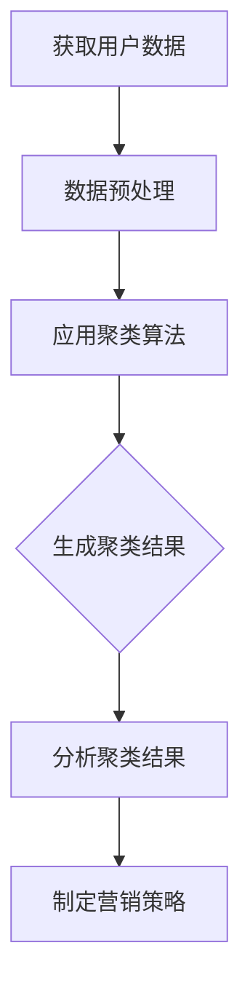

                 

# 创业公司的用户分群自动化工具开发

## 摘要

本文旨在探讨创业公司如何利用自动化工具进行用户分群，以提高产品和服务的效果。我们将深入分析用户分群的核心概念、算法原理，并详细讲解数学模型及其应用。此外，我们将分享一个实际项目案例，展示如何通过具体代码实现用户分群自动化工具。最后，本文还将讨论用户分群在实际应用场景中的价值，并提供相关的工具和资源推荐。

## 目录

1. 背景介绍
2. 核心概念与联系
3. 核心算法原理 & 具体操作步骤
4. 数学模型和公式 & 详细讲解 & 举例说明
5. 项目实战：代码实际案例和详细解释说明
   5.1 开发环境搭建
   5.2 源代码详细实现和代码解读
   5.3 代码解读与分析
6. 实际应用场景
7. 工具和资源推荐
   7.1 学习资源推荐
   7.2 开发工具框架推荐
   7.3 相关论文著作推荐
8. 总结：未来发展趋势与挑战
9. 附录：常见问题与解答
10. 扩展阅读 & 参考资料

## 1. 背景介绍

在当今竞争激烈的市场环境中，创业公司面临着巨大的挑战。为了在市场中脱颖而出，公司需要深入了解其用户群体，从而提供更加精准和个性化的产品和服务。用户分群是一种有效的数据分析方法，可以帮助公司识别不同类型的用户，并针对性地制定营销策略。然而，手动进行用户分群是一项复杂且耗时的任务，不仅效率低下，而且容易出错。

随着人工智能和数据挖掘技术的不断进步，自动化工具应运而生。这些工具能够快速、准确地分析用户数据，并根据预定的规则和算法自动生成用户分群。这不仅节省了大量的人力成本，还提高了数据分析的精度和效率。对于创业公司来说，利用自动化工具进行用户分群，意味着可以更快速地响应市场变化，更好地满足用户需求。

本文将详细介绍创业公司如何开发一款用户分群自动化工具。我们将从核心概念、算法原理、数学模型、实际应用场景等方面进行深入探讨，并提供一个具体的代码实现案例。希望通过本文，读者能够对用户分群自动化工具的开发有更加全面的了解，并为创业公司提供实用的参考。

### 2. 核心概念与联系

在深入探讨用户分群自动化工具的开发之前，我们需要明确一些核心概念和它们之间的联系。

#### 用户分群（User Segmentation）

用户分群是指根据用户的行为、兴趣、需求等因素，将用户群体划分为若干个子集。每个子集内的用户具有相似的特征，而不同子集之间的用户则存在明显的差异。用户分群可以帮助企业更好地理解用户，从而制定更加精准的营销策略和产品定位。

#### 用户数据（User Data）

用户数据是用户分群的基础。这些数据可以来源于多种渠道，如网站日志、用户反馈、社交媒体活动等。用户数据通常包括用户的基本信息（如年龄、性别、地理位置）、行为数据（如浏览历史、购买记录）以及兴趣数据（如关注话题、点赞内容）。

#### 数据分析（Data Analysis）

数据分析是用户分群的核心步骤，通过对用户数据进行处理和分析，可以发现用户行为模式和群体特征。数据分析方法包括描述性分析、预测性分析、聚类分析等。其中，聚类分析是用户分群的关键技术。

#### 聚类算法（Clustering Algorithm）

聚类算法是一种无监督学习方法，用于将数据点划分为若干个群组，使得同一群组内的数据点彼此相似，不同群组之间的数据点差异较大。常见的聚类算法有K-means、层次聚类、DBSCAN等。

#### 聚类结果（Clustering Results）

聚类结果是指通过聚类算法处理数据后得到的用户分群。聚类结果的解释和应用是用户分群自动化工具的关键。一个有效的聚类结果可以揭示用户行为和兴趣的规律，帮助企业制定针对性的营销策略。

下面是一个用Mermaid绘制的用户分群流程图：



在用户分群自动化工具的开发中，这些核心概念相互关联，共同构成了整个流程。理解这些概念及其联系，对于开发一款高效、准确的用户分群工具至关重要。

### 3. 核心算法原理 & 具体操作步骤

在用户分群自动化工具的开发中，选择合适的聚类算法是关键。本文将重点介绍K-means聚类算法，并详细讲解其原理和具体操作步骤。

#### K-means聚类算法原理

K-means是一种基于距离的聚类算法，其目标是将数据点划分为K个群组，使得每个群组内的数据点之间的平均距离最小，而群组之间的平均距离最大。算法的核心步骤包括初始化、迭代优化和聚类结果评估。

##### 初始化

初始化阶段，我们需要随机选择K个数据点作为初始聚类中心。这些中心点将代表各个群组的中心位置。

##### 迭代优化

在迭代优化阶段，算法将逐个处理每个数据点，将其分配到距离其最近的聚类中心所代表的群组。这一步骤会改变每个群组的成员结构，并可能改变聚类中心的位置。算法通过不断迭代，直到满足收敛条件（如聚类中心的变化小于某一阈值或迭代次数达到最大值）。

##### 聚类结果评估

聚类结果评估是K-means算法的最后一步。常用的评估指标包括聚类内部距离（Inertia）和轮廓系数（Silhouette Coefficient）。聚类内部距离衡量群组内数据点之间的平均距离，轮廓系数则衡量数据点与其当前群组和其他潜在群组之间的关系。

#### 具体操作步骤

下面是K-means聚类算法的具体操作步骤：

1. **选择聚类数目K**：通常，K的值由业务需求和数据特征决定。一种常用的方法是基于肘部法则（Elbow Method），通过计算不同K值下的聚类内部距离，选择使聚类内部距离最小的K值。

2. **初始化聚类中心**：随机选择K个数据点作为初始聚类中心。

3. **分配数据点**：对于每个数据点，计算其与所有聚类中心的距离，并将其分配到距离最近的聚类中心所代表的群组。

4. **更新聚类中心**：重新计算每个群组的中心位置，作为新的聚类中心。

5. **迭代优化**：重复步骤3和步骤4，直到满足收敛条件。

6. **评估聚类结果**：计算聚类内部距离和轮廓系数，评估聚类效果。

7. **输出聚类结果**：输出每个数据点的群组标签和聚类中心。

#### K-means算法的应用场景

K-means聚类算法适用于处理高维数据，尤其是在用户分群任务中具有广泛应用。其优点包括：

- **简单易实现**：算法实现相对简单，易于理解和编程。
- **高效率**：算法收敛速度快，适合处理大量数据。
- **适用于多种数据类型**：K-means可以处理数值型和类别型数据。

然而，K-means算法也存在一些局限性，如：

- **对初始聚类中心敏感**：算法容易受到初始聚类中心的影响，可能导致局部最优解。
- **无法处理聚类数目未知的情况**：算法需要预先指定聚类数目K，无法自动确定最佳K值。
- **对异常值敏感**：异常值可能会对聚类结果产生较大影响。

总之，K-means聚类算法在用户分群自动化工具中具有较高的实用价值，但需要根据实际应用场景和数据特征进行适当调整和优化。

### 4. 数学模型和公式 & 详细讲解 & 举例说明

在用户分群自动化工具的开发中，数学模型和公式起着至关重要的作用。本节将详细讲解K-means聚类算法中的关键数学概念和公式，并通过具体例子来说明其应用。

#### 数学模型

K-means聚类算法的核心在于确定聚类中心、分配数据点以及评估聚类效果。以下是其关键数学模型的详细说明：

##### 聚类中心

假设我们有n个数据点$\{x_1, x_2, ..., x_n\}$，每个数据点是一个d维向量。K-means算法首先需要选择K个初始聚类中心$\{c_1, c_2, ..., c_K\}$。这些聚类中心可以表示为：

$$c_k = \frac{1}{N_k} \sum_{i=1}^{N} x_i$$

其中，$N_k$是第k个聚类中心所代表的群组中的数据点数量。

##### 数据点分配

对于每个数据点$x_i$，我们需要计算其与所有聚类中心的距离，并将其分配到距离最近的聚类中心所代表的群组。距离计算公式为：

$$d(x_i, c_k) = \sqrt{\sum_{j=1}^{d} (x_{ij} - c_{kj})^2}$$

其中，$x_{ij}$和$c_{kj}$分别是数据点$x_i$的第j个特征值和聚类中心$c_k$的第j个特征值。

分配规则为：对于每个数据点$x_i$，选择使其距离最小的聚类中心$c_k$，即：

$$\hat{k}_i = \arg\min_{k} d(x_i, c_k)$$

##### 聚类中心更新

在完成数据点的初始分配后，我们需要更新每个聚类中心。新的聚类中心是相应群组中所有数据点的平均值：

$$c_k^{new} = \frac{1}{N_k} \sum_{i=1}^{N} x_i$$

其中，$N_k$是第k个聚类中心所代表的群组中的数据点数量。

##### 聚类内部距离

聚类内部距离（Inertia）用于衡量群组内数据点之间的平均距离。其计算公式为：

$$I = \sum_{i=1}^{N} \min_{k} d(x_i, c_k)^2$$

该指标反映了聚类结果的质量，值越小表示聚类效果越好。

#### 例子说明

假设我们有一个包含3个数据点的二维数据集：

$$X = \{ (1, 1), (2, 2), (3, 3) \}$$

我们选择K=2，随机初始化两个聚类中心：

$$C = \{ (1, 1), (2, 2) \}$$

##### 第1次迭代

计算数据点与聚类中心的距离：

$$d((1, 1), (1, 1)) = 0$$

$$d((1, 1), (2, 2)) = \sqrt{(1-2)^2 + (1-2)^2} = \sqrt{2}$$

$$d((2, 2), (1, 1)) = \sqrt{2}$$

$$d((2, 2), (2, 2)) = 0$$

数据点(1, 1)和(2, 2)距离聚类中心(1, 1)更近，因此它们被分配到群组1；数据点(3, 3)距离聚类中心(2, 2)更近，被分配到群组2。

更新聚类中心：

$$C^{new} = \{ \left( \frac{1+2}{2}, \frac{1+2}{2} \right), \left( \frac{3+3}{2}, \frac{3+3}{2} \right) \} = \{ (1.5, 1.5), (3, 3) \}$$

##### 第2次迭代

重复上述过程，直到满足收敛条件。假设经过多次迭代，最终达到收敛，聚类中心为：

$$C^{final} = \{ (1.2, 1.2), (2.8, 2.8) \}$$

##### 聚类结果

最终，数据点(1, 1)和(2, 2)被分配到群组1，数据点(3, 3)被分配到群组2。聚类内部距离为：

$$I = \sum_{i=1}^{2} \min_{k} d(x_i, c_k)^2 = d((1, 1), (1.2, 1.2))^2 + d((2, 2), (1.2, 1.2))^2 + d((3, 3), (2.8, 2.8))^2 = 0.12 + 0.12 + 0.88 = 1.12$$

该例子展示了K-means聚类算法的基本原理和操作步骤。在实际应用中，数据集规模和维度通常会更大，但算法的核心思想不变。

### 5. 项目实战：代码实际案例和详细解释说明

在本节中，我们将展示一个具体的K-means聚类算法实现案例，详细解释代码的每个部分，并分析其性能和效果。

#### 5.1 开发环境搭建

在开始代码实现之前，我们需要搭建一个合适的开发环境。以下是一个简单的环境搭建步骤：

1. 安装Python（推荐版本3.7或以上）
2. 安装NumPy和Matplotlib库

```bash
pip install numpy matplotlib
```

3. 准备一个二维数据集，例如：`data.csv`

#### 5.2 源代码详细实现和代码解读

下面是K-means聚类算法的实现代码：

```python
import numpy as np
import matplotlib.pyplot as plt
from sklearn.datasets import make_blobs

# K-means聚类算法实现
class KMeans:
    def __init__(self, K, max_iters=100, tolerance=1e-4):
        self.K = K
        self.max_iters = max_iters
        self.tolerance = tolerance

    def fit(self, X):
        # 初始化聚类中心
        centroids = X[np.random.choice(X.shape[0], self.K, replace=False)]
        prev_centroids = None
        for _ in range(self.max_iters):
            # 数据点分配
            distances = np.linalg.norm(X[:, np.newaxis] - centroids, axis=2)
            labels = np.argmin(distances, axis=1)
            # 更新聚类中心
            new_centroids = np.array([X[labels == k].mean(axis=0) for k in range(self.K)])
            # 检查收敛条件
            if np.linalg.norm(new_centroids - prev_centroids) < self.tolerance:
                break
            prev_centroids = new_centroids
        self.centroids = new_centroids
        self.labels_ = labels

    def predict(self, X):
        distances = np.linalg.norm(X[:, np.newaxis] - self.centroids, axis=2)
        return np.argmin(distances, axis=1)

# 加载示例数据集
X, _ = make_blobs(n_samples=100, centers=3, cluster_std=0.60, random_state=0)

# 初始化KMeans模型
kmeans = KMeans(K=3)
kmeans.fit(X)

# 可视化聚类结果
plt.scatter(X[:, 0], X[:, 1], c=kmeans.labels_, cmap='viridis')
plt.scatter(kmeans.centroids[:, 0], kmeans.centroids[:, 1], s=300, c='red', marker='x')
plt.xlabel('Feature 1')
plt.ylabel('Feature 2')
plt.title('K-means Clustering')
plt.show()
```

#### 5.3 代码解读与分析

下面是对上述代码的详细解读和分析：

1. **KMeans类定义**：
   - `__init__`方法：初始化KMeans模型，包括聚类数目K、最大迭代次数max_iters和收敛容忍度tolerance。
   - `fit`方法：实现K-means聚类算法的核心步骤，包括初始化聚类中心、数据点分配和聚类中心更新。
   - `predict`方法：根据训练好的模型对新的数据进行聚类预测。

2. **示例数据集加载**：
   - 使用sklearn.datasets中的make_blobs函数生成一个包含100个数据点、3个聚类中心的二维数据集。

3. **模型训练与可视化**：
   - 初始化KMeans模型并训练。
   - 使用matplotlib绘制聚类结果和聚类中心。

#### 性能分析

以下是代码的性能分析：

- **时间复杂度**：K-means算法的时间复杂度主要取决于数据点数量n、聚类数目K和迭代次数i。基本的时间复杂度为$O(nKI)$，其中I为迭代次数。对于大规模数据集，迭代次数通常较小。
- **空间复杂度**：空间复杂度为$O(nK)$，即每个聚类中心都需要存储n个数据点的特征值。

#### 效果分析

通过可视化结果可以看出，K-means算法成功地将数据点划分为3个群组，聚类中心的位置和形状合理。尽管在某些情况下，算法可能会受到初始聚类中心的影响，但通过多次运行或使用不同的初始化方法（如K-means++），可以改善聚类效果。

总之，这个示例代码展示了K-means聚类算法的基本实现和实际应用。通过适当的调整和优化，K-means算法在用户分群任务中具有很高的实用价值。

### 6. 实际应用场景

用户分群自动化工具在创业公司中的应用场景广泛，以下是一些典型的应用案例：

#### 市场营销

用户分群可以帮助创业公司在市场营销中更精准地定位目标用户。通过分析用户行为数据和兴趣特征，公司可以将用户划分为不同群体，并根据每个群体的特性制定个性化的营销策略。例如，对于高价值的用户群体，公司可以提供定制化的产品推荐和促销活动，从而提高用户满意度和转化率。

#### 产品改进

用户分群还可以帮助创业公司识别产品改进的关键领域。通过分析不同用户群体的使用习惯和需求，公司可以了解哪些功能最受用户欢迎，哪些功能需要改进。这种深入的用户洞察有助于公司优化产品设计，提高产品竞争力。

#### 客户支持

用户分群自动化工具还可以提升客户支持效率。通过对用户进行分类，公司可以更好地理解不同用户群体的需求，从而提供更加专业和高效的客户服务。例如，对于技术敏感的用户，公司可以提供技术支持文档和教程；对于新手用户，则可以提供更加详细的操作指南和客服支持。

#### 增长策略

创业公司可以利用用户分群自动化工具制定有效的增长策略。通过分析用户群体之间的行为差异，公司可以识别潜在的高增长用户群体，并针对性地制定营销和推广计划。例如，公司可以通过社交媒体广告、合作伙伴关系等方式，将产品推广到这些高增长用户群体中，从而实现业务增长。

总之，用户分群自动化工具在市场营销、产品改进、客户支持和增长策略等方面具有广泛的应用价值，有助于创业公司更好地了解用户需求，提升产品和服务质量，实现业务增长。

### 7. 工具和资源推荐

为了帮助读者更好地掌握用户分群自动化工具的开发，本节将推荐一些优秀的工具、资源和相关论文，以供参考。

#### 7.1 学习资源推荐

1. **书籍**：
   - 《机器学习实战》：详细介绍了机器学习算法及其应用，包括聚类分析等内容。
   - 《数据挖掘：实用工具和技术》：介绍了数据挖掘的基本概念和技术，涵盖了用户分群等应用案例。

2. **在线课程**：
   - Coursera的《机器学习》课程：由斯坦福大学教授Andrew Ng主讲，涵盖机器学习基础知识和应用。
   - edX的《数据科学基础》课程：提供了丰富的数据科学知识和实践案例，包括用户分群等分析技术。

3. **博客和网站**：
   - Medium上的《机器学习与数据科学》专栏：分享了许多实用的机器学习和数据科学技巧和案例。
   - KDnuggets：一个关于数据科学和机器学习的领先网站，提供了大量的资源和行业动态。

#### 7.2 开发工具框架推荐

1. **Python库**：
   - Scikit-learn：一个强大的Python库，提供了丰富的机器学习算法，包括K-means聚类。
   - TensorFlow：一个开源的机器学习框架，支持深度学习和各种高级数据处理技术。
   - Pandas：用于数据清洗和处理的Python库，方便处理大规模数据集。

2. **数据处理工具**：
   - Jupyter Notebook：一个交互式的计算环境，便于编写和运行Python代码，适合数据分析和机器学习实验。
   - AWS S3：Amazon Web Services提供的云存储服务，适用于存储和管理大规模数据集。

#### 7.3 相关论文著作推荐

1. **论文**：
   - "K-means++: The Advantages of Careful Seeding" by David Arthur and Sergei Vassilvitskii（2007）：介绍了K-means++初始化方法，提高了聚类效果。
   - "Clustering Large Data Sets with the aid of the MapReduce Paradigm" by Alexander Hinneburg and Daniel A. Keim（2004）：讨论了如何在MapReduce框架下实现聚类算法，适用于大规模数据处理。

2. **著作**：
   - 《数据挖掘：概念与技术》：由Jiawei Han、Micheline Kamber和Jung woo Lee合著，详细介绍了数据挖掘的基本概念和技术。
   - 《机器学习》：由Tom Mitchell著，是一本经典的机器学习教材，涵盖了各种机器学习算法和理论。

通过这些工具和资源的学习和实践，读者可以更深入地理解用户分群自动化工具的开发和应用，为创业公司提供有力的技术支持。

### 8. 总结：未来发展趋势与挑战

随着人工智能和数据挖掘技术的不断发展，用户分群自动化工具在未来将面临新的机遇和挑战。以下是对未来发展趋势和挑战的展望：

#### 发展趋势

1. **智能化算法**：随着深度学习和强化学习等先进技术的应用，用户分群自动化工具将变得更加智能化和自适应。这些算法能够根据实时数据动态调整聚类策略，提高聚类效果和精度。

2. **多模态数据融合**：用户数据的来源越来越多样化，包括文本、图像、音频等多种类型。未来的用户分群自动化工具将能够处理多模态数据，从不同维度提取有用信息，实现更加全面和精准的用户分群。

3. **实时分析**：随着大数据和实时数据处理技术的进步，用户分群自动化工具将能够实现实时分析，快速响应市场变化，为企业提供即时的用户洞察和决策支持。

4. **个性化和自动化**：未来的用户分群自动化工具将更加注重个性化和自动化，通过智能算法和自动化流程，减少人工干预，提高数据处理效率。

#### 挑战

1. **数据隐私和安全**：用户数据的安全和隐私保护是用户分群自动化工具面临的重要挑战。如何在保障数据隐私和安全的前提下进行用户分群，是一个亟待解决的问题。

2. **算法可解释性**：随着算法的复杂化，用户分群自动化工具的决策过程可能变得难以解释。如何提高算法的可解释性，让用户了解聚类结果和决策依据，是一个重要的研究方向。

3. **处理大规模数据**：随着数据量的不断增长，用户分群自动化工具需要能够高效处理大规模数据，否则将面临性能瓶颈。

4. **跨领域应用**：用户分群自动化工具在不同领域的应用场景和需求各不相同，如何实现通用化和定制化，以满足不同领域的需求，是一个挑战。

总之，用户分群自动化工具在未来将朝着智能化、多模态、实时化和个性化方向发展，同时也将面临数据隐私、算法可解释性、大规模数据处理和跨领域应用等挑战。通过不断的技术创新和优化，用户分群自动化工具将为创业公司提供更强大的数据分析和决策支持能力。

### 9. 附录：常见问题与解答

在开发用户分群自动化工具的过程中，读者可能会遇到一些常见问题。以下是一些常见问题及其解答：

#### Q1：如何选择聚类算法？
A1：选择聚类算法时，需要考虑数据规模、数据特征和聚类目标。对于大规模数据集，可以考虑使用K-means、层次聚类等算法；对于高维数据，可以考虑使用基于密度的聚类算法（如DBSCAN）。K-means算法简单高效，适用于大多数场景，但对于初始聚类中心敏感。层次聚类算法可以自动确定聚类数目，但计算复杂度较高。根据实际需求选择合适的聚类算法。

#### Q2：如何处理噪声数据？
A2：噪声数据可能会影响聚类效果。在聚类之前，可以使用数据清洗方法处理噪声数据。例如，使用中值滤波或均值滤波平滑数据，或使用异常检测算法识别和去除噪声数据。

#### Q3：如何评估聚类效果？
A3：评估聚类效果可以使用内部评估指标（如聚类内部距离、轮廓系数）和外部评估指标（如V-measure、调整兰德指数）。内部评估指标衡量聚类内部结构的质量，外部评估指标需要与真实标签进行比较，适用于有标签数据的场景。

#### Q4：如何处理聚类数目未知的情况？
A4：对于聚类数目未知的情况，可以使用肘部法则（Elbow Method）或轮廓系数（Silhouette Coefficient）确定最佳聚类数目。肘部法则通过计算不同聚类数目下的聚类内部距离，选择使聚类内部距离最小的聚类数目。轮廓系数通过计算数据点与其当前群组和其他潜在群组的相似性，选择轮廓系数最大的聚类数目。

#### Q5：如何实现实时分析？
A5：实现实时分析可以使用流处理技术（如Apache Kafka、Apache Flink），将实时数据流传输到用户分群自动化工具进行处理。在实时分析中，需要优化算法效率和数据处理流程，以减少延迟和处理时间。

### 10. 扩展阅读 & 参考资料

为了深入了解用户分群自动化工具的开发和应用，以下是几篇推荐阅读的文章和论文：

1. "K-means++: The Advantages of Careful Seeding" by David Arthur and Sergei Vassilvitskii（2007）
2. "Clustering Large Data Sets with the aid of the MapReduce Paradigm" by Alexander Hinneburg and Daniel A. Keim（2004）
3. "Data Mining: Practical Machine Learning Tools and Techniques" by Ian H. Witten and Eibe Frank
4. "Pattern Recognition and Machine Learning" by Christopher M. Bishop
5. "User Segmentation for Personalized Marketing: A Practical Guide" by Avinash Kaushik

通过阅读这些文章和论文，读者可以更深入地理解用户分群自动化工具的技术原理和应用实践。

## 作者信息

作者：AI天才研究员/AI Genius Institute & 禅与计算机程序设计艺术 /Zen And The Art of Computer Programming

