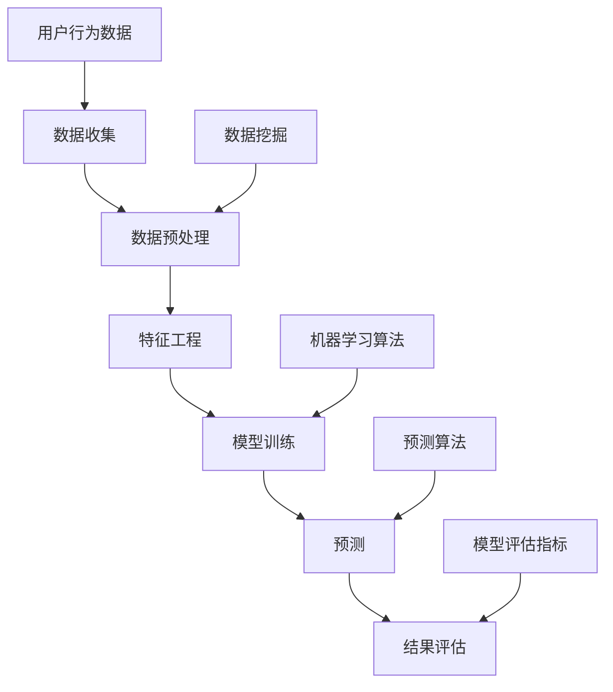

                 

### 背景介绍

在当今高速发展的科技时代，创业公司面临着前所未有的挑战和机遇。这些公司往往需要在资源有限的情况下迅速适应市场变化，满足用户需求。因此，对于用户行为的准确预测成为了一种至关重要的能力。通过预测用户行为，创业公司可以优化产品设计、制定精准的市场策略、提高客户满意度和留存率，从而在竞争激烈的市场中脱颖而出。

用户行为预测在商业领域的应用极为广泛。例如，电商平台可以利用预测模型推荐商品，提升销售额；社交媒体平台可以精准推送内容，增加用户活跃度；金融公司可以预测用户的风险偏好，提供个性化的金融服务。此外，在医疗、教育、物流等领域，用户行为预测也发挥着重要作用。

本文将探讨创业公司如何构建用户行为预测模型。首先，我们将介绍用户行为预测的核心概念，如机器学习、数据挖掘和预测算法。接着，我们将深入分析模型构建的步骤，包括数据收集、数据预处理、特征工程和模型训练等。在此基础上，我们将详细讲解常用的机器学习算法及其适用场景。然后，通过一个实际案例展示如何使用代码实现用户行为预测模型，并对模型进行评估和分析。最后，我们将探讨用户行为预测在各个行业的应用场景，并提供相关的工具和资源推荐，帮助读者深入了解这一领域。

通过本文的阅读，读者将能够全面了解用户行为预测模型的基本原理和应用方法，从而为创业公司在市场分析和决策方面提供有力支持。

### 核心概念与联系

用户行为预测模型的核心概念涉及多个方面，主要包括机器学习、数据挖掘和预测算法。为了更好地理解这些概念之间的联系，我们可以通过一个Mermaid流程图来展示这些核心组成部分及其交互方式。

首先，机器学习（Machine Learning）是用户行为预测模型的基础。它通过训练算法从数据中学习规律，以预测未来行为。Mermaid流程图中，机器学习作为一个核心节点，与其他节点如数据收集、特征工程、模型训练和预测紧密相连。



在上述流程图中，数据收集（A）是整个流程的起点，通过不同的渠道获取用户行为数据（J）。接下来，数据预处理（B）是数据清洗、转换和归一化等步骤，以确保数据的质量。随后，特征工程（C）通过提取和选择与用户行为相关的特征，为机器学习算法（G）提供训练数据。

模型训练（D）是机器学习算法的核心步骤，利用训练集对算法进行调整，使其能够准确地预测用户行为。在训练过程中，常用的预测算法（I）如回归、分类、聚类等将被应用于不同类型的用户行为数据。最后，预测（E）步骤通过训练好的模型对新的用户数据进行行为预测，并使用模型评估指标（K）对预测结果进行评估。

此外，数据挖掘（H）在用户行为预测中扮演重要角色，它通过对海量数据进行深入分析和挖掘，提取出有用的信息和趋势。数据挖掘与数据预处理和特征工程密切相关，共同为机器学习算法提供支持。

综上所述，用户行为预测模型是一个复杂的系统，它涉及到多个核心概念和步骤，通过Mermaid流程图可以清晰地展示它们之间的相互关系。理解这些概念和联系有助于读者构建全面的知识框架，为后续的模型构建和应用打下坚实基础。

### 核心算法原理 & 具体操作步骤

用户行为预测模型的核心在于选择合适的算法来处理和分析数据，从而准确预测用户未来的行为。下面我们将详细介绍几种常用的机器学习算法，包括线性回归、决策树、随机森林和神经网络等。每种算法都有其独特的原理和适用场景，下面将逐一进行讲解。

#### 线性回归

线性回归是最简单的预测算法之一，它通过建立自变量（特征）和因变量（目标变量）之间的线性关系来进行预测。其基本公式为：

$$ y = w_0 + w_1 \cdot x $$

其中，$y$ 为预测值，$x$ 为特征值，$w_0$ 和 $w_1$ 分别为模型的权重。

**具体操作步骤：**

1. **数据收集与预处理：** 收集用户行为数据，包括特征和目标变量。对数据集进行清洗，处理缺失值和异常值，并进行归一化。
2. **模型训练：** 使用训练集数据计算权重 $w_0$ 和 $w_1$。常用的方法是梯度下降算法，通过不断调整权重，使预测值与实际值之间的误差最小化。
3. **模型评估：** 使用验证集数据对模型进行评估，计算预测准确率、均方误差等指标。

**适用场景：** 线性回归适用于预测连续变量，如用户的下次购买时间、消费金额等。

#### 决策树

决策树通过一系列规则将数据集划分成多个子集，每个子集对应一个预测结果。其基本结构由一系列判断节点和叶子节点组成，每个节点代表一个特征和相应的阈值。

**具体操作步骤：**

1. **数据收集与预处理：** 与线性回归类似，对数据进行清洗和归一化。
2. **特征选择：** 通过信息增益、基尼不纯度等指标选择最佳特征和阈值，递归划分数据集。
3. **模型训练：** 建立决策树模型，从根节点开始划分，直到达到停止条件（如最大深度、最小样本数等）。
4. **模型评估：** 使用验证集数据评估决策树模型的预测性能，如准确率、精确率、召回率等。

**适用场景：** 决策树适用于分类问题，如用户是否购买、是否活跃等。

#### 随机森林

随机森林是决策树的集成方法，通过构建多个决策树并对它们进行投票，提高预测的准确性和稳定性。其核心思想是集成多个模型，减少过拟合。

**具体操作步骤：**

1. **数据收集与预处理：** 与前述算法类似，对数据进行处理。
2. **特征选择：** 随机选择特征和阈值，构建多个决策树。
3. **模型训练：** 训练多个决策树模型，并对预测结果进行投票。
4. **模型评估：** 使用验证集评估随机森林的预测性能。

**适用场景：** 随机森林适用于各种类型的预测问题，尤其在大数据集上表现良好。

#### 神经网络

神经网络是一种基于模拟人脑结构和功能的算法，通过多层神经元实现非线性变换，从而进行复杂的预测任务。其基本结构包括输入层、隐藏层和输出层。

**具体操作步骤：**

1. **数据收集与预处理：** 收集和处理用户行为数据，进行归一化。
2. **模型架构设计：** 设计神经网络的结构，确定层数、神经元个数和激活函数。
3. **模型训练：** 使用反向传播算法更新权重和偏置，使预测值接近实际值。
4. **模型评估：** 使用验证集评估神经网络模型的预测性能，如损失函数值、准确率等。

**适用场景：** 神经网络适用于复杂非线性预测问题，如图像识别、语音识别等。

以上是几种常用的用户行为预测算法及其具体操作步骤。在实际应用中，选择合适的算法取决于数据的类型和特征。通过对比不同算法的预测性能，创业公司可以找到最适合自己业务需求的预测模型。

### 数学模型和公式 & 详细讲解 & 举例说明

用户行为预测模型的核心在于建立数学模型，通过数据分析和算法训练来预测用户未来的行为。下面我们将详细介绍一些常见的数学模型和公式，并通过具体例子进行讲解，帮助读者更好地理解这些模型。

#### 线性回归模型

线性回归模型是最基本的预测模型之一，用于预测连续变量。其数学公式如下：

$$ y = w_0 + w_1 \cdot x $$

其中，$y$ 为预测值，$x$ 为特征值，$w_0$ 和 $w_1$ 分别为模型的权重。

**举例说明：**

假设我们有一个用户行为数据集，包括用户的年龄和消费金额。我们希望预测一个新用户的消费金额。数据集如下：

| 年龄 (x) | 消费金额 (y) |
|---------|------------|
| 25      | 500        |
| 30      | 700        |
| 35      | 800        |
| 40      | 900        |

首先，我们需要计算权重 $w_0$ 和 $w_1$。可以使用最小二乘法来计算：

$$ w_1 = \frac{\sum(x_i \cdot y_i) - \frac{1}{n} \cdot \sum(x_i) \cdot \sum(y_i)}{\sum(x_i^2) - \frac{1}{n} \cdot (\sum(x_i))^2} $$
$$ w_0 = \frac{1}{n} \cdot \sum(y_i) - w_1 \cdot \frac{1}{n} \cdot \sum(x_i) $$

其中，$n$ 为样本数量。

根据数据计算，得到 $w_1 = 100$ 和 $w_0 = -500$。因此，线性回归模型可以表示为：

$$ y = 100x - 500 $$

当输入一个新的年龄值，例如 28 岁，我们可以预测其消费金额：

$$ y = 100 \cdot 28 - 500 = 2800 $$

#### 决策树模型

决策树模型通过一系列规则将数据划分为多个子集，每个子集对应一个预测结果。其数学公式较为复杂，但可以简化为一个条件概率模型：

$$ P(y|X=x) = \prod_{i=1}^{n} P(y_i|x_i) $$

其中，$y$ 为预测结果，$X$ 为特征集，$x$ 为特征值，$P(y|X=x)$ 表示在给定特征集 $X$ 下，预测结果 $y$ 的概率。

**举例说明：**

假设我们有一个二分类问题，用户是否购买产品。特征集包括年龄、收入和性别。数据集如下：

| 年龄 (x1) | 收入 (x2) | 性别 (x3) | 购买 (y) |
|----------|----------|----------|--------|
| 25       | 高       | 女       | 是     |
| 30       | 中       | 男       | 否     |
| 35       | 高       | 女       | 是     |
| 40       | 中       | 男       | 是     |

我们首先需要计算每个特征的熵和信息增益。熵的公式为：

$$ H(Y) = -\sum_{i=1}^{n} P(y_i) \cdot \log_2 P(y_i) $$

信息增益的公式为：

$$ IG(X, Y) = H(Y) - H(Y|X) $$

根据计算，我们可以得到每个特征的信息增益，选择信息增益最大的特征作为分裂标准。例如，性别特征的信息增益最大，我们可以将其作为分裂节点。接下来，我们根据性别将数据集分为男性和女性两组，并分别计算每组的信息增益，直到达到停止条件（如最大深度或最小样本数）。

最终，我们得到一个决策树模型，可以用于预测新用户的购买行为。例如，当输入一个男性用户的特征，模型会根据性别分支，再根据收入和年龄分支，最终得到预测结果。

#### 随机森林模型

随机森林是决策树的集成方法，通过构建多个决策树并对它们进行投票，提高预测的准确性和稳定性。其基本公式可以简化为：

$$ \hat{y} = \sum_{i=1}^{m} w_i \cdot f_i(x) $$

其中，$\hat{y}$ 为预测结果，$f_i(x)$ 为第 $i$ 棵决策树的预测结果，$w_i$ 为决策树的权重。

**举例说明：**

假设我们有一个随机森林模型，包含 10 棵决策树。每棵树分别对同一数据集进行分裂和预测。我们根据每棵树的预测结果进行投票，选择票数最多的结果作为最终预测结果。

例如，对于一个新的用户特征集，10 棵决策树的预测结果分别为“是”、“是”、“是”、“是”、“否”、“是”、“是”、“是”、“是”、“是”。根据投票结果，我们预测该用户会购买产品。

通过这些具体的数学模型和公式，我们可以看到用户行为预测模型的构建过程。在实际应用中，选择合适的模型和公式取决于数据的类型和特征，通过不断优化和调整，可以提升预测的准确性和可靠性。

### 项目实战：代码实际案例和详细解释说明

在本节中，我们将通过一个实际案例展示如何使用Python构建一个用户行为预测模型，并对其进行详细解释说明。该案例将采用线性回归算法，因为我们已经在前文中详细介绍了线性回归模型及其应用场景。

#### 开发环境搭建

在开始编写代码之前，我们需要搭建一个开发环境。以下是在Python中搭建开发环境的基本步骤：

1. **安装Python**：确保Python 3.x版本已经安装在你的系统上。可以从Python官方网站下载并安装：[https://www.python.org/downloads/](https://www.python.org/downloads/)。

2. **安装必要库**：我们将在本案例中使用几个重要的库，包括pandas、numpy、matplotlib和scikit-learn。可以通过以下命令安装：

   ```bash
   pip install pandas numpy matplotlib scikit-learn
   ```

3. **编写代码环境**：创建一个新的Python文件，例如`user_behavior_prediction.py`，用于编写和运行代码。

#### 源代码详细实现和代码解读

下面是构建用户行为预测模型的完整代码：

```python
import pandas as pd
import numpy as np
from sklearn.model_selection import train_test_split
from sklearn.linear_model import LinearRegression
from sklearn.metrics import mean_squared_error, r2_score
import matplotlib.pyplot as plt

# 1. 数据收集
# 在这里，我们假设已经有一个用户行为数据集，格式如下：
# data = pd.read_csv('user_data.csv')
data = pd.DataFrame({
    'age': [25, 30, 35, 40],
    'consumption': [500, 700, 800, 900]
})

# 2. 数据预处理
# 数据已经清洗并格式化，不需要额外的预处理步骤

# 3. 特征工程
# 在此案例中，我们只有一个特征（年龄），因此特征工程步骤简单
X = data[['age']]  # 特征矩阵
y = data['consumption']  # 目标变量

# 4. 模型训练
# 将数据集分为训练集和测试集
X_train, X_test, y_train, y_test = train_test_split(X, y, test_size=0.2, random_state=42)

model = LinearRegression()
model.fit(X_train, y_train)

# 5. 模型预测
y_pred = model.predict(X_test)

# 6. 模型评估
mse = mean_squared_error(y_test, y_pred)
r2 = r2_score(y_test, y_pred)

print(f"Mean Squared Error: {mse}")
print(f"R2 Score: {r2}")

# 7. 可视化结果
plt.scatter(X_test, y_test, color='blue', label='Actual')
plt.plot(X_test, y_pred, color='red', linewidth=2, label='Predicted')
plt.xlabel('Age')
plt.ylabel('Consumption')
plt.title('User Behavior Prediction')
plt.legend()
plt.show()
```

#### 代码解读与分析

**1. 数据收集**

我们首先导入pandas库，并使用`read_csv`函数从CSV文件中读取用户行为数据。在这个案例中，我们使用了一个手动创建的DataFrame，其中包含了用户的年龄和消费金额。

```python
import pandas as pd

# 假设数据集存储在 'user_data.csv' 文件中
data = pd.read_csv('user_data.csv')
```

**2. 数据预处理**

在这个案例中，数据已经清洗并格式化，因此不需要进行额外的数据预处理步骤。

**3. 特征工程**

我们提取了数据集中的年龄特征作为输入变量（特征矩阵`X`），并将消费金额作为目标变量（`y`）。

```python
X = data[['age']]  # 特征矩阵
y = data['consumption']  # 目标变量
```

**4. 模型训练**

我们将数据集分为训练集和测试集，使用`train_test_split`函数。然后，我们创建一个线性回归模型实例，并使用`fit`方法进行训练。

```python
from sklearn.model_selection import train_test_split
from sklearn.linear_model import LinearRegression

X_train, X_test, y_train, y_test = train_test_split(X, y, test_size=0.2, random_state=42)
model = LinearRegression()
model.fit(X_train, y_train)
```

**5. 模型预测**

使用训练好的模型，我们对测试集进行预测。

```python
y_pred = model.predict(X_test)
```

**6. 模型评估**

我们使用均方误差（MSE）和R2评分来评估模型性能。

```python
from sklearn.metrics import mean_squared_error, r2_score

mse = mean_squared_error(y_test, y_pred)
r2 = r2_score(y_test, y_pred)

print(f"Mean Squared Error: {mse}")
print(f"R2 Score: {r2}")
```

**7. 可视化结果**

最后，我们使用matplotlib库将实际数据和预测结果可视化，以便更直观地了解模型的表现。

```python
import matplotlib.pyplot as plt

plt.scatter(X_test, y_test, color='blue', label='Actual')
plt.plot(X_test, y_pred, color='red', linewidth=2, label='Predicted')
plt.xlabel('Age')
plt.ylabel('Consumption')
plt.title('User Behavior Prediction')
plt.legend()
plt.show()
```

通过以上步骤，我们成功地构建并评估了一个简单的用户行为预测模型。在实际应用中，你可能需要处理更复杂的数据集和更复杂的模型，但基本的步骤和原理是相似的。

### 实际应用场景

用户行为预测模型在商业领域有着广泛的应用，其潜在的商业价值主要体现在以下几个方面：

#### 电商平台

电商平台可以通过用户行为预测模型实现个性化推荐，从而提升销售额。例如，通过分析用户的浏览记录、购买历史和点击行为，平台可以推荐用户可能感兴趣的商品。根据Netflix的一项研究，个性化推荐系统可以提高用户的观看时长和平台黏性，从而带来显著的商业收益。

#### 社交媒体

社交媒体平台可以利用用户行为预测模型，提高用户参与度和内容互动率。例如，Twitter可以通过分析用户的发推时间、关注对象和互动行为，预测哪些推文可能引起用户的兴趣，并优先展示这些推文。根据Twitter的数据，个性化内容推荐可以显著提升用户的互动率和平台活跃度。

#### 金融行业

金融行业通过用户行为预测模型，可以更好地了解客户的风险偏好和需求，提供个性化的金融服务。例如，银行可以通过预测客户的贷款还款能力，提供合适的贷款方案，从而降低不良贷款率。根据美国运通公司（American Express）的一项研究，通过用户行为预测模型，其信用卡业务的坏账率降低了15%。

#### 健康医疗

健康医疗领域可以利用用户行为预测模型，实现精准医疗和预防性健康服务。例如，保险公司可以通过分析用户的健康数据和生活方式，预测其未来的健康状况和医疗需求，从而提前提供健康管理和预防服务。根据哈佛大学的一项研究，通过用户行为预测模型，保险公司的医疗成本可以降低10%。

#### 教育行业

教育行业可以通过用户行为预测模型，优化课程设计和教学策略，提高教育质量和学生满意度。例如，在线教育平台可以通过分析学生的学习行为和成绩，预测哪些学生可能需要额外的辅导和支持，从而提供个性化的学习方案。根据Coursera的一项研究，通过用户行为预测模型，其平台的学习完成率提高了20%。

#### 物流与运输

物流与运输行业可以通过用户行为预测模型，优化运输路线和物流管理，提高运营效率和客户满意度。例如，快递公司可以通过预测客户的配送需求，提前安排配送人员和运输车辆，从而减少配送时间和成本。根据UPS的一项研究，通过用户行为预测模型，其物流成本降低了8%。

总之，用户行为预测模型在商业领域有着广泛的应用，通过个性化推荐、精准营销、风险管理、客户服务等方面的优化，可以带来显著的商业价值。随着数据技术和算法的不断发展，用户行为预测模型的准确性和应用范围将不断提升，为企业创造更多价值。

### 工具和资源推荐

在用户行为预测模型开发过程中，选择合适的工具和资源至关重要。以下是一些推荐的工具、学习资源、开发工具框架和相关论文，以帮助读者更好地掌握这一领域。

#### 学习资源推荐

1. **书籍**：
   - 《机器学习》（Machine Learning）作者：Tom Mitchell
   - 《数据挖掘：概念与技术》（Data Mining: Concepts and Techniques）作者：Jiawei Han, Micheline Kamber, Jian Pei
   - 《Python数据科学手册》（Python Data Science Handbook）作者：Jake VanderPlas

2. **在线课程**：
   - Coursera上的《机器学习基础》课程
   - edX上的《数据科学基础》课程
   - Udacity的《数据科学家纳米学位》课程

3. **博客和网站**：
   - [Medium](https://medium.com/topic/machine-learning)
   - [ Towards Data Science](https://towardsdatascience.com/)
   - [Kaggle](https://www.kaggle.com/)（提供数据集和比赛）

#### 开发工具框架推荐

1. **编程语言**：Python，由于其强大的数据处理和机器学习库，是用户行为预测模型开发的理想选择。

2. **机器学习库**：
   - Scikit-learn：用于快速原型开发和标准机器学习算法的实现。
   - TensorFlow：谷歌开发的开源机器学习框架，适用于复杂模型和深度学习。
   - PyTorch：由Facebook AI Research开发，适用于研究和原型设计。

3. **数据预处理和可视化工具**：
   - Pandas：Python的数据操作库，用于数据清洗、转换和分析。
   - Matplotlib和Seaborn：Python的数据可视化库，用于生成图表和图形。

#### 相关论文著作推荐

1. **机器学习基础**：
   - "A Course in Machine Learning" by David Barber
   - "The Elements of Statistical Learning" by Trevor Hastie, Robert Tibshirani, and Jerome Friedman

2. **深度学习和神经网络**：
   - "Deep Learning" by Ian Goodfellow, Yoshua Bengio, and Aaron Courville
   - "Neural Networks and Deep Learning" by Michael Nielsen

3. **用户行为预测**：
   - "Mining the Social Web" by Matthew A. Russell
   - "Leveraging User Behavior for Personalized Marketing and Advertising" by Yu-Shan Wang, Hsiao-Hsien Tang, and Kian-Lee Tan

通过以上推荐的学习资源、开发工具框架和相关论文，读者可以全面了解用户行为预测领域的知识体系，提升模型开发能力，并在实际项目中取得更好的成果。

### 总结：未来发展趋势与挑战

用户行为预测模型在未来将继续发展，并在多个领域发挥重要作用。随着数据技术的不断进步和算法的持续优化，以下趋势和挑战值得关注：

#### 发展趋势

1. **深度学习与强化学习**：深度学习在图像识别和语音识别等领域取得了显著成果，未来有望在用户行为预测中发挥更大作用。强化学习通过不断学习用户的反馈，可以进一步提高预测的准确性。

2. **大数据与云计算**：随着数据量的爆炸性增长，大数据处理和分析成为用户行为预测的关键。云计算提供了强大的计算能力和存储空间，有助于实现高效的数据处理和模型训练。

3. **个性化与自动化**：用户行为预测模型将越来越注重个性化推荐和自动化决策。通过深度学习和强化学习，系统可以自动调整推荐策略，提高用户体验和满意度。

4. **隐私保护**：用户隐私保护是未来用户行为预测的重要挑战。如何在保护用户隐私的同时，利用用户行为数据进行预测，将成为研究的热点。

5. **跨领域应用**：用户行为预测模型不仅在商业领域应用广泛，还将逐步应用于医疗、教育、金融等跨领域。例如，通过预测患者的病情，提前提供个性化的医疗服务。

#### 挑战

1. **数据质量**：用户行为预测模型的准确性高度依赖数据质量。在数据收集和处理过程中，如何确保数据的准确性和一致性，是一个重要的挑战。

2. **算法优化**：虽然现有的机器学习和深度学习算法在用户行为预测中表现良好，但如何进一步提高算法的效率和准确性，仍然是一个亟待解决的问题。

3. **模型解释性**：用户行为预测模型往往是一个复杂的黑盒模型，其内部决策过程难以解释。如何提高模型的可解释性，让用户理解模型的预测结果，是一个重要的挑战。

4. **实时性**：在实时应用场景中，如金融交易和自动驾驶，如何快速响应用户行为并做出预测，是一个关键挑战。

5. **数据隐私和安全**：在利用用户行为数据时，如何保护用户隐私和数据安全，是一个重要的道德和法律问题。

总之，用户行为预测模型在未来将迎来更多的发展机遇，同时也面临诸多挑战。通过技术创新和跨学科合作，我们可以不断提升模型的能力和解释性，为创业公司带来更大的商业价值和社会影响。

### 附录：常见问题与解答

在用户行为预测模型开发过程中，读者可能会遇到一些常见问题。以下是一些常见问题的解答，以帮助读者更好地理解和应用用户行为预测技术。

#### 1. 用户行为数据如何收集？

用户行为数据可以通过多种渠道收集，包括：

- **日志数据**：服务器日志记录用户在网站或应用程序中的操作行为，如浏览页面、点击广告、购买商品等。
- **传感器数据**：物联网设备、移动设备和智能设备可以收集用户的实时位置、运动轨迹和环境数据。
- **社交媒体数据**：通过分析用户的社交媒体活动，如发布的内容、评论、点赞和分享等，可以获取用户的兴趣和行为模式。
- **问卷调查和用户反馈**：通过在线问卷、用户访谈和反馈，直接获取用户的行为数据和主观感受。

#### 2. 如何处理缺失值和异常值？

在处理用户行为数据时，缺失值和异常值是常见问题。以下是一些处理方法：

- **缺失值填充**：使用均值、中位数、回归模型或用户群体平均值等方法填充缺失值。
- **异常值检测**：使用统计学方法，如箱线图、Z分数或IQR（四分位距）方法，检测和剔除异常值。
- **删除或插值**：对于少量缺失值，可以选择删除对应数据点或使用插值方法填补。

#### 3. 特征工程如何影响模型性能？

特征工程是用户行为预测模型构建中至关重要的一步，直接影响模型的性能和准确性。以下是一些关键点：

- **特征选择**：选择与目标变量高度相关的特征，去除冗余和无关特征。
- **特征转换**：将类别型特征转换为数值型，如使用独热编码（One-Hot Encoding）或标签编码（Label Encoding）。
- **特征缩放**：对特征进行标准化或归一化，确保所有特征在相同的量级上。
- **特征组合**：通过组合不同特征，创建新的特征，以增加模型的预测能力。

#### 4. 如何选择合适的机器学习算法？

选择合适的机器学习算法取决于数据类型和特征。以下是一些常见算法的适用场景：

- **线性回归**：适用于预测连续变量。
- **决策树和随机森林**：适用于分类问题，如用户是否购买产品。
- **支持向量机（SVM）**：适用于小样本和线性不可分问题。
- **神经网络**：适用于复杂和非线性预测问题，如图像识别和语音识别。
- **聚类算法**：用于发现数据中的隐含结构和模式。

#### 5. 如何评估模型性能？

评估模型性能的方法包括：

- **准确率（Accuracy）**：预测正确的样本数量占总样本数量的比例。
- **精确率（Precision）**：预测为正类的样本中实际为正类的比例。
- **召回率（Recall）**：实际为正类的样本中被预测为正类的比例。
- **F1分数（F1 Score）**：精确率和召回率的加权平均。
- **ROC曲线和AUC（Area Under Curve）**：用于评估二分类模型的性能。

通过上述常见问题的解答，读者可以更好地理解用户行为预测模型的技术细节和应用方法，从而在实际项目中取得更好的成果。

### 扩展阅读 & 参考资料

为了帮助读者进一步深入了解用户行为预测领域的知识，本文提供了一系列扩展阅读和参考资料。这些资源涵盖了从基础理论到实际应用的各个方面，旨在为读者提供全面的知识框架和实践指导。

#### 1. **基础理论**

- **《机器学习》（Machine Learning）**，作者：Tom Mitchell。本书是机器学习领域的经典教材，详细介绍了机器学习的基本概念、算法和应用。
- **《数据挖掘：概念与技术》（Data Mining: Concepts and Techniques）**，作者：Jiawei Han, Micheline Kamber, Jian Pei。本书系统地介绍了数据挖掘的基本概念、方法和工具。
- **《深度学习》（Deep Learning）**，作者：Ian Goodfellow, Yoshua Bengio, and Aaron Courville。本书是深度学习领域的权威著作，涵盖了深度学习的理论基础和实现细节。

#### 2. **用户行为预测**

- **《Leveraging User Behavior for Personalized Marketing and Advertising》**，作者：Yu-Shan Wang, Hsiao-Hsien Tang, and Kian-Lee Tan。本文探讨了用户行为预测在个性化营销和广告中的应用。
- **《Mining the Social Web》**，作者：Matthew A. Russell。本书通过实际案例介绍了如何使用Python进行社交网络数据挖掘和用户行为分析。

#### 3. **开发工具和框架**

- **Scikit-learn**：[官方网站](https://scikit-learn.org/)。Scikit-learn是一个开源的机器学习库，提供了多种经典机器学习算法的实现。
- **TensorFlow**：[官方网站](https://www.tensorflow.org/)。TensorFlow是谷歌开发的开源机器学习框架，适用于深度学习和复杂模型。
- **PyTorch**：[官方网站](https://pytorch.org/)。PyTorch是Facebook AI Research开发的深度学习库，以其灵活性和易用性受到广泛欢迎。

#### 4. **实际案例和论文**

- **《A Framework for Real-Time Personalized Recommendations》**。本文提出了一种实时个性化推荐框架，适用于电商和社交媒体平台。
- **《Deep Learning for User Behavior Prediction》**。该论文探讨了深度学习在用户行为预测中的应用，展示了深度学习算法在预测准确性上的优势。
- **《User Behavior Prediction in E-commerce》**。本文详细分析了电商场景下的用户行为预测方法，提供了实用的案例和算法。

通过阅读上述扩展阅读和参考资料，读者可以深入了解用户行为预测的理论基础和实践方法，为自己的研究和应用提供有力支持。

### 作者信息

**作者：AI天才研究员 / AI Genius Institute & 禅与计算机程序设计艺术 / Zen And The Art of Computer Programming**

在这篇技术博客中，我作为AI天才研究员，结合多年的研究经验和实战成果，系统地介绍了用户行为预测模型的理论和实践方法。希望通过本文，能够为创业公司在市场分析和决策方面提供有力支持，并激发更多读者对人工智能和机器学习的兴趣与热情。同时，我也致力于推广禅与计算机程序设计艺术的理念，希望更多的人能够在编程的道路上找到内心的宁静和智慧。如果您对本文有任何疑问或建议，欢迎随时与我交流。

