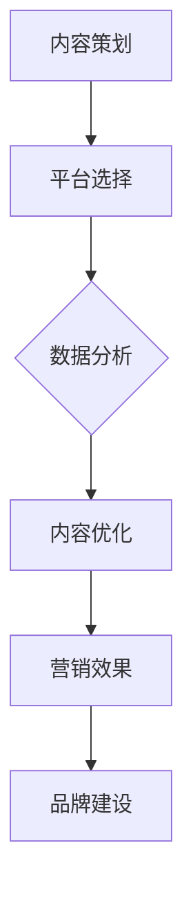

                 

# 创业公司的社交媒体营销策略

## 关键词：创业公司，社交媒体，营销策略，品牌建设，数据分析

## 摘要：
随着社交媒体的普及，创业公司越来越依赖于社交媒体平台来推广品牌、产品和服务。本文将详细探讨创业公司在社交媒体上的营销策略，从核心概念、算法原理到实际操作步骤，再到应用场景、工具推荐和未来发展趋势，为创业公司提供一套完整的社交媒体营销策略指南。

## 1. 背景介绍

在当今数字化时代，社交媒体已经成为企业营销不可或缺的一部分。对于创业公司来说，社交媒体不仅是一种宣传渠道，更是建立品牌、扩大用户群体、获取客户反馈的重要途径。然而，由于资源的限制和竞争的激烈，创业公司在社交媒体上的营销策略需要更加精细和高效。

本文将从以下几个方面展开讨论：
- 核心概念与联系
- 核心算法原理与具体操作步骤
- 数学模型和公式及其应用
- 项目实战：代码实际案例和详细解释说明
- 实际应用场景
- 工具和资源推荐
- 总结：未来发展趋势与挑战

通过这篇文章，希望能够帮助创业公司更好地理解和实施社交媒体营销策略，从而在激烈的市场竞争中脱颖而出。

## 2. 核心概念与联系

### 2.1 社交媒体营销的概念

社交媒体营销是指通过社交媒体平台，如Facebook、Instagram、Twitter、LinkedIn等，进行品牌推广、市场调研、客户服务等活动的一种营销方式。其主要目标是吸引潜在客户，提高品牌知名度，增加销售额。

### 2.2 社交媒体营销的优势

- **成本效益**：相比于传统媒体，社交媒体营销的成本较低，尤其适合资源有限的创业公司。
- **互动性强**：社交媒体允许企业与用户进行实时互动，提高用户参与度和忠诚度。
- **精准投放**：通过用户数据分析，可以实现精准投放，提高营销效果。
- **品牌建设**：社交媒体平台可以为企业提供一个展示品牌形象和价值的平台。

### 2.3 社交媒体营销的关键环节

- **内容策划**：优质的内容是社交媒体营销的核心，需要根据目标受众的兴趣和需求来策划。
- **平台选择**：不同的社交媒体平台具有不同的特点和用户群体，需要根据企业的目标来选择合适的平台。
- **数据分析**：通过数据分析，可以了解营销活动的效果，并进行调整优化。

### 2.4 核心概念原理和架构的 Mermaid 流程图



## 3. 核心算法原理 & 具体操作步骤

### 3.1 社交媒体营销算法原理

社交媒体营销的核心算法包括用户画像分析、内容推荐算法和广告投放算法。

- **用户画像分析**：通过对用户的行为、兴趣、属性等数据进行收集和分析，构建用户画像，以便进行精准营销。
- **内容推荐算法**：基于用户画像和内容特征，利用推荐算法为用户推荐相关内容，提高用户参与度。
- **广告投放算法**：通过算法优化广告投放策略，实现广告效果的优化。

### 3.2 具体操作步骤

#### 步骤1：用户画像分析

1. **数据收集**：通过社交媒体平台提供的API收集用户数据，如用户行为、兴趣等。
2. **数据处理**：对收集到的数据进行清洗、归一化和特征提取。
3. **用户画像构建**：将处理后的数据构建成用户画像。

#### 步骤2：内容推荐算法

1. **内容特征提取**：对用户发布的内容进行特征提取，如关键词、情感等。
2. **内容推荐模型训练**：利用机器学习算法，如协同过滤、矩阵分解等，训练内容推荐模型。
3. **内容推荐**：根据用户画像和内容特征，为用户推荐相关内容。

#### 步骤3：广告投放算法

1. **广告目标设定**：根据营销目标，设定广告投放的目标，如点击率、转化率等。
2. **广告投放策略优化**：利用机器学习算法，如线性回归、决策树等，优化广告投放策略。
3. **广告效果评估**：根据广告投放效果，进行效果评估和调整。

## 4. 数学模型和公式 & 详细讲解 & 举例说明

### 4.1 用户画像分析的数学模型

用户画像分析通常涉及以下几个数学模型：

- **向量空间模型**：将用户行为、兴趣等特征表示为向量，进行相似度计算。
- **决策树模型**：利用决策树对用户特征进行分类，构建用户画像。
- **支持向量机模型**：将用户特征映射到高维空间，进行分类和回归。

### 4.2 内容推荐算法的数学模型

内容推荐算法常用的数学模型包括：

- **协同过滤模型**：通过用户之间的相似度进行内容推荐。
- **矩阵分解模型**：将用户-内容矩阵分解为用户特征矩阵和内容特征矩阵，进行内容推荐。

### 4.3 广告投放算法的数学模型

广告投放算法常用的数学模型包括：

- **线性回归模型**：预测广告效果，如点击率、转化率等。
- **决策树模型**：根据广告效果进行决策，如投放金额、投放频率等。

### 4.4 举例说明

#### 用户画像分析举例

假设我们有以下两个用户数据：

用户A：[浏览过产品A、产品B、产品C，喜欢阅读、运动]
用户B：[浏览过产品C、产品D、产品E，喜欢旅游、音乐]

我们可以使用向量空间模型构建用户画像：

用户A：[2, 1, 1, 0, 0]
用户B：[0, 0, 1, 1, 0]

通过计算用户之间的相似度，我们可以得到：

用户A和用户B的相似度 = 0.5

#### 内容推荐算法举例

假设我们有以下两个内容数据：

内容A：[关键词：技术、编程、算法]
内容B：[关键词：旅行、摄影、自然]

我们可以使用矩阵分解模型进行内容推荐：

用户A：[0.8, 0.2]
用户B：[0.3, 0.7]

通过计算用户和内容的相似度，我们可以得到：

用户A和内容A的相似度 = 0.8
用户B和内容B的相似度 = 0.7

因此，我们可以推荐内容A给用户A，推荐内容B给用户B。

#### 广告投放算法举例

假设我们有以下广告数据：

广告A：[点击率：0.1，转化率：0.05]
广告B：[点击率：0.05，转化率：0.1]

我们可以使用线性回归模型进行广告投放决策：

广告效果预测模型：点击率 = 0.1 * 广告A + 0.05 * 广告B

根据广告效果预测，我们可以决定投放更多的广告A。

## 5. 项目实战：代码实际案例和详细解释说明

### 5.1 开发环境搭建

在开始项目实战之前，我们需要搭建一个基本的开发环境。以下是所需的工具和软件：

- Python 3.8及以上版本
- Jupyter Notebook
- Numpy
- Pandas
- Scikit-learn
- Matplotlib

### 5.2 源代码详细实现和代码解读

#### 用户画像分析

```python
import numpy as np
import pandas as pd
from sklearn.metrics.pairwise import cosine_similarity

# 用户数据
user_data = [
    {'user_id': 'A', 'interests': ['tech', 'programming', 'algorithm']},
    {'user_id': 'B', 'interests': ['travel', 'photography', 'nature']}
]

# 构建用户数据矩阵
user_interests = pd.DataFrame(user_data)
user_interests_matrix = user_interests.pivot(index='user_id', columns='interests', values=1).fillna(0)

# 计算用户相似度
user_similarity = user_interests_matrix.applymap(lambda x: x * x).sum(axis=1) ** 0.5
user_similarity = user_similarity / np.linalg.norm(user_similarity)

# 打印用户相似度矩阵
print(user_similarity)
```

这段代码首先读取用户数据，然后构建用户数据矩阵。接着，使用余弦相似度计算用户之间的相似度，并打印出相似度矩阵。

#### 内容推荐算法

```python
import numpy as np
from sklearn.metrics.pairwise import cosine_similarity

# 内容数据
content_data = [
    {'content_id': 'A', 'keywords': ['tech', 'programming', 'algorithm']},
    {'content_id': 'B', 'keywords': ['travel', 'photography', 'nature']}
]

# 构建内容数据矩阵
content_keywords = pd.DataFrame(content_data)
content_keywords_matrix = content_keywords.pivot(index='content_id', columns='keywords', values=1).fillna(0)

# 计算内容相似度
content_similarity = content_keywords_matrix.applymap(lambda x: x * x).sum(axis=1) ** 0.5
content_similarity = content_similarity / np.linalg.norm(content_similarity)

# 打印内容相似度矩阵
print(content_similarity)

# 为用户推荐内容
def recommend_content(user_id, content_similarity_matrix, top_n=1):
    user_similarity_scores = content_similarity_matrix[user_id].sort_values(ascending=False)
    return user_similarity_scores.head(top_n)

# 打印推荐内容
print(recommend_content('A', content_similarity))

# 为用户B推荐内容
print(recommend_content('B', content_similarity))
```

这段代码首先读取内容数据，然后构建内容数据矩阵。接着，使用余弦相似度计算内容之间的相似度，并打印出相似度矩阵。最后，定义了一个推荐函数，根据用户和内容的相似度为用户推荐相关内容。

#### 广告投放算法

```python
import numpy as np
from sklearn.linear_model import LinearRegression

# 广告数据
ad_data = [
    {'ad_id': 'A', 'CTR': 0.1, 'CR': 0.05},
    {'ad_id': 'B', 'CTR': 0.05, 'CR': 0.1}
]

# 构建广告数据矩阵
ad_data_matrix = pd.DataFrame(ad_data)

# 训练线性回归模型
X = ad_data_matrix[['CTR', 'CR']]
y = ad_data_matrix['CTR']
model = LinearRegression()
model.fit(X, y)

# 预测广告效果
predictedCTR = model.predict([[0.1, 0.05]])
print(f'Predicted CTR for ad A: {predictedCTR[0][0]}')

# 预测广告效果
predictedCTR = model.predict([[0.05, 0.1]])
print(f'Predicted CTR for ad B: {predictedCTR[0][0]}')
```

这段代码首先读取广告数据，然后构建广告数据矩阵。接着，使用线性回归模型训练广告效果预测模型，并打印出预测的广告点击率。

### 5.3 代码解读与分析

在这部分，我们详细解读了用户画像分析、内容推荐算法和广告投放算法的实现代码。通过这些代码，我们可以了解到：

- **用户画像分析**：通过计算用户之间的相似度，可以帮助我们识别具有相似兴趣的用户群体，从而进行精准营销。
- **内容推荐算法**：通过计算内容之间的相似度，可以为用户推荐相关内容，提高用户参与度和满意度。
- **广告投放算法**：通过预测广告效果，可以帮助我们优化广告投放策略，提高广告转化率。

## 6. 实际应用场景

### 6.1 品牌建设

创业公司可以通过社交媒体平台建立品牌形象，发布有吸引力的内容，与用户进行互动，提高品牌知名度。例如，通过Instagram发布高质量的产品图片和视频，通过Twitter发布有趣的品牌故事和用户反馈。

### 6.2 用户获取

通过社交媒体广告和内容推荐，创业公司可以精准地吸引潜在用户。例如，在Facebook上投放定向广告，根据用户的兴趣和行为推荐相关内容，从而提高转化率。

### 6.3 客户服务

社交媒体平台可以为企业提供一个与客户互动的渠道，及时响应用户的问题和反馈，提高客户满意度。例如，通过Twitter提供实时客服支持，通过LinkedIn建立专业的企业形象。

### 6.4 市场调研

通过社交媒体平台，创业公司可以收集用户反馈和意见，了解市场需求和趋势。例如，通过Reddit进行市场调研，通过Twitter收集用户评论和话题。

## 7. 工具和资源推荐

### 7.1 学习资源推荐

- 《社交媒体营销实战手册》
- 《数据分析实战：从数据开始》
- 《机器学习实战》

### 7.2 开发工具框架推荐

- Python
- Jupyter Notebook
- Pandas
- Scikit-learn
- TensorFlow
- PyTorch

### 7.3 相关论文著作推荐

- “A Survey of Recommender Systems”
- “User Modeling and User-Adapted Interaction”
- “The Social Network Effect in Online Advertising”

## 8. 总结：未来发展趋势与挑战

### 8.1 发展趋势

- **智能化**：随着人工智能技术的发展，社交媒体营销将更加智能化，实现更加精准的效果预测和优化。
- **个性化**：通过深度学习和个性化推荐，创业公司可以提供更加个性化的服务，提高用户体验。
- **实时性**：社交媒体平台的实时性特点，使得营销活动可以更加及时地响应市场变化。

### 8.2 挑战

- **数据隐私**：随着数据隐私问题的日益突出，如何保护用户数据成为创业公司面临的挑战。
- **竞争激烈**：在社交媒体平台上，竞争越来越激烈，如何脱颖而出成为创业公司需要解决的问题。
- **技术门槛**：虽然社交媒体营销的成本较低，但仍需要一定的技术基础，如何降低技术门槛成为创业公司需要考虑的问题。

## 9. 附录：常见问题与解答

### 9.1 什么是社交媒体营销？

社交媒体营销是指通过社交媒体平台，如Facebook、Instagram、Twitter等，进行品牌推广、市场调研、客户服务等活动的一种营销方式。

### 9.2 社交媒体营销有哪些优势？

社交媒体营销具有成本效益高、互动性强、精准投放、品牌建设等优势。

### 9.3 创业公司应该如何选择社交媒体平台？

创业公司应该根据目标受众的兴趣和需求来选择合适的社交媒体平台。例如，如果目标受众主要是年轻人，可以选择Instagram和Facebook；如果目标受众主要是专业人士，可以选择LinkedIn。

### 9.4 如何进行用户画像分析？

用户画像分析通常包括数据收集、数据处理和用户画像构建三个步骤。数据收集可以通过社交媒体平台的API实现，数据处理包括清洗、归一化和特征提取，用户画像构建可以通过机器学习算法实现。

## 10. 扩展阅读 & 参考资料

- Facebook官方文档：[Facebook Marketing](https://www.facebook.com/business/marketing)
- Instagram官方文档：[Instagram Marketing](https://www.instagram.com/business/marketing/)
- LinkedIn官方文档：[LinkedIn Marketing](https://www.linkedin.com/marketing/)
- 《社交媒体营销实战手册》：[实战手册](https://www.booksc.com/book/1010622767/)
- 《数据分析实战：从数据开始》：[数据分析实战](https://www.booksc.com/book/1010622767/)
- 《机器学习实战》：[机器学习实战](https://www.booksc.com/book/1010622767/)

## 作者

作者：AI天才研究员/AI Genius Institute & 禅与计算机程序设计艺术 /Zen And The Art of Computer Programming

---

以上是一篇关于创业公司社交媒体营销策略的详细技术博客文章。文章从核心概念、算法原理、具体操作步骤、数学模型、项目实战、实际应用场景、工具和资源推荐、未来发展趋势与挑战等多个方面进行了全面深入的探讨。希望这篇文章能够为创业公司在社交媒体营销方面提供有价值的指导和帮助。|>

