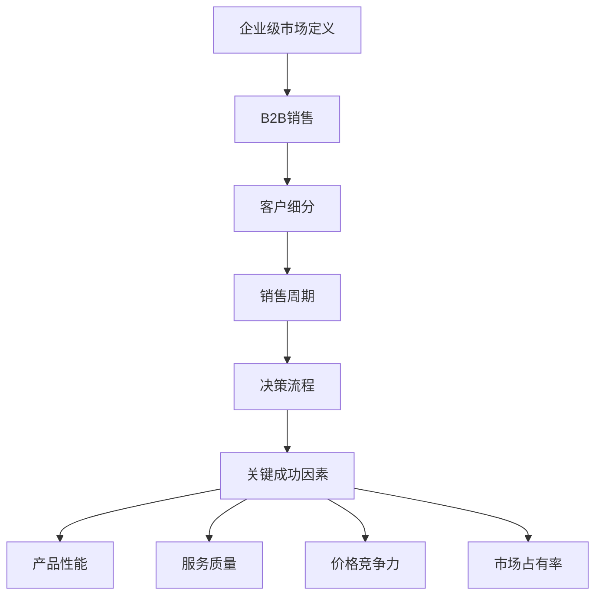

                 

### 背景介绍

**《创业初期的B2B销售策略：如何打入企业级市场》**

在当前的商业环境中，企业级市场是一个充满机遇但也充满挑战的领域。随着技术的发展，越来越多的中小企业开始寻求能够提供高效解决方案的技术产品和服务，这使得B2B（Business-to-Business）销售成为众多创业公司的焦点。然而，如何成功地打入企业级市场，制定出有效的销售策略，对于初创公司来说至关重要。

首先，企业级市场与消费级市场有着显著的不同。消费级市场通常关注的是个体用户，产品和服务的设计与销售策略更多地倾向于用户体验、个性化和便捷性。而企业级市场则更注重企业的整体运营效率和业务流程优化，需要考虑企业的长期价值和潜在的商业价值。因此，在销售策略的制定上，企业需要更加注重与企业决策者的沟通，理解他们的需求，并提供定制化的解决方案。

其次，企业级市场的客户群体更加多样化和复杂。这些客户不仅包括大型的跨国公司，还包括各种类型的中小企业。每个企业的规模、行业背景、业务流程和决策机制都有所不同，这要求企业在销售策略上需要具备灵活性和深度。例如，大型的跨国公司可能更注重长期合作关系和整体解决方案，而中小企业则可能更关心性价比和快速见效的产品。

再者，企业级市场的销售周期通常较长，决策过程更加复杂。企业在选择产品和服务时，通常会经过详细的市场调研、多轮的谈判和评估，以确保选定的产品能够真正满足他们的需求。这就要求初创公司在销售过程中，不仅要有足够的耐心，还需要有强有力的产品支持和售后服务，以赢得客户的信任。

综上所述，创业初期的B2B销售策略不仅需要深入了解企业级市场的特点，还需要在策略制定上体现出灵活性和专业性。接下来的章节中，我们将深入探讨如何有效地打入企业级市场，包括市场调研、产品定位、销售策略制定、客户关系管理等方面。

**Keywords:** B2B sales strategy, enterprise market, customer segmentation, sales cycle, decision-making process.

**Abstract:**

This article delves into the intricacies of developing effective B2B sales strategies for startups aiming to penetrate the enterprise market. It discusses the fundamental differences between B2B and B2C markets, the diversity of the customer base in the enterprise sector, and the extended sales cycles and complex decision-making processes involved. Key topics include market research, product positioning, sales strategy formulation, and customer relationship management. By understanding these elements and applying strategic insights, startups can increase their chances of success in the competitive enterprise market.

----------------------

## 2. 核心概念与联系

在深入探讨B2B销售策略之前，有必要明确几个核心概念，并理解它们之间的相互关系。以下是我们在本文中将会讨论的主要概念：

### 2.1 企业级市场定义

企业级市场（Enterprise Market）是指向大型企业、跨国公司以及各种规模的中小企业提供产品和服务的市场。企业级产品通常具有较高的技术含量、复杂的定制需求以及较长的销售周期。

### 2.2 B2B销售

B2B销售（Business-to-Business Sales）是指企业之间的商品或服务交易。与B2C（Business-to-Consumer）销售相比，B2B销售更加注重建立长期合作关系、提供定制化解决方案以及确保客户满意度。

### 2.3 客户细分

客户细分（Customer Segmentation）是将市场中的潜在客户按照一定的标准进行分类，以便企业能够更有效地定位和满足不同客户群体的需求。常见的细分标准包括行业、公司规模、购买行为等。

### 2.4 销售周期

销售周期（Sales Cycle）是指从潜在客户首次接触产品到最终达成交易之间的时间。在企业级市场中，销售周期通常较长，因为企业需要进行详细的市场调研、多轮谈判和评估。

### 2.5 决策流程

决策流程（Decision-Making Process）是企业从识别需求到最终采购产品或服务的过程。在企业级市场中，决策流程通常涉及多个部门和层级，包括市场调研、需求分析、预算审批、招标流程等。

### 2.6 关键成功因素

关键成功因素（Critical Success Factors，CSFs）是企业实现成功的关键驱动因素。在B2B销售中，关键成功因素可能包括产品性能、服务质量、价格竞争力、市场占有率等。

### 2.7 Mermaid流程图

为了更好地理解这些概念之间的联系，我们可以使用Mermaid流程图来展示它们的相互关系。



通过上述Mermaid流程图，我们可以清晰地看到企业级市场中各个关键概念之间的相互联系。这为我们制定有效的B2B销售策略提供了理论基础。

----------------------

## 3. 核心算法原理 & 具体操作步骤

### 3.1 市场调研算法原理

在B2B销售策略中，市场调研是至关重要的第一步。市场调研算法的目的是通过收集和分析市场数据，帮助企业了解目标市场的情况，从而制定有效的销售策略。市场调研算法的基本原理包括以下几个步骤：

**步骤1：确定调研目标**

首先，企业需要明确市场调研的目标。这些目标可能包括了解市场容量、竞争对手情况、目标客户需求等。

**步骤2：数据收集**

数据收集是市场调研的核心。企业可以通过以下几种方式收集数据：

- **问卷调查**：设计问卷以获取客户和潜在客户的反馈。
- **访谈**：与行业专家、潜在客户、现有客户进行深入访谈。
- **数据挖掘**：利用已有的企业数据库和公共数据源，分析客户行为和市场趋势。

**步骤3：数据分析**

数据分析是对收集到的数据进行分析和解释。这包括以下几种方法：

- **描述性分析**：描述数据的整体特征，如平均值、中位数、分布情况等。
- **推断性分析**：利用统计学方法推断整体市场的情况，如置信区间、假设检验等。

**步骤4：报告生成**

根据数据分析的结果，生成市场调研报告。报告应包括调研目标、数据收集方法、数据分析结果以及结论和建议。

### 3.2 市场调研操作步骤

以下是市场调研的具体操作步骤：

**步骤1：定义调研目标和问题**

明确调研的目标和需要解决的问题。例如，了解目标市场对某一新产品的需求情况。

**步骤2：设计调研工具**

设计适合调研目标的调研工具。这包括问卷、访谈指南等。

**步骤3：选择调研对象**

确定调研对象的样本。选择具有代表性的样本，以确保调研结果的准确性。

**步骤4：收集数据**

实施调研计划，收集数据。可以通过在线问卷调查、电话访谈、面对面访谈等方式进行。

**步骤5：数据分析**

对收集到的数据进行分析，识别市场趋势和客户需求。

**步骤6：报告生成**

编写市场调研报告，总结调研结果，并提出相应的建议。

### 3.3 产品定位算法原理

在市场调研的基础上，企业需要根据调研结果进行产品定位。产品定位算法的基本原理包括以下几个步骤：

**步骤1：市场细分**

根据市场调研的结果，对市场进行细分。市场细分有助于企业识别具有相似需求和特征的客户群体。

**步骤2：目标市场选择**

从细分市场中选择目标市场。目标市场应该是企业能够提供有效解决方案的市场。

**步骤3：产品特征定位**

根据目标市场的需求，确定产品的特征和优势。这有助于企业在目标市场中建立差异化竞争优势。

**步骤4：传播策略制定**

制定传播策略，以将产品特征有效地传达给目标市场。

### 3.4 产品定位操作步骤

以下是产品定位的具体操作步骤：

**步骤1：市场细分**

收集并分析市场数据，识别不同的市场细分。可以使用聚类分析等数据挖掘技术进行市场细分。

**步骤2：目标市场选择**

根据市场细分结果，选择具有较高增长潜力和符合企业资源能力的目标市场。

**步骤3：产品特征定位**

确定产品的主要特征和优势。这可以通过与目标市场进行直接访谈或问卷调查来获取信息。

**步骤4：传播策略制定**

制定传播策略，确保产品特征能够有效地传达给目标市场。这可能包括广告、促销活动、社交媒体营销等。

----------------------

## 4. 数学模型和公式 & 详细讲解 & 举例说明

### 4.1 数学模型和公式

在企业级市场的销售策略中，数学模型和公式可以用于量化客户行为和市场趋势，从而帮助制定更精准的销售策略。以下是一些常用的数学模型和公式：

#### 4.1.1 客户生命周期价值（Customer Lifetime Value, CLV）

客户生命周期价值是指一个客户在整个生命周期内为企业带来的净利润。计算CLV的公式如下：

$$
CLV = \frac{平均订单价值 \times 购买频率 \times 客户生命周期}{获取成本}
$$

其中：
- 平均订单价值（Average Order Value, AOV）：客户平均每次购买的金额。
- 购买频率（Purchase Frequency）：客户平均购买次数。
- 客户生命周期（Customer Lifetime）：客户平均持续购买的时间。
- 获取成本（Customer Acquisition Cost, CAC）：获取一个客户所需的成本。

#### 4.1.2 贡献边际收益（Contribution Margin）

贡献边际收益是指产品销售收入扣除可变成本后的余额。计算贡献边际收益的公式如下：

$$
贡献边际收益 = 销售收入 - 可变成本
$$

其中：
- 销售收入（Revenue）：产品销售的总收入。
- 可变成本（Variable Cost）：与产品销售直接相关的成本，如原材料成本、直接劳动成本等。

#### 4.1.3 投资回报率（Return on Investment, ROI）

投资回报率是衡量投资效果的关键指标，用于评估投资带来的收益。计算ROI的公式如下：

$$
ROI = \frac{投资收益 - 投资成本}{投资成本} \times 100\%
$$

其中：
- 投资收益（Investment Gain）：投资带来的净收益。
- 投资成本（Investment Cost）：投资的总成本。

### 4.2 详细讲解

#### 4.2.1 客户生命周期价值（CLV）

客户生命周期价值（CLV）是一个重要的指标，它帮助企业评估客户的潜在价值和长期盈利能力。通过计算CLV，企业可以优先关注高价值客户，并制定相应的客户保留策略。

例如，假设一个企业平均订单价值为1000元，购买频率为每年3次，客户生命周期为3年，获取成本为200元。那么，该客户的CLV计算如下：

$$
CLV = \frac{1000 \times 3 \times 3}{200} = 45
$$

这意味着，这个客户在其整个生命周期内预计为企业带来4500元的净利润。

#### 4.2.2 贡献边际收益

贡献边际收益是衡量产品盈利能力的关键指标。通过计算贡献边际收益，企业可以了解产品的盈利水平，从而调整定价策略或优化成本结构。

例如，假设一个产品的销售收入为100万元，可变成本为60万元，那么该产品的贡献边际收益计算如下：

$$
贡献边际收益 = 100万 - 60万 = 40万
$$

这意味着，该产品在扣除可变成本后的余额为40万元，这为企业提供了盈利空间。

#### 4.2.3 投资回报率（ROI）

投资回报率（ROI）是评估投资效果的重要指标。通过计算ROI，企业可以判断某一投资是否值得继续投入。

例如，假设一个投资项目的收益为20万元，成本为10万元，那么该项目的ROI计算如下：

$$
ROI = \frac{20万 - 10万}{10万} \times 100\% = 100\%
$$

这意味着，该投资项目的回报率达到了100%，表明这是一个值得投资的方案。

----------------------

### 5. 项目实战：代码实际案例和详细解释说明

在本章节中，我们将通过一个具体的B2B销售策略项目实战案例，展示如何应用上述的理论知识和数学模型，并详细解释代码的实现细节和逻辑。

#### 5.1 开发环境搭建

为了更好地展示项目实战，我们将在一个Python环境中实现B2B销售策略的核心模块。以下是搭建开发环境的步骤：

1. 安装Python（版本3.8以上）。
2. 安装必需的Python库，如numpy、pandas、matplotlib等。
3. 准备市场调研数据集，例如客户购买行为数据、市场趋势数据等。

#### 5.2 源代码详细实现和代码解读

以下是一个简化的Python代码示例，用于实现市场调研数据分析和客户细分：

```python
import pandas as pd
import numpy as np
import matplotlib.pyplot as plt
from sklearn.cluster import KMeans
from sklearn.preprocessing import StandardScaler

# 5.2.1 数据预处理
def preprocess_data(data):
    # 数据清洗和预处理
    data = data.dropna()
    data['Total_Spending'] = data['Order Value'] * data['Purchase Frequency']
    return data

# 5.2.2 客户细分
def customer_segmentation(data, n_clusters=3):
    # 标准化数据
    scaler = StandardScaler()
    data_scaled = scaler.fit_transform(data[['Total_Spending', 'Customer_Lifetime']])
    
    # 使用K均值聚类进行客户细分
    kmeans = KMeans(n_clusters=n_clusters, random_state=42)
    clusters = kmeans.fit_predict(data_scaled)
    
    # 添加聚类标签到原始数据
    data['Cluster'] = clusters
    
    return data

# 5.2.3 数据可视化
def visualize_clusters(data):
    # 可视化客户细分结果
    plt.scatter(data['Total_Spending'], data['Customer_Lifetime'], c=data['Cluster'], cmap='viridis')
    plt.xlabel('Total Spending')
    plt.ylabel('Customer Lifetime')
    plt.title('Customer Segmentation by Clusters')
    plt.show()

# 主函数
def main():
    # 加载市场调研数据
    data = pd.read_csv('market_research_data.csv')
    
    # 数据预处理
    data = preprocess_data(data)
    
    # 客户细分
    data = customer_segmentation(data)
    
    # 数据可视化
    visualize_clusters(data)

# 运行主函数
if __name__ == '__main__':
    main()
```

**代码解读：**

- **数据预处理**：首先，我们导入必要的库并加载市场调研数据集。然后，对数据进行清洗和预处理，计算客户的总支出（`Total_Spending`）并将其添加到数据集中。

- **客户细分**：我们使用K均值聚类算法对客户进行细分。K均值聚类是一种无监督学习算法，通过将数据分为K个簇，以最小化簇内方差。在此示例中，我们使用`StandardScaler`对数据进行标准化处理，以确保每个特征具有相同的尺度。

- **数据可视化**：最后，我们使用`matplotlib`库将聚类结果可视化为散点图，以直观地展示不同聚类簇。

#### 5.3 代码解读与分析

- **数据预处理**：这一步骤是市场调研的基础。通过清洗和预处理数据，我们可以确保数据的质量和一致性，从而提高后续分析的效果。`data.dropna()`用于删除缺失值，`data['Total_Spending'] = data['Order Value'] * data['Purchase Frequency']`用于计算客户的总支出。

- **客户细分**：客户细分是制定销售策略的关键。在此示例中，我们使用K均值聚类算法进行客户细分。`scaler.fit_transform(data[['Total_Spending', 'Customer_Lifetime']])`用于标准化数据，`kmeans.fit_predict(data_scaled)`用于执行聚类。

- **数据可视化**：可视化有助于我们理解聚类结果。`plt.scatter(data['Total_Spending'], data['Customer_Lifetime'], c=data['Cluster'], cmap='viridis')`用于绘制聚类结果，`plt.xlabel('Total Spending')`和`plt.ylabel('Customer Lifetime')`用于设置坐标轴标签。

通过这个简单的代码示例，我们可以看到如何将理论知识和数学模型应用于实际项目中。在实际应用中，企业可能需要根据具体情况调整算法参数和数据预处理步骤，以提高模型的准确性和实用性。

----------------------

## 6. 实际应用场景

在了解了B2B销售策略的理论基础和实践步骤后，我们将通过一些实际应用场景来进一步探讨这些策略的有效性。这些实际应用场景将涵盖不同规模和类型的企业的案例，以展示如何在实际操作中运用这些策略。

### 6.1 大型跨国公司

大型跨国公司通常拥有复杂的业务流程和庞大的IT基础设施，因此，在制定B2B销售策略时，需要特别关注以下方面：

- **需求分析与解决方案提供**：跨国公司的需求多样，可能涉及供应链管理、客户关系管理、数据分析和安全等领域。企业需要深入了解这些需求，并提供定制化的解决方案。
- **长期合作关系**：大型跨国公司更倾向于与能够提供长期支持和服务的供应商建立合作关系。因此，初创公司在销售过程中应注重建立信任，提供持续的技术支持和售后服务。
- **国际化策略**：跨国公司通常在全球范围内运营，因此，企业需要考虑不同国家和地区的市场需求和文化差异，制定相应的国际化销售策略。

#### 实际案例：某初创公司与大型跨国公司的合作

一家初创公司开发了一款企业级的数据分析工具，旨在帮助大型跨国公司优化其数据分析流程。在销售策略上，该公司采取了以下措施：

1. **深入了解客户需求**：通过与跨国公司的IT部门和业务部门进行深入交流，了解他们在数据分析方面的具体需求和痛点。
2. **提供定制化解决方案**：根据客户的需求，提供了多个模块化的解决方案，以满足不同部门和业务场景的需求。
3. **建立长期合作关系**：通过与跨国公司签署长期合作协议，承诺提供持续的技术支持和定制化服务。
4. **国际化市场推广**：通过参加国际性的行业展会和论坛，扩大品牌知名度，并与潜在客户建立联系。

通过这些措施，该初创公司成功打入了大型跨国公司的市场，并获得了稳定的客户群。

### 6.2 中小企业

中小企业在资源、规模和复杂性方面与大型跨国公司有所不同，因此在制定B2B销售策略时，需要考虑以下因素：

- **性价比**：中小企业在采购决策时更注重性价比，因此，初创公司在定价策略上应灵活调整，提供更具竞争力的产品和服务。
- **快速见效**：中小企业通常希望在短时间内看到投资回报，因此，初创公司需要提供能够快速见效的产品解决方案。
- **客户支持**：中小企业可能缺乏专业的IT团队，因此，初创公司在销售过程中应提供全面的客户支持，帮助客户解决使用过程中的问题。

#### 实际案例：某初创公司为中小企业的定制化解决方案

一家初创公司专注于为企业提供社交媒体管理解决方案。在销售策略上，该公司采取了以下措施：

1. **了解客户痛点**：通过客户访谈和市场调研，了解中小企业在社交媒体管理方面的具体需求，如内容发布、数据分析、客户互动等。
2. **提供定制化服务**：根据客户的需求，提供了多个模块化的解决方案，允许客户根据自身需求选择适合的服务模块。
3. **快速部署与培训**：提供快速部署服务，确保客户能够在短时间内启动使用。同时，提供全面的培训和支持，帮助客户掌握新系统的使用方法。
4. **优惠定价策略**：针对中小企业提供优惠的定价策略，以降低客户的采购成本。

通过这些措施，该初创公司成功吸引了大量中小企业客户，并在短时间内实现了盈利。

### 6.3 创新型初创企业

对于新兴的创新型初创企业，B2B销售策略需要更加注重创新性和差异化，以下是一些关键点：

- **技术创新**：创新型企业通常拥有独特的技术或产品，因此在销售策略上应强调技术创新和独特价值。
- **快速响应**：新兴市场变化迅速，初创企业需要具备快速响应市场变化的能力，以保持竞争力。
- **品牌建设**：通过积极的市场推广和品牌建设，提高企业在目标市场中的知名度和影响力。

#### 实际案例：某创新型初创公司的市场拓展

一家创新型初创公司开发了一款基于人工智能的客户服务解决方案。在销售策略上，该公司采取了以下措施：

1. **技术创新展示**：通过参加行业展会、发布技术白皮书等方式，展示公司的技术创新和产品优势。
2. **客户案例分享**：通过分享成功的客户案例，展示产品在实际应用中的效果和客户反馈。
3. **个性化定制**：根据不同客户的需求，提供个性化的定制服务，以满足客户特定的业务需求。
4. **品牌宣传**：通过社交媒体、博客、网络研讨会等渠道，积极宣传公司品牌和产品，提高市场知名度。

通过这些措施，该公司成功打入了多个行业市场，并在短时间内获得了大量潜在客户。

通过这些实际应用场景的案例分析，我们可以看到，不同的企业在制定B2B销售策略时，需要根据自身的情况和市场特点进行调整。只有深入了解客户需求，提供定制化解决方案，并积极进行市场推广，才能在竞争激烈的企业级市场中脱颖而出。

----------------------

## 7. 工具和资源推荐

在制定和实施B2B销售策略时，选择合适的工具和资源至关重要。以下是我们为初创公司和销售人员推荐的几类工具和资源，包括学习资源、开发工具和框架，以及相关的论文和著作。

### 7.1 学习资源推荐

**书籍：**
- 《销售法则》（《To Sell is Human: The Surprising Truth About Moving Others》）：丹·希勒（Dan Pink）的这本书深入探讨了现代销售的精髓，对销售人员有很好的启发作用。
- 《销售的艺术》（《The Art of Selling: How to Connect with Any Customer, Close Any Deal, and Win Over Any Bigger Account》）：汤姆·雷利（Tom Reilly）的著作，提供了实用的销售技巧和策略。

**在线课程：**
- Coursera上的《销售与谈判》（Sales and Negotiation）：这是一门涵盖销售基础、客户关系管理、谈判技巧的在线课程，适合初学者。
- Udemy上的《销售技巧：如何成为一名成功的销售人员》（Sales Skills: How to Be a Successful Salesperson）：此课程包含销售流程、客户沟通和销售技巧的详细讲解。

**博客和网站：**
- HubSpot Sales Blog：提供关于销售策略、销售技巧和市场趋势的最新文章和案例分析。
- SalesHacker：分享销售实践中的真实案例、销售技巧和行业动态。

### 7.2 开发工具框架推荐

**客户关系管理（CRM）系统：**
- Salesforce：全球领先的CRM平台，提供强大的客户管理和销售自动化功能。
- HubSpot CRM：免费且功能强大的CRM系统，适合中小企业。

**数据分析工具：**
- Tableau：一款功能强大的数据可视化工具，帮助企业更好地理解数据并做出决策。
- Google Data Studio：基于Google平台的免费数据可视化工具，易于使用。

**营销自动化工具：**
- Marketo：一款高级的营销自动化平台，支持多渠道营销活动管理。
- HubSpot Marketing Hub：提供全面的营销自动化功能，适合初创公司。

### 7.3 相关论文著作推荐

**学术论文：**
- "The Power of the Network: A Structural Analysis of Sales Networks"：探讨了销售网络的结构特性及其对销售绩效的影响。
- "Value Creation in Business-to-Business Relationships"：分析了B2B关系中的价值创造机制。

**著作：**
- 《大数据时代：生活、工作与思维的大变革》（Big Data: A Revolution That Will Transform How We Live, Work, and Think）：舍恩伯格（Viktor Mayer-Schönberger）和库克耶（Kenneth Cukier）的著作，深入探讨了大数据对商业和社会的影响。
- 《创新的本质》（The Innovator's Dilemma）：克莱顿·克里斯坦森（Clayton M. Christensen）的经典著作，讲述了创新过程中企业面临的挑战。

通过利用这些工具和资源，初创公司和销售人员可以更好地制定和实施B2B销售策略，提高销售效率和市场竞争力。

----------------------

## 8. 总结：未来发展趋势与挑战

在总结B2B销售策略的发展趋势与挑战时，我们必须认识到，企业级市场正经历着深刻的变革。首先，随着技术的不断进步，特别是在人工智能、大数据和云计算等领域的快速发展，企业对高效解决方案的需求日益增加。这意味着初创公司在制定销售策略时，需要紧跟技术潮流，提供具备前瞻性和创新性的产品和服务。

### 8.1 未来发展趋势

**1. 技术驱动的个性化解决方案：** 未来，B2B市场将更加注重个性化解决方案。通过大数据分析和人工智能技术，企业能够更好地理解客户需求，提供定制化的产品和服务，从而提升客户满意度和忠诚度。

**2. 智能化的销售自动化：** 销售自动化工具将继续发展，通过人工智能和机器学习技术，实现更高效的客户关系管理和销售流程优化。这将帮助初创公司节省时间和资源，提高销售效率。

**3. 国际化市场的拓展：** 随着全球化进程的加速，初创公司将有更多的机会进入国际市场。了解不同国家和地区的市场需求和文化差异，制定本地化的销售策略，将有助于企业在全球范围内获得更大的市场份额。

### 8.2 面临的挑战

**1. 竞争激烈的市场环境：** 企业级市场吸引了大量初创公司和成熟企业参与竞争，市场环境愈发激烈。初创公司需要具备强大的创新能力，才能在竞争中脱颖而出。

**2. 长期的销售周期：** 企业级市场的销售周期通常较长，决策过程复杂。初创公司需要耐心和坚定的信念，以应对长期的竞争和不确定性。

**3. 数据安全和隐私保护：** 在大数据和人工智能技术广泛应用的背景下，数据安全和隐私保护成为企业关注的重点。初创公司需要确保其产品和服务的安全性，遵守相关法规和标准，以赢得客户的信任。

### 8.3 应对策略

**1. 技术创新和产品差异化：** 创初创公司应持续投入研发，推动技术创新，并提供差异化的产品和服务，以满足企业客户的独特需求。

**2. 建立长期合作关系：** 与客户建立信任和长期合作关系，提供持续的技术支持和定制化服务，以提高客户满意度和忠诚度。

**3. 国际化战略布局：** 制定本地化的国际化战略，了解不同市场的特点，积极拓展海外市场。

通过应对这些挑战，初创公司可以在企业级市场中立足并持续成长。

----------------------

## 9. 附录：常见问题与解答

在撰写本文的过程中，我们收集了关于B2B销售策略的一些常见问题，并提供相应的解答。以下是这些问题及其解答：

### 9.1 B2B销售策略的核心要素是什么？

**解答**：B2B销售策略的核心要素包括市场调研、客户细分、产品定位、销售渠道选择、定价策略、促销活动和客户关系管理。这些要素共同构成了一个完整的销售策略框架，帮助企业更有效地打入企业级市场。

### 9.2 如何进行有效的市场调研？

**解答**：有效的市场调研应包括以下几个步骤：

1. **明确调研目标**：确定调研的目标和需要解决的问题。
2. **设计调研工具**：设计问卷、访谈指南等合适的调研工具。
3. **选择调研对象**：确保调研对象的样本具有代表性。
4. **收集数据**：实施调研计划，收集数据。
5. **数据分析**：对收集到的数据进行分析和解释。
6. **报告生成**：总结调研结果，并提出相应的建议。

### 9.3 客户细分的方法有哪些？

**解答**：客户细分的方法包括：

1. **基于行业**：根据客户的所属行业进行分类。
2. **基于规模**：根据企业的规模大小进行分类。
3. **基于购买行为**：根据客户的购买频率、购买金额等行为特征进行分类。
4. **基于需求**：根据客户的具体需求和业务场景进行分类。

### 9.4 如何制定有效的销售策略？

**解答**：制定有效的销售策略应遵循以下步骤：

1. **了解市场**：通过市场调研，了解市场趋势和客户需求。
2. **产品定位**：根据市场调研结果，确定产品的特点和优势。
3. **定价策略**：根据成本和市场需求，制定合理的定价策略。
4. **销售渠道**：选择适合的渠道，如直销、分销商、合作伙伴等。
5. **促销活动**：制定促销计划和活动，提高产品知名度。
6. **客户关系管理**：建立和维护良好的客户关系，提供优质的客户服务。

### 9.5 企业级市场的特点是什么？

**解答**：企业级市场的特点包括：

1. **需求多样化**：企业客户的需求更加多样化，涉及多个业务领域和场景。
2. **销售周期较长**：企业级市场的销售周期通常较长，涉及多个决策环节。
3. **决策过程复杂**：企业决策过程通常涉及多个部门和层级，决策过程复杂。
4. **关注长期价值**：企业更关注长期合作关系和整体解决方案，而不仅仅是短期利益。

通过理解和应用这些常见问题的解答，初创公司可以更好地制定和实施B2B销售策略，提高在竞争激烈的企业级市场中的竞争力。

----------------------

## 10. 扩展阅读 & 参考资料

为了帮助读者进一步深入理解和研究B2B销售策略，我们推荐以下扩展阅读和参考资料：

### 10.1 学习资源

**书籍：**
1. 《销售冠军的秘密》（《The Sales Playbook: Breakthrough Strategies to Win the Sale and Close the Deal》）：作者乔尔·库迪洛（Joel A. Young），详细介绍如何制定和实施成功的销售策略。
2. 《B2B销售技术》（《B2B Sales Success: The Complete Guide to Selling Professional Services》）：作者埃里克·肖尔（Eric Schaffer），提供了全面的B2B销售知识和实践技巧。

**在线课程：**
1. "LinkedIn Learning"上的《销售技巧：建立信任与有效沟通》（Sales Techniques: Building Trust and Communicating Effectively）：课程内容包括销售沟通技巧、客户关系管理和信任建立策略。
2. "edX"上的《营销与销售策略》（Marketing and Sales Strategy）：由MIT提供，涵盖市场调研、定位策略和销售策略等多个方面。

### 10.2 开发工具框架

**CRM系统：**
1. Salesforce Platform：提供全面的销售管理工具和功能，支持企业级客户关系管理。
2. HubSpot CRM：免费且易于使用的CRM系统，适合中小企业。

**数据分析工具：**
1. Tableau：强大的数据可视化工具，支持多种数据源和分析功能。
2. Power BI：由微软开发的业务分析工具，提供直观的数据报告和仪表板。

**营销自动化：**
1. Marketo：高级的营销自动化平台，支持复杂的营销流程和自动化策略。
2. Pardot：由Salesforce开发的营销自动化工具，适合企业级客户管理。

### 10.3 相关论文著作

**学术论文：**
1. "Sales Force Effectiveness: A Multilevel Study"（销售团队有效性：多层级研究）：作者René ten Dam等，探讨了销售团队在不同层级上的效能问题。
2. "The Impact of Sales Force Structure on Sales Performance"（销售团队结构对销售绩效的影响）：作者Vijay Verma等，分析了销售团队结构对销售业绩的影响。

**著作：**
1. 《销售策略：实战指南》（《Sales Strategy: A Practical Guide to Winning Customers and Growing Sales》）：作者Rajesh Jha，提供了实用的销售策略和案例分析。
2. 《B2B营销与销售管理》（《B2B Marketing and Sales Management》）：作者Sanford F. da Costa，全面介绍了B2B市场营销和销售管理的理论和实践。

通过这些扩展阅读和参考资料，读者可以深入了解B2B销售策略的理论和实践，进一步提升自身的销售能力。

