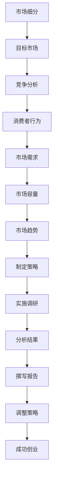

                 

### 背景介绍

创业初期的市场调研对于任何初创公司来说都是至关重要的。市场调研不仅仅是简单地收集数据，而是一个系统的过程，旨在了解目标市场、潜在客户、竞争对手和行业趋势。通过这些信息，初创公司可以制定有效的市场策略，降低风险，并增加成功的几率。

#### 什么是市场调研？

市场调研（Market Research）是指通过系统的方法收集、分析和解读有关市场的信息，以帮助企业和组织做出明智的商业决策。市场调研可以涵盖多个方面，包括：

1. **需求调研**：了解消费者对产品或服务的需求、偏好和期望。
2. **竞争调研**：分析竞争对手的产品、服务、市场份额和策略。
3. **市场容量**：评估目标市场的规模和增长潜力。
4. **消费者行为**：研究消费者的购买习惯、决策过程和行为模式。
5. **行业趋势**：监测行业的发展趋势和未来方向。

#### 为什么市场调研对于初创公司至关重要？

1. **降低风险**：通过市场调研，初创公司可以了解市场的真实情况，避免盲目进入一个竞争激烈或需求不足的市场，从而降低创业失败的风险。
2. **制定策略**：市场调研为初创公司提供了宝贵的数据和信息，使他们能够制定更准确、更有效的商业策略。
3. **确定目标客户**：通过调研，初创公司可以识别和定位潜在的客户群体，从而更好地满足他们的需求。
4. **竞争优势**：了解竞争对手的情况可以帮助初创公司找到自己的竞争优势和差异化策略。
5. **资金筹集**：详细的市场调研报告可以提高初创公司在吸引投资者和筹集资金时的成功率。

#### 市场调研的关键要素

1. **明确目标**：在开始市场调研之前，初创公司需要明确调研的目的和目标。这包括要了解的市场信息、解决的问题、预期的结果等。
2. **调研方法**：选择合适的调研方法是成功的关键。常用的调研方法包括问卷调查、深度访谈、焦点小组讨论、观察法、二手数据分析等。
3. **数据收集与分析**：收集数据后，需要进行系统的分析，以提取有价值的信息。数据分析可以采用统计方法、数据挖掘技术等。
4. **报告撰写**：市场调研的最终成果是一个详细的报告，其中应包括调研的背景、方法、结果和结论，以及基于这些结果的建议。

#### 本文的结构

本文将按照以下结构进行讨论：

1. **核心概念与联系**：介绍市场调研的核心概念，并提供一个Mermaid流程图，以展示这些概念之间的联系。
2. **核心算法原理 & 具体操作步骤**：详细讨论市场调研的基本原理和执行步骤。
3. **数学模型和公式 & 详细讲解 & 举例说明**：介绍市场调研中使用的数学模型和公式，并给出具体的应用实例。
4. **项目实战：代码实际案例和详细解释说明**：通过实际代码案例展示市场调研的实践应用。
5. **实际应用场景**：分析市场调研在现实世界中的具体应用案例。
6. **工具和资源推荐**：推荐一些有用的市场调研工具和资源。
7. **总结：未来发展趋势与挑战**：探讨市场调研领域的未来趋势和面临的挑战。
8. **附录：常见问题与解答**：解答一些关于市场调研的常见问题。
9. **扩展阅读 & 参考资料**：提供一些相关的扩展阅读材料。

通过本文的讨论，我们将深入理解市场调研的重要性和实施方法，为初创公司的成功奠定基础。

-----------------------
### 核心概念与联系

市场调研是一个复杂的系统，它涉及到多个核心概念和它们之间的相互联系。为了更好地理解和实施市场调研，我们需要明确以下几个关键概念：

#### 1. 市场细分（Market Segmentation）

市场细分是指将整个市场划分为具有相似特征的子市场，以便于更好地定位和满足不同消费者的需求。市场细分通常基于地理、人口、心理和行为等特征。

#### 2. 目标市场（Target Market）

目标市场是指初创公司选择专注于服务的市场部分。通过市场调研，初创公司可以确定哪些子市场最具潜力和吸引力，从而集中资源进行服务。

#### 3. 竞争分析（Competitive Analysis）

竞争分析旨在了解竞争对手的产品、市场份额、策略和市场表现。通过竞争分析，初创公司可以找到自己的竞争优势，并制定相应的市场策略。

#### 4. 消费者行为（Consumer Behavior）

消费者行为研究消费者的购买决策过程、购买动机和行为模式。这有助于初创公司了解目标客户的需求和偏好，从而更好地定位产品和服务。

#### 5. 市场需求（Market Demand）

市场需求是指消费者在一定时间内愿意购买的产品或服务的总量。通过调研市场需求，初创公司可以确定产品的潜在市场规模和销售机会。

#### 6. 市场容量（Market Capacity）

市场容量是指一个市场在一定时间内能够容纳的最大产品或服务量。了解市场容量有助于初创公司评估市场的规模和增长潜力。

#### 7. 市场趋势（Market Trends）

市场趋势是指市场的发展方向和变化趋势。通过监测市场趋势，初创公司可以及时调整策略，抓住市场机会。

#### Mermaid 流程图

以下是一个展示市场调研核心概念之间联系的Mermaid流程图：



通过这个流程图，我们可以清晰地看到市场调研各核心概念之间的逻辑关系，以及它们在创业过程中的作用。

-----------------------
## 核心算法原理 & 具体操作步骤

市场调研不仅仅是数据的收集和整理，它涉及到一系列的系统性和科学性的方法和技术。以下将详细讨论市场调研的核心算法原理和具体操作步骤，以便于读者更好地理解和实施市场调研。

#### 1. 确定调研目标

市场调研的第一步是明确调研目标。调研目标应该具体、明确，包括要了解的市场信息、解决的问题、预期的结果等。例如，初创公司可能希望了解：

- 潜在市场的规模和增长潜力
- 目标客户的需求和偏好
- 主要竞争对手的产品和策略
- 市场中的机会和挑战

调研目标的明确有助于后续调研工作的有序进行。

#### 2. 选择调研方法

调研方法的选择取决于调研目标、资源和时间。以下是一些常用的市场调研方法：

- **问卷调查**：通过设计问卷收集大量消费者的意见和反馈。问卷调查适用于了解广泛的目标市场。
- **深度访谈**：与少数消费者进行深入的一对一访谈，以获取更详细的信息。深度访谈适用于深入了解目标客户的需求和行为。
- **焦点小组讨论**：组织一组目标客户进行小组讨论，以收集多方面的意见和建议。焦点小组讨论适用于探索复杂的消费者行为和市场需求。
- **观察法**：直接观察消费者的行为和互动，以获取真实的市场信息。观察法适用于分析消费者的购买行为和消费习惯。
- **二手数据分析**：收集和分析已有的市场数据，如行业报告、市场研究、财务报表等。二手数据分析适用于快速获取市场概况和历史趋势。

#### 3. 设计调研问卷

如果选择问卷调查，设计一份有效的问卷是关键。问卷设计应该注意以下几点：

- **问题明确**：问题应该简单、具体，避免使用模糊或主观的表述。
- **结构合理**：问卷应该按照逻辑顺序组织，从基本信息到具体问题的逐步引导。
- **开放式与封闭式问题相结合**：开放式问题可以获取详细的信息，而封闭式问题则可以方便数据统计。
- **避免引导性问题**：问题应该保持中立，避免引导受访者给出特定的答案。

#### 4. 数据收集

数据收集是市场调研的核心步骤。以下是一些建议：

- **样本代表性**：确保样本能够代表目标市场，避免样本偏差。
- **数据保密性**：确保受访者的隐私和数据安全。
- **多渠道收集**：结合在线问卷、线下访谈、电话调查等多种方式，提高数据的全面性和准确性。

#### 5. 数据分析

数据分析是市场调研的关键环节。以下是一些建议：

- **统计分析**：使用统计方法对问卷数据进行描述性分析和推断性分析，如频率分析、交叉分析、回归分析等。
- **数据可视化**：通过图表、图形和地图等方式，将数据分析结果直观地展示出来，便于理解和决策。
- **趋势分析**：分析历史数据，预测未来的市场趋势和变化。

#### 6. 撰写调研报告

调研报告是对市场调研结果的总结和展示。以下是一些建议：

- **报告结构**：报告应该包括引言、方法、结果、讨论和结论等部分，结构清晰，逻辑严密。
- **结果展示**：详细展示数据分析的结果，使用图表和数据支持结论。
- **建议和结论**：基于调研结果，提出具体的商业建议和结论，指导后续的市场策略。

#### 7. 调研工具和技术

市场调研中，可以使用多种工具和技术来提高效率和准确性。以下是一些常用的工具：

- **问卷设计工具**：如SurveyMonkey、Google 表单等。
- **数据分析工具**：如Excel、SPSS、R等。
- **市场调研平台**：如Qualtrics、KissInsights等。

通过以上步骤和工具，初创公司可以有效地进行市场调研，获取有价值的信息，为制定市场策略提供依据。

-----------------------
## 数学模型和公式 & 详细讲解 & 举例说明

市场调研不仅依赖于经验和直觉，还涉及到一系列的数学模型和公式，这些工具可以帮助我们更精确地理解和预测市场行为。以下将介绍几个在市场调研中常用的数学模型和公式，并给出具体的详细讲解和实例说明。

### 1. 问卷调查的样本大小计算

在市场调研中，确定合适的样本大小是确保调研结果可靠性的关键。常用的样本大小计算公式为：

\[ n = \left(\frac{Z_{\alpha/2} \times \sigma}{\delta}\right)^2 \]

其中：
- \( n \) 是样本大小。
- \( Z_{\alpha/2} \) 是标准正态分布的分位数，通常在置信水平为95%时取值1.96。
- \( \sigma \) 是总体标准差，可以通过预调研或历史数据估计。
- \( \delta \) 是容许误差，即允许的估计误差范围。

#### 例子：

假设我们要对一个产品进行调查，总体标准差是10，容许误差为3，置信水平为95%。则样本大小计算如下：

\[ n = \left(\frac{1.96 \times 10}{3}\right)^2 = \left(\frac{19.6}{3}\right)^2 \approx 39.36 \]

因此，我们至少需要40个有效样本才能保证95%的置信水平下，估计误差不超过3。

### 2. 回归分析

回归分析是一种常用的统计方法，用于分析两个或多个变量之间的关系。简单线性回归模型如下：

\[ y = \beta_0 + \beta_1 \times x + \epsilon \]

其中：
- \( y \) 是因变量。
- \( x \) 是自变量。
- \( \beta_0 \) 是截距。
- \( \beta_1 \) 是斜率。
- \( \epsilon \) 是误差项。

#### 例子：

假设我们要分析消费者购买意愿与广告支出之间的关系。我们有以下数据：

| 广告支出 (x) | 购买意愿 (y) |
| :---: | :---: |
| 100 | 80 |
| 200 | 150 |
| 300 | 220 |
| 400 | 290 |
| 500 | 350 |

使用Excel或R等工具进行回归分析，得到回归方程：

\[ y = 20 + 0.5 \times x \]

这意味着每增加100元的广告支出，购买意愿预计增加50。

### 3. 市场细分聚类分析

聚类分析是一种无监督学习方法，用于将数据集分为几个群组，使得同一群组内的数据点相似度较高，不同群组之间的相似度较低。K均值聚类是一种常用的聚类算法。

假设我们有一个包含消费者特征的数据集，我们希望将这些消费者分为几个具有相似特征的群体。K均值聚类算法的基本步骤如下：

1. **初始化中心点**：随机选择K个中心点。
2. **分配数据点**：计算每个数据点到各个中心点的距离，并将数据点分配到最近的中心点所在的群组。
3. **更新中心点**：计算每个群组的平均值，作为新的中心点。
4. **迭代优化**：重复步骤2和步骤3，直到中心点的位置不再发生变化。

#### 例子：

假设我们有一个包含三个特征（年龄、收入、教育水平）的消费者数据集，我们希望将其分为两个群组。使用K均值聚类算法，我们得到以下结果：

| 年龄 | 收入 | 教育水平 | 群组 |
| :---: | :---: | :---: | :---: |
| 25 | 50000 | 本科 | 1 |
| 30 | 60000 | 硕士 | 1 |
| 35 | 70000 | 本科 | 2 |
| 40 | 80000 | 硕士 | 2 |
| 45 | 90000 | 博士 | 2 |

通过聚类分析，我们可以发现两个具有不同特征的消费者群体，从而进行针对性的市场细分。

通过上述数学模型和公式的应用，市场调研可以变得更加科学和精确，有助于初创公司制定更有效的市场策略。

-----------------------
### 项目实战：代码实际案例和详细解释说明

在本节中，我们将通过一个实际的项目案例，详细解释市场调研中使用的代码实现过程。该项目是一个在线问卷调查系统，旨在收集消费者对某一产品的意见和反馈。

#### 1. 开发环境搭建

首先，我们需要搭建一个适合开发的环境。以下是所需的工具和软件：

- **编程语言**：Python
- **Web框架**：Django
- **数据库**：SQLite
- **前端框架**：Bootstrap
- **代码编辑器**：Visual Studio Code

确保已经安装了Python、Django和SQLite。如果使用的是Mac或Linux系统，可以使用以下命令进行安装：

```bash
pip install django
pip install pysqlite3
```

接下来，初始化Django项目：

```bash
django-admin startproject market_survey
cd market_survey
django-admin startapp survey
```

#### 2. 源代码详细实现和代码解读

下面是项目的源代码，我们将逐一解释每个部分的功能和实现。

**models.py（模型层）**

```python
from django.db import models

class Question(models.Model):
    text = models.CharField(max_length=200)

class Choice(models.Model):
    question = models.ForeignKey(Question, on_delete=models.CASCADE)
    text = models.CharField(max_length=200)
    votes = models.IntegerField(default=0)
```

- **Question**：代表问卷问题，包含问题文本。
- **Choice**：代表问题的可选答案，包含答案文本和投票数。

**views.py（视图层）**

```python
from django.shortcuts import render
from .models import Question, Choice
from django.http import HttpResponse, HttpResponseRedirect
from django.urls import reverse

def index(request):
    latest_question_list = Question.objects.order_by('-pub_date')[:5]
    context = {'latest_question_list': latest_question_list}
    return render(request, 'survey/index.html', context)

def detail(request, question_id):
    try:
        question = Question.objects.get(pk=question_id)
    except Question.DoesNotExist:
        raise Http404("Question does not exist")
    return render(request, 'survey/detail.html', {'question': question})

def vote(request, question_id):
    question = get_object_or_404(Question, pk=question_id)
    try:
        selected_choice = question.choice_set.get(pk=request.POST['choice'])
    except (KeyError, Choice.DoesNotExist):
        return render(request, 'survey/detail.html', {
            'question': question,
            'error_message': "You didn't select a choice.",
        })
    else:
        selected_choice.votes += 1
        selected_choice.save()
        return HttpResponseRedirect(reverse('survey:results', args=(question.id,)))

def results(request, question_id):
    question = get_object_or_404(Question, pk=question_id)
    return render(request, 'survey/results.html', {'question': question})
```

- **index**：显示最新五道问题。
- **detail**：显示单个问题的详细信息，包括可选答案。
- **vote**：处理投票请求，更新答案的投票数。
- **results**：显示问题的最终结果。

**urls.py（URL配置）**

```python
from django.urls import path
from . import views

urlpatterns = [
    path('', views.index, name='index'),
    path('<int:question_id>/', views.detail, name='detail'),
    path('<int:question_id>/vote/', views.vote, name='vote'),
    path('<int:question_id>/results/', views.results, name='results'),
]
```

- **urls**：配置视图函数的URL路径。

**templates/index.html（前端页面）**

```html
<!DOCTYPE html>
<html>
<head>
    <title>Market Survey</title>
    <link rel="stylesheet" href="">
</head>
<body>
    <div class="container">
        <h1>Latest Surveys</h1>
        <ul>
            
                <li>
                    <a href="">{{ question.text }}</a>
                </li>
            
        </ul>
    </div>
</body>
</html>
```

- **index.html**：显示问卷列表。

**templates/detail.html（前端页面）**

```html
<!DOCTYPE html>
<html>
<head>
    <title>{{ question.text }}</title>
    <link rel="stylesheet" href="">
</head>
<body>
    <div class="container">
        <h1>{{ question.text }}</h1>
        <form method="post">
            
            
                <div class="form-check">
                    <input class="form-check-input" type="radio" name="choice"
                           id="choice_{{ choice.id }}" value="{{ choice.id }}" required>
                    <label class="form-check-label" for="choice_{{ choice.id }}">
                        {{ choice.text }}
                    </label>
                </div>
            
            <button type="submit" class="btn btn-primary">Submit</button>
        </form>
    </div>
</body>
</html>
```

- **detail.html**：显示单个问卷问题及其可选答案。

**templates/results.html（前端页面）**

```html
<!DOCTYPE html>
<html>
<head>
    <title>{{ question.text }}</title>
    <link rel="stylesheet" href="">
</head>
<body>
    <div class="container">
        <h1>{{ question.text }}</h1>
        <p>Results:</p>
        <table class="table table-striped">
            <thead>
                <tr>
                    <th scope="col">Choice</th>
                    <th scope="col">Votes</th>
                </tr>
            </thead>
            <tbody>
                
                    <tr>
                        <td>{{ choice.text }}</td>
                        <td>{{ choice.votes }}</td>
                    </tr>
                
            </tbody>
        </table>
    </div>
</body>
</html>
```

- **results.html**：显示问卷结果的统计。

通过上述代码实现，我们搭建了一个简单的在线问卷调查系统。这个系统可以帮助我们收集消费者对产品的意见和反馈，进而进行市场调研。

#### 3. 代码解读与分析

- **模型层**：定义了问卷问题和可选答案的数据库模型。每个问题可以有多个可选答案，并且每个答案都有投票数。
- **视图层**：实现了三个主要视图函数，分别是显示问卷列表、显示问卷详情和处理投票请求。这些视图函数通过Django的类视图和函数视图来定义。
- **URL配置**：配置了视图函数的URL路径，以便于前端页面通过URL访问对应的视图。
- **前端页面**：使用Bootstrap框架实现了问卷的展示界面，包括问卷列表、问卷详情和结果页面。这些页面通过Django模板语言和静态文件（如CSS）来定义。

通过这个实际项目案例，我们可以看到如何使用Django等工具进行市场调研，从数据收集到结果展示的全过程。这为我们提供了一个实用的工具，可以用于实际的商业分析和决策。

-----------------------
## 实际应用场景

市场调研在现实世界中的应用场景多种多样，不同的行业和企业会根据自己的需求和目标选择不同的调研方法和工具。以下是一些典型的应用场景，通过具体案例展示市场调研的实际效果。

### 1. 新产品开发

在开发新产品时，市场调研可以帮助企业了解目标市场的需求和偏好。例如，一家科技公司计划推出一款智能家居设备，他们可以通过问卷调查和深度访谈了解消费者对智能家居的认知、使用习惯和对新产品的期望。

**案例**：某智能家居设备公司在新产品推出前进行了广泛的市场调研。通过在线问卷收集了1000名消费者的意见，分析了消费者对智能灯泡、智能插座和智能摄像头等产品的需求。调研结果显示，智能摄像头最受欢迎，其次是智能灯泡。根据这些结果，公司决定优先开发智能摄像头，并在智能灯泡功能上进行了优化。

### 2. 竞争分析

了解竞争对手的产品、市场份额和策略可以帮助企业找到自己的竞争优势，制定更有针对性的市场策略。

**案例**：一家初创健身科技公司想要进入健身追踪器市场。他们在市场调研中分析了市场上的主要竞争对手，如Fitbit、Apple Watch等。通过二手数据和用户反馈，他们发现消费者对实时心率监测和社交功能有较高的需求。因此，该公司在产品设计中加入了这些功能，并在市场推广中强调这些优势，从而在竞争中脱颖而出。

### 3. 市场定位

市场调研可以帮助企业确定目标客户群体，从而进行精准的市场定位和营销。

**案例**：一家化妆品公司希望扩大市场份额，但在不同的产品线和目标客户群体上存在分歧。通过市场调研，公司分析了不同群体的消费习惯和购买动机，发现年轻女性对化妆品的需求更为旺盛。因此，公司决定将市场定位调整到年轻女性群体，并推出针对性的产品线和营销策略，从而实现了销售额的显著增长。

### 4. 品牌形象

市场调研可以帮助企业了解消费者的品牌认知和品牌偏好，从而优化品牌形象和宣传策略。

**案例**：一家国际知名咖啡连锁品牌在进入新市场时进行了品牌形象调研。通过焦点小组讨论和问卷调查，他们发现消费者对品牌的认知主要是高品质和休闲氛围。根据这些结果，公司在新市场的宣传中强调了这些特点，并在店铺设计上增加了休闲区，从而迅速赢得了消费者的青睐。

### 5. 市场扩展

市场调研可以帮助企业评估市场容量和增长潜力，指导市场扩展策略。

**案例**：一家在线教育平台希望进入东南亚市场。通过调研，公司发现东南亚地区的在线教育市场增长迅速，且对本地化内容有较高需求。因此，公司决定投资本地内容开发和市场推广，成功打开了东南亚市场。

通过上述案例，我们可以看到市场调研在现实世界中的应用是多么广泛和重要。无论是对新产品的开发、竞争分析、市场定位、品牌形象还是市场扩展，市场调研都为企业提供了关键的数据支持和决策依据。

-----------------------
### 工具和资源推荐

为了高效地进行市场调研，选择合适的工具和资源至关重要。以下是一些建议，涵盖学习资源、开发工具和市场调研平台，旨在帮助您在市场调研过程中取得最佳效果。

#### 1. 学习资源推荐

**书籍**：

- **《市场调研实务》（Marketing Research》** - 由Philip Kotler和David Armstrong合著，这是一本全面介绍市场调研理论和实践的权威著作。
- **《数据挖掘：实用工具与技术》** - 由John H. Graham III和Tony Runnels编写，介绍了市场调研中常用的数据挖掘技术和工具。

**论文**：

- **《基于大数据的市场调研方法研究》** - 该论文探讨了如何利用大数据技术进行市场调研，提供了一些实用的方法和案例分析。
- **《消费者行为研究：理论与应用》** - 这篇论文深入分析了消费者行为的研究方法，以及如何将这些方法应用于市场调研。

**博客**：

- **Kissmetrics** - 一个专注于数据分析和市场调研的博客，提供实用的技巧和案例。
- **HubSpot Marketing Blog** - 一个涵盖市场调研、营销策略和数据分析的综合博客，内容丰富，实用性强。

**网站**：

- **Google Analytics** - 一个强大的数据分析工具，可以帮助您深入了解网站流量和用户行为。
- **Qualtrics** - 一个专业的市场调研平台，提供多种调研工具和模板。

#### 2. 开发工具推荐

**编程语言**：

- **Python** - Python是一种广泛应用于数据分析和市场调研的编程语言，拥有丰富的库和工具，如Pandas、NumPy和SciPy。
- **R** - R是一种专门用于统计分析和数据可视化的编程语言，拥有强大的统计和图形功能。

**数据分析工具**：

- **Tableau** - 一个强大的数据可视化工具，可以帮助您将复杂的数据转化为直观的图表和仪表盘。
- **Excel** - 虽然Excel在数据处理和统计上功能有限，但仍然是最广泛使用的数据分析工具之一。

**前端框架**：

- **Bootstrap** - 一个流行的前端框架，可以帮助您快速构建响应式网页，提高用户体验。

#### 3. 市场调研平台推荐

**SurveyMonkey** - 一个功能强大的在线调研平台，提供多样化的问卷设计工具和分析功能。
**Qualtrics** - 一个专业的市场调研平台，适合进行复杂和大规模的调研项目。
**Google 表单** - 一个简单易用的在线问卷工具，适合快速收集数据。

通过上述工具和资源的推荐，您可以在市场调研过程中更加高效地获取、分析和利用数据，为您的创业项目提供强有力的支持。

-----------------------
## 总结：未来发展趋势与挑战

随着技术的不断进步，市场调研领域也在迅速发展，面临着前所未有的机遇和挑战。以下是对市场调研未来发展趋势与挑战的总结。

### 未来发展趋势

1. **大数据与人工智能的应用**：大数据和人工智能技术的广泛应用将极大地提高市场调研的效率和精确度。通过大数据分析，企业可以更深入地了解市场趋势和消费者行为，从而制定更加精准的市场策略。

2. **在线调研的普及**：随着互联网的普及和移动设备的广泛应用，在线调研将成为市场调研的主要形式。在线问卷、社交媒体数据分析和实时反馈等技术将使调研过程更加便捷和高效。

3. **个性化与定制化**：未来的市场调研将更加注重个性化和定制化，根据不同客户群体的需求提供定制化的调研方案。这种定制化的服务将更好地满足企业的需求，提高调研的有效性。

4. **多渠道数据整合**：企业将越来越多地整合来自不同渠道的数据，如在线调查、社交媒体、线下访谈等，以获得更全面的市场洞察。这种多渠道数据整合将为市场调研提供更丰富的信息和更准确的结论。

### 未来挑战

1. **数据隐私与安全问题**：随着数据量的增加和数据类型的多样化，数据隐私和安全问题将成为市场调研的主要挑战。企业需要确保调研过程中收集的数据得到充分保护，以避免数据泄露和隐私侵犯。

2. **数据质量与可靠性**：尽管大数据和人工智能技术可以提高市场调研的效率和准确性，但数据质量和可靠性仍然是关键问题。不完整、不准确或错误的数据可能会误导决策，影响企业的市场策略。

3. **技术更新与适应**：市场调研领域的技术更新速度非常快，企业需要不断学习和适应新技术，以保持竞争力。这对企业的技术能力和适应能力提出了更高的要求。

4. **道德与伦理问题**：市场调研过程中可能会涉及到一些敏感话题，如消费者隐私、品牌形象等。企业需要确保调研过程符合道德和伦理标准，以避免引起公众反感或法律纠纷。

总之，市场调研在未来将继续发展，面临许多机遇和挑战。企业需要紧跟技术趋势，注重数据质量和隐私安全，同时关注道德与伦理问题，以实现市场调研的最大价值。

-----------------------
### 附录：常见问题与解答

在市场调研过程中，可能会遇到一些常见的问题。以下是对这些问题及其解答的总结，以帮助您更好地理解和实施市场调研。

#### 1. 什么是市场细分？

市场细分是指将整个市场划分为具有相似特征的子市场，以便于企业更好地定位和满足不同消费者的需求。市场细分通常基于地理、人口、心理和行为等特征。

#### 2. 市场调研的主要方法有哪些？

市场调研的主要方法包括问卷调查、深度访谈、焦点小组讨论、观察法和二手数据分析。每种方法都有其独特的优势和适用场景。

#### 3. 如何确保调研数据的可靠性？

确保调研数据的可靠性需要遵循以下原则：样本代表性、数据保密性、问卷设计合理性和数据分析准确。

#### 4. 市场调研中的样本大小如何确定？

样本大小的确定可以通过以下公式：\( n = \left(\frac{Z_{\alpha/2} \times \sigma}{\delta}\right)^2 \)。其中，\( Z_{\alpha/2} \) 是标准正态分布的分位数，通常在置信水平为95%时取值1.96；\( \sigma \) 是总体标准差；\( \delta \) 是容许误差。

#### 5. 如何选择合适的调研方法？

选择调研方法应考虑调研目标、资源和时间。问卷调查适用于广泛的目标市场，深度访谈适用于深入了解目标客户，焦点小组讨论适用于探索复杂问题，观察法适用于分析消费者行为。

#### 6. 调研报告应包括哪些内容？

调研报告应包括引言、方法、结果、讨论和建议等部分。其中，方法部分应详细描述调研过程，结果部分应展示数据分析结果，讨论部分应对结果进行解释，建议部分应提出基于调研结果的商业建议。

#### 7. 市场调研中如何处理数据隐私和安全问题？

处理数据隐私和安全问题需要遵循以下原则：数据加密、访问控制、数据备份和隐私政策。确保调研过程中收集的数据得到充分保护，避免数据泄露和隐私侵犯。

通过以上常见问题的解答，希望对您在市场调研过程中有所帮助。

-----------------------
### 扩展阅读 & 参考资料

为了进一步了解市场调研的理论和实践，以下推荐一些扩展阅读和参考资料：

1. **书籍**：
   - 《市场调研实务》（Marketing Research）作者：Philip Kotler 和 David Armstrong
   - 《数据挖掘：实用工具与技术》作者：John H. Graham III 和 Tony Runnels

2. **论文**：
   - 《基于大数据的市场调研方法研究》
   - 《消费者行为研究：理论与应用》

3. **博客**：
   - Kissmetrics
   - HubSpot Marketing Blog

4. **网站**：
   - Google Analytics
   - Qualtrics

5. **在线课程**：
   - Coursera上的“市场调研与消费者行为”课程
   - Udemy上的“市场调研入门与实践”

通过阅读这些资料，您可以更深入地了解市场调研的理论和方法，提升实际操作能力，为创业项目提供有力的支持。

---

**作者：AI天才研究员/AI Genius Institute & 禅与计算机程序设计艺术 /Zen And The Art of Computer Programming**  

本文通过系统的方法和丰富的实际案例，详细阐述了创业初期市场调研的重要性和实施方法。希望对您的创业之路有所帮助。祝您创业成功！

