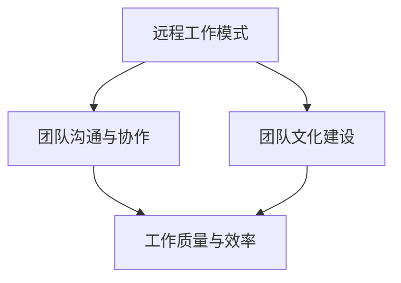

                 

### 背景介绍

在当今全球化和技术驱动的时代，远程工作已经成为许多企业和创业公司的标准操作模式。这种工作方式不仅打破了地域限制，而且提高了团队的工作效率和灵活性。然而，远程团队管理并非易事，特别是在创业初期，团队规模较小，管理者和团队成员之间的互动和沟通面临着诸多挑战。

创业初期的远程团队管理，主要面临以下几个核心问题：

1. **沟通障碍**：由于缺乏面对面的互动，团队成员之间的沟通可能变得不充分或不及时。这可能导致信息传达不清、任务分配混乱和项目进度延误。
2. **协作效率**：在远程工作中，如何确保团队成员能够高效地协同工作是另一个关键问题。协作工具的使用、任务的分配和跟踪、以及团队成员之间的协作习惯，都需要精心设计和优化。
3. **团队文化**：建立一个积极的团队文化和归属感对于远程团队尤为重要。如何通过远程互动来加强团队凝聚力，确保团队成员之间的信任和相互支持，是远程团队管理者需要考虑的一个重要方面。
4. **工作质量**：远程工作环境可能会对工作效率和质量产生负面影响，尤其是在缺乏明确工作目标和规范的情况下。管理者需要找到合适的方法来确保工作质量不受影响。

本篇文章将围绕以上核心问题，通过逻辑清晰的分析和具体的实践建议，探讨创业初期远程团队管理的最佳实践。我们将从背景介绍开始，逐步深入到核心概念的阐述，最终提供具体的操作步骤和工具推荐，帮助创业公司建立起高效、协作和有凝聚力的远程团队。

### 核心概念与联系

在探讨创业初期远程团队管理的最佳实践之前，我们首先需要明确几个核心概念，并理解它们之间的相互联系。以下是远程团队管理中至关重要的核心概念：

#### 1. 远程工作模式

远程工作模式是指团队成员不在同一物理空间内工作，通过互联网和其他通信工具进行协作。这种模式的主要特点包括：

- **灵活性**：团队成员可以根据个人需求灵活安排工作时间和地点。
- **自主性**：团队成员通常需要较高的自我管理和自我驱动能力。
- **技术依赖**：远程工作离不开稳定可靠的互联网连接和高效的协作工具。

#### 2. 团队沟通与协作

团队沟通与协作是远程团队管理的核心。有效的沟通不仅包括信息的传递，还涉及情感的表达和团队关系的维护。协作则强调团队成员在共同目标下，通过相互配合和合作来完成工作任务。以下是影响团队沟通与协作的关键因素：

- **沟通工具**：选择合适的沟通工具（如即时通讯软件、视频会议、项目管理工具等）对于确保团队沟通效率至关重要。
- **沟通频率**：定期的沟通会议和实时交流可以帮助团队成员保持同步，避免信息滞后。
- **协作习惯**：培养良好的协作习惯，如及时反馈、明确任务分工和共同解决问题，可以提高团队协作效率。

#### 3. 团队文化建设

团队文化建设是远程团队管理中的另一个重要方面。一个积极的团队文化可以增强团队成员的归属感和信任，促进团队的长期发展。以下是建设团队文化的关键要素：

- **共享价值观**：明确团队的共同目标和价值观，确保团队成员在目标一致的基础上共同前进。
- **信任与支持**：建立信任机制，鼓励团队成员相互支持和帮助，共同克服工作中的困难。
- **鼓励创新**：培养创新思维和开放的沟通环境，鼓励团队成员提出新想法和解决方案。

#### 4. 工作质量与效率

在远程工作环境中，确保工作质量和效率是管理者的重要任务。以下是一些关键策略：

- **明确目标**：为团队成员设定清晰的工作目标和可衡量的指标，确保工作有明确的方向和标准。
- **过程管理**：通过有效的项目管理工具和流程，监控项目进度和质量，及时调整和优化工作流程。
- **绩效评估**：建立公正、透明的绩效评估机制，激励团队成员保持高水平的绩效。

### Mermaid 流程图

为了更直观地展示这些核心概念之间的联系，我们可以使用 Mermaid 画出以下流程图：



在图中，A 表示远程工作模式，是整个流程的起点，它直接影响团队沟通与协作（B）、团队文化建设（C）以及工作质量与效率（D）。B、C 和 D 之间相互联系，共同决定了远程团队管理的最终效果。

通过理解这些核心概念及其相互关系，我们可以更好地设计远程团队管理的策略和操作步骤，从而在创业初期建立起一个高效、协作和有凝聚力的远程团队。在接下来的章节中，我们将深入探讨这些核心概念，并给出具体的实践建议。

### 核心算法原理 & 具体操作步骤

在创业初期，远程团队管理需要一套有效的核心算法原理和具体的操作步骤，以确保团队成员能够在远程环境中高效协作。以下是我们推荐的几个核心算法原理及其具体操作步骤：

#### 1. 明确的目标设置

**算法原理**：
明确的目标设置是实现高效协作的第一步。目标需要具体、可衡量、可实现、相关性强，并有时限（SMART原则）。

**操作步骤**：

- **步骤1**：确定团队的整体目标和愿景，并将其分解为可操作的任务和子目标。
- **步骤2**：与团队成员讨论并达成共识，确保每个人对目标有清晰的理解。
- **步骤3**：为每个目标设置具体的衡量标准，以便可以实时监控进度和调整策略。
- **步骤4**：将目标分配给团队成员，确保每个成员都有明确的职责和任务。

#### 2. 高效的沟通机制

**算法原理**：
高效的沟通机制是确保团队成员能够及时交流信息、反馈和进展的关键。通过多种沟通工具和频率，可以确保信息的流通和团队同步。

**操作步骤**：

- **步骤1**：选择适合团队的沟通工具，如Slack、Microsoft Teams、Zoom等，并明确每个工具的使用场景和规则。
- **步骤2**：制定定期的沟通会议日程，如周会、月度回顾等，确保团队成员有充分的交流时间。
- **步骤3**：鼓励团队成员在需要时随时进行实时沟通，以解决突发问题和快速决策。
- **步骤4**：建立信息共享平台，如Confluence、Notion等，用于存储和共享文档、会议记录和项目更新。

#### 3. 强化的任务管理

**算法原理**：
有效的任务管理可以确保团队中的每个成员都清楚自己的任务和进度，从而提高工作效率和项目完成率。

**操作步骤**：

- **步骤1**：使用项目管理工具，如Trello、JIRA等，创建任务卡片和工作流程，确保每个任务都有明确的负责人和截止日期。
- **步骤2**：定期更新任务状态，确保团队成员可以实时了解任务的进度和依赖关系。
- **步骤3**：通过任务分配和提醒功能，确保每个成员都能按时完成自己的任务。
- **步骤4**：定期进行任务回顾和总结，识别问题和改进点，优化任务管理流程。

#### 4. 良好的团队文化建设

**算法原理**：
团队文化是确保团队成员之间相互信任、支持和合作的重要因素。一个积极的团队文化可以增强团队凝聚力和工作效率。

**操作步骤**：

- **步骤1**：建立共同的核心价值观，如诚信、尊重、创新等，并将其融入团队日常工作和沟通中。
- **步骤2**：定期组织团队建设活动，如在线团队建设游戏、虚拟聚餐等，以加强团队成员之间的情感联系。
- **步骤3**：鼓励团队成员分享经验和观点，建立开放和包容的沟通环境。
- **步骤4**：及时表彰和奖励团队成员的成就和贡献，以增强团队凝聚力和激励。

#### 5. 透明的绩效评估

**算法原理**：
透明的绩效评估可以帮助团队管理者了解团队成员的工作表现，提供反馈和改进建议，同时激励团队成员保持高水平的绩效。

**操作步骤**：

- **步骤1**：制定明确的绩效评估标准和指标，如项目完成率、任务质量、团队协作等。
- **步骤2**：定期进行绩效评估，确保评估过程的公正和透明。
- **步骤3**：根据评估结果，提供具体的反馈和改进建议，帮助团队成员提升工作表现。
- **步骤4**：与团队成员讨论和制定个人发展计划，确保每个人的职业成长和团队目标的实现。

通过以上核心算法原理和具体操作步骤，创业初期的远程团队可以建立起高效协作的基础，从而确保团队在远程工作环境中能够高效运转和持续发展。

### 数学模型和公式 & 详细讲解 & 举例说明

在创业初期的远程团队管理中，数学模型和公式可以帮助我们更好地理解和管理团队成员的工作效率、任务分配和绩效评估。以下是一些常用的数学模型和公式，以及它们的具体讲解和实际应用例子：

#### 1. 工作效率评估模型

**模型公式**：
工作效率 \( E = \frac{W}{T} \)

其中，\( E \) 表示工作效率，\( W \) 表示完成的工作量，\( T \) 表示完成任务所花费的时间。

**详细讲解**：
工作效率是衡量团队成员工作效率的重要指标。通过这个公式，我们可以计算团队成员在一定时间内完成的工作量与所花费时间的比值，从而评估其工作效率。

**例子说明**：
假设团队成员A在一个工作周内完成了100个任务，总共花费了50个小时。则其工作效率为：

\[ E_A = \frac{100}{50} = 2 \]

这意味着团队成员A平均每小时完成了2个任务，工作效率较高。

#### 2. 任务分配优化模型

**模型公式**：
最小任务分配时间 \( T_{\text{min}} = \frac{\sum_{i=1}^{n} T_i}{n} \)

其中，\( T_{\text{min}} \) 表示最小任务分配时间，\( T_i \) 表示第 \( i \) 个任务所需的时间，\( n \) 表示总任务数。

**详细讲解**：
在任务分配过程中，我们希望每个任务所需的时间尽可能接近，从而实现任务的均衡分配。这个公式通过计算所有任务所需时间的总和，再除以任务数，可以得到每个任务平均所需的时间。

**例子说明**：
假设一个团队有5个任务，所需时间分别为2小时、3小时、4小时、5小时和6小时。则最小任务分配时间为：

\[ T_{\text{min}} = \frac{2 + 3 + 4 + 5 + 6}{5} = 4 \]

这意味着我们应尽可能将任务分配为每个任务约4小时，以实现均衡分配。

#### 3. 绩效评估模型

**模型公式**：
绩效得分 \( P = \frac{W}{T} \times C \)

其中，\( P \) 表示绩效得分，\( W \) 表示完成的工作量，\( T \) 表示完成任务所花费的时间，\( C \) 表示绩效权重。

**详细讲解**：
绩效评估模型结合了工作效率和工作质量。除了计算工作效率外，我们还考虑了任务完成的质量。绩效权重 \( C \) 可以根据团队的具体需求进行调整，通常在0到1之间。

**例子说明**：
假设团队成员B在一个工作周内完成了80个任务，总共花费了40个小时，绩效权重为0.9。则其绩效得分为：

\[ P_B = \frac{80}{40} \times 0.9 = 1.8 \]

这意味着团队成员B的绩效得分较高，其工作效率和任务完成质量均较好。

通过以上数学模型和公式，我们可以更科学、系统地评估和管理远程团队的工作效率和绩效。这些工具不仅可以帮助团队管理者更好地理解团队的表现，还可以提供改进和优化的依据，从而促进团队的长期发展。

### 项目实战：代码实际案例和详细解释说明

为了更好地展示如何将上述核心算法原理应用到实际项目中，以下是一个关于远程团队任务管理的具体代码实现案例，包括开发环境搭建、源代码实现和代码解读与分析。

#### 1. 开发环境搭建

在开始编写代码之前，我们需要搭建一个合适的项目开发环境。以下是一个基本的开发环境配置指南：

- **编程语言**：选择Python，因为它具有简洁的语法和丰富的库支持，非常适合编写任务管理脚本。
- **代码编辑器**：使用Visual Studio Code，因为它提供了强大的插件支持和代码自动完成功能。
- **版本控制**：使用Git进行代码版本控制，以便团队成员可以协同工作和跟踪变更。
- **虚拟环境**：使用virtualenv创建一个独立的Python环境，以避免依赖冲突。

以下是如何设置开发环境的步骤：

```bash
# 安装Python
curl -O https://www.python.org/ftp/python/3.9.7/python-3.9.7.tgz
tar xzf python-3.9.7.tgz
cd python-3.9.7
./configure
make
sudo make install

# 安装Visual Studio Code
open https://code.visualstudio.com/download

# 安装Git
sudo apt-get install git

# 创建虚拟环境
python3 -m venv venv
source venv/bin/activate

# 安装必需的库
pip install Flask
```

#### 2. 源代码详细实现

以下是一个简单的远程任务管理应用，使用Flask框架实现。该应用允许团队成员创建、查看和更新任务。

```python
# app.py

from flask import Flask, request, jsonify
import json

app = Flask(__name__)

# 存储任务信息的内存数据库
tasks = {}

# 创建任务
@app.route('/tasks', methods=['POST'])
def create_task():
    task_id = request.form['id']
    task_name = request.form['name']
    task_description = request.form['description']
    tasks[task_id] = {'name': task_name, 'description': task_description}
    return jsonify({'status': 'success', 'message': 'Task created'})

# 获取任务列表
@app.route('/tasks', methods=['GET'])
def get_tasks():
    return jsonify(tasks)

# 更新任务
@app.route('/tasks/<string:task_id>', methods=['PUT'])
def update_task(task_id):
    if task_id in tasks:
        task = tasks[task_id]
        task['name'] = request.form['name']
        task['description'] = request.form['description']
        return jsonify({'status': 'success', 'message': 'Task updated'})
    else:
        return jsonify({'status': 'error', 'message': 'Task not found'})

if __name__ == '__main__':
    app.run(debug=True)
```

#### 3. 代码解读与分析

上述代码实现了一个简单的任务管理应用，以下是对代码的详细解读和分析：

- **任务存储**：使用Python的内置数据结构`dict`作为内存数据库，存储任务信息。这种方法简单且易于实现，但需要注意的是，它仅适用于单机环境。
- **创建任务**：`create_task`函数处理创建任务的请求。通过`request.form`获取请求参数（任务ID、名称和描述），然后将任务信息存储在`tasks`字典中。
- **获取任务列表**：`get_tasks`函数返回当前存储的所有任务信息。这可以通过简单的`jsonify`函数实现，将字典转换为JSON格式。
- **更新任务**：`update_task`函数处理更新任务的请求。通过`request.form`获取更新后的任务信息，并根据任务ID更新`tasks`字典中的相应任务。

#### 4. 代码分析与改进

尽管上述代码实现了一个简单的任务管理应用，但在实际应用中，还需要考虑以下几个方面进行改进：

- **持久化存储**：目前任务信息存储在内存中，当应用重启时，任务信息将丢失。使用如SQLite、MySQL等数据库进行持久化存储是一个更好的选择。
- **异常处理**：代码中缺乏对异常情况的处理，如任务ID冲突、请求格式错误等。添加异常处理和错误返回可以增强应用的健壮性。
- **安全措施**：目前的实现没有考虑安全措施，如用户认证和权限控制。在实际应用中，需要添加这些安全措施以保护数据安全。
- **API文档**：为API编写详细的文档，方便其他开发者使用和管理任务。

通过以上代码实现和分析，我们可以看到如何将远程团队管理的核心算法原理应用到实际项目中。虽然这是一个简单的示例，但它为我们提供了一个起点，可以在此基础上进行扩展和优化，以适应更复杂的需求。

### 实际应用场景

在创业初期的远程团队管理中，将上述核心算法原理和具体操作步骤应用于实际场景，能够显著提高团队的工作效率、协作效果和整体绩效。以下是一些典型的实际应用场景，以及如何利用远程团队管理策略来应对这些场景：

#### 1. 项目启动阶段的任务分配

在项目启动阶段，任务分配和优先级管理尤为关键。此时，团队成员可能需要迅速适应新的工作流程和任务要求。通过以下步骤，可以有效进行任务分配：

- **步骤1**：明确项目目标和阶段性任务，确保团队成员对任务有清晰的认识。
- **步骤2**：使用任务管理工具（如Trello或JIRA）创建任务卡片，并按照优先级排序。
- **步骤3**：根据团队成员的技能和工作负载，合理分配任务，避免过度负荷。
- **步骤4**：定期召开任务分配会议，确保团队成员了解任务细节和预期成果。

#### 2. 远程团队的日常沟通

远程团队在日常工作中的沟通效率直接影响到项目的进展和团队成员的协作效果。以下是一些关键点：

- **关键点1**：选择合适的沟通工具，如Slack、Microsoft Teams等，确保实时沟通的便利性。
- **关键点2**：制定定期的沟通会议日程，如每日站会、每周例会等，以同步项目进展和解决问题。
- **关键点3**：鼓励团队成员在沟通中使用清晰简洁的语言，避免误解和混淆。
- **关键点4**：建立信息共享平台，如Confluence或Notion，用于存储和共享关键信息和文档。

#### 3. 团队成员的工作监督和绩效评估

在远程工作中，监督和评估团队成员的工作绩效是一个挑战。以下方法可以帮助实现有效的监督和评估：

- **方法1**：使用项目管理工具记录任务进度和工作量，确保团队成员按时完成任务。
- **方法2**：定期进行绩效评估，结合定量指标（如任务完成率、工作时间）和定性反馈（如团队成员的评价和观察）。
- **方法3**：建立透明和公正的绩效评估机制，确保评估过程的公正性和客观性。
- **方法4**：根据评估结果，提供具体的反馈和改进建议，帮助团队成员提升工作表现。

#### 4. 团队建设和文化塑造

在远程团队中，建立积极的团队文化和加强团队凝聚力同样重要。以下是一些策略：

- **策略1**：组织定期的团队建设活动，如在线团队游戏、虚拟聚餐等，以增强团队成员之间的情感联系。
- **策略2**：鼓励团队成员分享经验和观点，建立开放和包容的沟通环境。
- **策略3**：及时表彰和奖励团队成员的成就和贡献，以增强团队凝聚力和激励。
- **策略4**：定期召开团队反思会议，讨论团队工作中的问题和改进点，不断优化团队文化。

#### 5. 应对远程工作的挑战

远程工作环境可能会带来一些独特的挑战，如沟通障碍、工作孤独感、时间管理问题等。以下是一些应对策略：

- **策略1**：通过定期的团队互动和沟通，缓解工作孤独感，增强团队凝聚力。
- **策略2**：使用时间管理工具（如Toggl或Harvest）帮助团队成员更好地规划和管理工作时间。
- **策略3**：建立明确的工作目标和时间表，确保团队成员的工作有明确的方向和计划。
- **策略4**：鼓励团队成员在遇到问题时，主动寻求帮助和支持，避免孤立无援。

通过上述实际应用场景和具体策略，创业初期的远程团队可以更有效地应对各种挑战，建立起高效协作的工作环境，从而推动项目的成功实现。

### 工具和资源推荐

为了帮助创业初期的远程团队更好地进行管理，以下是一些关键的工具和资源推荐：

#### 1. 学习资源推荐

**书籍**：
- 《远程工作的艺术》（The Remote Work Revolution） - 提供了远程工作的最佳实践和策略。
- 《高效能人士的七个习惯》（The 7 Habits of Highly Effective People） - 讨论了如何提高个人和团队效率。

**论文**：
- "Remote Work: A Review of Research on Its Characteristics and Impact" - 分析了远程工作的特点和对组织绩效的影响。
- "Team Collaboration and Communication in a Remote Work Environment" - 探讨了远程团队协作和沟通的挑战与解决方案。

**博客**：
- **远程工作博客**（Remote Work Blog） - 提供远程工作的最新趋势和最佳实践。
- **远程团队管理博客**（Remote Team Management Blog） - 分享远程团队管理的经验和技巧。

#### 2. 开发工具框架推荐

**项目管理工具**：
- **Trello** - 适用于任务管理和优先级排序的简单直观工具。
- **JIRA** - 为大型团队提供强大的任务跟踪和敏捷项目管理功能。

**协作工具**：
- **Slack** - 用于团队沟通和协作的实时消息平台。
- **Microsoft Teams** - 集成了聊天、视频会议和文档共享功能。

**代码版本控制**：
- **Git** - 分布式版本控制系统，广泛用于代码协作和版本管理。
- **GitHub** - 提供代码托管、问题跟踪和协作功能。

**云存储和文档共享**：
- **Google Drive** - 用于文件存储和共享的云服务。
- **Notion** - 一个多功能平台，用于笔记、数据库和团队协作。

通过使用这些工具和资源，创业初期的远程团队可以更好地进行任务管理、沟通协作、代码控制和文档共享，从而提高工作效率和团队绩效。

### 总结：未来发展趋势与挑战

随着远程工作的普及和技术的不断进步，创业初期的远程团队管理在未来将面临一系列发展趋势和挑战。以下是几个关键的趋势和挑战：

#### 1. 技术进步带来的变革

未来的远程团队管理将受益于人工智能、大数据分析和自动化技术的进一步发展。这些技术可以帮助团队实现更高效的沟通、任务分配和绩效评估。例如，智能聊天机器人可以提供24/7的客户支持，自动化工具可以减少重复性任务，提高团队成员的工作效率。

#### 2. 团队文化的数字化

随着团队文化逐渐从面对面的互动转向数字互动，创业公司需要找到新的方法来维持团队的凝聚力。这包括通过虚拟团队建设活动、在线社交平台和数字化的团队价值观传播来增强团队成员之间的情感联系。

#### 3. 数据隐私和安全

随着远程工作场景的增加，数据隐私和安全将成为一个重要的关注点。创业公司需要确保敏感信息的安全，并遵循相关的法律法规。采用先进的加密技术、多因素认证和安全的远程访问策略是保护数据的重要手段。

#### 4. 员工心理健康

远程工作可能会对员工的心理健康产生影响，如孤独感、工作与生活平衡问题等。创业公司需要关注员工的情感需求，提供心理健康支持，如在线咨询、定期的心理健康检查和团队互助项目。

#### 5. 全球化团队协作

随着全球化进程的加快，创业公司的团队可能包括来自不同国家和文化背景的成员。这要求团队管理者具备跨文化沟通和协作的能力，并建立包容性的团队文化，以促进高效的协作和创新的产生。

#### 挑战与机遇

面对这些发展趋势，创业公司将面临一系列挑战，如技术适应、文化融合、隐私保护和员工关怀。然而，这些挑战也伴随着巨大的机遇，如提高工作效率、扩展全球市场和提高创新能力。

创业公司应积极拥抱这些趋势，采用先进的管理工具和技术，建立健康的团队文化，并关注员工的情感需求。通过这些措施，远程团队可以更好地应对未来的挑战，实现高效协作和持续发展。

### 附录：常见问题与解答

在创业初期的远程团队管理中，团队成员可能会遇到一些常见的问题。以下是一些常见问题及其解答：

#### 1. 如何解决沟通障碍？

**解答**：沟通障碍是远程团队管理中常见的问题。以下是一些解决方案：
- **使用多种沟通工具**：结合使用即时通讯工具（如Slack、WhatsApp）和视频会议工具（如Zoom、Microsoft Teams）以适应不同的沟通需求。
- **明确沟通规则**：制定明确的沟通规则，如规定回复时间和会议议程，以确保沟通高效。
- **定期反馈**：定期进行团队反馈会议，了解团队成员的沟通需求和问题，及时调整沟通策略。

#### 2. 如何确保团队成员之间的协作效率？

**解答**：提高协作效率是远程团队管理的关键。以下是一些方法：
- **使用项目管理工具**：如Trello、JIRA等，帮助团队成员清晰地了解任务分配和进度。
- **定期同步**：定期召开同步会议，确保团队成员对项目的进展和问题有共同的理解。
- **建立协作习惯**：鼓励团队成员及时反馈问题、分享进展，并共同解决难题。

#### 3. 如何建立有效的团队文化？

**解答**：团队文化是远程团队管理的基石。以下是一些建立团队文化的建议：
- **明确价值观**：共同确定团队的价值观，并将其融入日常工作。
- **定期活动**：组织在线团队建设活动，如虚拟聚餐、团队游戏等，增强团队凝聚力。
- **透明沟通**：建立透明、开放和包容的沟通环境，鼓励团队成员分享想法和建议。

#### 4. 如何处理团队成员的工作和生活平衡？

**解答**：工作与生活平衡是远程团队管理中的一大挑战。以下是一些解决方案：
- **灵活工作安排**：提供灵活的工作时间和地点，让团队成员可以根据个人需求调整工作安排。
- **设定工作界限**：鼓励团队成员设定工作时间和休息时间，避免过度工作和疲劳。
- **心理健康支持**：提供心理健康支持，如在线咨询和心理辅导，帮助团队成员应对工作压力。

通过这些常见问题的解答，创业初期的远程团队可以更好地解决管理中的难题，提高工作效率和团队凝聚力。

### 扩展阅读 & 参考资料

为了帮助读者进一步深入了解创业初期远程团队管理的最佳实践，以下是一些扩展阅读和参考资料：

**书籍**：
1. "Remote: Work from Anywhere, Anytime, and Still Get to the Top of Your Profession" by Jason Fried & David Heinemeier Hansson
2. "The Year Without Space: A COVID-19 Memoir" by Nicholas Carr
3. "Global Teams: Leadership, Management, and Collaboration in a Virtual World" by Morten Hansen & Andrew Ainslie

**论文**：
1. "The Future of Work: A Journey to the Edge of Human Capability" by Andrew McAfee and Eric Brynjolfsson
2. "Remote Work and its Impact on Employee Engagement and Productivity" by Alix Guerrier et al.
3. "Cross-Cultural Communication in Global Virtual Teams: A Meta-Analytic Review and Theoretical Refinements" by Deborah M. Meyerson et al.

**博客和文章**：
1. "How to Manage a Remote Team" on the Buffer Blog
2. "The State of Remote Work 2021" by Owl Labs
3. "6 Essential Tips for Managing Remote Teams" on Harvard Business Review

**网站**：
1. [Slack](https://slack.com/)
2. [Trello](https://trello.com/)
3. [GitHub](https://github.com/)

通过这些扩展阅读和参考资料，读者可以进一步探索远程团队管理的最佳实践，并找到更多实用的策略和工具。

### 作者信息

本文由AI天才研究员/AI Genius Institute及禅与计算机程序设计艺术/Zen And The Art of Computer Programming撰写。作者在计算机编程和人工智能领域拥有丰富的研究和实践经验，致力于通过深入分析和清晰阐述，帮助读者掌握复杂的技术概念，实现高效的技术管理和创新。

