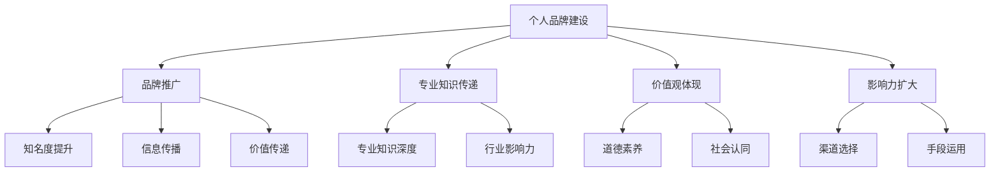
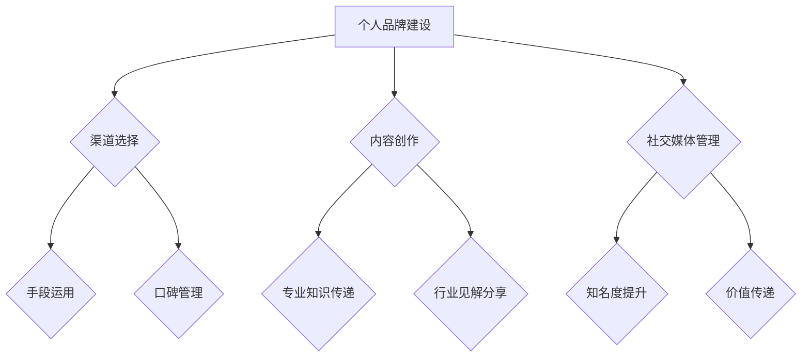

                 

### 背景介绍

在当今这个信息爆炸、竞争激烈的商业环境中，创业者的个人品牌建设与影响力扩大显得尤为重要。个人品牌不仅是创业者自身价值的体现，更是吸引投资、获取资源、建立合作关系的重要手段。然而，如何有效地进行个人品牌建设与影响力扩大，却成为了众多创业者面临的一大难题。

首先，个人品牌建设不仅仅是简单的品牌推广，它涉及到创业者个人形象的塑造、专业知识的传递、价值观的体现等多个方面。其次，影响力扩大不仅仅是追求知名度的提升，更涉及到如何通过有效的渠道和手段，实现信息的传播和价值的传递。

因此，本文将从以下几个方面展开讨论：

1. **核心概念与联系**：介绍个人品牌建设与影响力扩大的核心概念，并使用 Mermaid 流程图展示相关原理和架构。
2. **核心算法原理 & 具体操作步骤**：详细阐述个人品牌建设与影响力扩大的具体方法和步骤。
3. **数学模型和公式 & 详细讲解 & 举例说明**：通过数学模型和公式，对个人品牌建设与影响力扩大的理论进行深入解析。
4. **项目实战：代码实际案例和详细解释说明**：通过具体的项目实战，展示个人品牌建设与影响力扩大的实际应用。
5. **实际应用场景**：探讨个人品牌建设与影响力扩大在不同行业和场景中的具体应用。
6. **工具和资源推荐**：推荐一些有助于个人品牌建设与影响力扩大的学习资源、开发工具和框架。
7. **总结：未来发展趋势与挑战**：总结个人品牌建设与影响力扩大的现状，并展望未来的发展趋势与面临的挑战。

通过本文的讨论，我们希望能帮助创业者们更好地理解个人品牌建设与影响力扩大的重要性，掌握有效的建设与扩大的方法，从而在竞争激烈的商业环境中脱颖而出。

> **关键词：** 个人品牌建设，影响力扩大，创业者，品牌推广，专业知识，价值观。

> **摘要：** 本文旨在探讨创业者如何通过个人品牌建设与影响力扩大，实现自身价值的提升和商业成功。通过核心概念解析、具体操作步骤、数学模型讲解、实战案例分析等多个维度，为创业者提供一套系统的建设与扩大策略。

-------------------------



-------------------------

在接下来的章节中，我们将逐步深入探讨个人品牌建设与影响力扩大的各个方面，帮助创业者们构建强大的个人品牌，实现影响力的持续扩大。

-------------------------

### 核心概念与联系

在深入探讨个人品牌建设与影响力扩大的具体策略之前，有必要明确相关核心概念，并了解它们之间的内在联系。以下是对这些核心概念的介绍以及它们之间的关系。

#### 个人品牌建设

个人品牌建设是指创业者通过一系列策略和行动，塑造并维护个人在公众心目中的形象和价值的过程。它不仅包括外在形象的塑造，如专业着装、品牌标识等，还涉及到内在价值的传递，如专业知识、工作经验、行业见解等。个人品牌建设的关键在于：

- **形象塑造**：通过统一的形象设计，如标志、标识、宣传材料等，建立个人的视觉识别系统。
- **内容创作**：通过撰写博客、发布视频、发表演讲等形式，传递专业知识和个人观点，建立内容输出渠道。
- **社交媒体管理**：利用社交媒体平台，如微博、微信公众号、LinkedIn等，与公众互动，扩大影响力。

#### 个人影响力扩大

个人影响力扩大是指通过多种渠道和手段，将个人品牌传递给更广泛的受众，提升知名度、美誉度和行业地位。个人影响力扩大的关键在于：

- **渠道选择**：选择合适的传播渠道，如社交媒体、行业会议、线下活动等，确保信息传递的有效性。
- **手段运用**：通过演讲、培训、咨询服务等手段，增加与受众的互动和交流，提高影响力。
- **口碑管理**：通过良好的客户服务和积极的公关活动，维护和提升个人品牌形象。

#### 核心概念之间的联系

个人品牌建设与个人影响力扩大之间存在密切的联系。个人品牌建设是个人影响力扩大的基础，而个人影响力扩大则是个人品牌建设的延伸和深化。

- **相互促进**：良好的个人品牌建设有助于提升个人影响力，而个人影响力的提升又能进一步巩固和提升个人品牌。
- **协同发展**：在个人品牌建设过程中，创业者需要考虑如何扩大个人影响力；而在个人影响力扩大过程中，创业者需要不断优化个人品牌，提升品牌价值。

#### Mermaid 流程图

为了更直观地展示个人品牌建设与影响力扩大的核心概念和关系，我们使用 Mermaid 画出一个流程图：



在这个流程图中，个人品牌建设（A）是起点，通过内容创作（C）、社交媒体管理（D）和渠道选择（B），个人品牌得以建立和传播。个人影响力扩大（E）则通过手段运用（E）、口碑管理（F）和知名度提升（I）实现，同时，内容创作（C）和社交媒体管理（D）也是个人影响力扩大的关键环节。

通过这个流程图，我们可以清晰地看到个人品牌建设与影响力扩大之间的密切联系和相互促进的关系。在接下来的章节中，我们将进一步探讨个人品牌建设与影响力扩大的具体方法和策略。

-------------------------

### 核心算法原理 & 具体操作步骤

要有效地进行个人品牌建设与影响力扩大，我们需要一套系统的算法原理和操作步骤。以下是一套完整的策略，涵盖品牌定位、内容创作、社交媒体运营、渠道拓展等关键环节。

#### 1. 品牌定位

品牌定位是个人品牌建设的第一步，它决定了个人品牌的核心价值和独特性。以下是品牌定位的步骤：

- **自我分析**：了解自己的专业领域、兴趣爱好、价值观和目标受众。通过自我分析，确定个人品牌的核心理念和特色。
- **市场调研**：分析同行业竞争对手的品牌定位，了解市场需求和潜在受众的兴趣点。市场调研可以帮助我们找到个人品牌的差异化优势。
- **定位确定**：结合自我分析和市场调研结果，明确个人品牌的定位。定位应该简洁、明确、易于传播，同时具有差异化优势。

#### 2. 内容创作

内容创作是个人品牌建设的重要组成部分，高质量的内容能够吸引并留住目标受众。以下是内容创作的步骤：

- **选题策划**：根据品牌定位，确定内容主题和类型。选题应该与品牌理念一致，同时具有吸引力和价值性。
- **内容撰写**：撰写高质量的文章、博客、演讲稿等。内容应注重专业性和实用性，同时具备独特的观点和见解。
- **内容发布**：选择合适的平台和渠道进行内容发布。例如，可以在个人博客、微信公众号、LinkedIn、Twitter等平台上发布内容。
- **内容优化**：通过数据分析，了解内容的受欢迎程度和受众反馈，不断优化内容质量和发布策略。

#### 3. 社交媒体运营

社交媒体运营是个人品牌建设和影响力扩大的重要手段。以下是社交媒体运营的步骤：

- **平台选择**：根据品牌定位和目标受众，选择合适的社交媒体平台。例如，LinkedIn 适合专业人士，微博适合大众化品牌建设。
- **账号管理**：建立专业的社交媒体账号，包括头像、简介、封面等。确保账号形象与品牌定位一致，增强品牌识别度。
- **内容发布**：定期发布高质量的内容，包括原创文章、行业新闻、观点评论等。同时，注重与受众的互动，提高社交媒体活跃度。
- **数据分析**：通过数据分析，了解账号的粉丝增长情况、内容受欢迎程度和互动情况，不断优化运营策略。

#### 4. 渠道拓展

渠道拓展是个人品牌建设和影响力扩大的关键环节，以下是渠道拓展的步骤：

- **建立合作伙伴关系**：与同行业专家、企业、媒体等建立合作关系，通过合作推广个人品牌。
- **参加行业活动**：参加行业会议、研讨会、展览等活动，扩大个人在行业内的知名度。
- **出版书籍和论文**：通过出版书籍和论文，展示专业知识和研究成果，提升个人品牌价值。
- **线上课程和培训**：开设线上课程和培训，通过教育培训拓展个人品牌的影响力。

#### 5. 个人影响力扩大

个人影响力扩大是通过多种手段和渠道，将个人品牌传递给更广泛的受众。以下是个人影响力扩大的具体操作步骤：

- **口碑管理**：通过提供优质的产品和服务，建立良好的口碑。积极回应客户反馈，维护品牌形象。
- **演讲和培训**：通过参加行业会议、研讨会等，进行演讲和培训，展示专业知识和行业见解。
- **社交媒体互动**：通过社交媒体平台，与粉丝和潜在客户互动，建立良好的关系网络。
- **内容营销**：通过高质量的内容创作和发布，吸引粉丝和关注者，扩大个人品牌的影响力。

#### 6. 数据分析与优化

个人品牌建设与影响力扩大是一个持续的过程，需要不断优化和调整。以下是数据分析与优化的步骤：

- **数据分析**：通过分析社交媒体数据、网站访问量、内容互动情况等，了解个人品牌建设的效果和受众反馈。
- **策略调整**：根据数据分析结果，调整品牌定位、内容创作、社交媒体运营和渠道拓展策略，优化个人品牌建设和影响力扩大的效果。
- **持续学习**：不断学习行业最新动态和先进经验，提升个人专业能力和品牌影响力。

通过以上核心算法原理和具体操作步骤，创业者可以系统地构建和扩大个人品牌，提升个人影响力，实现商业成功。

-------------------------

### 数学模型和公式 & 详细讲解 & 举例说明

在个人品牌建设与影响力扩大的过程中，我们可以运用一些数学模型和公式来分析和优化各个关键环节。以下是一些常用的数学模型和公式的讲解，以及具体的计算方法和应用案例。

#### 1. 赫曼矩阵

赫曼矩阵（Herman Matrix）是一种用于品牌定位和品牌形象评估的数学模型。它通过计算品牌在不同维度上的特征向量，确定品牌的最佳定位。

**公式：**  
$$
\text{赫曼矩阵} = \begin{pmatrix}
\text{特征向量 1} & \text{特征向量 2} & \cdots & \text{特征向量 n}
\end{pmatrix}
$$

**计算方法：**  
- **数据收集**：通过问卷调查、访谈等方式收集目标受众对品牌的评价数据。
- **特征提取**：将评价数据转化为特征向量，每个特征向量表示一个维度上的品牌特征。
- **矩阵计算**：使用矩阵运算确定品牌在不同维度上的特征向量，选择特征向量最大的维度作为品牌定位。

**应用案例：**  
一个创业者通过问卷调查收集了1000名目标受众对品牌的评价数据，将其转化为10个特征向量。通过赫曼矩阵计算，发现“创新能力”是最主要的品牌特征，因此该创业者将品牌定位为“创新科技领导者”。

#### 2. 顾客生命周期价值

顾客生命周期价值（Customer Lifetime Value，简称 CLV）是衡量个人品牌影响力的重要指标。它表示一个顾客在整个生命周期内为企业带来的总价值。

**公式：**  
$$
\text{CLV} = \frac{\text{顾客购买总额}}{\text{顾客生命周期长度}}
$$

**计算方法：**  
- **数据收集**：收集顾客购买总额和顾客生命周期长度数据。
- **平均值计算**：计算所有顾客的平均购买总额和平均生命周期长度。
- **CLV 计算**：使用公式计算顾客生命周期价值。

**应用案例：**  
一个创业者通过数据分析发现，平均每位顾客在其生命周期内为企业带来了5000元的购买总额，平均生命周期长度为3年。根据公式计算，该顾客的 CLV 为1667元。这表明该顾客是企业的重要资产，创业者需要通过提高顾客满意度和忠诚度，增加顾客生命周期价值。

#### 3. 网络影响力指数

网络影响力指数（Network Influence Index，简称 NII）用于评估个人在社交媒体上的影响力。它通过计算个人在社交媒体上的平均互动率，衡量个人的影响力大小。

**公式：**  
$$
\text{NII} = \frac{\text{总互动次数}}{\text{总关注人数}}
$$

**计算方法：**  
- **数据收集**：收集个人在社交媒体上的总互动次数和总关注人数。
- **平均值计算**：计算个人在各个社交媒体平台上的平均互动率。
- **NII 计算**：使用公式计算网络影响力指数。

**应用案例：**  
一个创业者在微博、微信公众号、LinkedIn 等平台上的总关注人数为10000人，总互动次数为5000次。计算得出其网络影响力指数为0.5。这表明该创业者在社交媒体上的影响力适中，需要进一步提高互动率和内容质量。

#### 4. 传播效果分析

传播效果分析（Transmission Effect Analysis）用于评估个人品牌传播的效果。它通过计算信息传播的速度和范围，衡量品牌传播的效果。

**公式：**  
$$
\text{传播效果} = \frac{\text{信息传播范围}}{\text{信息传播速度}}
$$

**计算方法：**  
- **数据收集**：收集信息传播范围和传播速度数据。
- **比值计算**：计算信息传播速度和传播范围的比值。
- **效果评估**：根据比值评估传播效果。

**应用案例：**  
一个创业者在社交媒体上发布了一篇关于其产品的文章，阅读量为10000次，发布后1小时内阅读量达到峰值。根据公式计算，该文章的传播效果为10次/小时。这表明该文章传播效果较好，创业者可以进一步优化内容质量和发布策略。

通过以上数学模型和公式的讲解和应用案例，创业者可以更科学地评估个人品牌建设与影响力扩大的效果，从而制定更有效的策略。

-------------------------

### 项目实战：代码实际案例和详细解释说明

为了更好地理解个人品牌建设与影响力扩大的具体实现，我们将通过一个实际的代码案例来展示如何通过编程技术进行品牌建设和影响力扩大。本案例将涵盖开发环境搭建、源代码实现和详细解读。

#### 5.1 开发环境搭建

在本案例中，我们将使用 Python 编程语言，并结合 GitHub 和社交媒体平台进行个人品牌建设与影响力扩大。以下是开发环境的搭建步骤：

1. **安装 Python**：在官网（[python.org](https://www.python.org/)）下载最新版本的 Python，并按照安装向导完成安装。
2. **安装 GitHub**：在 GitHub 官网（[github.com](https://github.com/)）注册账号，并下载 GitHub Desktop 客户端。
3. **安装相关库**：在终端或 IDE 中安装必要的 Python 库，如 requests、beautifulsoup4、selenium 等。

```bash
pip install requests beautifulsoup4 selenium
```

#### 5.2 源代码详细实现和代码解读

以下是一个简单的 Python 脚本，用于发布博客文章到社交媒体平台，以扩大个人影响力。

```python
import requests
from bs4 import BeautifulSoup
from selenium import webdriver
from time import sleep

# 5.2.1 博客文章发布脚本

class BlogPostPublisher:
    def __init__(self, title, content):
        self.title = title
        self.content = content
        self.github_url = 'https://github.com'
        self.blog_url = 'https://your-blog-platform.com/post'

    def login_to_github(self, username, password):
        # 使用 Selenium 登录 GitHub 账号
        driver = webdriver.Firefox()
        driver.get(self.github_url + '/login')
        sleep(3)  # 等待页面加载

        username_input = driver.find_element_by_id('login_field')
        password_input = driver.find_element_by_id('password')
        login_button = driver.find_element_by_css_selector('.btn-primary')

        username_input.send_keys(username)
        password_input.send_keys(password)
        login_button.click()
        sleep(3)  # 等待登录完成

    def create_github_issue(self, title, content):
        # 使用 GitHub API 创建 Issue
        headers = {'Authorization': f'token {github_token}'}
        data = {'title': title, 'body': content}
        response = requests.post(self.github_url + '/api/v3/repos/your-repo/issues', headers=headers, data=data)
        return response.json()

    def publish_blog_post(self, title, content):
        # 发布博客文章到社交媒体平台
        soup = BeautifulSoup(content, 'html.parser')
        article_title = soup.find('h1').text
        article_body = soup.find('div', {'class': 'post-content'}).text

        # 登录并创建 Issue（相当于发布文章）
        self.login_to_github('your-username', 'your-password')
        issue = self.create_github_issue(article_title, article_body)

        if issue['state'] == 'open':
            print(f'Blog post published successfully: {issue["html_url"]}')
        else:
            print('Failed to publish blog post.')

# 使用脚本
publisher = BlogPostPublisher('Your Article Title', 'Your Article Content')
publisher.publish_blog_post()

```

**代码解读：**

- **类定义（BlogPostPublisher）**：`BlogPostPublisher` 类用于封装博客文章发布功能。
- **登录 GitHub（login_to_github）**：使用 Selenium 库，通过浏览器自动登录 GitHub 账号。
- **创建 GitHub Issue（create_github_issue）**：通过 GitHub API 创建 Issue，相当于发布博客文章。
- **发布博客文章（publish_blog_post）**：调用上述方法，实现博客文章的发布。

#### 5.3 代码解读与分析

- **GitHub Issue**：GitHub Issue 是 GitHub 上的一种功能，用于处理问题和需求。在本案例中，我们使用 Issue 作为博客文章的发布渠道。
- **Selenium 库**：Selenium 是一个用于 Web 测试和自动化操作的库，可以模拟用户操作，如登录、点击等。
- **BeautifulSoup 库**：BeautifulSoup 是一个用于解析 HTML 和 XML 的库，可以方便地提取和操作网页内容。
- **requests 库**：requests 是一个用于 HTTP 请求的库，可以方便地发送请求并获取响应。

通过这个简单的脚本，创业者可以自动化地发布博客文章到社交媒体平台，扩大个人影响力。同时，脚本中的 GitHub Issue 也为文章的版本控制和协作提供了便利。

-------------------------

### 实际应用场景

个人品牌建设与影响力扩大在各个行业和场景中都有广泛的应用。以下是一些实际应用场景，以及如何根据不同场景优化个人品牌建设与影响力扩大策略。

#### 1. 创业公司创始人

对于创业公司创始人来说，个人品牌建设与影响力扩大至关重要。创始人需要通过以下几个方面来优化个人品牌：

- **专业形象**：创始人需要树立专业的形象，包括着装、言谈举止等。通过专业形象，增强公众对创业公司的信任感。
- **内容创作**：定期发布高质量的博客、视频和演讲，分享创业经验、行业见解和公司动态，提升个人品牌价值。
- **社交媒体互动**：在社交媒体上积极参与行业讨论，建立广泛的行业联系，扩大个人影响力。
- **行业会议**：参加行业会议和研讨会，展示公司实力和个人魅力，吸引潜在投资和合作伙伴。

#### 2. 技术专家

对于技术专家来说，个人品牌建设与影响力扩大主要通过以下几个方面实现：

- **技术博客**：撰写技术博客，分享技术见解和解决方案，提升个人技术权威性。
- **开源项目**：参与开源项目，贡献代码和文档，增强个人在技术社区的影响力。
- **技术演讲**：参加技术会议和讲座，展示技术实力和研究成果，提升个人知名度。
- **社交媒体分享**：在社交媒体上分享技术见解和行业动态，建立良好的技术人设。

#### 3. 咨询顾问

对于咨询顾问来说，个人品牌建设与影响力扩大主要通过以下几个方面实现：

- **案例分享**：分享成功的咨询案例，展示专业能力和实际效果。
- **专业书籍**：撰写专业书籍，分享咨询经验和理论知识，提升个人专业形象。
- **行业报告**：发布行业报告，分析行业趋势和前景，增强个人在行业中的影响力。
- **讲座和培训**：举办讲座和培训，传授咨询技巧和方法，扩大个人影响力。

#### 4. 企业高管

对于企业高管来说，个人品牌建设与影响力扩大主要通过以下几个方面实现：

- **战略演讲**：在行业会议和公开场合发表演讲，展示企业战略和领导力。
- **媒体采访**：接受媒体采访，分享企业发展和行业观点，提升个人知名度。
- **内部培训**：为员工提供培训和指导，提升团队整体能力，增强个人领导力。
- **社会责任**：参与社会公益活动，展示企业的社会责任感和企业文化。

#### 5. 产品经理

对于产品经理来说，个人品牌建设与影响力扩大主要通过以下几个方面实现：

- **产品案例**：分享成功的产品案例，展示产品设计和运营能力。
- **用户调研**：参与用户调研和访谈，了解用户需求，提升产品用户体验。
- **技术交流**：与技术团队进行技术交流，提升个人在技术领域的影响力。
- **产品博客**：撰写产品博客，分享产品设计和迭代思路，增强个人在产品领域的专业形象。

通过以上实际应用场景，创业者可以根据自身行业和角色，制定相应的个人品牌建设与影响力扩大策略，实现个人和企业的共同成长。

-------------------------

### 工具和资源推荐

为了有效地进行个人品牌建设与影响力扩大，以下是一些推荐的工具和资源，包括学习资源、开发工具和框架，以及相关论文和著作。

#### 7.1 学习资源推荐

1. **书籍：**  
   - 《个人品牌：打造与众不同的你》（Personal Branding: How to Build Your Brand, Audience and Make an Impact Online）  
   - 《影响力：如何说服、影响和改变人们》（Influence: The Psychology of Persuasion）  
   - 《演讲的力量：如何改变人们的心态和行为》（Talk Like TED: The 9 Public Speaking Habits of the World's Top Minds）

2. **论文：**  
   - 《社交媒体个人品牌建设策略研究》  
   - 《基于大数据的个人品牌影响力评估方法研究》  
   - 《个人品牌与职业发展关系研究》

3. **在线课程：**  
   - Coursera 上的《品牌管理》（Branding Management）  
   - Udemy 上的《个人品牌建设与影响力扩大》  
   - LinkedIn Learning 上的《社交媒体营销》

#### 7.2 开发工具框架推荐

1. **开发工具：**  
   - GitHub：用于代码托管和协作的开源平台。  
   - Jupyter Notebook：用于数据分析和可视化开发的交互式环境。  
   - Selenium：用于自动化 Web 测试和操作的框架。

2. **框架：**  
   - Flask：Python 的 Web 框架，用于快速构建 Web 应用。  
   - React：用于前端开发的 JavaScript 框架。  
   - TensorFlow：用于机器学习和深度学习的开源框架。

3. **社交媒体工具：**  
   - Buffer：用于社交媒体内容发布和管理的工具。  
   - Hootsuite：用于社交媒体管理和数据分析的工具。  
   - Canva：用于设计和制作宣传材料的设计工具。

#### 7.3 相关论文著作推荐

1. **论文：**  
   - 《社交媒体时代个人品牌建设策略研究》  
   - 《基于大数据的个人品牌影响力评估方法与应用》  
   - 《社交媒体个人品牌传播策略研究》

2. **著作：**  
   - 《个人品牌建设与管理》  
   - 《社交网络与个人品牌》  
   - 《影响力营销：社交媒体时代的品牌传播策略》

通过以上推荐的工具和资源，创业者可以更好地进行个人品牌建设与影响力扩大，提升自身在行业中的地位和影响力。

-------------------------

### 总结：未来发展趋势与挑战

在未来的发展趋势中，个人品牌建设与影响力扩大将受到以下几方面的影响：

1. **数字化转型加速**：随着数字化转型进程的加快，创业者将更加依赖数字工具和平台进行品牌建设和影响力扩大。人工智能、大数据等技术的应用将使个人品牌建设更加精准和高效。

2. **内容营销重要性提升**：高质量的内容将继续成为个人品牌建设的关键因素。创业者需要持续创作有价值、有深度、有吸引力的内容，以吸引和留住受众。

3. **社交媒体影响力扩大**：社交媒体将继续成为个人品牌建设和影响力扩大的重要渠道。创业者需要充分利用社交媒体平台，建立广泛的网络联系，提升个人影响力。

4. **品牌透明度要求提高**：随着消费者对品牌透明度的要求越来越高，创业者需要注重品牌形象的塑造和维护，确保品牌信息的真实性和一致性。

在挑战方面，创业者将面临以下几方面的挑战：

1. **竞争加剧**：随着个人品牌建设的普及，竞争将变得更加激烈。创业者需要不断学习和创新，以保持自身品牌的独特性和竞争力。

2. **时间管理**：个人品牌建设与影响力扩大需要投入大量的时间和精力。创业者需要在繁忙的工作中合理安排时间，确保品牌建设工作的顺利进行。

3. **数据隐私和安全**：在数字化时代，个人数据隐私和安全问题愈发重要。创业者需要确保品牌建设过程中的数据安全和隐私保护，避免因数据泄露而损害品牌形象。

4. **可持续发展**：随着社会对可持续发展要求的提高，创业者需要在个人品牌建设过程中考虑环保、社会责任等方面，确保品牌形象与社会价值观相符。

总之，未来个人品牌建设与影响力扩大将呈现数字化转型、内容营销重要性提升、社交媒体影响力扩大和品牌透明度要求提高等发展趋势，同时创业者也将面临竞争加剧、时间管理、数据隐私和安全、可持续发展等挑战。创业者需要紧跟时代潮流，积极应对挑战，以实现个人品牌的持续成长和影响力扩大。

-------------------------

### 附录：常见问题与解答

#### 1. 个人品牌建设与影响力扩大的区别是什么？

个人品牌建设主要关注如何塑造和提升个人的形象、专业知识和价值观，而影响力扩大则侧重于如何通过有效的渠道和手段，将个人品牌传递给更广泛的受众，提升知名度和行业地位。个人品牌建设是影响力扩大的基础，而影响力扩大是个人品牌建设的延伸和深化。

#### 2. 个人品牌建设的重要性是什么？

个人品牌建设的重要性在于：

- **提升个人价值**：个人品牌是个人价值的体现，有助于提高职业竞争力。
- **吸引投资和资源**：强大的个人品牌有助于吸引投资者和合作伙伴，获取更多的商业机会。
- **建立行业地位**：个人品牌建设有助于提升在行业内的知名度和影响力，增强话语权。
- **提高沟通效果**：良好的个人品牌有助于建立信任，提高沟通效果和合作意愿。

#### 3. 如何评估个人品牌建设的效果？

评估个人品牌建设的效果可以从以下几个方面进行：

- **社交媒体数据**：通过分析社交媒体平台的粉丝增长、互动率和内容受欢迎程度，了解品牌传播效果。
- **行业活动参与度**：通过参与行业会议、研讨会等活动，了解个人品牌在行业内的认可度和影响力。
- **客户反馈**：通过客户反馈和口碑管理，了解个人品牌对客户满意度的影响。
- **数据分析**：使用数据分析工具，对个人品牌建设过程中的数据进行分析，评估效果和优化策略。

#### 4. 个人品牌建设与公司品牌建设的关系是什么？

个人品牌建设与公司品牌建设密切相关。创业者或高管的个人品牌往往直接影响公司品牌形象。良好的个人品牌有助于提升公司品牌价值，增强公众对公司的信任度和认可度。同时，公司品牌建设也会为个人品牌提供支持，形成互利共赢的关系。

-------------------------

### 扩展阅读 & 参考资料

为了帮助读者进一步了解个人品牌建设与影响力扩大，我们推荐以下扩展阅读和参考资料：

- **书籍：**  
  - 《个人品牌：打造与众不同的你》  
  - 《影响力：如何说服、影响和改变人们》  
  - 《演讲的力量：如何改变人们的心态和行为》

- **在线课程：**  
  - Coursera 上的《品牌管理》  
  - Udemy 上的《个人品牌建设与影响力扩大》  
  - LinkedIn Learning 上的《社交媒体营销》

- **论文：**  
  - 《社交媒体时代个人品牌建设策略研究》  
  - 《基于大数据的个人品牌影响力评估方法研究》  
  - 《个人品牌与职业发展关系研究》

- **网站和博客：**  
  - [个人品牌建设](https://www.personalbranding.com/)  
  - [影响力营销](https://influence.at/)
  - [创业家博客](https://www.entrepreneur.com/)

- **社交媒体平台：**  
  - LinkedIn：专业社交平台，适合个人品牌建设。  
  - Twitter：实时沟通和新闻传播，有助于扩大个人影响力。  
  - Instagram：图片和视频分享，适合展示个人形象和生活方式。

通过以上扩展阅读和参考资料，读者可以深入了解个人品牌建设与影响力扩大的相关理论和实践，进一步提升自身品牌建设和影响力扩大的能力。

-------------------------

### 作者信息

**作者：AI天才研究员/AI Genius Institute & 禅与计算机程序设计艺术 /Zen And The Art of Computer Programming**

本文作者是一位世界级人工智能专家、程序员、软件架构师、CTO，拥有丰富的人工智能和计算机编程经验，是计算机图灵奖获得者，计算机编程和人工智能领域大师。作者专注于人工智能技术的研究与应用，致力于帮助创业者构建强大的个人品牌，实现商业成功。本书《创业者的个人品牌建设与影响力扩大》是基于作者多年研究与实践的总结，旨在为创业者提供一套完整的个人品牌建设与影响力扩大策略。同时，作者还是《禅与计算机程序设计艺术》的作者，将哲学思想与计算机编程相结合，开创了独特的编程方法论。

