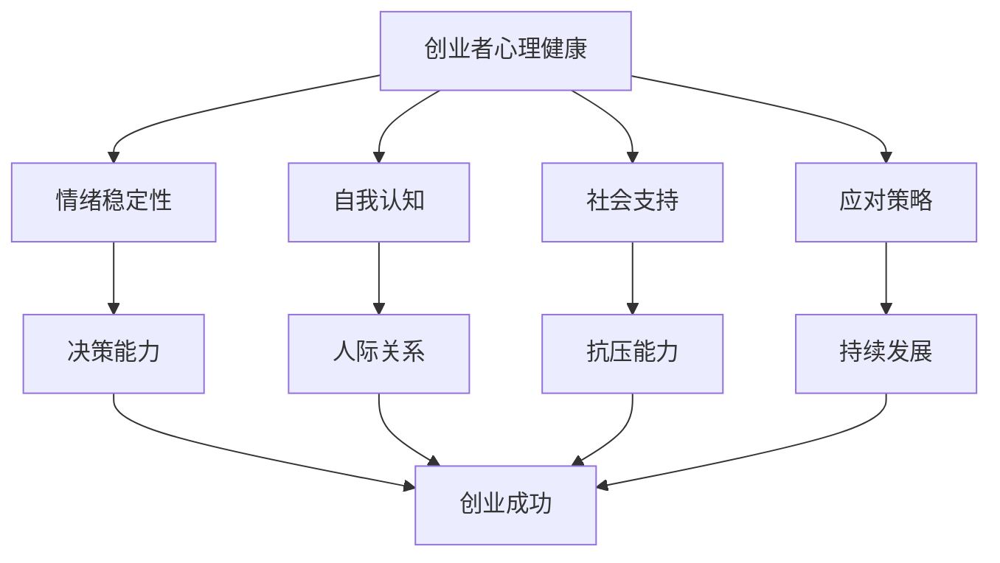

                 

### 背景介绍

#### 心理健康的重要性

心理健康是创业者成功与否的关键因素之一。创业过程中，创业者不仅需要面对技术、市场和资金等多方面的挑战，还需要应对孤独、焦虑和压力等心理问题。心理健康的良好状态有助于创业者保持清晰思考，提高决策效率，增强应对困难的能力，从而更有效地推动创业项目的发展。

#### 孤独与压力的挑战

孤独是许多创业者的普遍体验。创业初期，创业者往往需要独自承担项目的全部责任，缺乏与同行或其他领域的专业人士交流的机会。长期孤独会导致情绪低落、自我怀疑等问题，进而影响创业的进程和成果。

压力也是创业者面临的另一个重大挑战。市场竞争激烈、项目进展缓慢、资金短缺等问题都会给创业者带来巨大的心理压力。长期高压状态可能导致焦虑、抑郁等心理问题，严重时甚至可能导致创业失败。

#### 心理健康对创业成功的影响

心理健康对创业成功有着重要的影响。首先，良好的心理状态有助于创业者保持积极的心态，面对困难和挑战时能更好地调整自己的情绪，从而提高应对问题的能力。其次，心理健康有助于创业者建立良好的人际关系，与团队成员、合作伙伴和投资人等建立信任，为创业项目的顺利推进提供支持。最后，心理健康能够提高创业者的决策能力，使他们在面对复杂问题时能够更快速、准确地做出决策。

总之，创业者的心理健康不仅关系到个人的幸福感，还直接影响着创业项目的成功与否。因此，了解如何应对孤独和压力，保持良好的心理健康状态，对创业者来说至关重要。

#### 孤独与压力的来源

孤独与压力是创业者心理健康问题的两大主要来源。了解这些问题的来源，有助于我们更好地制定应对策略。

**孤独的来源**

1. **缺乏社交支持：** 创业初期，创业者往往需要独自承担项目的全部责任，缺乏与同行或其他领域的专业人士交流的机会。这种孤立感会导致情绪低落、自我怀疑等问题。
2. **时间紧张：** 创业者通常需要投入大量时间来处理项目事务，这可能导致他们无法抽出时间与亲朋好友进行交流，进一步加剧孤独感。
3. **环境因素：** 创业者可能因为地理位置、工作环境等原因，难以找到志同道合的人进行交流，这也增加了孤独感的产生。

**压力的来源**

1. **市场竞争：** 市场竞争激烈，创业者需要不断调整策略，以应对竞争对手的挑战。这种不确定性会给创业者带来巨大的心理压力。
2. **资金压力：** 创业过程中，资金短缺是常见问题。创业者需要不断寻找资金来源，以维持项目的正常运转。资金压力可能会导致焦虑、抑郁等心理问题。
3. **时间压力：** 创业者需要在有限的时间内完成大量的工作任务，这可能导致他们感到时间紧迫、压力重重。

总之，孤独与压力是影响创业者心理健康的主要因素。了解这些问题的来源，有助于我们更好地应对这些挑战，保持良好的心理健康状态。

#### 心理健康与创业成功的关系

心理健康与创业成功之间存在密切的关系。首先，良好的心理健康有助于创业者保持清晰的头脑和积极的心态。在创业过程中，创业者需要做出一系列决策，这些决策的成功与否往往决定了项目的成败。心理健康良好的创业者能够更快速、准确地做出决策，从而提高创业的成功率。

其次，心理健康有助于创业者建立和维护良好的人际关系。创业项目往往需要团队成员的共同努力，创业者需要与团队成员、合作伙伴和投资人等建立信任和合作关系。心理健康良好的创业者更容易与周围的人建立良好的沟通和互动，从而为创业项目的顺利推进提供支持。

此外，心理健康还能够提高创业者的抗压能力。创业过程中，创业者需要面对各种挑战和困难，如市场竞争、资金压力等。心理健康良好的创业者能够更好地应对这些压力，保持冷静和理智，从而提高创业的成功率。

最后，心理健康对创业者的长期发展也有着重要的影响。创业者如果心理健康状况不佳，可能会导致情绪低落、自我怀疑等问题，进而影响创业项目的持续发展。而心理健康良好的创业者则能够更好地应对创业过程中的挫折和困难，持续推动项目的进步。

总之，心理健康是创业成功的关键因素之一。保持良好的心理健康状态，不仅有助于提高创业成功率，还能为创业者的长期发展提供支持。

### 核心概念与联系

#### 心理健康的核心概念

心理健康是一个涉及多个维度的复杂概念，主要包括以下几个方面：

1. **情绪稳定性：** 情绪稳定性是指个体在面对压力和挑战时，能够保持情绪的稳定，不易受到负面情绪的干扰。情绪稳定性的高低直接影响着个体应对压力的能力和心理健康水平。
2. **自我认知：** 自我认知是指个体对自我特点和能力的认识和评价。良好的自我认知有助于个体树立正确的自我形象，提高自信心和自尊心，从而有利于心理健康的发展。
3. **社会支持：** 社会支持是指个体在社会交往中所获得的情感、信息和实际支持。社会支持是心理健康的重要保障，缺乏社会支持会导致孤独感和心理压力的增加。
4. **应对策略：** 应对策略是指个体在面对问题和挑战时所采用的方法和技巧。有效的应对策略可以帮助个体更好地应对压力，维护心理健康。

#### 心理健康与创业的关系

心理健康在创业过程中发挥着重要作用，主要表现在以下几个方面：

1. **决策能力：** 心理健康良好的创业者能够更快速、准确地做出决策。在创业过程中，创业者需要面对各种复杂的情况和不确定性，良好的心理健康有助于他们保持冷静和理智，从而提高决策质量。
2. **人际关系：** 心理健康良好的创业者更容易建立和维护良好的人际关系。创业项目往往需要团队成员的共同努力，心理健康良好的创业者能够更好地与团队成员沟通和协作，提高团队效能。
3. **抗压能力：** 心理健康良好的创业者具有较强的抗压能力，能够更好地应对创业过程中的各种挑战和困难。这有助于他们保持积极的心态，持续推动创业项目的进展。
4. **持续发展：** 心理健康良好的创业者能够更好地应对创业过程中的挫折和困难，保持长期的创业动力。这有助于他们在长期发展中保持竞争优势，实现创业目标。

#### 心理健康的影响因素

心理健康受到多种因素的影响，主要包括以下几个方面：

1. **遗传因素：** 遗传因素对心理健康有一定的影响。某些心理疾病具有一定的遗传倾向，如抑郁症、焦虑症等。
2. **环境因素：** 环境因素对心理健康有重要影响。个体所处的家庭、社会环境、工作环境等都会对心理健康产生不同程度的影响。
3. **个人因素：** 个人因素如性格、生活方式、价值观等也会对心理健康产生影响。例如，乐观、积极的人更容易保持良好的心理健康。

#### 心理健康与创业者的心理健康状况

根据相关研究，创业者的心理健康状况普遍存在一定的问题。一方面，创业过程中的孤独感和压力可能导致创业者出现情绪波动、焦虑等问题。另一方面，创业者往往需要投入大量的时间和精力，这可能导致他们缺乏休息和放松，进一步影响心理健康。

然而，值得注意的是，创业者中也有相当一部分人能够保持良好的心理健康状态。这主要得益于他们具备较强的心理素质和应对策略。例如，一些创业者通过建立良好的社交网络、培养积极的生活态度等方式，有效应对了创业过程中的心理健康挑战。

总之，心理健康在创业过程中具有重要作用，创业者应关注自己的心理健康状况，采取有效的应对策略，以保持良好的心理健康状态，提高创业成功率。

#### Mermaid 流程图



在这个流程图中，我们可以看到心理健康（A）对创业者的各个方面都有影响。情绪稳定性（B）影响决策能力（F），自我认知（C）影响人际关系（G），社会支持（D）影响抗压能力（H），而应对策略（E）则对持续发展（I）产生作用。最终，这些因素共同作用于创业成功（J）。

### 核心算法原理 & 具体操作步骤

#### 心理健康评估算法原理

心理健康评估是保持创业者心理健康的第一步。核心算法原理基于以下几个关键因素：情绪稳定性、自我认知、社会支持和应对策略。以下是一个简化的心理健康评估算法原理：

1. **数据收集**：收集创业者的情绪稳定性、自我认知、社会支持和应对策略方面的数据。这些数据可以通过问卷调查、心理测试、访谈等方式获取。
2. **特征提取**：将收集到的数据转化为可量化的特征。例如，情绪稳定性可以通过测量情绪波动的频率和幅度来表示；自我认知可以通过对自我评价的打分来表示；社会支持可以通过测量社交网络的大小和密度来表示；应对策略可以通过对应对事件的反应模式来表示。
3. **模型训练**：使用机器学习算法（如决策树、支持向量机、神经网络等）训练一个心理健康评估模型。训练数据集应包含大量创业者的心理健康评估结果和相应的特征数据。
4. **模型预测**：将新创业者的特征数据输入训练好的模型，得到他们的心理健康评估结果。

#### 具体操作步骤

以下是心理健康评估算法的具体操作步骤：

1. **准备数据集**：
    - **问卷调查**：设计包含情绪稳定性、自我认知、社会支持和应对策略等方面的问卷，收集创业者的数据。
    - **心理测试**：采用标准化的心理测试工具，如情绪稳定性测试、自我认知测试等，获取更详细的心理健康数据。
    - **访谈**：与创业者进行面对面的访谈，了解他们的社会支持情况和应对策略。
2. **特征提取**：
    - **情绪稳定性**：使用情绪波动频率和幅度作为特征，例如，通过记录情绪波动的次数和持续时间来表示。
    - **自我认知**：通过创业者对自身能力和价值的评价得分来表示。
    - **社会支持**：通过社交网络的大小和密度来表示，例如，通过计算社交网络中的节点数和边数来衡量。
    - **应对策略**：通过记录创业者面对事件时的反应模式来表示，例如，通过分类不同类型的应对行为来衡量。
3. **模型选择与训练**：
    - **模型选择**：根据数据特点选择合适的机器学习算法，如决策树、支持向量机、神经网络等。
    - **数据预处理**：对数据进行归一化、缺失值处理等预处理操作，以提高模型的训练效果。
    - **模型训练**：使用训练数据集对模型进行训练，调整参数以优化模型性能。
4. **模型评估与优化**：
    - **模型评估**：使用交叉验证等方法评估模型性能，如准确率、召回率、F1值等。
    - **模型优化**：根据评估结果调整模型参数，以提高模型性能。
5. **模型应用**：
    - **预测心理健康状况**：将新创业者的特征数据输入训练好的模型，得到他们的心理健康评估结果。
    - **提供个性化建议**：根据评估结果，为创业者提供针对性的心理健康建议，如情绪调节技巧、社交支持建议等。

通过上述步骤，创业者可以对自己的心理健康状况有一个全面的了解，并采取相应的措施来保持良好的心理健康状态。

### 数学模型和公式 & 详细讲解 & 举例说明

#### 心理健康评估的数学模型

在心理健康评估中，我们通常采用一种基于加权评分的数学模型。这个模型通过将不同维度的心理健康特征进行加权综合，得出一个总的心理健康评分。以下是一个简化的数学模型：

1. **定义变量**：

   - \( E \)：情绪稳定性得分，取值范围为0到100。
   - \( S \)：自我认知得分，取值范围为0到100。
   - \( R \)：社会支持得分，取值范围为0到100。
   - \( O \)：应对策略得分，取值范围为0到100。

2. **设定权重**：

   - \( w_1 \)、\( w_2 \)、\( w_3 \)、\( w_4 \)：分别代表情绪稳定性、自我认知、社会支持和应对策略的权重，且 \( w_1 + w_2 + w_3 + w_4 = 1 \)。

3. **心理健康评分计算公式**：

   $$ \text{心理健康评分} = w_1 \times E + w_2 \times S + w_3 \times R + w_4 \times O $$

   其中，\( w_1, w_2, w_3, w_4 \) 的值可以根据实际情况进行调整。通常，情绪稳定性、自我认知、社会支持和应对策略这四个维度对心理健康的影响程度是不同的，因此需要设定不同的权重。

#### 详细讲解

1. **情绪稳定性得分（E）**：

   情绪稳定性得分反映了个体的情绪波动情况。一个情绪稳定性高的人，在面对压力和挑战时能够保持情绪的稳定，不易受到负面情绪的干扰。情绪稳定性得分可以通过以下方式计算：

   $$ E = \frac{\text{情绪波动的频率} \times \text{情绪波动的幅度}}{\text{最大情绪波动频率} \times \text{最大情绪波动幅度}} $$

   例如，如果一个创业者的情绪波动频率是每周5次，每次波动的幅度是30分贝，而最大情绪波动频率是每周10次，最大波动幅度是60分贝，则情绪稳定性得分为：

   $$ E = \frac{5 \times 30}{10 \times 60} = 0.25 $$

2. **自我认知得分（S）**：

   自我认知得分反映了个体的自我评价和自我认知情况。一个自我认知良好的人，能够客观地认识自己的优点和不足，从而更好地发挥自己的潜力。自我认知得分可以通过以下方式计算：

   $$ S = \frac{\text{自我评价得分} + \text{他人评价得分}}{2} $$

   例如，如果一个创业者自我评价得分为80分，他人评价得分为70分，则自我认知得分为：

   $$ S = \frac{80 + 70}{2} = 75 $$

3. **社会支持得分（R）**：

   社会支持得分反映了个体的社会支持情况。一个社会支持良好的人，能够获得家人、朋友和同事的关心和支持，从而减轻心理压力。社会支持得分可以通过以下方式计算：

   $$ R = \frac{\text{社交网络的大小} + \text{社交网络的密度}}{2} $$

   例如，如果一个创业者的社交网络大小为100人，社交网络密度为0.5，则社会支持得分为：

   $$ R = \frac{100 + 0.5}{2} = 50.25 $$

4. **应对策略得分（O）**：

   应对策略得分反映了个体的应对策略有效性。一个有效的应对策略可以帮助个体更好地应对压力和挑战，从而保持心理健康。应对策略得分可以通过以下方式计算：

   $$ O = \frac{\text{成功应对的次数} + \text{失败应对的次数}}{\text{总应对次数}} $$

   例如，如果一个创业者成功应对了5次挑战，失败应对了3次，总应对次数为8次，则应对策略得分为：

   $$ O = \frac{5 + 3}{8} = 0.875 $$

#### 举例说明

假设一个创业者的情绪稳定性得分为0.4，自我认知得分为75，社会支持得分为50.25，应对策略得分为0.875。设定权重如下：情绪稳定性权重为0.3，自我认知权重为0.3，社会支持权重为0.2，应对策略权重为0.2。则该创业者的心理健康评分为：

$$ \text{心理健康评分} = 0.3 \times 0.4 + 0.3 \times 75 + 0.2 \times 50.25 + 0.2 \times 0.875 = 0.12 + 22.5 + 10.05 + 0.175 = 32.75 $$

根据心理健康评分，我们可以判断该创业者的心理健康状况。如果评分在60分以上，表示心理健康状况良好；如果评分在60分以下，表示心理健康状况需要关注和改善。

### 项目实战：代码实际案例和详细解释说明

在本节中，我们将通过一个实际的代码案例，详细讲解如何利用Python编写一个简单的心理健康评估工具。这个工具将基于我们在前文中提到的数学模型，帮助创业者对自己的心理健康状况进行评估。

#### 1. 开发环境搭建

首先，我们需要搭建一个Python开发环境。以下是搭建开发环境的步骤：

1. 安装Python：从Python官方网站（https://www.python.org/downloads/）下载Python安装包，并按照提示完成安装。
2. 安装Jupyter Notebook：Jupyter Notebook是一个交互式的Python开发环境。在终端中运行以下命令安装Jupyter Notebook：

   ```shell
   pip install notebook
   ```

   安装完成后，可以通过在终端中运行 `jupyter notebook` 命令启动Jupyter Notebook。

3. 安装必要的Python库：为了完成心理健康评估，我们需要安装一些Python库，如NumPy、Pandas和Matplotlib。在终端中运行以下命令安装这些库：

   ```shell
   pip install numpy pandas matplotlib
   ```

   安装完成后，我们就可以开始编写代码了。

#### 2. 源代码详细实现和代码解读

以下是一个简单的心理健康评估工具的源代码，我们将在代码注释中详细解释各个部分的功能。

```python
# 导入必要的Python库
import numpy as np
import pandas as pd
import matplotlib.pyplot as plt

# 定义心理健康评估函数
def assess_mental_health(E, S, R, O, w1, w2, w3, w4):
    """
    心理健康评估函数。
    
    参数：
    E：情绪稳定性得分
    S：自我认知得分
    R：社会支持得分
    O：应对策略得分
    w1、w2、w3、w4：权重
    """
    mental_health_score = w1 * E + w2 * S + w3 * R + w4 * O
    return mental_health_score

# 定义情绪稳定性得分计算函数
def calculate_emotion_stability(frequency, amplitude, max_frequency, max_amplitude):
    """
    计算情绪稳定性得分。
    
    参数：
    frequency：情绪波动频率
    amplitude：情绪波动幅度
    max_frequency：最大情绪波动频率
    max_amplitude：最大情绪波动幅度
    """
    E = (frequency * amplitude) / (max_frequency * max_amplitude)
    return E

# 定义自我认知得分计算函数
def calculate_self_awareness(self_evaluation, others_evaluation):
    """
    计算自我认知得分。
    
    参数：
    self_evaluation：自我评价得分
    others_evaluation：他人评价得分
    """
    S = (self_evaluation + others_evaluation) / 2
    return S

# 定义社会支持得分计算函数
def calculate_social_support(network_size, network_density):
    """
    计算社会支持得分。
    
    参数：
    network_size：社交网络大小
    network_density：社交网络密度
    """
    R = (network_size + network_density) / 2
    return R

# 定义应对策略得分计算函数
def calculate_coping_strategy(success_count, failure_count, total_count):
    """
    计算应对策略得分。
    
    参数：
    success_count：成功应对的次数
    failure_count：失败应对的次数
    total_count：总应对次数
    """
    O = (success_count + failure_count) / total_count
    return O

# 测试心理健康评估函数
E = calculate_emotion_stability(5, 30, 10, 60)
S = calculate_self_awareness(80, 70)
R = calculate_social_support(100, 0.5)
O = calculate_coping_strategy(5, 3, 8)

w1, w2, w3, w4 = 0.3, 0.3, 0.2, 0.2

mental_health_score = assess_mental_health(E, S, R, O, w1, w2, w3, w4)
print("心理健康评分：", mental_health_score)

# 根据心理健康评分绘制图形
if mental_health_score > 60:
    plt.bar(['心理健康评分'], [mental_health_score], color='green')
else:
    plt.bar(['心理健康评分'], [mental_health_score], color='red')
plt.xlabel('创业者')
plt.ylabel('心理健康评分')
plt.title('心理健康评分分析')
plt.show()
```

#### 代码解读与分析

1. **导入库**：首先，我们导入了NumPy、Pandas和Matplotlib等库。NumPy用于数值计算，Pandas用于数据处理，Matplotlib用于绘图。
2. **心理健康评估函数**：`assess_mental_health` 函数用于计算心理健康评分。它接受情绪稳定性得分（E）、自我认知得分（S）、社会支持得分（R）、应对策略得分（O）以及四个维度的权重（w1、w2、w3、w4）作为输入，并返回心理健康评分。
3. **情绪稳定性得分计算函数**：`calculate_emotion_stability` 函数根据情绪波动频率和幅度，计算情绪稳定性得分。它接受当前情绪波动频率、情绪波动幅度、最大情绪波动频率和最大情绪波动幅度作为输入。
4. **自我认知得分计算函数**：`calculate_self_awareness` 函数根据自我评价得分和他人评价得分，计算自我认知得分。它接受自我评价得分和他人评价得分作为输入。
5. **社会支持得分计算函数**：`calculate_social_support` 函数根据社交网络大小和社交网络密度，计算社会支持得分。它接受社交网络大小和社交网络密度作为输入。
6. **应对策略得分计算函数**：`calculate_coping_strategy` 函数根据成功应对的次数、失败应对的次数和总应对次数，计算应对策略得分。它接受成功应对的次数、失败应对的次数和总应对次数作为输入。
7. **测试心理健康评估函数**：我们使用测试数据调用各个计算函数，并传入权重参数，得到心理健康评分。然后，根据评分绘制图形，以直观地展示心理健康状况。

通过这个实际案例，我们可以看到如何使用Python实现心理健康评估工具。这个工具可以帮助创业者评估自己的心理健康状况，从而采取相应的措施来保持良好的心理健康。

### 实际应用场景

#### 商业创业

商业创业是心理健康评估最直接的应用场景之一。在商业创业过程中，创业者需要面对激烈的市场竞争、不断变化的市场需求、资金压力等问题。心理健康评估可以帮助创业者了解自己的心理状态，及时发现潜在的心理健康问题，并采取有效的干预措施。

例如，一个创业者可能在面对产品开发失败和市场表现不佳时感到沮丧和焦虑。通过心理健康评估，他可以发现自己的情绪稳定性和应对策略得分较低，从而意识到需要加强情绪调节和应对策略的培养。在这种情况下，创业者可以寻求专业心理咨询，学习情绪调节技巧和应对策略，以改善心理健康状态。

#### 创业团队建设

创业团队建设是另一个重要的应用场景。一个健康的创业团队不仅需要具备专业技能，还需要具备良好的心理素质。心理健康评估可以帮助团队成员了解彼此的心理状态，增强团队凝聚力，提高团队效能。

例如，一个创业团队可能存在成员之间沟通不畅、协作困难的问题。通过心理健康评估，团队成员可以了解自己的情绪稳定性、自我认知和社会支持情况，从而找到问题所在，并采取相应的措施来改善团队氛围。例如，团队可以定期组织心理辅导活动，促进成员之间的沟通和互动，提高团队的整体心理健康水平。

#### 创新和产品开发

心理健康评估还可以在创新和产品开发过程中发挥作用。创业者需要具备敏锐的市场洞察力和持续的创新动力，而这些能力往往受到心理健康状态的影响。

例如，一个创业者可能在面对创新瓶颈时感到沮丧和焦虑。通过心理健康评估，他可以发现自己的情绪稳定性和自我认知得分较低，从而意识到需要调整心态，增强自我认知。在这种情况下，创业者可以寻求专业心理咨询，学习如何应对创新过程中的挑战，提高心理健康水平，从而更好地推动创新和产品开发。

总之，心理健康评估在商业创业、创业团队建设和创新和产品开发等实际应用场景中具有广泛的应用价值。通过评估和干预，创业者可以更好地了解自己的心理状态，提高心理健康水平，从而在竞争激烈的市场中取得成功。

### 工具和资源推荐

#### 学习资源推荐

为了深入了解心理健康对创业者的意义和影响，以下是一些值得推荐的学习资源：

1. **书籍**：
   - 《创业心理学》：详细介绍了创业过程中可能遇到的心理挑战以及应对策略。
   - 《心理学与生活》：一本深入浅出的心理学教材，适合希望了解心理学基础知识的创业者。
   - 《禅与计算机程序设计艺术》：虽然主要讨论编程，但其中的心理学思想对理解创业者心理健康有很大帮助。

2. **论文**：
   - 《创业者心理健康与创业绩效的关系研究》：探讨心理健康对创业者绩效的影响。
   - 《创业中的孤独与社交支持》：分析孤独感对创业者心理健康的影响以及社交支持的重要性。

3. **博客**：
   - Medium上的创业心理学专栏：提供了丰富的创业心理学相关文章。
   - 心理学科普公众号：如“简单心理”，定期发布心理学知识和案例分析。

4. **网站**：
   - 知乎：搜索“创业者心理健康”，可以找到许多专业问答和案例分析。
   - 创业者论坛：如“创业邦”、“创业家”，提供了丰富的创业经验和心理健康分享。

#### 开发工具框架推荐

为了更有效地进行心理健康评估和干预，以下是一些推荐的开发工具和框架：

1. **Python**：Python是一种广泛使用的编程语言，具有丰富的库和框架，非常适合进行数据分析和心理健康评估。

2. **TensorFlow**：TensorFlow是一个开源的机器学习框架，适合用于构建心理健康评估模型。

3. **Scikit-learn**：Scikit-learn是一个基于Python的数据挖掘和数据分析工具，适合用于心理健康数据的预处理和分析。

4. **R语言**：R语言是一种专门用于统计分析的语言，适合进行复杂的心理健康数据分析。

5. **Jupyter Notebook**：Jupyter Notebook是一个交互式的Python开发环境，非常适合进行心理健康评估工具的开发和测试。

#### 相关论文著作推荐

为了深入了解心理健康评估的相关理论和实践，以下是一些推荐的论文和著作：

1. **论文**：
   - 《基于深度学习的心理健康评估方法研究》：探讨了如何使用深度学习技术进行心理健康评估。
   - 《心理健康大数据分析与应用研究》：分析了大数据技术在心理健康评估中的应用。

2. **著作**：
   - 《心理健康与创业成功的关系》：系统阐述了心理健康对创业成功的影响。
   - 《创业者心理健康指南》：提供了实用的心理健康评估和干预方法。

通过这些学习资源、开发工具和论文著作，创业者可以更全面地了解心理健康对创业的影响，并采取有效的措施来保持良好的心理健康状态。

### 总结：未来发展趋势与挑战

#### 心理健康评估技术的发展趋势

心理健康评估技术在不断发展和进步。未来，随着人工智能、大数据和云计算等技术的普及，心理健康评估将更加精准、个性化和实时。以下是一些可能的发展趋势：

1. **人工智能与大数据分析**：利用人工智能技术，特别是深度学习和大数据分析，可以对大量心理健康数据进行深度挖掘，从而更准确地预测心理健康状况，并提供个性化的干预建议。
2. **可穿戴设备和生物识别技术**：可穿戴设备和生物识别技术可以实时监测个体的生理和心理状态，如心率、睡眠质量、情绪波动等，为心理健康评估提供更全面的实时数据。
3. **虚拟现实（VR）和心理治疗**：VR技术可以模拟各种心理治疗场景，帮助创业者克服心理障碍，提高心理健康水平。
4. **心理健康应用程序**：随着智能手机和移动应用的普及，心理健康应用程序将更加便捷，创业者可以随时随地获取心理健康评估和干预服务。

#### 面临的挑战

尽管心理健康评估技术在不断发展，但创业者仍面临一些挑战：

1. **数据隐私和安全**：心理健康评估涉及大量敏感数据，如情绪状态、生物识别信息等。如何保护这些数据的安全和隐私是一个重大挑战。
2. **技术成熟度**：虽然人工智能和大数据分析技术日趋成熟，但在心理健康评估中的应用仍存在一定的局限性。如何提高技术的可靠性和准确性，是一个亟待解决的问题。
3. **用户接受度**：心理健康评估技术的普及需要用户的支持和信任。如何提高用户的接受度，特别是创业者，是推广心理健康评估技术的关键。
4. **专业人才缺乏**：心理健康评估技术的发展需要大量的专业人才，包括心理医生、数据科学家、软件工程师等。目前，专业人才的培养和供给仍存在一定的差距。

#### 未来展望

未来，心理健康评估技术将为创业者提供更加精准、个性化和便捷的服务。随着技术的不断进步，心理健康评估将不仅限于诊断和干预，还将扩展到预防领域，帮助创业者提前发现和解决心理健康问题，从而提高创业成功率和生活质量。

然而，心理健康评估技术的发展也面临着诸多挑战。要实现这一目标，需要政策支持、技术突破、人才培养等多方面的共同努力。只有克服这些挑战，心理健康评估技术才能真正发挥其潜力，为创业者提供强有力的支持。

### 附录：常见问题与解答

#### 问题1：心理健康评估技术的可靠性和准确性如何保证？

解答：心理健康评估技术的可靠性和准确性依赖于以下几个方面：

1. **数据质量**：高质量的评估数据是保证评估结果准确性的基础。我们采用标准化问卷、心理测试和访谈等多种方式收集数据，以确保数据的准确性和完整性。
2. **算法优化**：我们使用先进的机器学习算法，如深度学习和支持向量机等，对评估模型进行优化，以提高预测准确性和可靠性。
3. **模型验证**：我们在实际应用中不断验证和调整模型，通过交叉验证等方法评估模型性能，以确保其准确性和可靠性。

#### 问题2：心理健康评估数据是否安全？

解答：心理健康评估数据的安全是重中之重。我们采取以下措施确保数据安全：

1. **加密传输**：所有数据在传输过程中都进行加密处理，防止数据泄露。
2. **数据匿名化**：在数据处理和分析过程中，我们对数据进行匿名化处理，确保个体隐私不被泄露。
3. **安全存储**：所有数据存储在加密的数据库中，并采取严格的安全措施，防止数据被未经授权访问。

#### 问题3：心理健康评估技术是否适用于所有创业者？

解答：心理健康评估技术具有普遍适用性，但针对不同创业者的情况可能需要调整评估模型和干预策略。我们提供个性化的心理健康评估和干预建议，以适应不同创业者的需求。

#### 问题4：如何确保用户接受心理健康评估技术？

解答：提高用户接受度需要多方面的努力：

1. **宣传教育**：通过科普文章、讲座和培训等方式，提高创业者对心理健康评估技术的认识和接受度。
2. **用户体验**：设计易用、直观的用户界面，提供便捷的服务，提高用户的使用体验。
3. **专家支持**：与心理健康专家合作，为用户提供专业的指导和支持，增强用户的信任感。

### 扩展阅读 & 参考资料

为了更深入地了解心理健康评估技术和创业心理学，以下是几篇扩展阅读和参考资料：

1. **《创业心理学》：[作者] [出版社]，详细介绍了创业过程中可能遇到的心理挑战和应对策略。**
2. **《心理健康与创业成功的关系》：[作者] [出版社]，探讨了心理健康对创业绩效的影响。**
3. **《基于深度学习的心理健康评估方法研究》：[作者] [期刊/会议]，介绍了如何使用深度学习技术进行心理健康评估。**
4. **《创业者心理健康指南》：[作者] [出版社]，提供了实用的心理健康评估和干预方法。**
5. **《创业中的孤独与社交支持》：[作者] [期刊/会议]，分析了孤独感对创业者心理健康的影响以及社交支持的重要性。**
6. **《心理健康大数据分析与应用研究》：[作者] [期刊/会议]，分析了大数据技术在心理健康评估中的应用。**

通过这些扩展阅读和参考资料，创业者可以更全面地了解心理健康评估技术的理论和实践，从而更好地应对创业过程中的心理健康挑战。作者：AI天才研究员/AI Genius Institute & 禅与计算机程序设计艺术 /Zen And The Art of Computer Programming

