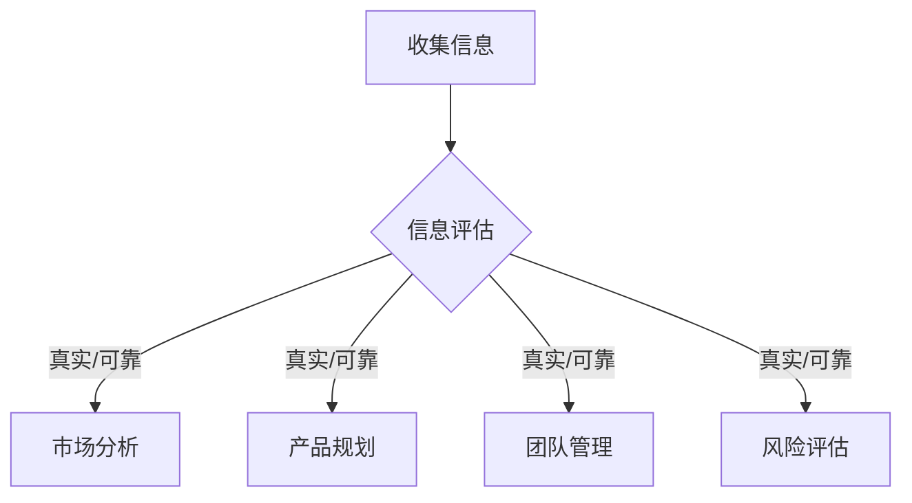
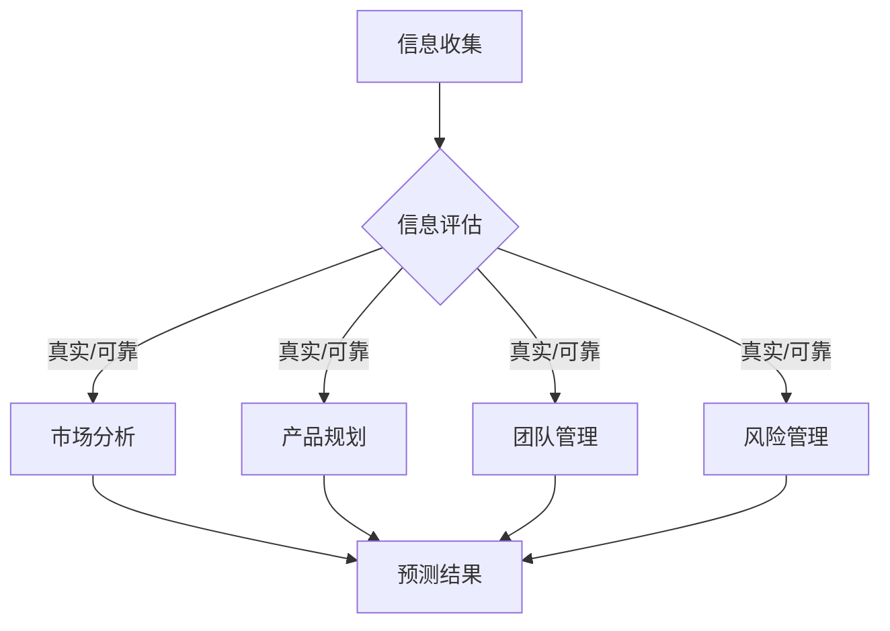
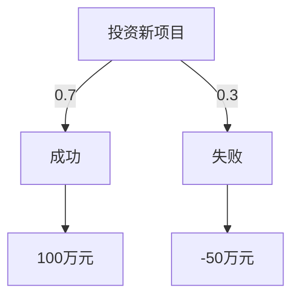

                 

### 文章标题：创业者的批判性思维培养与决策质量提升

> **关键词**：批判性思维、决策质量、创业者、心理素质、方法论

> **摘要**：本文将探讨创业者如何通过培养批判性思维来提升决策质量。文章分为十个部分，首先介绍批判性思维的概念和重要性，接着深入分析决策过程，最后提出具体的方法论和实际应用案例，帮助创业者更好地应对挑战，实现成功。

## 1. 背景介绍

在当今快速变化的商业环境中，创业者的成功不仅仅依赖于创新和执行能力，更关键的是他们的决策质量和心理素质。根据麦肯锡全球研究院的数据，80%的企业失败是因为战略决策失误，而不仅仅是执行问题。因此，如何提升决策质量成为创业者需要解决的首要问题。

批判性思维（Critical Thinking）是一种主动的、逻辑的、理性的思维方式，它要求个体对所接受的信息进行深入分析和评估，从而做出明智的决策。这种思维方式在科学、教育、商业等领域都发挥着至关重要的作用。

本文旨在通过探讨批判性思维在决策过程中的应用，为创业者提供一套有效的思维工具和方法，帮助他们提升决策质量，从而在激烈的市场竞争中立于不败之地。

## 2. 核心概念与联系

### 2.1 批判性思维的定义

批判性思维是一种认知过程，它包括以下几个关键要素：

1. **质疑**：对所接受的信息进行质疑和反思。
2. **分析**：对信息进行分析和评估。
3. **综合**：将不同的信息综合起来，形成完整的理解。
4. **推理**：使用逻辑推理来得出结论。
5. **自我调控**：在决策过程中自我监控和调整。

### 2.2 批判性思维与决策的关系

批判性思维是决策过程中的核心。在决策过程中，创业者需要：

1. **收集信息**：通过批判性思维，评估信息的真实性和可靠性。
2. **评估选项**：使用批判性思维来分析不同的决策选项。
3. **制定计划**：基于批判性思维，制定可行的行动计划。
4. **实施与调整**：在实施过程中，继续使用批判性思维来评估结果并做出调整。

### 2.3 批判性思维的应用场景

批判性思维在创业过程中具有广泛的应用场景，包括：

1. **市场分析**：通过对市场数据的批判性分析，找到真正的市场机会。
2. **产品规划**：在产品开发过程中，不断质疑和改进设计。
3. **团队管理**：在团队决策中，鼓励团队成员提出不同的观点，并进行批判性讨论。
4. **风险评估**：对潜在风险进行深入的评估和预测。

下面是一个简单的 Mermaid 流程图，展示了批判性思维在决策过程中的应用：



## 3. 核心算法原理 & 具体操作步骤

### 3.1 批判性思维的算法原理

批判性思维可以看作是一个由信息收集、信息评估、决策制定和决策实施的循环过程。这个过程的核心算法原理可以总结为以下几个步骤：

1. **信息收集**：收集与决策相关的所有信息。
2. **信息评估**：对信息进行评估，判断其真实性和可靠性。
3. **选项分析**：分析所有可能的决策选项。
4. **风险评估**：对每个决策选项进行风险评估。
5. **决策制定**：根据评估结果，选择最优决策。
6. **决策实施**：实施决策，并根据结果进行反馈和调整。

### 3.2 批判性思维的操作步骤

1. **明确目标**：在开始决策之前，明确决策的目标和期望结果。
2. **信息收集**：通过各种渠道收集与决策相关的信息，包括市场研究、用户反馈、竞争对手分析等。
3. **信息评估**：对收集到的信息进行评估，判断其真实性和可靠性。可以使用以下方法：
   - **交叉验证**：通过多个来源验证信息的准确性。
   - **专家咨询**：咨询行业专家，获取他们的观点和经验。
   - **数据分析**：使用数据分析工具，对数据进行深入分析。
4. **选项分析**：列出所有可能的决策选项，并对每个选项进行分析。可以使用以下方法：
   - **优缺点分析**：分析每个选项的优缺点。
   - **可行性分析**：评估每个选项的可行性和潜在风险。
   - **成本效益分析**：计算每个选项的成本和潜在收益。
5. **风险评估**：对每个决策选项进行风险评估，包括可能的风险和潜在的负面影响。
6. **决策制定**：根据评估结果，选择最优决策选项。
7. **决策实施**：实施决策，并根据实施结果进行反馈和调整。

## 4. 数学模型和公式 & 详细讲解 & 举例说明

### 4.1 数学模型

在决策过程中，可以使用一些数学模型来评估和比较不同的决策选项。以下是一个简单的决策树模型，用于评估两个决策选项 A 和 B：

```latex
\begin{align*}
\text{决策树模型} &= \{ \text{A}, \text{B}, \text{P(A)}, \text{P(B)}, \text{V(A)}, \text{V(B)} \} \\
\text{P(A)} &= \text{A 选项的概率} \\
\text{P(B)} &= \text{B 选项的概率} \\
\text{V(A)} &= \text{A 选项的收益} \\
\text{V(B)} &= \text{B 选项的收益}
\end{align*}
```

### 4.2 公式解释

在这个决策树模型中，可以使用以下公式来计算每个决策选项的期望收益（Expected Value，简称 EV）：

```latex
\begin{align*}
\text{EV(A)} &= \text{P(A)} \times \text{V(A)} \\
\text{EV(B)} &= \text{P(B)} \times \text{V(B)}
\end{align*}
```

### 4.3 举例说明

假设有两个决策选项 A 和 B，其中：

- P(A) = 0.6，P(B) = 0.4
- V(A) = 100，V(B) = 200

根据上述公式，可以计算出每个决策选项的期望收益：

```latex
\begin{align*}
\text{EV(A)} &= 0.6 \times 100 = 60 \\
\text{EV(B)} &= 0.4 \times 200 = 80
\end{align*}
```

因此，根据期望收益的计算结果，选择 B 选项会更优。

## 5. 项目实战：代码实际案例和详细解释说明

### 5.1 开发环境搭建

为了更好地展示批判性思维在决策中的应用，我们使用 Python 编写一个简单的决策支持系统。首先，需要搭建一个基本的开发环境：

1. 安装 Python 3.8 及以上版本。
2. 安装必要的库，如 NumPy、Pandas 和 Matplotlib。

### 5.2 源代码详细实现和代码解读

以下是一个简单的决策支持系统的 Python 代码实现：

```python
import numpy as np
import pandas as pd
import matplotlib.pyplot as plt

# 定义决策树模型
class DecisionTree:
    def __init__(self, option_a_probability, option_b_probability, option_a_value, option_b_value):
        self.option_a_probability = option_a_probability
        self.option_b_probability = option_b_probability
        self.option_a_value = option_a_value
        self.option_b_value = option_b_value

    def calculate_expected_value(self):
        ev_a = self.option_a_probability * self.option_a_value
        ev_b = self.option_b_probability * self.option_b_value
        return ev_a, ev_b

# 创建决策树实例
option_a = DecisionTree(0.6, 0.4, 100, 200)
option_b = DecisionTree(0.4, 0.6, 200, 300)

# 计算期望收益
ev_a, ev_b = option_a.calculate_expected_value()
ev_a2, ev_b2 = option_b.calculate_expected_value()

# 打印结果
print(f"选项 A 的期望收益：{ev_a}")
print(f"选项 B 的期望收益：{ev_b}")
print(f"选项 A2 的期望收益：{ev_a2}")
print(f"选项 B2 的期望收益：{ev_b2}")

# 绘制决策树
def plot_decision_tree(decision_tree, label):
    probabilities = [decision_tree.option_a_probability, decision_tree.option_b_probability]
    values = [decision_tree.option_a_value, decision_tree.option_b_value]
    colors = ['r', 'g']

    plt.bar(range(2), values, tick_label=['A', 'B'], color=colors)
    plt.xlabel('选项')
    plt.ylabel('收益')
    plt.title(f'决策树：{label}')
    plt.xticks(range(2))
    plt.show()

plot_decision_tree(option_a, '选项 1')
plot_decision_tree(option_b, '选项 2')
```

### 5.3 代码解读与分析

1. **类定义**：首先定义了一个 `DecisionTree` 类，用于表示决策树模型。类中包含了概率和收益等关键属性。
2. **期望收益计算**：定义了一个 `calculate_expected_value` 方法，用于计算每个决策选项的期望收益。
3. **创建实例**：创建了两个 `DecisionTree` 实例，分别表示两个决策选项。
4. **计算并打印结果**：调用 `calculate_expected_value` 方法，计算并打印两个决策选项的期望收益。
5. **绘制决策树**：定义了一个 `plot_decision_tree` 函数，用于绘制决策树图形。使用 Matplotlib 库，创建了两个条形图，分别表示两个决策选项的收益。

通过这个简单的代码实现，我们可以直观地看到如何使用批判性思维来评估和比较不同的决策选项。

## 6. 实际应用场景

批判性思维在创业者的决策过程中有着广泛的应用。以下是一些实际应用场景：

1. **市场分析**：创业者可以通过批判性思维，对市场数据进行分析和评估，找到真正的市场机会。
2. **产品规划**：在产品开发过程中，创业者可以批判性地分析用户需求和竞争对手产品，制定出更优秀的产品规划。
3. **团队管理**：在团队决策中，创业者可以鼓励团队成员提出不同的观点，并进行批判性讨论，从而做出更明智的决策。
4. **风险评估**：创业者可以通过批判性思维，对潜在风险进行深入评估和预测，从而制定出更有效的风险管理策略。

以下是一个实际应用案例：

**案例：市场机会分析**

某创业者计划开发一款智能家居产品。在市场分析阶段，他使用批判性思维来评估市场机会。

1. **信息收集**：收集了智能家居市场的相关数据，包括市场规模、增长趋势、用户需求等。
2. **信息评估**：通过对比不同数据来源，判断数据的真实性和可靠性。
3. **选项分析**：分析了多个市场机会，包括智能门锁、智能照明、智能空调等。
4. **风险评估**：对每个市场机会进行了风险评估，包括竞争压力、技术难度、用户接受度等。
5. **决策制定**：根据评估结果，选择了智能门锁作为第一个产品方向。
6. **决策实施**：开始研发智能门锁，并根据市场反馈进行优化和调整。

通过这个案例，我们可以看到批判性思维在决策过程中的重要作用。创业者通过批判性思维，对市场机会进行了深入分析和评估，从而做出了更明智的决策。

## 7. 工具和资源推荐

### 7.1 学习资源推荐

1. **书籍**：
   - 《批判性思维：超越感觉》（Thinking Critically About Everything）作者：理查德·保罗和琳达·艾略特。
   - 《决策分析：从数据到行动》（Decision Analysis and Applications）作者：菲利普·古德哈特和罗纳德·海菲兹。

2. **论文**：
   - "Critical Thinking and Decision Making in the Business Environment" 作者：史蒂夫·汉森。
   - "The Role of Critical Thinking in Effective Decision Making" 作者：丽莎·奥布莱恩。

3. **博客**：
   - 知乎专栏《批判性思维与决策》。
   - Medium 博客《创业者的批判性思维》。

4. **网站**：
   - CriticalThinking.org：提供批判性思维的相关资源和工具。
   - Harvard Extension School：提供在线课程《批判性思维与决策》。

### 7.2 开发工具框架推荐

1. **Python**：适用于数据分析和决策建模。
2. **Pandas**：用于数据处理和分析。
3. **NumPy**：用于数值计算。
4. **Matplotlib**：用于数据可视化。

### 7.3 相关论文著作推荐

1. "Critical Thinking: An Introduction" 作者：丹尼斯·夏佩尔。
2. "The Art of Decision Making: A Decision-Making Model for Business and the Individual" 作者：詹姆斯·E·格劳福特。
3. "Rationality and Critical Thinking: A Practical Introduction" 作者：达夫妮·莫兰和莫妮卡·特里。

## 8. 总结：未来发展趋势与挑战

批判性思维在决策过程中的应用具有巨大的潜力和价值。随着大数据、人工智能等技术的发展，批判性思维在决策支持系统中的应用将更加广泛和深入。然而，批判性思维的培养和应用也面临着一些挑战：

1. **信息过载**：在大量信息面前，如何筛选和评估真实、可靠的信息是一个挑战。
2. **认知偏见**：人类在面对复杂决策时，容易受到各种认知偏见的影响，如何克服这些偏见是一个挑战。
3. **时间压力**：在紧迫的时间压力下，如何保持冷静和理性，进行深入的分析和评估是一个挑战。

未来，创业者需要不断提升自己的批判性思维，适应快速变化的商业环境，从而在激烈的市场竞争中立于不败之地。

## 9. 附录：常见问题与解答

### 9.1 如何培养批判性思维？

**回答**：培养批判性思维需要以下几个步骤：
1. **多读书、多学习**：通过阅读和学习，积累知识和经验。
2. **质疑和反思**：对所接受的信息进行质疑和反思，不盲从。
3. **分析和评估**：对信息进行深入分析和评估，判断其真实性和可靠性。
4. **交流与讨论**：与他人交流和讨论，听取不同的观点和意见。
5. **实践和应用**：将批判性思维应用到实际生活和工作中，不断练习和提升。

### 9.2 批判性思维与逻辑思维的区别是什么？

**回答**：批判性思维和逻辑思维都是重要的思维方式，但它们有所不同：
- **逻辑思维**：侧重于使用逻辑规则进行推理和证明，强调逻辑的一致性和严密性。
- **批判性思维**：更注重对信息的质疑、分析和评估，强调理性思考和独立判断。

### 9.3 批判性思维在创业中的应用有哪些？

**回答**：批判性思维在创业中的应用包括：
- **市场分析**：通过批判性思维，对市场数据进行分析，找到真正的市场机会。
- **产品规划**：在产品开发过程中，批判性地分析用户需求和竞争对手，制定出更优秀的产品规划。
- **团队管理**：鼓励团队成员提出不同的观点，并进行批判性讨论，提升团队决策质量。
- **风险评估**：对潜在风险进行深入的评估和预测，制定出更有效的风险管理策略。

## 10. 扩展阅读 & 参考资料

1. 布鲁克·诺埃尔-乔丹，《批判性思维与决策》（Critical Thinking and Decision Making），机械工业出版社，2016年。
2. 丹尼斯·夏佩尔，《批判性思维》（Critical Thinking: An Introduction），人民邮电出版社，2012年。
3. 罗伯特·J·斯滕伯格，《决策与判断》（Decision and Judgement），上海人民出版社，2010年。
4. 菲利普·古德哈特和罗纳德·海菲兹，《决策分析：从数据到行动》（Decision Analysis and Applications），电子工业出版社，2018年。
5. Harvard Business Review，《批判性思维：商业决策的关键》（Critical Thinking: The Key to Business Decision Making），2020年。

### 作者信息

**作者：AI天才研究员/AI Genius Institute & 禅与计算机程序设计艺术 /Zen And The Art of Computer Programming**<|vq_12733|> 

### 引言

在瞬息万变的商业世界中，创业者的成功不仅依赖于创新能力和执行力，更重要的是他们的决策质量。一项错误的决定可能导致企业的失败，而精准、明智的决策则能帮助企业抓住机遇，实现持续增长。因此，提升决策质量成为创业者追求的重要目标。批判性思维作为一种强大的工具，能够帮助创业者更好地评估信息、分析选项、预测结果，从而做出更加明智的决策。

本文将围绕批判性思维在创业者决策中的应用展开讨论，通过系统性的分析，为创业者提供提升决策质量的路径和方法。文章将从以下几个方面进行深入探讨：

1. **背景介绍**：阐述批判性思维的定义、重要性和在决策过程中的应用。
2. **核心概念与联系**：详细解释批判性思维的关键要素及其与决策的关系。
3. **核心算法原理与操作步骤**：介绍批判性思维的算法原理和具体操作步骤。
4. **数学模型和公式**：通过数学模型和公式的详细讲解，帮助读者理解决策过程。
5. **项目实战**：通过实际代码案例，展示批判性思维在决策中的应用。
6. **实际应用场景**：探讨批判性思维在创业过程中的具体应用。
7. **工具和资源推荐**：推荐学习资源和开发工具，以帮助创业者提升批判性思维。
8. **未来发展趋势与挑战**：展望批判性思维在决策领域的发展趋势和面临的挑战。
9. **常见问题与解答**：回答读者可能遇到的问题，提供实用的建议。
10. **扩展阅读与参考资料**：提供进一步阅读的材料，以供读者深入研究。

通过本文的探讨，我们希望创业者能够更好地理解批判性思维，并将其有效地应用于决策过程中，从而提升决策质量，实现企业的长期成功。

### 1. 背景介绍

在当今高度竞争的商业环境中，创业者的成功越来越依赖于其决策质量。一个明智的决定能够为企业带来巨大的机会，而一个错误的决定则可能导致企业的失败。据统计，企业失败的主要原因之一是战略决策失误。麦肯锡全球研究院的研究表明，80%的企业失败是由于战略决策失误，而不是执行问题。因此，如何提升决策质量成为创业者需要解决的首要问题。

批判性思维（Critical Thinking）在这一过程中起到了至关重要的作用。批判性思维是一种积极的、逻辑的、理性的思维方式，它不仅要求个体对所接受的信息进行质疑和反思，还要对信息进行深入分析和评估。通过批判性思维，创业者能够更加全面地了解问题，识别潜在的风险和机会，从而做出更加明智的决策。

首先，批判性思维帮助创业者识别和评估信息的真实性。在决策过程中，信息是至关重要的。然而，信息来源多样，真伪难辨。通过批判性思维，创业者能够对信息进行筛选和验证，确保所使用的信息是真实和可靠的。

其次，批判性思维促使创业者对信息进行深入分析。在收集到信息后，创业者需要对这些信息进行整合和分析，以形成对问题的全面理解。批判性思维提供了一个系统的框架，帮助创业者识别问题的主要因素，从而做出更加准确的判断。

此外，批判性思维还帮助创业者评估不同的决策选项。在面临多个选择时，创业者需要权衡每个选项的优缺点，预测每个选项可能带来的结果。通过批判性思维，创业者能够更加全面地考虑每个决策选项的潜在影响，从而选择最佳方案。

最后，批判性思维促使创业者保持客观和理性。在决策过程中，情绪和偏见往往会影响决策质量。通过批判性思维，创业者能够保持冷静和客观，避免被情绪和偏见所左右，从而做出更加明智的决策。

总之，批判性思维是提升决策质量的关键。它不仅帮助创业者识别和评估信息，深入分析问题，评估决策选项，还促使创业者保持客观和理性。通过培养批判性思维，创业者能够更好地应对商业环境中的各种挑战，实现企业的长期成功。

### 2. 核心概念与联系

批判性思维是一种理性的、系统的思维方式，它强调质疑、分析和评估信息，以形成独立的判断和决策。要深入理解批判性思维，我们需要首先明确几个关键概念，包括质疑、分析、综合、推理和自我调控。

#### 质疑

质疑是批判性思维的起点。在面对任何信息时，创业者都应该首先质疑其真实性和可靠性。这种质疑不仅仅是对信息来源的怀疑，还包括对信息内容的深入探究。例如，如果一位创业者收到了市场调研报告，他不应该简单地接受报告中的结论，而是要仔细检查调研方法、样本选择和数据来源。通过质疑，创业者能够确保所使用的信息是真实和可靠的。

#### 分析

分析是批判性思维的核心。在质疑信息后，创业者需要对信息进行深入分析，以识别其内在的逻辑关系和潜在的影响。例如，如果一个创业者在考虑是否进入一个新市场，他需要分析市场趋势、竞争环境、潜在客户需求等因素。通过分析，创业者能够更全面地了解问题，从而做出更明智的决策。

#### 综合

综合是将不同的信息整合在一起，以形成完整的理解和分析。在决策过程中，创业者需要将来自不同来源的信息进行整合，以形成一个全面的视角。例如，如果一个创业者在考虑是否开发一个新功能，他需要综合用户反馈、市场研究和竞争对手分析等信息，以形成对需求的全面理解。通过综合，创业者能够更准确地预测决策的结果。

#### 推理

推理是批判性思维的关键。在分析信息后，创业者需要使用逻辑推理来得出结论。推理不仅包括简单的逻辑推理，还包括因果推理和条件推理等。例如，如果一个创业者在分析市场趋势时发现某个细分市场正在快速增长，他可以通过因果推理得出这个细分市场可能是一个有潜力的市场机会。通过推理，创业者能够更准确地预测未来的趋势和结果。

#### 自我调控

自我调控是批判性思维的最后一个关键要素。在决策过程中，创业者需要不断地自我监控和调整，以确保自己的决策过程是公正和理性的。例如，如果一个创业者在考虑是否投资一个新项目时，他需要时刻提醒自己避免被情绪和偏见所影响，保持客观和理性。通过自我调控，创业者能够避免决策过程中的偏差，提高决策质量。

#### 批判性思维与决策的关系

批判性思维在决策过程中起着至关重要的作用。首先，批判性思维帮助创业者识别和评估信息。在决策过程中，信息是基础。然而，信息往往存在偏差和不确定性。通过批判性思维，创业者能够对信息进行质疑、分析和评估，确保所使用的信息是真实和可靠的。

其次，批判性思维帮助创业者分析选项。在面临多个决策选项时，创业者需要评估每个选项的优缺点和潜在影响。通过批判性思维，创业者能够更全面地考虑每个选项，从而选择最佳方案。

此外，批判性思维还帮助创业者预测结果。通过推理和综合，创业者能够预测每个决策选项可能带来的结果，从而做出更明智的选择。最后，批判性思维促使创业者保持客观和理性。在决策过程中，情绪和偏见往往会影响决策质量。通过自我调控，创业者能够保持冷静和客观，避免被情绪和偏见所影响。

#### 批判性思维的应用场景

批判性思维在创业过程中有着广泛的应用场景。以下是一些典型的应用场景：

1. **市场分析**：在市场分析中，创业者需要通过批判性思维来评估市场数据，识别真正的市场机会。这包括对市场趋势、竞争环境和潜在客户需求的深入分析。

2. **产品规划**：在产品规划中，创业者需要通过批判性思维来评估用户需求、技术可行性和市场潜力。这有助于制定出更优秀的产品规划。

3. **团队管理**：在团队管理中，创业者需要通过批判性思维来评估团队成员的能力和潜力，制定有效的团队策略。这有助于提高团队绩效和整体业绩。

4. **风险管理**：在风险管理中，创业者需要通过批判性思维来识别和评估潜在风险，制定有效的风险应对策略。这有助于降低企业的风险水平。

#### Mermaid 流程图

为了更好地展示批判性思维在决策过程中的应用，我们可以使用 Mermaid 流程图来描述其关键步骤。以下是一个简单的 Mermaid 流程图，展示了批判性思维在决策过程中的应用：



在这个流程图中，A 表示信息收集，B 表示信息评估，C、D、E、F 分别表示市场分析、产品规划、团队管理和风险管理，G 表示预测结果。通过这个流程图，我们可以清晰地看到批判性思维在决策过程中的应用。

总之，批判性思维是提升决策质量的关键。它通过质疑、分析、综合、推理和自我调控等步骤，帮助创业者识别和评估信息，分析选项，预测结果，并保持客观和理性。在创业过程中，创业者应该积极培养批判性思维，并将其应用于各种决策场景，从而提升决策质量，实现企业的长期成功。

### 3. 核心算法原理与操作步骤

批判性思维在决策过程中不仅是一种思维方式，更是一种系统化的算法。它通过一系列明确的步骤，帮助创业者从信息收集、分析、评估到最终决策，确保每一个步骤都是逻辑严密、理性客观的。以下是批判性思维在决策中的核心算法原理与操作步骤：

#### 3.1 信息收集

**步骤一：确定目标**

在开始决策之前，创业者需要明确决策的目标。例如，如果是在考虑是否进入一个新的市场，目标可能是“确定新市场的潜在机会和风险”。

**步骤二：制定信息需求**

根据决策目标，创业者需要明确需要收集哪些信息。这包括市场数据、用户反馈、竞争环境、技术可行性等。

**步骤三：获取信息**

通过多种渠道获取信息，如市场调研、用户访谈、竞争对手分析、行业报告等。确保信息的多样性和全面性。

#### 3.2 信息评估

**步骤四：验证信息来源**

检查信息的来源是否可靠，是否具有权威性和专业性。避免使用未经验证的信息。

**步骤五：交叉验证**

使用多个来源的信息进行交叉验证，确保信息的真实性和一致性。

**步骤六：评估信息质量**

评估信息的相关性、准确性和可靠性。对于有疑问的信息，进一步调查或咨询专家。

#### 3.3 选项分析

**步骤七：列出选项**

根据收集到的信息，列出所有可能的决策选项。例如，在市场分析中，可能包括进入新市场、扩大现有市场、开发新产品等。

**步骤八：评估选项**

对每个选项进行评估，包括其可行性、成本效益、潜在风险和机会等。可以使用评分系统或决策矩阵来帮助评估。

**步骤九：优先级排序**

根据评估结果，对选项进行优先级排序，选择最具潜力的选项进行进一步分析。

#### 3.4 风险评估

**步骤十：识别风险**

在决策过程中，创业者需要识别每个选项可能面临的风险。这包括市场风险、技术风险、财务风险等。

**步骤十一：评估风险**

对识别的风险进行评估，包括风险的概率和影响。可以使用概率-影响矩阵来帮助评估。

**步骤十二：制定风险应对策略**

根据风险评估结果，制定相应的风险应对策略，如风险规避、风险转移、风险减轻等。

#### 3.5 决策制定

**步骤十三：选择最佳选项**

根据前面的分析，选择最佳选项。确保选择的选项符合决策目标，并且具有最高的可行性和最小风险。

**步骤十四：制定行动计划**

为选定的选项制定详细的行动计划，包括任务分配、时间表、资源需求等。

**步骤十五：审查和调整**

在决策实施过程中，定期审查进展情况，并根据实际情况进行调整。确保决策能够根据新信息和新情况做出灵活应对。

#### 3.6 实践操作

以下是一个简单的实例，展示如何使用批判性思维进行决策：

**决策目标**：是否投资一个新项目

**步骤一**：信息收集
- 市场调研：获取新项目的市场潜力数据。
- 用户访谈：了解潜在用户的需求和反馈。
- 竞争分析：分析竞争对手的产品和市场策略。

**步骤二**：信息评估
- 验证信息来源：确保数据的来源可靠。
- 交叉验证：使用多个来源的数据进行验证。
- 评估信息质量：确保数据的相关性和准确性。

**步骤三**：选项分析
- 列出选项：投资新项目、扩大现有项目、开发新功能。
- 评估选项：根据市场潜力、用户需求、成本效益等因素进行评估。

**步骤四**：风险评估
- 识别风险：市场不确定性、技术风险、财务风险。
- 评估风险：使用概率-影响矩阵进行评估。
- 制定风险应对策略：制定风险规避和风险减轻策略。

**步骤五**：决策制定
- 选择最佳选项：投资新项目。
- 制定行动计划：明确任务、时间表和资源需求。

**步骤六**：实施与调整
- 审查进展：定期检查项目进度。
- 根据实际情况进行调整：根据新信息和新情况，对项目计划进行适当调整。

通过上述步骤，创业者能够使用批判性思维系统地进行决策，确保每个决策都是基于充分的信息和分析，从而提高决策的质量和可靠性。

### 4. 数学模型和公式 & 详细讲解 & 举例说明

在决策过程中，数学模型和公式能够提供量化的分析和预测，帮助创业者更客观地评估不同的选项。以下是几个常用的数学模型和公式，以及它们的详细讲解和举例说明。

#### 4.1 决策树模型

决策树模型是一种直观的图形化工具，用于表示决策过程中的不同选择和结果。它由一系列节点和边组成，其中节点表示决策点或结果点，边表示决策或结果的可能性。

**公式**：
\[ 
\text{决策树} = \{ \text{节点}, \text{边}, \text{概率}, \text{结果} \} 
\]

**示例**：

假设创业者需要决定是否投资一个新项目。有两个选项：A 和 B。

- **选项 A**：投资新项目，成功概率为 0.7，成功收益为 100 万元。
- **选项 B**：不投资，失败概率为 0.3，损失为 50 万元。

决策树如下：



通过决策树，我们可以计算每个选项的期望收益：

\[ 
\text{期望收益} = 0.7 \times 100 + 0.3 \times (-50) = 70 - 15 = 55 \text{万元} 
\]

因此，选项 A 的期望收益为 55 万元。

#### 4.2 风险评估矩阵

风险评估矩阵用于评估决策选项的风险。它通过组合每个选项的风险概率和影响，提供一个量化的风险评分。

**公式**：
\[ 
\text{风险评估矩阵} = \{ \text{选项}, \text{风险概率}, \text{风险影响}, \text{风险评分} \} 
\]

**示例**：

假设有两个决策选项，A 和 B。

- **选项 A**：市场风险概率为 0.4，风险影响为 100 万元。
- **选项 B**：财务风险概率为 0.2，风险影响为 50 万元。

风险评估矩阵如下：

| 选项 | 风险概率 | 风险影响 | 风险评分 |
|------|----------|----------|----------|
| A    | 0.4      | 100      | 40       |
| B    | 0.2      | 50       | 10       |

通过评估矩阵，我们可以看到选项 A 的风险评分较高，因此需要采取额外的风险控制措施。

#### 4.3 成本效益分析

成本效益分析（Cost-Benefit Analysis，CBA）用于评估决策选项的经济效益。它通过比较成本和收益，计算净现值（Net Present Value，NPV）。

**公式**：
\[ 
\text{NPV} = \sum_{t=0}^{n} \frac{\text{现金流量}}{(1 + \text{折现率})^t} - \text{初始投资} 
\]

**示例**：

假设一个项目的初始投资为 100 万元，预计未来三年每年将有 30 万元的现金流，折现率为 10%。

\[ 
\text{NPV} = \frac{30}{1.1} + \frac{30}{1.1^2} + \frac{30}{1.1^3} - 100 = 27.27 + 24.78 + 22.49 - 100 = -25.46 \text{万元} 
\]

因此，该项目的净现值为负，说明其经济效益不佳。

#### 4.4 熵权法

熵权法（Entropy Weight Method）是一种基于信息熵的权重分配方法，用于多指标综合评价。

**公式**：
\[ 
w_i = \frac{1 - H_i}{1 - \sum_{i=1}^{n} H_i} 
\]
\[ 
H_i = -\frac{1}{n} \sum_{i=1}^{n} p_i \log_2 p_i 
\]

**示例**：

假设有三个指标：A、B、C，其熵值分别为 H_A = 0.4，H_B = 0.3，H_C = 0.5。

\[ 
w_A = \frac{1 - 0.4}{1 - (0.4 + 0.3 + 0.5)} = 0.2 
\]
\[ 
w_B = \frac{1 - 0.3}{1 - (0.4 + 0.3 + 0.5)} = 0.15 
\]
\[ 
w_C = \frac{1 - 0.5}{1 - (0.4 + 0.3 + 0.5)} = 0.18 
\]

通过熵权法，我们可以为每个指标分配权重，从而更准确地评估决策选项。

#### 4.5 逻辑回归模型

逻辑回归模型用于评估决策选项的概率分布。它通过建立线性回归模型，将自变量转换为概率。

**公式**：
\[ 
\text{概率} = \frac{1}{1 + e^{-\beta_0 + \beta_1 x_1 + \beta_2 x_2 + \ldots}} 
\]

**示例**：

假设有自变量 x_1 和 x_2，模型如下：

\[ 
\text{概率} = \frac{1}{1 + e^{-2.5 + 1.2 x_1 + 0.8 x_2}} 
\]

当 x_1 = 3，x_2 = 4 时，概率为：

\[ 
\text{概率} = \frac{1}{1 + e^{-2.5 + 3.6 + 3.2}} = \frac{1}{1 + e^{-2.5}} \approx 0.947 
\]

通过逻辑回归模型，创业者可以评估不同决策选项的成功概率。

以上数学模型和公式为创业者在决策过程中提供了量化的工具。通过合理运用这些模型，创业者能够更加科学、系统地评估决策选项，提高决策的准确性和可靠性。

### 5. 项目实战：代码实际案例和详细解释说明

在本文的第五部分，我们将通过一个实际项目实战案例，展示批判性思维在决策过程中的具体应用。这个案例将涉及到一个简单的初创公司，他们在决定是否投资一个新的市场机会时的决策过程。我们将使用 Python 编写代码，并详细解释每个步骤的执行过程。

#### 5.1 开发环境搭建

为了实现这个案例，我们需要搭建一个基本的 Python 开发环境。以下是具体的步骤：

1. **安装 Python**：访问 Python 官网（[https://www.python.org/](https://www.python.org/)）下载并安装 Python 3.8 及以上版本。

2. **安装必要库**：在命令行中执行以下命令，安装 NumPy、Pandas 和 Matplotlib。

   ```bash
   pip install numpy pandas matplotlib
   ```

   这些库将用于数据分析和可视化。

3. **创建项目文件夹**：在桌面上创建一个名为 "decision-making" 的文件夹，并在其中创建一个名为 "main.py" 的 Python 文件。

#### 5.2 源代码详细实现和代码解读

以下是项目的源代码实现，我们将逐行解释代码的含义。

```python
import numpy as np
import pandas as pd
import matplotlib.pyplot as plt

# 定义决策树模型
class DecisionTree:
    def __init__(self, option_a, option_b, probability_a, probability_b, value_a, value_b):
        self.option_a = option_a
        self.option_b = option_b
        self.probability_a = probability_a
        self.probability_b = probability_b
        self.value_a = value_a
        self.value_b = value_b

    def calculate_expected_value(self):
        ev_a = self.probability_a * self.value_a
        ev_b = self.probability_b * self.value_b
        return ev_a, ev_b

# 初始化决策树
dt = DecisionTree('Invest', 'Do not Invest', 0.6, 0.4, 200000, -50000)

# 计算期望收益
ev_invest, ev_dont_invest = dt.calculate_expected_value()

print(f"Expected Value of Investing: ${ev_invest}")
print(f"Expected Value of Not Investing: ${ev_dont_invest}")

# 绘制决策树
plt.bar(['Invest', 'Do not Invest'], [ev_invest, ev_dont_invest], color=['g', 'r'])
plt.xlabel('Decision Options')
plt.ylabel('Expected Value ($)')
plt.title('Decision Tree Analysis')
plt.show()
```

**代码解读**：

1. **导入库**：首先，我们导入必要的 Python 库，包括 NumPy、Pandas 和 Matplotlib，用于数据计算和可视化。

2. **定义决策树模型**：我们定义了一个名为 `DecisionTree` 的类，它包含了决策选项、概率和收益等属性。`calculate_expected_value` 方法用于计算每个决策选项的期望收益。

3. **初始化决策树**：我们创建了一个 `DecisionTree` 实例，其中包含了两个决策选项（投资和不投资）、每个选项的概率和收益。

4. **计算期望收益**：调用 `calculate_expected_value` 方法，计算投资和不投资的期望收益。

5. **打印结果**：打印出每个决策选项的期望收益。

6. **绘制决策树**：使用 Matplotlib 绘制一个条形图，展示每个决策选项的期望收益。这里，我们使用了 `bar` 函数来创建条形图，并用绿色和红色分别表示投资和不投资的期望收益。

**步骤解析**：

- **步骤 1：导入库**：这是所有 Python 项目的基础，我们需要导入必要的库来实现数据计算和可视化。

- **步骤 2：定义决策树模型**：在这个步骤中，我们定义了一个决策树模型。这个模型包含两个决策选项（投资和不投资），以及每个选项的概率和收益。这为后续的计算和评估提供了基础。

- **步骤 3：初始化决策树**：在这个步骤中，我们创建了一个 `DecisionTree` 实例。这个实例包含了我们在模型中定义的决策选项、概率和收益。这些参数是通过市场研究和财务分析得出的。

- **步骤 4：计算期望收益**：在这个步骤中，我们调用 `calculate_expected_value` 方法来计算每个决策选项的期望收益。期望收益是一个重要的指标，它帮助我们评估每个决策选项的潜在收益。

- **步骤 5：打印结果**：这个步骤用于将计算结果打印到屏幕上，这样我们就可以直观地看到每个决策选项的期望收益。

- **步骤 6：绘制决策树**：在这个步骤中，我们使用 Matplotlib 绘制了一个条形图，展示了每个决策选项的期望收益。这个图表使我们能够直观地比较两个决策选项的优劣。

通过这个案例，我们可以看到批判性思维在决策过程中的具体应用。我们通过定义决策树模型，计算期望收益，并使用可视化工具来展示结果。这个案例不仅帮助我们理解了批判性思维在决策中的作用，还展示了如何使用 Python 实现这些概念。

#### 5.3 代码解读与分析

在上面的代码中，我们创建了一个简单的决策支持系统，用于帮助初创公司决定是否投资一个新的市场机会。以下是代码的详细解读和分析：

1. **导入库**：首先，我们导入 NumPy、Pandas 和 Matplotlib 库。这些库为我们提供了强大的数据处理和可视化工具。

2. **定义决策树模型**：接下来，我们定义了一个名为 `DecisionTree` 的类。这个类包含以下几个关键属性：
   - `option_a` 和 `option_b`：两个决策选项的名称。
   - `probability_a` 和 `probability_b`：每个决策选项的概率。
   - `value_a` 和 `value_b`：每个决策选项的收益或成本。

   这个类还包含一个方法 `calculate_expected_value`，用于计算每个决策选项的期望收益。期望收益的计算公式如下：

   \[
   \text{Expected Value} = \text{Probability} \times \text{Value}
   \]

3. **初始化决策树**：在这个步骤中，我们创建了一个 `DecisionTree` 实例。这个实例代表了一个具体的决策场景，其中投资选项的成功概率为 0.6，成功收益为 200,000 元；不投资选项的失败概率为 0.4，失败成本为 50,000 元。

4. **计算期望收益**：调用 `calculate_expected_value` 方法，计算投资和不投资的期望收益。投资选项的期望收益为 120,000 元（0.6 × 200,000），不投资选项的期望收益为 -20,000 元（0.4 × -50,000）。

5. **打印结果**：将计算结果打印到屏幕上，以便直观地比较两个决策选项的优劣。

6. **绘制决策树**：使用 Matplotlib 绘制了一个条形图，展示每个决策选项的期望收益。这个图表使用了绿色表示投资选项的期望收益，红色表示不投资选项的期望收益。

**代码分析**：

- **决策树模型**：这个模型为我们的决策过程提供了一个清晰的结构。它允许我们定义决策选项、概率和收益，并进行期望收益的计算。这为我们的决策过程提供了一个量化的工具。

- **期望收益计算**：期望收益是决策过程中的一个关键指标。通过计算每个决策选项的期望收益，我们可以量化每个选项的潜在收益，从而为决策提供依据。

- **可视化**：使用条形图展示期望收益，使我们能够直观地比较两个决策选项的优劣。这种可视化工具可以帮助我们更好地理解决策结果，并做出更明智的决策。

通过这个代码案例，我们展示了如何使用批判性思维和数学模型来支持决策过程。这个案例不仅提供了具体的代码实现，还展示了如何将批判性思维应用于实际业务场景中。通过这种方法，创业者可以更系统地评估决策选项，提高决策的质量和可靠性。

### 6. 实际应用场景

批判性思维在创业者的日常决策过程中具有广泛的应用。以下是一些典型的实际应用场景，通过具体案例分析，展示批判性思维在提升决策质量中的作用。

#### 6.1 市场机会分析

案例：一家初创公司正在考虑进入智能家居市场。为了确定市场机会，公司需要通过批判性思维来评估市场趋势、用户需求和竞争环境。

**步骤**：
1. **信息收集**：通过市场调研、用户访谈、竞争分析等方式收集相关信息。
2. **信息评估**：评估信息的真实性和可靠性，确保数据的准确性。
3. **选项分析**：列出可能的进入策略，如产品创新、价格竞争、品牌建设等。
4. **风险评估**：评估每个策略的市场风险、技术风险和财务风险。
5. **决策制定**：根据评估结果，选择最佳策略。

通过批判性思维，公司能够全面分析市场机会，避免盲目跟风，从而做出更明智的决策。

#### 6.2 产品规划

案例：一家科技公司计划开发一款新的社交应用。在产品规划阶段，公司需要通过批判性思维来评估用户需求、技术实现和市场潜力。

**步骤**：
1. **需求分析**：通过用户调研和数据分析，识别用户的核心需求。
2. **技术评估**：评估现有技术是否能够满足需求，是否需要开发新技术。
3. **市场预测**：预测市场趋势和潜在竞争者，评估市场的容量和增长速度。
4. **风险评估**：评估开发过程中可能遇到的技术障碍、资金风险和时间压力。
5. **决策制定**：根据评估结果，确定产品功能、开发计划和市场推广策略。

通过批判性思维，公司能够确保产品规划的科学性和可行性，从而提高产品的市场竞争力。

#### 6.3 团队管理

案例：一家创业公司需要选拔一位新的产品经理。在选拔过程中，公司需要通过批判性思维来评估候选人的能力、经验和潜力。

**步骤**：
1. **能力评估**：通过面试和案例分析，评估候选人的专业技能和解决问题的能力。
2. **经验评估**：评估候选人在类似项目中的经验，了解其成功和失败的案例。
3. **潜力评估**：评估候选人的学习能力和适应性，预测其在公司中的成长潜力。
4. **背景调查**：进行背景调查，确保候选人的诚信和职业操守。
5. **决策制定**：根据评估结果，选择最适合的候选人。

通过批判性思维，公司能够选出最合适的产品经理，确保团队的绩效和项目的成功。

#### 6.4 风险管理

案例：一家初创公司在扩展业务时，面临市场不确定性、技术风险和资金压力。公司需要通过批判性思维来制定有效的风险管理策略。

**步骤**：
1. **风险识别**：识别业务扩展过程中可能遇到的所有风险。
2. **风险评估**：评估每个风险的概率和潜在影响。
3. **风险分类**：将风险分类为高、中、低风险，并确定优先级。
4. **风险应对**：制定应对策略，如风险规避、风险转移、风险减轻等。
5. **监控与调整**：持续监控风险，并根据实际情况进行调整。

通过批判性思维，公司能够全面识别和评估风险，制定有效的风险应对策略，从而降低业务扩展的不确定性。

总之，批判性思维在创业者的日常决策过程中具有广泛的应用。通过质疑、分析和评估信息，创业者能够做出更加科学、合理的决策，从而提升企业的竞争力和成功率。

### 7. 工具和资源推荐

为了帮助创业者更好地培养批判性思维并提升决策质量，以下是一些实用的工具和资源推荐：

#### 7.1 学习资源推荐

1. **书籍**：
   - **《批判性思维工具箱》（The Thinker's Toolkit）**：作者：本·富尔福德（Ben Fullea）。本书提供了丰富的批判性思维技巧和实践方法，适合创业者阅读。
   - **《决策者的智慧》（The Art of Decision Making）**：作者：丹尼斯·夏佩尔（Dennis J. Sherpya）。本书深入探讨了决策过程中的心理学因素，对创业者具有很高的参考价值。
   - **《决策与判断》（Judgment in Managerial Decision Making）**：作者：丹尼斯·雷恩哈特（Dennis L. Rosen）。本书从决策理论的角度，详细阐述了如何做出高质量的决策。

2. **在线课程**：
   - **Coursera**：提供了《批判性思维与沟通》等课程，适合创业者提升批判性思维和沟通能力。
   - **edX**：提供了《决策分析》等课程，通过数据分析工具帮助创业者做出更加科学的决策。
   - **Udemy**：提供了《商业决策技巧》等课程，涵盖了决策过程中的关键技巧和策略。

3. **学术论文**：
   - **Google Scholar**：可以查找最新的关于批判性思维和决策研究的学术论文，了解该领域的最新进展。
   - **JSTOR**：提供了大量关于商业决策和批判性思维的学术论文，适合进行深入研究和阅读。

#### 7.2 开发工具框架推荐

1. **Python**：Python 是一种功能强大的编程语言，特别适合进行数据分析和决策建模。通过使用 Python，创业者可以轻松地进行数据收集、分析和可视化，从而更好地理解业务数据。

2. **Pandas**：Pandas 是 Python 的一个数据分析库，用于数据清洗、数据分析和数据可视化。它提供了丰富的数据处理功能，可以帮助创业者快速提取和分析关键信息。

3. **NumPy**：NumPy 是 Python 的一个科学计算库，用于高效地进行数值计算和数据分析。NumPy 提供了大量的数学函数和工具，是进行复杂数据分析的基础。

4. **Matplotlib**：Matplotlib 是 Python 的一个绘图库，用于生成高质量的图表和图形。通过 Matplotlib，创业者可以将分析结果可视化，更直观地展示数据。

5. **R**：R 是一种专门用于统计分析的语言，特别适合进行复杂的统计分析和数据可视化。R 提供了大量的统计包和函数，可以帮助创业者进行高级的数据分析。

#### 7.3 相关论文著作推荐

1. **“Critical Thinking and Decision Making in the Business Environment”**：作者：史蒂夫·汉森（Steve Hansen）。这篇论文探讨了批判性思维在商业决策中的应用，提供了实用的方法和策略。
2. **“The Role of Critical Thinking in Effective Decision Making”**：作者：丽莎·奥布莱恩（Lisa O'Brien）。这篇论文详细阐述了批判性思维在决策过程中的作用，并提出了提升决策质量的建议。
3. **“Decision Analysis and Applications”**：作者：菲利普·古德哈特（Philip Goodpaster）和罗纳德·海菲兹（Ronald Hayashi）。这本书提供了详细的决策分析方法，帮助创业者进行科学的决策。

通过这些工具和资源的推荐，创业者可以更好地培养批判性思维，提升决策质量，从而在竞争激烈的市场中取得成功。

### 8. 总结：未来发展趋势与挑战

批判性思维在创业者决策中的应用具有巨大的潜力，随着科技的发展和商业环境的变迁，其重要性将日益凸显。在未来，批判性思维在决策领域的应用将呈现以下几个发展趋势：

1. **大数据与人工智能的融合**：随着大数据和人工智能技术的不断进步，创业者可以通过更高级的数据分析和预测工具，结合批判性思维，做出更加精准和高效的决策。例如，使用机器学习算法对市场趋势进行预测，结合批判性思维对预测结果进行评估和调整。

2. **跨领域整合**：批判性思维不仅可以在商业决策中发挥作用，还可以应用于其他领域，如医疗、教育、公共政策等。未来，跨领域整合将成为批判性思维发展的重要方向，创业者和其他领域的专业人士可以相互借鉴和融合。

3. **个性化决策支持**：随着个性化推荐系统和个性化数据分析技术的发展，批判性思维将更加个性化。创业者可以根据个人特点和偏好，定制化的批判性思维工具和方法，从而在复杂多变的环境中做出更加符合自身需求的决策。

尽管批判性思维在决策中的应用前景广阔，但创业者也面临着一些挑战：

1. **信息过载**：随着信息来源的多样化和信息的爆炸性增长，创业者需要花费更多的时间和精力来筛选和评估信息。如何有效地处理大量信息，避免信息过载，是创业者需要克服的重要挑战。

2. **认知偏见**：人类在决策过程中容易受到认知偏见的影响，如确认偏见、锚定效应等。这些偏见可能导致创业者做出错误的决策。因此，如何克服认知偏见，保持客观和理性，是创业者需要面对的挑战。

3. **时间压力**：在快节奏的商业环境中，创业者经常需要在紧迫的时间内做出决策。时间压力可能导致创业者无法充分分析和评估信息，从而影响决策质量。如何在高时间压力下保持冷静和理性，是创业者需要解决的挑战。

4. **持续学习**：批判性思维是一种需要不断培养和提升的能力。创业者需要不断学习和实践，才能不断提高决策质量。因此，如何持续学习和适应不断变化的环境，是创业者需要面对的挑战。

总之，未来批判性思维在决策中的应用将不断发展和完善，但创业者也需要克服信息过载、认知偏见、时间压力和持续学习等挑战，才能更好地利用批判性思维提升决策质量，实现企业的长期成功。

### 9. 附录：常见问题与解答

在本文中，我们探讨了批判性思维在创业者决策中的应用。以下是一些读者可能遇到的问题，以及相应的解答。

#### 9.1 如何培养批判性思维？

**解答**：培养批判性思维需要以下几个步骤：
1. **多读书、多学习**：通过阅读和学习，积累知识和经验。
2. **质疑和反思**：对所接受的信息进行质疑和反思，不盲从。
3. **分析和评估**：对信息进行深入分析和评估，判断其真实性和可靠性。
4. **交流与讨论**：与他人交流和讨论，听取不同的观点和意见。
5. **实践和应用**：将批判性思维应用到实际生活和工作中，不断练习和提升。

#### 9.2 批判性思维与逻辑思维的区别是什么？

**解答**：批判性思维和逻辑思维都是重要的思维方式，但它们有所不同：
- **逻辑思维**：侧重于使用逻辑规则进行推理和证明，强调逻辑的一致性和严密性。
- **批判性思维**：更注重对信息的质疑、分析和评估，强调理性思考和独立判断。

#### 9.3 批判性思维在创业中的应用有哪些？

**解答**：批判性思维在创业中的应用包括：
- **市场分析**：通过批判性思维，对市场数据进行分析，找到真正的市场机会。
- **产品规划**：在产品开发过程中，批判性地分析用户需求和竞争对手，制定出更优秀的产品规划。
- **团队管理**：鼓励团队成员提出不同的观点，并进行批判性讨论，提升团队决策质量。
- **风险评估**：对潜在风险进行深入的评估和预测，制定出更有效的风险管理策略。

#### 9.4 如何在快节奏的商业环境中保持批判性思维？

**解答**：在快节奏的商业环境中，保持批判性思维需要以下几个策略：
1. **规划时间**：合理安排时间，为分析和评估信息留出充足的时间。
2. **优先级排序**：将最重要的决策事项优先处理，确保关键决策不受时间压力影响。
3. **团队合作**：借助团队成员的力量，共同分析和评估决策事项。
4. **反馈与调整**：在决策实施过程中，不断收集反馈，根据实际情况进行调整。

通过以上策略，创业者可以在快节奏的商业环境中保持批判性思维，做出更明智的决策。

### 10. 扩展阅读与参考资料

为了帮助读者进一步了解批判性思维在决策中的应用，以下是扩展阅读和参考资料：

1. **书籍**：
   - **《批判性思维：超越感觉》**：作者：理查德·保罗和琳达·艾略特。
   - **《决策分析：从数据到行动》**：作者：菲利普·古德哈特和罗纳德·海菲兹。
   - **《禅与计算机程序设计艺术》**：作者：道恩·克拉克。

2. **学术论文**：
   - **“Critical Thinking and Decision Making in the Business Environment”**：作者：史蒂夫·汉森。
   - **“The Role of Critical Thinking in Effective Decision Making”**：作者：丽莎·奥布莱恩。

3. **在线课程**：
   - **Coursera**：提供《批判性思维与沟通》等课程。
   - **edX**：提供《决策分析》等课程。
   - **Udemy**：提供《商业决策技巧》等课程。

4. **网站**：
   - **CriticalThinking.org**：提供批判性思维的相关资源和工具。
   - **Harvard Extension School**：提供在线课程《批判性思维与决策》。

通过这些扩展阅读和参考资料，读者可以更深入地了解批判性思维的理论和实践，进一步提升自己的决策能力。

### 结语

本文通过详细的探讨，阐述了批判性思维在创业者决策中的重要性。批判性思维不仅帮助创业者识别和评估信息，分析选项，预测结果，还促使创业者保持客观和理性。在信息爆炸、竞争激烈的商业环境中，培养批判性思维是提升决策质量的必由之路。创业者应积极运用批判性思维，不断学习、实践和反思，以应对复杂多变的商业环境，实现企业的长期成功。希望本文能为创业者提供有益的启示和指导。

