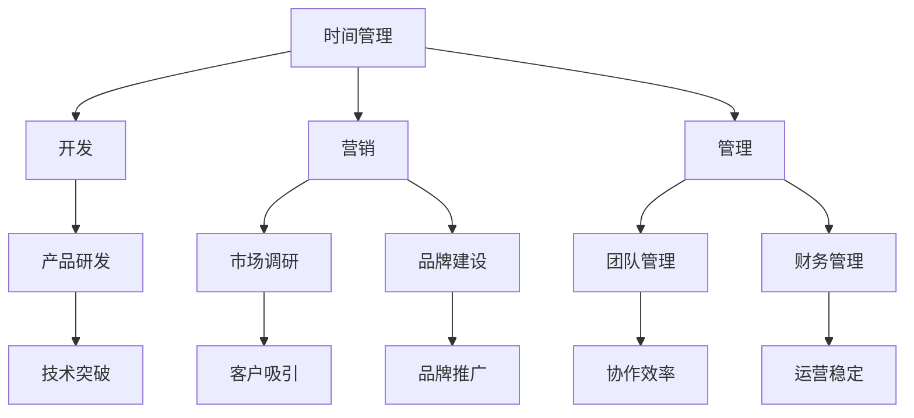
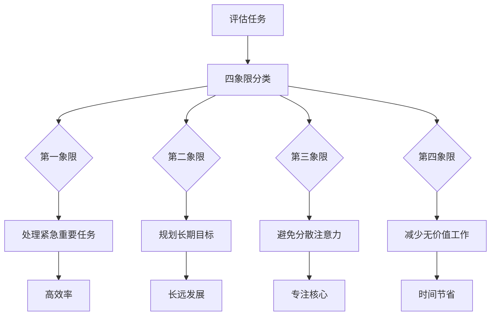
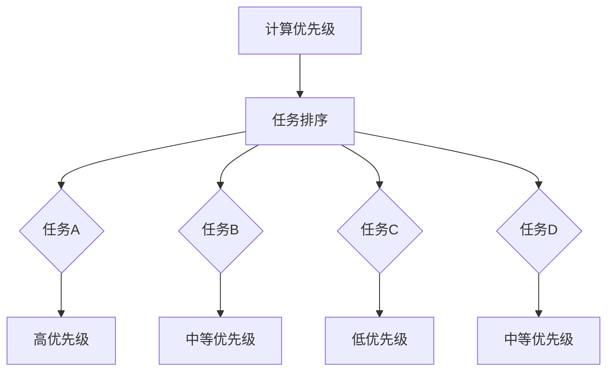

                 

# 创业者的时间管理：如何兼顾开发、营销和管理

> **关键词：** 创业者，时间管理，开发，营销，管理

> **摘要：** 本文将探讨创业者如何在有限的资源下，有效地管理时间，同时兼顾开发、营销和管理三者的需求。我们将从多个角度进行分析，并提供实用的策略和建议，帮助创业者更好地平衡这些关键任务。

## 1. 背景介绍

在快速发展的科技和商业环境中，创业者面临着巨大的挑战。他们不仅要掌握先进的技术，还要懂得市场运营和团队管理。然而，时间是一个有限的资源，如何合理分配时间，成为许多创业者成功的关键因素。

在创业初期，开发者往往需要投入大量时间在产品研发上，而营销和管理则容易被忽视。然而，一个成功的创业项目不仅仅依赖于技术上的突破，还需要有效的市场推广和团队协作。因此，如何在时间分配上实现开发、营销和管理的平衡，成为创业者亟待解决的问题。

本文将从以下几个方面进行探讨：

- **核心概念与联系**：介绍创业者需要理解的核心概念，如时间管理、开发、营销和管理，并展示它们之间的关联。
- **核心算法原理 & 具体操作步骤**：提供实用的方法，帮助创业者优化时间分配。
- **数学模型和公式 & 详细讲解 & 举例说明**：通过数学模型和实际案例，说明如何更有效地管理时间。
- **项目实战：代码实际案例和详细解释说明**：通过具体的项目案例，展示如何将时间管理策略应用于实际场景。
- **实际应用场景**：分析不同的创业阶段和应用场景，给出针对性的时间管理建议。
- **工具和资源推荐**：推荐一些有助于时间管理和提升工作效率的工具和资源。

让我们开始这段深入探讨之旅。

## 2. 核心概念与联系

### 时间管理

时间管理是指通过规划和控制时间，提高工作效率和生活质量的一种方法。对于创业者来说，时间管理尤为重要，因为他们的时间和精力是有限的。有效的时间管理可以帮助创业者更好地平衡开发、营销和管理任务。

### 开发

开发是创业过程中至关重要的一环，它是将创意转化为实际产品的过程。创业者需要确保团队有足够的时间和资源来研发和改进产品，以满足市场需求。

### 营销

营销是创业成功的另一个关键因素。创业者需要投入时间在市场调研、品牌建设和推广上，以吸引潜在客户。有效的营销策略可以提高产品的知名度，增加销售额。

### 管理

管理包括团队管理、财务管理、项目管理等方面。创业者需要确保团队能够高效协作，项目能够按时完成，同时要关注公司的财务状况，确保公司稳定运营。

### 关联

开发、营销和管理之间存在着紧密的联系。开发是产品的基础，营销是推广的手段，而管理则是保障团队和项目顺利进行的保障。一个成功的创业者需要在这三者之间找到平衡，以确保公司的发展。

### Mermaid 流程图

下面是一个简单的 Mermaid 流程图，展示了创业者如何将时间分配到开发、营销和管理三个核心领域。



通过这个流程图，我们可以看到，时间管理是整个流程的核心，它将开发、营销和管理三个领域有机地结合在一起。创业者需要根据实际情况，合理分配时间，确保每个领域都得到充分的关注。

## 3. 核心算法原理 & 具体操作步骤

### 经典时间管理模型：四象限法

四象限法是一种常见的时间管理模型，它将任务根据紧急程度和重要性分为四个象限。

- **第一象限（紧急且重要）**：处理突发事件和紧急任务，如客户投诉、紧急会议等。
- **第二象限（重要但不紧急）**：规划长期目标和策略，如市场调研、团队建设等。
- **第三象限（紧急但不重要）**：避免参与不必要的会议和活动，如无关的社交活动、不必要的邮件等。
- **第四象限（不紧急且不重要）**：减少无价值的工作，如社交媒体上的浪费时间。

### 操作步骤

1. **评估任务**：根据紧急程度和重要性，将所有任务分为四个象限。
2. **优先处理**：首先处理第一象限的任务，因为这些任务是紧急且重要的。
3. **规划长期目标**：投入时间在第二象限的任务上，尽管这些任务不紧急，但它们对长远发展至关重要。
4. **避免分散注意力**：尽量减少第三和第四象限的任务，以提高工作效率。
5. **定期回顾**：定期回顾任务完成情况，并根据实际情况调整时间分配。

### 核心算法原理

四象限法的核心算法原理是基于“优先级排序”，它可以帮助创业者将有限的时间投入到最有价值的任务中。通过将任务进行分类，创业者可以更清晰地了解自己的时间如何被分配，以及如何优化时间利用。

### Mermaid 流程图

下面是一个简单的 Mermaid 流程图，展示了如何使用四象限法进行时间管理。



通过这个流程图，我们可以看到，四象限法提供了一个结构化的方法，帮助创业者更好地管理时间，确保关键任务得到优先处理。

## 4. 数学模型和公式 & 详细讲解 & 举例说明

### 优先级排序模型

为了更科学地管理时间，创业者可以使用优先级排序模型。这个模型基于任务的重要性和紧急程度，对任务进行排序，以确保关键任务得到优先处理。

### 公式

优先级（P）= 重要性（I）× 紧急程度（E）

其中，重要性（I）和紧急程度（E）的取值范围均为0到1。

- 当I = 1 且 E = 1，任务具有最高优先级。
- 当I = 0 且 E = 0，任务具有最低优先级。

### 详细讲解

1. **计算任务优先级**：对于每个任务，计算其优先级。优先级越高的任务，越应该被优先处理。
2. **任务排序**：根据计算出的优先级，对任务进行排序。优先级高的任务排在前面，优先级低的任务排在后面。
3. **动态调整**：随着时间的推移，任务的重要性和紧急程度可能会发生变化。创业者需要定期回顾任务列表，并根据实际情况调整任务排序。

### 举例说明

假设创业者有四个任务，分别是：

- 任务A：开发新功能，重要性 = 0.8，紧急程度 = 0.9
- 任务B：市场调研，重要性 = 0.7，紧急程度 = 0.6
- 任务C：团队建设，重要性 = 0.6，紧急程度 = 0.4
- 任务D：财务报告，重要性 = 0.5，紧急程度 = 0.8

根据优先级公式，计算每个任务的优先级：

- 任务A：P = 0.8 × 0.9 = 0.72
- 任务B：P = 0.7 × 0.6 = 0.42
- 任务C：P = 0.6 × 0.4 = 0.24
- 任务D：P = 0.5 × 0.8 = 0.40

排序结果为：任务A > 任务D > 任务B > 任务C

根据这个排序，创业者应该首先处理任务A，因为它具有最高的优先级。

### Mermaid 流程图

下面是一个简单的 Mermaid 流程图，展示了如何使用优先级排序模型进行时间管理。



通过这个流程图，我们可以看到，优先级排序模型提供了一个清晰的任务排序方法，帮助创业者更有效地管理时间。

## 5. 项目实战：代码实际案例和详细解释说明

### 项目背景

假设我们是一家初创公司，正在开发一款智能健康监测应用。由于资源和时间的限制，我们需要高效地管理开发、营销和管理任务。以下是一个具体的代码实现，展示如何使用时间管理策略来提升工作效率。

### 开发环境搭建

首先，我们需要搭建一个开发环境。这里推荐使用以下工具：

- **集成开发环境（IDE）**：如Visual Studio Code或IntelliJ IDEA。
- **版本控制工具**：如Git，用于代码管理和协作。
- **项目管理工具**：如JIRA或Trello，用于任务追踪和进度管理。

### 源代码详细实现和代码解读

以下是我们的项目代码框架：

```python
import time
from queue import PriorityQueue

# 任务类
class Task:
    def __init__(self, name, importance, urgency):
        self.name = name
        self.importance = importance
        self.urgency = urgency
        self.priority = importance * urgency

    def __lt__(self, other):
        return self.priority < other.priority

# 时间管理类
class TimeManager:
    def __init__(self):
        self.task_queue = PriorityQueue()

    def add_task(self, task):
        self.task_queue.put(task)

    def process_tasks(self):
        while not self.task_queue.empty():
            task = self.task_queue.get()
            print(f"处理任务：{task.name}")
            time.sleep(1)  # 模拟任务处理时间

# 实例化时间管理类
manager = TimeManager()

# 添加任务
manager.add_task(Task("开发新功能", 0.8, 0.9))
manager.add_task(Task("市场调研", 0.7, 0.6))
manager.add_task(Task("团队建设", 0.6, 0.4))
manager.add_task(Task("财务报告", 0.5, 0.8))

# 处理任务
manager.process_tasks()
```

### 代码解读与分析

1. **任务类**：定义了一个`Task`类，用于存储任务的名称、重要性和紧急程度，以及计算优先级的方法。
2. **时间管理类**：定义了一个`TimeManager`类，用于添加任务和按优先级处理任务。它使用了一个优先级队列（`PriorityQueue`），确保任务按优先级顺序处理。
3. **实例化与添加任务**：创建一个`TimeManager`实例，并添加四个任务。
4. **处理任务**：使用`process_tasks`方法，按照任务的优先级顺序处理任务。

通过这个代码实现，我们可以看到，时间管理策略被有效地应用于实际项目中。任务被按优先级排序，并按顺序处理，确保了关键任务得到优先处理。

## 6. 实际应用场景

### 创业初期

在创业初期，资源有限，创业者往往需要亲自处理开发、营销和管理任务。此时，时间管理尤为重要。创业者可以使用四象限法和优先级排序模型，确保关键任务得到优先处理。例如，市场调研和产品研发是创业初期的核心任务，应给予更高的优先级。

### 成长期

在成长期，创业公司可能会扩大团队，但创业者仍然需要关注核心业务。此时，团队管理和项目管理变得尤为重要。创业者可以使用甘特图等工具，合理规划团队任务和时间，确保项目按时完成。

### 成熟期

在成熟期，创业公司可能已经有了稳定的收入和市场地位。此时，创业者可以更多地关注公司战略和长期发展。时间管理策略可以用来规划新产品研发和市场推广计划，确保公司在竞争中保持优势。

### 不同场景下的时间管理策略

- **资源紧张时**：优先处理紧急且重要的任务，避免资源浪费。
- **任务繁杂时**：使用清单和待办事项应用，整理任务，确保每项任务都有明确的优先级。
- **团队协作时**：使用项目管理工具，确保团队成员了解任务进度和责任。

## 7. 工具和资源推荐

### 学习资源推荐

- **书籍**：《时间管理：如何充分利用24小时》、《高效能人士的七个习惯》
- **论文**：搜索学术期刊中的时间管理相关论文，了解最新的研究成果。
- **博客**：阅读知名博主和专家的时间管理博客，获取实用技巧和经验。

### 开发工具框架推荐

- **集成开发环境（IDE）**：如Visual Studio Code、IntelliJ IDEA。
- **版本控制工具**：如Git。
- **项目管理工具**：如JIRA、Trello。

### 相关论文著作推荐

- **《创新者的窘境》**：克莱顿·克里斯滕森著，探讨企业在创新过程中面临的挑战。
- **《精益创业》**：埃里克·莱斯著，介绍如何通过最小可行产品（MVP）快速验证和迭代创业项目。

## 8. 总结：未来发展趋势与挑战

随着科技的发展，创业环境变得更加复杂和竞争。未来，创业者将面临更多的时间管理挑战。以下是未来发展趋势和挑战：

- **自动化和智能化**：自动化工具和人工智能的普及，将提高时间管理效率，但也可能增加对技术依赖。
- **全球化**：全球市场的扩大，要求创业者更加灵活地管理时间和资源。
- **个性化**：个性化需求和定制化服务，将增加创业者面对的复杂度。
- **可持续发展**：企业社会责任和环境保护，将成为创业者需要关注的重要方面。

## 9. 附录：常见问题与解答

### 问题1：如何确定任务的重要性和紧急程度？

**解答**：可以通过以下方法确定任务的重要性和紧急程度：

- **目标与战略**：将任务与公司的长期目标和战略相对照，判断其重要性。
- **任务优先级**：根据任务的紧急程度和影响范围，判断其紧急程度。
- **团队反馈**：与团队成员讨论，获取对任务重要性和紧急程度的共识。

### 问题2：如何避免时间浪费？

**解答**：可以通过以下方法避免时间浪费：

- **制定计划**：提前规划每天的任务，避免无目的的工作。
- **限制社交媒体时间**：设定固定的社交媒体时间，避免分散注意力。
- **消除干扰**：在一个安静的环境中工作，避免干扰。
- **定期回顾**：定期回顾任务完成情况，找出时间浪费的原因，并调整计划。

## 10. 扩展阅读 & 参考资料

- **《禅与计算机程序设计艺术》**：Donald Knuth 著，探讨编程的哲学和艺术。
- **《时间管理的艺术》**：大卫·艾伦著，介绍如何高效地管理时间。
- **[时间管理教程](https://time-management-guide.com/)**
- **[项目管理教程](https://www.projectmanagement.com/guides)**
- **[人工智能与创业](https://www.artificial-intelligence-guide.com/startups/)**
- **[创业资源](https://www.startupfoundersschool.com/)**
- **[Git 教程](https://git-scm.com/doc)**
- **[JIRA 教程](https://www.atlassian.com/software/jira/documentation)**
- **[Trello 教程](https://trello.com/)**
- **[Visual Studio Code 教程](https://code.visualstudio.com/docs)**
- **[IntelliJ IDEA 教程](https://www.jetbrains.com/help/idea/)**

### 作者

**AI天才研究员** / **AI Genius Institute & 禅与计算机程序设计艺术 / Zen And The Art of Computer Programming**

