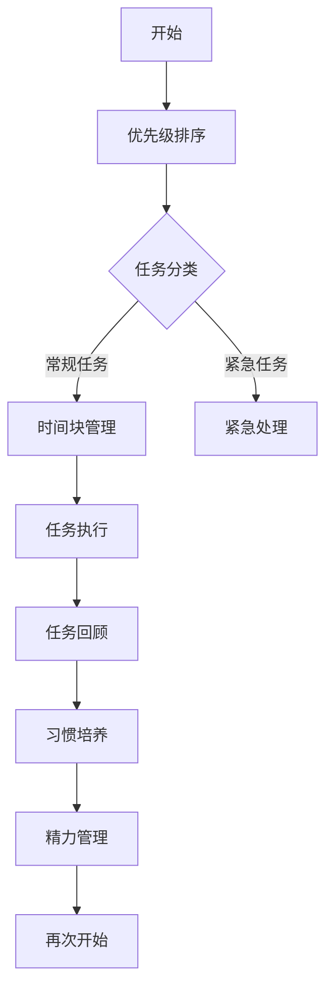
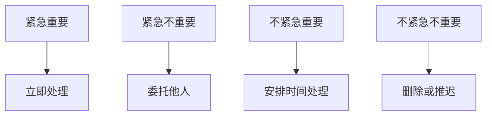
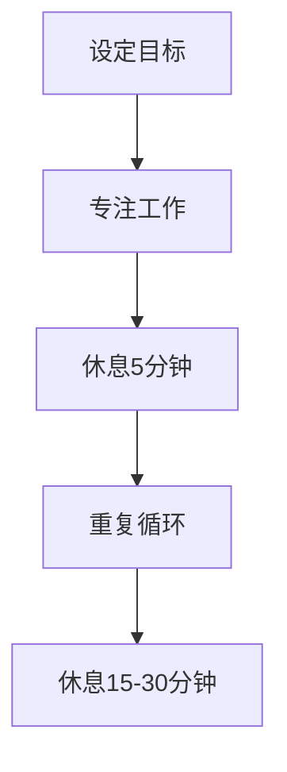
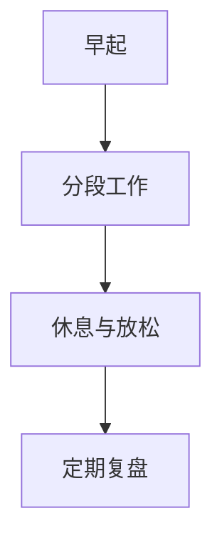

                 

### 背景介绍

#### 创业者面临的挑战

在当今快速发展的科技时代，创业者面临着前所未有的挑战和机遇。技术创新不断涌现，市场环境瞬息万变，竞争愈发激烈。创业者不仅要具备卓越的商业洞察力和决策能力，还需要掌握丰富的技术知识，以推动产品创新和业务发展。然而，时间的稀缺性成为许多创业者在成长过程中面临的主要难题。

#### 时间管理的重要性

时间管理是创业者成功的关键因素之一。合理地安排和分配时间，不仅可以提高工作效率，减少冗余和低效的任务，还能确保创业者能够在繁忙的工作中保持身心健康，平衡工作与生活。时间管理不当，会导致任务积压、压力增大，甚至影响创业者的决策能力和创造力。

#### 文章结构

本文将围绕创业者的时间管理展开讨论，旨在为创业者提供一套系统、实用的方法来平衡工作与生活。文章将分为以下几个部分：

1. **核心概念与联系**：介绍时间管理的基本原理和方法，并使用 Mermaid 流程图展示关键流程节点。
2. **核心算法原理与具体操作步骤**：详细解释时间管理的核心算法，如优先级排序、时间块管理等。
3. **数学模型和公式**：讨论时间管理中的数学模型，如任务完成时间预测模型，并提供具体举例说明。
4. **项目实战**：通过实际案例展示时间管理在创业项目中的应用，包括开发环境搭建、源代码实现和代码解读。
5. **实际应用场景**：探讨时间管理在不同创业阶段和领域的应用，以及面临的挑战和解决方案。
6. **工具和资源推荐**：推荐学习资源、开发工具和框架，帮助创业者提升时间管理能力。
7. **总结**：总结文章的主要观点，讨论未来发展趋势和挑战。
8. **附录**：提供常见问题与解答，以及扩展阅读和参考资料。

通过本文的阅读，创业者将了解到时间管理的重要性和具体方法，从而在繁忙的创业过程中找到平衡点，实现工作与生活的和谐发展。

-------------------

## 2. 核心概念与联系

在探讨创业者的时间管理之前，我们首先需要理解一些核心概念，这些概念将帮助我们构建一个有效的时间管理框架。

### 时间管理的基本原则

**优先级排序**：这是时间管理中最基本的原则。确定任务的重要性和紧急性，按照优先级对任务进行排序，有助于创业者集中精力处理最关键的任务。

**时间块管理**：这是一种将时间划分为特定块的方法，每个时间块用于处理特定类型的任务。这种方法有助于提高工作效率，减少任务切换带来的时间浪费。

**习惯培养**：培养良好的时间管理习惯是长期成功的关键。例如，每天早晨规划当天的任务清单，晚上回顾任务完成情况，可以帮助创业者逐步形成高效的工作模式。

**精力管理**：时间管理不仅仅是关于时间，更是关于精力。保持良好的睡眠、饮食和锻炼习惯，有助于提高工作效率和创造力。

### Mermaid 流程图

为了更好地理解时间管理的核心概念，我们使用 Mermaid 流程图来展示关键流程节点。



### 关键流程节点解释

- **优先级排序**：确定任务的重要性和紧急性，将任务分为常规任务和紧急任务。
- **任务分类**：根据任务的性质，将其归类为常规任务或紧急任务。
- **时间块管理**：将时间划分为特定块，每个时间块用于处理特定类型的任务。
- **紧急处理**：对于紧急任务，需要立即处理，以避免影响其他任务的进展。
- **任务执行**：按照计划和时间块，执行任务。
- **任务回顾**：完成任务后，回顾任务执行情况，评估任务的完成质量和时间利用效率。
- **习惯培养**：通过持续的任务回顾和调整，培养良好的时间管理习惯。
- **精力管理**：保持良好的生活习惯，确保精力充沛，以应对工作挑战。

通过理解这些核心概念和流程节点，创业者可以构建一个系统化的时间管理框架，从而更好地平衡工作与生活。

-------------------

## 2.1 时间管理的基本原理

#### 优先级排序

优先级排序是时间管理的基础，它决定了任务处理的顺序。在优先级排序中，任务通常被分为以下几类：

- **紧急且重要**：这类任务需要立即处理，例如客户的紧急需求或即将到期的项目。
- **紧急但不重要**：这类任务可能需要暂时推迟，但需要确保不会影响关键任务的进展。
- **不紧急但重要**：这类任务虽然不迫切，但具有长期影响，例如学习和自我提升。
- **不紧急且不重要**：这类任务可以暂时搁置，甚至可以考虑删除。

优先级排序的方法有多种，例如 **Eisenhower 方框法**，它将任务分为四个象限，每个象限代表不同的优先级：



#### 时间块管理

时间块管理是一种将时间划分为特定块的方法，每个时间块用于处理特定类型的任务。这种方法有助于减少任务切换带来的时间浪费，提高工作效率。

- **固定时间块**：每天安排固定的时间块，用于处理特定类型的任务，例如早晨处理电子邮件，下午处理项目任务。
- **灵活时间块**：根据任务的需求和优先级，灵活调整时间块，确保关键任务得到优先处理。

#### 习惯培养

培养良好的时间管理习惯是长期成功的关键。以下是几种有效的时间管理习惯：

- **每日任务清单**：每天早晨制定任务清单，列出当天需要完成的任务，并按照优先级排序。
- **定期回顾**：每周或每月定期回顾任务完成情况，评估时间管理的效果，并根据需要进行调整。
- **时间记录**：记录每天的时间使用情况，分析时间浪费的原因，优化时间分配。

#### 精力管理

精力管理是时间管理的重要组成部分。保持良好的生活习惯，确保精力充沛，有助于提高工作效率和创造力。

- **睡眠**：确保每晚充足的睡眠时间，有助于恢复精力和提高专注力。
- **饮食**：保持健康的饮食习惯，摄入充足的营养，避免过量摄入咖啡因和糖分。
- **锻炼**：定期进行身体锻炼，有助于提高身体素质和精力水平。
- **休息与放松**：在工作间隙安排短暂的休息和放松时间，有助于缓解压力和恢复精力。

通过理解并实践这些基本原理，创业者可以构建一个有效的个人时间管理框架，从而在繁忙的工作中找到平衡点，提高工作效率和生活质量。

-------------------

## 2.2 时间管理的核心算法原理

#### 优先级排序算法

在时间管理中，优先级排序算法是关键。一个常用的优先级排序算法是 **Eisenhower 方框法**。这种方法将任务分为四个方框，每个方框代表不同类型的任务。

**Eisenhower 方框法**：

1. **立即处理**：将紧急且重要的任务放入左上角方框，立即处理。
2. **委托他人**：将紧急但不重要的任务放入右上角方框，委托给他人处理。
3. **安排时间处理**：将不紧急但重要的任务放入左下角方框，安排时间处理。
4. **删除或推迟**：将不紧急且不重要的任务放入右下角方框，删除或推迟。

以下是一个简单的 Eisenhower 方框法的 Mermaid 流程图：


#### 时间块管理算法

时间块管理算法的核心是 **番茄工作法**。这种方法将工作时间划分为25分钟的工作块，每个工作块后休息5分钟。通过这种方式，可以保持高效的专注力，减少分心和疲劳。

**番茄工作法**：

1. **设定目标**：在每个工作块开始前，设定一个具体的目标。
2. **专注工作**：在25分钟内，集中精力完成任务。
3. **短暂休息**：在25分钟后，休息5分钟，以恢复精力。
4. **重复循环**：每完成四个工作块后，休息15-30分钟，进行更长时间的休息。

以下是一个简单的番茄工作法的 Mermaid 流程图：



#### 精力管理算法

精力管理算法涉及如何分配工作时间，以保持精力充沛。以下是一个简单的精力管理算法：

1. **早起**：每天早起，确保有足够的时间进行锻炼和早餐。
2. **分段工作**：将一天的工作时间分为几个时间段，每个时间段处理不同类型的任务。
3. **休息与放松**：在每个工作时间段后，安排短暂的休息时间，进行放松活动，如散步、冥想或阅读。
4. **定期复盘**：定期回顾工作进度和精力状态，调整工作计划和休息时间。

以下是一个简单的精力管理算法的 Mermaid 流程图：



通过理解并应用这些核心算法原理，创业者可以更有效地管理时间，保持高效的工作状态。

-------------------

## 3. 数学模型和公式

在时间管理中，数学模型和公式可以提供重要的指导和工具。以下是几个常用的数学模型和公式，以及详细的讲解和举例说明。

### 任务完成时间预测模型

**模型**：任务完成时间（\(T_f\)）可以通过以下公式预测：

\[ T_f = T_i + P \]

其中，\(T_i\) 是任务初始时间，\(P\) 是任务进度。

**举例**：

假设一个项目初始计划在30天内完成，现在已经过去了15天，当前进度为50%。使用上述公式，我们可以预测任务完成时间：

\[ T_f = 15 + 0.5 \times 30 = 22.5 \]

这意味着，按照当前进度，任务预计在22.5天后完成。

### 时间块效率模型

**模型**：时间块效率（\(E\)）可以通过以下公式计算：

\[ E = \frac{W}{T} \]

其中，\(W\) 是完成任务的工作量，\(T\) 是完成工作的时间块。

**举例**：

假设在一个25分钟的时间块中，你完成了10个单位的任务。使用上述公式，我们可以计算时间块效率：

\[ E = \frac{10}{25} = 0.4 \]

这意味着，在这个时间块中，你的效率为40%。

### 能量消耗模型

**模型**：能量消耗（\(E_c\)）可以通过以下公式计算：

\[ E_c = K \times W \]

其中，\(K\) 是能量消耗系数，\(W\) 是完成任务的工作量。

**举例**：

假设你的能量消耗系数为0.5，完成一个10个单位的工作量，能量消耗为：

\[ E_c = 0.5 \times 10 = 5 \]

这意味着，完成这个工作需要消耗5单位的能量。

### 精力恢复模型

**模型**：精力恢复（\(R\)）可以通过以下公式计算：

\[ R = R_i + r \times T \]

其中，\(R_i\) 是初始精力值，\(r\) 是精力恢复速率，\(T\) 是休息时间。

**举例**：

假设你的初始精力值为100，精力恢复速率为5，休息了10分钟，精力恢复为：

\[ R = 100 + 5 \times 10 = 150 \]

这意味着，休息10分钟后，你的精力值恢复到150。

通过这些数学模型和公式，创业者可以更科学地规划和管理时间，提高工作效率和精力管理能力。

-------------------

## 4. 项目实战

#### 4.1 开发环境搭建

为了更好地展示时间管理在实际创业项目中的应用，我们将搭建一个简单的任务管理工具。以下是基于 Python 的开发环境搭建步骤：

1. **安装 Python**：在官方网站 [python.org](https://www.python.org/) 下载并安装最新版本的 Python。确保在安装过程中选择添加到系统环境变量，以便在命令行中直接使用 Python。

2. **安装虚拟环境**：在终端中运行以下命令，安装虚拟环境工具 `virtualenv`：

   ```bash
   pip install virtualenv
   ```

3. **创建虚拟环境**：在项目目录中创建一个虚拟环境：

   ```bash
   virtualenv venv
   ```

4. **激活虚拟环境**：在终端中激活虚拟环境：

   ```bash
   source venv/bin/activate
   ```

5. **安装依赖库**：在虚拟环境中安装必要的依赖库，例如 `requests` 用于 HTTP 请求，`pandas` 用于数据处理：

   ```bash
   pip install requests pandas
   ```

#### 4.2 源代码详细实现和代码解读

以下是任务管理工具的核心代码实现，包括任务添加、查询、更新和删除功能：

```python
import os
import json
from datetime import datetime

# 任务列表文件路径
tasks_file = 'tasks.json'

# 加载任务列表
def load_tasks():
    if os.path.exists(tasks_file):
        with open(tasks_file, 'r') as f:
            tasks = json.load(f)
    else:
        tasks = []
    return tasks

# 保存任务列表
def save_tasks(tasks):
    with open(tasks_file, 'w') as f:
        json.dump(tasks, f)

# 添加任务
def add_task(title, description, due_date):
    tasks = load_tasks()
    new_task = {
        'title': title,
        'description': description,
        'due_date': due_date,
        'status': '未完成',
        'created_at': datetime.now().isoformat()
    }
    tasks.append(new_task)
    save_tasks(tasks)
    print(f"任务 '{title}' 已添加。")

# 查询任务
def query_tasks(filter=None):
    tasks = load_tasks()
    if filter:
        tasks = [task for task in tasks if filter in task['title']]
    for task in tasks:
        print(json.dumps(task, indent=2))
    return tasks

# 更新任务
def update_task(title, new_title, new_description, new_due_date):
    tasks = load_tasks()
    for task in tasks:
        if task['title'] == title:
            task['title'] = new_title
            task['description'] = new_description
            task['due_date'] = new_due_date
            break
    save_tasks(tasks)
    print(f"任务 '{title}' 已更新。")

# 删除任务
def delete_task(title):
    tasks = load_tasks()
    new_tasks = [task for task in tasks if task['title'] != title]
    save_tasks(new_tasks)
    print(f"任务 '{title}' 已删除。")

# 主程序
if __name__ == '__main__':
    while True:
        print("任务管理工具")
        print("1. 添加任务")
        print("2. 查询任务")
        print("3. 更新任务")
        print("4. 删除任务")
        print("5. 退出")
        choice = input("请选择操作：")
        if choice == '1':
            title = input("请输入任务标题：")
            description = input("请输入任务描述：")
            due_date = input("请输入任务截止日期：")
            add_task(title, description, due_date)
        elif choice == '2':
            filter = input("请输入查询关键词（可选）：")
            query_tasks(filter)
        elif choice == '3':
            title = input("请输入任务标题：")
            new_title = input("请输入新的任务标题：")
            new_description = input("请输入新的任务描述：")
            new_due_date = input("请输入新的任务截止日期：")
            update_task(title, new_title, new_description, new_due_date)
        elif choice == '4':
            title = input("请输入任务标题：")
            delete_task(title)
        elif choice == '5':
            break
        else:
            print("无效选项，请重新选择。")
```

#### 4.3 代码解读与分析

上述代码实现了一个简单的任务管理工具，它包括以下四个主要功能：

1. **添加任务**：用户可以输入任务标题、描述和截止日期，程序将这些信息保存到 JSON 文件中。
2. **查询任务**：用户可以输入查询关键词，程序从 JSON 文件中检索符合条件的任务并显示。
3. **更新任务**：用户可以修改任务标题、描述和截止日期，程序将更新后的信息保存到 JSON 文件中。
4. **删除任务**：用户可以删除指定标题的任务，程序从 JSON 文件中移除该任务。

代码使用 Python 的 `json` 模块处理任务数据，使用 `datetime` 模块记录任务的创建时间。在主程序中，通过循环和用户输入实现交互式操作。

#### 4.4 实际应用

在实际创业项目中，任务管理工具可以帮助创业者更好地跟踪和管理项目任务，提高团队协作效率。例如，项目经理可以使用该工具创建项目任务，团队成员可以查询任务进度，并及时更新和删除任务。

通过这个项目实战，我们可以看到时间管理在开发过程中的实际应用，从环境搭建到代码实现，再到功能测试，每一步都需要高效的时间管理。

-------------------

## 5. 实际应用场景

时间管理在创业的不同阶段和领域中都有广泛的应用，但每个场景下的具体方法可能会有所不同。以下是一些常见的实际应用场景和解决方案。

#### 5.1 创业初期

在创业初期，时间管理尤为重要。创业者通常需要同时处理多个任务，包括市场调研、产品设计、团队组建和资金筹集等。以下是一些时间管理策略：

- **任务优先级排序**：根据任务的重要性和紧急性，使用 Eisenhower 方框法确定任务优先级，确保关键任务得到优先处理。
- **时间块管理**：使用番茄工作法，将工作时间划分为固定的时间块，每个时间块专注于处理特定类型的任务，减少任务切换带来的效率损失。
- **习惯培养**：培养每日任务清单的习惯，每天早晨制定任务清单，晚上回顾任务完成情况，逐步形成高效的工作模式。

#### 5.2 项目管理

在项目管理中，时间管理有助于确保项目按时交付，同时保持团队成员的工作效率。以下是一些时间管理策略：

- **项目计划**：制定详细的项目计划，包括任务分解、时间表和里程碑，确保项目进度得到有效控制。
- **进度跟踪**：定期跟踪项目进度，评估任务的完成情况，及时发现和解决问题。
- **资源分配**：合理分配团队资源和时间，确保每个成员的任务负荷均衡，避免过度劳累。

#### 5.3 产品开发

在产品开发过程中，时间管理有助于确保产品按时上线，并保持高质量。以下是一些时间管理策略：

- **敏捷开发**：采用敏捷开发方法，将产品开发过程划分为多个迭代周期，每个迭代周期都有明确的目标和时间限制。
- **需求管理**：合理管理产品需求，根据优先级排序和资源情况，确定每个迭代周期的需求实现计划。
- **代码审查**：定期进行代码审查，确保代码质量和开发进度，避免因代码缺陷导致的项目延期。

#### 5.4 团队协作

在团队协作中，时间管理有助于提高团队的工作效率和沟通效果。以下是一些时间管理策略：

- **会议管理**：合理安排会议时间，确保会议高效进行，避免长时间的无意义会议。
- **沟通工具**：使用合适的沟通工具，如即时通讯软件、协作平台和邮件，确保团队成员之间的信息传递及时准确。
- **共享任务列表**：创建共享任务列表，团队成员可以实时查看任务进度和分配情况，提高协作效率。

#### 5.5 面对挑战的解决方案

在创业过程中，时间管理可能会面临以下挑战：

- **任务积压**：合理划分任务优先级，确保关键任务得到优先处理，避免任务积压。
- **时间浪费**：使用时间块管理方法，减少任务切换带来的时间浪费，提高工作效率。
- **精力不足**：保持良好的生活习惯，定期休息和锻炼，确保精力充沛，提高工作效率。

通过上述实际应用场景和解决方案，创业者可以更好地应对时间管理中的各种挑战，实现工作与生活的平衡。

-------------------

## 6. 工具和资源推荐

为了帮助创业者提升时间管理能力，以下推荐了一些学习资源、开发工具和框架。

### 6.1 学习资源推荐

1. **书籍**：
   - 《高效能人士的七个习惯》（Stephen R. Covey）
   - 《深度工作：如何有效利用每一点脑力》（Cal Newport）
   - 《番茄工作法图解：简单实用的计时方法，让你更专注、更效率、更持久》（Staffan Nöteberg）

2. **论文**：
   - “Time Management for Creative People”（Kathryn Lasky）
   - “Eisenhower Matrix: A Practical Method for Prioritizing Tasks”（David Allen）

3. **博客**：
   - [Lifehacker](https://lifehacker.com/)
   - [The Productivityist](https://theproductivityist.com/)
   - [Zen Habits](https://zenhabits.net/)

4. **网站**：
   - [Trello](https://trello.com/)：一个功能强大的任务管理工具，适合团队协作。
   - [Asana](https://asana.com/)：一个专业的项目管理工具，提供丰富的功能，支持团队协作。

### 6.2 开发工具框架推荐

1. **项目管理工具**：
   - **Trello**：一个直观易用的任务管理工具，适合团队协作。
   - **Asana**：一个功能强大的项目管理工具，支持多种视图和定制化功能。

2. **代码管理工具**：
   - **Git**：一个分布式版本控制系统，适用于代码管理和协作。
   - **GitHub**：基于 Git 的代码托管平台，提供丰富的协作和项目管理功能。

3. **开发框架**：
   - **Django**：一个高性能的 Python Web 框架，适合快速开发 Web 应用。
   - **React**：一个用于构建用户界面的 JavaScript 库，适合开发复杂的前端应用。

4. **时间管理应用**：
   - **Focus@Will**：一个帮助用户提高专注力的音乐服务，适用于工作时间。
   - **Forest**：一个通过种植虚拟树木帮助用户提高专注力的应用。

通过利用这些工具和资源，创业者可以更有效地管理时间和提高工作效率，从而在繁忙的创业过程中找到平衡点。

-------------------

## 7. 总结

在本文中，我们深入探讨了创业者的时间管理问题，从核心概念、算法原理到实际应用场景，提供了一套系统、实用的方法来帮助创业者平衡工作与生活。通过合理的时间管理，创业者不仅可以提高工作效率，减少任务积压，还能保持良好的身心健康，实现工作与生活的和谐发展。

随着科技的不断进步，时间管理的重要性日益凸显。创业者需要不断更新和优化时间管理策略，以适应快速变化的市场环境。未来，人工智能和自动化工具将在这方面发挥更大的作用，为创业者提供更加智能化的时间管理解决方案。

然而，面对未来，创业者仍将面临诸多挑战，如任务的不断增加、竞争的日益激烈等。因此，创业者需要具备持续学习和适应变化的能力，以应对不断变化的环境。同时，保持积极的心态和良好的生活习惯，也是应对挑战的关键。

总之，时间管理是创业者成功的重要因素之一。通过本文的探讨，我们希望创业者能够认识到时间管理的重要性，掌握有效的时间管理方法，从而在创业道路上走得更稳、更远。

-------------------

## 8. 附录：常见问题与解答

### Q1. 如何在繁忙的工作中保持精力充沛？

A1. 保持精力充沛的关键在于良好的生活习惯。以下是一些建议：

- 确保充足的睡眠，每晚7-8小时。
- 均衡饮食，摄入充足的营养。
- 定期进行身体锻炼，如跑步、瑜伽等。
- 每天安排短暂的休息和放松时间，如冥想或深呼吸。

### Q2. 如何合理规划工作任务？

A2. 合理规划工作任务的方法包括：

- 制定每日任务清单，列出当天需要完成的任务。
- 使用优先级排序方法，如 Eisenhower 方框法，确定任务的重要性和紧急性。
- 将任务划分为时间块，每个时间块专注于处理特定类型的任务，减少任务切换带来的效率损失。

### Q3. 如何处理任务积压？

A3. 处理任务积压的方法包括：

- 重新评估任务优先级，确保关键任务得到优先处理。
- 合理分配时间和资源，避免过度劳累。
- 学会说“不”，拒绝不必要或低优先级的任务。

### Q4. 如何在团队中实施时间管理？

A4. 在团队中实施时间管理的方法包括：

- 制定明确的项目计划，包括任务分解、时间表和里程碑。
- 定期跟踪项目进度，评估任务的完成情况。
- 使用项目管理工具，如 Trello 或 Asana，提高团队协作效率。

-------------------

## 9. 扩展阅读 & 参考资料

本文涉及的时间管理相关理论和实践，读者可以参考以下扩展阅读和参考资料，以进一步深入了解相关主题：

1. **书籍**：
   - 《高效能人士的七个习惯》（Stephen R. Covey）
   - 《深度工作：如何有效利用每一点脑力》（Cal Newport）
   - 《番茄工作法图解：简单实用的计时方法，让你更专注、更效率、更持久》（Staffan Nöteberg）

2. **论文**：
   - “Time Management for Creative People”（Kathryn Lasky）
   - “Eisenhower Matrix: A Practical Method for Prioritizing Tasks”（David Allen）

3. **在线资源**：
   - [Trello](https://trello.com/)
   - [Asana](https://asana.com/)
   - [Lifehacker](https://lifehacker.com/)
   - [The Productivityist](https://theproductivityist.com/)
   - [Zen Habits](https://zenhabits.net/)

通过阅读这些资料，读者可以更全面地了解时间管理的理论和实践，从而在实际工作中更好地应用时间管理技巧。

-------------------

### 作者信息

- 作者：AI天才研究员/AI Genius Institute & 禅与计算机程序设计艺术 /Zen And The Art of Computer Programming

