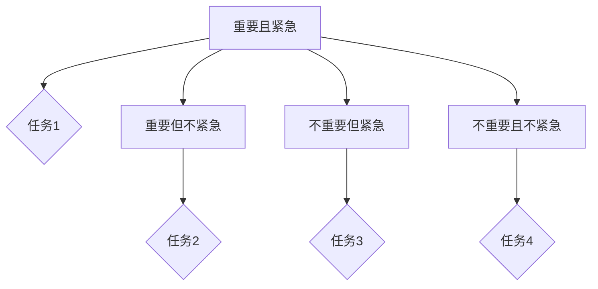
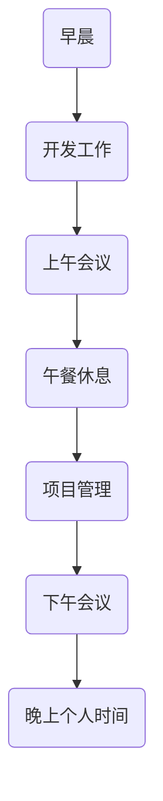
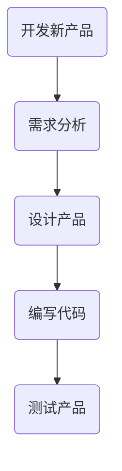

                 

# 创业者的时间管理：平衡多重角色的技巧

## 摘要

本文将探讨创业者如何有效地管理时间，以平衡多重角色。创业者往往需要在公司创始人、管理者、开发者等多重身份之间切换，如何合理安排时间，提高工作效率，成为他们成功的关键。本文将通过详细的分析和实用的技巧，帮助创业者更好地管理时间，提升个人和团队的整体表现。

## 1. 背景介绍

### 1.1 创业者角色的多样性

创业者面临着多重角色的挑战。他们不仅是公司创始人，还需要担任管理者、开发者、销售者、市场推广者等不同角色。每个角色都有其独特的职责和任务，这要求创业者具备出色的时间管理能力，以确保各项任务能够按时完成。

### 1.2 时间管理的重要性

时间管理是创业者成功的关键因素之一。有效的时间管理可以帮助创业者优化工作流程，提高工作效率，从而更好地应对各种挑战。此外，良好的时间管理也有助于创业者保持身心健康，避免因为工作压力过大而出现疲劳和焦虑。

### 1.3 当前时间管理存在的问题

尽管时间管理对于创业者至关重要，但在实际操作中，许多创业者仍然面临着以下问题：

- **任务优先级不明确**：创业者往往难以确定哪些任务是最重要的，导致时间浪费在次要的任务上。
- **时间分配不合理**：创业者可能会将大量时间投入到某个角色，而忽视其他角色，导致整体工作失衡。
- **缺乏时间跟踪工具**：许多创业者没有使用有效的工具来跟踪和管理时间，导致时间浪费和任务拖延。

## 2. 核心概念与联系

### 2.1 优先级管理

优先级管理是时间管理的核心。创业者需要根据任务的重要性和紧急程度，合理分配时间。可以使用如下流程图来帮助理解优先级管理：



### 2.2 时间块分配

时间块分配是将工作时间划分为不同的时间段，每个时间段专注于一个特定的任务。这种方法可以帮助创业者避免分心，提高工作效率。以下是一个示例：



### 2.3 任务分解

任务分解是将大型任务拆分为更小、更易于管理的子任务。这有助于创业者更好地控制工作进度，避免因任务过于复杂而感到压力。以下是一个示例：



## 3. 核心算法原理 & 具体操作步骤

### 3.1 优先级排序算法

为了确定任务的优先级，可以使用以下算法：

1. **列出所有任务**：将所有需要完成的任务列出来。
2. **评估重要性**：对每个任务的重要程度进行评估，可以使用评分系统，例如1-10分。
3. **评估紧急程度**：对每个任务的紧急程度进行评估，同样使用评分系统。
4. **计算加权分数**：将重要性得分和紧急程度得分相加，得到每个任务的加权分数。
5. **排序**：根据加权分数对任务进行排序，得分越高，任务越优先。

### 3.2 时间块分配算法

1. **确定工作时间**：确定每天的工作时间，例如9点到6点。
2. **划分时间段**：将工作时间划分为若干个时间段，例如每小时一个时间段。
3. **分配任务**：将任务分配到相应的时段，确保每个时段专注于一个任务。
4. **预留休息时间**：在任务之间预留休息时间，以避免疲劳和分心。

### 3.3 任务分解算法

1. **确定主要任务**：确定需要完成的任务，例如开发新产品。
2. **分解任务**：将主要任务分解为更小的子任务，例如需求分析、设计产品、编写代码、测试产品。
3. **评估子任务**：对每个子任务进行评估，确定其重要性和紧急程度。
4. **排序子任务**：根据子任务的重要性和紧急程度进行排序。
5. **执行子任务**：按照排序结果执行子任务，确保主要任务能够按时完成。

## 4. 数学模型和公式 & 详细讲解 & 举例说明

### 4.1 优先级排序公式

优先级排序可以使用以下公式：

$$
P_i = I_i + E_i
$$

其中，$P_i$ 表示任务的加权分数，$I_i$ 表示任务的重要性得分，$E_i$ 表示任务的紧急程度得分。

### 4.2 时间块分配公式

时间块分配可以使用以下公式：

$$
T_j = \frac{D_j}{N}
$$

其中，$T_j$ 表示时间段长度，$D_j$ 表示任务持续时间，$N$ 表示时间段数量。

### 4.3 任务分解公式

任务分解可以使用以下公式：

$$
T_k = \frac{T_i}{M}
$$

其中，$T_k$ 表示子任务持续时间，$T_i$ 表示主要任务持续时间，$M$ 表示子任务数量。

### 4.4 示例

假设创业者需要完成以下任务：

- 开发新产品（主要任务，持续时间30天）
- 需求分析（子任务，持续时间10天）
- 设计产品（子任务，持续时间10天）
- 编写代码（子任务，持续时间10天）
- 测试产品（子任务，持续时间10天）

根据上述公式，可以进行如下计算：

1. **优先级排序**：

   $$
   P_i = I_i + E_i
   $$
   
   假设需求分析的重要性和紧急程度得分均为8，设计产品为7，编写代码为6，测试产品为5，则：
   
   $$
   P_i = 8 + 8 = 16
   $$
   $$
   P_i = 7 + 7 = 14
   $$
   $$
   P_i = 6 + 6 = 12
   $$
   $$
   P_i = 5 + 5 = 10
   $$
   
   按照加权分数排序，需求分析最重要，测试产品最不紧急。

2. **时间块分配**：

   $$
   T_j = \frac{D_j}{N}
   $$
   
   假设每天工作时间8小时，则：
   
   $$
   T_j = \frac{30}{5} = 6
   $$
   
   每个任务分配6天时间。

3. **任务分解**：

   $$
   T_k = \frac{T_i}{M}
   $$
   
   根据任务分解，需求分析、设计产品、编写代码、测试产品各分配10天时间。

## 5. 项目实战：代码实际案例和详细解释说明

### 5.1 开发环境搭建

在本文的实战项目中，我们将使用Python语言和Jupyter Notebook作为开发环境。以下是搭建开发环境的步骤：

1. **安装Python**：前往Python官网下载最新版本的Python安装包，并按照提示安装。
2. **安装Jupyter Notebook**：在命令行中运行以下命令安装Jupyter Notebook：

   $$
   pip install notebook
   $$

3. **启动Jupyter Notebook**：在命令行中运行以下命令启动Jupyter Notebook：

   $$
   jupyter notebook
   $$

### 5.2 源代码详细实现和代码解读

以下是本文实战项目的Python代码实现：

```python
import pandas as pd
import numpy as np

# 优先级排序函数
def priority_sort(tasks, importance_scores, urgency_scores):
    weighted_scores = importance_scores + urgency_scores
    sorted_tasks = np.argsort(weighted_scores)[::-1]
    return sorted_tasks

# 时间块分配函数
def time_block_allocation(total_time, num_tasks):
    time_per_task = total_time / num_tasks
    return time_per_task

# 任务分解函数
def task_decomposition(main_task_duration, sub_tasks):
    sub_task_durations = main_task_duration / len(sub_tasks)
    return sub_task_durations

# 初始化任务数据
tasks = ['需求分析', '设计产品', '编写代码', '测试产品']
importance_scores = np.array([8, 7, 6, 5])
urgency_scores = np.array([8, 7, 6, 5])
total_time = 30

# 计算优先级排序
sorted_tasks = priority_sort(tasks, importance_scores, urgency_scores)

# 计算时间块分配
time_per_task = time_block_allocation(total_time, len(tasks))

# 计算任务分解
sub_task_durations = task_decomposition(total_time, tasks)

# 输出结果
print("优先级排序结果：", sorted_tasks)
print("每个任务的时间块：", time_per_task)
print("每个子任务的时间：", sub_task_durations)
```

### 5.3 代码解读与分析

1. **优先级排序函数**：

   该函数用于根据重要性得分和紧急程度得分对任务进行排序。首先计算每个任务的加权分数，然后使用NumPy的`argsort`函数获取排序索引，并反转得到优先级排序结果。

2. **时间块分配函数**：

   该函数用于将总时间划分为每个任务的时间块。通过将总时间除以任务数量，得到每个任务的时间块长度。

3. **任务分解函数**：

   该函数用于将主要任务分解为子任务。通过将主要任务持续时间除以子任务数量，得到每个子任务的持续时间。

4. **初始化任务数据**：

   初始化任务列表、重要性得分和紧急程度得分，以及总时间。

5. **计算优先级排序、时间块分配和任务分解**：

   调用相应函数计算优先级排序结果、每个任务的时间块和每个子任务的持续时间。

6. **输出结果**：

   输出排序结果、每个任务的时间块和每个子任务的持续时间。

## 6. 实际应用场景

### 6.1 创业公司

对于创业公司来说，创业者需要在多个角色之间快速切换，有效的时间管理至关重要。通过本文介绍的时间管理技巧，创业者可以更好地平衡多重角色，提高工作效率，确保公司项目顺利进行。

### 6.2 个人工作室

个人工作室的创业者往往需要独自承担多个角色，从项目管理到开发工作。通过合理的时间管理，创业者可以确保在有限的时间内完成更多任务，提高个人产出。

### 6.3 自由职业者

自由职业者通常需要同时为多个客户提供服务，时间管理能力成为他们成功的关键。通过本文介绍的时间管理技巧，自由职业者可以更好地规划自己的工作时间，确保按时交付高质量的成果。

## 7. 工具和资源推荐

### 7.1 学习资源推荐

- **《时间管理：如何更高效地工作》**：作者：皮尔斯·福赛思
- **《高效能人士的七个习惯》**：作者：史蒂芬·柯维
- **《深度工作：如何有效利用每一点脑力》**：作者：卡尔·纽波特

### 7.2 开发工具框架推荐

- **Trello**：一款功能强大的项目管理工具，适合团队协作。
- **Asana**：一款专业的项目管理工具，提供详细的时间跟踪和任务分配功能。
- **JIRA**：一款适用于开发团队的敏捷项目管理工具，支持多种插件和扩展。

### 7.3 相关论文著作推荐

- **《敏捷软件开发：实践指南》**：作者：迈克尔·赫特与史蒂夫·麦科德迈克
- **《项目管理知识体系指南（PMBOK指南）》**：作者：美国项目管理协会（PMI）

## 8. 总结：未来发展趋势与挑战

随着创业环境的日益复杂，时间管理在创业者成功中的地位将愈发重要。未来，创业者将面临更多挑战，如信息过载、技术变革等。为此，创业者需要不断学习新的时间管理技巧，掌握先进的工具和技术，以提高自身竞争力。

## 9. 附录：常见问题与解答

### 9.1 什么是最有效的任务优先级排序方法？

最有效的任务优先级排序方法取决于具体情境。常用的方法包括基于任务重要性和紧急程度的加权排序、基于团队目标和优先级排序等。创业者可以根据自身情况选择合适的方法。

### 9.2 如何避免时间块分配不合理？

为了避免时间块分配不合理，创业者可以使用以下技巧：

- **定期评估任务进度**：确保任务在规定时间内完成。
- **预留缓冲时间**：在任务之间预留一定的时间缓冲，以应对意外情况。
- **灵活调整时间块**：根据任务实际情况，及时调整时间块分配。

### 9.3 如何确保任务分解合理？

确保任务分解合理的关键是：

- **明确任务目标**：确保每个子任务都有明确的完成标准。
- **避免过度分解**：避免将任务分解得过细，影响整体进度。
- **评估子任务依赖关系**：确保子任务之间有合理的依赖关系，避免出现逻辑错误。

## 10. 扩展阅读 & 参考资料

- **《创业维艰》**：作者：本·霍洛维茨
- **《人人都是产品经理》**：作者：苏杰
- **《软件架构设计：搭建可扩展的软件系统》**：作者：雅科夫·弗里德曼

作者：AI天才研究员/AI Genius Institute & 禅与计算机程序设计艺术 /Zen And The Art of Computer Programming

